# Database Entity–Relationship Diagram

All tables live in the `public` schema; owner is `admin`. The database has **125 tables** organised into several
functional domains. Only 5 formal FK constraints exist — most relationships are enforced at the application level via
matching column names.

---

## Domain 1 — Core Procurement (Voratinklis graph)

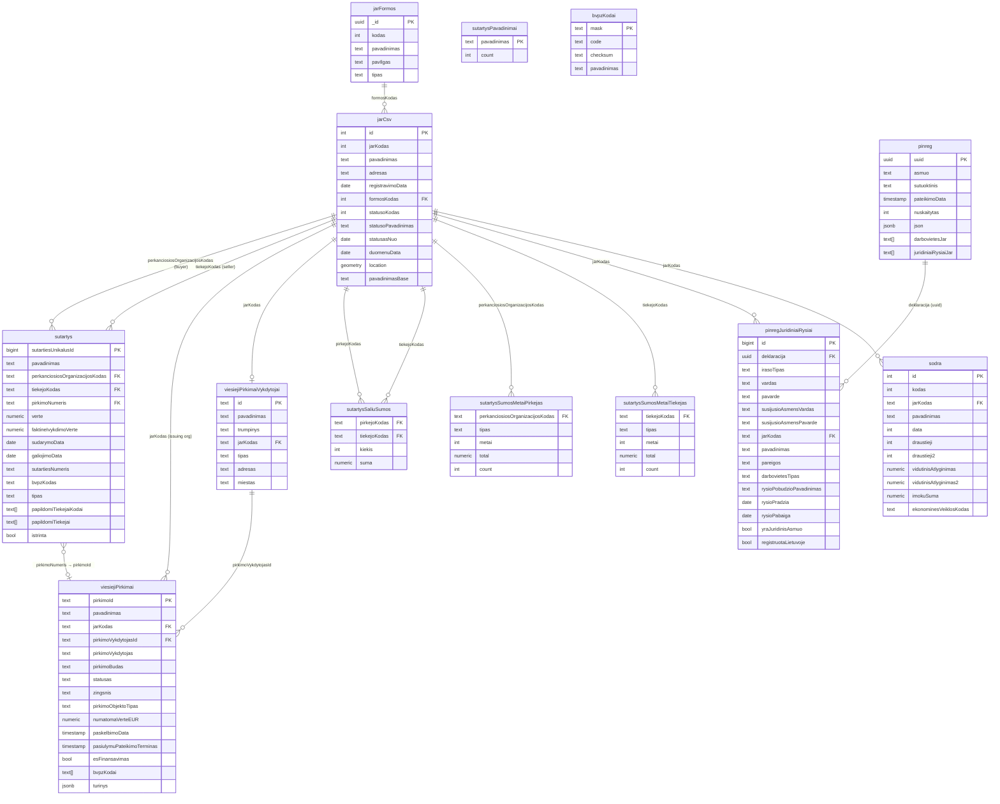

---

## Domain 2 — Company Financial & Registry

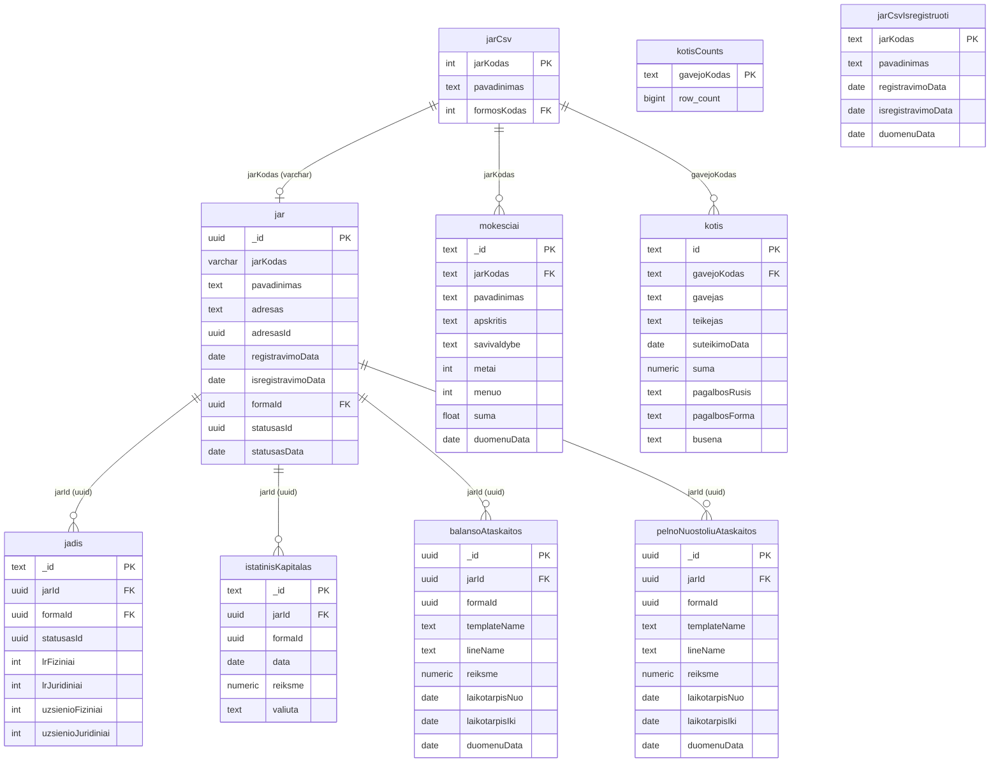

---

## Domain 3 — ATN1 Procurement Reports

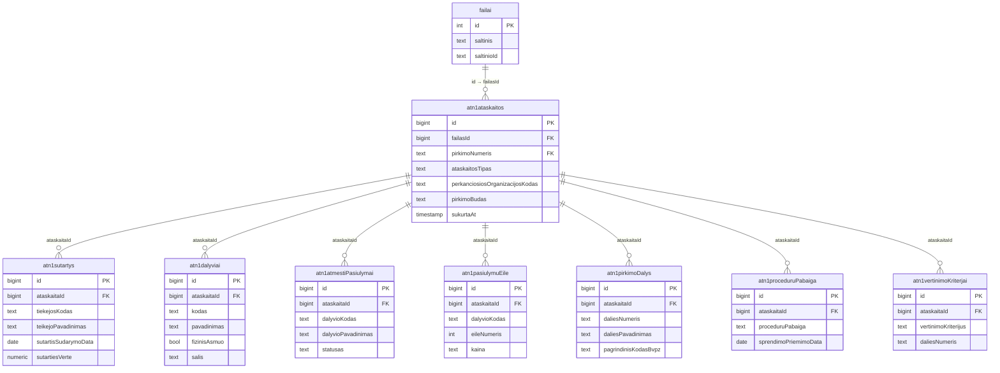

---

## Domain 4 — Documents & Files

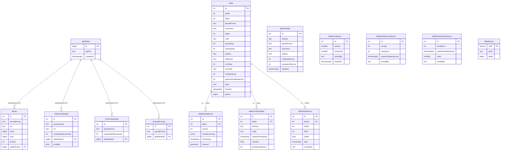

---

## Domain 5 — Court Cases

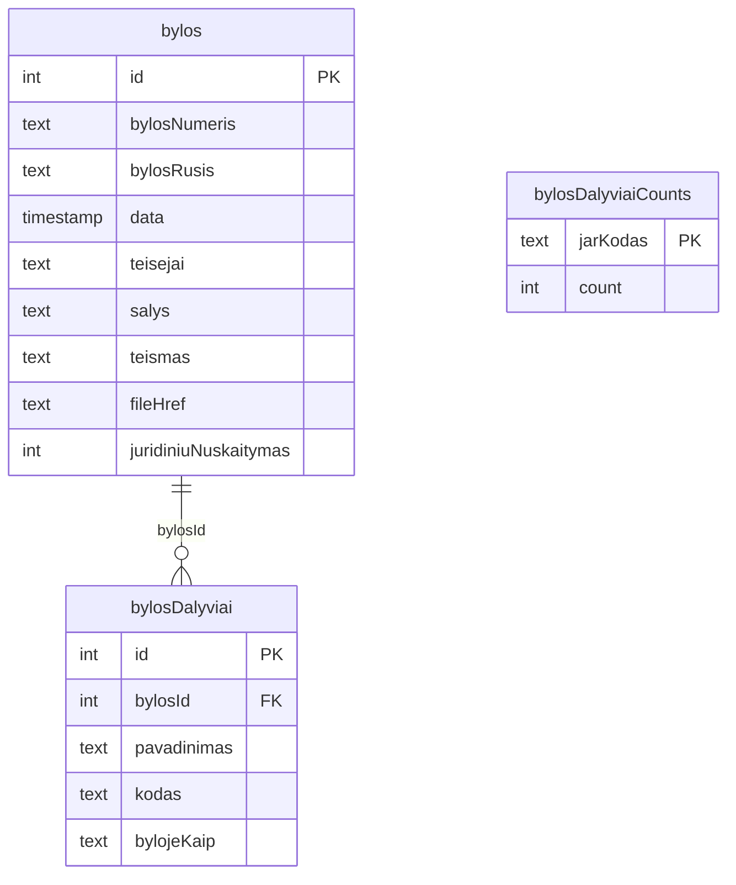

---

## Domain 6 — Address Registry (AR / Adresy registras)

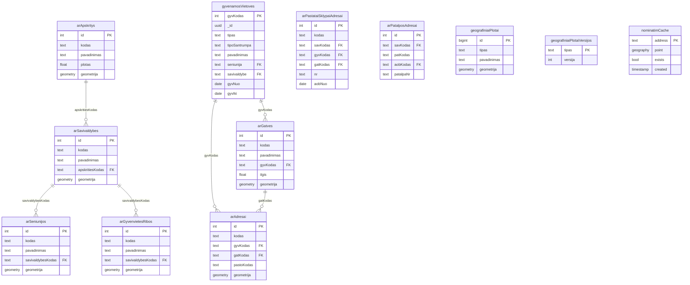

---

## Domain 7 — SABIS (Government Accounting System)

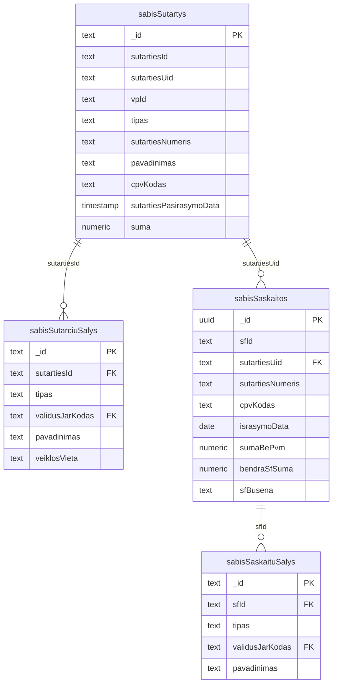

---

## Domain 8 — Domains / Web

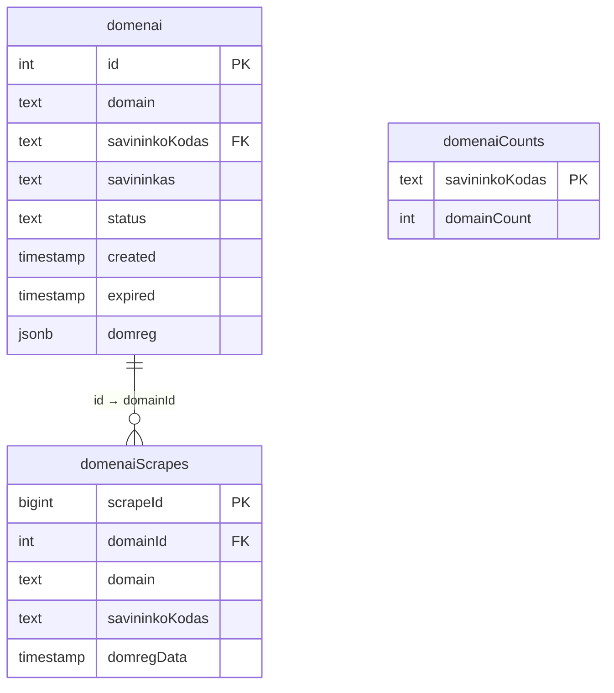

---

## Domain 9 — Quickwit Full-Text Search Infrastructure

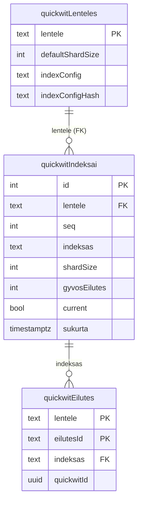

---

## Domain 10 — EU Projects & Investments

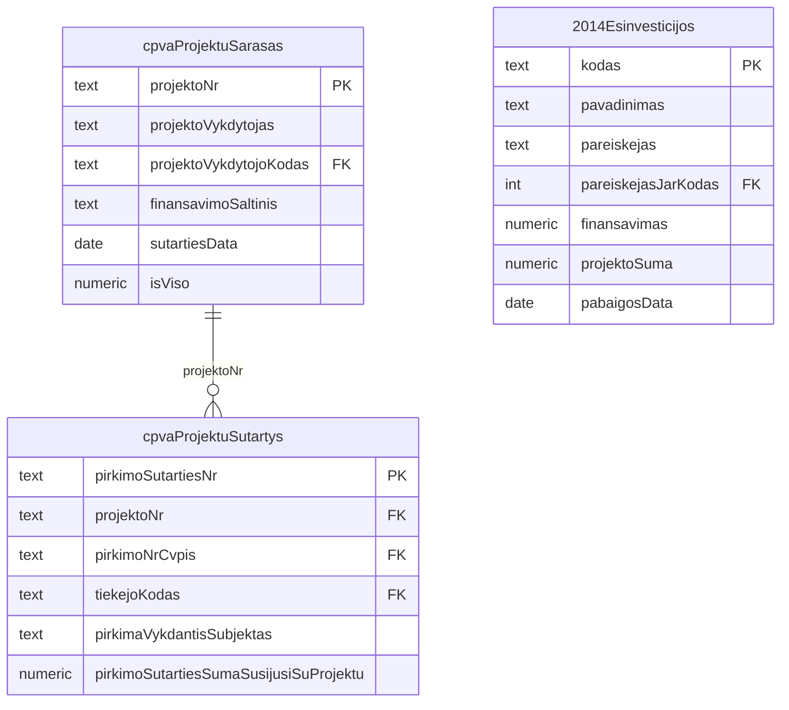

---

## Domain 11 — Regulatory & Compliance

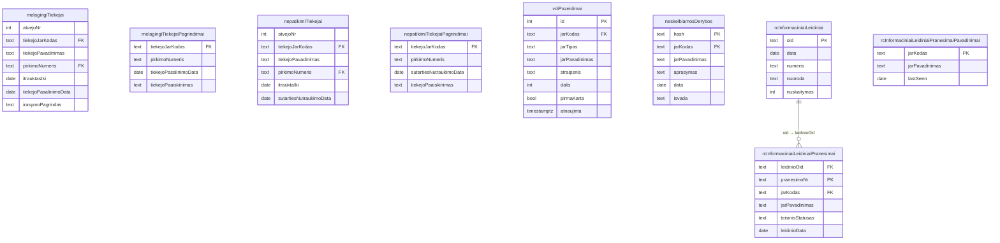

---

## Domain 12 — Other Data Sources

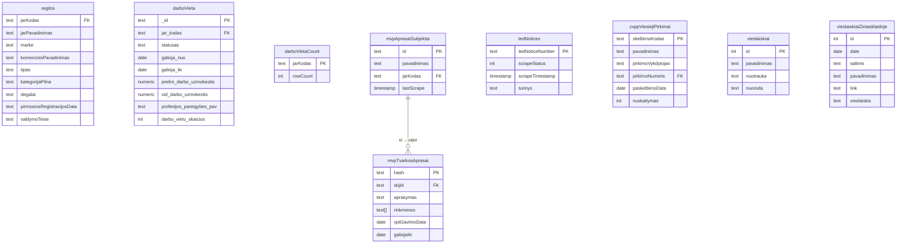

---

## Infrastructure / Queue Tables

```mermaid
erDiagram
    mcpToolCalls {
        bigint id PK
        text toolName
        int durationMs
        bool success
        text errorMsg
        text userAgent
        timestamptz createdAt
    }

    statistika {
        int id PK
        timestamp timestamp
        jsonb data
    }

    eiluciuSkaiciai {
        text tableName PK
        bigint rowCount
    }

    eksportai {
        int id PK
        text pavadinimas
        text link
        bytea torrent
        date data
        float dydisMB
    }

    adpChanges {
        text dataset PK
        bigint lastCid
        uuid lastId
        uuid lastRevision
        timestamptz lastCheckedAt
    }

    scrapeProxies {
        int id PK
        text type
        text name
        text url
        bool enabled
        text site
    }

    eviesiejipirkimaiGedimai {
        int id PK
        timestamp timestamp
        text tipas
    }

    sutartysSudarymoDatos {
        date sudarymoData PK
        int count
        timestamp scrapeTimestamp
        int scrapeResultCount
        int scrapes
    }

    sutartysAtviriDuomenys {
        bigint dokId PK
        text dokSutNumeris
        text dokPirkimoNumeris FK
        text pvKodas FK
        text tiekKodas FK
        date dokSudarymoData
        date dokSutGaliojimoData
        numeric dokFaktSutIvykVerte
    }

    failaiOcrRezultataiStatsDay {
        date date PK
        int results
        int pages
        int words
    }

    failaiOcrRezultataiStatsDayNode {
        date date PK
        text node
        int results
        int pages
        int words
    }

    failaiStatsExtension {
        text extension PK
        int count
    }

    failaiOcrStats {
        text tipas PK
        int count
        int ocrState
    }

    failaiCounts {
        text metrika PK
        text eilute PK
        float verte
    }
```

---

## All Tables — Full Inventory

Tables are grouped by domain. Columns shown as `name : type`.

### Company Registry

| Table                      | Key Columns                                                                                                                                                                                                                                            | Notes                                                                           |
|----------------------------|--------------------------------------------------------------------------------------------------------------------------------------------------------------------------------------------------------------------------------------------------------|---------------------------------------------------------------------------------|
| `jarCsv`                   | `id` int PK, `jarKodas` int (app PK), `pavadinimas`, `adresas`, `registravimoData` date, `formosKodas` int FK→jarFormos, `statusoKodas` int, `statusoPavadinimas`, `statusasNuo` date, `duomenuData` date, `location` geometry, `pavadinimasBase` text | Main company registry. `jarKodas` is the universal join key throughout the app. |
| `jarFormos`                | `_id` uuid PK, `kodas` int, `pavadinimas`, `pavIlgas`, `tipas`, `name`, `type`                                                                                                                                                                         | Legal entity form lookup.                                                       |
| `jar`                      | `_id` uuid PK, `jarKodas` varchar, `pavadinimas`, `adresas`, `adresasId` uuid, `registravimoData` date, `isregistravimoData` date, `formaId` uuid, `statusasId` uuid, `statusasData` date                                                              | UUID-based JAR data from JADIS (supplementary).                                 |
| `jadis`                    | `_id` text PK, `jarId` uuid FK→jar, `formaId` uuid, `statusasId` uuid, `lrFiziniai` int, `lrJuridiniai` int, `uzsienioFiziniai` int, `uzsienioJuridiniai` int                                                                                          | Shareholder structure from JADIS.                                               |
| `istatinisKapitalas`       | `_id` text PK, `jarId` uuid FK→jar, `formaId` uuid, `data` date, `reiksme` numeric, `valiuta` text                                                                                                                                                     | Registered capital history.                                                     |
| `balansoAtaskaitos`        | `_id` uuid PK, `jarId` uuid FK→jar, `templateId`, `templateName`, `lineName`, `reiksme` numeric, `laikotarpisNuo` date, `laikotarpisIki` date, `duomenuData` date                                                                                      | Balance sheet financial reports.                                                |
| `pelnoNuostoliuAtaskaitos` | `_id` uuid PK, `jarId` uuid FK→jar, `templateName`, `lineName`, `reiksme` numeric, `laikotarpisNuo` date, `laikotarpisIki` date, `duomenuData` date                                                                                                    | Profit & loss financial reports.                                                |
| `jarCsvIsregistruoti`      | `jarKodas` text PK, `pavadinimas`, `adresas`, `registravimoData` date, `isregistravimoData` date, `duomenuData` date                                                                                                                                   | Deregistered companies archive.                                                 |
| `jarCsvLocationTiles`      | `zoom` smallint, `tileX` int, `tileY` int, `pointCount` int                                                                                                                                                                                            | Pre-computed tile counts for map rendering.                                     |
| `jarCsvTopAdresai`         | `adresas` text PK, `count` int                                                                                                                                                                                                                         | Top company addresses by frequency.                                             |
| `sodra`                    | `id` int PK, `jarKodas` text FK→jarCsv, `data` int (YYYYMM), `draustieji` int, `draustieji2` int, `vidutinisAtlyginimas` numeric, `imokuSuma` numeric, `ekonominesVeiklosKodas`                                                                        | Sodra employee/salary snapshots. `data` is YYYYMM integer.                      |
| `mokesciai`                | `_id` text PK, `id` int, `jarKodas` text FK→jarCsv, `pavadinimas`, `apskritis`, `savivaldybe`, `metai` int, `menuo` int, `suma` float, `duomenuData` date                                                                                              | Tax payment data.                                                               |
| `kotis`                    | `id` text PK, `gavejoKodas` text FK→jarCsv, `gavejas`, `teikejas`, `suteikimoData` date, `suma` numeric, `pagalbosRusis`, `pagalbosForma`, `busena`                                                                                                    | State aid (KOTIS registry).                                                     |
| `kotisCounts`              | `gavejoKodas` text PK, `row_count` bigint                                                                                                                                                                                                              | Pre-computed state aid count per company.                                       |

### Public Procurement & Contracts

| Table                        | Key Columns                                                                                                                                                                                                                                                                                                                               | Notes                                                                        |
|------------------------------|-------------------------------------------------------------------------------------------------------------------------------------------------------------------------------------------------------------------------------------------------------------------------------------------------------------------------------------------|------------------------------------------------------------------------------|
| `sutartys`                   | `sutartiesUnikalusId` bigint PK, `perkanciosiosOrganizacijosKodas` text FK→jarCsv, `tiekejoKodas` text FK→jarCsv, `pirkimoNumeris` text FK→viesiejiPirkimai, `verte` numeric, `faktineIvykdimoVerte` numeric, `sudarymoData` timestamp, `galiojimoData` timestamp, `tipas`, `bvpzKodas`, `papildomiTiekejaiKodai` text[], `istrinta` bool | Main contracts table. ~30-40% have no `pirkimoNumeris` (direct procurement). |
| `sutartysSaliuSumos`         | `pirkejoKodas` text FK, `tiekejoKodas` text FK, `kiekis` int, `suma` numeric                                                                                                                                                                                                                                                              | Aggregated buyer/seller pair totals.                                         |
| `sutartysSumosMetaiPirkejas` | `perkanciosiosOrganizacijosKodas` text FK, `tipas`, `metai` int, `total` numeric, `count` int                                                                                                                                                                                                                                             | Annual spending per buyer.                                                   |
| `sutartysSumosMetaiTiekejas` | `tiekejoKodas` text FK, `tipas`, `metai` int, `total` numeric, `count` int                                                                                                                                                                                                                                                                | Annual earnings per seller.                                                  |
| `sutartysPavadinimai`        | `pavadinimas` text PK, `count` int                                                                                                                                                                                                                                                                                                        | Contract name frequency table.                                               |
| `sutartysSudarymoDatos`      | `sudarymoData` date PK, `count` int, `scrapeTimestamp` timestamp, `scrapes` int                                                                                                                                                                                                                                                           | Scrape tracking per contract date.                                           |
| `sutartysAtviriDuomenys`     | `dokId` bigint PK, `dokPirkimoNumeris` text FK, `pvKodas` text FK, `tiekKodas` text FK, `dokSudarymoData` date, `dokSutGaliojimoData` date                                                                                                                                                                                                | Open data contracts raw import.                                              |
| `sutartysAtviriDuomenysImp`  | `dokId` bigint, `dokPirkNumeris` text, `pvKodas` text, `tiekKodas` text                                                                                                                                                                                                                                                                   | Staging table for open data import.                                          |
| `viesiejiPirkimai`           | `pirkimoId` text PK, `jarKodas` text FK→jarCsv, `pirkimoVykdytojasId` text FK→viesiejiPirkimaiVykdytojai, `pirkimoBudas`, `statusas`, `zingsnis`, `numatomaVerteEUR` numeric, `paskelbimoData` timestamp, `bvpzKodai` text[], `turinys` jsonb                                                                                             | Public procurement notices.                                                  |
| `viesiejiPirkimaiVykdytojai` | `id` text PK, `pavadinimas`, `trumpinys`, `jarKodas` text FK→jarCsv, `tipas`, `adresas`, `miestas`                                                                                                                                                                                                                                        | Procurement organiser registry.                                              |
| `bvpzKodai`                  | `mask` text PK, `code`, `checksum`, `pavadinimas`                                                                                                                                                                                                                                                                                         | CPV/BVPZ procurement code lookup.                                            |
| `cvppViesiejiPirkimai`       | `skelbimoKodas` text PK, `pirkimoNumeris` text FK, `pavadinimas`, `paskelbimoData` date, `nuskaitymas` int                                                                                                                                                                                                                                | CVPP portal procurement index.                                               |
| `neskelbiamosDerybos`        | `hash` text PK, `jarKodas` text FK, `aprasymas`, `data` date, `isvada`                                                                                                                                                                                                                                                                    | Unpublished negotiation records.                                             |
| `tedNotices`                 | `tedNoticeNumber` text PK, `scrapeStatus` int, `scrapeTimestamp` timestamp, `turinys` text                                                                                                                                                                                                                                                | TED EU procurement notices.                                                  |

### ATN1 Reports (Viešų pirkimų ataskaitos)

| Table                    | Key Columns                                                                                                                                                                           | Notes                              |
|--------------------------|---------------------------------------------------------------------------------------------------------------------------------------------------------------------------------------|------------------------------------|
| `atn1ataskaitos`         | `id` bigint PK, `failasId` bigint FK→failai, `pirkimoNumeris` text FK→viesiejiPirkimai, `ataskaitosTipas`, `perkanciosiosOrganizacijosKodas`, `pirkimoBudas`, `sukurtaAt` timestamptz | ATN1 procurement report root.      |
| `atn1sutartys`           | `id` bigint PK, `ataskaitaId` bigint FK, `tiekejosKodas`, `teikejoPavadinimas`, `sutartisSudarymoData` date, `sutartiesVerte` numeric                                                 | Contracts declared in ATN1 report. |
| `atn1dalyviai`           | `id` bigint PK, `ataskaitaId` bigint FK, `kodas`, `pavadinimas`, `fizinisAsmuo` bool, `salis`                                                                                         | Participants in ATN1 report.       |
| `atn1atmestiPasiulymai`  | `id` bigint PK, `ataskaitaId` bigint FK, `dalyvioKodas`, `statusas`                                                                                                                   | Rejected proposals in ATN1.        |
| `atn1pasiulymuEile`      | `id` bigint PK, `ataskaitaId` bigint FK, `dalyvioKodas`, `eileNumeris` int, `kaina`                                                                                                   | Ranked proposals in ATN1.          |
| `atn1pirkimoDalys`       | `id` bigint PK, `ataskaitaId` bigint FK, `daliesNumeris`, `daliesPavadinimas`, `pagrindinisKodasBvpz`                                                                                 | Procurement lots in ATN1.          |
| `atn1proceduruPabaiga`   | `id` bigint PK, `ataskaitaId` bigint FK, `proceduruPabaiga`, `sprendimoPriemimoData` date                                                                                             | Procedure outcome in ATN1.         |
| `atn1vertinimoKriterjai` | `id` bigint PK, `ataskaitaId` bigint FK, `vertinimoKriterijus`, `daliesNumeris`                                                                                                       | Evaluation criteria in ATN1.       |

### Interest Declarations (PINREG)

| Table                                  | Key Columns                                                                                                                                                                                                                                     | Notes                                                                                                                                 |
|----------------------------------------|-------------------------------------------------------------------------------------------------------------------------------------------------------------------------------------------------------------------------------------------------|---------------------------------------------------------------------------------------------------------------------------------------|
| `pinreg`                               | `uuid` uuid PK, `asmuo` text, `sutuoktinis` text, `pateikimoData` timestamp, `nuskaitytas` int, `json` jsonb, `darbovietesJar` text[], `juridiniaiRysiaiJar` text[]                                                                             | Private interest declaration root.                                                                                                    |
| `pinregJuridiniaiRysiai`               | `id` bigint PK, `deklaracija` uuid FK→pinreg, `irasoTipas` text, `vardas`, `pavarde`, `jarKodas` text FK→jarCsv, `pareigos`, `darbovietesTipas`, `rysioPobudzioPavadinimas`, `rysioPradzia` date, `rysioPabaiga` date, `yraJuridinisAsmuo` bool | Declared legal entity relationships. `irasoTipas` values: `DEKLARUOJANCIO_DARBOVIETE`, `SUTUOKTINIO_DARBOVIETE`, `KITI_RYSIAI_SU_JA`. |
| `pinregDarbovietesOld`                 | `deklaracija` uuid PK, `jarKodas` text, `vardas`, `pavarde`, `pavadinimas`, `rysioPradzia` date, `darbovietesTipas`                                                                                                                             | **Deprecated** — superceded by `pinregJuridiniaiRysiai`.                                                                              |
| `pinregRysiaiSuJaOld`                  | `deklaracija` uuid PK, `jarKodas` text, `vardas`, `pavarde`, `rysioPobudzioPavadinimas`, `kienoRysys`                                                                                                                                           | **Deprecated** — superceded by `pinregJuridiniaiRysiai`.                                                                              |
| `pinregSutuoktiniuDarbovietesOld`      | `deklaracija` uuid PK, `jarKodas` text, `sutuoktinioVardas`, `sutuoktinioPavarde`, `darbovietesTipas`                                                                                                                                           | **Deprecated** — superceded by `pinregJuridiniaiRysiai`.                                                                              |
| `pinregDarbovietesCountOld`            | `jarKodas` text PK, `count` bigint                                                                                                                                                                                                              | **Deprecated** pre-aggregate.                                                                                                         |
| `pinregRysiaiSuJaCountOld`             | `jarKodas` text PK, `count` bigint                                                                                                                                                                                                              | **Deprecated** pre-aggregate.                                                                                                         |
| `pinregSutuoktiniuDarbovietesCountOld` | `jarKodas` text PK, `count` bigint                                                                                                                                                                                                              | **Deprecated** pre-aggregate.                                                                                                         |

### Documents & Files

| Table                             | Key Columns                                                                                                                                                                                                                                                                    | Notes                                                                  |
|-----------------------------------|--------------------------------------------------------------------------------------------------------------------------------------------------------------------------------------------------------------------------------------------------------------------------------|------------------------------------------------------------------------|
| `failai`                          | `id` int PK, `dokId` int, `fileId` int, `pavadinimas`, `extension`, `dydis` int, `md5`, `parsiustas` int, `nuskaitytas` int, `ocrState` int, `ocrNode`, `saltinis`, `saltinioId`, `tipas`, `location` geography, `parent` bigint, `ocrBandymai` int, `parsiuntimoBandymai` int | Central file record. `saltinis`+`saltinioId` identifies source system. |
| `failaiTekstas`                   | `id` int PK, `tekstas`, `pavadinimas`, `extension`, `saltinis`, `zodziuSkaicius` int, `puslapiuSkaicius` int, `simboliuSkaicius` int, `updated` timestamptz, `autorius`                                                                                                        | Extracted text for each file.                                          |
| `failaiNuskaitymai`               | `id` int PK, `failas` int FK→failai, `versija` int, `metaduomenys` jsonb, `timestamp` timestamp, `location` geometry                                                                                                                                                           | Scan metadata history per file.                                        |
| `failaiOcrQueue`                  | `id` int PK, `priority` smallint, `bandymai` smallint, `lockedBy`, `lockedAt` timestamptz                                                                                                                                                                                      | OCR job queue.                                                         |
| `failaiOcrRezultatai`             | `id` int PK, `failas` int FK→failai, `tekstas`, `node`, `submitTimestamp` timestamp, `duration` float, `puslapiuSkaicius` int, `zodziuSkaicius` int                                                                                                                            | OCR results per file.                                                  |
| `failaiNuskaitymoQueue`           | `id` int PK, `versija` int, `bandymai` int, `paskutinisBandymas` timestamptz, `lockedBy`                                                                                                                                                                                       | File scan job queue.                                                   |
| `failaiParsiuntimoQueue`          | `id` int PK, `bandymai` int, `paskutinisBandymas` timestamptz, `state` smallint, `lockedBy`                                                                                                                                                                                    | File download job queue.                                               |
| `failaiDezes`                     | `md5` bpchar PK, `deze`, `dydis` bigint                                                                                                                                                                                                                                        | Which box (storage container) holds each file by MD5.                  |
| `failuPasalinimai`                | `id` int PK, `failoId` int FK→failai, `dokId` int, `fileId` int, `salinti` bool, `data` timestamp, `rezultatas`, `isvada`                                                                                                                                                      | File removal requests/audit log.                                       |
| `failaiOcrRezultataiStatsDay`     | `date` date PK, `results` int, `pages` int, `words` int                                                                                                                                                                                                                        | Daily OCR throughput stats.                                            |
| `failaiOcrRezultataiStatsDayNode` | `date` date PK, `node`, `results` int, `pages` int, `words` int                                                                                                                                                                                                                | Daily OCR throughput stats by node.                                    |
| `failaiOcrStats`                  | `tipas` text PK, `count` int, `ocrState` int                                                                                                                                                                                                                                   | OCR status summary.                                                    |
| `failaiStatsExtension`            | `extension` text PK, `count` int                                                                                                                                                                                                                                               | File count by extension.                                               |
| `failaiCounts`                    | `metrika` text PK, `eilute` text PK, `verte` float                                                                                                                                                                                                                             | Generic file metric counters.                                          |
| `failaiIndexQueue`                | queue columns                                                                                                                                                                                                                                                                  | Quickwit indexing job queue for files.                                 |
| `failaiSloppyRedactations`        | `id` bigint PK, `page` int, `text`, `annotationType`, `finding` jsonb, `findingHash` bpchar                                                                                                                                                                                    | Detected redacted data in files.                                       |
| `dokNuskaitytojai`                | `id` int PK, `pavadinimas`, `url`, `nuskaitytidokumentai` int, `enabled` bool, `apiRaktasId` bigint FK→apiRaktai                                                                                                                                                               | Document scanner worker registry.                                      |
| `ocrNuskaitytojai`                | `id` int PK, `pavadinimas`, `nuskaitytiDokumentai` int, `apiRaktasId` bigint FK→apiRaktai                                                                                                                                                                                      | OCR node worker registry.                                              |
| `dezes`                           | `id` int PK, `pavadinimas`, `url`, `used` bigint, `max` bigint, `priority` int, `speed` int, `apiRaktasId` bigint FK→apiRaktai                                                                                                                                                 | File storage box registry.                                             |
| `apiRaktai`                       | `id` bigint PK, `apiKey` text (unique), `createdAt` timestamptz                                                                                                                                                                                                                | API key store for workers.                                             |

### Domains referencing files

| Table             | Key Columns                                                     | Notes                              |
|-------------------|-----------------------------------------------------------------|------------------------------------|
| `failaiDomains`   | `id` int FK→failai, `domain` text                               | Domains extracted from file.       |
| `failaiEmails`    | `id` int FK→failai, `email`, `puslapiai` int[]                  | Emails extracted from file.        |
| `failaiIban`      | `id` int FK→failai, `iban`, `puslapiai` int[]                   | IBANs extracted from file.         |
| `failaiJarKodai`  | `id` int FK→failai, `jarKodas` int FK→jarCsv, `puslapiai` int[] | Company codes found in file.       |
| `failaiLinks`     | `id` int FK→failai, `link`, `puslapiai` int[]                   | URLs extracted from file.          |
| `failaiTelefonai` | `id` int FK→failai, `telefonas`, `puslapiai` int[]              | Phone numbers extracted from file. |

### Court Cases

| Table                 | Key Columns                                                                                                                                        | Notes                                 |
|-----------------------|----------------------------------------------------------------------------------------------------------------------------------------------------|---------------------------------------|
| `bylos`               | `id` int PK, `bylosNumeris`, `bylosRusis`, `data` timestamp, `teisejai`, `salys`, `teismas`, `teismoRumai`, `fileHref`, `juridiniuNuskaitymas` int | Court case records.                   |
| `bylosDalyviai`       | `id` int PK, `bylosId` int FK→bylos, `pavadinimas`, `kodas` text FK→jarCsv, `bylojeKaip`                                                           | Case participant (company or person). |
| `bylosDalyviaiCounts` | `jarKodas` text PK, `count` int                                                                                                                    | Pre-computed case count per company.  |

### Address Registry (AR)

| Table                        | Key Columns                                                                                                           | Notes                               |
|------------------------------|-----------------------------------------------------------------------------------------------------------------------|-------------------------------------|
| `arApskritys`                | `id` int PK, `kodas`, `pavadinimas`, `plotas` float, `geometrija` geometry                                            | Counties.                           |
| `arSavivaldybes`             | `id` int PK, `kodas`, `pavadinimas`, `apskritiesKodas` FK, `geometrija` geometry                                      | Municipalities.                     |
| `arSeniunijos`               | `id` int PK, `kodas`, `pavadinimas`, `savivaldybesKodas` FK, `geometrija` geometry                                    | Elderships.                         |
| `arGyvenvietesRibos`         | `id` int PK, `kodas`, `pavadinimas`, `savivaldybesKodas` FK, `geometrija` geometry                                    | Settlement boundaries.              |
| `gyvenamosVietoves`          | `gyvKodas` int PK, `_id` uuid, `tipas`, `pavadinimas`, `seniunija` FK, `savivaldybe` FK, `gyvNuo` date, `gyvIki` date | Settlements (villages, towns, etc). |
| `arGatves`                   | `id` int PK, `kodas`, `pavadinimas`, `gyvKodas` FK, `ilgis` float, `geometrija` geometry                              | Streets.                            |
| `arAdresai`                  | `id` int PK, `kodas`, `gyvKodas` FK, `gatKodas` FK, `pastoKodas`, `geometrija` geometry                               | Address points.                     |
| `arPastataiSklypaiAdresai`   | `id` int PK, `kodas`, `savKodas` FK, `gyvKodas` FK, `gatKodas` FK, `nr`, `aobNuo` date                                | Building/plot addresses.            |
| `arPatalposAdresai`          | `id` int PK, `savKodas` FK, `patKodas`, `aobKodas` FK, `patalpaNr`                                                    | Premises addresses.                 |
| `geografiniaiPlotai`         | `id` bigint PK, `tipas`, `pavadinimas`, `geometrija` geometry                                                         | Custom geographic area polygons.    |
| `geografiniaiPlotaiVersijos` | `tipas` text PK, `versija` int                                                                                        | Version tracking per area type.     |
| `nominatimCache`             | `address` text PK, `point` geography, `exists` bool, `created` timestamp                                              | Geocoding result cache.             |

### SABIS (Government Accounting)

| Table                | Key Columns                                                                                                                                        | Notes                                  |
|----------------------|----------------------------------------------------------------------------------------------------------------------------------------------------|----------------------------------------|
| `sabisSutartys`      | `_id` text PK, `sutartiesId`, `sutartiesUid`, `vpId`, `tipas`, `sutartiesNumeris`, `cpvKodas`, `sutartiesPasirasymoData` timestamp, `suma` numeric | SABIS contracts.                       |
| `sabisSutarciuSalys` | `_id` text PK, `sutartiesId` FK→sabisSutartys, `tipas`, `validusJarKodas` text FK→jarCsv, `pavadinimas`                                            | SABIS contract parties (buyer/seller). |
| `sabisSaskaitos`     | `_id` uuid PK, `sfId`, `sutartiesUid` FK→sabisSutartys, `sutartiesNumeris`, `cpvKodas`, `israsymoData` date, `bendraSfSuma` numeric, `sfBusena`    | SABIS invoices.                        |
| `sabisSaskaituSalys` | `_id` text PK, `sfId` FK→sabisSaskaitos, `tipas`, `validusJarKodas` text FK→jarCsv, `pavadinimas`                                                  | SABIS invoice parties.                 |

### Domains / Web

| Table            | Key Columns                                                                                                                              | Notes                                  |
|------------------|------------------------------------------------------------------------------------------------------------------------------------------|----------------------------------------|
| `domenai`        | `id` int PK, `domain`, `savininkoKodas` text FK→jarCsv, `savininkas`, `status`, `created` timestamp, `expired` timestamp, `domreg` jsonb | Domain registry data.                  |
| `domenaiCounts`  | `savininkoKodas` text PK, `domainCount` int                                                                                              | Domain count per company.              |
| `domenaiScrapes` | `scrapeId` bigint PK, `domainId` int FK→domenai, `domain`, `savininkoKodas`, `domregData` timestamp                                      | Historical domain ownership snapshots. |

### Regulatory & Compliance

| Table                           | Key Columns                                                                                                    | Notes                                     |
|---------------------------------|----------------------------------------------------------------------------------------------------------------|-------------------------------------------|
| `melagingiTiekejai`             | `atvejoNr` int, `tiekejoJarKodas` text FK, `pirkimoNumeris` FK, `itrauktasIki` date, `irasymoPagrindas`        | Debarred suppliers (false declaration).   |
| `melagingiTiekejaiPagrindimai`  | `tiekejoJarKodas` text, `pirkimoNumeris`, `tiekejoPasalinimoData` date, `tiekejoPaaiskinimas`                  | Explanations for debarment.               |
| `nepatikimiTiekejai`            | `atvejoNr` int, `tiekejoJarKodas` text FK, `pirkimoNumeris` FK, `itrauktaIki` date                             | Unreliable suppliers list.                |
| `nepatikimiTiekejaiPagrindimai` | `tiekejoJarKodas` text, `pirkimoNumeris`, `sutartiesNutraukimoData` date                                       | Explanations for unreliable status.       |
| `vdiPazeidimai`                 | `id` int PK, `jarKodas` text FK→jarCsv, `straipsnis`, `dalis` int, `pirmaKarta` bool, `atnaujinta` timestamptz | VDI (Labour Inspectorate) violations.     |
| `neskelbiamosDerybos`           | `hash` text PK, `jarKodas` text FK, `aprasymas`, `data` date, `isvada`                                         | Non-public negotiation procedure records. |

### RC Bulletins (Registrų centras)

| Table                                           | Key Columns                                                                                                            | Notes                                        |
|-------------------------------------------------|------------------------------------------------------------------------------------------------------------------------|----------------------------------------------|
| `rcInformaciniaiLeidiniai`                      | `oid` text PK, `data` date, `numeris`, `nuoroda`, `nuskaitymas` int                                                    | RC official bulletin index.                  |
| `rcInformaciniaiLeidiniaiPranesimai`            | `pranesimoNr` text PK, `leidinioOid` FK, `jarKodas` text FK, `jarPavadinimas`, `teisinisStatusas`, `leidinioData` date | Company notices in RC bulletins.             |
| `rcInformaciniaiLeidiniaiPranesimaiPavadinimai` | `jarKodas` text PK, `jarPavadinimas`, `lastSeen` date                                                                  | Latest known company name from RC bulletins. |

### Quickwit Search Infrastructure

| Table              | Key Columns                                                                                                                                                    | Notes                                    |
|--------------------|----------------------------------------------------------------------------------------------------------------------------------------------------------------|------------------------------------------|
| `quickwitLenteles` | `lentele` text PK, `defaultShardSize` int, `indexConfig` text, `indexConfigHash` text                                                                          | Configures one Quickwit index per table. |
| `quickwitIndeksai` | `id` int PK, `lentele` FK→quickwitLenteles, `seq` int, `indeksas` text (generated), `shardSize` int, `gyvosEilutes` int, `current` bool, `sukurta` timestamptz | Shard registry for each index.           |
| `quickwitEilutes`  | `lentele`+`eilutesId` PK, `indeksas` FK→quickwitIndeksai, `quickwitId` uuid                                                                                    | Maps DB row → Quickwit document.         |

### EU Projects

| Table                  | Key Columns                                                                                                                                                          | Notes                                 |
|------------------------|----------------------------------------------------------------------------------------------------------------------------------------------------------------------|---------------------------------------|
| `2014Esinvesticijos`   | `kodas` text PK, `pareiskejasJarKodas` int FK, `pavadinimas`, `pareiskejas`, `busena`, `finansavimas` numeric, `pabaigosData` date                                   | EU 2014-2020 investment project list. |
| `cpvaProjektuSarasas`  | `projektoNr` text PK, `projektoVykdytojoKodas` FK, `projektoVykdytojas`, `finansavimoSaltinis`, `sutartiesData` date, `isViso` numeric                               | CPVA funded project list.             |
| `cpvaProjektuSutartys` | `pirkimoSutartiesNr` text PK, `projektoNr` FK, `pirkimoNrCvpis` FK, `tiekejoKodas` FK, `pirkimaVykdantisSubjektas`, `pirkimoSutartiesSumaSusijusiSuProjektu` numeric | Contracts under CPVA projects.        |

### Other Data Sources

| Table                        | Key Columns                                                                                                                                                                | Notes                                       |
|------------------------------|----------------------------------------------------------------------------------------------------------------------------------------------------------------------------|---------------------------------------------|
| `regitra`                    | `jarKodas` FK, `marke`, `tipas`, `kategorijaPilna`, `degalai`, `pirmosiosRegistracijosLietuvojeData`, `valdymoTeise`, `jarSavininkasKodas`                                 | Vehicle registration data from Regitra.     |
| `darboVieta`                 | `_id` text PK, `jar_kodas` FK, `statusas`, `galioja_nuo` date, `galioja_iki` date, `vid_darbo_uzmokestis` numeric, `profesijos_pareigybes_pav`, `darbo_vietu_skaicius` int | Job vacancy data from Darbo birža.          |
| `darboVietaCount`            | `jarKodas` text PK, `rowCount` int                                                                                                                                         | Vacancy count per company.                  |
| `mvpAprasaiSubjektai`        | `id` text PK, `pavadinimas`, `jarKodas` FK, `lastScrape` timestamp                                                                                                         | MVP procedure description subject registry. |
| `mvpTvarkosAprasai`          | `hash` text PK, `sbjId` FK→mvpAprasaiSubjektai, `aprasymas`, `rinkmenos` text[], `galiojaIki` date                                                                         | MVP procedure descriptions.                 |
| `vieslaiskiai`               | `id` int PK, `pavadinimas`, `nuotrauka`, `nuoroda`                                                                                                                         | Notable public figures registry.            |
| `vieslaiskiaiZiniasklaidoje` | `id` int PK, `date` date, `saltinis`, `pavadinimas`, `link`, `vieslaiskis`                                                                                                 | Media mentions of public figures.           |

### Infrastructure & Operations

| Table                          | Key Columns                                                                                                    | Notes                                       |
|--------------------------------|----------------------------------------------------------------------------------------------------------------|---------------------------------------------|
| `apiRaktai`                    | `id` bigint PK, `apiKey` text (unique), `createdAt` timestamptz                                                | API keys for worker authentication.         |
| `reverseProxies`               | `id` int PK, `pavadinimas`, `apiRaktasId` FK→apiRaktai                                                         | Reverse proxy node registry.                |
| `scrapeProxies`                | `id` int PK, `type`, `name`, `url`, `enabled` bool, `site`                                                     | Scraping proxy pool.                        |
| `mcpToolCalls`                 | `id` bigint PK, `toolName`, `durationMs` int, `success` bool, `errorMsg`, `userAgent`, `createdAt` timestamptz | MCP tool call audit log.                    |
| `statistika`                   | `id` int PK, `timestamp` timestamp, `data` jsonb                                                               | Generic app statistics snapshots.           |
| `eiluciuSkaiciai`              | `tableName` text PK, `rowCount` bigint                                                                         | Row count cache for all tables.             |
| `eksportai`                    | `id` int PK, `pavadinimas`, `link`, `torrent` bytea, `data` date, `dydisMB` float                              | Published data exports / torrents.          |
| `adpChanges`                   | `dataset` text PK, `lastCid` bigint, `lastId` uuid, `lastRevision` uuid, `lastCheckedAt` timestamptz           | ADP (open data portal) change tracking.     |
| `eviesiejipirkimaiGedimai`     | `id` int PK, `timestamp` timestamp, `tipas`                                                                    | Error log for e-viesieji-pirkimai scraper.  |
| `sutartysSumosMetaiOld`        | `tiekejoKodas`+`perkanciosiosOrganizacijosKodas`+`tipas`+`year` PK, `total` numeric, `count` int               | **Old** yearly contract pair sums.          |
| `sutartysSumosOld`             | `tiekejoKodas`+`perkanciosiosOrganizacijosKodas`+`tipas` PK, `total` numeric, `count` int                      | **Old** total contract pair sums.           |
| `sutarciuFailuParsiuntejaiOld` | `id` int PK, `url`, `pavadinimas`, `enabled` bool, `tipas`                                                     | **Old** file downloader registry.           |
| `spatial_ref_sys`              | `srid` int PK, `auth_name`, `auth_srid` int, `srtext`, `proj4text`                                             | PostGIS spatial reference system catalogue. |

---

## Explicit FK Constraints (Database-enforced)

| Child Table        | Column        | Parent Table       | Column    | Constraint Name                     |
|--------------------|---------------|--------------------|-----------|-------------------------------------|
| `dezes`            | `apiRaktasId` | `apiRaktai`        | `id`      | `dezes_apiRaktasId_fkey`            |
| `dokNuskaitytojai` | `apiRaktasId` | `apiRaktai`        | `id`      | `dokNuskaitytojai_apiRaktasId_fkey` |
| `ocrNuskaitytojai` | `apiRaktasId` | `apiRaktai`        | `id`      | `ocrNuskaitytojai_apiRaktasId_fkey` |
| `reverseProxies`   | `apiRaktasId` | `apiRaktai`        | `id`      | `reverseProxies_apiRaktasId_fkey`   |
| `quickwitIndeksai` | `lentele`     | `quickwitLenteles` | `lentele` | `quickwitIndeksai_lentele_fkey`     |

All other relationships are enforced at the application level via matching column names.

---

## Voratinklis Graph — Node & Edge Summary

| Graph Node Type      | Primary Table            | Join Key              |
|----------------------|--------------------------|-----------------------|
| `OrganizationEntity` | `jarCsv`                 | `jarKodas` (integer)  |
| `PersonEntity`       | `pinregJuridiniaiRysiai` | `vardas + pavarde`    |
| `ContractEntity`     | `sutartys JOIN jarCsv`   | `sutartiesUnikalusId` |
| `ProcurementEntity`  | `viesiejiPirkimai`       | `pirkimoId`           |

| Relationship             | SQL Pattern                                                                      |
|--------------------------|----------------------------------------------------------------------------------|
| Org → contracts (buyer)  | `sutartys WHERE perkanciosiosOrganizacijosKodas = $jarKodas ORDER BY verte DESC` |
| Org → contracts (seller) | `sutartys WHERE tiekejoKodas = $jarKodas ORDER BY verte DESC`                    |
| Org → procurements       | `viesiejiPirkimai WHERE jarKodas = $jarKodas ORDER BY numatomaVerteEUR DESC`     |
| Procurement → winners    | `sutartys WHERE pirkimoNumeris = $pirkimoId GROUP BY tiekejoKodas`               |
| Org → persons            | `pinregJuridiniaiRysiai WHERE jarKodas = $jarKodas`                              |
| Person → all orgs        | `pinregJuridiniaiRysiai WHERE vardas=$v AND pavarde=$p` (+ spouse)               |
| Org → employee count     | `sodra WHERE jarKodas = $jarKodas ORDER BY data DESC NULLS LAST LIMIT 1`         |
| Org name lookup          | `jarCsv WHERE jarKodas = ANY($codes)`                                            |

---

## Key Notes

- **`sodra.data`** is `YYYYMM` integer (e.g. `202403`). Always `ORDER BY data DESC NULLS LAST LIMIT 1`.
  `bendrasDraustujuSkaicius` = `draustieji + draustieji2` (computed in app).
- **`sutartys.pirkimoNumeris`** is nullable — ~30-40% of contracts have no procurement notice (direct/below-threshold
  procurement).
- **`pinregJuridiniaiRysiai.irasoTipas`** values: `DEKLARUOJANCIO_DARBOVIETE`, `SUTUOKTINIO_DARBOVIETE`,
  `KITI_RYSIAI_SU_JA`. Do not use as edge labels.
- **`viesiejiPirkimaiVykdytojai`** has its own `id` (text) and optionally maps to `jarCsv` via `jarKodas`. The canonical
  buyer in the graph is `viesiejiPirkimai.jarKodas` → `jarCsv`.
- **`jarKodas`** type inconsistency: `jarCsv.jarKodas` is `integer`; most FK columns referencing it are `text`. Cast
  required in joins.
- **Old tables** (`*Old`, `sutartysSumosOld`, etc.) are deprecated pre-aggregates kept for backward compatibility.
  Prefer their newer equivalents or `sutartysSaliuSumos`.
- **PostGIS** geometry columns: `jarCsv.location`, `failai.location` (geography), `failaiNuskaitymai.location` (
  geometry), all `ar*` tables.
- **`quickwitEilutes`** has triggers that maintain a live/dead row count in `quickwitIndeksai.gyvosEilutes` /
  `mirusiosEilutes` (computed).
