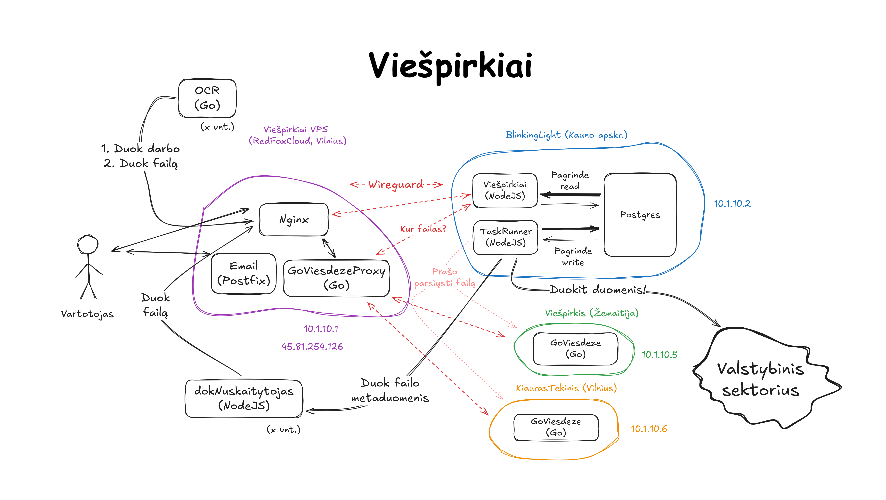

# Viešpirkiai

Pilietinės iniciatyvos Viešpirkiai puslapio https://viespirkiai.org kodas.

Daugiau informacijos el. paštu viespirkiai@viespirkiai.org



## Tailwind CSS

Astro port (`src/`) now uses Tailwind v4 directly through Astro/Vite.
The main stylesheet entrypoint is `src/styles/global.css`, which imports Tailwind and the design-system foundation CSS.

### Documentation

- Tailwind docs: https://tailwindcss.com/docs

### Commands

- Astro development:

```bash
npm run dev:astro
```

- Astro production build:

```bash
npm run build:astro
```

### Project setup files

- Astro Tailwind entry file: `src/styles/global.css`
- Astro/Vite config: `astro.config.mjs`
