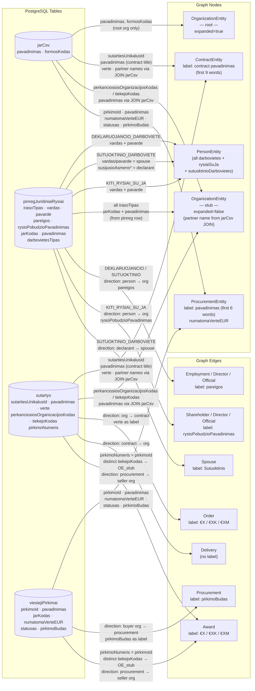
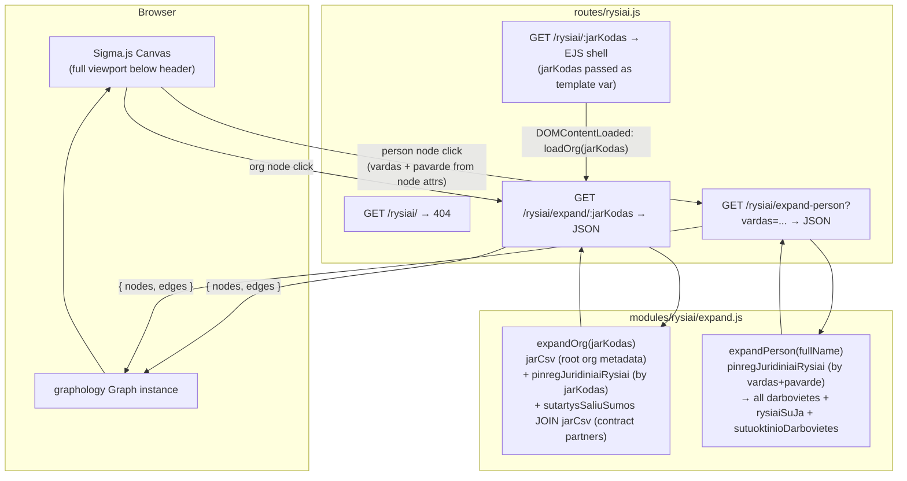
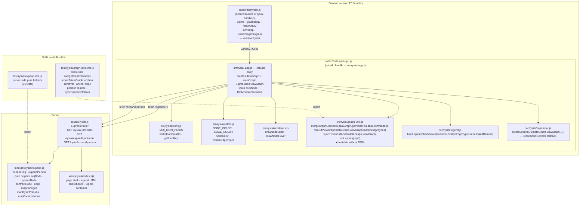

# Ryšiai — Interactive Procurement Network Graph

## Summary

Add a new page `/rysiai/:jarKodas` (Lithuanian: "spider web") that renders an interactive Sigma.js
network graph of procurement relationships centred on the company identified by `jarKodas`. The page
immediately initialises the graph with that company as the root node — no search step is needed.
Visiting `/rysiai/` without a company code returns a 404-style "įmonė nenurodyta" page.

Interaction model:

- **Single click** — selects the node and shows its details panel. Clicking the canvas background deselects.
- **Double-click** — expands the node, fetching and merging its connected data into the graph.

The **details panel** (top-right overlay) shows a type-specific summary of the selected node. At the bottom of the
panel, an **expand/collapse button** provides an alternative to double-clicking. The node stays selected after either
button action:

- **"Išskleisti"** (Hub icon) — shown when the node has not yet been expanded; triggers expansion.
- **"Suskleisti"** (Adjust icon) — shown when the node is already expanded; collapses: removes the edges and orphaned
  nodes brought in by this expansion, resets `expanded: false`, rebuilds the graph.

MCP is not used for DB queries — direct DB calls are faster and avoid HTTP/SSE overhead; MCP is designed for external AI
clients only.

Stack additions: `sigma@3`, `graphology@0.26`, `graphology-layout-forceatlas2`, `graphology-layout-noverlap`,
`@sigma/node-border`, `@sigma/node-image`. Because these are ESM npm packages targeted at Node, a browser
bundle must be compiled with `esbuild` and served as `public/dist/rysiai.js`.

---

## Technical Breakdown

### Entity & Edge Types

The graph uses the entity and edge model defined in the repository data structures:

| Node type            | Expand trigger                                                             | Source function / data                                                                                                                                                                                                                                                                                                                                        | Key fields                                                                                                   | Details panel link                                                                             |
|----------------------|----------------------------------------------------------------------------|---------------------------------------------------------------------------------------------------------------------------------------------------------------------------------------------------------------------------------------------------------------------------------------------------------------------------------------------------------------|--------------------------------------------------------------------------------------------------------------|------------------------------------------------------------------------------------------------|
| `OrganizationEntity` | Org node double-click                                                      | `jarCsv` (root org metadata — `pavadinimas`, `formosKodas`) + `sutartysSaliuSumos JOIN jarCsv` (partner org names)                                                                                                                                                                                                                                            | `jarKodas`, `pavadinimas`, `formosKodas`                                                                     | `/asmuo/{jarKodas}`                                                                            |
| `PersonEntity`       | Org node double-click                                                      | `pinregJuridiniaiRysiai` filtered by `jarKodas` — all `DEKLARUOJANCIO_DARBOVIETE`, `KITI_RYSIAI_SU_JA`, `SUTUOKTINIO_DARBOVIETE` rows                                                                                                                                                                                                                         | `vardas + pavarde` (name is the identity key), `rysioPradzia`                                                | *(no dedicated page)*                                                                          |
| `PersonEntity`       | Person node double-click                                                   | `pinregJuridiniaiRysiai` filtered by `vardas + pavarde` — returns all darbovietes, governance roles, and spouse relationships for that person                                                                                                                                                                                                                 | Same; all declarations for that name are merged into one node                                                | *(no dedicated page)*                                                                          |
| `ContractEntity`     | Org node double-click (creates node)                                       | `sutartys JOIN jarCsv` (top 30 contracts by value; buyer/seller names from `jarCsv` JOIN)                                                                                                                                                                                                                                                                     | `sutartiesUnikalusId` (node ID key), `pavadinimas` (contract title), `verte`, `pirkimoNumeris` (may be null) | `/sutartis/{sutartiesUnikalusId}` (primary); `/viesiejiPirkimai/{pirkimoNumeris}` (if present) |
| `ContractEntity`     | Contract node double-click (when `pirkimoNumeris` is present)              | `expandContract(pirkimoNumeris)` — fetches full `ProcurementEntity` node (`viesiejiPirkimai WHERE pirkimoId = $1`) + all winner org stubs (`sutartys GROUP BY tiekejoKodas`) + best-effort loser org stubs (`atn1ataskaitos JOIN atn1dalyviai WHERE salis='LT'`, only ~425 procurements covered). Client creates the `ContractLink` edge locally after merge. | Same as above (contract node already in graph)                                                               | *(same, already shown)*                                                                        |
| `ProcurementEntity`  | Org node double-click (buyer) / Contract node double-click (auto-expanded) | Created when buyer org is expanded: `viesiejiPirkimai WHERE jarKodas = $jarKodas ORDER BY numatomaVerteEUR DESC LIMIT 20`. When reached via contract expansion, already fully populated and auto-expanded by `expandContract`.                                                                                                                                | `pirkimoId` (node ID key), `pavadinimas`, `numatomaVerteEUR`, `statusas`, `pirkimoBudas`                     | `/viesiejiPirkimai/{pirkimoId}`                                                                |

> **`ProcurementEntity` is a hub node.** One procurement notice can result in contracts with multiple
> different winners (32,605 of 37,796 procurements have >1 distinct winner — see `docs/DB_ER.md`).
> The procurement node sits between the buyer org and its award recipients: `BuyerOrg → Procurement →
> [WinnerOrg1, WinnerOrg2, …]`. This is fundamentally different from a `ContractEntity` which is
> always a one-to-one buyer↔seller financial document.
>
> **`ContractEntity.pirkimoNumeris`** links a signed contract back to the originating procurement
> notice. When non-null, clicking the contract node expands it to reveal the procurement hub and all
> participants. **`expanded` starts as `false`** when `pirkimoNumeris` is present; the UI click
> handler uses this flag to trigger `expandContract`. When `pirkimoNumeris` is null, the contract
> node is not expandable and keeps `expanded: true`.
>
> **Loser (Bid) coverage is best-effort.** Loser participant data comes from `atn1dalyviai` via
> `atn1ataskaitos.pirkimoNumeris`. Only ~425 of 37,797 procurements have ATN1 data in the DB. When
> no ATN1 data exists for a procurement, only winner `Award` edges are shown — this is normal and
> expected. `atn1dalyviai.kodas` maps to `jarCsv.jarKodas` for Lithuanian companies (`salis = 'LT'`).
> Foreign bidders are excluded (no jarCsv entry).

**Entity ID convention:**

| Entity       | ID format                                                             | Example                 |
|--------------|-----------------------------------------------------------------------|-------------------------|
| Organisation | `org:{jarKodas}`                                                      | `org:110053842`         |
| Person       | `person:{vardas.trim().toLowerCase()} {pavarde.trim().toLowerCase()}` | `person:jonas jonaitis` |
| Contract     | `contract:{sutartiesUnikalusId}`                                      | `contract:2008083561`   |
| Procurement  | `procurement:{pirkimoId}`                                             | `procurement:474742`    |

> **Person identity is name-only.** The same physical person appearing in declarations for different
> organisations will have the same node ID and will be merged into a single graph node automatically
> by graphology's idempotent merge — this is the intended behaviour. `deklaracija` UUIDs are stored
> as a node attribute array (`deklaracijos: string[]`) for audit purposes but are not used as the ID.
> Person nodes must store `vardas` and `pavarde` as separate attributes so the frontend can derive
> the node ID and pass the full name to `expand-person`.

#### Person node expansion — `expandPerson` and `expandOrg` DB mapping

Both functions query `pinregJuridiniaiRysiai` directly — this table stores all pinreg declared
relationships as structured rows, with one row per person↔org link. When a **person node is clicked**,
`expandPerson` filters this table by `vardas + pavarde` (or `susijusioAsmensVardas + susijusioAsmensPavarde`
for spouse relationships), returning all darbovietes, governance roles, and spouse links declared
across every employer that person has ever listed. Each row has an `irasoTipas` classifier that
determines which graph elements to produce:

| `irasoTipas`                | Produces                                                                       | Edge type(s)                                                           |
|-----------------------------|--------------------------------------------------------------------------------|------------------------------------------------------------------------|
| `DEKLARUOJANCIO_DARBOVIETE` | `PersonEntity` (declarant) + `OrganizationEntity` stub                         | `Employment`/`Director`/`Official` — person → org                      |
| `KITI_RYSIAI_SU_JA`         | `PersonEntity` + `OrganizationEntity` stub                                     | `Director`/`Shareholder`/`Official` — person → org                     |
| `SUTUOKTINIO_DARBOVIETE`    | `PersonEntity` (spouse) + `OrganizationEntity` stub + declarant `PersonEntity` | `Employment`/`Director` (spouse → org) + `Spouse` (declarant → spouse) |

| Edge type                               | Direction              | Style           | Source                                                                                                                                                                                                       |
|-----------------------------------------|------------------------|-----------------|--------------------------------------------------------------------------------------------------------------------------------------------------------------------------------------------------------------|
| `Employment` / `Director` / `Official`  | Person → Org           | solid           | `pinregJuridiniaiRysiai` rows with `irasoTipas = DEKLARUOJANCIO_DARBOVIETE`                                                                                                                                  |
| `Employment` / `Director`               | Spouse → Org           | solid           | `pinregJuridiniaiRysiai` rows with `irasoTipas = SUTUOKTINIO_DARBOVIETE`                                                                                                                                     |
| `Shareholder` / `Director` / `Official` | Person → Org           | solid           | `pinregJuridiniaiRysiai` rows with `irasoTipas = KITI_RYSIAI_SU_JA`                                                                                                                                          |
| `Spouse`                                | Person → Person        | solid           | `pinregJuridiniaiRysiai` rows with `irasoTipas = SUTUOKTINIO_DARBOVIETE` (declarant → spouse)                                                                                                                |
| `Order`                                 | Org → Contract         | solid, sized    | `sutartys.topPirkejai` → buyer side                                                                                                                                                                          |
| `Delivery`                              | Contract → Org         | solid, sized    | `sutartys.topTiekejai` → supplier side                                                                                                                                                                       |
| `Procurement`                           | Org → Procurement      | solid           | `viesiejiPirkimai WHERE jarKodas = $jarKodas` — buyer org issued the tender                                                                                                                                  |
| `ContractLink`                          | Contract → Procurement | thin, muted     | Created client-side when a contract node is expanded — links the clicked contract to its procurement hub. Color `#94a3b8` (slate). Size 1.                                                                   |
| `Award`                                 | Procurement → Org      | thin, **green** | `sutartys WHERE pirkimoNumeris = $pirkimoId GROUP BY tiekejoKodas` — winning seller orgs. Color `#22c55e`. Size 1.                                                                                           |
| `Bid`                                   | Procurement → Org      | thin, **red**   | `atn1ataskaitos JOIN atn1dalyviai WHERE pirkimoNumeris = $pirkimoId AND salis='LT'` — procurement participants who did not win. Color `#ef4444`. Size 1. Best-effort: only ~425 procurements have ATN1 data. |

> **Visual style note — thin edges.** Sigma.js does not natively render dashed or dotted lines.
> `ContractLink`, `Award`, and `Bid` are visually distinguished from solid `Order`/`Delivery` edges
> by being **very thin (size 1)** and carrying distinct colors (slate / green / red). If a
> `@sigma/edge-dashed` custom program is added in a future phase, these three edge types are already
> separated and ready to be switched.

> **`irasoTipas` is a record classifier, not a role label.** The three distinct values in the DB are
> `DEKLARUOJANCIO_DARBOVIETE`, `SUTUOKTINIO_DARBOVIETE`, and `KITI_RYSIAI_SU_JA`. They must **never**
> be used as edge labels — they are only used to decide which mapping branch to enter.

#### Data Source → Graph Element Mapping



#### Edge labels

Every edge must carry a visible `label` attribute set at build time in `modules/rysiai/expand.js`:

| Edge type                                                          | `label` value                                                                                                                                                                              |
|--------------------------------------------------------------------|--------------------------------------------------------------------------------------------------------------------------------------------------------------------------------------------|
| `Order` / `Delivery`                                               | Formatted `verte`: `€1.2M`, `€450K`, `€12K`, etc. — see formatting note                                                                                                                    |
| `Procurement`                                                      | `pirkimoBudas` field (e.g. "Atviras konkursas", "Skelbiama apklausa")                                                                                                                      |
| `Award`                                                            | Formatted `verte` sum (total contract value from that seller for this procurement)                                                                                                         |
| `Bid`                                                              | *(empty — no label)*                                                                                                                                                                       |
| `ContractLink`                                                     | *(empty — no label)*                                                                                                                                                                       |
| `Employment` / `Director` / `Official` (person or spouse → org)    | `pareigos` field (free-text job title, e.g. "Direktorius", "Gydytojas"). Never `darbovietesTipas` — that field holds `STANDARTINE`, `EKSPERTO`, or `SUTUOKTINIO` and is not human-readable |
| `Director` / `Shareholder` / `Official` (from `KITI_RYSIAI_SU_JA`) | `rysioPobudzioPavadinimas` field (controlled vocabulary, e.g. "Valdybos narys", "Akcininkas")                                                                                              |
| `Spouse`                                                           | `"Sutuoktinis"`                                                                                                                                                                            |

> **Contract value formatting**: use `Math.round(verte)` and express as `€XM` (millions, 1 dp), `€XK`
> (thousands, 0 dp), or `€X` (under 1000) — e.g. `1234567 → €1.2M`, `45000 → €45K`, `800 → €800`.
> `null`/`0` values display an empty string (no label).

#### Node labels

Node labels are rendered **below** the node. Long names are word-wrapped at **3 words per line**
using a simple space-split utility:

```js
function wrapLabel(name, n = 3) {
    const words = (name ?? '').split(' ');
    const lines = [];
    for (let i = 0; i < words.length; i += n) lines.push(words.slice(i, i + n).join(' '));
    return lines.join('\n');
}
```

| Entity type          | Label source             | Applied as                          |
|----------------------|--------------------------|-------------------------------------|
| `OrganizationEntity` | `pavadinimas`            | `wrapLabel(pavadinimas)`            |
| `PersonEntity`       | `vardas + " " + pavarde` | `wrapLabel(vardas + " " + pavarde)` |
| `ContractEntity`     | contract count           | `"N sut."` (e.g. `"17 sut."`)       |
| `ProcurementEntity`  | `pavadinimas` (6 words)  | `wrapLabel(pavadinimas, 6)`         |

Sigma's default label renderer draws labels to the **right** of the node centre. A custom
`defaultDrawNodeLabel` function must be provided to `new Sigma(graph, container, { defaultDrawNodeLabel })`
to position the label **below** the node (draw at `y + nodeSize + labelPadding`, horizontally centred on `x`).

### Architecture

New server-side module `modules/rysiai/` containing:

- `expand.js` — exported functions:
    - `expandOrg(jarKodas)` — queries `jarCsv` (root org metadata), `pinregJuridiniaiRysiai` (person
      relationships), `sutartys JOIN jarCsv` (top 30 contracts by value), and `viesiejiPirkimai`
      (top 20 procurement notices by `numatomaVerteEUR`) for this org as **buyer**; maps raw rows to
      `GraphNode[]` and `GraphEdge[]`. Returns `{ nodes, edges }`.
    - `expandPerson(fullName)` — queries `pinregJuridiniaiRysiai` directly, matching on
      `vardas + pavarde` or `susijusioAsmensVardas + susijusioAsmensPavarde`; returns **all
      darbovietes, governance roles, and spouse relationships** declared by that person across all
      employers, as stub `OrganizationEntity` nodes + person↔org / spouse edges.
    - `expandProcurement(pirkimoId)` — queries `sutartys WHERE pirkimoNumeris = $pirkimoId GROUP BY
      tiekejoKodas` to find distinct winning seller orgs + `jarCsv JOIN` for their names; returns
      seller `OrganizationEntity` stub nodes + `Award` edges from the procurement node.
    - All functions return `{ nodes: GraphNode[], edges: GraphEdge[] }`.

New route `routes/rysiai.js`:

| Method | Path                             | Purpose                                                                                           |
|--------|----------------------------------|---------------------------------------------------------------------------------------------------|
| `GET`  | `/rysiai/`                       | Returns 404 ("įmonė nenurodyta") — no jarKodas was given                                          |
| `GET`  | `/rysiai/:jarKodas`              | EJS page shell with jarKodas passed as template variable; graph auto-initialises on load          |
| `GET`  | `/rysiai/expand/:jarKodas`       | JSON: graph nodes+edges for one organisation (calls `expandOrg`)                                  |
| `GET`  | `/rysiai/expand-person`          | JSON: graph nodes+edges for one person by full name (`?vardas=...`). Calls `expandPerson`.        |
| `GET`  | `/rysiai/expand-procurement/:id` | JSON: graph nodes+edges for one procurement — its winning seller orgs. Calls `expandProcurement`. |

> **Route ordering note**: `expand` and `expand-person` static path segments must be registered _before_
> the `/:jarKodas` wildcard so they are not swallowed by the dynamic route handler.

Browser bundle `src/rysiai-bundle.js` compiled by esbuild into `public/dist/rysiai.js`:
imports sigma, graphology, layouts, and node-programs; exports nothing — attaches `window.Rysiai`
with `{ Sigma, Graph, forceAtlas2, noverlap, NodeBorderProgram, NodeImageProgram }` so the inline EJS
script can initialise the graph.

### Client-side fetch strategy

The project uses **no data-fetching library** anywhere — all client fetch calls in every view are vanilla
`fetch()` with manual `AbortController`, debouncing, and request-ID sequencing (see `views/juridiniai/search.ejs`
for the canonical pattern). `@tanstack/query-core` was considered but is **not used** — reasoning:

- Node expansion is **one-shot and idempotent**: once a node is marked `expanded: true`, it is never
  re-fetched. No stale-while-revalidate, background refresh, or pagination is required.
- Concurrent duplicate clicks on the same unexpanded node are deduplicated with a **`Set<nodeId>`** of
  in-flight requests (consistent with the `inFlightControllers` Map pattern already used in the project).
- Introducing a framework-agnostic query client would be an isolated pattern inconsistent with the
  zero-framework vanilla JS convention throughout all views.

**In-flight deduplication pattern** (to implement in the inline script):

```js
const expandingNodes = new Set(); // IDs currently being fetched

async function loadOrg(jarKodas) {
    const id = `org:${jarKodas}`;
    if (expandingNodes.has(id)) return;
    expandingNodes.add(id);
    try {
        const data = await fetch(`/rysiai/expand/${jarKodas}`).then(r => r.json());
        mergeGraphElements(data);
        graph.setNodeAttribute(id, 'expanded', true);
    } finally {
        expandingNodes.delete(id);
    }
}
```

Same pattern applies to `loadPerson`, keyed by `person:{(vardas+" "+pavarde).trim().toLowerCase()}`.

### Structural Diagram



### Behavioral Diagram

```mermaid
sequenceDiagram
    actor User
    participant Browser
    participant Server
    User ->> Browser: GET /rysiai/
    Browser ->> Server: GET /rysiai/
    Server -->> Browser: 404 "įmonė nenurodyta"
    User ->> Browser: GET /rysiai/{jarKodas}
    Browser ->> Server: GET /rysiai/{jarKodas}
    Server -->> Browser: EJS page (empty Sigma canvas, jarKodas embedded)
    Browser ->> Browser: DOMContentLoaded → loadOrg(jarKodas)
    Browser ->> Server: GET /rysiai/expand/{jarKodas}
    Server -->> Browser: { nodes[], edges[] }
    Browser ->> Browser: Add to graphology Graph
    Browser ->> Browser: Run ForceAtlas2 layout
    Browser ->> Browser: Render with Sigma
    User ->> Browser: Clicks any node
    Browser ->> Browser: Select node → show details panel (Išskleisti/Suskleisti button)
    User ->> Browser: Double-clicks unexpanded org node
    Browser ->> Browser: Show loading overlay (blocks further clicks)
    Browser ->> Server: GET /rysiai/expand/{jarKodas}
    Server -->> Browser: { nodes[], edges[] } (merged, idempotent)
    Browser ->> Browser: Merge nodes, pre-position new nodes at clicked node pos
    Browser ->> Browser: Run ForceAtlas2 → compute final positions
    Browser ->> Browser: animateNodes (600ms, quadraticInOut) clicked pos → final pos
    Browser ->> Browser: Hide loading overlay; details panel switches to Suskleisti button
    User ->> Browser: Double-clicks unexpanded person node
Note over Browser: person node attrs contain vardas + pavarde
Browser ->> Browser: Show loading overlay
Browser ->> Server: GET /rysiai/expand-person?vardas=Jonas+Jonaitis
Server -->> Browser: { nodes[], edges[] }
Browser ->> Browser: Merge nodes, pre-position at person node pos
Browser ->> Browser: Run ForceAtlas2 + noverlap → compute final positions
Browser ->> Browser: animateNodes (600ms, quadraticInOut) → final pos
Browser ->> Browser: Hide loading overlay
User ->> Browser: Clicks "Suskleisti" in details panel
Browser ->> Browser: Remove expansion edges+orphan nodes from dataGraph
Browser ->> Browser: Set expanded=false, rebuild viewGraph, refresh
```

---

## Components

### Component Map



### Module responsibilities

| File                        | Layer  | Purpose                                                                                                               | DOM required              |
|-----------------------------|--------|-----------------------------------------------------------------------------------------------------------------------|---------------------------|
| `src/rysiai-bundle.js`      | Client | Bundles third-party npm packages; exposes `window.Rysiai`                                                             | No                        |
| `src/rysiai-app.js`         | Client | esbuild entry; creates `dataGraph` + `viewGraph`; Sigma uses `viewGraph`; wires events                                | Yes                       |
| `src/rysiai/icons.js`       | Client | MUI SVG path map; `makeIconDataUri`; `getIconKey`                                                                     | No                        |
| `src/rysiai/colors.js`      | Client | `NODE_COLOR`, `EDGE_COLOR`, `nodeColor`, `hiddenEdgeTypes` Set                                                        | No                        |
| `src/rysiai/renderers.js`   | Client | `drawNodeLabel`, `drawNodeHover` — Sigma canvas callbacks                                                             | No (canvas ctx passed in) |
| `src/rysiai/graph-utils.js` | Client | `mergeGraphElements(dataGraph,...)`, `rebuildViewGraph`, `syncPositionsToData`, `runLayout` — **pure, injected deps** | No ★                      |
| `src/rysiai/legend.js`      | Client | `bindLegendCheckboxes(renderer, hiddenEdgeTypes, rebuildAndRefresh)`                                                  | Yes (queries DOM)         |
| `src/rysiai/expand-ui.js`   | Client | `createExpandUI({dataGraph,viewGraph,...})` — async fetch + rebuild; returns `rebuildAndRefresh`                      | Yes                       |
| `modules/rysiai/expand.js`  | Server | `expandOrg`, `expandPerson`, `expandProcurement`, all pure builder helpers                                            | No                        |
| `routes/rysiai.js`          | Server | Express routes; calls `expandOrg`/`expandPerson`/`expandProcurement`; renders EJS                                     | No                        |
| `views/rysiai/index.ejs`    | View   | HTML shell, inline CSS, legend overlay with checkboxes                                                                | —                         |

**Visual identity — node colours and icons:**

| Entity type          | `NODE_COLOR` key | Hex       | Icon (MUI)                            | Icon key                                           |
|----------------------|------------------|-----------|---------------------------------------|----------------------------------------------------|
| `OrganizationEntity` | `org`            | `#3b82f6` | Business / DomainAdd / AccountBalance | `PrivateCompany` / `PublicCompany` / `Institution` |
| `OrganizationEntity` | `orgStub`        | `#9ca3af` | Business                              | same                                               |
| `PersonEntity`       | `person`         | `#f97316` | Person                                | `Person`                                           |
| `ContractEntity`     | `contract`       | `#10b981` | HistoryEdu                            | `Contract`                                         |
| `ProcurementEntity`  | `procurement`    | `#8b5cf6` | Gavel                                 | `Procurement`                                      |

`ProcurementEntity` uses **purple** (`#8b5cf6`) — distinct from all current node colours. The MUI
`Gavel` icon path must be added to `MUI_ICON_PATHS` in `src/rysiai/icons.js`, and `getIconKey`
must return `'Procurement'` for procurement nodes. `EDGE_COLOR` must add entries for:

| Edge type      | Color     | Meaning                                    |
|----------------|-----------|--------------------------------------------|
| `Procurement`  | `#8b5cf6` | Org → Procurement                          |
| `ContractLink` | `#94a3b8` | Contract → Procurement (thin, muted slate) |
| `Award`        | `#22c55e` | Procurement → winner org (green)           |
| `Bid`          | `#ef4444` | Procurement → loser/participant org (red)  |

**`ProcurementEntity` node sizing** — same tiers as `ContractEntity`, driven by `numatomaVerteEUR`:

| Estimated value | Node size |
|-----------------|-----------|
| < €100 K        | 8         |
| €100 K – €1 M   | 13        |
| ≥ €1 M          | 19        |

The single most impactful change for testability is the **dependency-injection signature** of
`mergeGraphElements`. Instead of closing over the module-level `graph` and `renderer`, it receives
them as parameters:

```js
// graph-utils.js (Phase 9 signature — hiddenEdgeTypes removed; dataGraph is a pure store)
export function mergeGraphElements(dataGraph, getNodePos, data, fromNodeId) { ...
}

export function rebuildViewGraph(dataGraph, viewGraph, hiddenEdgeTypes) { ...
} // returns newNodeIds[]
export function syncPositionsToData(dataGraph, viewGraph) { ...
}

export function runLayout(graph, forceAtlas2, noverlap) { ...
}
```

In production (`expand-ui.js`):

```js
mergeGraphElements(dataGraph, (id) => renderer.getNodeDisplayData(id), data, fromNodeId);
const newNodes = rebuildViewGraph(dataGraph, viewGraph, hiddenEdgeTypes);
syncPositionsToData(dataGraph, viewGraph);
```

In unit tests — no DOM or Sigma needed:

```js
import Graph from 'graphology';
import {mergeGraphElements, rebuildViewGraph, syncPositionsToData} from '../../src/rysiai/graph-utils.js';

const dataGraph = new Graph({type: 'directed', multi: true});
const viewGraph = new Graph({type: 'directed', multi: true});
const getNodePos = () => null;

mergeGraphElements(dataGraph, getNodePos, data, null);
const newNodes = rebuildViewGraph(dataGraph, viewGraph, new Set(['Official']));
```

This allows testing:

- That `dataGraph` receives all edges unconditionally (no hidden filtering at merge time)
- That `rebuildViewGraph` removes orphan nodes (no visible edges) from `viewGraph`
- That anchor nodes (expanded, non-ContractEntity) survive even when all their edges are hidden
- That `ContractEntity` nodes disappear when `Order`/`Delivery` are in `hiddenEdgeTypes`
- That re-appearing nodes restore their `x`/`y` position from `dataGraph`
- That `syncPositionsToData` correctly copies layout coordinates back to `dataGraph`
- That newly added node IDs are returned by `rebuildViewGraph` (for `animateNodes` call site)

### Two-graph design

A `dataGraph` (permanent store) and a `viewGraph` (Sigma's rendered graph) are maintained separately:

- `dataGraph` — holds **all** fetched nodes and edges unconditionally. Updated only on expand fetches. Never passed to
  Sigma.
- `viewGraph` — passed to `new Sigma(viewGraph, ...)`. Rebuilt by
  `rebuildViewGraph(dataGraph, viewGraph, hiddenEdgeTypes)` after every expand or legend toggle.

**Anchor rule**: a node is always kept in `viewGraph` when
`attrs.expanded === true && attrs.entityType !== 'ContractEntity'`. ContractEntity nodes are not anchors and disappear
when all `Order`/`Delivery` edges are hidden.

**`rebuildViewGraph`**: computes the visible node set (anchors + nodes incident to non-hidden-type edges), syncs
nodes/edges in `viewGraph`, restores saved `x`/`y` from `dataGraph` when re-adding nodes, returns newly added node IDs
for `animateNodes`.

**`syncPositionsToData`**: after every layout pass, copies `x`/`y` from `viewGraph` → `dataGraph` so positions survive
the next rebuild.

**Animation cancel token**: `animateNodes` returns a cancel function stored in `cancelAnimation`. It is called before
each `rebuildViewGraph` to prevent writing attributes to nodes that were just dropped from `viewGraph`.

### Selection state

Single-node selection. Clicking a node sets `highlighted: true; selected: true` on both graphs (Sigma draws the
persistent ring via `drawNodeHover`). `nodeHiddenEdgeTypes: Map<nodeId, Set<string>>` stores per-node edge-filter
state — on first selection a new Set is initialised as a copy of `HIDDEN_BY_DEFAULT`. `currentHiddenSet()` returns the
selected node's Set or the global fallback; `rebuildAndRefresh` always uses `currentHiddenSet()`.

| Visual state       | Ring radius    | Fill                     | Stroke width | Stroke colour |
|--------------------|----------------|--------------------------|--------------|---------------|
| Hover only         | `nodeSize + 4` | `rgba(255,255,255,0.6)`  | `2`          | `data.color`  |
| Selected (± hover) | `nodeSize + 6` | `rgba(255,255,255,0.15)` | `5`          | `data.color`  |

### Node and edge sizing

**Org node size** — computed client-side from raw sodra fields stored in node attributes:

```js
Math.max(attrs.bendrasDraustujuSkaicius || 0, attrs.draustieji || 0, attrs.draustieji2 || 0, 1)
```

| Personnel | Node size |
|-----------|-----------|
| < 10      | 8         |
| 10 – 50   | 13        |
| 50 – 200  | 19        |
| > 200     | 28        |

`expandOrg` fetches raw sodra fields (`draustieji`, `draustieji2`) per org in a single flat query and stores them in
node attributes. `bendrasDraustujuSkaicius = draustieji + draustieji2` is computed client-side; it is **not** a DB
column.

**Contract / Procurement node size** (`contractSize`) and **Order / Delivery edge weight** (`edgeWeight`) — same
thresholds:

| Value         | Node size | Edge `size` |
|---------------|-----------|-------------|
| < €100 K      | 8         | 1           |
| €100 K – €1 M | 13        | 3           |
| > €1 M        | 19        | 6           |

Person nodes keep a fixed `size: 8`. `edgeWeight` is mirrored as a local helper in `modules/rysiai/expand.js` so
`Order`/`Delivery` edges carry their `size` from the server payload.

---

## Out of Scope

- Risk score colouring of nodes/edges
- Saving / sharing graph state via URL
- Toolbar "Balance" button triggering a full ForceAtlas2 pass — v2
- Dashed/dotted edge rendering (Sigma.js has no built-in dash program; thin colored solid lines are used instead — a
  custom renderer can be added in a future phase)

---

## Tasks

> **Phases 1–12 complete.** Core infrastructure (routes, expand.js, Sigma canvas, icons), expand
> animations, loading overlay, edge/node type labels, legend checkboxes, two-graph architecture,
> per-node selection state, dynamic node/edge sizing, entity-types module, and SVG legend arrows are
> all implemented. See architecture sections above for current implementation state.

---

**Phase 14 — ProcurementEntity graph nodes (server-side)**

Add `ProcurementEntity` as a first-class node type on the server. The client-side infrastructure
(colors, icons, entity-types, expand-ui, legend rows, details panel) is already implemented.

#### Data model

| Attribute          | Source                              | Notes                                             |
|--------------------|-------------------------------------|---------------------------------------------------|
| `id`               | `procurement:{pirkimoId}`           | Stable across page loads                          |
| `entityType`       | `'ProcurementEntity'`               |                                                   |
| `pirkimoId`        | `viesiejiPirkimai.pirkimoId`        | Used for expansion and detail page link           |
| `pavadinimas`      | `viesiejiPirkimai.pavadinimas`      | Procurement title                                 |
| `numatomaVerteEUR` | `viesiejiPirkimai.numatomaVerteEUR` | Estimated total value                             |
| `statusas`         | `viesiejiPirkimai.statusas`         | e.g. "Nustatytas laimėtojas"                      |
| `pirkimoBudas`     | `viesiejiPirkimai.pirkimoBudas`     | e.g. "Atviras konkursas"                          |
| `size`             | `contractSize(numatomaVerteEUR)`    | Same tiers as ContractEntity (8 / 13 / 19)        |
| `expanded`         | `false` initially                   | Set to `true` after `expandProcurement` is called |

**Edges from `expandOrg` (buyer side)**: `Procurement` edge `org:{buyerJk}` → `procurement:{pirkimoId}`, label =
`pirkimoBudas`.

**Edges from `expandProcurement` (winner orgs)**: `Award` edge `procurement:{pirkimoId}` → `org:{tiekejoKodas}`, label =
formatted total `verte` sum for that seller.

#### Tasks

- [ ] **`modules/rysiai/expand.js`**:
    - Add `procurementNode(row)` factory:
      `{ id, entityType, pirkimoId, pavadinimas, numatomaVerteEUR, statusas, pirkimoBudas, size, expanded: false }`.
    - In `expandOrg`: query
      `SELECT pirkimoId, pavadinimas, numatomaVerteEUR, statusas, pirkimoBudas FROM viesiejiPirkimai WHERE jarKodas = $jk ORDER BY numatomaVerteEUR DESC NULLS LAST LIMIT 20`;
      emit `procurementNode` + `Procurement` edge per result.
    - Add `expandProcurement(pirkimoId)`: query
      `SELECT DISTINCT s.tiekejoKodas, j.pavadinimas, SUM(s.verte) as totalVerte FROM sutartys s LEFT JOIN jarCsv j ON j.jarKodas::text = s.tiekejoKodas WHERE s.pirkimoNumeris = $1 GROUP BY s.tiekejoKodas, j.pavadinimas`;
      return org stub nodes + `Award` edges.

- [ ] **Browser smoke-test**:
    - Double-click a buyer org → purple procurement nodes appear
    - Double-click a procurement node → winner seller org stubs appear via green `Award` edges
    - Select a procurement node → details panel shows title, estimated value, statusas, link, and Išskleisti/Suskleisti
      button

---

**Phase 16 — Double-click to expand / details panel expand-collapse button**

Replaces single-click expansion with double-click. Adds an expand/collapse button to the details
panel as a secondary interaction path.

#### Interaction model

| Event             | Source                          | Behaviour                                                                               |
|-------------------|---------------------------------|-----------------------------------------------------------------------------------------|
| `clickNode`       | Sigma — canvas node click       | Select the node (show details panel). If already selected, **no-op** — do not deselect. |
| `doubleClickNode` | Sigma — canvas node dblclick    | Expand the node.                                                                        |
| `clickExpand`     | Details panel "Išskleisti" btn  | Expand the currently selected node. Node remains selected.                              |
| `clickCollapse`   | Details panel "Suskleisti" btn  | Collapse the currently selected node. Node remains selected; panel updates.             |
| `clickStage`      | Sigma — canvas background click | Deselect (unchanged).                                                                   |

> **Why no-op on re-click**: Sigma fires `clickNode` twice before `doubleClickNode`. If the second
> `clickNode` deselected the node, the user would see a flicker (select → deselect → expand). Making
> re-click a no-op avoids this: both clicks select/keep the node selected, then `doubleClickNode`
> expands it.

#### Details panel expand/collapse button

At the bottom of the `#rysiai-details` panel, a single button is rendered based on node state:

| Node state                                                              | Button label     | Button icon                               | Action             |
|-------------------------------------------------------------------------|------------------|-------------------------------------------|--------------------|
| expandable, not yet expanded                                            | **"Išskleisti"** | Hub (MUI `@mui/icons-material/Hub`)       | triggers expansion |
| already expanded                                                        | **"Suskleisti"** | Adjust (MUI `@mui/icons-material/Adjust`) | triggers collapse  |
| not expandable (e.g. `PersonEntity`, contract without `pirkimoNumeris`) | *(no button)*    | —                                         | —                  |

A node is expandable when any of the following is true:

- `isOrgNode(attrs) && attrs.jarKodas`
- `isPersonNode(attrs) && attrs.vardas && attrs.pavarde`
- `isProcurementNode(attrs) && attrs.pirkimoId`
- `isContractNode(attrs) && attrs.pirkimoNumeris`

Icons are rendered as **inline SVG**. Add `Hub` and `Adjust` path strings to `MUI_ICON_PATHS` in
`src/rysiai/icons.js` and export a `svgIcon(key)` helper from that module (it already owns the path
map). `details-panel.js` imports `svgIcon` from `icons.js` and calls it to build the button markup.
`svgIcon` wraps the path in `<svg viewBox="0 0 24 24" width="16" height="16" aria-hidden="true">`.

> **Why `svgIcon` belongs in `icons.js`, not `details-panel.js`**: `MUI_ICON_PATHS` is currently a
> private `const` in `icons.js`. Exporting the helper (not the raw map) keeps the path data
> encapsulated and avoids a cross-module data dependency.

#### `showNodeDetails` signature change

```js
// was: showNodeDetails(nodeId, attrs)
// now:
export function showNodeDetails(nodeId, attrs, handlers = {}) { …
}

// handlers: { onExpand?: () => void, onCollapse?: () => void }
```

`buildHtml` appends the button only when a handler is provided. After setting `innerHTML`, attach
the handler directly to the rendered button element (not via `{ once: true }` on the panel — a
`{ once: true }` listener on the panel is consumed by the first click anywhere, including the
existing "Peržiūrėti…" links, leaving subsequent button clicks dead):

```js
const btn = el.querySelector('[data-action]');
if (btn) {
    btn.addEventListener('click', () => {
        if (btn.dataset.action === 'expand') handlers.onExpand?.();
        else handlers.onCollapse?.();
    });
}
```

Each call to `showNodeDetails` replaces `innerHTML`, so the old button and its listener are
discarded automatically.

In `expand-ui.js`, `selectNode` computes the handlers and passes them:

```js
function selectNode(id) {
…
    const attrs = viewGraph.hasNode(id) ? viewGraph.getNodeAttributes(id) : {};
    const handlers = {};
    if (attrs.expanded) {
        handlers.onCollapse = () => collapseNode(id);
    } else if (isExpandableNode(attrs)) {
        handlers.onExpand = () => _triggerExpand(id, attrs);
    }
    showNodeDetails(id, attrs, handlers);
}
```

#### Collapse algorithm (`collapseNode`)

1. Set `expanded: false` on `nodeId` in both graphs.
2. Run `rebuildAndRefresh()` — `nodeId` is no longer an anchor, so nodes whose only anchor
   connection was through `nodeId` are pruned from `viewGraph` by the existing anchor/visibility
   logic. `dataGraph` is **not modified** — the data is retained as a silent cache so re-expansion
   is instant without a network call.
3. After the rebuild, check whether `nodeId` is still in `viewGraph`:
    - **Still visible** (has edges from other expansions): re-call `showNodeDetails` with an
      `onExpand` handler so the button switches from Suskleisti to Išskleisti.
    - **No longer visible** (all its edges were expansion-exclusive): call `deselectAll()` — the
      node is gone from the canvas, selection is meaningless.

> **Why not delete from `dataGraph`**: removing edges from `dataGraph` risks deleting edges added
> by *other* nodes' expansions (e.g. a `Delivery` edge `contract→nodeId` added when expanding a
> different org). Provenance tracking would be required to do this safely and is deferred to a
> future phase.

#### Tasks

- [ ] **`src/rysiai/icons.js`**: add `Hub` and `Adjust` MUI SVG path strings to `MUI_ICON_PATHS`;
  export a new `svgIcon(key)` function that returns the inline SVG HTML string for a given key
  (returns empty string for unknown keys).

- [ ] **`src/rysiai/details-panel.js`**:
    - Import `svgIcon` from `icons.js`.
    - Change signature to `showNodeDetails(nodeId, attrs, handlers = {})`.
    - In `buildHtml(attrs, handlers)`: append at the bottom an Išskleisti or Suskleisti button
      based on `handlers.onExpand` / `handlers.onCollapse`. Button HTML: `class="vd-btn"`,
      `data-action="expand"` or `data-action="collapse"`, flex row with `svgIcon(...)` + label text.
    - After `el.innerHTML = html`, bind the handler directly to the button element (see wiring
      pattern in the section above — do **not** use `{ once: true }` on the panel).
    - Add button CSS to `views/rysiai/index.ejs`: `.vd-btn` — full-width, small padding,
      border, rounded, cursor pointer, flex, align-items center, gap 6px; hover state.

- [ ] **`src/rysiai/expand-ui.js`**:
    - Add `isExpandableNode(attrs)` predicate (local helper, not exported).
    - Add `_triggerExpand(nodeId, attrs)` — guards `if (attrs.expanded) return;` first, then
      dispatches via EXPAND_KINDS lookup or contract special case (extracted from current
      `clickNode` expansion block).
    - Replace `clickNode` expansion block with `selectNode(nodeId)` only; remove the
      deselect-on-re-click branch (`if (selectedNodeId === nodeId) deselectAll()` → delete).
    - Add `renderer.on('doubleClickNode', (event) => { ... })` handler that calls
      `_triggerExpand(event.node, attrs)`.
    - Add `collapseNode(nodeId)` — implements the simplified collapse algorithm above.
    - Update `selectNode` to compute and pass `handlers` to `showNodeDetails`.
    - In `collapseNode`, after `rebuildAndRefresh()`: if nodeId still in `viewGraph`, re-call
      `showNodeDetails` with `onExpand` handler; else call `deselectAll()`.

- [ ] **Browser smoke-test**:
    - Single-click a node → selects, shows details panel; double-clicking re-click does not deselect
    - Double-click an unexpanded org → expands, details panel switches to Suskleisti button
    - Click Išskleisti in panel → same expansion as double-click
    - Click Suskleisti in panel → expansion nodes disappear, button reverts to Išskleisti
    - Single-click canvas → deselects, panel hides
    - Single-click already-selected node → no-op (panel stays open)

---

1. **ForceAtlas2 in browser**: `graphology-layout-forceatlas2` runs synchronously and blocks the main
   thread for large graphs. For large graphs (>200 nodes) a Web Worker is recommended. For v1,
   synchronous with a capped iteration count is acceptable.

2. **Search UX on `/rysiai`**: Eliminated. Entry is exclusively via `/rysiai/:jarKodas`
   (linked from `/asmuo/`). ✓ Resolved.

3. **Header nav link for `/rysiai`**: Keep pointing to `/rysiai/` — shows 404 "įmonė nenurodyta"
   when clicked directly. This is intentional. ✓ Resolved.
