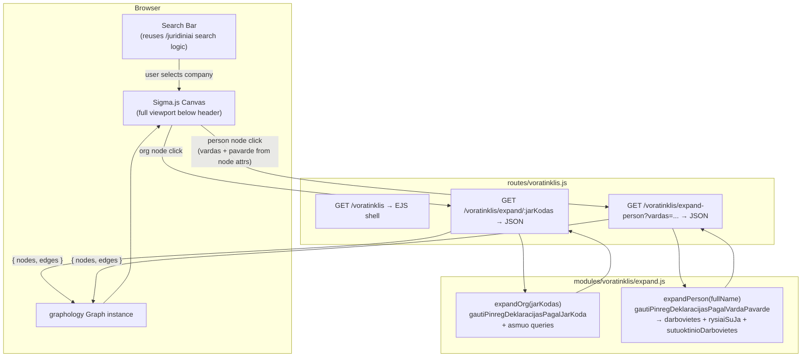
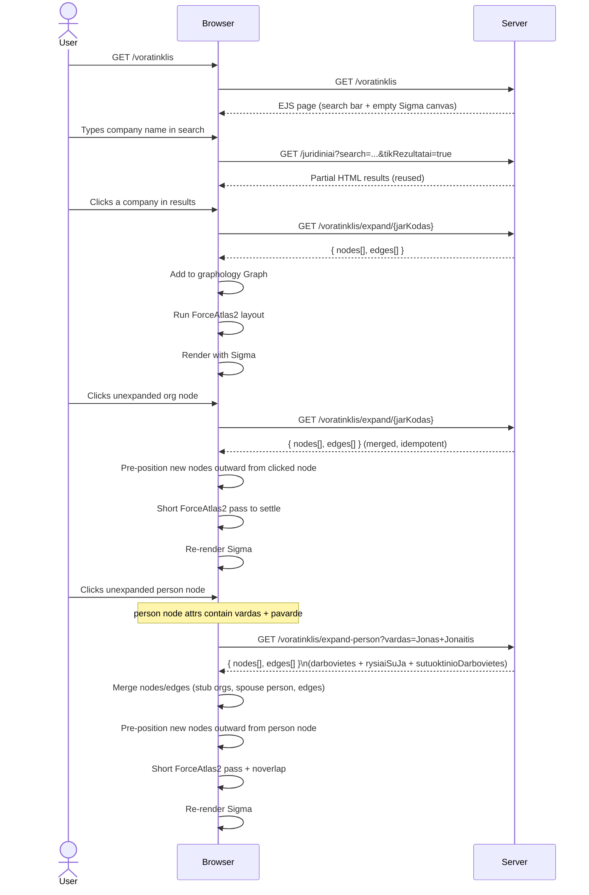

# Voratinklis — Interactive Procurement Network Graph

## Summary

Add a new page `/voratinklis` (Lithuanian: "spider web") that renders an interactive Sigma.js network graph
of procurement relationships between legal entities. The user searches for a company using the existing
company search, selects one, and the graph initialises with that company as the root node.

Two types of node expansion are supported:
- **Organisation node click** — expands employees, board members, shareholders, spouses, and linked contract
  partners via `/voratinklis/expand/:jarKodas`.
- **Person node click** — expands all workplaces, governance roles, and spouse relationships declared by
  that person via `/voratinklis/expand-person?vardas=...`. Data comes from PINREG declarations queried
  directly from the DB using `gautiPinregDeklaracijasPagalVardaPavarde` (the same function that backs the
  MCP `get_pinreg_asmuo` tool). MCP is not used for this — direct DB calls are faster and avoid HTTP/SSE
  overhead; MCP is designed for external AI clients only.

Stack additions: `sigma@3`, `graphology@0.26`, `graphology-layout-forceatlas2`, `graphology-layout-noverlap`,
`@sigma/node-border`, `@sigma/node-image`. Because these are ESM npm packages targeted at Node, a browser
bundle must be compiled with `esbuild` and served as `public/dist/voratinklis.js`.

---

## Technical Breakdown

### Entity & Edge Types

The graph uses the entity and edge model defined in the repository data structures:

| Node type            | Expand trigger        | Source function / data                                         | Key fields                                                   |
|----------------------|-----------------------|----------------------------------------------------------------|--------------------------------------------------------------|
| `OrganizationEntity` | Org node click        | `gautiPinregDeklaracijasPagalJarKoda(jarKodas)` + `asmuo.json` | `jarKodas`, `pavadinimas`, `registravimoData`, `formosKodas` |
| `PersonEntity`       | Org node click        | `pinreg.darbovietes[]` / `pinreg.rysiaiSuJa[]`                | `vardas + pavarde` (name is the identity key), `rysioPradzia` |
| `PersonEntity`       | Person node click     | `gautiPinregDeklaracijasPagalVardaPavarde(fullName)`           | Same; all declarations for that name are merged into one node |
| `ContractEntity`     | Org node click        | `sutartys.topPirkejai/topTiekejai`                             | `sutartiesUnikalusID`, `verte`, dates                        |

**Entity ID convention:**

| Entity | ID format | Example |
|---|---|---|
| Organisation | `org:{jarKodas}` | `org:110053842` |
| Person | `person:{vardas.trim().toLowerCase()} {pavarde.trim().toLowerCase()}` | `person:jonas jonaitis` |
| Contract | `contract:{sutartiesUnikalusID}` | `contract:2008059225` |

> **Person identity is name-only.** The same physical person appearing in declarations for different
> organisations will have the same node ID and will be merged into a single graph node automatically
> by graphology's idempotent merge — this is the intended behaviour. `deklaracija` UUIDs are stored
> as a node attribute array (`deklaracijos: string[]`) for audit purposes but are not used as the ID.
> Person nodes must store `vardas` and `pavarde` as separate attributes so the frontend can derive
> the node ID and pass the full name to `expand-person`.

#### Person node expansion — what `gautiPinregDeklaracijasPagalVardaPavarde` returns

| Section | Produces | Edge type |
|---|---|---|
| `darbovietes[]` | `OrganizationEntity` stub nodes + edges | `Employment` / `Director` / `Official` (person → org) |
| `rysiaiSuJa[]` | `OrganizationEntity` stub nodes + edges | `Director` / `Shareholder` / `Official` (person → org) |
| `sutuoktinioDarbovietes[]` | `PersonEntity` (spouse) + `OrganizationEntity` stubs | `Spouse` (person → spouse) + `Employment` (spouse → org) |

| Edge type                              | Direction       | Source                                                  |
|----------------------------------------|-----------------|---------------------------------------------------------|
| `Employment` / `Director` / `Official` | Person → Org    | `pinreg.darbovietes[].pareiguTipasPavadinimas`          |
| `Shareholder`                          | Person → Org    | `pinreg.rysiaiSuJa[].rysioPobudzioPavadinimas`          |
| `Spouse`                               | Person → Person | `pinreg.sutuoktinioDarbovietes[]`                       |
| `Order`                                | Org → Contract  | `sutartys.topPirkejai` → buyer side                     |
| `Delivery`                             | Org → Contract  | `sutartys.topTiekejai` → supplier side                  |

### Architecture

New server-side module `modules/voratinklis/` containing:

- `expand.js` — two exported functions:
  - `expandOrg(jarKodas)` — calls `gautiPinregDeklaracijasPagalJarKoda` (from `modules/pinreg/pinregDeklaracijos.js`)
    + the existing `asmuo` route queries; maps raw fields to `GraphNode[]` and `GraphEdge[]`.
  - `expandPerson(fullName)` — calls `gautiPinregDeklaracijasPagalVardaPavarde` (from `modules/pinreg/pagalVarda.js`)
    with `{ flat: false }`; maps `darbovietes`, `rysiaiSuJa`, and `sutuoktinioDarbovietes` to graph elements.
    Returns stub `OrganizationEntity` nodes (only `jarKodas` + `pavadinimas` known) for each workplace.
  - Both return `{ nodes: GraphNode[], edges: GraphEdge[] }`.

New route `routes/voratinklis.js`:

| Method | Path                                    | Purpose                                                              |
|--------|-----------------------------------------|----------------------------------------------------------------------|
| `GET`  | `/voratinklis`                          | EJS page shell (header + full-height Sigma canvas + search bar)      |
| `GET`  | `/voratinklis/expand/:jarKodas`         | JSON: graph nodes+edges for one organisation (calls `expandOrg`)     |
| `GET`  | `/voratinklis/expand-person`            | JSON: graph nodes+edges for one person by full name (`?vardas=...`). Calls `expandPerson`. |

Browser bundle `src/voratinklis-bundle.js` compiled by esbuild into `public/dist/voratinklis.js`:
imports sigma, graphology, layouts, and node-programs; exports nothing — attaches `window.Voratinklis`
with `{ Sigma, Graph, forceAtlas2, noverlap, NodeBorderProgram, NodeImageProgram }` so the inline EJS
script can initialise the graph.

### Client-side fetch strategy

The project uses **no data-fetching library** anywhere — all client fetch calls in every view are vanilla
`fetch()` with manual `AbortController`, debouncing, and request-ID sequencing (see `views/juridiniai/search.ejs`
for the canonical pattern). `@tanstack/query-core` was considered but is **not used** — reasoning:

- Node expansion is **one-shot and idempotent**: once a node is marked `expanded: true`, it is never
  re-fetched. No stale-while-revalidate, background refresh, or pagination is required.
- Concurrent duplicate clicks on the same unexpanded node are deduplicated with a **`Set<nodeId>`** of
  in-flight requests (consistent with the `inFlightControllers` Map pattern already used in the project).
- Introducing a framework-agnostic query client would be an isolated pattern inconsistent with the
  zero-framework vanilla JS convention throughout all views.

**In-flight deduplication pattern** (to implement in the inline script):
```js
const expandingNodes = new Set(); // IDs currently being fetched

async function loadOrg(jarKodas) {
  const id = `org:${jarKodas}`;
  if (expandingNodes.has(id)) return;
  expandingNodes.add(id);
  try {
    const data = await fetch(`/voratinklis/expand/${jarKodas}`).then(r => r.json());
    mergeGraphElements(data);
    graph.setNodeAttribute(id, 'expanded', true);
  } finally {
    expandingNodes.delete(id);
  }
}
```
Same pattern applies to `loadPerson`, keyed by `person:{(vardas+" "+pavarde).trim().toLowerCase()}`.

### Structural Diagram



### Behavioral Diagram



---

## Out of Scope

- Contract node expansion (clicking a `ContractEntity` node to load the full contract) — v2
- Risk score colouring of nodes/edges
- Saving / sharing graph state via URL
- Toolbar "Balance" button triggering a full ForceAtlas2 pass — v2

---

## Tasks

**Phase 1 — Infrastructure (bundle + route skeleton)**

- [ ] Install npm runtime packages: `sigma@^3.0.2`, `graphology@^0.26.0`, `graphology-layout-forceatlas2@^0.10.1`,
  `graphology-layout-noverlap@^0.4.2`, `@sigma/node-border@^3.0.0`, `@sigma/node-image@^3.0.0`
- [ ] Install dev dependency: `esbuild` (for browser bundle build)
- [ ] Create `src/voratinklis-bundle.js` entry point that imports sigma/graphology packages and attaches them to
  `window.Voratinklis`
- [ ] Add `build:voratinklis` and `watch:voratinklis` npm scripts using
  `esbuild src/voratinklis-bundle.js --bundle --outfile=public/dist/voratinklis.js`
- [ ] Run `npm run build:voratinklis` to generate the initial bundle
- [ ] Create `routes/voratinklis.js` with `GET /voratinklis` serving a skeleton EJS page,
  `GET /voratinklis/expand/:jarKodas` and `GET /voratinklis/expand-person` both returning `{ nodes: [], edges: [] }`
- [ ] Create `views/voratinklis/index.ejs` — standard EJS shell with header/footer, full-height `#voratinklis-canvas`
  div, and `<script src="/dist/voratinklis.js">` tag
- [ ] Verify server starts and `GET /voratinklis` returns HTTP 200
- [ ] Mark all checkboxes as done in this document once verified

**Phase 2 — Backend expand API**

- [ ] Create `modules/voratinklis/expand.js` with two exported functions:
  - `expandOrg(jarKodas)`:
    - Calls `gautiPinregDeklaracijasPagalJarKoda(jarKodas)` from `modules/pinreg/pinregDeklaracijos.js` for
      `darbovietes`, `rysiaiSuJa`, `sutuoktinioDarbovietes`
    - Maps `jar.*` → `OrganizationEntity` node with `id: "org:{jarKodas}"`
    - Maps `darbovietes[]` → `PersonEntity` nodes with `id: "person:{(vardas+' '+pavarde).trim().toLowerCase()}"` (store `vardas`, `pavarde`, `deklaracija` as attrs) + `Employment/Director/Official` edges
    - Maps `rysiaiSuJa[]` → `PersonEntity` nodes (same name-based ID) + `Director/Shareholder/Official` edges — merges automatically if person already in graph
    - Maps `sutuoktinioDarbovietes[]` → `PersonEntity` nodes (name-based ID for both declarant and spouse) + `Spouse` edges
    - Maps `sutartys.topPirkejai[]` and `sutartys.topTiekejai[]` → stub `OrganizationEntity` nodes + `Order`/`Delivery` edges
    - Returns `{ nodes: GraphNode[], edges: GraphEdge[] }`
  - `expandPerson(fullName)`:
    - Calls `gautiPinregDeklaracijasPagalVardaPavarde(fullName, { flat: false })` from `modules/pinreg/pagalVarda.js`
    - Maps `darbovietes[]` → stub `OrganizationEntity` nodes (`jarKodas` + `pavadinimas`) + `Employment/Director/Official` edges (person → org)
    - Maps `rysiaiSuJa[]` → stub `OrganizationEntity` nodes + `Director/Shareholder/Official` edges (person → org)
    - Maps `sutuoktinioDarbovietes[]` → `PersonEntity` (spouse, id: `person:{sutuoktinioVardas+' '+sutuoktinioPavarde}` normalized) + `Spouse` edge + stub org nodes + `Employment` edges (spouse → org)
    - Returns `{ nodes: GraphNode[], edges: GraphEdge[] }`
- [ ] Wire `GET /voratinklis/expand/:jarKodas` → `expandOrg`
- [ ] Wire `GET /voratinklis/expand-person?vardas=...` → `expandPerson` (validate `vardas` query param is present)
- [ ] Manually verify org expand: `curl "/voratinklis/expand/110053842"` returns well-formed data
- [ ] Manually verify person expand: `curl "/voratinklis/expand-person?vardas=Jonas+Jonaitis"` returns darbovietes + rysiaiSuJa + sutuoktinioDarbovietes mapped to graph elements
- [ ] Mark all checkboxes as done in this document once verified

**Phase 3 — Frontend Sigma graph**

- [ ] In `views/voratinklis/index.ejs`:
    - Add `#voratinklis-canvas` with `height: calc(100vh - var(--site-header-offset))` and `width: 100%`
    - Include the company search bar (reuse `juridiniai/search.ejs` pattern or inline a simplified version with
      `form action="/voratinklis"`)
    - On company selection, trigger `loadOrg(jarKodas)` via JS
- [ ] In the inline `<script>` (or a separate `views/js/voratinklis.ejs`):
    - Initialise a `graphology.Graph` (directed)
    - Initialise Sigma renderer on `#voratinklis-canvas` with `NodeBorderProgram` and `NodeImageProgram`
    - Maintain `const expandingNodes = new Set()` to deduplicate concurrent in-flight expand requests
      (consistent with the `inFlightControllers` Map pattern in `views/juridiniai/search.ejs`)
    - `loadOrg(jarKodas)`:
        1. Guard: skip if `expandingNodes.has("org:{jarKodas}")`, otherwise add to set
        2. `GET /voratinklis/expand/{jarKodas}`
        3. Merge returned nodes/edges into the graphology graph (skip duplicates by ID)
        4. Pre-position new nodes outward from the root/clicked node
        5. Run ForceAtlas2 (`graphology-layout-forceatlas2`) with `{ iterations: 150 }`
        6. Call `noverlap` (`graphology-layout-noverlap`) to reduce overlaps
        7. Mark node `expanded: true`; remove from `expandingNodes` in `finally`
    - `loadPerson(vardas, pavarde)`:
        1. Derive `nodeId = "person:" + (vardas + " " + pavarde).trim().toLowerCase()`
        2. Guard: skip if `expandingNodes.has(nodeId)`, otherwise add to set
        3. `GET /voratinklis/expand-person?vardas={encodeURIComponent(vardas + " " + pavarde)}`
        4. Merge returned nodes/edges into the graphology graph (skip duplicates by ID)
        5. Pre-position new nodes outward from the clicked person node
        6. Short ForceAtlas2 pass + noverlap to settle layout
        7. Mark node `expanded: true`; remove from `expandingNodes` in `finally`
    - On Sigma node `clickNode` event:
      - `OrganizationEntity` node with `expanded === false` → call `loadOrg(node.attributes.jarKodas)`, mark `expanded: true`
      - `PersonEntity` node with `expanded === false` → call `loadPerson(node.attributes.vardas, node.attributes.pavarde)`, mark `expanded: true`
    - Node size: `Math.max(8, Math.log(node.attributes.verte ?? 1) * 3)` for org nodes; fixed size for person nodes
    - Node colour: grey for stub orgs, blue for expanded orgs, orange for persons, green for contracts
- [ ] Verify graph renders for a real `jarKodas` (e.g. `110053842`)
- [ ] Add `/voratinklis` link to the main navigation in `views/header.ejs` (desktop + mobile nav)
- [ ] Update required documentation after the implementation is complete
- [ ] Ensure new tests are added for the new feature and all tests are passing
- [ ] Perform linting and formatting to maintain code quality and consistency
- [ ] Review the implementation to ensure it meets the requirements and follows best practices
- [ ] Mark all checkboxes as done in this document once verified

---

## Open Questions

1. **ForceAtlas2 in browser**: `graphology-layout-forceatlas2` runs synchronously and blocks the main thread
   for large graphs. For large graphs (>200 nodes) a Web Worker is recommended. For v1, synchronous with
   a capped iteration count is acceptable.

2. **Search UX on `/voratinklis`**: Should the search results panel float over the graph (overlay panel),
   or should the layout have a sidebar? Recommended: floating overlay panel that dismisses when a company
   is selected, to maximise graph canvas area.
