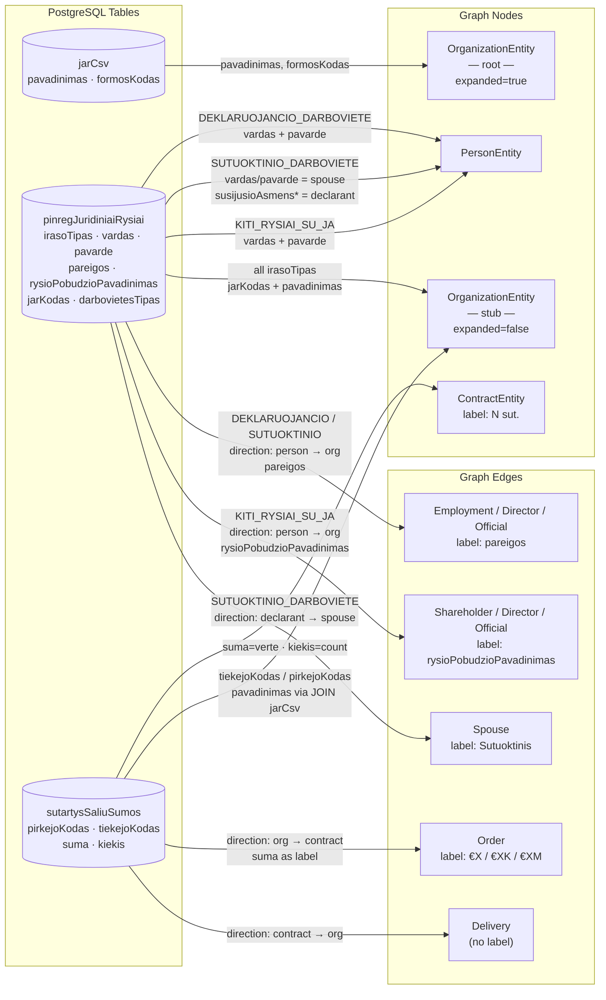
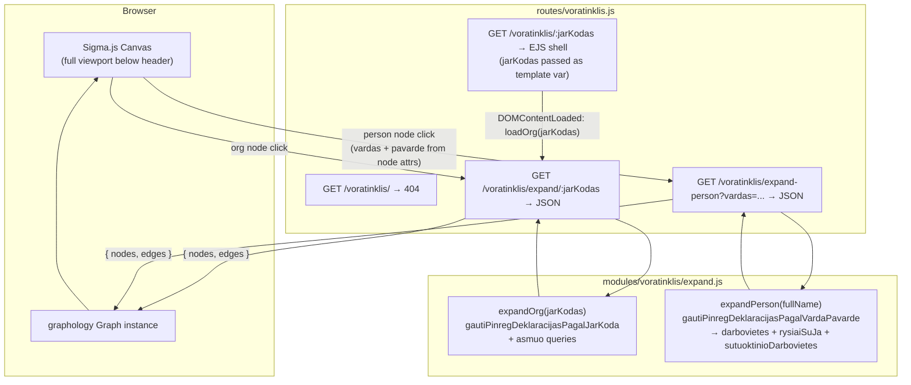

# Voratinklis — Interactive Procurement Network Graph

## Summary

Add a new page `/voratinklis/:jarKodas` (Lithuanian: "spider web") that renders an interactive Sigma.js
network graph of procurement relationships centred on the company identified by `jarKodas`. The page
immediately initialises the graph with that company as the root node — no search step is needed.
Visiting `/voratinklis/` without a company code returns a 404-style "įmonė nenurodyta" page.

Two types of node expansion are supported:

- **Organisation node click** — expands employees, board members, shareholders, spouses, and linked contract
  partners via `/voratinklis/expand/:jarKodas`.
- **Person node click** — expands all workplaces, governance roles, and spouse relationships declared by
  that person via `/voratinklis/expand-person?vardas=...`. Data comes from PINREG declarations queried
  directly from the DB using `gautiPinregDeklaracijasPagalVardaPavarde` (the same function that backs the
  MCP `get_pinreg_asmuo` tool). MCP is not used for this — direct DB calls are faster and avoid HTTP/SSE
  overhead; MCP is designed for external AI clients only.

Stack additions: `sigma@3`, `graphology@0.26`, `graphology-layout-forceatlas2`, `graphology-layout-noverlap`,
`@sigma/node-border`, `@sigma/node-image`. Because these are ESM npm packages targeted at Node, a browser
bundle must be compiled with `esbuild` and served as `public/dist/voratinklis.js`.

---

## Technical Breakdown

### Entity & Edge Types

The graph uses the entity and edge model defined in the repository data structures:

| Node type            | Expand trigger    | Source function / data                                         | Key fields                                                    |
|----------------------|-------------------|----------------------------------------------------------------|---------------------------------------------------------------|
| `OrganizationEntity` | Org node click    | `gautiPinregDeklaracijasPagalJarKoda(jarKodas)` + `asmuo.json` | `jarKodas`, `pavadinimas`, `registravimoData`, `formosKodas`  |
| `PersonEntity`       | Org node click    | `pinreg.darbovietes[]` / `pinreg.rysiaiSuJa[]`                 | `vardas + pavarde` (name is the identity key), `rysioPradzia` |
| `PersonEntity`       | Person node click | `gautiPinregDeklaracijasPagalVardaPavarde(fullName)`           | Same; all declarations for that name are merged into one node |
| `ContractEntity`     | Org node click    | `sutartys.topPirkejai/topTiekejai`                             | `sutartiesUnikalusID`, `verte`, dates                         |

**Entity ID convention:**

| Entity       | ID format                                                             | Example                                   |
|--------------|-----------------------------------------------------------------------|-------------------------------------------|
| Organisation | `org:{jarKodas}`                                                      | `org:110053842`                           |
| Person       | `person:{vardas.trim().toLowerCase()} {pavarde.trim().toLowerCase()}` | `person:jonas jonaitis`                   |
| Contract     | `contract:buyer{buyerJk}:seller{sellerJk}`                            | `contract:buyer110078991:seller110394345` |

> **Person identity is name-only.** The same physical person appearing in declarations for different
> organisations will have the same node ID and will be merged into a single graph node automatically
> by graphology's idempotent merge — this is the intended behaviour. `deklaracija` UUIDs are stored
> as a node attribute array (`deklaracijos: string[]`) for audit purposes but are not used as the ID.
> Person nodes must store `vardas` and `pavarde` as separate attributes so the frontend can derive
> the node ID and pass the full name to `expand-person`.

#### Person node expansion — `expandPerson` and `expandOrg` DB mapping

Both functions query `pinregJuridiniaiRysiai` directly. Each row has an `irasoTipas` classifier that
determines which graph elements to produce:

| `irasoTipas`                | Produces                                                                       | Edge type(s)                                                           |
|-----------------------------|--------------------------------------------------------------------------------|------------------------------------------------------------------------|
| `DEKLARUOJANCIO_DARBOVIETE` | `PersonEntity` (declarant) + `OrganizationEntity` stub                         | `Employment`/`Director`/`Official` — person → org                      |
| `KITI_RYSIAI_SU_JA`         | `PersonEntity` + `OrganizationEntity` stub                                     | `Director`/`Shareholder`/`Official` — person → org                     |
| `SUTUOKTINIO_DARBOVIETE`    | `PersonEntity` (spouse) + `OrganizationEntity` stub + declarant `PersonEntity` | `Employment`/`Director` (spouse → org) + `Spouse` (declarant → spouse) |

| Edge type                               | Direction       | Source                                                                                        |
|-----------------------------------------|-----------------|-----------------------------------------------------------------------------------------------|
| `Employment` / `Director` / `Official`  | Person → Org    | `pinregJuridiniaiRysiai` rows with `irasoTipas = DEKLARUOJANCIO_DARBOVIETE`                   |
| `Employment` / `Director`               | Spouse → Org    | `pinregJuridiniaiRysiai` rows with `irasoTipas = SUTUOKTINIO_DARBOVIETE`                      |
| `Shareholder` / `Director` / `Official` | Person → Org    | `pinregJuridiniaiRysiai` rows with `irasoTipas = KITI_RYSIAI_SU_JA`                           |
| `Spouse`                                | Person → Person | `pinregJuridiniaiRysiai` rows with `irasoTipas = SUTUOKTINIO_DARBOVIETE` (declarant → spouse) |
| `Order`                                 | Org → Contract  | `sutartys.topPirkejai` → buyer side                                                           |
| `Delivery`                              | Org → Contract  | `sutartys.topTiekejai` → supplier side                                                        |

> **`irasoTipas` is a record classifier, not a role label.** The three distinct values in the DB are
> `DEKLARUOJANCIO_DARBOVIETE`, `SUTUOKTINIO_DARBOVIETE`, and `KITI_RYSIAI_SU_JA`. They must **never**
> be used as edge labels — they are only used to decide which mapping branch to enter.

#### Data Source → Graph Element Mapping



#### Edge labels

Every edge must carry a visible `label` attribute set at build time in `modules/voratinklis/expand.js`:

| Edge type                                                          | `label` value                                                                                                                                                                              |
|--------------------------------------------------------------------|--------------------------------------------------------------------------------------------------------------------------------------------------------------------------------------------|
| `Order` / `Delivery`                                               | Formatted `verte`: `€1.2M`, `€450K`, `€12K`, etc. — see formatting note                                                                                                                    |
| `Employment` / `Director` / `Official` (person or spouse → org)    | `pareigos` field (free-text job title, e.g. "Direktorius", "Gydytojas"). Never `darbovietesTipas` — that field holds `STANDARTINE`, `EKSPERTO`, or `SUTUOKTINIO` and is not human-readable |
| `Director` / `Shareholder` / `Official` (from `KITI_RYSIAI_SU_JA`) | `rysioPobudzioPavadinimas` field (controlled vocabulary, e.g. "Valdybos narys", "Akcininkas")                                                                                              |
| `Spouse`                                                           | `"Sutuoktinis"`                                                                                                                                                                            |

> **Contract value formatting**: use `Math.round(verte)` and express as `€XM` (millions, 1 dp), `€XK`
> (thousands, 0 dp), or `€X` (under 1000) — e.g. `1234567 → €1.2M`, `45000 → €45K`, `800 → €800`.
> `null`/`0` values display an empty string (no label).

#### Node labels

Node labels are rendered **below** the node. Long names are word-wrapped at **3 words per line**
using a simple space-split utility:

```js
function wrapLabel(name, n = 3) {
    const words = (name ?? '').split(' ');
    const lines = [];
    for (let i = 0; i < words.length; i += n) lines.push(words.slice(i, i + n).join(' '));
    return lines.join('\n');
}
```

| Entity type          | Label source             | Applied as                          |
|----------------------|--------------------------|-------------------------------------|
| `OrganizationEntity` | `pavadinimas`            | `wrapLabel(pavadinimas)`            |
| `PersonEntity`       | `vardas + " " + pavarde` | `wrapLabel(vardas + " " + pavarde)` |
| `ContractEntity`     | contract count           | `"N sut."` (e.g. `"17 sut."`)       |

Sigma's default label renderer draws labels to the **right** of the node centre. A custom
`defaultDrawNodeLabel` function must be provided to `new Sigma(graph, container, { defaultDrawNodeLabel })`
to position the label **below** the node (draw at `y + nodeSize + labelPadding`, horizontally centred on `x`).

### Architecture

New server-side module `modules/voratinklis/` containing:

- `expand.js` — two exported functions:
    - `expandOrg(jarKodas)` — queries `jarCsv`, `pinregJuridiniaiRysiai`, and `sutartysSaliuSumos` (via
      `gautiSutarciuDuomenisPagalJarKoda`) directly; maps raw rows to `GraphNode[]` and `GraphEdge[]`.
    - `expandPerson(fullName)` — queries `pinregJuridiniaiRysiai` directly, matching on `vardas`/`pavarde`
      or `susijusioAsmensVardas`/`susijusioAsmensPavarde`; returns stub `OrganizationEntity` nodes and all
      person↔org / spouse edges.
    - Both return `{ nodes: GraphNode[], edges: GraphEdge[] }`.

New route `routes/voratinklis.js`:

| Method | Path                            | Purpose                                                                                    |
|--------|---------------------------------|--------------------------------------------------------------------------------------------|
| `GET`  | `/voratinklis/`                 | Returns 404 ("įmonė nenurodyta") — no jarKodas was given                                   |
| `GET`  | `/voratinklis/:jarKodas`        | EJS page shell with jarKodas passed as template variable; graph auto-initialises on load   |
| `GET`  | `/voratinklis/expand/:jarKodas` | JSON: graph nodes+edges for one organisation (calls `expandOrg`)                           |
| `GET`  | `/voratinklis/expand-person`    | JSON: graph nodes+edges for one person by full name (`?vardas=...`). Calls `expandPerson`. |

> **Route ordering note**: `expand` and `expand-person` static path segments must be registered _before_
> the `/:jarKodas` wildcard so they are not swallowed by the dynamic route handler.

Browser bundle `src/voratinklis-bundle.js` compiled by esbuild into `public/dist/voratinklis.js`:
imports sigma, graphology, layouts, and node-programs; exports nothing — attaches `window.Voratinklis`
with `{ Sigma, Graph, forceAtlas2, noverlap, NodeBorderProgram, NodeImageProgram }` so the inline EJS
script can initialise the graph.

### Client-side fetch strategy

The project uses **no data-fetching library** anywhere — all client fetch calls in every view are vanilla
`fetch()` with manual `AbortController`, debouncing, and request-ID sequencing (see `views/juridiniai/search.ejs`
for the canonical pattern). `@tanstack/query-core` was considered but is **not used** — reasoning:

- Node expansion is **one-shot and idempotent**: once a node is marked `expanded: true`, it is never
  re-fetched. No stale-while-revalidate, background refresh, or pagination is required.
- Concurrent duplicate clicks on the same unexpanded node are deduplicated with a **`Set<nodeId>`** of
  in-flight requests (consistent with the `inFlightControllers` Map pattern already used in the project).
- Introducing a framework-agnostic query client would be an isolated pattern inconsistent with the
  zero-framework vanilla JS convention throughout all views.

**In-flight deduplication pattern** (to implement in the inline script):

```js
const expandingNodes = new Set(); // IDs currently being fetched

async function loadOrg(jarKodas) {
    const id = `org:${jarKodas}`;
    if (expandingNodes.has(id)) return;
    expandingNodes.add(id);
    try {
        const data = await fetch(`/voratinklis/expand/${jarKodas}`).then(r => r.json());
        mergeGraphElements(data);
        graph.setNodeAttribute(id, 'expanded', true);
    } finally {
        expandingNodes.delete(id);
    }
}
```

Same pattern applies to `loadPerson`, keyed by `person:{(vardas+" "+pavarde).trim().toLowerCase()}`.

### Structural Diagram



### Behavioral Diagram

```mermaid
sequenceDiagram
    actor User
    participant Browser
    participant Server
    User ->> Browser: GET /voratinklis/
    Browser ->> Server: GET /voratinklis/
    Server -->> Browser: 404 "įmonė nenurodyta"
    User ->> Browser: GET /voratinklis/{jarKodas}
    Browser ->> Server: GET /voratinklis/{jarKodas}
    Server -->> Browser: EJS page (empty Sigma canvas, jarKodas embedded)
    Browser ->> Browser: DOMContentLoaded → loadOrg(jarKodas)
    Browser ->> Server: GET /voratinklis/expand/{jarKodas}
    Server -->> Browser: { nodes[], edges[] }
    Browser ->> Browser: Add to graphology Graph
    Browser ->> Browser: Run ForceAtlas2 layout
    Browser ->> Browser: Render with Sigma
    User ->> Browser: Clicks unexpanded org node
    Browser ->> Browser: Show loading overlay (blocks further clicks)
    Browser ->> Server: GET /voratinklis/expand/{jarKodas}
    Server -->> Browser: { nodes[], edges[] } (merged, idempotent)
    Browser ->> Browser: Merge nodes; pre-position new nodes at clicked node pos
    Browser ->> Browser: Run ForceAtlas2 → compute final positions
Browser ->> Browser: animateNodes (600ms, quadraticInOut) clicked pos → final pos
Browser ->> Browser: Hide loading overlay
User ->> Browser: Clicks unexpanded person node
Note over Browser: person node attrs contain vardas + pavarde
Browser ->> Browser: Show loading overlay
Browser ->> Server: GET /voratinklis/expand-person?vardas=Jonas+Jonaitis
Server -->> Browser: { nodes[], edges[] }
Browser ->> Browser: Merge nodes ; pre-position new nodes at person node pos
Browser ->> Browser: Run ForceAtlas2 + noverlap → compute final positions
Browser ->> Browser: animateNodes (600ms, quadraticInOut) → final pos
Browser ->> Browser: Hide loading overlay
```

---

## Out of Scope

- Contract node expansion (clicking a `ContractEntity` node to load the full contract) — v2
- Risk score colouring of nodes/edges
- Saving / sharing graph state via URL
- Toolbar "Balance" button triggering a full ForceAtlas2 pass — v2

---

## Tasks

> **Phases 1–5 complete.** All infrastructure delivered: Express routes (`/voratinklis/`, `/:jarKodas`,
> `/expand/:jarKodas`, `/expand-person`), server-side `modules/voratinklis/expand.js` (direct DB queries,
> deduplication, `ContractEntity` intermediate nodes), Sigma.js canvas (full viewport, no footer), node
> icons via `NodeImageProgram`, equal node sizes (`size: 8`), `ContractEntity` label as `"N sut."`,
> `Order`/`Delivery` edge value labels with `forceLabel: true`, hover label pinned below node, JS extracted
> to `src/voratinklis-app.js`, unit tests in `test/voratinklis/expand.test.js` (51 passing, `npm test`).
> Edge label bug fixed: `DEKLARUOJANCIO_DARBOVIETE` and `SUTUOKTINIO_DARBOVIETE` person→org edges now use
> `pareigos` (human-readable job title) instead of `darbovietesTipas` (`STANDARTINE`/`EKSPERTO`/`SUTUOKTINIO`).

---

**Phase 6 — Expand animations and loading overlay**

- [ ] **Export `animateNodes` from the Sigma bundle** (`src/voratinklis-bundle.js`):

    ```js
    import { animateNodes } from 'sigma/utils/animate';
    window.Voratinklis = { Sigma, Graph, forceAtlas2, noverlap,
                           NodeBorderProgram, NodeImageProgram, animateNodes };
    ```

  Rebuild with `npm run build` after the change.

- [ ] **Animated node rearrangement after expand** (`src/voratinklis-app.js`):

  When `mergeGraphElements(data)` adds new nodes, animate them from the clicked node's position to
  their ForceAtlas2-computed positions. Exact steps inside `loadOrg` / `loadPerson`:

    1. Before merging, snapshot the clicked node's `{ x, y }`.
    2. Call `mergeGraphElements(data)` — new nodes land at default position `(0, 0)`.
    3. Collect the IDs of all **newly added** nodes (those not in the graph before step 2).
    4. Pre-position new nodes at the clicked node's `{ x, y }`.
    5. Run ForceAtlas2 (computes final positions for the full graph in-place).
    6. Read final `{ x, y }` for each new node from the graph — build a `targets` map.
    7. Reset each new node back to the clicked node's `{ x, y }`.
    8. Call `animateNodes(graph, targets, { duration: 600, easing: 'quadraticInOut' })`.

  The result: new nodes visually emerge from the clicked node and fly to their settled positions.

- [ ] **Loading overlay** (`views/voratinklis/index.ejs` + `src/voratinklis-app.js`):

  Add a `<div id="voratinklis-loading">` element inside the Sigma container:

    ```html
    <div id="voratinklis-loading" style="display:none;position:absolute;inset:0;
         background:rgba(0,0,0,0.5);z-index:10;
         align-items:center;justify-content:center;">
      <div class="animate-spin rounded-full h-12 w-12 border-4 border-white border-t-transparent"></div>
    </div>
    ```

  The Sigma container must have `position: relative` (it already fills the viewport — add the style).

  In `voratinklis-app.js`:
    - `showLoading()` — sets `display: flex` on the overlay. Called immediately when a node is clicked
      and added to `expandingNodes` (before the `fetch`).
    - `hideLoading()` — sets `display: none`. Called in the `finally` block of every expand function.
    - While the overlay is visible it covers the canvas, so no further node clicks can fire. No extra
      click-guard logic is needed — the DOM overlay handles it.

---

**Phase 7 — Proper Person→Org edge types from actual job title**

#### Background

`mapDarbovietesTipas(tipas)` checks for keywords like `"vadovas"` and `"ekspertas"` inside `tipas`,
but it is currently called with `row.darbovietesTipas` whose only values are `STANDARTINE`, `EKSPERTO`,
and `SUTUOKTINIO`. None of these match the keyword checks, so the function always falls through to
`'Employment'` — meaning every person→org edge for `DEKLARUOJANCIO_DARBOVIETE` rows is typed as
`Employment` regardless of whether the person is a CEO, Board Chair, or a Shareholder.

The actual role lives in `row.pareigos` ("Direktorius", "Vadovas", "Generalinis direktorius",
"Pirkimo iniciatorius", etc.). `mapDarbovietesTipas` must be updated to accept `pareigos` content,
and all call sites must pass `row.pareigos` instead of `row.darbovietesTipas`.

#### Tasks

- [ ] **Rename + fix `mapDarbovietesTipas` to operate on `pareigos`**
  (`modules/voratinklis/expand.js`):

  Rename the function to `mapPareigos(pareigos)` and expand the Lithuanian keyword list:

  | `pareigos` contains (case-insensitive) | Edge type    |
  |----------------------------------------|--------------|
  | `direktorius`, `direktorė`, `vadovas`, `prezidentas`, `pirmininkas`, `generalinis` | `'Director'` |
  | `pirkimo iniciatorius`, `ekspertas`, `prokuristas`, `kontrolierius` | `'Official'` |
  | anything else (or null/empty)          | `'Employment'` |

  Update all call sites in `expandOrg` and `expandPerson` to pass `row.pareigos`:
  - `expandOrg` → `DEKLARUOJANCIO_DARBOVIETE` branch (line ~214): `mapPareigos(row.pareigos)`
  - `expandOrg` → `SUTUOKTINIO_DARBOVIETE` branch (line ~240): `mapPareigos(row.pareigos)` (spouse's job title)
  - `expandPerson` → `DEKLARUOJANCIO_DARBOVIETE` branch (line ~324): `mapPareigos(row.pareigos)`
  - `expandPerson` → `SUTUOKTINIO_DARBOVIETE` branch (line ~354): `mapPareigos(row.pareigos)`

  For `KITI_RYSIAI_SU_JA` rows `mapRysioPobudis(row.rysioPobudzioPavadinimas)` is already correct — no change needed.

- [ ] **Update unit tests for `mapPareigos`** (`test/voratinklis/expand.test.js`):

  Replace all `mapDarbovietesTipas` test cases with `mapPareigos` test cases covering:
  - `"Direktorius"` → `'Director'`
  - `"Generalinis direktorius"` → `'Director'`
  - `"Vadovas"` → `'Director'`
  - `"Direktorė"` → `'Director'`
  - `"Pirmininkas"` → `'Director'`
  - `"Pirkimo iniciatorius"` → `'Official'`
  - `"Prokuristas"` → `'Official'`
  - `"Buhalterė"` → `'Employment'`
  - `""` / `null` → `'Employment'`

- [ ] **Edge colour differentiation by edge type** (`src/voratinklis-app.js`):

  Add an `EDGE_COLOR` map and apply it when merging edges so that Directors, Shareholders, and
  regular employees are visually distinct:

  | Edge type (stored as `edgeType` attribute) | Colour   |
  |--------------------------------------------|----------|
  | `Director`                                 | `#1d4ed8` (dark blue) |
  | `Shareholder`                              | `#7c3aed` (purple) |
  | `Official`                                 | `#0891b2` (teal) |
  | `Employment`                               | `#6b7280` (gray) |
  | `Spouse`                                   | `#f59e0b` (amber) |
  | `Order` / `Delivery`                       | `#10b981` (green — unchanged) |

  In `mergeGraphElements`, after building `attrs`, set `attrs.color = EDGE_COLOR[attrs.edgeType] || '#d1d5db'`
  before calling `graph.addEdgeWithKey`.

  Also add a legend `<div>` below the Sigma container (or as an absolutely positioned overlay) listing
  the edge type → colour mapping so users can interpret the graph without prior knowledge.

## Open Questions

1. **ForceAtlas2 in browser**: `graphology-layout-forceatlas2` runs synchronously and blocks the main thread
   for large graphs. For large graphs (>200 nodes) a Web Worker is recommended. For v1, synchronous with
   a capped iteration count is acceptable.

2. **Search UX on `/voratinklis`**: Eliminated. Entry to the graph is exclusively via
   `/voratinklis/:jarKodas` (e.g. linked from the `/asmuo/` page). ✓ Resolved.

3. **Header nav link for `/voratinklis`**: Keep the existing nav link pointing to `/voratinklis/` as-is. It
   will show the 404 "įmonė nenurodyta" page when clicked directly — this is intentional. ✓ Resolved.

