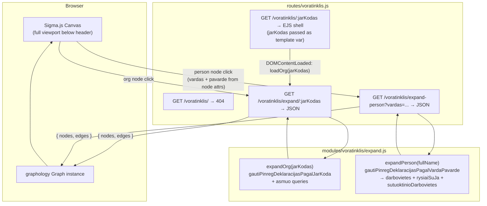
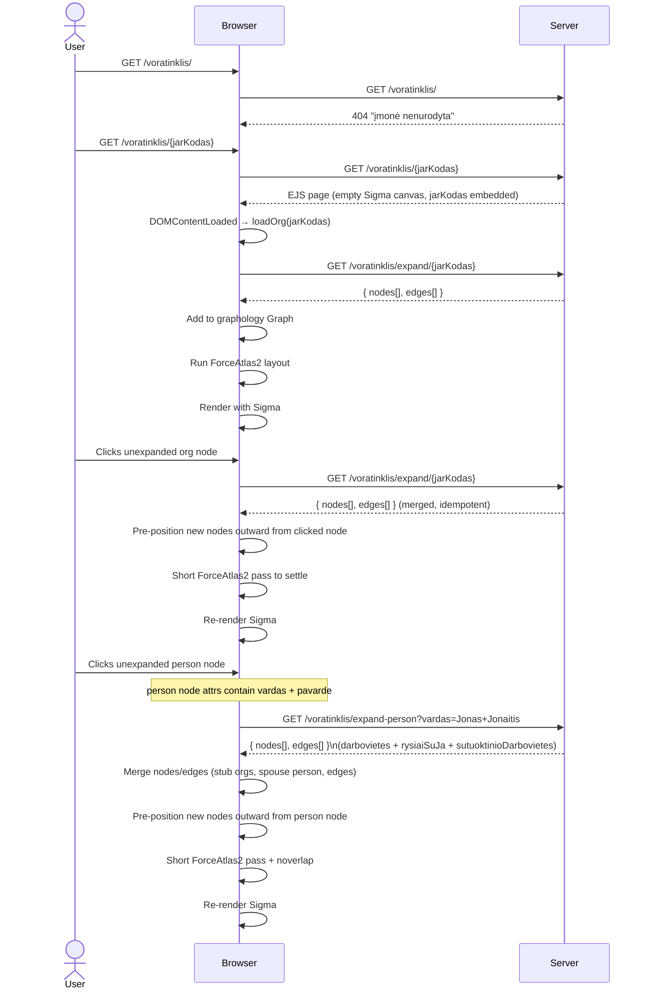

# Voratinklis — Interactive Procurement Network Graph

## Summary

Add a new page `/voratinklis/:jarKodas` (Lithuanian: "spider web") that renders an interactive Sigma.js
network graph of procurement relationships centred on the company identified by `jarKodas`. The page
immediately initialises the graph with that company as the root node — no search step is needed.
Visiting `/voratinklis/` without a company code returns a 404-style "įmonė nenurodyta" page.

Two types of node expansion are supported:

- **Organisation node click** — expands employees, board members, shareholders, spouses, and linked contract
  partners via `/voratinklis/expand/:jarKodas`.
- **Person node click** — expands all workplaces, governance roles, and spouse relationships declared by
  that person via `/voratinklis/expand-person?vardas=...`. Data comes from PINREG declarations queried
  directly from the DB using `gautiPinregDeklaracijasPagalVardaPavarde` (the same function that backs the
  MCP `get_pinreg_asmuo` tool). MCP is not used for this — direct DB calls are faster and avoid HTTP/SSE
  overhead; MCP is designed for external AI clients only.

Stack additions: `sigma@3`, `graphology@0.26`, `graphology-layout-forceatlas2`, `graphology-layout-noverlap`,
`@sigma/node-border`, `@sigma/node-image`. Because these are ESM npm packages targeted at Node, a browser
bundle must be compiled with `esbuild` and served as `public/dist/voratinklis.js`.

---

## Technical Breakdown

### Entity & Edge Types

The graph uses the entity and edge model defined in the repository data structures:

| Node type            | Expand trigger    | Source function / data                                         | Key fields                                                    |
|----------------------|-------------------|----------------------------------------------------------------|---------------------------------------------------------------|
| `OrganizationEntity` | Org node click    | `gautiPinregDeklaracijasPagalJarKoda(jarKodas)` + `asmuo.json` | `jarKodas`, `pavadinimas`, `registravimoData`, `formosKodas`  |
| `PersonEntity`       | Org node click    | `pinreg.darbovietes[]` / `pinreg.rysiaiSuJa[]`                 | `vardas + pavarde` (name is the identity key), `rysioPradzia` |
| `PersonEntity`       | Person node click | `gautiPinregDeklaracijasPagalVardaPavarde(fullName)`           | Same; all declarations for that name are merged into one node |
| `ContractEntity`     | Org node click    | `sutartys.topPirkejai/topTiekejai`                             | `sutartiesUnikalusID`, `verte`, dates                         |

**Entity ID convention:**

| Entity       | ID format                                                             | Example                 |
|--------------|-----------------------------------------------------------------------|-------------------------|
| Organisation | `org:{jarKodas}`                                                      | `org:110053842`         |
| Person       | `person:{vardas.trim().toLowerCase()} {pavarde.trim().toLowerCase()}` | `person:jonas jonaitis` |
| Contract     | `contract:{sutartiesUnikalusID}`                                      | `contract:2008059225`   |

> **Person identity is name-only.** The same physical person appearing in declarations for different
> organisations will have the same node ID and will be merged into a single graph node automatically
> by graphology's idempotent merge — this is the intended behaviour. `deklaracija` UUIDs are stored
> as a node attribute array (`deklaracijos: string[]`) for audit purposes but are not used as the ID.
> Person nodes must store `vardas` and `pavarde` as separate attributes so the frontend can derive
> the node ID and pass the full name to `expand-person`.

#### Person node expansion — what `gautiPinregDeklaracijasPagalVardaPavarde` returns

| Section                    | Produces                                             | Edge type                                                |
|----------------------------|------------------------------------------------------|----------------------------------------------------------|
| `darbovietes[]`            | `OrganizationEntity` stub nodes + edges              | `Employment` / `Director` / `Official` (person → org)    |
| `rysiaiSuJa[]`             | `OrganizationEntity` stub nodes + edges              | `Director` / `Shareholder` / `Official` (person → org)   |
| `sutuoktinioDarbovietes[]` | `PersonEntity` (spouse) + `OrganizationEntity` stubs | `Spouse` (person → spouse) + `Employment` (spouse → org) |

| Edge type                              | Direction       | Source                                         |
|----------------------------------------|-----------------|------------------------------------------------|
| `Employment` / `Director` / `Official` | Person → Org    | `pinreg.darbovietes[].pareiguTipasPavadinimas` |
| `Shareholder`                          | Person → Org    | `pinreg.rysiaiSuJa[].rysioPobudzioPavadinimas` |
| `Spouse`                               | Person → Person | `pinreg.sutuoktinioDarbovietes[]`              |
| `Order`                                | Org → Contract  | `sutartys.topPirkejai` → buyer side            |
| `Delivery`                             | Org → Contract  | `sutartys.topTiekejai` → supplier side         |

#### Edge labels

Every edge must carry a visible `label` attribute set at build time in `modules/voratinklis/expand.js`:

| Edge type                                                   | `label` value                                                           |
|-------------------------------------------------------------|-------------------------------------------------------------------------|
| `Order` / `Delivery`                                        | Formatted `verte`: `€1.2M`, `€450K`, `€12K`, etc. — see formatting note |
| `Employment` / `Director` / `Official`                      | Raw `pareiguTipasPavadinimas` string from the declaration (Lithuanian)  |
| `Director` / `Shareholder` / `Official` (from `rysiaiSuJa`) | Raw `rysioPobudzioPavadinimas` string (Lithuanian)                      |
| `Spouse`                                                    | `"Sutuoktinis"`                                                         |

> **Contract value formatting**: use `Math.round(verte)` and express as `€XM` (millions, 1 dp), `€XK`
> (thousands, 0 dp), or `€X` (under 1000) — e.g. `1234567 → €1.2M`, `45000 → €45K`, `800 → €800`.
> `null`/`0` values display an empty string (no label).

#### Node labels

Node labels are rendered **below** the node. Long names are word-wrapped at **3 words per line**
using a simple space-split utility:

```js
function wrapLabel(name, n = 3) {
    const words = (name ?? '').split(' ');
    const lines = [];
    for (let i = 0; i < words.length; i += n) lines.push(words.slice(i, i + n).join(' '));
    return lines.join('\n');
}
```

| Entity type          | Label source             | Applied as                          |
|----------------------|--------------------------|-------------------------------------|
| `OrganizationEntity` | `pavadinimas`            | `wrapLabel(pavadinimas)`            |
| `PersonEntity`       | `vardas + " " + pavarde` | `wrapLabel(vardas + " " + pavarde)` |
| `ContractEntity`     | `pavadinimas`            | `wrapLabel(pavadinimas)`            |

Sigma's default label renderer draws labels to the **right** of the node centre. A custom
`defaultDrawNodeLabel` function must be provided to `new Sigma(graph, container, { defaultDrawNodeLabel })`
to position the label **below** the node (draw at `y + nodeSize + labelPadding`, horizontally centred on `x`).

### Architecture

New server-side module `modules/voratinklis/` containing:

- `expand.js` — two exported functions:
    - `expandOrg(jarKodas)` — calls `gautiPinregDeklaracijasPagalJarKoda` (from `modules/pinreg/pinregDeklaracijos.js`)
        + the existing `asmuo` route queries; maps raw fields to `GraphNode[]` and `GraphEdge[]`.
    - `expandPerson(fullName)` — calls `gautiPinregDeklaracijasPagalVardaPavarde` (from `modules/pinreg/pagalVarda.js`)
      with `{ flat: false }`; maps `darbovietes`, `rysiaiSuJa`, and `sutuoktinioDarbovietes` to graph elements.
      Returns stub `OrganizationEntity` nodes (only `jarKodas` + `pavadinimas` known) for each workplace.
    - Both return `{ nodes: GraphNode[], edges: GraphEdge[] }`.

New route `routes/voratinklis.js`:

| Method | Path                            | Purpose                                                                                                     |
|--------|---------------------------------|-------------------------------------------------------------------------------------------------------------|
| `GET`  | `/voratinklis/`                 | Returns 404 ("įmonė nenurodyta") — no jarKodas was given                                                    |
| `GET`  | `/voratinklis/:jarKodas`        | EJS page shell with jarKodas passed as template variable; graph auto-initialises on load                    |
| `GET`  | `/voratinklis/expand/:jarKodas` | JSON: graph nodes+edges for one organisation (calls `expandOrg`)                                            |
| `GET`  | `/voratinklis/expand-person`    | JSON: graph nodes+edges for one person by full name (`?vardas=...`). Calls `expandPerson`.                  |

> **Route ordering note**: `expand` and `expand-person` static path segments must be registered _before_
> the `/:jarKodas` wildcard so they are not swallowed by the dynamic route handler.

Browser bundle `src/voratinklis-bundle.js` compiled by esbuild into `public/dist/voratinklis.js`:
imports sigma, graphology, layouts, and node-programs; exports nothing — attaches `window.Voratinklis`
with `{ Sigma, Graph, forceAtlas2, noverlap, NodeBorderProgram, NodeImageProgram }` so the inline EJS
script can initialise the graph.

### Client-side fetch strategy

The project uses **no data-fetching library** anywhere — all client fetch calls in every view are vanilla
`fetch()` with manual `AbortController`, debouncing, and request-ID sequencing (see `views/juridiniai/search.ejs`
for the canonical pattern). `@tanstack/query-core` was considered but is **not used** — reasoning:

- Node expansion is **one-shot and idempotent**: once a node is marked `expanded: true`, it is never
  re-fetched. No stale-while-revalidate, background refresh, or pagination is required.
- Concurrent duplicate clicks on the same unexpanded node are deduplicated with a **`Set<nodeId>`** of
  in-flight requests (consistent with the `inFlightControllers` Map pattern already used in the project).
- Introducing a framework-agnostic query client would be an isolated pattern inconsistent with the
  zero-framework vanilla JS convention throughout all views.

**In-flight deduplication pattern** (to implement in the inline script):

```js
const expandingNodes = new Set(); // IDs currently being fetched

async function loadOrg(jarKodas) {
    const id = `org:${jarKodas}`;
    if (expandingNodes.has(id)) return;
    expandingNodes.add(id);
    try {
        const data = await fetch(`/voratinklis/expand/${jarKodas}`).then(r => r.json());
        mergeGraphElements(data);
        graph.setNodeAttribute(id, 'expanded', true);
    } finally {
        expandingNodes.delete(id);
    }
}
```

Same pattern applies to `loadPerson`, keyed by `person:{(vardas+" "+pavarde).trim().toLowerCase()}`.

### Structural Diagram



### Behavioral Diagram



---

## Out of Scope

- Contract node expansion (clicking a `ContractEntity` node to load the full contract) — v2
- Risk score colouring of nodes/edges
- Saving / sharing graph state via URL
- Toolbar "Balance" button triggering a full ForceAtlas2 pass — v2

---

## Tasks

**Phase 1 — Infrastructure (bundle + route skeleton)**

- [x] Install npm runtime packages: `sigma@^3.0.2`, `graphology@^0.26.0`, `graphology-layout-forceatlas2@^0.10.1`,
  `graphology-layout-noverlap@^0.4.2`, `@sigma/node-border@^3.0.0`, `@sigma/node-image@^3.0.0`
- [x] Install dev dependency: `esbuild` (for browser bundle build)
- [x] Create `src/voratinklis-bundle.js` entry point that imports sigma/graphology packages and attaches them to
  `window.Voratinklis`
- [x] Add `build:voratinklis` and `watch:voratinklis` npm scripts using
  `esbuild src/voratinklis-bundle.js --bundle --format=iife --outfile=public/dist/voratinklis.js`
- [x] Run `npm run build:voratinklis` to generate the initial bundle (210 KB at `public/dist/voratinklis.js`)
- [x] Create `routes/voratinklis.js` with `GET /voratinklis`, `GET /voratinklis/expand/:jarKodas`, and
  `GET /voratinklis/expand-person`
- [x] Create `views/voratinklis/index.ejs` — EJS shell with header/footer, full-height `#voratinklis-canvas`
  div, floating search overlay, and `<script src="/dist/voratinklis.js">` tag
- [x] Verify route module loads (confirmed via `node --input-type=module` import check)

**Phase 2 — Backend expand API**

- [x] Create `modules/voratinklis/expand.js` with two exported functions:
    - `expandOrg(jarKodas)` — queries `pinregJuridiniaiRysiai` directly (raw names, not censored),
      `jarCsv` for org metadata, and `gautiSutarciuDuomenisPagalJarKoda` for top contract partners;
      returns `{ nodes: GraphNode[], edges: GraphEdge[] }`
    - `expandPerson(fullName)` — queries `pinregJuridiniaiRysiai` by name (vardas+pavarde or
      susijusioAsmensVardas+susijusioAsmensPavarde); maps to stub orgs + person edges;
      returns `{ nodes: GraphNode[], edges: GraphEdge[] }`
- [x] Wire `GET /voratinklis/expand/:jarKodas` → `expandOrg`
- [x] Wire `GET /voratinklis/expand-person?vardas=...` → `expandPerson` (validates `vardas` is present)
- [x] Both modules verified to load without syntax errors

**Phase 3 — Frontend Sigma graph**

- [x] `#voratinklis-canvas` fills viewport below header using `position: fixed` layout
- [x] Floating search overlay with debounced company search (reuses `/juridiniai` partial HTML)
- [x] `wrapLabel(name, n=3)` helper implemented
- [x] `formatContractValue(verte)` helper implemented (`€1.2M`, `€45K`, `€800`, `""`)
- [x] Custom `drawNodeLabel` renders label below node at `(x, y + nodeSize + 4)`, `textAlign: "center"`,
  multi-line support via `\n`
- [x] Sigma renderer initialised with `defaultDrawNodeLabel`
- [x] `expandingNodes: Set` for in-flight deduplication
- [x] `loadOrg(jarKodas, fromNodeId)` — fetch + merge + ForceAtlas2 + noverlap + mark expanded
- [x] `loadPerson(vardas, pavarde, fromNodeId)` — fetch + merge + layout + mark expanded
- [x] `clickNode` handler: org node → `loadOrg`, person node → `loadPerson`
- [x] Node colours: grey stub org / blue expanded org / orange person / green contract
- [x] Add `/voratinklis` link to `views/header.ejs` (desktop + mobile nav)

> **Note on `expand.js` implementation**: Instead of using the censoring helper
> `gautiPinregDeklaracijasPagalJarKoda`, `expand.js` queries `pinregJuridiniaiRysiai` directly to
> get raw `vardas`/`pavarde` for correct name-based person IDs. This is consistent with the
> `/asmuo/{jarKodas}.json` pattern which exposes raw data via JSON API.

---

**Phase 4 — Remove search bar; direct-URL activation**

- [x] **`routes/voratinklis.js`**: Remove `GET /voratinklis` (plain, no jarKodas) handler and replace with a
  handler that returns a 404 response using the existing `views/404.ejs` template (call `next()` or
  `res.status(404).renderCompiled('404', {})`, matching how `asmuo.js` calls `next()` when a company is
  not found).
- [x] **`routes/voratinklis.js`**: Add `GET /voratinklis/:jarKodas` route — validate jarKodas is numeric
  (`/^\d+$/`), then `res.renderCompiled('voratinklis/index', { req, jarKodas, customHead })`. Ensure
  `expand` and `expand-person` static paths are registered **before** the `/:jarKodas` wildcard.
- [x] **`views/voratinklis/index.ejs`**: Remove all search-bar HTML (`#voratinklis-search` div and its
  contents including the `<input>`, results dropdown, and `<script>` debounce/fetch logic). Remove the
  corresponding CSS rules for `#voratinklis-search`, `#voratinklis-search-results`, and
  `.voratinklis-result-item`.
- [x] **`views/voratinklis/index.ejs`**: Embed `jarKodas` into the inline `<script>` as a JS constant
  (`const INITIAL_JAR_KODAS = '<%- jarKodas %>';`) and call `loadOrg(INITIAL_JAR_KODAS)` inside
  `DOMContentLoaded` so the graph initialises automatically without user input.
- [x] **`views/header.ejs`**: Keep the existing `/voratinklis` nav link as-is — it intentionally points to
  `/voratinklis/` which shows a 404 when clicked directly. No change needed.

---

## Open Questions

1. **ForceAtlas2 in browser**: `graphology-layout-forceatlas2` runs synchronously and blocks the main thread
   for large graphs. For large graphs (>200 nodes) a Web Worker is recommended. For v1, synchronous with
   a capped iteration count is acceptable.

2. **Search UX on `/voratinklis`**: ~~Implemented as a floating overlay panel.~~ **Eliminated in Phase 4.**
   Entry to the graph is now exclusively via `/voratinklis/:jarKodas` (e.g. linked from the `/asmuo/` page).

3. **Header nav link for `/voratinklis`**: Keep the existing nav link pointing to `/voratinklis/` as-is. It
   will show the 404 "įmonė nenurodyta" page when clicked directly — this is intentional. ✓ Resolved.
