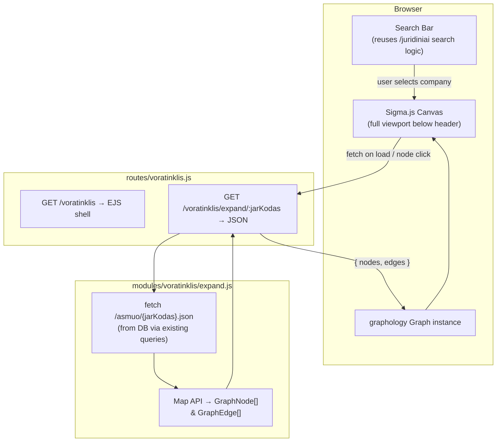
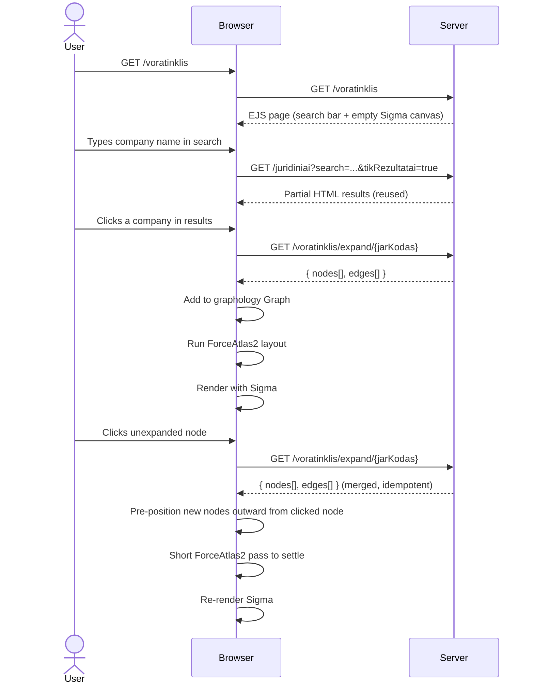

# Voratinklis — Interactive Procurement Network Graph

## Summary

Add a new page `/voratinklis` (Lithuanian: "spider web") that renders an interactive Sigma.js network graph
of procurement relationships between legal entities. The user searches for a company using the existing
company search, selects one, and the graph initialises with that company as the root node. Clicking any
node in the graph expands it to reveal its related entities (employees, contracts, linked organisations).

Stack additions: `sigma@3`, `graphology@0.26`, `graphology-layout-forceatlas2`, `graphology-layout-noverlap`,
`@sigma/node-border`, `@sigma/node-image`. Because these are ESM npm packages targeted at Node, a browser
bundle must be compiled with `esbuild` and served as `public/dist/voratinklis.js`.

---

## Technical Breakdown

### Entity & Edge Types

The graph uses the entity and edge model defined in the repository data structures:

| Node type            | Source endpoint                                            | Key fields                                                   |
|----------------------|------------------------------------------------------------|--------------------------------------------------------------|
| `OrganizationEntity` | `/asmuo/{jarKodas}.json`                                   | `jarKodas`, `pavadinimas`, `registravimoData`, `formosKodas` |
| `PersonEntity`       | `pinreg.darbovietes[]` / `pinreg.rysiaiSuJa[]`             | `deklaracija`, `vardas + pavarde`, `rysioPradzia`            |
| `ContractEntity`     | `/sutartis/{id}.json` + `sutartys.topPirkejai/topTiekejai` | `sutartiesUnikalusID`, `verte`, dates                        |

Entity ID convention: `org:{jarKodas}`, `person:{deklaracija}`, `contract:{sutartiesUnikalusID}`.

| Edge type                              | Direction       | Source                                         |
|----------------------------------------|-----------------|------------------------------------------------|
| `Employment` / `Director` / `Official` | Person → Org    | `pinreg.darbovietes[].pareiguTipasPavadinimas` |
| `Shareholder`                          | Person → Org    | `pinreg.rysiaiSuJa[].rysioPobudzioPavadinimas` |
| `Spouse`                               | Person → Person | `pinreg.sutuoktinioDarbovietes[]`              |
| `Order`                                | Org → Contract  | `sutartys.topPirkejai` → buyer side            |
| `Delivery`                             | Org → Contract  | `sutartys.topTiekejai` → supplier side         |

### Architecture

New server-side module `modules/voratinklis/` containing:

- `expand.js` — fetches `/asmuo/{jarKodas}.json` from the local DB / API, maps raw fields to
  `GraphNode[]` and `GraphEdge[]` following the entity-mapping rules documented in the data model.
  Returns a plain `{ nodes, edges }` JSON payload.

New route `routes/voratinklis.js`:

| Method | Path                            | Purpose                                                         |
|--------|---------------------------------|-----------------------------------------------------------------|
| `GET`  | `/voratinklis`                  | EJS page shell (header + full-height Sigma canvas + search bar) |
| `GET`  | `/voratinklis/expand/:jarKodas` | JSON: returns `{ nodes, edges }` for one organisation           |

Browser bundle `src/voratinklis-bundle.js` compiled by esbuild into `public/dist/voratinklis.js`:
imports sigma, graphology, layouts, and node-programs; exports nothing — attaches `window.Voratinklis`
with `{ Sigma, Graph, forceAtlas2, noverlap, NodeBorderProgram, NodeImageProgram }` so the inline EJS
script can initialise the graph.

### Structural Diagram

### Behavioral Diagram

---

## Out of Scope

- Contract node expansion (clicking a `ContractEntity` node to load the full contract) — v2
- Cross-org person deduplication (same physical person across multiple orgs has different `deklaracija` UUIDs)
- Risk score colouring of nodes/edges
- Saving / sharing graph state via URL
- Toolbar "Balance" button triggering a full ForceAtlas2 pass — v2

---

## Tasks

**Phase 1 — Infrastructure (bundle + route skeleton)**

- [ ] Install npm runtime packages: `sigma@^3.0.2`, `graphology@^0.26.0`, `graphology-layout-forceatlas2@^0.10.1`,
  `graphology-layout-noverlap@^0.4.2`, `@sigma/node-border@^3.0.0`, `@sigma/node-image@^3.0.0`
- [ ] Install dev dependency: `esbuild` (for browser bundle build)
- [ ] Create `src/voratinklis-bundle.js` entry point that imports sigma/graphology packages and attaches them to
  `window.Voratinklis`
- [ ] Add `build:voratinklis` and `watch:voratinklis` npm scripts using
  `esbuild src/voratinklis-bundle.js --bundle --outfile=public/dist/voratinklis.js`
- [ ] Run `npm run build:voratinklis` to generate the initial bundle
- [ ] Create `routes/voratinklis.js` with `GET /voratinklis` serving a skeleton EJS page and
  `GET /voratinklis/expand/:jarKodas` returning `{ nodes: [], edges: [] }`
- [ ] Create `views/voratinklis/index.ejs` — standard EJS shell with header/footer, full-height `#voratinklis-canvas`
  div, and `<script src="/dist/voratinklis.js">` tag
- [ ] Verify server starts and `GET /voratinklis` returns HTTP 200
- [ ] Mark all checkboxes as done in this document once verified

**Phase 2 — Backend expand API**

- [ ] Create `modules/voratinklis/expand.js` — `expandOrg(jarKodas)` function that:
    - Calls the existing `asmuo` data pipeline (reuse module queries) to get the `asmuo` JSON payload
    - Maps `jar.*` → `OrganizationEntity` node with `id: "org:{jarKodas}"`
    - Maps `pinreg.darbovietes[]` → `PersonEntity` nodes + `Employment/Director/Official` edges using the
      `pareiguTipasPavadinimas` mapping table
    - Maps `pinreg.rysiaiSuJa[]` → `PersonEntity` nodes + `Director/Shareholder/Official` edges using
      `rysioPobudzioPavadinimas` mapping table
    - Maps `pinreg.sutuoktinioDarbovietes[]` → `PersonEntity` nodes + `Spouse` edges
    - Maps `sutartys.topPirkejai[]` and `sutartys.topTiekejai[]` → stub `OrganizationEntity` nodes + `Order`/`Delivery`
      edges (no ContractEntity nodes in v1 for top-buyers/suppliers)
    - Returns `{ nodes: GraphNode[], edges: GraphEdge[] }`
- [ ] Wire `GET /voratinklis/expand/:jarKodas` in route to call `expandOrg` and return JSON
- [ ] Manually verify the API with `curl /voratinklis/expand/110053842` returns well-formed data
- [ ] Mark all checkboxes as done in this document once verified

**Phase 3 — Frontend Sigma graph**

- [ ] In `views/voratinklis/index.ejs`:
    - Add `#voratinklis-canvas` with `height: calc(100vh - var(--site-header-offset))` and `width: 100%`
    - Include the company search bar (reuse `juridiniai/search.ejs` pattern or inline a simplified version with
      `form action="/voratinklis"`)
    - On company selection, trigger `loadCompany(jarKodas)` via JS
- [ ] In the inline `<script>` (or a separate `views/js/voratinklis.ejs`):
    - Initialise a `graphology.Graph` (directed)
    - Initialise Sigma renderer on `#voratinklis-canvas` with `NodeBorderProgram` and `NodeImageProgram`
    - `loadCompany(jarKodas)`:
        1. `GET /voratinklis/expand/{jarKodas}`
        2. Merge returned nodes/edges into the graphology graph (skip duplicates by ID)
        3. Pre-position new nodes outward from the root node
        4. Run ForceAtlas2 (`graphology-layout-forceatlas2`) with `{ iterations: 150 }` in a Web Worker or
           `requestAnimationFrame` loop
        5. Call `noverlap` (`graphology-layout-noverlap`) to reduce overlaps
        6. Re-render Sigma
    - On Sigma node `clickNode` event: if `node.attributes.expanded === false`, call `loadCompany(jarKodas)` and mark
      the node as `expanded: true`
    - Node size: `Math.max(8, Math.log(node.attributes.verte ?? 1) * 3)` for org nodes; fixed size for person nodes
    - Node colour: grey for stub orgs, blue for expanded orgs, orange for persons, green for contracts
- [ ] Verify graph renders for a real `jarKodas` (e.g. `110053842`)
- [ ] Add `/voratinklis` link to the main navigation in `views/header.ejs` (desktop + mobile nav)
- [ ] Update required documentation after the implementation is complete
- [ ] Ensure new tests are added for the new feature and all tests are passing
- [ ] Perform linting and formatting to maintain code quality and consistency
- [ ] Review the implementation to ensure it meets the requirements and follows best practices
- [ ] Mark all checkboxes as done in this document once verified

---

## Open Questions

1. **Data source for `expandOrg`**: Should `expand.js` call the live `/asmuo/{jarKodas}.json` HTTP endpoint
   (self-request) or query the database directly via the existing `modules/juridiniai` and `modules/pinreg`
   queries? Direct DB queries are faster but require understanding the full schema; an HTTP self-call reuses
   the existing route but adds latency. Recommended: query DB directly using existing module functions.

2. **ForceAtlas2 in browser**: `graphology-layout-forceatlas2` runs synchronously and blocks the main thread
   for large graphs. For large graphs (>200 nodes) a Web Worker is recommended. For v1, synchronous with
   a capped iteration count is acceptable.

3. **Search UX on `/voratinklis`**: Should the search results panel float over the graph (overlay panel),
   or should the layout have a sidebar? Recommended: floating overlay panel that dismisses when a company
   is selected, to maximise graph canvas area.
