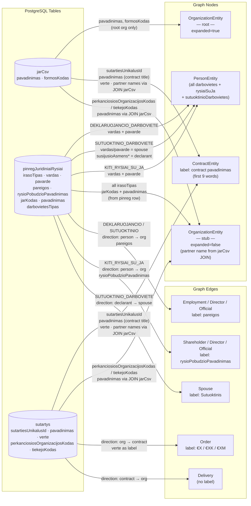
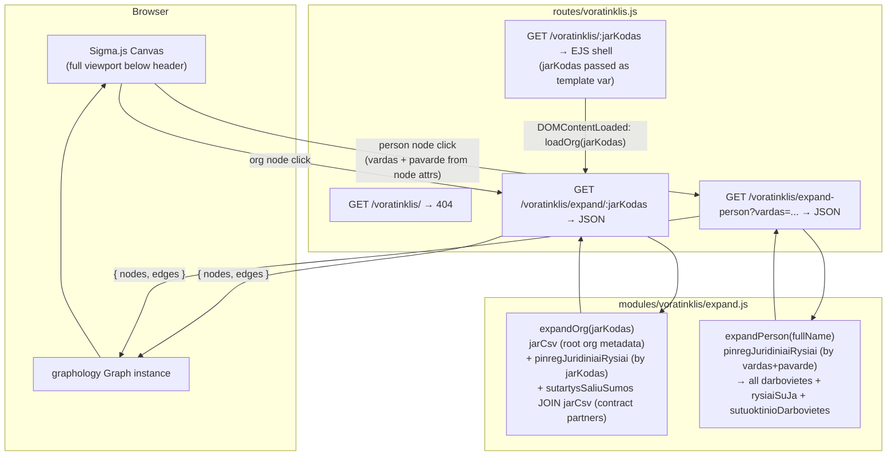
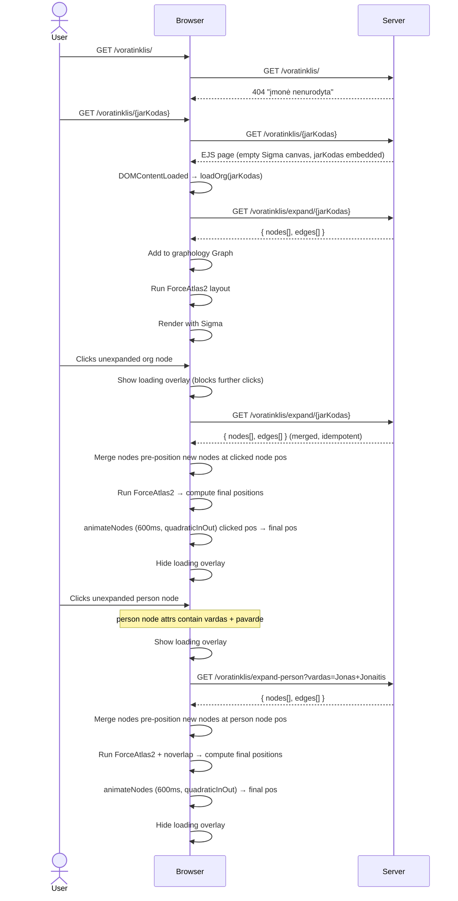
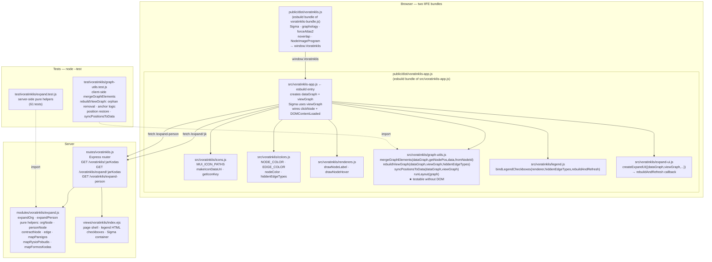

# Voratinklis — Interactive Procurement Network Graph

## Summary

Add a new page `/voratinklis/:jarKodas` (Lithuanian: "spider web") that renders an interactive Sigma.js
network graph of procurement relationships centred on the company identified by `jarKodas`. The page
immediately initialises the graph with that company as the root node — no search step is needed.
Visiting `/voratinklis/` without a company code returns a 404-style "įmonė nenurodyta" page.

Two types of node expansion are supported:

- **Organisation node click** — expands employees, board members, shareholders, spouses, and linked contract
  partners via `/voratinklis/expand/:jarKodas`.
- **Person node click** — expands all workplaces, governance roles, and spouse relationships declared by
  that person via `/voratinklis/expand-person?vardas=...`. Data comes from PINREG declarations queried
  directly from the DB using `gautiPinregDeklaracijasPagalVardaPavarde` (the same function that backs the
  MCP `get_pinreg_asmuo` tool). MCP is not used for this — direct DB calls are faster and avoid HTTP/SSE
  overhead; MCP is designed for external AI clients only.

Stack additions: `sigma@3`, `graphology@0.26`, `graphology-layout-forceatlas2`, `graphology-layout-noverlap`,
`@sigma/node-border`, `@sigma/node-image`. Because these are ESM npm packages targeted at Node, a browser
bundle must be compiled with `esbuild` and served as `public/dist/voratinklis.js`.

---

## Technical Breakdown

### Entity & Edge Types

The graph uses the entity and edge model defined in the repository data structures:

| Node type            | Expand trigger    | Source function / data                                                                                                                        | Key fields                                                                   |
|----------------------|-------------------|-----------------------------------------------------------------------------------------------------------------------------------------------|------------------------------------------------------------------------------|
| `OrganizationEntity` | Org node click    | `jarCsv` (root org metadata — `pavadinimas`, `formosKodas`) + `sutartysSaliuSumos JOIN jarCsv` (partner org names)                            | `jarKodas`, `pavadinimas`, `formosKodas`                                     |
| `PersonEntity`       | Org node click    | `pinregJuridiniaiRysiai` filtered by `jarKodas` — all `DEKLARUOJANCIO_DARBOVIETE`, `KITI_RYSIAI_SU_JA`, `SUTUOKTINIO_DARBOVIETE` rows         | `vardas + pavarde` (name is the identity key), `rysioPradzia`                |
| `PersonEntity`       | Person node click | `pinregJuridiniaiRysiai` filtered by `vardas + pavarde` — returns all darbovietes, governance roles, and spouse relationships for that person | Same; all declarations for that name are merged into one node                |
| `ContractEntity`     | Org node click    | `sutartys JOIN jarCsv` (top 30 contracts by value; buyer/seller names from `jarCsv` JOIN)                                                     | `sutartiesUnikalusId` (node ID key), `pavadinimas` (contract title), `verte` |

> **Why `/asmuo/:jarKodas` is not used for org expansion**: that route aggregates ~18 data sources
> (sodra, vmi, regitra, finansai, etc.) and is too heavy for graph node expansion. Instead `expandOrg`
> queries only what the graph needs: `jarCsv` for org metadata and `sutartys JOIN jarCsv` for the top
> 30 contracts by value with human-readable contract titles (`pavadinimas`) and partner org names.
> The `sutartysSaliuSumos` aggregate table is not used — individual contract rows give the contract
> title needed for the `ContractEntity` node label.

**Entity ID convention:**

| Entity       | ID format                                                             | Example                                   |
|--------------|-----------------------------------------------------------------------|-------------------------------------------|
| Organisation | `org:{jarKodas}`                                                      | `org:110053842`                           |
| Person       | `person:{vardas.trim().toLowerCase()} {pavarde.trim().toLowerCase()}` | `person:jonas jonaitis`                   |
| Contract     | `contract:buyer{buyerJk}:seller{sellerJk}`                            | `contract:buyer110078991:seller110394345` |

> **Person identity is name-only.** The same physical person appearing in declarations for different
> organisations will have the same node ID and will be merged into a single graph node automatically
> by graphology's idempotent merge — this is the intended behaviour. `deklaracija` UUIDs are stored
> as a node attribute array (`deklaracijos: string[]`) for audit purposes but are not used as the ID.
> Person nodes must store `vardas` and `pavarde` as separate attributes so the frontend can derive
> the node ID and pass the full name to `expand-person`.

#### Person node expansion — `expandPerson` and `expandOrg` DB mapping

Both functions query `pinregJuridiniaiRysiai` directly — this table stores all pinreg declared
relationships as structured rows, with one row per person↔org link. When a **person node is clicked**,
`expandPerson` filters this table by `vardas + pavarde` (or `susijusioAsmensVardas + susijusioAsmensPavarde`
for spouse relationships), returning all darbovietes, governance roles, and spouse links declared
across every employer that person has ever listed. Each row has an `irasoTipas` classifier that
determines which graph elements to produce:

| `irasoTipas`                | Produces                                                                       | Edge type(s)                                                           |
|-----------------------------|--------------------------------------------------------------------------------|------------------------------------------------------------------------|
| `DEKLARUOJANCIO_DARBOVIETE` | `PersonEntity` (declarant) + `OrganizationEntity` stub                         | `Employment`/`Director`/`Official` — person → org                      |
| `KITI_RYSIAI_SU_JA`         | `PersonEntity` + `OrganizationEntity` stub                                     | `Director`/`Shareholder`/`Official` — person → org                     |
| `SUTUOKTINIO_DARBOVIETE`    | `PersonEntity` (spouse) + `OrganizationEntity` stub + declarant `PersonEntity` | `Employment`/`Director` (spouse → org) + `Spouse` (declarant → spouse) |

| Edge type                               | Direction       | Source                                                                                        |
|-----------------------------------------|-----------------|-----------------------------------------------------------------------------------------------|
| `Employment` / `Director` / `Official`  | Person → Org    | `pinregJuridiniaiRysiai` rows with `irasoTipas = DEKLARUOJANCIO_DARBOVIETE`                   |
| `Employment` / `Director`               | Spouse → Org    | `pinregJuridiniaiRysiai` rows with `irasoTipas = SUTUOKTINIO_DARBOVIETE`                      |
| `Shareholder` / `Director` / `Official` | Person → Org    | `pinregJuridiniaiRysiai` rows with `irasoTipas = KITI_RYSIAI_SU_JA`                           |
| `Spouse`                                | Person → Person | `pinregJuridiniaiRysiai` rows with `irasoTipas = SUTUOKTINIO_DARBOVIETE` (declarant → spouse) |
| `Order`                                 | Org → Contract  | `sutartys.topPirkejai` → buyer side                                                           |
| `Delivery`                              | Org → Contract  | `sutartys.topTiekejai` → supplier side                                                        |

> **`irasoTipas` is a record classifier, not a role label.** The three distinct values in the DB are
> `DEKLARUOJANCIO_DARBOVIETE`, `SUTUOKTINIO_DARBOVIETE`, and `KITI_RYSIAI_SU_JA`. They must **never**
> be used as edge labels — they are only used to decide which mapping branch to enter.

#### Data Source → Graph Element Mapping



#### Edge labels

Every edge must carry a visible `label` attribute set at build time in `modules/voratinklis/expand.js`:

| Edge type                                                          | `label` value                                                                                                                                                                              |
|--------------------------------------------------------------------|--------------------------------------------------------------------------------------------------------------------------------------------------------------------------------------------|
| `Order` / `Delivery`                                               | Formatted `verte`: `€1.2M`, `€450K`, `€12K`, etc. — see formatting note                                                                                                                    |
| `Employment` / `Director` / `Official` (person or spouse → org)    | `pareigos` field (free-text job title, e.g. "Direktorius", "Gydytojas"). Never `darbovietesTipas` — that field holds `STANDARTINE`, `EKSPERTO`, or `SUTUOKTINIO` and is not human-readable |
| `Director` / `Shareholder` / `Official` (from `KITI_RYSIAI_SU_JA`) | `rysioPobudzioPavadinimas` field (controlled vocabulary, e.g. "Valdybos narys", "Akcininkas")                                                                                              |
| `Spouse`                                                           | `"Sutuoktinis"`                                                                                                                                                                            |

> **Contract value formatting**: use `Math.round(verte)` and express as `€XM` (millions, 1 dp), `€XK`
> (thousands, 0 dp), or `€X` (under 1000) — e.g. `1234567 → €1.2M`, `45000 → €45K`, `800 → €800`.
> `null`/`0` values display an empty string (no label).

#### Node labels

Node labels are rendered **below** the node. Long names are word-wrapped at **3 words per line**
using a simple space-split utility:

```js
function wrapLabel(name, n = 3) {
    const words = (name ?? '').split(' ');
    const lines = [];
    for (let i = 0; i < words.length; i += n) lines.push(words.slice(i, i + n).join(' '));
    return lines.join('\n');
}
```

| Entity type          | Label source             | Applied as                          |
|----------------------|--------------------------|-------------------------------------|
| `OrganizationEntity` | `pavadinimas`            | `wrapLabel(pavadinimas)`            |
| `PersonEntity`       | `vardas + " " + pavarde` | `wrapLabel(vardas + " " + pavarde)` |
| `ContractEntity`     | contract count           | `"N sut."` (e.g. `"17 sut."`)       |

Sigma's default label renderer draws labels to the **right** of the node centre. A custom
`defaultDrawNodeLabel` function must be provided to `new Sigma(graph, container, { defaultDrawNodeLabel })`
to position the label **below** the node (draw at `y + nodeSize + labelPadding`, horizontally centred on `x`).

### Architecture

New server-side module `modules/voratinklis/` containing:

- `expand.js` — two exported functions:
    - `expandOrg(jarKodas)` — queries `jarCsv` (root org metadata), `pinregJuridiniaiRysiai` (person
      relationships), and `sutartysSaliuSumos JOIN jarCsv` (via `gautiSutarciuDuomenisPagalJarKoda`)
      for aggregated contract partner data with human-readable partner names; maps raw rows to
      `GraphNode[]` and `GraphEdge[]`.
    - `expandPerson(fullName)` — queries `pinregJuridiniaiRysiai` directly, matching on
      `vardas + pavarde` or `susijusioAsmensVardas + susijusioAsmensPavarde`; returns **all
      darbovietes, governance roles, and spouse relationships** declared by that person across all
      employers, as stub `OrganizationEntity` nodes + person↔org / spouse edges.
    - Both return `{ nodes: GraphNode[], edges: GraphEdge[] }`.

New route `routes/voratinklis.js`:

| Method | Path                            | Purpose                                                                                    |
|--------|---------------------------------|--------------------------------------------------------------------------------------------|
| `GET`  | `/voratinklis/`                 | Returns 404 ("įmonė nenurodyta") — no jarKodas was given                                   |
| `GET`  | `/voratinklis/:jarKodas`        | EJS page shell with jarKodas passed as template variable; graph auto-initialises on load   |
| `GET`  | `/voratinklis/expand/:jarKodas` | JSON: graph nodes+edges for one organisation (calls `expandOrg`)                           |
| `GET`  | `/voratinklis/expand-person`    | JSON: graph nodes+edges for one person by full name (`?vardas=...`). Calls `expandPerson`. |

> **Route ordering note**: `expand` and `expand-person` static path segments must be registered _before_
> the `/:jarKodas` wildcard so they are not swallowed by the dynamic route handler.

Browser bundle `src/voratinklis-bundle.js` compiled by esbuild into `public/dist/voratinklis.js`:
imports sigma, graphology, layouts, and node-programs; exports nothing — attaches `window.Voratinklis`
with `{ Sigma, Graph, forceAtlas2, noverlap, NodeBorderProgram, NodeImageProgram }` so the inline EJS
script can initialise the graph.

### Client-side fetch strategy

The project uses **no data-fetching library** anywhere — all client fetch calls in every view are vanilla
`fetch()` with manual `AbortController`, debouncing, and request-ID sequencing (see `views/juridiniai/search.ejs`
for the canonical pattern). `@tanstack/query-core` was considered but is **not used** — reasoning:

- Node expansion is **one-shot and idempotent**: once a node is marked `expanded: true`, it is never
  re-fetched. No stale-while-revalidate, background refresh, or pagination is required.
- Concurrent duplicate clicks on the same unexpanded node are deduplicated with a **`Set<nodeId>`** of
  in-flight requests (consistent with the `inFlightControllers` Map pattern already used in the project).
- Introducing a framework-agnostic query client would be an isolated pattern inconsistent with the
  zero-framework vanilla JS convention throughout all views.

**In-flight deduplication pattern** (to implement in the inline script):

```js
const expandingNodes = new Set(); // IDs currently being fetched

async function loadOrg(jarKodas) {
    const id = `org:${jarKodas}`;
    if (expandingNodes.has(id)) return;
    expandingNodes.add(id);
    try {
        const data = await fetch(`/voratinklis/expand/${jarKodas}`).then(r => r.json());
        mergeGraphElements(data);
        graph.setNodeAttribute(id, 'expanded', true);
    } finally {
        expandingNodes.delete(id);
    }
}
```

Same pattern applies to `loadPerson`, keyed by `person:{(vardas+" "+pavarde).trim().toLowerCase()}`.

### Structural Diagram



### Behavioral Diagram



---

## Components

### Component Map



### Module responsibilities

| File                             | Layer  | Purpose                                                                                                               | DOM required              |
|----------------------------------|--------|-----------------------------------------------------------------------------------------------------------------------|---------------------------|
| `src/voratinklis-bundle.js`      | Client | Bundles third-party npm packages; exposes `window.Voratinklis`                                                        | No                        |
| `src/voratinklis-app.js`         | Client | esbuild entry; creates `dataGraph` + `viewGraph`; Sigma uses `viewGraph`; wires events                                | Yes                       |
| `src/voratinklis/icons.js`       | Client | MUI SVG path map; `makeIconDataUri`; `getIconKey`                                                                     | No                        |
| `src/voratinklis/colors.js`      | Client | `NODE_COLOR`, `EDGE_COLOR`, `nodeColor`, `hiddenEdgeTypes` Set                                                        | No                        |
| `src/voratinklis/renderers.js`   | Client | `drawNodeLabel`, `drawNodeHover` — Sigma canvas callbacks                                                             | No (canvas ctx passed in) |
| `src/voratinklis/graph-utils.js` | Client | `mergeGraphElements(dataGraph,...)`, `rebuildViewGraph`, `syncPositionsToData`, `runLayout` — **pure, injected deps** | No ★                      |
| `src/voratinklis/legend.js`      | Client | `bindLegendCheckboxes(renderer, hiddenEdgeTypes, rebuildAndRefresh)`                                                  | Yes (queries DOM)         |
| `src/voratinklis/expand-ui.js`   | Client | `createExpandUI({dataGraph,viewGraph,...})` — async fetch + rebuild; returns `rebuildAndRefresh`                      | Yes                       |
| `modules/voratinklis/expand.js`  | Server | `expandOrg`, `expandPerson`, all pure builder helpers                                                                 | No                        |
| `routes/voratinklis.js`          | Server | Express routes; calls `expandOrg`/`expandPerson`; renders EJS                                                         | No                        |
| `views/voratinklis/index.ejs`    | View   | HTML shell, inline CSS, legend overlay with checkboxes                                                                | —                         |

### Testability design

The single most impactful change for testability is the **dependency-injection signature** of
`mergeGraphElements`. Instead of closing over the module-level `graph` and `renderer`, it receives
them as parameters:

```js
// graph-utils.js (Phase 9 signature — hiddenEdgeTypes removed; dataGraph is a pure store)
export function mergeGraphElements(dataGraph, getNodePos, data, fromNodeId) { ...
}

export function rebuildViewGraph(dataGraph, viewGraph, hiddenEdgeTypes) { ...
} // returns newNodeIds[]
export function syncPositionsToData(dataGraph, viewGraph) { ...
}

export function runLayout(graph, forceAtlas2, noverlap) { ...
}
```

In production (`expand-ui.js`):

```js
mergeGraphElements(dataGraph, (id) => renderer.getNodeDisplayData(id), data, fromNodeId);
const newNodes = rebuildViewGraph(dataGraph, viewGraph, hiddenEdgeTypes);
syncPositionsToData(dataGraph, viewGraph);
```

In unit tests — no DOM or Sigma needed:

```js
import Graph from 'graphology';
import {mergeGraphElements, rebuildViewGraph, syncPositionsToData} from '../../src/voratinklis/graph-utils.js';

const dataGraph = new Graph({type: 'directed', multi: true});
const viewGraph = new Graph({type: 'directed', multi: true});
const getNodePos = () => null;

mergeGraphElements(dataGraph, getNodePos, data, null);
const newNodes = rebuildViewGraph(dataGraph, viewGraph, new Set(['Official']));
```

This allows testing:

- That `dataGraph` receives all edges unconditionally (no hidden filtering at merge time)
- That `rebuildViewGraph` removes orphan nodes (no visible edges) from `viewGraph`
- That anchor nodes (expanded, non-ContractEntity) survive even when all their edges are hidden
- That `ContractEntity` nodes disappear when `Order`/`Delivery` are in `hiddenEdgeTypes`
- That re-appearing nodes restore their `x`/`y` position from `dataGraph`
- That `syncPositionsToData` correctly copies layout coordinates back to `dataGraph`
- That newly added node IDs are returned by `rebuildViewGraph` (for `animateNodes` call site)

---

## Out of Scope

- Contract node expansion (clicking a `ContractEntity` node to load the full contract) — v2
- Risk score colouring of nodes/edges
- Saving / sharing graph state via URL
- Toolbar "Balance" button triggering a full ForceAtlas2 pass — v2

---

## Tasks

> **Phases 1–7 complete.**
>
> *Phases 1–5*: Express routes (`/voratinklis/`, `/:jarKodas`, `/expand/:jarKodas`, `/expand-person`),
> server-side `modules/voratinklis/expand.js` (direct DB queries, deduplication, `ContractEntity`
> intermediate nodes), Sigma.js canvas (full viewport, no footer), node icons via `NodeImageProgram`,
> equal node sizes (`size: 8`), `ContractEntity` label as `"N sut."`, `Order`/`Delivery` edge value
> labels with `forceLabel: true`, hover label pinned below node, JS extracted to `src/voratinklis-app.js`,
> 61 unit tests passing in `test/voratinklis/expand.test.js`.
>
> *Phase 7*: `mapDarbovietesTipas` renamed to `mapPareigos` and fixed to use `row.pareigos` (human-readable
> job title) instead of `row.darbovietesTipas` (`STANDARTINE`/`EKSPERTO`/`SUTUOKTINIO`). `EDGE_COLOR` map
> added to `src/voratinklis-app.js`. Legend overlay added to `views/voratinklis/index.ejs`. All 61 tests
> passing.

---

**Phase 6 — Expand animations and loading overlay**

- [x] **Export `animateNodes` from the Sigma bundle** (`src/voratinklis-bundle.js`):

    ```js
    import { animateNodes } from 'sigma/utils/animate';
    window.Voratinklis = { Sigma, Graph, forceAtlas2, noverlap,
                           NodeBorderProgram, NodeImageProgram, animateNodes };
    ```

  Rebuild with `npm run build` after the change.

- [x] **Animated node rearrangement after expand** (`src/voratinklis-app.js`):

  When `mergeGraphElements(data)` adds new nodes, animate them from the clicked node's position to
  their ForceAtlas2-computed positions. Exact steps inside `loadOrg` / `loadPerson`:

    1. Before merging, snapshot the clicked node's `{ x, y }`.
    2. Call `mergeGraphElements(data)` — new nodes land at default position `(0, 0)`.
    3. Collect the IDs of all **newly added** nodes (those not in the graph before step 2).
    4. Pre-position new nodes at the clicked node's `{ x, y }`.
    5. Run ForceAtlas2 (computes final positions for the full graph in-place).
    6. Read final `{ x, y }` for each new node from the graph — build a `targets` map.
    7. Reset each new node back to the clicked node's `{ x, y }`.
    8. Call `animateNodes(graph, targets, { duration: 600, easing: 'quadraticInOut' })`.

  The result: new nodes visually emerge from the clicked node and fly to their settled positions.

- [x] **Loading overlay** (`views/voratinklis/index.ejs` + `src/voratinklis-app.js`):

  Add a `<div id="voratinklis-loading">` element inside the Sigma container:

    ```html
    <div id="voratinklis-loading" style="display:none;position:absolute;inset:0;
         background:rgba(0,0,0,0.5);z-index:10;
         align-items:center;justify-content:center;">
      <div class="animate-spin rounded-full h-12 w-12 border-4 border-white border-t-transparent"></div>
    </div>
    ```

  The Sigma container must have `position: relative` (it already fills the viewport — add the style).

  In `voratinklis-app.js`:
    - `showLoading()` — sets `display: flex` on the overlay. Called immediately when a node is clicked
      and added to `expandingNodes` (before the `fetch`).
    - `hideLoading()` — sets `display: none`. Called in the `finally` block of every expand function.
    - While the overlay is visible it covers the canvas, so no further node clicks can fire. No extra
      click-guard logic is needed — the DOM overlay handles it.

---

**Phase 7 — Proper Person→Org edge types from actual job title** ✅ Complete

`mapDarbovietesTipas` renamed to `mapPareigos`; all 4 call sites updated to pass `row.pareigos`.
`EDGE_COLOR` map added. Legend overlay added to `views/voratinklis/index.ejs`. 61 tests passing.

---

**Phase 8 — Module split + legend checkboxes (edge visibility)** ✅ Complete

Modules extracted to `src/voratinklis/` (`icons.js`, `colors.js`, `renderers.js`, `graph-utils.js`,
`legend.js`, `expand-ui.js`). `src/voratinklis-app.js` rewritten as thin entry. `animateNodes` added
to bundle. Legend checkboxes added — `Official` and `Employment` unchecked by default. Edges of hidden
types receive `hidden: true`; checking/unchecking immediately updates edge visibility and calls
`renderer.refresh()`. `test/voratinklis/graph-utils.test.js` added (17 new tests; 78 total passing).

> **Limitation of this phase**: nodes whose only edges are hidden remain visible. This is addressed
> in Phase 9.

#### Part A — Module split

- [x] **Create `src/voratinklis/` directory** and extract focused modules from `src/voratinklis-app.js`:

  | New file                          | Extracted content                                               |
        |-----------------------------------|-----------------------------------------------------------------|
  | `src/voratinklis/icons.js`        | `MUI_ICON_PATHS`, `makeIconDataUri`, `getIconKey`               |
  | `src/voratinklis/colors.js`       | `NODE_COLOR`, `EDGE_COLOR`, `nodeColor`, `hiddenEdgeTypes`      |
  | `src/voratinklis/renderers.js`    | `drawNodeLabel`, `drawNodeHover`                                |
  | `src/voratinklis/graph-utils.js`  | `mergeGraphElements`, `runLayout` — injected deps, no globals   |
  | `src/voratinklis/legend.js`       | `bindLegendCheckboxes`, `toggleEdgeTypeVisibility`              |
  | `src/voratinklis/expand-ui.js`    | `loadOrg`, `loadPerson`, `setStatus`                            |

  `src/voratinklis-app.js` becomes the thin esbuild entry: imports from the sub-modules above,
  creates `graph` + `renderer`, wires `clickNode` and `DOMContentLoaded`. Build scripts are
  unchanged — esbuild bundles the whole tree from the same entry point.

- [x] **Change `mergeGraphElements` to use injected dependencies** (`src/voratinklis/graph-utils.js`):

  Phase 8 signature (superseded in Phase 9 — `hiddenEdgeTypes` param will be removed):
  ```js
  export function mergeGraphElements(graph, getNodePos, data, fromNodeId, hiddenEdgeTypes) { ... }
  // getNodePos: (id: string) => { x: number, y: number } | null
  ```

- [x] **Add `test/voratinklis/graph-utils.test.js`** unit tests covering:

    - Nodes are added with correct `color`, `size`, `label`, `image` attributes.
    - Duplicate nodes are skipped (idempotency).
    - Edge `type` attribute is renamed to `edgeType`; `EDGE_COLOR` is applied.
    - Edges whose `edgeType` is in `hiddenEdgeTypes` receive `hidden: true`.
    - Edges whose `edgeType` is **not** in `hiddenEdgeTypes` receive `hidden: false`.
    - Duplicate edges are skipped.
    - `runLayout` does not crash on a single-node graph.

  Tests use `graphology` directly — no DOM, no Sigma, no fetch required:
  ```js
  import Graph from 'graphology';
  import { mergeGraphElements } from '../../src/voratinklis/graph-utils.js';

  const graph = new Graph({ type: 'directed', multi: true });
  mergeGraphElements(graph, () => null, data, null, new Set(['Official']));
  ```

#### Part B — Legend checkboxes

- [x] **Remove `pointer-events: none` from `#voratinklis-legend`** (`views/voratinklis/index.ejs`):

  The legend currently has `pointer-events: none` to float over the canvas without eating clicks.
  Remove that rule — checkboxes require pointer events. The opaque legend background already prevents
  clicks from reaching the canvas beneath it.

- [x] **Wrap each legend row in a `<label>` with a checkbox** (`views/voratinklis/index.ejs`):

  ```html
  <label style="display:flex;align-items:center;gap:6px;cursor:pointer;user-select:none;">
    <input type="checkbox" data-edge-type="Director" checked>
    <span class="vl-swatch" style="background:#1d4ed8"></span>Direktorius / vadovas
  </label>
  ```
  Omit `checked` for `Official` and `Employment` rows. The `<label>` wrapper makes the swatch and
  text also toggle the checkbox.

  `Order` and `Delivery` share one row and one checkbox — use `data-edge-types="Order,Delivery"`:
  ```html
  <label ...>
    <input type="checkbox" data-edge-types="Order,Delivery" checked>
    <span class="vl-swatch" style="background:#10b981"></span>Sutartis
  </label>
  ```

  All `data-edge-type` / `data-edge-types` values must exactly match the `edgeType` attribute
  stored on graphology edges: `Director`, `Shareholder`, `Official`, `Employment`, `Spouse`,
  `Order`, `Delivery`.

- [x] **Apply `hidden` attribute when edges are added** (`src/voratinklis/graph-utils.js`):

  In `mergeGraphElements`, after setting `attrs.color`, add:
  ```js
  attrs.hidden = hiddenEdgeTypes.has(attrs.edgeType);
  ```
  This ensures newly fetched edges (arriving after a checkbox was toggled) are immediately
  hidden/shown correctly without requiring an additional refresh pass.

- [x] **Implement `bindLegendCheckboxes`** (`src/voratinklis/legend.js`):

  ```js
  export function bindLegendCheckboxes(graph, renderer, hiddenEdgeTypes) {
      document.querySelectorAll('#voratinklis-legend input[type="checkbox"]').forEach(function (cb) {
          cb.addEventListener('change', function () {
              toggleEdgeTypeVisibility(graph, renderer, hiddenEdgeTypes,
                  (cb.dataset.edgeTypes || cb.dataset.edgeType || '').split(',').map(s => s.trim()),
                  cb.checked);
          });
      });
  }

  export function toggleEdgeTypeVisibility(graph, renderer, hiddenEdgeTypes, types, visible) {
      types.forEach(t => visible ? hiddenEdgeTypes.delete(t) : hiddenEdgeTypes.add(t));
      graph.forEachEdge(function (edgeId, attrs) {
          var hidden = hiddenEdgeTypes.has(attrs.edgeType);
          if (attrs.hidden !== hidden) graph.setEdgeAttribute(edgeId, 'hidden', hidden);
      });
      renderer.refresh();
  }
  ```

  Call `bindLegendCheckboxes(graph, renderer, hiddenEdgeTypes)` in `src/voratinklis-app.js` after
  the renderer is created.

---

**Phase 9 — Two-graph architecture: node hiding and graph rearrangement**

When all edges of a given type are hidden via legend checkboxes, nodes that have **no remaining
visible edges** must also disappear from the graph. The graph must then rearrange (ForceAtlas2 +
noverlap) so the visible nodes spread to fill the space.

To achieve this without data loss a **two-graph** design is used:

- `dataGraph` — permanent graphology store that holds **all** fetched nodes and edges unconditionally.
  Never passed to Sigma. Updated only on network fetches (expand org / expand person).
- `viewGraph` — the graphology instance given to `new Sigma(viewGraph, ...)`. Derived from `dataGraph`
  by `rebuildViewGraph`. Contains only nodes and edges that should currently be visible.

`hiddenEdgeTypes` Set (from `colors.js`) is the shared mutable state that bridges `dataGraph` and
`viewGraph`.

#### Anchor rule

An **anchor node** is a node that is always kept in `viewGraph` regardless of edge visibility:

```
attrs.expanded === true && attrs.entityType !== 'ContractEntity'
```

`ContractEntity` nodes are never anchors — they exist only to represent contract relationships and
must disappear when all their `Order`/`Delivery` edges are hidden.

#### `rebuildViewGraph(dataGraph, viewGraph, hiddenEdgeTypes)` algorithm

1. Capture `prevNodes = new Set(viewGraph.nodes())` **before** any mutations.
2. Compute the `visible` set of node IDs:
    - Start with all anchor nodes from `dataGraph`.
    - For every edge in `dataGraph` whose `edgeType` is **not** in `hiddenEdgeTypes`, include
      both the source and target node IDs.
3. Drop from `viewGraph` any node not in `visible` (graphology auto-drops incident edges).
4. Add to `viewGraph` any node in `visible` not already present, copying all attributes from
   `dataGraph` — including `x`/`y` from the last known position (so re-appearing nodes restore
   where they were, not at random coords).
5. For every edge in `dataGraph` whose `edgeType` is **not** in `hiddenEdgeTypes` and whose
   source+target are both in `viewGraph`: add it if not already present.
6. Remove from `viewGraph` any edge whose `edgeType` is now in `hiddenEdgeTypes`.
7. Return `viewGraph.nodes().filter(id => !prevNodes.has(id))` — the newly added node IDs (used
   for `animateNodes` after layout).

#### `syncPositionsToData(dataGraph, viewGraph)`

After **every** layout pass (both after expand and after legend toggle), copy `x`/`y` from
`viewGraph` back to `dataGraph` so that positions are preserved for the next rebuild:

```js
viewGraph.forEachNode((id, attrs) => {
    if (dataGraph.hasNode(id)) {
        dataGraph.setNodeAttribute(id, 'x', attrs.x);
        dataGraph.setNodeAttribute(id, 'y', attrs.y);
    }
});
```

#### `mergeGraphElements` signature change

In the two-graph design `dataGraph` stores **all** edges unconditionally — filtering is done in
`rebuildViewGraph`. The `hiddenEdgeTypes` parameter must be **removed** from `mergeGraphElements`:

```js
// Before (Phase 8):
export function mergeGraphElements(graph, getNodePos, data, fromNodeId, hiddenEdgeTypes) { ...
}

// After (Phase 9):
export function mergeGraphElements(dataGraph, getNodePos, data, fromNodeId) { ...
}
```

#### Animation cancel token

`animateNodes` returns a cancel function. Store it and call it before any `rebuildViewGraph` during
a legend toggle — otherwise the animation loop may write attributes to nodes that were just dropped
from `viewGraph`, causing a graphology invariant error:

```js
let cancelAnimation = null;

function rebuildAndRefresh() {
    if (cancelAnimation) {
        cancelAnimation();
        cancelAnimation = null;
    }
    const newNodes = rebuildViewGraph(dataGraph, viewGraph, hiddenEdgeTypes);
    runLayout(viewGraph, forceAtlas2, noverlap);
    syncPositionsToData(dataGraph, viewGraph);
    if (newNodes.length) {
        cancelAnimation = animateNodes(viewGraph, /* from clicked pos */, {duration: 600});
    } else {
        renderer.refresh();
    }
}
```

#### Updated module signatures

| Module                           | Changed signature / addition                                                                                                                  |
|----------------------------------|-----------------------------------------------------------------------------------------------------------------------------------------------|
| `src/voratinklis/graph-utils.js` | `mergeGraphElements(dataGraph, getNodePos, data, fromNodeId)` — drop `hiddenEdgeTypes`                                                        |
| `src/voratinklis/graph-utils.js` | + `rebuildViewGraph(dataGraph, viewGraph, hiddenEdgeTypes): string[]`                                                                         |
| `src/voratinklis/graph-utils.js` | + `syncPositionsToData(dataGraph, viewGraph): void`                                                                                           |
| `src/voratinklis/expand-ui.js`   | `createExpandUI({ dataGraph, viewGraph, renderer, ... })` — exposes `rebuildAndRefresh` callback                                              |
| `src/voratinklis/legend.js`      | `bindLegendCheckboxes(renderer, hiddenEdgeTypes, rebuildAndRefresh)` — remove `toggleEdgeTypeVisibility`; legend triggers `rebuildAndRefresh` |
| `src/voratinklis-app.js`         | Creates `dataGraph = new Graph(...)` + `viewGraph = new Graph(...)`; passes `viewGraph` to Sigma                                              |

#### Tasks

- [x] **`graph-utils.js`**: remove `hiddenEdgeTypes` from `mergeGraphElements`; add `rebuildViewGraph`
  and `syncPositionsToData` as exported functions.

- [x] **`expand-ui.js`**: accept `{ dataGraph, viewGraph }` separately; call
  `mergeGraphElements(dataGraph, ...)` then `rebuildViewGraph` + `syncPositionsToData` after every
  expand; store and return `rebuildAndRefresh` callback; store `cancelAnimation` token and cancel
  before each rebuild.

- [x] **`legend.js`**: replace `toggleEdgeTypeVisibility` with a simple `rebuildAndRefresh` callback
  approach. New signature: `bindLegendCheckboxes(renderer, hiddenEdgeTypes, rebuildAndRefresh)`.
  Checkbox `change` handler: update `hiddenEdgeTypes` Set then call `rebuildAndRefresh()`.

- [x] **`voratinklis-app.js`**: create `dataGraph` + `viewGraph` (both `new Graph({ type: 'directed', multi: true })`);
  pass `viewGraph` to `new Sigma(...)`; wire `rebuildAndRefresh` from the `expand-ui` factory into
  `bindLegendCheckboxes`.

- [x] **`test/voratinklis/graph-utils.test.js`**: update existing `mergeGraphElements` test calls to
  drop `hiddenEdgeTypes` arg; remove 2 hidden-related tests that no longer apply; add
  `rebuildViewGraph` tests:
    - Orphan node is removed when its only edge type is hidden.
    - Anchor node (expanded non-contract) is never removed even when all its edges are hidden.
    - `ContractEntity` node is **not** an anchor and is removed when `Order`/`Delivery` hidden.
    - Newly visible node is included in the returned `newNodes` array.
    - Re-appearing node restores `x`/`y` from `dataGraph`.
    - `syncPositionsToData` copies `x`/`y` from viewGraph → dataGraph for all shared nodes.

---

**Phase 10 — Individual contract nodes with human-readable titles** ✅ Complete

`expandOrg` query replaced from `gautiSutarciuDuomenisPagalJarKoda` to direct `sutartys JOIN jarCsv`
(top 30 by `verte DESC`). `ContractEntity` ID is now `contract:{sutartiesUnikalusId}`; label is
`wrapLabel` of first 9 words of `pavadinimas` (fallback `'Sutartis'`). `contractNode` builder updated.
All tests passing.

---

**Phase 11 — Node selection + per-node legend**

#### Behaviour

- **Single-node selection**: clicking a node selects it. The legend header immediately shows that node's
  label. Clicking the same node again deselects it. Clicking a different node deselects the previous
  and selects the new one. Clicking the canvas (`clickStage`) deselects the current node.
- **Selection + expansion**: if the clicked node is not yet expanded, it is selected first (ring appears
  immediately), data is fetched, and the node remains selected after the expand completes.
- **Per-node legend state**: every node has its own `Set<string>` of hidden edge types, stored in
  `nodeHiddenEdgeTypes: Map<nodeId, Set<string>>` in `voratinklis-app.js`. When a node is first
  selected, its Set is initialised as a copy of `HIDDEN_BY_DEFAULT`. Changing checkboxes updates only
  the selected node's Set. Switching to another node restores that node's previously saved settings.
- **When no node is selected**: legend header shows `'Filtrai'`; checkboxes reflect the global
  `hiddenEdgeTypes` default Set. Checking/unchecking updates the global Set so future first-time
  selections inherit the new defaults.

#### Selection visual

Set `highlighted: true` and `selected: true` on the selected node in both `viewGraph` and `dataGraph`.
Sigma calls `drawNodeHover` for every node with `highlighted: true`, so the selection ring renders
persistently — no node-program change is needed.

Update `drawNodeHover` to distinguish between hover and selection states via `data.selected`:

| State                            | Ring radius    | Fill                     | Stroke width | Stroke colour |
|----------------------------------|----------------|--------------------------|--------------|---------------|
| Hover only                       | `nodeSize + 4` | `rgba(255,255,255,0.6)`  | `2`          | `data.color`  |
| Selected (with or without hover) | `nodeSize + 6` | `rgba(255,255,255,0.15)` | `5`          | `data.color`  |

When the node is both hovered and selected, draw the bold selection ring only (not both).

On deselect: `setNodeAttribute(id, 'highlighted', false); setNodeAttribute(id, 'selected', false)`.

#### Legend UI changes

Add `<div id="voratinklis-legend-title">` at the very top of the `#voratinklis-legend` overlay.

New `legend.js` export `updateLegendForNode(label, hiddenSet)`:

- Sets `legendTitle.textContent` to `label` (selected node's display label) or `'Filtrai'` when null.
- Syncs every `input[type=checkbox][data-edge-types]` to checked/unchecked based on `hiddenSet`:
  a checkbox is checked when **none** of its `data-edge-types` values are in `hiddenSet`.

`bindLegendCheckboxes` signature change: replace the single `hiddenEdgeTypes` Set parameter with a
getter `getHiddenSet: () => Set<string>`. On each checkbox `change` event the handler calls
`getHiddenSet()` to get the current node's Set (or the global fallback), mutates it, then calls
`rebuildAndRefresh()`.

#### `rebuildAndRefresh` change

`rebuildAndRefresh` is a closure in `expand-ui.js` that now calls
`rebuildViewGraph(dataGraph, viewGraph, currentHiddenSet())` where:

```js
function currentHiddenSet() {
    return selectedNodeId && nodeHiddenEdgeTypes.has(selectedNodeId)
        ? nodeHiddenEdgeTypes.get(selectedNodeId)
        : hiddenEdgeTypes;              // global fallback from colors.js
}
```

`rebuildViewGraph` signature is **unchanged** — it still receives a plain `Set<string>`.

#### New `selection.js` module — pure helpers

```js
// src/voratinklis/selection.js
export function getOrInitNodeHidden(nodeId, nodeHiddenMap, defaults) {
    if (!nodeHiddenMap.has(nodeId)) {
        nodeHiddenMap.set(nodeId, new Set(defaults));
    }
    return nodeHiddenMap.get(nodeId);
}
```

Keeps the Map manipulation testable without DOM or Sigma.

#### Module responsibilities update

| Module                         | Change                                                                                                                                                 |
|--------------------------------|--------------------------------------------------------------------------------------------------------------------------------------------------------|
| `src/voratinklis/selection.js` | **New** — `getOrInitNodeHidden` pure helper                                                                                                            |
| `src/voratinklis/renderers.js` | `drawNodeHover` — check `data.selected` for bold ring                                                                                                  |
| `src/voratinklis/legend.js`    | `updateLegendForNode(label, hiddenSet)` added; `bindLegendCheckboxes` takes `getHiddenSet` getter                                                      |
| `src/voratinklis/expand-ui.js` | Manages `selectedNodeId` + `nodeHiddenEdgeTypes`; `clickNode` handles selection; `clickStage` deselects; `rebuildAndRefresh` uses `currentHiddenSet()` |
| `src/voratinklis-app.js`       | Declares `selectedNodeId`, `nodeHiddenEdgeTypes`; passes `getHiddenSet` to `bindLegendCheckboxes`                                                      |
| `views/voratinklis/index.ejs`  | Add `<div id="voratinklis-legend-title">` in legend overlay                                                                                            |

#### Tasks

- [x] **`src/voratinklis/selection.js`** — create new module with
  `getOrInitNodeHidden(nodeId, nodeHiddenMap, defaults)`.

- [x] **`src/voratinklis/renderers.js`** — update `drawNodeHover`:
    - If `data.selected` is true: draw bold ring (`nodeSize + 6`, `lineWidth: 5`, `rgba(255,255,255,0.15)` fill,
      `data.color` stroke). Do not also draw soft hover ring.
    - Otherwise (hover only): draw existing soft ring (`nodeSize + 4`, `lineWidth: 2`, `rgba(255,255,255,0.6)` fill).
    - In both cases: call `drawNodeLabel(context, data, settings)` at the end.

- [x] **`views/voratinklis/index.ejs`** — add
  `<div id="voratinklis-legend-title" style="font-weight:600;text-align:center;margin-bottom:6px;">Filtrai</div>` at the
  top of `#voratinklis-legend`.

- [x] **`src/voratinklis/legend.js`** — add `updateLegendForNode(label, hiddenSet)`:
    - Sets `document.getElementById('voratinklis-legend-title').textContent` to `label ?? 'Filtrai'`.
    - For each `input[type=checkbox][data-edge-types]`: set `checked = true` if none of its `data-edge-types` values are
      in `hiddenSet`.

  Change `bindLegendCheckboxes(hiddenEdgeTypes, rebuildAndRefresh)` to
  `bindLegendCheckboxes(getHiddenSet, rebuildAndRefresh)`:
    - On each `change` event: call `getHiddenSet()` to get the live Set, mutate it, then call `rebuildAndRefresh()`.

- [x] **`src/voratinklis/expand-ui.js`** — add selection state management:
    - Declare `var selectedNodeId = null;` and accept `nodeHiddenEdgeTypes` as an injected dep.
    - `selectNode(id)`: deselect previous (clear `highlighted`/`selected` attrs in viewGraph+dataGraph); set
      `highlighted: true; selected: true` on new node in both graphs; call `updateLegendForNode` with node label and its
      hidden Set.
    - `deselectAll()`: clear attrs on `selectedNodeId` if set; set `selectedNodeId = null`; call
      `updateLegendForNode(null, hiddenEdgeTypes)`.
    - Update `clickNode` handler: call `selectNode(nodeId)` before expanding; toggle-deselect when same node clicked.
    - Add `renderer.on('clickStage', deselectAll)`.
    - Update `rebuildAndRefresh` to pass `currentHiddenSet()` to `rebuildViewGraph`.
    - Expose `selectNode`, `deselectAll`, and `currentHiddenSet` in the returned object.

- [x] **`src/voratinklis-app.js`**:
    - Declare `var nodeHiddenEdgeTypes = new Map();`.
    - Pass `nodeHiddenEdgeTypes` into `createExpandUI`.
    - Change `bindLegendCheckboxes` call: pass `() => ui.currentHiddenSet()` as the `getHiddenSet` getter.

- [x] **`test/voratinklis/selection.test.js`** — unit tests for `getOrInitNodeHidden`:
    - Returns existing Set if nodeId is already in Map.
    - Creates a new Set (a copy of `defaults`) if nodeId is absent.
    - Modifying the returned Set does not affect the original defaults Set.
    - Multiple nodes get independent Sets.

- [x] **Build** with `npm run build` — clean, `voratinklis-app.js` 8.8 kb, all 98 tests passing.

- [ ] **Browser smoke-test** `http://localhost:9019/voratinklis/{jarKodas}`:
    - Click a node: bold ring appears; legend header shows node label; checkboxes reflect that node's defaults.
    - Toggle a checkbox: graph rebuilds for that node's settings.
    - Click another node: previous ring gone; new ring appears; legend updates to new node's settings.
    - Clicking same node again: ring disappears; legend reverts to `'Filtrai'`.
    - Previous node's checkbox state is restored when re-selecting it.

---

**Phase 12 — Dynamic node sizes and edge weights**

Encode data significance visually: contract value drives both edge stroke width and contract node
size; company employee count drives organisation node size. Legend rows are changed from coloured
square swatches to SVG arrows whose stroke width matches the corresponding edge in the graph.

#### Size and weight lookup tables

**Org node size** — `personelSize(count)` pure function in `src/voratinklis/colors.js`:

| Personnel (`max(draustieji + draustieji2, 1)`) | Node size (`size`)  |
|------------------------------------------------|---------------------|
| < 10                                           | 8 (current default) |
| 10 – 50                                        | 13                  |
| 50 – 200                                       | 19                  |
| > 200                                          | 28                  |

**Contract node size** — `contractSize(verte)` pure function in `src/voratinklis/colors.js`:

| Contract value (`verte`) | Node size |
|--------------------------|-----------|
| < 100 000 EUR            | 8         |
| 100 000 – 1 000 000 EUR  | 13        |
| > 1 000 000 EUR          | 19        |

**Order / Delivery edge stroke width** — `edgeWeight(verte)` pure function in `src/voratinklis/colors.js`:

| Contract value (`verte`) | Edge `size` |
|--------------------------|-------------|
| < 100 000 EUR            | 1           |
| 100 000 – 1 000 000 EUR  | 3           |
| > 1 000 000 EUR          | 6           |

Person nodes keep a fixed `size: 8`.

All three functions must be **pure** (no side-effects, no imports) so they can be unit-tested
without DOM or Sigma.

#### Server-side changes — `modules/voratinklis/expand.js`

1. **`orgNode` factory** — add optional `personelCount` parameter (defaults to `0`):

   ```js
   export function orgNode(jarKodas, pavadinimas, formosKodas, opts = {}) {
       // …existing…
       attributes: {
           // …existing…
           personelCount: opts.personelCount ?? 0,
           size: personelSize(opts.personelCount ?? 0),   // replaces hardcoded 8
       }
   }
   ```

   `personelSize` is imported from a shared helper (or computed inline — keep it consistent with
   the client). Since `expand.js` is server-side, duplicate the lookup table as a local
   `personelSize` helper in `expand.js` — do **not** import from `src/voratinklis/colors.js` (that
   is a client-side module).

2. **`contractNode` factory** — compute `size` from `verte` using a local `contractSize` helper:

   ```js
   export function contractNode(sutartiesUnikalusId, pavadinimas, verte) {
       // …existing…
       attributes: {
           // …existing…
           verte: verte || 0,
           size: contractSize(verte || 0),   // replaces hardcoded 8
       }
   }
   ```

3. **`expandOrg` — sodra lookup for personnel count**: after all existing queries have run and the
   full list of org `jarKodas` values is known, fetch sodra data for every org in a **single
   flat query**:

   ```sql
   SELECT "jarKodas",
          COALESCE("draustieji", 0) + COALESCE("draustieji2", 0) AS "personelCount",
          "data"
   FROM sodra
   WHERE "jarKodas" = ANY($1)
   ORDER BY "jarKodas", "data" DESC
   ```

   Collect all unique `jarKodas` values that will become org nodes (root + all partners found in
   the contract rows), pass them as a single array parameter, and build a `Map<jarKodas, number>`
   keeping only the first (most-recent) row per company:

   ```js
   const sodraMap = new Map();
   for (const row of sodraRows) {
       if (!sodraMap.has(row.jarKodas)) sodraMap.set(row.jarKodas, row.personelCount);
   }
   ```

   Pass `personelCount: sodraMap.get(jk) ?? 0` when calling `orgNode(…, { personelCount })` for
   every org (root and partners). No JOINs, no subqueries — one extra flat SELECT per
   `expandOrg` call.

4. **Edge `size` in `expandOrg`** — when building Order/Delivery edges, compute and store the edge
   `size` attribute:

   ```js
   const eSize = edgeWeight(row.verte);
   edges.push(edge(orgId, cNode.id, 'Order', valueLabel, { size: eSize }));
   edges.push(edge(cNode.id, sellerOrgId, 'Delivery', valueLabel, { size: eSize }));
   ```

   The `edge` builder function accepts an optional `opts` parameter for extra attributes (add if not
   already present).

   `edgeWeight` must also be defined as a local helper in `expand.js` (mirror of the client-side
   function — same thresholds, same values).

#### Client-side changes

1. **`src/voratinklis/colors.js`** — add three exported pure functions:

   ```js
   export function personelSize(count) {
       if (count >= 200) return 28;
       if (count >= 50)  return 19;
       if (count >= 10)  return 13;
       return 8;
   }

   export function contractSize(verte) {
       if (verte >= 1_000_000) return 19;
       if (verte >= 100_000)   return 13;
       return 8;
   }

   export function edgeWeight(verte) {
       if (verte >= 1_000_000) return 6;
       if (verte >= 100_000)   return 3;
       return 1;
   }
   ```

2. **`src/voratinklis/graph-utils.js` `mergeGraphElements`** — replace the hardcoded fallback:

   ```js
   // Before:
   size: n.attributes.size || 8,

   // After:
   size: n.attributes.size,   // size is now always set by the server-side factory
   ```

   The `size` attribute is computed in `orgNode` / `contractNode` / `personNode` on the server and
   arrives in `n.attributes.size` — do not override it client-side. Person nodes remain hardcoded
   at `size: 8` in the `personNode` factory.

3. **`src/voratinklis/graph-utils.js` `mergeGraphElements`** — when adding edges, preserve the
   server-computed `size`:

   ```js
   // Edge attrs already contain `size` from the server — don't clobber it.
   // EDGE_COLOR and edgeType are still applied; only avoid setting a default size.
   attrs.color = EDGE_COLOR[attrs.edgeType] || '#d1d5db';
   // attrs.size is preserved from server payload
   ```

#### Legend — SVG arrows

Replace every `<span class="vl-swatch">` coloured square in `views/voratinklis/index.ejs` with an
inline SVG arrow. The SVG arrow must visually match the corresponding Sigma edge style (same colour,
same stroke width).

Recommended inline SVG (width 28px, arrow pointing right):

```html

<svg width="28" height="12" viewBox="0 0 28 12" style="flex-shrink:0">
    <line x1="0" y1="6" x2="22" y2="6"
          stroke="<COLOR>" stroke-width="<WEIGHT>" stroke-linecap="round"/>
    <polyline points="17,1 23,6 17,11"
              fill="none" stroke="<COLOR>" stroke-width="<WEIGHT>" stroke-linecap="round" stroke-linejoin="round"/>
</svg>
```

For the **Sutartis** legend row, replace the single row with **three separate rows** — one for each
weight tier. All three share the same `data-edge-types="Order,Delivery"` checkbox so toggling one
toggles all:

```html
<label …>
    <input type="checkbox" data-edge-types="Order,Delivery" checked>
    <!-- thin: < 100k -->
    <svg …>
        <line … stroke-width="1"/>
        <polyline … stroke-width="1"/>
    </svg>
    <!-- medium: 100k–1M -->
    <svg …>
        <line … stroke-width="3"/>
        <polyline … stroke-width="3"/>
    </svg>
    <!-- thick: > 1M -->
    <svg …>
        <line … stroke-width="6"/>
        <polyline … stroke-width="6"/>
    </svg>
    Sutartis
</label>
```

All other legend rows show a single SVG arrow sized at stroke-width `2` (the default visual weight
for non-contract edges).

#### Tests

- **`test/voratinklis/colors.test.js`** (new) — unit tests for the three new pure functions:
    - `personelSize`: boundary checks for 0, 9, 10, 49, 50, 199, 200, 500.
    - `contractSize`: boundary checks for 0, 99_999, 100_000, 999_999, 1_000_000, 5_000_000.
    - `edgeWeight`: boundary checks for 0, 99_999, 100_000, 999_999, 1_000_000, 5_000_000.

- **`test/voratinklis/expand.test.js`** — add cases for `orgNode` and `contractNode` that verify
  `size` and `personelCount` are set correctly for various inputs.

#### Tasks

- [ ] **`modules/voratinklis/expand.js`**:
    - Add local `personelSize(count)` and `contractSize(verte)` and `edgeWeight(verte)` helper
      functions (mirror of `colors.js` exports — same thresholds, same values).
    - Update `orgNode` factory: add `opts.personelCount` → store as `personelCount` attribute,
      compute `size` via `personelSize`.
    - Update `contractNode` factory: compute `size` via `contractSize(verte)`.
    - Update `expandOrg`: collect all unique org `jarKodas` values from the query results; run
      **one flat `SELECT … WHERE "jarKodas" = ANY($1)` query** against `sodra`; build a
      `Map<jarKodas, personelCount>`; pass `personelCount` from the map when calling `orgNode`
      for every org (root and all partners). No JOINs, no subqueries.
    - Update `edge` builder (or its call sites) to accept and store `size` attribute on
      Order/Delivery edges via `edgeWeight(row.verte)`.

- [ ] **`src/voratinklis/colors.js`**: export `personelSize`, `contractSize`, `edgeWeight`.

- [ ] **`src/voratinklis/graph-utils.js`**: remove the `|| 8` size fallback in
  `mergeGraphElements`; ensure edge `size` attribute from server payload is not clobbered.

- [ ] **`views/voratinklis/index.ejs`**: replace all `<span class="vl-swatch">` with inline SVG
  arrows; split the Sutartis row into three sub-rows (thin / medium / thick) sharing the same
  `data-edge-types="Order,Delivery"` checkbox.

- [ ] **`test/voratinklis/colors.test.js`**: new file — unit tests for all three size/weight
  pure functions.

- [ ] **`test/voratinklis/expand.test.js`**: add `orgNode` size and `contractNode` size tests.

- [ ] **Build** with `npm run build` — clean; all tests passing.

- [ ] **Browser smoke-test**: contract nodes and org nodes should vary visibly in size; thick
  edges from high-value contracts should be immediately visible; legend shows arrow icons.

---

1. **ForceAtlas2 in browser**: `graphology-layout-forceatlas2` runs synchronously and blocks the main thread
   for large graphs. For large graphs (>200 nodes) a Web Worker is recommended. For v1, synchronous with
   a capped iteration count is acceptable.

2. **Search UX on `/voratinklis`**: Eliminated. Entry to the graph is exclusively via
   `/voratinklis/:jarKodas` (e.g. linked from the `/asmuo/` page). ✓ Resolved.

3. **Header nav link for `/voratinklis`**: Keep the existing nav link pointing to `/voratinklis/` as-is. It
   will show the 404 "įmonė nenurodyta" page when clicked directly — this is intentional. ✓ Resolved.

