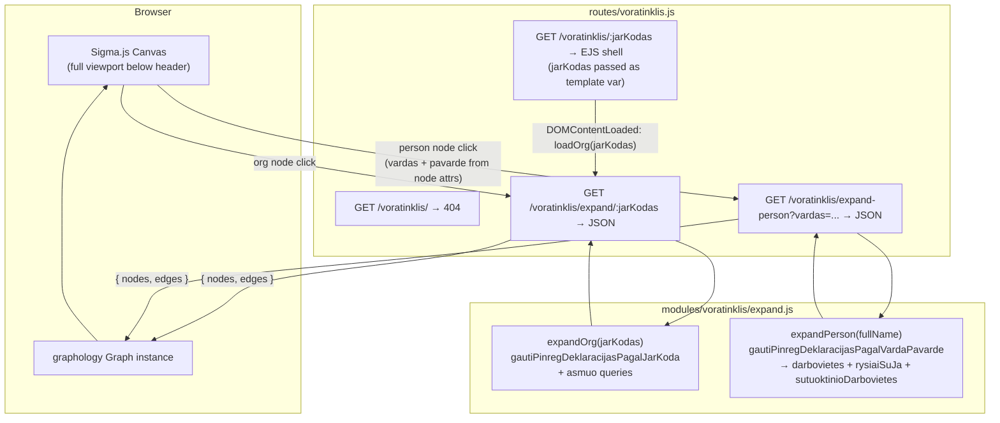
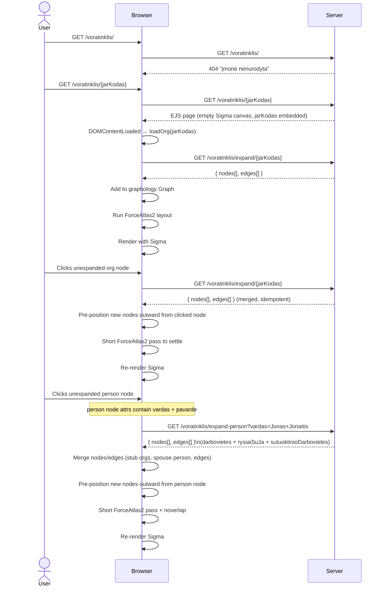

# Voratinklis — Interactive Procurement Network Graph

## Summary

Add a new page `/voratinklis/:jarKodas` (Lithuanian: "spider web") that renders an interactive Sigma.js
network graph of procurement relationships centred on the company identified by `jarKodas`. The page
immediately initialises the graph with that company as the root node — no search step is needed.
Visiting `/voratinklis/` without a company code returns a 404-style "įmonė nenurodyta" page.

Two types of node expansion are supported:

- **Organisation node click** — expands employees, board members, shareholders, spouses, and linked contract
  partners via `/voratinklis/expand/:jarKodas`.
- **Person node click** — expands all workplaces, governance roles, and spouse relationships declared by
  that person via `/voratinklis/expand-person?vardas=...`. Data comes from PINREG declarations queried
  directly from the DB using `gautiPinregDeklaracijasPagalVardaPavarde` (the same function that backs the
  MCP `get_pinreg_asmuo` tool). MCP is not used for this — direct DB calls are faster and avoid HTTP/SSE
  overhead; MCP is designed for external AI clients only.

Stack additions: `sigma@3`, `graphology@0.26`, `graphology-layout-forceatlas2`, `graphology-layout-noverlap`,
`@sigma/node-border`, `@sigma/node-image`. Because these are ESM npm packages targeted at Node, a browser
bundle must be compiled with `esbuild` and served as `public/dist/voratinklis.js`.

---

## Technical Breakdown

### Entity & Edge Types

The graph uses the entity and edge model defined in the repository data structures:

| Node type            | Expand trigger    | Source function / data                                         | Key fields                                                    |
|----------------------|-------------------|----------------------------------------------------------------|---------------------------------------------------------------|
| `OrganizationEntity` | Org node click    | `gautiPinregDeklaracijasPagalJarKoda(jarKodas)` + `asmuo.json` | `jarKodas`, `pavadinimas`, `registravimoData`, `formosKodas`  |
| `PersonEntity`       | Org node click    | `pinreg.darbovietes[]` / `pinreg.rysiaiSuJa[]`                 | `vardas + pavarde` (name is the identity key), `rysioPradzia` |
| `PersonEntity`       | Person node click | `gautiPinregDeklaracijasPagalVardaPavarde(fullName)`           | Same; all declarations for that name are merged into one node |
| `ContractEntity`     | Org node click    | `sutartys.topPirkejai/topTiekejai`                             | `sutartiesUnikalusID`, `verte`, dates                         |

**Entity ID convention:**

| Entity       | ID format                                                             | Example                 |
|--------------|-----------------------------------------------------------------------|-------------------------|
| Organisation | `org:{jarKodas}`                                                      | `org:110053842`         |
| Person       | `person:{vardas.trim().toLowerCase()} {pavarde.trim().toLowerCase()}` | `person:jonas jonaitis` |
| Contract     | `contract:{sutartiesUnikalusID}`                                      | `contract:2008059225`   |

> **Person identity is name-only.** The same physical person appearing in declarations for different
> organisations will have the same node ID and will be merged into a single graph node automatically
> by graphology's idempotent merge — this is the intended behaviour. `deklaracija` UUIDs are stored
> as a node attribute array (`deklaracijos: string[]`) for audit purposes but are not used as the ID.
> Person nodes must store `vardas` and `pavarde` as separate attributes so the frontend can derive
> the node ID and pass the full name to `expand-person`.

#### Person node expansion — what `gautiPinregDeklaracijasPagalVardaPavarde` returns

| Section                    | Produces                                             | Edge type                                                |
|----------------------------|------------------------------------------------------|----------------------------------------------------------|
| `darbovietes[]`            | `OrganizationEntity` stub nodes + edges              | `Employment` / `Director` / `Official` (person → org)    |
| `rysiaiSuJa[]`             | `OrganizationEntity` stub nodes + edges              | `Director` / `Shareholder` / `Official` (person → org)   |
| `sutuoktinioDarbovietes[]` | `PersonEntity` (spouse) + `OrganizationEntity` stubs | `Spouse` (person → spouse) + `Employment` (spouse → org) |

| Edge type                              | Direction       | Source                                         |
|----------------------------------------|-----------------|------------------------------------------------|
| `Employment` / `Director` / `Official` | Person → Org    | `pinreg.darbovietes[].pareiguTipasPavadinimas` |
| `Shareholder`                          | Person → Org    | `pinreg.rysiaiSuJa[].rysioPobudzioPavadinimas` |
| `Spouse`                               | Person → Person | `pinreg.sutuoktinioDarbovietes[]`              |
| `Order`                                | Org → Contract  | `sutartys.topPirkejai` → buyer side            |
| `Delivery`                             | Org → Contract  | `sutartys.topTiekejai` → supplier side         |

#### Edge labels

Every edge must carry a visible `label` attribute set at build time in `modules/voratinklis/expand.js`:

| Edge type                                                   | `label` value                                                           |
|-------------------------------------------------------------|-------------------------------------------------------------------------|
| `Order` / `Delivery`                                        | Formatted `verte`: `€1.2M`, `€450K`, `€12K`, etc. — see formatting note |
| `Employment` / `Director` / `Official`                      | Raw `pareiguTipasPavadinimas` string from the declaration (Lithuanian)  |
| `Director` / `Shareholder` / `Official` (from `rysiaiSuJa`) | Raw `rysioPobudzioPavadinimas` string (Lithuanian)                      |
| `Spouse`                                                    | `"Sutuoktinis"`                                                         |

> **Contract value formatting**: use `Math.round(verte)` and express as `€XM` (millions, 1 dp), `€XK`
> (thousands, 0 dp), or `€X` (under 1000) — e.g. `1234567 → €1.2M`, `45000 → €45K`, `800 → €800`.
> `null`/`0` values display an empty string (no label).

#### Node labels

Node labels are rendered **below** the node. Long names are word-wrapped at **3 words per line**
using a simple space-split utility:

```js
function wrapLabel(name, n = 3) {
    const words = (name ?? '').split(' ');
    const lines = [];
    for (let i = 0; i < words.length; i += n) lines.push(words.slice(i, i + n).join(' '));
    return lines.join('\n');
}
```

| Entity type          | Label source             | Applied as                          |
|----------------------|--------------------------|-------------------------------------|
| `OrganizationEntity` | `pavadinimas`            | `wrapLabel(pavadinimas)`            |
| `PersonEntity`       | `vardas + " " + pavarde` | `wrapLabel(vardas + " " + pavarde)` |
| `ContractEntity`     | `pavadinimas`            | `wrapLabel(pavadinimas)`            |

Sigma's default label renderer draws labels to the **right** of the node centre. A custom
`defaultDrawNodeLabel` function must be provided to `new Sigma(graph, container, { defaultDrawNodeLabel })`
to position the label **below** the node (draw at `y + nodeSize + labelPadding`, horizontally centred on `x`).

### Architecture

New server-side module `modules/voratinklis/` containing:

- `expand.js` — two exported functions:
    - `expandOrg(jarKodas)` — calls `gautiPinregDeklaracijasPagalJarKoda` (from `modules/pinreg/pinregDeklaracijos.js`)
        + the existing `asmuo` route queries; maps raw fields to `GraphNode[]` and `GraphEdge[]`.
    - `expandPerson(fullName)` — calls `gautiPinregDeklaracijasPagalVardaPavarde` (from `modules/pinreg/pagalVarda.js`)
      with `{ flat: false }`; maps `darbovietes`, `rysiaiSuJa`, and `sutuoktinioDarbovietes` to graph elements.
      Returns stub `OrganizationEntity` nodes (only `jarKodas` + `pavadinimas` known) for each workplace.
    - Both return `{ nodes: GraphNode[], edges: GraphEdge[] }`.

New route `routes/voratinklis.js`:

| Method | Path                            | Purpose                                                                                                     |
|--------|---------------------------------|-------------------------------------------------------------------------------------------------------------|
| `GET`  | `/voratinklis/`                 | Returns 404 ("įmonė nenurodyta") — no jarKodas was given                                                    |
| `GET`  | `/voratinklis/:jarKodas`        | EJS page shell with jarKodas passed as template variable; graph auto-initialises on load                    |
| `GET`  | `/voratinklis/expand/:jarKodas` | JSON: graph nodes+edges for one organisation (calls `expandOrg`)                                            |
| `GET`  | `/voratinklis/expand-person`    | JSON: graph nodes+edges for one person by full name (`?vardas=...`). Calls `expandPerson`.                  |

> **Route ordering note**: `expand` and `expand-person` static path segments must be registered _before_
> the `/:jarKodas` wildcard so they are not swallowed by the dynamic route handler.

Browser bundle `src/voratinklis-bundle.js` compiled by esbuild into `public/dist/voratinklis.js`:
imports sigma, graphology, layouts, and node-programs; exports nothing — attaches `window.Voratinklis`
with `{ Sigma, Graph, forceAtlas2, noverlap, NodeBorderProgram, NodeImageProgram }` so the inline EJS
script can initialise the graph.

### Client-side fetch strategy

The project uses **no data-fetching library** anywhere — all client fetch calls in every view are vanilla
`fetch()` with manual `AbortController`, debouncing, and request-ID sequencing (see `views/juridiniai/search.ejs`
for the canonical pattern). `@tanstack/query-core` was considered but is **not used** — reasoning:

- Node expansion is **one-shot and idempotent**: once a node is marked `expanded: true`, it is never
  re-fetched. No stale-while-revalidate, background refresh, or pagination is required.
- Concurrent duplicate clicks on the same unexpanded node are deduplicated with a **`Set<nodeId>`** of
  in-flight requests (consistent with the `inFlightControllers` Map pattern already used in the project).
- Introducing a framework-agnostic query client would be an isolated pattern inconsistent with the
  zero-framework vanilla JS convention throughout all views.

**In-flight deduplication pattern** (to implement in the inline script):

```js
const expandingNodes = new Set(); // IDs currently being fetched

async function loadOrg(jarKodas) {
    const id = `org:${jarKodas}`;
    if (expandingNodes.has(id)) return;
    expandingNodes.add(id);
    try {
        const data = await fetch(`/voratinklis/expand/${jarKodas}`).then(r => r.json());
        mergeGraphElements(data);
        graph.setNodeAttribute(id, 'expanded', true);
    } finally {
        expandingNodes.delete(id);
    }
}
```

Same pattern applies to `loadPerson`, keyed by `person:{(vardas+" "+pavarde).trim().toLowerCase()}`.

### Structural Diagram



### Behavioral Diagram



---

## Out of Scope

- Contract node expansion (clicking a `ContractEntity` node to load the full contract) — v2
- Risk score colouring of nodes/edges
- Saving / sharing graph state via URL
- Toolbar "Balance" button triggering a full ForceAtlas2 pass — v2

---

## Tasks

> Phases 1–4 are complete. All infrastructure, backend API, frontend graph, and direct-URL activation work
> has been shipped. The server-side `expand.js` queries `pinregJuridiniaiRysiai` directly (not the censoring
> helper) to get raw `vardas`/`pavarde` for correct person IDs — consistent with the `/asmuo/{jarKodas}.json`
> JSON API pattern.

---

**Phase 5 — Visual polish, node icons, and ContractEntity graph structure**

- [x] **`views/voratinklis/index.ejs`**: Remove `<%- include('../footer.ejs') %>`.

- [x] **Extract inline JS to `src/voratinklis-app.js`**: Extracted to `src/voratinklis-app.js`, built by
  `build:voratinklis-app` into `public/dist/voratinklis-app.js`. EJS retains only
  `window.VORATINKLIS_CONFIG = { jarKodas: '<%- jarKodas %>' }` inline. Uses `window.Voratinklis.*` for all
  Sigma deps (no separate imports).

- [x] **Node icons via `NodeImageProgram`**: `makeIconDataUri(nodeType)` and `getIconKey(attrs)` implemented
  in `src/voratinklis-app.js`. Sigma configured with `nodeProgramClasses: { image: NodeImageProgram }`,
  `defaultNodeType: 'image'`. Icon set in `mergeGraphElements` via the `image` attribute.

- [x] **Equal node sizes**: All nodes fixed at `size: 8` in `modules/voratinklis/expand.js`.

- [x] **ContractEntity nodes between organisations**: `expandOrg` now inserts intermediate `ContractEntity`
  nodes. `topTiekejai`: `rootOrg --Order--> contractNode --Delivery--> supplierOrg`. `topPirkejai`:
  `buyerOrg --Order--> contractNode --Delivery--> rootOrg`. IDs are deterministic (`contract:buyer{jk}:seller{jk}`).

---

## Open Questions

1. **ForceAtlas2 in browser**: `graphology-layout-forceatlas2` runs synchronously and blocks the main thread
   for large graphs. For large graphs (>200 nodes) a Web Worker is recommended. For v1, synchronous with
   a capped iteration count is acceptable.

2. **Search UX on `/voratinklis`**: Eliminated. Entry to the graph is exclusively via
   `/voratinklis/:jarKodas` (e.g. linked from the `/asmuo/` page). ✓ Resolved.

3. **Header nav link for `/voratinklis`**: Keep the existing nav link pointing to `/voratinklis/` as-is. It
   will show the 404 "įmonė nenurodyta" page when clicked directly — this is intentional. ✓ Resolved.


## Nodes:

```typescript
// MUI icon SVG path data (viewBox 0 0 24 24) keyed by graph node type.
// To add a new icon: copy the `d` attribute from the MUI icon component source.
export const MUI_ICON_PATHS: Record<string, string> = {
    // Business icon — PrivateCompany
    PrivateCompany:
        'M12 7V3H2v18h20V7zM6 19H4v-2h2zm0-4H4v-2h2zm0-4H4V9h2zm0-4H4V5h2zm4 12H8v-2h2zm0-4H8v-2h2zm0-4H8V9h2zm0-4H8V5h2zm10 12h-8v-2h2v-2h-2v-2h2v-2h-2V9h8zm-2-8h-2v2h2zm0 4h-2v2h2z',
    // DomainAdd icon — PublicCompany
    PublicCompany:
        'M12 7V3H2v18h14v-2h-4v-2h2v-2h-2v-2h2v-2h-2V9h8v6h2V7zM6 19H4v-2h2zm0-4H4v-2h2zm0-4H4V9h2zm0-4H4V5h2zm4 12H8v-2h2zm0-4H8v-2h2zm0-4H8V9h2zm0-4H8V5h2zm14 12v2h-2v2h-2v-2h-2v-2h2v-2h2v2zm-6-8h-2v2h2zm0 4h-2v2h2z',
    // AccountBalance icon — Institution
    Institution: 'M4 10h3v7H4zm6.5 0h3v7h-3zM2 19h20v3H2zm15-9h3v7h-3zm-5-9L2 6v2h20V6z',
    // Person icon — Person
    Person: 'M12 12c2.21 0 4-1.79 4-4s-1.79-4-4-4-4 1.79-4 4 1.79 4 4 4m0 2c-2.67 0-8 1.34-8 4v2h16v-2c0-2.66-5.33-4-8-4',
    // Assignment icon — Tender
    Tender: 'M19 3h-4.18C14.4 1.84 13.3 1 12 1s-2.4.84-2.82 2H5c-1.1 0-2 .9-2 2v14c0 1.1.9 2 2 2h14c1.1 0 2-.9 2-2V5c0-1.1-.9-2-2-2m-7 0c.55 0 1 .45 1 1s-.45 1-1 1-1-.45-1-1 .45-1 1-1m2 14H7v-2h7zm3-4H7v-2h10zm0-4H7V7h10z',
    // HistoryEdu icon — Contract
    Contract:
        'M9 4v1.38c-.83-.33-1.72-.5-2.61-.5-1.79 0-3.58.68-4.95 2.05l3.33 3.33h1.11v1.11c.86.86 1.98 1.31 3.11 1.36V15H6v3c0 1.1.9 2 2 2h10c1.66 0 3-1.34 3-3V4zm-1.11 6.41V8.26H5.61L4.57 7.22a5.07 5.07 0 0 1 1.82-.34c1.34 0 2.59.52 3.54 1.46l1.41 1.41-.2.2c-.51.51-1.19.8-1.92.8-.47 0-.93-.12-1.33-.34M19 17c0 .55-.45 1-1 1s-1-.45-1-1v-2h-6v-2.59c.57-.23 1.1-.57 1.56-1.03l.2-.2L15.59 14H17v-1.41l-6-5.97V6h8z',
};

// Returns a base64-encoded SVG data URI for the given node type, or '' if unknown.
// The icon is rendered dark (#1e293b) at 64×64 px for crisp display on the light-mode canvas.
export function makeIconDataUri(nodeType: string): string {
    const path = MUI_ICON_PATHS[nodeType];
    if (!path) return '';
    const svg = `<svg xmlns="http://www.w3.org/2000/svg" viewBox="0 0 24 24" width="64" height="64"><path fill="#1e293b" d="${path}"/></svg>`;
    return `data:image/svg+xml;base64,${btoa(svg)}`;
}
```