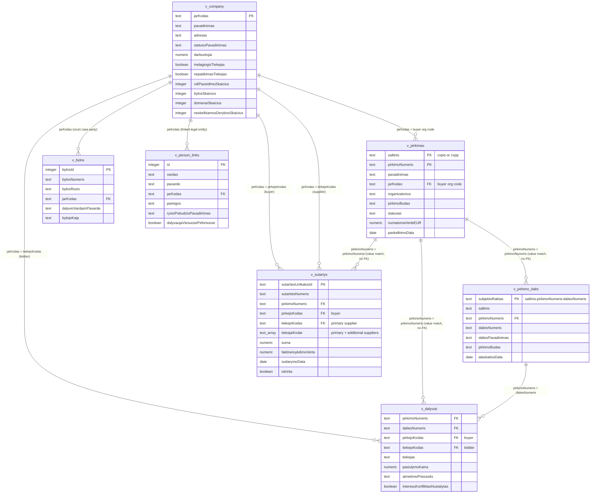

# Domain model

Both the MCP analyst and Procurement Risk Service (Risk Indicators) use domain model that aggregates data table to the
logical stable model.

## Entity-relationship diagram

None of these relationships are enforced foreign keys — every one is a text-value match evaluated at query time (see
`docs/indicators-story/procurement-number-clarification.md` for the `v_pirkimas` ↔ `v_pirkimo_dalis` ↔
`v_dalyviai` case specifically). That's exactly why coverage matters: a match can legitimately fail, and the table below
is how large those gaps actually are.

## Row counts per entity

| Entity            |        Rows | Notes                                                                                                                                                         |
|-------------------|------------:|---------------------------------------------------------------------------------------------------------------------------------------------------------------|
| `v_pirkimas`      |     264,332 | 50,810 from `cvpis` (primary scrape) + 213,522 from `cvpp` (fallback, no matching `cvpis` row)                                                                |
| `v_pirkimo_dalis` | 13,396 lots | Across 5,464 distinct procurements. 13,238 lots resolve to `cvpis`, 44 to `cvpp`, 114 to neither (`saltinis` unresolved)                                      |
| `v_dalyviai`      |      36,793 | One row per (procurement, lot, bidder)                                                                                                                        |
| `v_company`       |     547,298 | = row count of `jarAsmenys`; `v_company` is a pure `LEFT JOIN` enrichment, so this is every legal entity in the registry, not just ones active in procurement |
| `v_sutartys`      |   5,904,634 | 5,902,689 not marked `istrinta` (deleted)                                                                                                                     |
| `v_bylos`         |   2,422,300 | One row per (court case, party)                                                                                                                               |
| `v_person_links`  |     546,639 | PINREG declared relationships                                                                                                                                 |

## Relationship coverage (the gaps)

| Relationship                                          |                                                                                                                    Coverage | Reading                                                                                                                                                                                                                                                                                                                                                                                                                                                                                                                                                                                                                                           |
|-------------------------------------------------------|----------------------------------------------------------------------------------------------------------------------------:|---------------------------------------------------------------------------------------------------------------------------------------------------------------------------------------------------------------------------------------------------------------------------------------------------------------------------------------------------------------------------------------------------------------------------------------------------------------------------------------------------------------------------------------------------------------------------------------------------------------------------------------------------|
| `v_pirkimas` → `v_pirkimo_dalis`                      |                                                                                     **5,464 / 264,332 procurements (2.1%)** | This is the headline gap: lot data only exists for procurements that have a PPA XLSX report (`xlsxPPAataskaitos`/`xlsxPPAdalyviai`, "Pirkimo procedūrų ataskaita") on file — `v_pirkimo_dalis` is built entirely by grouping `v_dalyviai`, which is sourced from that XLSX ingestion, not from ATN‑1 (ATN‑1 only supplies the lot's *name*, `daliesPavadinimas`, as an enrichment on top; see the note above). The other 97.9% of procurements have no known lot breakdown at all — not "1 lot", just unmeasured. Of the 5,464 covered, 3,788 turned out to have exactly 1 lot and 1,677 had 2+ (up to dozens).                                   |
| `v_pirkimo_dalis` → `v_dalyviai`                      |                                                                                                    **100% by construction** | Every lot is derived directly from grouping `v_dalyviai`, so this direction can't have gaps — the question is really "how many bidder-rows per lot": 36,793 rows / 13,396 lots ≈ 2.7 avg.                                                                                                                                                                                                                                                                                                                                                                                                                                                         |
| `v_dalyviai` → `v_pirkimas`                           |                                           **36,374 / 36,793 rows (98.9%)**; **5,414 / 5,464 distinct procurements (99.1%)** | Almost every ATN‑1-derived lot resolves back to a known procurement notice. The ~1–2% that don't are the `insufficient_data` cases documented in `procurement-number-clarification.md`.                                                                                                                                                                                                                                                                                                                                                                                                                                                           |
| `v_pirkimas` → `v_sutartys`                           | **372,387 / 5,904,634 contract rows (6.3%)**; **88.5% of contracts have a NULL `pirkimoNumeris` entirely** (5,223,286 rows) | Looks like a big gap, but mostly isn't one: only 307,239 distinct `pirkimoNumeris` values appear across all contracts, and the NULLs are overwhelmingly `MVPŽ` (78.2% of all NULLs) and `MVP` (16.5%) — two legally-exempt, verbal/low-value types where CVP IS use isn't required or is optional — see [Problem 3](#high-problem-3-missing-v_sutartyspirkimonumeris) below. `TSP` and `PPS`, the two types legally *required* to have a number, contribute only ~186,000 of the 5.2M NULLs (3.6%); most of *their* rows are in fact populated (68.4% / 55.8%). That small slice is the real data-quality gap — the 88.5% headline figure is not. |
| `v_company` → `v_dalyviai` (`tiekejoKodas`)           |                                                **34,875 / 36,793 rows (94.8%)**; **3,554 / 4,044 distinct bidders (87.9%)** | 873 rows (2.4%) have no supplier code at all; the rest that fail to match are codes not found in the company registry (foreign suppliers, natural persons, data-entry variants).                                                                                                                                                                                                                                                                                                                                                                                                                                                                  |
| `v_company` → `v_sutartys` (`pirkejoKodas`, buyer)    |                                                                                      **5,874,080 / 5,904,634 rows (99.5%)** | Buyer-side identification is nearly complete.                                                                                                                                                                                                                                                                                                                                                                                                                                                                                                                                                                                                     |
| `v_company` → `v_sutartys` (`tiekejoKodas`, supplier) |                                                                                      **5,271,364 / 5,904,634 rows (89.3%)** | Supplier-side is weaker than buyer-side — ~10.7% of contracts name a supplier code that isn't in the registry.                                                                                                                                                                                                                                                                                                                                                                                                                                                                                                                                    |
| `v_company` → `v_bylos`                               |                                                                                      **2,286,489 / 2,422,300 rows (94.4%)** | Most court-case parties resolve to a known legal entity; the remainder are presumably natural persons or codes outside the registry.                                                                                                                                                                                                                                                                                                                                                                                                                                                                                                              |
| `v_company` → `v_person_links`                        |                     **523,520 / 546,639 rows (95.8%)**; of the 533,581 rows that carry a company code at all, 98.1% resolve | 2.4% of PINREG relationship rows have no company code recorded in the first place.                                                                                                                                                                                                                                                                                                                                                                                                                                                                                                                                                                |

## Data Problems

### (low) Problem 1: `v_company` enrichment coverage (of 547,298 companies)

These are the risk-relevant flags/counters on `v_company` — most are sparse, which matters when using them as indicator
inputs.

| Field                                                       | Companies with data |  Share |
|-------------------------------------------------------------|--------------------:|-------:|
| Sodra payroll data (`darbuotojai` / `vidutinisAtlyginimas`) |             164,050 |  30.0% |
| Own ≥1 domain (`domenaiSkaicius > 0`)                       |              43,602 |   8.0% |
| Flagged `nepatikimasTiekejas` (unreliable supplier)         |                 154 |  0.03% |
| Flagged `melagingisTiekejas` (false-info supplier)          |                 198 |  0.04% |
| Involved in `neskelbiamosDerybos` (unpublished negotiation) |                 232 |  0.04% |
| `vdiPazeidimuSkaicius > 0` (labour-inspection violations)   |                  20 | 0.004% |

The VDI and blacklist figures in particular are thin: they say more about how much of that source has been ingested than
about the true prevalence of violations in the supplier base, so treat low counts there as a coverage limit, not a clean
bill of health.

### (high) Problem 1: Dirty pirkimoNumeris

Every table/view with a `pirkimoNumeris` column was queried live (`10.1.10.2:9118`, `viespirkiai`, 2026-08-17) for
values that don't match `^[0-9]+$` — i.e. not a plain positive integer. "Dirty" below is measured against **non-NULL**
values only (NULLs are a separate, much larger gap already covered in
[Relationship coverage](#relationship-coverage-the-gaps)). `cvppPirkimai.pirkimoNumeris` is a real `integer` column and
is excluded — it can't be dirty by construction.

| Table                                                   | Non-null rows |   Dirty |   % dirty | Examples                                                                                                                                                                                                                          |
|---------------------------------------------------------|--------------:|--------:|----------:|-----------------------------------------------------------------------------------------------------------------------------------------------------------------------------------------------------------------------------------|
| `vpmSutartys` (= `v_sutartys`, passthrough)             |       681,349 | 138,637 | **20.4%** | `'Žodinė sutartis'` (7,496), `'-'` (2,058), `'žodinė sutartis'` (1,648), `'sutartis žodinė'` (491), `'ŽODINĖ SUTARTIS'` (364), `'žodžiu'` (352), `'žodinė'` (341), `'+'` (339) — verbal-contract sentinels, not malformed numbers |
| `nepatikimiTiekejai`                                    |           219 |      54 | **24.7%** | `''` empty string (33), `'CPO314092-21524-1'`, `'CPO266294'`, `'701969+542538'` (`+`-joined multi-procurement refs)                                                                                                               |
| `melagingiTiekejaiPagrindimai`                          |            40 |       6 | **15.0%** | `'110749+355857'`, `'6295090+6297813'`, `'7981318+7980273'`, `'110749-355856'`                                                                                                                                                    |
| `nepatikimiTiekejaiPagrindimai`                         |           221 |      21 |  **9.5%** | `'CPO353717'`, `'CPO314092-21524-1'`, `'701969+542538'`                                                                                                                                                                           |
| `melagingiTiekejai`                                     |           219 |       4 |  **1.8%** | `'174484+693640'`, `'110749+355856'`, `'110749-355856'`                                                                                                                                                                           |
| `v_dalyviai` (from `xlsxPPAataskaitos`, per bidder-row) |        36,714 |     154 | **0.42%** | `'Nr.1174796'` (78), `'Pirkimo procedūrų ataskaita'` (10), `'1,218,908'` (9, Excel thousands separator), `'ID 693110'` (8), `'ID  \t5115453'` (6, stray tab)                                                                      |
| `xlsxPPAataskaitos` (per report-row)                    |         6,560 |      22 | **0.34%** | same patterns as `v_dalyviai`, one row per report instead of per bidder                                                                                                                                                           |
| `cvppAtaskaitos`                                        |       104,008 |       0 |        0% | —                                                                                                                                                                                                                                 |
| `cvppViesiejiPirkimai`                                  |       257,535 |       0 |        0% | declared `text`, but every non-null value is currently a clean 6-digit number — this is the table `v_pirkimas` casts `viesiejiPirkimai."pirkimoId"` to `text` against for `UNION ALL`                                             |

### (high) Problem 3: Missing v_sutartys.pirkimoNumeris

| tipas                                                               |      rows |      NULL |      % NULL | Pirkimo numeris privalomas?                                                                                                                                 |
|---------------------------------------------------------------------|----------:|----------:|------------:|-------------------------------------------------------------------------------------------------------------------------------------------------------------|
| MVPŽ — Mažos vertės pirkimas (žodinė sutartis)                      | 4,281,331 | 4,082,227 |       95.3% | **Ne** — low-value, verbal; legally exempt from CVP IS                                                                                                      |
| MVP — Mažos vertės pirkimas                                         |   998,503 |   861,643 |       86.3% | **Ne** — low-value; CVP IS use is optional, buyer's choice (explains the ~14% that do have one)                                                             |
| PPS — Pagrindinė pirkimo sutartis (preliminariosios/DPS pagrindu)   |   308,965 |   136,442 | (!!!) 44.2% | **Taip** — the framework/DPS itself is a formal CVP IS procedure; missing values here are a real data gap, not an exemption                                 |
| TSP — Tarptautinis arba supaprastintas pirkimas                     |   157,173 |    49,678 | (!!!) 31.6% | **Taip** — formal procedure, always run through CVP IS; the 31.6% missing is a genuine gap                                                                  |
| SP — Sutarties pakeitimas                                           |   129,967 |    65,738 |       50.6% | **Paveldi iš pirminės sutarties** — amendments follow the same "filled only if CVP IS" rule as their parent contract, no independent number                 |
| Ilgalaikė MVPŽ — Ilgalaikis mažos vertės pirkimas (žodinė sutartis) |    21,752 |    21,520 |       98.9% | **Ne** — same exemption as MVPŽ                                                                                                                             |
| SPŽ — Supaprastintas pirkimas (žodinė sutartis)                     |     3,754 |     3,691 |       98.3% | **Ne** — verbal, same CVP IS-optional exemption                                                                                                             |
| ŽS — Žodinė sutartis                                                |     2,599 |     1,805 |       69.4% | **Ne** — verbal contract                                                                                                                                    |
| VS — Vidaus sandoris                                                |       499 |       478 |       95.8% | **Ne** — VPĮ Art. 10 exemption; the contract itself must still be published in CVP IS, but no competitive procedure (and thus no procurement number) exists |
| PSĮ — Pirkimas iš susijusios įmonės                                 |        79 |        57 |       72.2% | **Ne** — related-party exemption, same structure as `VS`                                                                                                    |
| Nenurodyta (type not set)                                           |        17 |        12 |       70.6% | — (no type recorded)                                                                                                                                        |
| KSS                                                                 |         1 |         0 |        0.0% | — (not in `CONTRACT_TYPES`/`vpmSutartysTipai` dictionary, 1 row, unclassified)                                                                              |

The genuine gap is `TSP` and `PPS` — both are *required* to run through CVP IS and get a number, yet 31.6% and 44.2% are
missing one respectively; that's ~186,000 rows worth investigating as an actual data-quality problem rather than an
expected absence.

