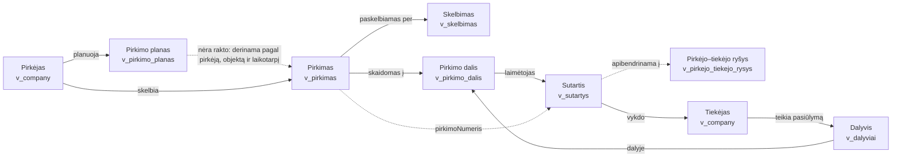

# Domain model

The domain model is the **only language in which a Risk Indicator is specified.** An indicator names procurements,
lots, bids, contracts, relationships and markets — never a warehouse table, never an ingestion column. This document
defines those entities, and then, in a separate section, records how each one is currently assembled from the
warehouse.

That separation is the point of the document. Warehouse structure changes: tables get renamed, a source is replaced,
a column moves. When that happens the mapping in [§4](#4-implementation-mapping) is edited and the indicators are not,
because none of them ever referred to the thing that changed. An indicator that mentions `xlsxPPAataskaitos` is a
broken indicator waiting for its next ingestion release.

Consumers: the Procurement Risk Service ([`risk-service-architecture.md`](risk-service-architecture.md)), the canonical
indicator catalogue ([`indicators-canonical.md`](indicators-canonical.md)) and the MCP analyst.

Measurements throughout are `count(*)` against `viespirkiai` on **2026-08-18**, not planner estimates. Counts move as
ingestion runs; the shape they demonstrate does not.

## 1. Entities

An entity is implemented as a view whose name is its identity. Two kinds:

- a **subject entity** is something an indicator can decide about, so it has a durable key that a stored result is
  attached to;
- an **evidence entity** is something an indicator reads to reach a decision about a subject.

The distinction is about the result, not the data: `v_company` is evidence for a procurement indicator and the subject
of a supplier indicator, and it is one entity either way.

### 1.1 Subject entities

| Entity                    | Business concept                                                          | Grain                                    | Key                                       |      Rows |
|---------------------------|---------------------------------------------------------------------------|------------------------------------------|-------------------------------------------|----------:|
| `v_pirkimas`              | **Pirkimas** — one published procurement                                  | one per published procurement            | `saltinis` + `pirkimoNumeris`             |   264,415 |
| `v_pirkimo_dalis`         | **Pirkimo dalis** — one independently competed slice of a procurement     | one per (source, procurement, lot)       | `subjektoRaktas`                          |    48,564 |
| `v_dalyviai`              | **Dalyvis** — one supplier's participation in one lot                     | one per (procurement, lot, bidder)       | `pirkimoNumeris` + `daliesNumeris` + `tiekejoKodas` | 36,793 |
| `v_sutartys`              | **Sutartis** — one procurement contract                                   | one per contract                         | `sutartiesUnikalusId`                     | 5,906,258 |
| `v_company`               | **Įmonė** — one registered legal entity                                   | one per registered entity                | `jarKodas`                                |   547,298 |
| `v_pirkejo_tiekejo_rysys` | **Pirkėjo–tiekėjo ryšys** — the trading relationship between one buyer and one supplier | one per (buyer, supplier)   | `rysioRaktas`                             | 1,090,112 |
| `v_dalyviu_pora`          | **Dalyvių pora** — two suppliers that have competed in the same lot       | one per unordered pair of suppliers      | `porosRaktas`                             |    19,989 |
| `v_rinka`                 | **Rinka** — one product market, at BVPŽ division level                    | one per BVPŽ division                    | `rinkosRaktas`                            |        45 |

**Buyer and supplier are roles of `v_company`, not separate entities.** A supplier subject is a `v_company` row that
appears as `tiekejoKodas` in `v_pirkejo_tiekejo_rysys` or `v_dalyviai`; a buyer subject is one that appears as
`pirkejoKodas` in `v_pirkejo_tiekejo_rysys` or as `jarKodas` on `v_pirkimas`. Modelling the role as a *predicate over
an existing entity* rather than as two more views keeps one definition of what a company is, and lets an indicator
about a company that both buys and sells attach its result to one subject.

The role predicates are what bound those two subject populations, and they are far smaller than the registry:
**6,103 buyers** and **80,479 suppliers** have ever traded, out of 547,298 registered entities. A company indicator
evaluated over `v_company` unfiltered would be evaluating 85% entities that have never touched public procurement.

**Every relationship subject carries an order-independent key.** `v_dalyviu_pora."tiekejoKodasA"` is always the
lexicographically smaller code, so the pair (X, Y) and the pair (Y, X) are the same subject and cannot both exist. That
is a modelling guarantee, not a convention a query is trusted to honour.

### 1.2 Evidence entities

| Entity              | Business concept                                                  | Grain                                | Key              |      Rows |
|---------------------|-------------------------------------------------------------------|--------------------------------------|------------------|----------:|
| `v_skelbimas`       | **Skelbimas** — one publication event about a procurement         | one per published notice             | `skelbimoRaktas` |   350,157 |
| `v_pirkimo_planas`  | **Pirkimo planas** — one planned procurement, before any notice   | one per planned procurement          | `planoRaktas`    |    91,847 |
| `v_bylos`           | **Byla** — one party's involvement in one court case              | one per (case, party)                | `bylosId`        | 2,422,300 |
| `v_person_links`    | **Asmens ryšys** — one declared relationship between a person and a legal entity | one per declared relationship | `id`  |   546,639 |

### 1.3 Entities specified but not yet implemented

These are named here so an indicator can be *specified* against them before the view exists. An indicator reading one
of them is scoped out until it does, and the run says so — that is the ordinary
[scope mechanism](risk-service-architecture.md#34-gate-1--scope-is-a-property-of-the-source-profile), not a special
case.

| Entity                   | Business concept                                                    | Key                  | Foreign keys                                          | Blocks                                     |
|--------------------------|---------------------------------------------------------------------|----------------------|-------------------------------------------------------|--------------------------------------------|
| `v_dokumentas`           | **Dokumentas** — one document attached to a procurement or contract | `dokumentoRaktas`    | `pirkimoNumeris` → `v_pirkimas`; `sutartiesUnikalusId` → `v_sutartys` | LT-TRA-03, LT-PRO-09, LT-PRO-10, LT-PRO-11, LT-COM-16 |
| `v_sutarties_pakeitimas` | **Sutarties pakeitimas** — one amendment to a contract              | `pakeitimoRaktas`    | `sutartiesUnikalusId` → `v_sutartys`                  | LT-EXE-01 … LT-EXE-06                      |
| `v_subranga`             | **Subranga** — one subcontracting arrangement under a contract      | `subrangosRaktas`    | `sutartiesUnikalusId` → `v_sutartys`; `subrangovoKodas` → `v_company` | LT-EXE-11, LT-EXE-12, LT-EXE-13            |
| `v_proceduros_pabaiga`   | **Procedūros pabaiga** — how a procedure ended, per lot             | `pabaigosRaktas`     | `pirkimoNumeris` + `daliesNumeris` → `v_pirkimo_dalis` | LT-OTH-05, LT-AWD-03                       |
| `v_vertinimo_kriterijai` | **Vertinimo kriterijai** — the award criteria applied to a lot      | `kriterijausRaktas`  | `pirkimoNumeris` + `daliesNumeris` → `v_pirkimo_dalis` | LT-AWD-07, LT-AWD-08                       |
| `v_valdymas`             | **Valdymas** — one ownership or control link between parties        | `valdymoRaktas`      | `jarKodas` → `v_company` (controlled); `valdytojoKodas` → `v_company` (controlling) | LT-COI-02, LT-COI-03, LT-COI-06, LT-SUP-10 |
| `v_imones_finansai`      | **Įmonės finansai** — one company's financial statement period      | `finansuRaktas`      | `jarKodas` → `v_company`                              | LT-SUP-13                                  |
| `v_mokejimai`            | **Mokėjimas** — one payment made against a contract                 | `mokejimoRaktas`     | `sutartiesUnikalusId` → `v_sutartys`                  | LT-EXE-07                                  |

The keys and foreign keys above are the committed part. An indicator may be specified against them today; the
attributes each entity will additionally carry are decided when the view is written.

## 2. Entity-relationship diagram

Only the attributes indicators actually read are listed. Every relationship below is a **value match evaluated at query
time**, not an enforced foreign key — see [§3](#3-how-entities-relate). Entities whose key carries the comment
`planuojama` are specified but not yet implemented ([§1.3](#13-entities-specified-but-not-yet-implemented)); their keys
and links are settled, their remaining attributes are not.

```mermaid
erDiagram
    v_pirkimo_planas {
        text planoRaktas PK
        text pirkejoKodas FK
        text pavadinimas
        numeric numatomaVerte
        text_array bvpzKodai
        timestamp pirkimoPradziosData
    }

    v_pirkimas {
        text saltinis PK "cvpis arba cvpp"
        text pirkimoNumeris PK
        text pavadinimas
        text jarKodas FK "pirkėjas"
        text pirkimoBudas
        text statusas
        text pirkimoObjektoTipas
        numeric numatomaVerteEUR
        date paskelbimoData
        timestamp pasiulymuPateikimoTerminas
        text_array bvpzKodai
        boolean esFinansavimas
    }

    v_skelbimas {
        text skelbimoRaktas PK
        text saltinis
        text pirkimoNumeris FK
        text skelbimoRusis "normalizuota skelbimo rūšis"
        text skelbimoTipas "originali formuluotė"
        timestamp paskelbimoData
    }

    v_pirkimo_dalis {
        text subjektoRaktas PK
        text saltinis
        text pirkimoNumeris FK
        text daliesNumeris
        text daliesPavadinimas
        boolean deklaruota "paskelbta skelbime"
        boolean stebeta "matyti dalyviai"
        integer dalyviuSkaicius
        integer kainuSkaicius
        integer atmestuSkaicius
    }

    v_dalyviai {
        text pirkimoNumeris FK
        text daliesNumeris FK
        text pirkejoKodas FK
        text tiekejoKodas FK
        integer eileNumeris
        numeric pasiulymoKaina
        text atmetimoPriezastis
        boolean interesuKonfliktasNustatytas
        boolean pretenzijaPateikta
        boolean ieskinysTeismui
    }

    v_sutartys {
        text sutartiesUnikalusId PK
        text pirkimoNumeris FK
        text pirkejoKodas FK
        text tiekejoKodas FK
        text_array tiekejaiKodai
        text tipas "TSP, PPS, MVP, ..."
        numeric suma
        numeric faktineIvykdimoVerte
        date sudarymoData
        date galiojimoData
        text_array bvpzKodai
        boolean istrinta
    }

    v_pirkejo_tiekejo_rysys {
        text rysioRaktas PK
        text pirkejoKodas FK
        text tiekejoKodas FK
        integer sutarciuSkaicius
        numeric bendraSuma
        timestamp pirmaSutartisData
        timestamp paskutineSutartisData
    }

    v_dalyviu_pora {
        text porosRaktas PK
        text tiekejoKodasA FK
        text tiekejoKodasB FK
        integer kartuDaliuSkaicius
        integer laimejoA
        integer laimejoB
    }

    v_rinka {
        text rinkosRaktas PK
        text lygis "bvpzSkyrius"
        text kodas
        integer pirkimuSkaicius
        integer pirkejuSkaicius
    }

    v_company {
        text jarKodas PK
        text pavadinimas
        text adresas
        text statusoPavadinimas
        numeric darbuotojai
        date melagingisTiekejasNuo
        date melagingisTiekejasIki
        date nepatikimasTiekejasNuo
        date nepatikimasTiekejasIki
        integer vdiPazeidimuSkaicius
        integer bylosSkaicius
    }

    v_bylos {
        integer bylosId PK
        text bylosNumeris
        text bylosRusis
        text jarKodas FK
        text bylojeKaip
    }

    v_person_links {
        integer id PK
        text vardas
        text pavarde
        text jarKodas FK
        text pareigos
        boolean dalyvaujaViesuosePirkimuose
    }

    v_dokumentas {
        text dokumentoRaktas PK "planuojama"
        text pirkimoNumeris FK
        text sutartiesUnikalusId FK
        text kitiLaukai "..."
    }

    v_sutarties_pakeitimas {
        text pakeitimoRaktas PK "planuojama"
        text sutartiesUnikalusId FK
        text kitiLaukai "..."
    }

    v_subranga {
        text subrangosRaktas PK "planuojama"
        text sutartiesUnikalusId FK
        text subrangovoKodas FK
        text kitiLaukai "..."
    }

    v_proceduros_pabaiga {
        text pabaigosRaktas PK "planuojama"
        text pirkimoNumeris FK
        text daliesNumeris FK
        text kitiLaukai "..."
    }

    v_vertinimo_kriterijai {
        text kriterijausRaktas PK "planuojama"
        text pirkimoNumeris FK
        text daliesNumeris FK
        text kitiLaukai "..."
    }

    v_valdymas {
        text valdymoRaktas PK "planuojama"
        text jarKodas FK "valdoma imone"
        text valdytojoKodas FK "valdanti salis"
        text kitiLaukai "..."
    }

    v_imones_finansai {
        text finansuRaktas PK "planuojama"
        text jarKodas FK
        text kitiLaukai "..."
    }

    v_mokejimai {
        text mokejimoRaktas PK "planuojama"
        text sutartiesUnikalusId FK
        text kitiLaukai "..."
    }

    v_pirkimas ||--o{ v_skelbimas: "paskelbta per"
    v_pirkimas ||--o{ v_pirkimo_dalis: "suskaidytas i"
    v_pirkimo_dalis ||--o{ v_dalyviai: "varzosi"
    v_pirkimas ||--o{ v_sutartys: "baigiasi sutartimi"
    v_company ||--o{ v_pirkimas: "perka"
    v_company ||--o{ v_pirkimo_planas: "planuoja"
    v_company ||--o{ v_dalyviai: "dalyvauja"
    v_company ||--o{ v_sutartys: "tiekia arba perka"
    v_company ||--o{ v_pirkejo_tiekejo_rysys: "prekiauja"
    v_company ||--o{ v_dalyviu_pora: "poroje su"
    v_company ||--o{ v_bylos: "byloje"
    v_company ||--o{ v_person_links: "susijusi su asmeniu"
    v_pirkimas }o--o{ v_rinka: "priklauso rinkai"

    v_pirkimas ||--o{ v_dokumentas: "pirkimo dokumentai"
    v_sutartys ||--o{ v_dokumentas: "sutarties dokumentai"
    v_sutartys ||--o{ v_sutarties_pakeitimas: "keiciama"
    v_sutartys ||--o{ v_subranga: "vykdoma per subranga"
    v_sutartys ||--o{ v_mokejimai: "apmokama"
    v_company ||--o{ v_subranga: "subrangovas"
    v_pirkimo_dalis ||--o| v_proceduros_pabaiga: "baigiasi"
    v_pirkimo_dalis ||--o{ v_vertinimo_kriterijai: "vertinama pagal"
    v_company ||--o{ v_valdymas: "valdo arba yra valdoma"
    v_company ||--o{ v_imones_finansai: "atsiskaito"
```

Entities marked `planuojama` are the eight of [§1.3](#13-entities-specified-but-not-yet-implemented): their identity and
their links into the model are fixed here so an indicator can be specified against them, while their remaining
attributes (`kitiLaukai`) stay open until the view is written. Fixing the foreign keys first is the part that matters —
it settles which subject a result attaches to and which grain the entity is read at, and those are the decisions an
indicator depends on. Adding an attribute later changes no indicator; changing an entity's grain changes every
indicator that reads it.

Two of those links are worth reading closely. **`v_dokumentas` attaches to either a procurement or a contract**, never
to both at once, because a tender document and a signed-contract PDF are published by different processes at different
stages — an indicator about tender transparency and one about contract publication must not see the same population.
And **`v_valdymas` points at `v_company` twice**, as the controlled entity and as the controlling party, which is what
makes it a graph rather than an attribute: the conflict-of-interest indicators traverse it, and traversal needs both
ends named.

## 3. How entities relate

**No relationship in this model is an enforced foreign key.** Every one is a text-value match evaluated when the query
runs, and every one can legitimately fail to match. That is a property of the source systems, not of this model: the
Public Procurement Office publishes the plan register, the notice register, the procedure reports and the contract
register as four independent datasets, and nothing in any of them declares a reference to another.

Three consequences the indicators must live with:

1. **A missing link is a normal outcome, not an error.** A procedure report can exist before its notice has finished
   being ingested. That produces `insufficient_data`, and the risk service treats it as a first-class result rather
   than an exception.
2. **Match quality varies by relationship.** The measured rates are in [§5.2](#52-relationship-coverage).
3. **`pirkimoNumeris` is the load-bearing join and the weakest one.** It carries free text, verbal-contract sentinels
   and multi-procurement references; [§6.2](#62-high-dirty-pirkimonumeris) measures it. Every entity that joins on it
   inherits that weakness, which is why `v_pirkimo_dalis` validates the value before trusting it.

The procurement ↔ lot ↔ bid case deserves stating plainly, because "procurement" and "lot" get used interchangeably in
conversation and they are not the same thing. **One procurement is one published notice; one lot is one independently
competed slice of it**, judged and awarded on its own. A procurement with 77 lots can look healthy at procurement level
— three distinct suppliers across the whole tender — while nine of its lots had exactly one bidder each, because the
same three companies rotated between lots. Any competition measure taken at procurement grain hides that, which is why
the catalogue fixes the grain per indicator rather than leaving it to the author: single valid bid and low bidder count
are lot-grain, while "only one supplier was invited" is a buyer decision taken once for the whole procurement.

Most procurements have a single lot, so most of the time the distinction is invisible — and the multi-lot procurements
where it matters are exactly the large ones with the most room for a quiet, uncompetitive slice.

### 3.1 Procurement lifecycle

The lifecycle as the domain model expresses it. Solid arrows are the sequence a purchase moves through; dashed arrows
are the value matches that link the entities back together.

Two things this diagram states that the data does not:

- **The plan has no key into the procurement.** `v_pirkimo_planas` carries no procurement number, because the plan
  register does not record one. Linking a plan to the procurement it became is a matching problem over buyer, object
  and period, not a join — which is why LT-PRO-02 ("direct award contrary to procurement plan") is harder than it looks.
- **A lot's winner is not recorded as such.** It is inferred: first in the offer ranking (`eileNumeris = 1`) and not
  rejected. Where the ranking is absent the lot has no known winner, which is different from having none.

## 4. Implementation mapping

**This section is for building the domain model, not for specifying indicators.** An indicator that reads anything in
the right-hand column is specified wrongly.

Sources live in `modules/mcp/analyst/views/*.sql` and are created by `modules/mcp/analyst/ensureViews.ts`.

### 4.1 Subject entities

| Entity                    | Warehouse tables                                                                                                             | Notes                                                                                                                     |
|---------------------------|------------------------------------------------------------------------------------------------------------------------------|---------------------------------------------------------------------------------------------------------------------------|
| `v_pirkimas`              | `viesiejiPirkimai` + `viesiejiPirkimaiVykdytojai`; fallback `cvppViesiejiPirkimai` + `vpmSutartys` (buyer code)              | `UNION ALL` of two sources with very different column coverage — see [§5.1](#51-source-profiles)                          |
| `v_pirkimo_dalis`         | `viesiejiPirkimaiDalys` + `viesiejiPirkimai` (declared side); `v_dalyviai` grouped (observed side); `FULL OUTER JOIN` of both | `deklaruota`/`stebeta` state which side a row came from                                                                   |
| `v_dalyviai`              | `xlsxPPAataskaitos`, `xlsxPPAdalyviai`, `xlsxPPApasiulymuEile`, `xlsxPPAatmestiPasiulymai`, `xlsxPPApirkimoBudai`, `xlsxPPAsalys`, `jarAsmenys` | Procurement-procedure report (PPA) ingestion. The lot number lives on the offer rows, not on the participant row |
| `v_sutartys`              | `vpmSutartys` + its type, category, party, CPV, additional-supplier and update tables; `bvpzKodai`; `jarAsmenys`              | —                                                                                                                         |
| `v_company`               | `jarAsmenys` + `jarFormos`, `jarStatusai`, address tables, `sodraMonthly`, `melagingiTiekejai`, `nepatikimiTiekejai`, `vdiPazeidimai`, `teismoNuosprendziaiDalyviai`, `domenai`, `neskelbiamosDerybos` | Blacklist flags are exposed as validity intervals, not booleans, so the risk service can apply its cutoff |
| `v_pirkejo_tiekejo_rysys` | `vpmSutartys` + `vpmSutartysTipai`, aggregated                                                                               | Reads `vpmSutartys` directly, not `v_sutartys`: the aggregate uses none of that view's dozen joins                        |
| `v_dalyviu_pora`          | `v_dalyviai` self-joined within a lot; `jarAsmenys` for names                                                                 | —                                                                                                                         |
| `v_rinka`                 | `viesiejiPirkimai."bvpzKodai"` unnested to two-digit divisions; `bvpzKodai` for names                                        | —                                                                                                                         |

### 4.2 Evidence entities

| Entity             | Warehouse tables                                                                                                     | Notes                                                                          |
|--------------------|----------------------------------------------------------------------------------------------------------------------|--------------------------------------------------------------------------------|
| `v_skelbimas`      | `viesiejiPirkimaiSkelbimai` (55,987) ∪ `cvppSkelbimai` (294,170)                                                     | `skelbimoRusis` normalises two incompatible Lithuanian type vocabularies       |
| `v_pirkimo_planas` | `planuojamiPirkimai` + `planuojamiPirkimaiDuomenys`, `...Vykdytojai`, `...Tipai`, `...Budai`, `...Direktyvos`, `...BvpzKodai` | —                                                                     |
| `v_bylos`          | `teismoNuosprendziaiDalyviai` + `teismoNuosprendziai` + `jarAsmenys`                                                 | `liteko2*` is a newer, richer court source this entity does not yet read       |
| `v_person_links`   | `pinregJuridiniaiRysiai` + `jarAsmenys`                                                                              | Declared relationships only — not inferred ownership                           |

### 4.3 Sources for the entities of §1.3

Named so the implementation does not have to rediscover them. Row counts measured 2026-08-18.

| Entity                   | Available warehouse sources                                                                                                  | Rows                            |
|--------------------------|------------------------------------------------------------------------------------------------------------------------------|---------------------------------|
| `v_dokumentas`           | `dokumentai`, `files*`, `viesiejiPirkimaiFailai`, `vpmSutartysFailai`, `cvppFailai`                                          | 267,297 / 1,832,486 / 1,231,321 |
| `v_sutarties_pakeitimas` | `vpmSutartysChanges`; the `SP` contract type in `vpmSutartys`; `vpmSutartysSumos`, `vpmSutartysSudarymoDatos`                | 9,196 changes; 130,009 `SP` rows |
| `v_subranga`             | `cvppDumpAtn1ContractSubcontractors`, `cvppDumpAtn1ContractUnknownSubcontractors`, `xlsxPPAsutartys."subrangosInfo"`         | 227; 9,939                      |
| `v_proceduros_pabaiga`   | `xlsxPPAproceduruPabaiga`, `cvppDumpAtn1ProcedureEnds`                                                                       | 12,290; 11,484                  |
| `v_vertinimo_kriterijai` | `xlsxPPAvertinimoKriterijai`                                                                                                 | 14,118                          |
| `v_valdymas`             | `jarValdymas`, `jarValdymoOrganai`, `istatinisKapitalas`, `jadis`                                                            | 231,586; 20,087; 101,235        |
| `v_imones_finansai`      | `balansoAtaskaitos`, `pelnoNuostoliuAtaskaitos`, `mokesciai`                                                                 | —                               |
| `v_mokejimai`            | `sabisSaskaitos`, `sabisSutartys`                                                                                            | —                               |

## 5. Measured coverage

### 5.1 Source profiles

`v_pirkimas` unions two sources, and their column coverage is not comparable. Every column counted non-null:

| `saltinis`         |     Rows | `pirkimoBudas` | `statusas` | `numatomaVerteEUR` | `pasiulymuPateikimoTerminas` | `bvpzKodai` | `esFinansavimas` |
|--------------------|---------:|---------------:|-----------:|-------------------:|-----------------------------:|------------:|-----------------:|
| `cvpis` (primary)  |   50,893 |           100% |       100% |              33.8% |                        98.4% |       99.9% |            76.6% |
| `cvpp` (fallback)  |  213,522 |             0% |         0% |                 0% |                       100.0% |          0% |               0% |

A `cvpp` procurement carries a title, a buyer, a publication date and a deadline, and **never** a method, status,
estimated value, CPV or funding flag. This is the single most consequential fact in the model: an indicator that reads
the procurement method has a population of 50,893, not 264,415, and one that reads the estimated value has 17,200.
The risk service turns this into a declared `source_profile`
([architecture §3.4](risk-service-architecture.md#34-gate-1--scope-is-a-property-of-the-source-profile)) so an
indicator states which population it speaks about instead of silently producing nulls.

### 5.2 Relationship coverage

| Relationship                                          | Coverage                                                                        | Reading                                                                                                                                                                                                                                          |
|-------------------------------------------------------|---------------------------------------------------------------------------------|--------------------------------------------------------------------------------------------------------------------------------------------------------------------------------------------------------------------------------------------------|
| `v_pirkimas` → `v_pirkimo_dalis`                      | **6,592 / 264,415 procurements have a declared lot breakdown (2.5%)**           | 43,755 lots are declared in notices across 6,592 procurements; 13,396 are observed through participation across 5,464; 8,510 lots appear on both sides, for a union of 48,564. The other 97.5% of procurements have no known lot breakdown — unmeasured, not "one lot" |
| `v_pirkimo_dalis` → `v_dalyviai`                      | **13,396 / 48,564 lots have observed participation (27.6%)**                    | Only lots with a procedure report carry bidders, prices and rejections. 36,793 participation rows over those lots ≈ 2.7 per lot                                                                                                                    |
| `v_dalyviai` → `v_pirkimas`                           | **5,403 / 5,464 procurements resolve (98.9%)**                                  | 11 resolve to `cvpp`, 51 resolve to neither. Those are the `insufficient_data` cases                                                                                                                                                              |
| `v_pirkimas` → `v_sutartys`                           | **28,367 of 466,358 obliged contracts resolve to a `cvpis` notice (6.1%)**      | Measured over `TSP`+`PPS` only, the two types legally required to carry a number. 203,189 resolve only to a `cvpp` notice, which carries no procedure facts; 234,802 carry no resolvable number at all. Full breakdown in [§6.3](#63-high-missing-procurement-number-on-contracts) |
| `v_company` → `v_dalyviai` (`tiekejoKodas`)           | **34,875 / 36,793 rows (94.8%)**; 3,554 / 4,044 distinct bidders (87.9%)        | 873 rows carry no supplier code; the rest are codes outside the registry — foreign suppliers, natural persons, data-entry variants                                                                                                                |
| `v_company` → `v_sutartys` (`pirkejoKodas`)           | **99.5%**                                                                       | Buyer-side identification is nearly complete                                                                                                                                                                                                     |
| `v_company` → `v_sutartys` (`tiekejoKodas`)           | **89.3%**                                                                       | ~10.7% of contracts name a supplier code not in the registry                                                                                                                                                                                     |
| `v_company` → `v_bylos`                               | **94.4%**                                                                       | The remainder are natural persons or codes outside the registry                                                                                                                                                                                  |
| `v_company` → `v_person_links`                        | **95.8%**; of rows carrying a code at all, 98.1%                                | 2.4% of declared relationships record no company code in the first place                                                                                                                                                                         |
| `v_pirkimo_planas` → `v_pirkimas`                     | **no key exists**                                                                | The plan register records no procurement number. Any link is a match over buyer, object and period, with its own confidence                                                                                                                       |

## 6. Data problems

### 6.1 (low) `v_company` enrichment coverage

Of 547,298 registered entities:

| Field                                                       | Companies with data |  Share |
|-------------------------------------------------------------|--------------------:|-------:|
| Sodra payroll data (`darbuotojai` / `vidutinisAtlyginimas`) |             164,050 |  30.0% |
| Own ≥1 domain (`domenaiSkaicius > 0`)                       |              43,602 |   8.0% |
| Flagged `nepatikimasTiekejas` (unreliable supplier)         |                 154 |  0.03% |
| Flagged `melagingisTiekejas` (false-information supplier)   |                 198 |  0.04% |
| Involved in `neskelbiamosDerybos` (unpublished negotiation) |                 232 |  0.04% |
| `vdiPazeidimuSkaicius > 0` (labour-inspection violations)   |                  20 | 0.004% |

The blacklist and labour-inspection figures say more about how much of those sources has been ingested than about true
prevalence. Treat a low count there as a coverage limit, not a clean bill of health.

> **Response.** A ceiling on the source data, not something ingestion can fix. One concrete consequence:
> **`domenaiSkaicius` must not be used as an indicator input.** DOMREG does not expose the registrant's `jarKodas`;
> resolving a domain to a company is a fuzzy name match ([§7.2](#72-domenaiskaicius-reliability)), and a count built
> on it cannot stand as a signal.

### 6.2 (high) Dirty `pirkimoNumeris`

Every warehouse table with a `pirkimoNumeris` column, scanned for values that are not a plain positive integer.
Measured against **non-NULL** values only.

| Table                                                   | Non-null rows |   Dirty |   % dirty | Examples                                                                                                                                                                                                                          |
|---------------------------------------------------------|--------------:|--------:|----------:|-------------------------------------------------------------------------------------------------------------------------------------------------------------------------------------------------------------------------------------|
| `vpmSutartys` (behind `v_sutartys`)                     |       681,349 | 138,637 | **20.4%** | `'Žodinė sutartis'` (7,496), `'-'` (2,058), `'žodinė sutartis'` (1,648), `'sutartis žodinė'` (491), `'ŽODINĖ SUTARTIS'` (364), `'žodžiu'` (352), `'žodinė'` (341), `'+'` (339) — verbal-contract sentinels, not malformed numbers |
| `nepatikimiTiekejai`                                    |           219 |      54 | **24.7%** | `''` (33), `'CPO314092-21524-1'`, `'CPO266294'`, `'701969+542538'` — `+`-joined multi-procurement references                                                                                                                      |
| `melagingiTiekejaiPagrindimai`                          |            40 |       6 | **15.0%** | `'110749+355857'`, `'6295090+6297813'`, `'110749-355856'`                                                                                                                                                                        |
| `nepatikimiTiekejaiPagrindimai`                         |           221 |      21 |  **9.5%** | `'CPO353717'`, `'CPO314092-21524-1'`, `'701969+542538'`                                                                                                                                                                          |
| `melagingiTiekejai`                                     |           219 |       4 |  **1.8%** | `'174484+693640'`, `'110749+355856'`                                                                                                                                                                                             |
| `xlsxPPAataskaitos` (behind `v_dalyviai`)               |        36,714 |     154 | **0.42%** | `'Nr.1174796'` (78), `'Pirkimo procedūrų ataskaita'` (10), `'1,218,908'` (9, Excel thousands separator), `'ID 693110'` (8), `'ID  \t5115453'` (6, stray tab)                                                                      |
| `cvppAtaskaitos`                                        |       104,008 |       0 |        0% | —                                                                                                                                                                                                                                 |
| `cvppViesiejiPirkimai`                                  |       257,535 |       0 |        0% | Declared `text`, but every non-null value is currently a clean number                                                                                                                                                            |

> **Response.** Essentially unsolvable from the source data alone, and worth internalising: a value matching `^[0-9]+$`
> is not proof it is a real procurement number either. Values seen in the wild include free text like
> `„Parengti ir atlikti koncertinę programą"` and `„Kietasis kompiuterio diskas"` — someone pasted the wrong field.
> The only guarantee that holds across all of it is that it fits in `varchar(50)`. A further trap: some numeric values
> exceed `int4` (`3782102904` is in the data), so every comparison against `viesiejiPirkimai."pirkimoId"` must be made
> as text.
>
> **Direction:** rather than chasing one canonical clean number, build a normalised matching table carrying a
> confidence score per match. The matching logic already exists in the front end; this means porting it into SQL.
> Quality will legitimately vary row to row, and that is expected — beyond a point you cannot out-engineer the
> Public Procurement Office's own data quality.

### 6.3 (high) Missing procurement number on contracts

| `tipas`                                                             |      Rows |      NULL |      % NULL | Is a procurement number required?                                                                                                                     |
|---------------------------------------------------------------------|----------:|----------:|------------:|---------------------------------------------------------------------------------------------------------------------------------------------------------|
| MVPŽ — Mažos vertės pirkimas (žodinė sutartis)                      | 4,282,476 | 4,083,392 |       95.3% | **No** — low-value, verbal; legally exempt from CVP IS                                                                                                |
| MVP — Mažos vertės pirkimas                                         |   998,682 |   861,790 |       86.3% | **No** — CVP IS use is the buyer's choice, which explains the ~14% that do have one                                                                   |
| PPS — Pagrindinė pirkimo sutartis                                   |   309,116 |   136,485 | (!!!) 44.2% | **Yes** — the framework/DPS itself is a formal CVP IS procedure                                                                                        |
| TSP — Tarptautinis arba supaprastintas pirkimas                     |   157,242 |    49,690 | (!!!) 31.6% | **Yes** — formal procedure, always run through CVP IS                                                                                                 |
| SP — Sutarties pakeitimas                                           |   130,009 |    65,760 |       50.6% | **Inherited** from the amended contract                                                                                                               |
| Ilgalaikė MVPŽ                                                      |    21,767 |    21,535 |       98.9% | **No** — same exemption as MVPŽ                                                                                                                       |
| SPŽ — Supaprastintas pirkimas (žodinė sutartis)                     |     3,756 |     3,693 |       98.3% | **No** — verbal                                                                                                                                       |
| ŽS — Žodinė sutartis                                                |     2,599 |     1,805 |       69.4% | **No** — verbal                                                                                                                                       |
| VS — Vidaus sandoris                                                |       498 |       477 |       95.8% | **No** — VPĮ Art. 10 exemption; the contract is published but no competitive procedure exists                                                          |
| PSĮ — Pirkimas iš susijusios įmonės                                 |        79 |        57 |       72.2% | **No** — related-party exemption                                                                                                                      |
| Nenurodyta                                                          |        17 |        12 |       70.6% | —                                                                                                                                                     |
| KSS                                                                 |         1 |         0 |        0.0% | — not in the contract-type dictionary                                                                                                                 |

`TSP` and `PPS` are the genuine gap: both are *required* to carry a number, and 31.6% / 44.2% do not. Resolving them
further:

| Disposition of a `TSP`/`PPS` contract    |     Rows | What it means for an indicator                                       |
|------------------------------------------|---------:|-----------------------------------------------------------------------|
| Resolves to a `cvpis` notice             |   28,367 | Full procedure context available — decidable                          |
| Resolves only to a `cvpp` notice         |  203,189 | Linked, but the notice carries no procedure facts                     |
| Number present but resolves to nothing   |   48,627 | **The gap**                                                           |
| No number at all                         |  186,175 | **The gap**                                                           |
| **Total**                                |  466,358 |                                                                       |

> **Response.** Depends on [§6.2](#62-high-dirty-pirkimonumeris). Once procurement numbers can be matched with a
> confidence score instead of exact-string equality, the real `TSP`/`PPS` gap should be re-measured against those
> matches rather than against raw NULL counts — some of the 234,802 may turn out to be recoverable.
>
> The risk service does not wait for that. It classifies contracts by whether the number was *obliged*, so the
> 5,309,875 exempt contracts are scoped out rather than reported as a data gap, and the 234,802 obliged-but-absent
> ones become the visible finding
> ([architecture §3.5](risk-service-architecture.md#35-expected-absence-and-unexpected-absence)).

## 7. Mitigations

### 7.1 Dirty and unmatched `pirkimoNumeris`

Root cause: `v_dalyviai` and `v_sutartys` pass the source value straight through with no cleaning, which is where both
the free-text garbage (`'Nr.1174796'`, `'ID 693110'`, `'1,218,908'`) and the verbal-contract sentinels
(`'Žodinė sutartis'`, `'-'`, `'+'`) enter. `v_pirkimo_dalis` already validates the value against `^[0-9]+$` before
trusting it for source resolution, so there is precedent in this codebase for "validate, don't blindly join".

**Cheap, view-level:**

- Add a normalised derived column to `v_dalyviai` and `v_pirkimo_dalis` — strip `Nr.`/`ID ` prefixes, stray
  whitespace and tabs, and Excel thousands separators. Recovers roughly 101 of the 154 dirty rows without touching any
  matching logic.
- In `v_sutartys`, map the known verbal-contract sentinels to real `NULL`. This recovers no data, but it makes the
  §6.3 NULL rate honest — today "missing" conflates true `NULL` with strings that were never a number — and stops
  those sentinels being compared against `v_pirkimas."pirkimoNumeris"`.

**Structural:** a side table of `(raw_value, saltinis, candidate_pirkimoNumeris, confidence, method)`, populated by
porting the front end's matching logic into SQL. Multi-reference values (`'701969+542538'`) must fan out into several
rows, which a plain view cannot express, so this needs a materialised table refreshed like other ingestion tasks.

### 7.2 `domenaiSkaicius` reliability

`v_company."domenaiSkaicius"` counts `domenai` rows whose `savininkoKodas` matches. That column is populated by a
Typesense name search over the free-text DOMREG registrant name, ranked by Levenshtein distance and accepted at
distance ≤ 1. DOMREG genuinely does not hand back a `jarKodas`, so this is a best-effort fuzzy match, not a lookup.

**Cheap fix:** the matcher computes the distance and then discards it. Persisting it alongside `savininkoKodas` would
let `v_company` expose a quality-gated count — "only where the name matched exactly" — turning blanket advice into
"usable if filtered". It will not make the field denser; it stops good matches being lumped in with bad ones.

### 7.3 Performance

Two entities aggregate the whole contract corpus on every query and are the first candidates for materialisation once
a real evaluation run measures them:

| Entity                    | Cost                                                    | When to materialise                                                     |
|---------------------------|---------------------------------------------------------|--------------------------------------------------------------------------|
| `v_pirkejo_tiekejo_rysys` | Aggregates 5.91M contract rows into 1.09M relationships | As soon as more than one indicator reads it in a run                     |
| `v_rinka`                 | Unnests CPV arrays over 50,893 procurements             | Cheap today; revisit if market indicators start joining contracts to it  |

Both are `MATERIALIZED VIEW` candidates refreshed before the indicator loop, which the risk service already provides
for ([architecture §5.4](risk-service-architecture.md#54-the-evaluation-contract-covers-every-indicator-shape)). Neither
changes shape when materialised, so no indicator is affected.

## 8. Summary of open work

| Item                                                        | Status                                          |
|-------------------------------------------------------------|--------------------------------------------------|
| 8 subject entities                                          | Implemented                                      |
| 4 evidence entities                                         | Implemented                                      |
| 8 further evidence entities ([§1.3](#13-entities-specified-but-not-yet-implemented)) | Specified, sources identified, views not written |
| Confidence-scored `pirkimoNumeris` matching table           | Not started; blocks the §6.3 re-measurement      |
| `v_bylos` on the newer `liteko2*` source                    | Not started                                      |
| Materialising `v_pirkejo_tiekejo_rysys`                     | Deferred until a run measures it                 |
