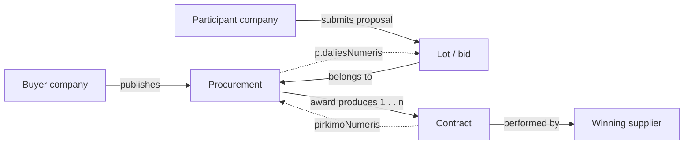

# Canonical Lithuanian catalogue

A flag is a reason to review a procurement, not proof of fraud, corruption, or illegality.

## Reference-code prefixes

| Prefix                           | Source                                                     |
|----------------------------------|------------------------------------------------------------|
| `OCP-R`                          | [OCP indicators](indicators/ocp.md)                        |
| `OLAF-CN`, `OLAF-CA`             | [OLAF-supported Red Flags indicators](indicators/olaf.md)  |
| `OT-I`                           | [OpenTender indicators](indicators/opentender.md)          |
| `STT-I`                          | [STT indicators](indicators/stt.md)                        |
| `VPT-I`                          | [VPT indicators](indicators/vpt.md)                        |
| `ARACHNE-CAP`, `ARACHNE-LEG`     | [ARACHNE+ public documentation](indicators/arachne.md)     |
| `OECD-GOV`, `OECD-TD`, `OECD-BR` | [OECD procurement integrity framework](indicators/oecd.md) |

Mapping semantics: a reference may be an exact equivalent, a narrower/broader metric, or local supporting evidence. The
canonical row is the concept to implement; source formulas must not be combined blindly. `—` means no direct reference
among the seven scoped catalogues, so the indicator is a Lithuanian catalogue gap/proposal requiring a separate legal or
methodological basis.

`ARACHNE-CAP` references identify publicly documented ARACHNE+ capabilities, not individual members of the unpublished
78-indicator register. `ARACHNE-LEG` references are publicly named legacy indicators whose retention in ARACHNE+ is not
publicly confirmed. They provide supporting provenance and must not be implemented as current ARACHNE+ formulas.

Coverage rule: every coded OCP, OLAF-supported Red Flags, OpenTender, STT, and VPT entry, every `OECD-BR` warning sign,
and every publicly named `ARACHNE-LEG` indicator is represented by at least one canonical row. `OECD-GOV`, `OECD-TD`,
and `ARACHNE-CAP` entries describe principles, controls, or broad capabilities rather than one-to-one executable flags;
they are referenced only where they directly support a canonical concept. ARACHNE legacy categories are taxonomy labels
and are not canonical indicators.

## Evaluation subject and UI placement

**Primary evaluation subject** is the entity whose risk state the rule decides, not every entity used as input. It
therefore also determines the natural 360° page on which the signal should be shown:

| Evaluation subject                  | Natural placement                                                                         |
|-------------------------------------|-------------------------------------------------------------------------------------------|
| Procurement, lot                    | Procurement page; a lot signal rolls up to its procurement                                |
| Bid / bidder participation          | Procurement page, attached to the participant/proposal                                    |
| Contract                            | Contract page; also link it from the originating procurement                              |
| Supplier company, buyer institution | Company page for that legal entity                                                        |
| Buyer–supplier relationship         | Both companies' relationship view; optionally roll up to related procurements             |
| Bidder group / relationship         | Procurement relationship view and each involved company's 360° view                       |
| Market / category portfolio         | Analytical/market view; only show on a company or procurement page as contextual evidence |

A portfolio indicator may read many procurements but still decide a state about a company or relationship. Conversely,
company facts such as sanctions can be evidence for a procurement-specific decision without changing the primary
subject. Where a rule is calculated at lot grain, the durable subject key must include both procurement and lot
identifiers.

#### Consequence for the risk schema

The current `risk.risk_signals.subject_type` constraint supports only `procurement`, `lot`, `contract`, and
`supplier`. The catalogue needs additional first-class subjects before every indicator can be implemented without
attaching a decision to the wrong entity:

| Catalogue subject           | Recommended stored subject type                                 |
|-----------------------------|-----------------------------------------------------------------|
| Procurement                 | `procurement`                                                   |
| Lot                         | `lot`                                                           |
| Bid / bidder participation  | `bid` (key includes procurement, lot, and participant)          |
| Contract                    | `contract`                                                      |
| Supplier company            | `supplier`                                                      |
| Buyer institution           | `buyer`                                                         |
| Buyer–supplier relationship | `buyer_supplier_relationship`                                   |
| Bidder group / relationship | `bidder_relationship` (canonical, order-independent party keys) |
| Market / category portfolio | `market` (key includes the market/category and analysis window) |

`procurement_source` and `procurement_id` should remain optional context/navigation keys, not part of the subject's
identity. For example, a supplier sanction is one company-level result that may be shown as context on many
procurements; duplicating it as a separate procurement decision would distort counts and history.

### Procurement lifecycle in the current data model

Live database snapshot: **2026-08-13 11:18 Europe/Vilnius**. Counts use the identity in the sixth column; they are
not PostgreSQL planner estimates.

| Lifecycle entity or transition | Canonical view | Backing table(s) | Current entity count | Canonical LT-* indicators | Projected signal rows | Identity or join mapping | Coverage / cardinality |
|---|---|---|---:|---:|---:|---|---|
| Buyer company | `v_pirkimas` | `viesiejiPirkimai`, `viesiejiPirkimaiVykdytojai`; CVPP fallback via `cvppViesiejiPirkimai` and `vpmSutartys` | 2,792 | 3 | 8,376 | Distinct non-null `v_pirkimas.jarKodas` | One buyer per procurement when the company code is available |
| Procurement | `v_pirkimas` | `viesiejiPirkimai`; fallback `cvppViesiejiPirkimai` | 264,037 | 28 | 7,393,036 | `(saltinis, pirkimoId)` | One row per source procurement; CVP IS takes precedence over a matching CVPP notice |
| Procurement lot | `v_dalyviai` | `atn1ataskaitos`, `atn1pasiulymuEile`, `atn1atmestiPasiulymai` | 1,272 | 17 | 21,624 | `(pirkimoNumeris, COALESCE(daliesNumeris, '0'))` | Only where structured ATN-1 detail was ingested |
| Participant / supplier company | `v_dalyviai`, `v_sutartys` | `atn1dalyviai`, `vpmSutartys`, optionally `jarAsmenys` | 80,434 | 10 | 804,340 | Union of distinct non-null ATN-1 and primary-contract `tiekejoKodas` | 559 occur in structured ATN-1 participation and 80,407 as primary contract suppliers; additional contract suppliers are excluded from this conservative count |
| Bid / proposal in a lot | `v_dalyviai` | `atn1pasiulymuEile`, `atn1atmestiPasiulymai` | 2,989 | 11 | 32,879 | `(pirkimoNumeris, COALESCE(daliesNumeris, '0'), tiekejoKodas)` | Best-effort ATN-1 data, not complete for every procurement |
| Award → buyer–supplier relationship | `v_sutartys` | `vpmSutartys`, `vpmSutartysPapildomiTiekejai`, `vpmSutartysSalys` | 5,893,501 contract-award records | 5 | ≤29,467,505 | Buyer and supplier codes identify the relationship; `pirkimoNumeris` links to procurement | Upper bound uses contract-award records. The real total is lower after materializing and deduplicating buyer–supplier relationship subjects |
| Co-bidder group / relationship | `v_dalyviai` | `atn1dalyviai`, `atn1pasiulymuEile` | 1,756 observed bidder pairs | 12 | 21,072 | Order-independent pairs of `tiekejoKodas` co-occurring in one lot | Counts pairs, not every larger group; limited by ATN-1 coverage |
| Contract | `v_sutartys` | `vpmSutartys` and its type, category, party, CPV, and update tables | 5,893,501 | 17 | 100,189,517 | Distinct non-deleted `sutartiesUnikalusId`; `pirkimoNumeris` links back to procurement | A contract is the execution-stage result of an award and does not replace the procurement |
| CPV market / category | `v_pirkimas` | `viesiejiPirkimai.bvpzKodai` | 4,189 CPV codes | 3 | 12,567 | Distinct non-null code from `unnest(v_pirkimas.bvpzKodai)` | The executable subject key must also include market level and analysis window |

Assuming all **106 canonical indicators** are implemented and every indicator emits a stored state for every subject
in its row, one initial Procurement Risk run would create **up to 137,950,916 current signal rows**. Contracts account
for **100,189,517** of them. This is a sizing upper bound, not an expected triggered-risk count: applicability rules
can reduce the evaluated subject universe, and deduplicating buyer–supplier relationships will reduce the total.
Later unchanged runs update `checked_at` instead of inserting another current row.

## Competition (24)

| Code      | Canonical indicator                           | Primary evaluation subject  | Reference indicators                                                                                       |
|-----------|-----------------------------------------------|-----------------------------|------------------------------------------------------------------------------------------------------------|
| LT-COM-01 | Single valid bid                              | Lot                         | OCP-R018; OLAF-CA02; OT-I01; STT-I03; VPT-I01                                                              |
| LT-COM-02 | Low number of bidders                         | Lot                         | OCP-R019; OLAF-CN01; OLAF-CN02; OLAF-CA02; VPT-I12                                                         |
| LT-COM-03 | Only one supplier invited or consulted        | Procurement                 | STT-I02                                                                                                    |
| LT-COM-04 | High buyer–supplier award concentration       | Buyer–supplier relationship | OCP-R040; OT-I08; STT-I06; STT-I07; ARACHNE-CAP-04; OECD-BR-01                                             |
| LT-COM-05 | High supplier market share                    | Supplier company            | OCP-R050                                                                                                   |
| LT-COM-06 | High market concentration                     | Market / category portfolio | OCP-R051; ARACHNE-CAP-04                                                                                   |
| LT-COM-07 | Missing expected bidder                       | Lot                         | OCP-R027; OECD-BR-03                                                                                       |
| LT-COM-08 | Excessive unsuccessful bids                   | Supplier company            | OCP-R025; VPT-I11; OECD-BR-05; OECD-BR-08                                                                  |
| LT-COM-09 | Prevalence of bidding consortia               | Market / category portfolio | OCP-R026; OECD-BR-07                                                                                       |
| LT-COM-10 | Identical bid prices                          | Lot                         | OCP-R028; OECD-BR-24                                                                                       |
| LT-COM-11 | Fixed-multiple bid prices                     | Lot                         | OCP-R023; OECD-BR-25                                                                                       |
| LT-COM-12 | Suspiciously close bid prices                 | Lot                         | OCP-R024; OECD-BR-26                                                                                       |
| LT-COM-13 | Wide disparity in bid prices                  | Lot                         | OCP-R022; OECD-BR-26                                                                                       |
| LT-COM-14 | Bid rotation                                  | Bidder group / relationship | OCP-R057; OECD-BR-06                                                                                       |
| LT-COM-15 | Recurrent winner among co-bidding pairs       | Bidder group / relationship | OCP-R053                                                                                                   |
| LT-COM-16 | Similar bid documents                         | Bid / bidder participation  | OCP-R041; OECD-BR-09; OECD-BR-10; OECD-BR-12; OECD-BR-14; OECD-BR-15; OECD-BR-39                           |
| LT-COM-17 | Bids submitted in suspiciously repeated order | Bid / bidder participation  | OCP-R034; OECD-BR-18                                                                                       |
| LT-COM-18 | Procurement object has elevated cartel risk   | Procurement                 | OLAF-CN05                                                                                                  |
| LT-COM-19 | Geographic or customer-market allocation      | Market / category portfolio | OECD-BR-02; OECD-BR-35; OECD-BR-36                                                                         |
| LT-COM-20 | Unexpected or frequent bid withdrawal         | Bid / bidder participation  | OECD-BR-04                                                                                                 |
| LT-COM-21 | Non-genuine, incomplete, or incapable bid     | Bid / bidder participation  | OECD-BR-13; OECD-BR-16; OECD-BR-32; OECD-BR-38; OECD-BR-46                                                 |
| LT-COM-22 | Competing bids operationally coordinated      | Bidder group / relationship | OECD-BR-11; OECD-BR-17; OECD-BR-44; OECD-BR-45                                                             |
| LT-COM-23 | Bidder statements indicate collusion          | Bid / bidder participation  | OECD-BR-33; OECD-BR-34; OECD-BR-35; OECD-BR-36; OECD-BR-37; OECD-BR-38; OECD-BR-39; OECD-BR-40; OECD-BR-41 |
| LT-COM-24 | Suppliers meet or socialize before bidding    | Bidder group / relationship | OECD-BR-42; OECD-BR-43                                                                                     |

## Procedure design (14)

| Code      | Canonical indicator                                | Primary evaluation subject | Reference indicators                                                                                                                                           |
|-----------|----------------------------------------------------|----------------------------|----------------------------------------------------------------------------------------------------------------------------------------------------------------|
| LT-PRO-01 | Unjustified non-competitive procedure              | Procurement                | OCP-R010; OLAF-CN23; OT-I03; STT-I08; VPT-I15                                                                                                                  |
| LT-PRO-02 | Direct award contrary to procurement plan          | Procurement                | OCP-R012                                                                                                                                                       |
| LT-PRO-03 | High institutional use of non-competitive methods  | Buyer institution          | OCP-R013; VPT-I15                                                                                                                                              |
| LT-PRO-04 | Procedure without prior publication                | Procurement                | OLAF-CA01; OT-I02                                                                                                                                              |
| LT-PRO-05 | Accelerated procedure without adequate grounds     | Procurement                | OLAF-CN22                                                                                                                                                      |
| LT-PRO-06 | Purchase splitting to avoid threshold              | Buyer institution          | OCP-R011; STT-I09                                                                                                                                              |
| LT-PRO-07 | Manipulation/bunching around procurement threshold | Buyer institution          | OCP-R002; OCP-R049; OCP-R055                                                                                                                                   |
| LT-PRO-08 | Short submission/advertisement period              | Procurement                | OCP-R003; OCP-R014; OLAF-CN29; OT-I04                                                                                                                          |
| LT-PRO-09 | Unreasonable prequalification requirements         | Procurement                | OCP-R006; OLAF-CN10; OLAF-CN11; OLAF-CN12; OLAF-CN14; OLAF-CN15; OLAF-CN16; OLAF-CN17; OLAF-CN18; OLAF-CN19; OLAF-CN20; OLAF-CN21; STT-I05; OT-I10; OECD-TD-02 |
| LT-PRO-10 | Tailored or restrictive technical specifications   | Procurement                | OCP-R007; OLAF-CN20; STT-I04; OT-I10; OECD-TD-03                                                                                                               |
| LT-PRO-11 | Unreasonable participation or document fees        | Procurement                | OCP-R008; OCP-R009                                                                                                                                             |
| LT-PRO-12 | Excessive tender guarantee                         | Procurement                | OLAF-CN31                                                                                                                                                      |
| LT-PRO-13 | Low predefined number of candidates                | Procurement                | OLAF-CN24                                                                                                                                                      |
| LT-PRO-14 | Missing method for reducing candidate numbers      | Procurement                | OLAF-CN25                                                                                                                                                      |

## Supplier relationship (13)

| Code      | Canonical indicator                                                    | Primary evaluation subject  | Reference indicators                                      |
|-----------|------------------------------------------------------------------------|-----------------------------|-----------------------------------------------------------|
| LT-SUP-01 | Repeated awards to same supplier                                       | Buyer–supplier relationship | OCP-R040; STT-I06                                         |
| LT-SUP-02 | Small initial purchase followed by much larger purchases               | Buyer–supplier relationship | OCP-R052                                                  |
| LT-SUP-03 | Multiple direct awards to same supplier near threshold                 | Buyer–supplier relationship | OCP-R055                                                  |
| LT-SUP-04 | Supplier operates across unusually unrelated markets                   | Supplier company            | OCP-R048; OT-I09                                          |
| LT-SUP-05 | Supplier not found in business registry                                | Supplier company            | OCP-R045                                                  |
| LT-SUP-06 | Supplier not traceable through normal public sources                   | Supplier company            | OCP-R047                                                  |
| LT-SUP-07 | Abnormal supplier address or phone                                     | Supplier company            | OCP-R042                                                  |
| LT-SUP-08 | Supplier is debarred or sanctioned                                     | Supplier company            | OCP-R046; ARACHNE-CAP-07                                  |
| LT-SUP-09 | Supplier registered in tax-haven jurisdiction                          | Supplier company            | OT-I06                                                    |
| LT-SUP-10 | Business similarities suggest connected bidders                        | Bidder group / relationship | OCP-R044; OECD-BR-19; OECD-BR-47                          |
| LT-SUP-11 | Supplier supports or donates to purchasing institution                 | Buyer–supplier relationship | STT-I20                                                   |
| LT-SUP-12 | Winning operator carries adverse risk information                      | Supplier company            | OLAF-CA03; ARACHNE-CAP-03; ARACHNE-CAP-08; ARACHNE-CAP-09 |
| LT-SUP-13 | Supplier or associated-company financial risk is high or deteriorating | Supplier company            | ARACHNE-LEG-01; ARACHNE-LEG-02; ARACHNE-LEG-03            |

## Pricing (12)

| Code      | Canonical indicator                                           | Primary evaluation subject | Reference indicators                                       |
|-----------|---------------------------------------------------------------|----------------------------|------------------------------------------------------------|
| LT-PRI-01 | Estimated value anomalous against market benchmark            | Lot                        | OCP-R016; OLAF-CN07; STT-I10                               |
| LT-PRI-02 | Line-item price anomalously high or low                       | Bid / bidder participation | OCP-R017                                                   |
| LT-PRI-03 | Winning price close to or above estimate                      | Lot                        | OCP-R031; OLAF-CN13; OECD-BR-28                            |
| LT-PRI-04 | Final-to-estimated value ratio anomalous                      | Contract                   | OLAF-CA04                                                  |
| LT-PRI-05 | High estimated value                                          | Procurement                | OLAF-CN06                                                  |
| LT-PRI-06 | High estimated framework value                                | Procurement                | OLAF-CN04                                                  |
| LT-PRI-07 | High final contract value                                     | Contract                   | OLAF-CA09                                                  |
| LT-PRI-08 | Bid prices deviate from Benford's Law                         | Lot                        | OCP-R029; OT-I07                                           |
| LT-PRI-09 | Heavily discounted bid                                        | Bid / bidder participation | OCP-R058                                                   |
| LT-PRI-10 | Bid-price or discount movements inconsistent with competition | Lot                        | OECD-BR-20; OECD-BR-21; OECD-BR-22; OECD-BR-23; OECD-BR-29 |
| LT-PRI-11 | Supplier bid much higher than for a comparable contract       | Bid / bidder participation | OECD-BR-27                                                 |
| LT-PRI-12 | Anomalous geographic delivery or transport pricing            | Bid / bidder participation | OECD-BR-30; OECD-BR-31                                     |

## Award (8)

| Code      | Canonical indicator                           | Primary evaluation subject | Reference indicators                    |
|-----------|-----------------------------------------------|----------------------------|-----------------------------------------|
| LT-AWD-01 | All bids except winner disqualified           | Lot                        | OCP-R035; OT-I11                        |
| LT-AWD-02 | Lowest bid disqualified                       | Lot                        | OCP-R036                                |
| LT-AWD-03 | Poorly supported disqualification             | Lot                        | OCP-R037; STT-I14                       |
| LT-AWD-04 | Excessive share of disqualified bids          | Lot                        | OCP-R038                                |
| LT-AWD-05 | Late bid accepted and won                     | Bid / bidder participation | OCP-R030                                |
| LT-AWD-06 | Winner does not meet award criteria           | Bid / bidder participation | OCP-R056                                |
| LT-AWD-07 | Evaluation criteria excessively discretionary | Lot                        | OCP-R021; STT-I13                       |
| LT-AWD-08 | Award criteria or scoring method incomplete   | Lot                        | OLAF-CN26; OLAF-CN27; OLAF-CN28; OT-I10 |

## Contract execution (13)

| Code      | Canonical indicator                                          | Primary evaluation subject | Reference indicators             |
|-----------|--------------------------------------------------------------|----------------------------|----------------------------------|
| LT-EXE-01 | Contract modified after award                                | Contract                   | OCP-R064; STT-I16                |
| LT-EXE-02 | Amendment reduces line items                                 | Contract                   | OCP-R065                         |
| LT-EXE-03 | Amendment increases line items                               | Contract                   | OCP-R066                         |
| LT-EXE-04 | Amendment increases contract price                           | Contract                   | OCP-R069; STT-I17                |
| LT-EXE-05 | Direct award followed by changes above competitive threshold | Contract                   | OCP-R054                         |
| LT-EXE-06 | Final contract amount differs greatly from award             | Contract                   | OCP-R059                         |
| LT-EXE-07 | Payments exceed contract amount                              | Contract                   | OCP-R068; ARACHNE-CAP-11         |
| LT-EXE-08 | Delivery failure                                             | Contract                   | OCP-R067                         |
| LT-EXE-09 | Delivered work differs from specifications                   | Contract                   | OCP-R073; STT-I18                |
| LT-EXE-10 | Weak supervision or acceptance controls                      | Contract                   | STT-I19                          |
| LT-EXE-11 | Losing bidder hired as subcontractor                         | Contract                   | OCP-R070; OECD-BR-03; OECD-BR-48 |
| LT-EXE-12 | Contractor subcontracts most of the work                     | Contract                   | OCP-R071                         |
| LT-EXE-13 | High prevalence of subcontracting                            | Contract                   | OCP-R072                         |

## Conflict of interest (7)

| Code      | Canonical indicator                                               | Primary evaluation subject  | Reference indicators                                         |
|-----------|-------------------------------------------------------------------|-----------------------------|--------------------------------------------------------------|
| LT-COI-01 | Bidder and project official share contact information             | Bidder group / relationship | OCP-R043; STT-I12                                            |
| LT-COI-02 | Bidders share beneficial owner                                    | Bidder group / relationship | OCP-R032; ARACHNE-CAP-05; ARACHNE-CAP-10                     |
| LT-COI-03 | Bidders share major shareholder                                   | Bidder group / relationship | OCP-R033                                                     |
| LT-COI-04 | Undeclared or unmanaged conflict of interest                      | Bidder group / relationship | STT-I11; ARACHNE-CAP-12; OECD-GOV-02                         |
| LT-COI-05 | Buyer official has personal or business tie to supplier           | Bidder group / relationship | STT-I12; ARACHNE-CAP-10; ARACHNE-CAP-12; ARACHNE-LEG-04      |
| LT-COI-06 | Common control links competing bidders                            | Bidder group / relationship | OCP-R032; OCP-R033; OCP-R044; ARACHNE-CAP-05; ARACHNE-CAP-10 |
| LT-COI-07 | Politically exposed person linked to supplier or beneficial owner | Bidder group / relationship | ARACHNE-CAP-06                                               |

## Transparency (9)

| Code      | Canonical indicator                           | Primary evaluation subject | Reference indicators           |
|-----------|-----------------------------------------------|----------------------------|--------------------------------|
| LT-TRA-01 | Planning documents unavailable                | Procurement                | OCP-R001; VPT-I09; OECD-GOV-01 |
| LT-TRA-02 | Tender insufficiently advertised              | Procurement                | OCP-R004; OLAF-CN30; OT-I02    |
| LT-TRA-03 | Key tender information/documents unavailable  | Procurement                | OCP-R005; STT-I15              |
| LT-TRA-04 | Contract not published                        | Contract                   | OCP-R063; VPT-I07; VPT-I08     |
| LT-TRA-05 | Bidder questions unanswered                   | Procurement                | OCP-R039                       |
| LT-TRA-06 | Procurement decision or reason not documented | Procurement                | STT-I15; OLAF-CA06             |
| LT-TRA-07 | Complaint received                            | Procurement                | OCP-R020; VPT-I13; OECD-GOV-11 |
| LT-TRA-08 | Procurement challenged in court               | Procurement                | VPT-I14                        |
| LT-TRA-09 | Procurement not conducted electronically      | Procurement                | VPT-I06; OECD-GOV-07           |

## Other (6)

| Code      | Canonical indicator                                   | Primary evaluation subject | Reference indicators                                     |
|-----------|-------------------------------------------------------|----------------------------|----------------------------------------------------------|
| LT-OTH-01 | No documented market research                         | Procurement                | STT-I01; OECD-TD-01                                      |
| LT-OTH-02 | Long or indefinite contract/framework duration        | Contract                   | OLAF-CN03; OLAF-CN08; OLAF-CN09                          |
| LT-OTH-03 | Evaluation/decision period anomalously short or long  | Procurement                | OCP-R015; OCP-R061; OCP-R062; OLAF-CA08; OT-I05; VPT-I10 |
| LT-OTH-04 | Award-to-signature period unusually long              | Procurement                | OCP-R060                                                 |
| LT-OTH-05 | Procedure unsuccessful or award not contracted        | Procurement                | OLAF-CA05; OLAF-CA06; OLAF-CA07; VPT-I11                 |
| LT-OTH-06 | Strategic-policy objective not applied where relevant | Procurement                | VPT-I02; VPT-I03; VPT-I04; VPT-I05; OECD-GOV-04          |

## Canonical totals

| Category              |   Count |
|-----------------------|--------:|
| Competition           |      24 |
| Procedure design      |      14 |
| Supplier relationship |      13 |
| Pricing               |      12 |
| Award                 |       8 |
| Contract execution    |      13 |
| Conflict of interest  |       7 |
| Transparency          |       9 |
| Other                 |       6 |
| **Total**             | **106** |

## Implementation note

The mapping is many-to-many and preserves provenance while removing conceptual duplication. A production specification
should add, for every canonical indicator: Lithuanian title, definition, unit of analysis, required fields, exact
formula and threshold, applicable procedure types, risk/compliance distinction, severity, missing-data behavior, source
page/version, and validation status. Thresholds must be calibrated on Lithuanian data and current Lithuanian/EU law
rather than copied mechanically from another jurisdiction.
