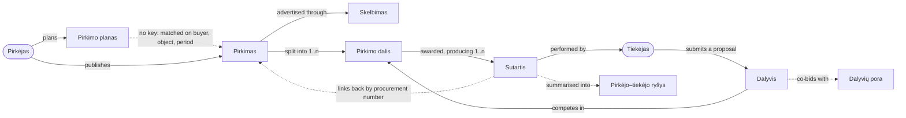

# Canonical Lithuanian catalogue

Status: draft

A flag is a reason to review a procurement, not proof of fraud, corruption, or illegality.

This document is the single definition of **what** the 106 canonical `LT-*` indicators are, **which subject** each one
decides about, and **which Risk Decision Service** evaluates it. The service that runs them is specified in
[`risk-service-architecture-v2.md`](risk-service-architecture-v2.md); the entities they read are specified in
[`domain-model.md`](domain-model.md). No indicator list is maintained anywhere else.

## 1. Reference-code prefixes

| Prefix                           | Source                                                     |
|----------------------------------|------------------------------------------------------------|
| `OCP-R`                          | [OCP indicators](indicators/ocp.md)                        |
| `OLAF-CN`, `OLAF-CA`             | [OLAF-supported Red Flags indicators](indicators/olaf.md)  |
| `OT-I`                           | [OpenTender indicators](indicators/opentender.md)          |
| `STT-I`                          | [STT indicators](indicators/stt.md)                        |
| `VPT-I`                          | [VPT indicators](indicators/vpt.md)                        |
| `ARACHNE-CAP`, `ARACHNE-LEG`     | [ARACHNE+ public documentation](indicators/arachne.md)     |
| `OECD-GOV`, `OECD-TD`, `OECD-BR` | [OECD procurement integrity framework](indicators/oecd.md) |

Mapping semantics: a reference may be an exact equivalent, a narrower/broader metric, or local supporting evidence. The
canonical row is the concept to implement; source formulas must not be combined blindly. `—` means no direct reference
among the seven scoped catalogues, so the indicator is a Lithuanian catalogue gap/proposal requiring a separate legal or
methodological basis.

`ARACHNE-CAP` references identify publicly documented ARACHNE+ capabilities, not individual members of the unpublished
78-indicator register. `ARACHNE-LEG` references are publicly named legacy indicators whose retention in ARACHNE+ is not
publicly confirmed. They provide supporting provenance and must not be implemented as current ARACHNE+ formulas.

Coverage rule: every coded OCP, OLAF-supported Red Flags, OpenTender, STT, and VPT entry, every `OECD-BR` warning sign,
and every publicly named `ARACHNE-LEG` indicator is represented by at least one canonical row. `OECD-GOV`, `OECD-TD`,
and `ARACHNE-CAP` entries describe principles, controls, or broad capabilities rather than one-to-one executable flags;
they are referenced only where they directly support a canonical concept. ARACHNE legacy categories are taxonomy labels
and are not canonical indicators.

## 2. Evaluation subjects

### 2.1 What a primary evaluation subject is

**Primary evaluation subject** is the entity whose risk state the rule decides, not every entity used as input. It
therefore also determines the natural 360° page on which the signal should be shown:

| Evaluation subject                  | Natural placement                                                                         |
|-------------------------------------|-------------------------------------------------------------------------------------------|
| Procurement, lot                    | Procurement page; a lot signal rolls up to its procurement                                |
| Bid / bidder participation          | Procurement page, attached to the participant/proposal                                    |
| Contract                            | Contract page; also link it from the originating procurement                              |
| Supplier company, buyer institution | Company page for that legal entity                                                        |
| Buyer–supplier relationship         | Both companies' relationship view; optionally roll up to related procurements             |
| Bidder group / relationship         | Procurement relationship view and each involved company's 360° view                       |
| Market / category portfolio         | Analytical/market view; only show on a company or procurement page as contextual evidence |

A portfolio indicator may read many procurements but still decide a state about a company or relationship. Conversely,
company facts such as sanctions can be evidence for a procurement-specific decision without changing the primary
subject. Where a rule is calculated at lot grain, the durable subject key must include both procurement and lot
identifiers.

### 2.2 Subject register

Each stored subject type resolves to exactly one entity of the [domain model](domain-model.md), and that entity — never
a warehouse table — is what an indicator is specified against. Live database snapshot: **2026-08-18**; counts are
`count(*)`, not planner estimates.

| Domain Model Entity       |  Subjects | Canonical LT-* indicators | Identity                                             | Decision Service                 | Subject type                  |
|---------------------------|----------:|--------------------------:|------------------------------------------------------|----------------------------------|-------------------------------|
| `v_pirkimas`              |   264,415 |                        28 | `saltinis` + `pirkimoNumeris`                        | Procurement Risk                 | `procurement`                 |
| `v_pirkimo_dalis`         |    48,564 |                        17 | `subjektoRaktas`                                     | Procurement Risk                 | `lot`                         |
| `v_dalyviai`              |    36,793 |                        11 | `pirkimoNumeris` + `daliesNumeris` + `tiekejoKodas`  | Procurement Risk                 | `bid`                         |
| `v_sutartys`              | 5,906,258 |                        17 | `sutartiesUnikalusId`, not deleted                   | Contract Risk                    | `contract`                    |
| `v_company` as supplier   |    80,479 |                        10 | `jarKodas` that has supplied under a contract or bid | Company Risk                     | `supplier`                    |
| `v_company` as buyer      |     6,103 |                         3 | `jarKodas` that has purchased under a contract       | Company Risk                     | `buyer`                       |
| `v_pirkejo_tiekejo_rysys` | 1,090,112 |                         5 | `rysioRaktas`                                        | Buyer–Supplier Relationship Risk | `buyer_supplier_relationship` |
| `v_dalyviu_pora`          |    19,989 |                        12 | `porosRaktas`, order-independent                     | Bidder Relationship Risk         | `bidder_relationship`         |
| `v_rinka`                 |        45 |                         3 | `rinkosRaktas` (BVPŽ division)                       | Market Risk                      | `market`                      |
| **Total**                 |           |                   **106** |                                                      | 6 services                       | 9 subject types               |

`procurement_source` and `procurement_id` are optional context/navigation keys, not part of the subject's identity. A
supplier sanction is one company-level result that may be shown as context on many procurements; duplicating it as a
separate procurement decision would distort counts and history.

Storage constraint: `SubjectType` in `modules/risk/types.ts` and the `risk_signals_subject_type_check` constraint in
`migrations/risk/001_risk.sql` today admit only `procurement`, `lot`, `contract`, and `supplier`. The remaining five
subject types must be added there before their indicators can be stored.

### 2.3 Procurement lifecycle in the domain model

Entities, not tables. Solid arrows are the sequence a purchase moves through; dashed arrows are links the sources do not
enforce and that can legitimately fail to resolve.

The two dashed links out of `Pirkimas` are the model's weak points and the reason `insufficient_data` exists as an
outcome: a plan carries no procurement number at all, and a contract's procurement number is free text that resolves
only 6.1% of the time even among contracts legally obliged to carry one. Both are measured in
[`domain-model.md`](domain-model.md).

## 3. Risk Decision Services

### 3.1 Service register

| Decision Service                 | Business object root      | Subject types evaluated       | Indicators | Evidence entities read                                                                                                |
|----------------------------------|---------------------------|-------------------------------|-----------:|-----------------------------------------------------------------------------------------------------------------------|
| Procurement Risk                 | `v_pirkimas`              | `procurement`, `lot`, `bid`   |     **56** | `v_skelbimas`, `v_pirkimo_planas`, `v_dokumentas`, `v_vertinimo_kriterijai`, `v_proceduros_pabaiga`, `v_company`      |
| Contract Risk                    | `v_sutartys`              | `contract`                    |     **17** | `v_sutarties_pakeitimas`, `v_mokejimai`, `v_subranga`, `v_pirkimas`, `v_company`                                      |
| Company Risk                     | `v_company`               | `supplier`, `buyer`           |     **13** | `v_imones_finansai`, `v_bylos`, `v_person_links`, `v_valdymas`, `v_dalyviai`, `v_sutartys`, `v_pirkejo_tiekejo_rysys` |
| Bidder Relationship Risk         | `v_dalyviu_pora`          | `bidder_relationship`         |     **12** | `v_dalyviai`, `v_valdymas`, `v_person_links`, `v_company`                                                             |
| Buyer–Supplier Relationship Risk | `v_pirkejo_tiekejo_rysys` | `buyer_supplier_relationship` |      **5** | `v_sutartys`, `v_pirkimas`, `v_company`                                                                               |
| Market Risk                      | `v_rinka`                 | `market`                      |      **3** | `v_pirkimas`, `v_pirkimo_dalis`, `v_dalyviai`, `v_sutartys`                                                           |
| **Total**                        |                           | 9                             |    **106** |                                                                                                                       |

## 4. Indicators by primary evaluation subject

Sections are ordered by Decision Service, then by subject type within the service. The **Canonical category** column
carries the taxonomy the catalogue was originally grouped by; totals per category are reconciled in
[§5](#5-coverage-matrix).

### 4.1 Procurement Risk Decision Service (56)

[procurement-risk-decision-service.md](procurement-risk-decision-service.md)

### 4.2 Contract Risk Decision Service (17)

#### Subject `contract` — Contract (17)

| Code      | Canonical indicator                                          | Canonical category | Reference indicators             |
|-----------|--------------------------------------------------------------|--------------------|----------------------------------|
| LT-EXE-01 | Contract modified after award                                | Contract execution | OCP-R064; STT-I16                |
| LT-EXE-02 | Amendment reduces line items                                 | Contract execution | OCP-R065                         |
| LT-EXE-03 | Amendment increases line items                               | Contract execution | OCP-R066                         |
| LT-EXE-04 | Amendment increases contract price                           | Contract execution | OCP-R069; STT-I17                |
| LT-EXE-05 | Direct award followed by changes above competitive threshold | Contract execution | OCP-R054                         |
| LT-EXE-06 | Final contract amount differs greatly from award             | Contract execution | OCP-R059                         |
| LT-EXE-07 | Payments exceed contract amount                              | Contract execution | OCP-R068; ARACHNE-CAP-11         |
| LT-EXE-08 | Delivery failure                                             | Contract execution | OCP-R067                         |
| LT-EXE-09 | Delivered work differs from specifications                   | Contract execution | OCP-R073; STT-I18                |
| LT-EXE-10 | Weak supervision or acceptance controls                      | Contract execution | STT-I19                          |
| LT-EXE-11 | Losing bidder hired as subcontractor                         | Contract execution | OCP-R070; OECD-BR-03; OECD-BR-48 |
| LT-EXE-12 | Contractor subcontracts most of the work                     | Contract execution | OCP-R071                         |
| LT-EXE-13 | High prevalence of subcontracting                            | Contract execution | OCP-R072                         |
| LT-OTH-02 | Long or indefinite contract/framework duration               | Other              | OLAF-CN03; OLAF-CN08; OLAF-CN09  |
| LT-PRI-04 | Final-to-estimated value ratio anomalous                     | Pricing            | OLAF-CA04                        |
| LT-PRI-07 | High final contract value                                    | Pricing            | OLAF-CA09                        |
| LT-TRA-04 | Contract not published                                       | Transparency       | OCP-R063; VPT-I07; VPT-I08       |

### 4.3 Company Risk Decision Service (13)

#### Subject `supplier` — Supplier company (10)

| Code      | Canonical indicator                                                    | Canonical category    | Reference indicators                                      |
|-----------|------------------------------------------------------------------------|-----------------------|-----------------------------------------------------------|
| LT-COM-05 | High supplier market share                                             | Competition           | OCP-R050                                                  |
| LT-COM-08 | Excessive unsuccessful bids                                            | Competition           | OCP-R025; VPT-I11; OECD-BR-05; OECD-BR-08                 |
| LT-SUP-04 | Supplier operates across unusually unrelated markets                   | Supplier relationship | OCP-R048; OT-I09                                          |
| LT-SUP-05 | Supplier not found in business registry                                | Supplier relationship | OCP-R045                                                  |
| LT-SUP-06 | Supplier not traceable through normal public sources                   | Supplier relationship | OCP-R047                                                  |
| LT-SUP-07 | Abnormal supplier address or phone                                     | Supplier relationship | OCP-R042                                                  |
| LT-SUP-08 | Supplier is debarred or sanctioned                                     | Supplier relationship | OCP-R046; ARACHNE-CAP-07                                  |
| LT-SUP-09 | Supplier registered in tax-haven jurisdiction                          | Supplier relationship | OT-I06                                                    |
| LT-SUP-12 | Winning operator carries adverse risk information                      | Supplier relationship | OLAF-CA03; ARACHNE-CAP-03; ARACHNE-CAP-08; ARACHNE-CAP-09 |
| LT-SUP-13 | Supplier or associated-company financial risk is high or deteriorating | Supplier relationship | ARACHNE-LEG-01; ARACHNE-LEG-02; ARACHNE-LEG-03            |

#### Subject `buyer` — Buyer institution (3)

| Code      | Canonical indicator                                | Canonical category | Reference indicators         |
|-----------|----------------------------------------------------|--------------------|------------------------------|
| LT-PRO-03 | High institutional use of non-competitive methods  | Procedure design   | OCP-R013; VPT-I15            |
| LT-PRO-06 | Purchase splitting to avoid threshold              | Procedure design   | OCP-R011; STT-I09            |
| LT-PRO-07 | Manipulation/bunching around procurement threshold | Procedure design   | OCP-R002; OCP-R049; OCP-R055 |

### 4.4 Bidder Relationship Risk Decision Service (12)

#### Subject `bidder_relationship` — Bidder group / relationship (12)

| Code      | Canonical indicator                                               | Canonical category    | Reference indicators                                         |
|-----------|-------------------------------------------------------------------|-----------------------|--------------------------------------------------------------|
| LT-COI-01 | Bidder and project official share contact information             | Conflict of interest  | OCP-R043; STT-I12                                            |
| LT-COI-02 | Bidders share beneficial owner                                    | Conflict of interest  | OCP-R032; ARACHNE-CAP-05; ARACHNE-CAP-10                     |
| LT-COI-03 | Bidders share major shareholder                                   | Conflict of interest  | OCP-R033                                                     |
| LT-COI-04 | Undeclared or unmanaged conflict of interest                      | Conflict of interest  | STT-I11; ARACHNE-CAP-12; OECD-GOV-02                         |
| LT-COI-05 | Buyer official has personal or business tie to supplier           | Conflict of interest  | STT-I12; ARACHNE-CAP-10; ARACHNE-CAP-12; ARACHNE-LEG-04      |
| LT-COI-06 | Common control links competing bidders                            | Conflict of interest  | OCP-R032; OCP-R033; OCP-R044; ARACHNE-CAP-05; ARACHNE-CAP-10 |
| LT-COI-07 | Politically exposed person linked to supplier or beneficial owner | Conflict of interest  | ARACHNE-CAP-06                                               |
| LT-COM-14 | Bid rotation                                                      | Competition           | OCP-R057; OECD-BR-06                                         |
| LT-COM-15 | Recurrent winner among co-bidding pairs                           | Competition           | OCP-R053                                                     |
| LT-COM-22 | Competing bids operationally coordinated                          | Competition           | OECD-BR-11; OECD-BR-17; OECD-BR-44; OECD-BR-45               |
| LT-COM-24 | Suppliers meet or socialize before bidding                        | Competition           | OECD-BR-42; OECD-BR-43                                       |
| LT-SUP-10 | Business similarities suggest connected bidders                   | Supplier relationship | OCP-R044; OECD-BR-19; OECD-BR-47                             |

### 4.5 Buyer–Supplier Relationship Risk Decision Service (5)

#### Subject `buyer_supplier_relationship` — Buyer–supplier relationship (5)

| Code      | Canonical indicator                                      | Canonical category    | Reference indicators                                           |
|-----------|----------------------------------------------------------|-----------------------|----------------------------------------------------------------|
| LT-COM-04 | High buyer–supplier award concentration                  | Competition           | OCP-R040; OT-I08; STT-I06; STT-I07; ARACHNE-CAP-04; OECD-BR-01 |
| LT-SUP-01 | Repeated awards to same supplier                         | Supplier relationship | OCP-R040; STT-I06                                              |
| LT-SUP-02 | Small initial purchase followed by much larger purchases | Supplier relationship | OCP-R052                                                       |
| LT-SUP-03 | Multiple direct awards to same supplier near threshold   | Supplier relationship | OCP-R055                                                       |
| LT-SUP-11 | Supplier supports or donates to purchasing institution   | Supplier relationship | STT-I20                                                        |

### 4.6 Market Risk Decision Service (3)

#### Subject `market` — Market / category portfolio (3)

| Code      | Canonical indicator                      | Canonical category | Reference indicators               |
|-----------|------------------------------------------|--------------------|------------------------------------|
| LT-COM-06 | High market concentration                | Competition        | OCP-R051; ARACHNE-CAP-04           |
| LT-COM-09 | Prevalence of bidding consortia          | Competition        | OCP-R026; OECD-BR-07               |
| LT-COM-19 | Geographic or customer-market allocation | Competition        | OECD-BR-02; OECD-BR-35; OECD-BR-36 |

## 5. Coverage matrix

Every canonical indicator appears in exactly one cell: rows are primary evaluation subjects
([§4](#4-indicators-by-primary-evaluation-subject)), columns are canonical categories.

| Primary evaluation subject  | Competition | Procedure design | Supplier relationship | Pricing | Award | Contract execution | Conflict of interest | Transparency | Other |   Total |
|-----------------------------|------------:|-----------------:|----------------------:|--------:|------:|-------------------:|---------------------:|-------------:|------:|--------:|
| Procurement                 |           2 |               11 |                     — |       2 |     — |                  — |                    — |            8 |     5 |  **28** |
| Lot                         |           7 |                — |                     — |       4 |     6 |                  — |                    — |            — |     — |  **17** |
| Bid / bidder participation  |           5 |                — |                     — |       4 |     2 |                  — |                    — |            — |     — |  **11** |
| Contract                    |           — |                — |                     — |       2 |     — |                 13 |                    — |            1 |     1 |  **17** |
| Supplier company            |           2 |                — |                     8 |       — |     — |                  — |                    — |            — |     — |  **10** |
| Buyer institution           |           — |                3 |                     — |       — |     — |                  — |                    — |            — |     — |   **3** |
| Buyer–supplier relationship |           1 |                — |                     4 |       — |     — |                  — |                    — |            — |     — |   **5** |
| Bidder group / relationship |           4 |                — |                     1 |       — |     — |                  — |                    7 |            — |     — |  **12** |
| Market / category portfolio |           3 |                — |                     — |       — |     — |                  — |                    — |            — |     — |   **3** |
| **Total**                   |      **24** |           **14** |                **13** |  **12** | **8** |             **13** |                **7** |        **9** | **6** | **106** |

## 6. Implementation note

The mapping is many-to-many and preserves provenance while removing conceptual duplication. A production specification
should add, for every canonical indicator: Lithuanian title, definition, unit of analysis, required fields, exact
formula and threshold, applicable procedure types, risk/compliance distinction, severity, missing-data behavior, source
page/version, and validation status. Thresholds must be calibrated on Lithuanian data and current Lithuanian/EU law
rather than copied mechanically from another jurisdiction.
