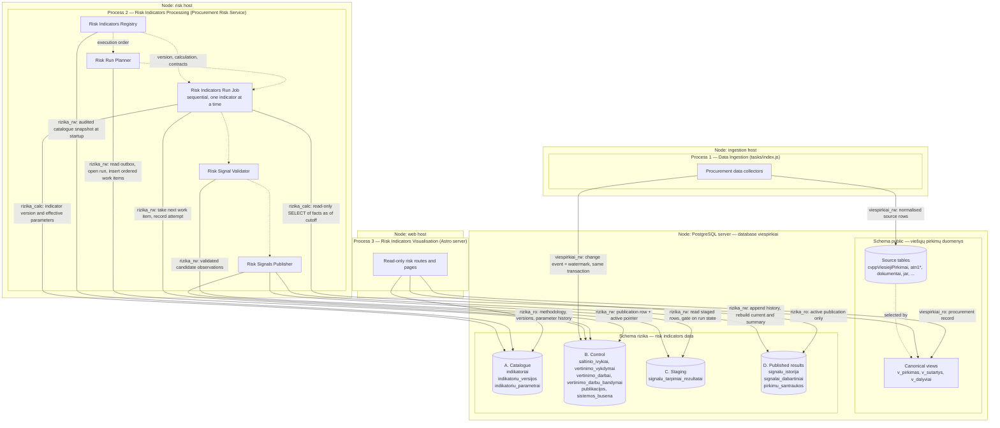
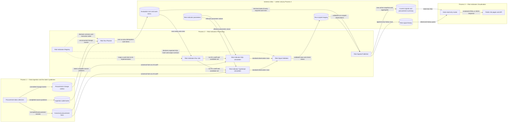
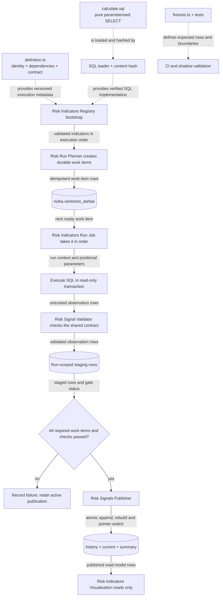
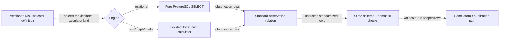

# Public procurement risk indicators: page, storage and maintenance draft

Status: detailed design draft

Date: 2026-08-11

Core methodology: [OCP 2024 Red Flags in Public Procurement](https://www.open-contracting.org/wp-content/uploads/2024/12/OCP2024-RedFlagProcurement.pdf)

Parent design: [Risk signals for current and recently completed procurements](risky-procurements-initial-design.md)

## 1. Decisions

1. Indicator results selected for publication are public and are displayed with their source facts, calculation, version and limitations.
2. The OCP code is retained for an OCP indicator, for example `R003`. A Lithuania-specific indicator gets an `LT` code, for example `LT001`; it must not be presented as an OCP indicator.
3. A public result is called a **risk signal** (`rizikos signalas`), not a finding of corruption or fraud.
4. There is no unexplained corruption probability. The list may have transparent **attention points** for sorting, while signal strength, evidence confidence and data coverage remain separate.
5. A **Risk Indicator** is a versioned package consisting of metadata, public explanation, parameters, calculation and tests.
6. A SQL Risk Indicator is a pure `SELECT`. It never contains its own `INSERT`, `UPDATE`, `DELETE`, table creation or transaction control.
7. Risk calculation is an independently deployed **Procurement Risk Service** backed by durable PostgreSQL control tables. The existing application task runner is not an architectural dependency.
8. PostgreSQL views provide canonical facts; they are not the persisted risk result and should not run the complete risk system during a web request.
9. The public Astro application is a read-only consumer of published read models. It never imports indicator code, starts evaluation work or calculates a signal in a request.
10. The design uses no separate analytics or orchestration platform. PostgreSQL provides durable coordination and computation; TypeScript provides the registry, execution, validation and operational control.
11. The system has exactly three processes with separate lifecycles and separate database roles: **Data Ingestion**, **Risk Indicators Processing** and **Risk Indicators Visualisation**. They exchange nothing but committed PostgreSQL rows.
12. Risk Indicators Processing is one **single sequential job**. It executes the applicable Risk Indicators one after another. Parallel workers, leases, fencing tokens and horizontal scaling are deliberately out of scope for this design; they can be added later without changing any stored contract described here.

The OCP guide describes an indicator through its definition, reason for being a red flag, required data, method, unit of analysis, procurement stage, example and source. The local indicator package preserves these fields and adds operational fields: implementation version, parameters, lifecycle state, owner, tests, public wording and known limitations.

### 1.1 The three processes

The concrete stack is **TypeScript + PostgreSQL**. Everything below is organised around three named processes. Each one has a single business purpose, its own deployment lifecycle, its own database role and its own failure mode. They never call each other; the only integration is committed PostgreSQL rows.

| # | Process | Business purpose | Deployed as | Writes | Reads |
|---|---|---|---|---|---|
| 1 | **Data Ingestion** | Populate the viešieji pirkimai data: fetch, normalise and version public procurement records | Existing task runner (`tasks/index.js`) | `public` schema source tables; `rizika` change outbox and ingestion watermarks | Public sources (CVP IS, CVPP, TED, JAR, documents) |
| 2 | **Risk Indicators Processing** | Execute every applicable Risk Indicator, one by one, and publish the result set atomically | **Procurement Risk Service** — one long-running Node process running one sequential job | `rizika` control, staging and published-result tables | `public` canonical views; `rizika` catalogue, parameters and control tables |
| 3 | **Risk Indicators Visualisation** | Show a procurement's risk signals, methodology and coverage to the public | Existing Astro web application | Nothing in `rizika` | `rizika` published results and catalogue, read-only; `public` procurement record |

What this separation buys:

- A broken ingestion refresh leaves the last successful publication visible, labelled with its older watermark.
- A failed indicator run leaves the last successful publication visible and changes nothing the public can see.
- A web deployment cannot mutate risk results, because its role has no write grant on `rizika`.
- Rewriting how an indicator calculates never touches ingestion or web code.

Process 2 supplies the operational guarantees normally expected from a data orchestrator — durable work items, ordered execution, retries, reconciliation, backfills, structured run history and publication gates — through an explicit PostgreSQL protocol rather than an in-memory task list or a web-process cron callback. It does **not** supply concurrency: exactly one run job executes at a time (see [§7.4](#74-durable-change-outbox-candidates-and-work-items)).

### 1.2 Deployment view

Outer boxes with a `Node:` prefix are deployment nodes (hosts). Inner boxes are the three processes and their components. Cylinders are storage areas — the two schemas of the existing `viespirkiai` database. Solid arrows leaving a process are database connections, labelled with the role used and what crosses the wire. Dotted arrows are in-process calls and stay inside one node.



Four database roles make the separation enforceable rather than conventional:

| Role | Used by | Grants |
|---|---|---|
| `viespirkiai_rw` | Process 1 | Read/write on `public`; `INSERT` on `rizika.saltinio_ivykiai` and the watermark table only |
| `rizika_calc` | Process 2, during a calculation | `SELECT` only, on `public` canonical views and `rizika` catalogue; used inside a read-only transaction with a statement timeout |
| `rizika_rw` | Process 2, for planning, staging and publication | Read/write on `rizika` control, staging and published results; no write grant on `public` |
| `rizika_ro` / `viespirkiai_ro` | Process 3 | `SELECT` on `rizika` published results and catalogue, and on `public` canonical views; nothing else |

#### 1.2.1 Storage areas

The `rizika` schema is deliberately split into four areas with different visibility and retention. Section 7 gives the full DDL.

| Area | Tables | Written by | Visible to visualisation | Retention |
|---|---|---|---|---|
| **A. Catalogue** | `indikatoriai`, `indikatoriu_versijos`, `indikatoriu_parametrai` | Migrations plus the Risk Indicators Registry snapshot at service startup; parameters by reviewed deployment | Yes — methodology page, version and threshold history | Forever; rows are closed, never edited |
| **B. Control** | `saltinio_ivykiai`, `vertinimo_vykdymai`, `vertinimo_kandidatai`, `vertinimo_darbai`, `vertinimo_darbu_bandymai`, `publikacijos`, `sistemos_busena` | Data Ingestion (outbox only) and Risk Indicators Processing | Only `publikacijos.duomenys_iki` and watermarks, for the freshness label | Rolling window; old attempts and consumed events are pruned |
| **C. Staging** | `signalu_tarpiniai_rezultatai` | Risk Indicators Processing | No — never queried by the web process | Deleted after the run publishes or is abandoned |
| **D. Published results** | `signalu_istorija`, `signalai_dabartiniai`, `pirkimu_santraukos` | Risk Signals Publisher only, in one transaction | Yes — this is the public read model | History forever; current and summary are rebuilt per publication |

The important property is the one-way flow **A + facts → B → C → D**. A calculation reads A and the `public` schema, plans through B, stages into C, and only a passing publication gate moves rows into D. Nothing the public can see is ever written by an indicator formula.

### 1.3 Data flow across the three processes

Solid arrows are runtime data flows; their labels name the data crossing the boundary. Dotted arrows are code or configuration dependencies. An arrow does not mean two components share a process — in particular, database rows are what cross between the ingestion, processing and visualisation processes.



### 1.4 Component definitions

Every component named above has one concrete role:

| Component | Process | Concrete form | Responsibility and boundary |
|---|---|---|---|
| Procurement data collectors | 1 | Existing scrapers and importers | Fetch and normalise public source data. In the same transaction as a source release, write a change event and advance the ingestion watermark only when that release is complete. They never calculate or publish risk signals. |
| Canonical procurement facts | 1 | PostgreSQL tables and views in `public` | Present procurements, notices, lots, bids, awards, contracts, buyers and suppliers with stable keys and `valid_from`/`valid_to` semantics. They are the reproducible facts read at `data_as_of`. |
| Procurement change outbox | 1 → 2 | Append-only table `rizika.saltinio_ivykiai` | Durably records which source entities changed. It is the hand-off from ingestion to risk planning and prevents a committed source change from being lost between processes. |
| Ingestion watermarks | 1 → 2 | PostgreSQL rows | Record the latest complete position and time per source. A run stores the watermarks it used, so the public freshness label and a later replay refer to the same source state. |
| Risk Indicator parameters | 2 | Effective-dated rows in `rizika.indikatoriu_parametrai` | Hold reviewed thresholds, method scopes, legal dates and exclusions separately from executable code. The run cutoff selects the applicable row; editing a parameter never silently rewrites historical results. |
| Risk Indicators Registry | 2 | Immutable in-process TypeScript catalogue, with an audited snapshot copied to PostgreSQL | Resolves `(indicator ID, version)` to one validated Risk Indicator: implementation, subject, lifecycle, inputs, dependencies, parameter contract, output contract and public methodology. It holds no procurement result rows and schedules nothing. Section 5 defines it precisely. |
| Risk Run Planner | 2 | TypeScript module inside the Procurement Risk Service | Consumes change events and watermarks, expands them into affected subjects, orders indicators by their declared prerequisites, and inserts idempotent work-item rows. It executes no formula. |
| Evaluation runs and work items | 2 | PostgreSQL control tables | Store queued/running/succeeded/failed work, retry history and run state. This is the recoverable coordination truth; an in-memory list is only an optimisation. |
| Risk Indicators Run Job | 2 | One sequential TypeScript loop, single instance guaranteed by an advisory lock | Takes the next ready work item in planned order, resolves the exact registry version, invokes the declared calculation with a run ID, cutoff and candidate set, and records the attempt outcome. It contains no indicator-specific branch and never runs two indicators at once. |
| Risk Indicator SQL calculation | 2 | Versioned `.sql` file executed by PostgreSQL | Performs the set-based formula as a read-only parameterised `SELECT` returning the standard observation shape. It cannot mutate risk or source tables. |
| Risk Indicator TypeScript calculation | 2 | Isolated TypeScript calculator module | Handles a calculation that genuinely does not fit relational SQL, such as document parsing or a graph algorithm. It receives the same execution context, returns the same observation contract, and does not publish. |
| Risk Signal Validator | 2 | Shared TypeScript validation module plus database permissions | Before execution, verifies the packaged SQL hash. After execution, validates field types, allowed states, subject and indicator identity, evidence size, duplicate keys and cross-row invariants. SQL safety comes from a read-only role, a read-only transaction and a timeout — not from keyword parsing. |
| Run-scoped staging | 2 | `rizika.signalu_tarpiniai_rezultatai`, keyed by run, indicator, version and subject | Holds validated candidate observations and gates them before publication. Rows are invisible to the visualisation process until the complete publication passes. |
| Risk Signals Publisher | 2 | Shared TypeScript module issuing indicator-independent PostgreSQL statements | Confirms every required work item and gate succeeded, appends immutable history, rebuilds current and summary rows and advances the singleton active-publication pointer in one short transaction. It contains no `if (indicatorId === ...)` logic. |
| Risk signal history | 2 → 3 | Append-only `rizika.signalu_istorija` | Preserves each published state, evidence, indicator and parameter version, source watermarks, run and `data_as_of` for audit and history queries. |
| Current signals and procurement summary | 2 → 3 | Current-pointer tables and denormalised read model | Expose only the active successful publication, with list-page counts, filters, ordering fields and current signal details. Failed or partial runs never replace them. |
| Astro read-only routes | 3 | Existing web application using a read-only role | Query only the published read models and catalogue, authorise no calculation work, and shape stable page and API responses. They do not import the registry. |
| Public risk pages and API | 3 | Browser-visible HTML and public JSON | Display the list, procurement detail and methodology with evidence, freshness and “signal is not proof” wording. They never receive control tables, credentials or private review notes. |

PostgreSQL `LISTEN/NOTIFY` may reduce polling latency between processes, but a notification is only a wake-up hint; the committed outbox and work-item rows are the durable truth.

## 2. Public information architecture

Use three connected pages:

| Route | Purpose |
|---|---|
| `/rizikos` | Find open and recently changed procurements with active signals |
| `/rizikos/pirkimas/:source/:id` | See all evidence and evaluated indicators for one procurement |
| `/rizikos/metodika` | Inspect the public indicator catalogue, formulas, versions and coverage |

The existing procurement page remains the authoritative procurement record. Risk pages link to it and to original CVP IS/CVPP documents rather than duplicating every field.

### 2.1 Main list page wireframe

All names and values below are fictional demonstration data.

```text
┌─────────────────────────────────────────────────────────────────────────────┐
│ Rizikos signalai viešuosiuose pirkimuose                    [Metodika]      │
│                                                                             │
│ Automatiniai indikatoriai padeda rasti pirkimus, kuriuos verta peržiūrėti.  │
│ Signalas nėra pažeidimo ar korupcijos įrodymas.                             │
│ [Kaip skaičiuojama]  Duomenys atnaujinti 2026-08-10 19:05                  │
├─────────────────────────────────────────────────────────────────────────────┤
│ [Atviri dabar 1 284] [Neseniai pasibaigę] [Pakeistos sutartys]              │
│                                                                             │
│ 143 su bent vienu signalu  ·  22 nauji per 24 val.  ·  5 aktyvūs rodikliai │
├───────────────┬─────────────────────────────────────────────────────────────┤
│ FILTRAI       │ Rikiuoti: [Dėmesio prioritetas ▼]                           │
│               │                                                             │
│ Signalo grupė │ ┌─────────────────────────────────────────────────────────┐ │
│ □ Konkurencija│ │ 3 signalai · terminas po 14 val.                       │ │
│ □ Skaidrumas  │ │ Mokyklų maitinimo paslaugos (demonstracinis pavyzdys)  │ │
│ □ Procedūra   │ │ Pirkėjas: Pavyzdžio miesto administracija              │ │
│ □ Tiekėjas    │ │ Atviras konkursas · paslaugos · 55500000 · €480 000    │ │
│ □ Sutartis    │ │ Paskelbta 2026-08-06 · terminas 2026-08-11 09:00       │ │
│               │ │                                                         │ │
│ Etapas        │ │ R003  Trumpas pasiūlymų pateikimo terminas             │ │
│ □ Atviras     │ │       4,8 dienos; taikoma riba 10 dienų                │ │
│ □ Vertinamas  │ │ LT002 Pirkimas neskaidomas į dalis                     │ │
│ □ Sutartis    │ │       €480 tūkst.; 1 dalis; panašių pirkimų mediana 4  │ │
│               │ │ LT004 Dokumentai pakeisti arti termino                 │ │
│ Vertė         │ │       2 dokumentai pakeisti likus mažiau nei 24 val.   │ │
│ [nuo] [iki]   │ │                                                         │ │
│               │ │ Duomenų pakankamumas: 6 iš 7 rodiklių įvertinti        │ │
│ BVPŽ          │ │ [Peržiūrėti signalus] [Atverti pirkimą]                │ │
│ Pirkėjas      │ └─────────────────────────────────────────────────────────┘ │
│ Būdas         │                                                             │
│ Šaltinis      │ ┌─────────────────────────────────────────────────────────┐ │
│               │ │ 1 signalas · pasiūlymų teikimas                        │ │
│ [Išvalyti]    │ │ ...                                                     │ │
└───────────────┴─────────────────────────────────────────────────────────────┘
```

### 2.2 Header and aggregate numbers

The header establishes interpretation before showing results. It contains:

- a one-sentence purpose;
- a permanent “signal is not proof” statement;
- latest source watermark, not merely the web page generation time;
- link to the public methodology;
- counts calculated from the same current read model as the results.

Do not headline “143 risky procurements”. Use “143 procurements with at least one active signal”.

Tabs are lifecycle scopes, not separate databases:

- **Atviri dabar**: future bid deadline;
- **Neseniai pasibaigę**: deadline or award in the selected recent period;
- **Pakeistos sutartys**: newly signed or materially changed contracts.

### 2.3 Result card

The result card answers five questions in order:

1. **What is it?** Title, buyer, method, CPV, value and dates.
2. **Why is it here?** Triggered indicator names.
3. **What was observed?** Raw value and threshold/comparison in one sentence.
4. **How complete is the evaluation?** Evaluated/applicable/insufficient counts.
5. **Where is the evidence?** Detail page and original procurement.

Each indicator line uses the stable code (`R003`) and short public name. Severity may control a left border or icon, but color is supplementary and accessible text remains mandatory.

Do not show every stored evidence field on the card. Show the decisive fact and comparison; the full calculation belongs on the detail page.

### 2.4 Filtering and sorting

Recommended URL-backed filters:

- lifecycle scope and event-date interval;
- OCP/local indicator ID;
- signal family and severity;
- buyer and supplier, when known;
- procurement method and object type;
- CPV prefix;
- value interval;
- EU funding;
- source;
- evaluation coverage (`complete`, `partial`, `insufficient`);
- data freshness.

Sort options:

- attention priority, descending (default);
- nearest deadline;
- most recently published/changed;
- largest value;
- most signals;
- lowest data coverage, useful for transparency monitoring.

Attention priority is a work-ordering device. The UI must not label it “corruption risk 82%”.

## 3. Procurement risk detail page

The detail page should make a public result independently understandable.

```text
Mokyklų maitinimo paslaugos (demonstracinis pavyzdys)
Pasiūlymų teikimas · CVP IS 7000000

3 aktyvūs signalai                          Duomenys iki 2026-08-10 19:05
7 taikomi indikatoriai: 6 įvertinti, 1 nepakanka duomenų

Pirkimo eiga
● 08-06 paskelbta ── ● 08-10 pakeisti dokumentai ── ○ 08-11 terminas

R003 · Trumpas pasiūlymų pateikimo terminas
┌────────────────────────────────────────────────────────────────────┐
│ Ką matome                                                        │
│ Nuo paskelbimo iki termino: 4,8 kalendorinės dienos.             │
│                                                                  │
│ Kaip skaičiuota                                                  │
│ 2026-08-11 09:00 − 2026-08-06 13:48 = 4,8 dienos.                │
│ Šiam būdui taikytas parametras: 10 dienų.                        │
│                                                                  │
│ Kontekstas                                                       │
│ To paties būdo ir CPV grupės mediana: 10,8 dienos (n=842).       │
│                                                                  │
│ Šaltiniai                                                        │
│ CVP IS skelbimas · pirkimo duomenys · nuskaityta 19:05           │
│                                                                  │
│ Apribojimai                                                      │
│ Pagreitinta procedūra ar teisėta išimtis gali paaiškinti terminą.│
│                                                                  │
│ Metodika: R003, vietinė versija 2 · aktyvi nuo 2026-07-01        │
└────────────────────────────────────────────────────────────────────┘

[Kiti aktyvūs signalai]
[Įvertinti, bet nesuveikę indikatoriai (3)]
[Nepakanka duomenų (1)]
```

### 3.1 Signal explanation contract

Every public signal expands to the same sections:

- **Ką matome** — plain-language observation;
- **Kaip skaičiuota** — formula with this procurement's values;
- **Riba arba palyginimas** — the exact effective parameter or peer population;
- **Kontekstas** — comparison sample, if relevant;
- **Šaltiniai** — links, identifiers and data-as-of time;
- **Apribojimai** — common legitimate explanations and known data gaps;
- **Metodika** — indicator ID, implementation version and parameter version.

The page renders these fields from structured evidence. Indicator code must not construct arbitrary HTML.

### 3.2 Non-triggered and unavailable indicators

The detail page should disclose evaluation coverage without overwhelming the user:

- collapsed **“Įvertinti, signalas nenustatytas”** section;
- visible **“Nepakanka duomenų”** count, with missing fields after expansion;
- `not_applicable` indicators omitted from the main count but visible in methodology/debug information if needed;
- calculation errors never converted to `insufficient_data`; show a temporary data-processing notice and alert maintainers.

This prevents the public from interpreting absent signals as a comprehensive clean bill of health.

### 3.3 Change history

When a signal appears, changes or disappears, show a short history:

```text
2026-08-10 19:05  LT004 appeared after a new document version was observed
2026-08-09 18:10  R003 recalculated: deadline extended from 3.8 to 4.8 days
2026-08-06 14:02  First evaluation completed
```

The history is derived from immutable signal observations, not reconstructed from logs.

## 4. Public methodology catalogue

`/rizikos/metodika` makes the system inspectable. It contains:

- link and citation to the OCP core document;
- explanation of `triggered`, `not_triggered`, `insufficient_data` and `not_applicable`;
- searchable indicator catalogue;
- active, shadow and retired versions;
- calculation and parameter history;
- coverage and trigger-rate statistics by year/method/CPV where samples are safe;
- known source limitations and freshness;
- change log.

Example catalogue row:

| ID | Public name | Stage | Unit | Active version | Coverage, 30 d. | Trigger rate | Updated |
|---|---|---|---|---:|---:|---:|---|
| R003 | Trumpas pasiūlymų pateikimo terminas | Tender | Procurement | 2 | 98.9% | 7.4% | 2026-07-01 |

Opening it shows the original OCP definition, the local profile, required data, exact SQL-style formula, exclusions, parameters, example, limitations, owner and validation date.

## 5. What exactly is one Risk Indicator?

A **Risk Indicator** is the policy concept and reproducible test that turns public procurement facts into one of four states: `triggered`, `not_triggered`, `insufficient_data` or `not_applicable`. It is not one database statement and it is not the result row. Its maintained implementation is a small versioned package:

```text
Risk Indicator R003 v2
├── definition: identity, contracts and metadata
├── public Lithuanian explanation and limitations
├── required inputs, dependencies and applicability rules
├── effective-dated parameter contract
├── calculation implementation
│   └── normally one pure SQL SELECT
├── shared observation output contract
├── deterministic fixtures and expectations
└── review, lifecycle and code-hash metadata
```

Recommended repository files:

```text
modules/rizika/indikatoriai/R003/
  definition.ts            # identity, dependencies, contracts and public wording
  calculate.sql            # pure, parameterised SELECT
  fixtures.ts              # deterministic edge cases
  calculate.test.ts        # output and boundary tests
modules/rizika/
  contracts.ts             # shared observation and run contracts
  registry.ts              # explicit imports of every Risk Indicator version
  sqlLoader.ts             # loads and hashes packaged SQL at process start
services/procurement-risk/
  index.ts                 # Procurement Risk Service entry point and single-instance lock
  planner.ts               # change outbox -> durable work items
  runJob.ts                # sequential execution of Risk Indicators, retries
  validate.ts              # runtime output and cross-row checks
  publish.ts               # generic atomic publication
  reconcile.ts             # repairs abandoned or missed work
migrations/rizika/
  catalogue.sql            # indicators, versions and parameters
  control.sql              # outbox, runs, work items, attempts and publications
  storage.sql              # history, current pointers and public summaries
```

### 5.1 The Risk Indicator and the Risk Indicators Registry

A **Risk Indicator definition** is a read-only TypeScript object conforming to the shared `RiskIndicator` contract. It describes how one exact indicator version is planned, executed, validated, explained and audited. It is metadata and executable wiring around the formula; it is neither the formula's observation rows nor a class with its own scheduler or persistence methods.

The definition is written in TypeScript regardless of what language the formula uses. R003 has a TypeScript definition while its actual calculation remains a PostgreSQL `SELECT` in `calculate.sql`.

Expressing the definition as a checked TypeScript type gives two layers of protection:

1. **Compile-time checks** reject missing fields, misspelled lifecycle, stage or state literals and incompatible calculator or parameter types during development and CI.
2. **Startup runtime checks** reject problems the compiler cannot see: duplicate IDs, unresolved or cyclic indicator dependencies, an unreadable SQL file, a changed SQL content hash, invalid database-loaded parameters, or public text that violates the required contract.

The **Risk Indicators Registry** is the immutable, explicitly constructed in-process catalogue of every deployed Risk Indicator definition. Its key is `(indicator_id, implementation_version)`. Given that key, the Risk Run Planner or the Risk Indicators Run Job retrieves exactly one validated definition. The registry also answers which version is `active`, `shadow` or `retired`, and in which order the indicators must execute.

The registry is deliberately not:

- a table of calculated signals;
- arbitrary TypeScript files discovered by scanning a directory at runtime;
- an admin-editable formula store;
- the work queue or scheduler;
- the visualisation process's source of results.

The repository definition files are the executable source of truth. When the Procurement Risk Service starts, `createRiskIndicatorRegistry` validates them and calculates a deterministic registry and SQL hash. Each run stores that hash, and an audit snapshot of the definitions is copied to the `rizika` catalogue for methodology and history display. PostgreSQL does not reconstruct executable definitions from that snapshot.

Keep three dependency concepts separate:

| Definition field | Meaning | Affects execution order? |
|---|---|---:|
| `indicatorDependencies` | Results or baseline output of another named indicator version must exist first | Yes — the run job executes prerequisites earlier in the same run |
| `sourceRelations` | Canonical PostgreSQL facts the calculation reads | No; ingestion watermarks control readiness |
| `parameterSet` | Effective-dated policy values selected at `data_as_of` | No; a changed parameter creates affected work items |

Because execution is sequential, `indicatorDependencies` is simply a topological sort applied once by the planner: the run job walks the resulting list in order and stops the run if a prerequisite failed.

### 5.2 Example Risk Indicator definition and registry

This abbreviated example shows the contracts, one definition, explicit registration and lookup. The shared runtime contracts validate values that cross a trust boundary, including rows returned by PostgreSQL.

```ts
type IndicatorLifecycle = 'active' | 'shadow' | 'retired';
type IndicatorStage = 'planning' | 'tender' | 'award' | 'contract';
type IndicatorState =
  | 'triggered'
  | 'not_triggered'
  | 'insufficient_data'
  | 'not_applicable';

type RuntimeContract<T> = Readonly<{
  validate(value: unknown): T;
}>;

type RiskIndicatorKey = Readonly<{
  id: `R${number}` | `LT${number}`;
  version: number;
}>;

type RiskObservationV1 = Readonly<{
  indicatorId: RiskIndicatorKey['id'];
  indicatorVersion: number;
  subjectType: 'procurement';
  subjectKey: string;
  state: IndicatorState;
  rawValue: number | null;
  thresholdValue: number | null;
  evidence: Readonly<Record<string, unknown>>;
  dataAsOf: string;
}>;

type R003Parameters = Readonly<{
  minimumDays: number;
  methods: readonly string[];
}>;

type SqlRiskIndicator<P> = Readonly<{
  key: RiskIndicatorKey;
  engine: 'sql';
  lifecycle: IndicatorLifecycle;
  subjectType: 'procurement';
  stage: IndicatorStage;
  owner: string;
  indicatorDependencies: readonly RiskIndicatorKey[];
  sourceRelations: readonly string[];
  requiredInputs: readonly string[];
  parameterSet: Readonly<{
    id: string;
    runtimeContract: RuntimeContract<P>;
  }>;
  calculation: Readonly<{
    sqlFile: string;
  }>;
  outputContract: RuntimeContract<RiskObservationV1>;
  standard: Readonly<{ name: string; url: string }>;
  public: Readonly<{ titleLt: string; limitationLt: string }>;
}>;

type TypeScriptRiskIndicator<P> = Readonly<
  Omit<SqlRiskIndicator<P>, 'engine' | 'calculation'> & {
    engine: 'typescript';
    calculation: Readonly<{ module: string; exportName: string }>;
  }
>;

type RiskIndicator =
  | SqlRiskIndicator<unknown>
  | TypeScriptRiskIndicator<unknown>;

export const R003v2 = defineSqlRiskIndicator<R003Parameters>({
  key: { id: 'R003', version: 2 },
  engine: 'sql',
  lifecycle: 'shadow',
  owner: 'procurement-risk',
  subjectType: 'procurement',
  stage: 'tender',
  indicatorDependencies: [],
  sourceRelations: ['rizika.v_pirkimo_gyvavimo_ciklo_versijos'],
  requiredInputs: ['publicationDate', 'submissionDeadline', 'procurementMethod'],
  parameterSet: {
    id: 'R003/v2',
    runtimeContract: r003ParametersContract,
  },
  calculation: { sqlFile: './calculate.sql' },
  outputContract: riskObservationV1Contract,
  standard: {
    name: 'OCP Red Flags in Public Procurement 2024',
    url: 'https://www.open-contracting.org/wp-content/uploads/2024/12/OCP2024-RedFlagProcurement.pdf',
  },
  public: {
    titleLt: 'Trumpas pasiūlymų pateikimo terminas',
    limitationLt: 'Trumpesnį laiką gali teisėtai paaiškinti pagreitinta procedūra ar kita išimtis.',
  },
});

// registry.ts: registration is explicit and reviewable in a pull request.
const deployedIndicators = [
  R003v2,
  LT002v1,
] as const satisfies readonly RiskIndicator[];

export const riskIndicatorRegistry = createRiskIndicatorRegistry(deployedIndicators);

// runJob.ts: a durable work item identifies the exact implementation to execute.
const indicator = riskIndicatorRegistry.require({ id: item.indicatorId, version: item.version });
```

`defineSqlRiskIndicator` freezes and type-checks one definition. `createRiskIndicatorRegistry` performs cross-definition and filesystem/hash validation once at startup and exposes read-only lookup methods such as `require`, `activeVersions`, `executionOrder` and `dependentsOf`. The Risk Indicators Run Job is generic: after lookup it uses `indicator.engine`, `indicator.calculation` and `indicator.outputContract`; adding R003 does not add a `switch ('R003')` branch to the run job.

`RuntimeContract<T>` is a small project-owned interface with a `validate(unknown): T` operation; it is not a third-party product. Stable stage, lifecycle, state and subject values are TypeScript unions backed by those runtime checks. The real shared `RiskObservationV1` contract includes the columns shown in the SQL example below. Public text is versioned and reviewed. The web application does not derive explanations from SQL column names.

### 5.3 Example SQL calculation

The SQL file is one parameterised, read-only `SELECT`. `$1` is the evaluation run ID and `$2` is the reproducible `data_as_of` cutoff. Candidates are prepared generically from source changes; the Risk Indicator never decides its own scheduling or writes its result.

```sql
WITH candidates AS (
    SELECT p.*
    FROM rizika.v_pirkimo_gyvavimo_ciklo_versijos p
    JOIN rizika.vertinimo_kandidatai k
      ON k.vykdymo_id = $1::uuid
     AND k.subjekto_tipas = 'procurement'
     AND k.subjekto_raktas = p.subjekto_raktas
    WHERE p.galioja_nuo <= $2::timestamptz
      AND (p.galioja_iki IS NULL OR p.galioja_iki > $2::timestamptz)
), parameters AS (
    SELECT prm.*
    FROM rizika.indikatoriu_parametrai prm
    WHERE prm.indikatoriaus_id = 'R003'
      AND prm.indikatoriaus_versija = 2
      AND $2::date >= prm.galioja_nuo
      AND (prm.galioja_iki IS NULL OR $2::date < prm.galioja_iki)
), evaluated AS (
    SELECT c.*,
           p.id AS parametru_rinkinys_id,
           (p.parametrai->>'minimumDays')::numeric AS minimum_days,
           EXTRACT(EPOCH FROM (c.terminas - c.paskelbta)) / 86400.0 AS submission_days
    FROM candidates c
    LEFT JOIN parameters p
      ON p.taikymo_sritis->'methods' ? c.pirkimo_budas
)
SELECT 'R003'::text AS indicator_id,
       2::integer AS indicator_version,
       'procurement'::text AS subject_type,
       subjekto_raktas AS subject_key,
       pirkimo_saltinis AS procurement_source,
       pirkimo_id AS procurement_id,
       CASE
           WHEN minimum_days IS NULL THEN 'not_applicable'
           WHEN paskelbta IS NULL OR terminas IS NULL THEN 'insufficient_data'
           WHEN submission_days < minimum_days THEN 'triggered'
           ELSE 'not_triggered'
       END::text AS state,
       submission_days::numeric AS raw_value,
       minimum_days::numeric AS threshold_value,
       parametru_rinkinys_id,
       jsonb_build_object(
           'publicationDate', paskelbta,
           'submissionDeadline', terminas,
           'method', pirkimo_budas
       ) AS evidence,
       $2::timestamptz AS data_as_of
FROM evaluated;
```

The calculation role has `SELECT` only, and the run job also starts a read-only transaction with a statement timeout. Correctness does not depend on trying to parse SQL text for forbidden keywords. Business-day counting, when required, is one shared tested PostgreSQL function backed by an effective-dated Lithuanian calendar.

### 5.4 How the TypeScript and SQL files interact



Runtime sequence for one source update, across the three processes:

```mermaid
sequenceDiagram
    participant S as Process 1 — Data Ingestion
    participant P as PostgreSQL (public + rizika)
    participant E as Process 2 — Procurement Risk Service
    participant Q as Risk Indicator calculation
    participant A as Process 3 — Astro visualisation

    S->>P: Commit source rows, change event and watermark together
    E->>P: Read change outbox, open a run, plan work items in indicator order
    loop one Risk Indicator at a time
        E->>P: Take the next ready work item and record the attempt
        E->>Q: Execute the calculation with run ID and data_as_of
        Q->>P: Read canonical facts and effective parameters
        Q-->>E: Return standardised observation rows
        E->>P: Validate and write run-scoped staging rows
    end
    alt the run job crashes or validation fails
        P-->>E: Reconciliation reopens the abandoned run; retry or fail after the attempt limit
        A->>P: Continue reading the last successful publication
    else every required work item succeeded
        E->>P: Append history, rebuild current and summary, move the pointer in one transaction
        A->>P: Read the new active publication
    end
```

`definition.ts` tells the service which SQL belongs to R003 and what contract it must return. The shared run job loads and executes it. The SQL calculates only; TypeScript validates and persists through generic code. Astro may share public response types, but it never imports the Risk Indicators Registry.

### 5.5 Why a Risk Indicator does not write its result

Keeping calculation and persistence separate gives:

- safe preview and `EXPLAIN` without data mutation;
- repeatable backtests with an `as_of` date;
- database-enforced read-only calculation permissions;
- one output validator and publication transaction strategy;
- consistent current/history semantics;
- easier comparison of old and new versions;
- no half-written results if indicator N of M fails;
- the same execution path in CI, shadow, backfill and production.

The Risk Signals Publisher owns history and current persistence. It accepts validated run-scoped staging rows and contains no formula branch keyed by indicator ID. No maintainer writes indicator-specific `INSERT` or `UPDATE` statements when adding a Risk Indicator.

## 6. Choosing SQL, TypeScript or a PostgreSQL function

| Calculation shape | Implementation | Example |
|---|---|---|
| Relational filters, joins, windows and aggregates | Pure SQL `SELECT` | R003 short deadline, R018 single bid, R040 buyer share |
| Reusable canonical field mapping | PostgreSQL view | unified procurement and bidder facts |
| Stable shared database primitive | SQL/PG function | business days between dates, effective parameter lookup |
| Indicator identity, dependencies, contract and public metadata | Risk Indicator definition in TypeScript | every Risk Indicator |
| Scheduling, ordering, retries and backfills | Procurement Risk Service + PostgreSQL control tables | every evaluation run |
| Document parsing, OCR evidence spans, embeddings or model inference | Isolated TypeScript calculator | restrictive specification text |
| Graph algorithm awkward/slow in SQL | Isolated TypeScript graph calculator | bid rotation/community features |
| Result persistence and history | Risk Signals Publisher, optionally one small atomic DB function | all Risk Indicators |

### 6.1 Default: TypeScript definition plus SQL SELECT

This should cover most OCP indicators and is the easiest form to review. SQL is set-based and executes close to PostgreSQL data. TypeScript supplies the definition, dependencies and runtime contract. The Procurement Risk Service supplies durable operational control.

### 6.2 TypeScript calculator

A TypeScript Risk Indicator implements the same logical interface:

```ts
type RiskIndicatorCalculator = (
  context: EvaluationContext,
  subjects: SubjectRef[],
) => Promise<RiskObservationV1[]>;
```

It returns the same observation schema to the shared validator and writes only through the same run-scoped staging/publishing path. Its evidence must contain source references and, for text analysis, exact document/page/span evidence suitable for public verification. Engine choice is metadata, not a public-data contract change.



### 6.3 PostgreSQL functions

Do not create one PG function per Risk Indicator. A function is justified only when:

- several indicators need exactly the same stable primitive;
- its inputs and output are small and deterministic;
- it is independently tested and version-controlled through a migration;
- it does not hide source-table access or use `SECURITY DEFINER` without a specific security review.

PG procedures/functions are deployment artefacts, not the indicator catalogue or maintenance UI.

## 7. Database schema draft

The following draft is intentionally explicit. Names can be adjusted before migration, but the separation of stable identity, implementation version, parameters, runs, immutable observations and current pointers should remain. Sections 7.1–7.2 are storage area **A. Catalogue**, 7.3–7.4 are **B. Control** and **C. Staging**, and 7.5–7.7 are **D. Published results** as introduced in [§1.2.1](#121-storage-areas).

### 7.1 Indicator identity and versions

```sql
CREATE SCHEMA rizika;

CREATE TABLE rizika.indikatoriai (
    id text PRIMARY KEY,
    standarto_tipas text NOT NULL CHECK (standarto_tipas IN ('ocp_2024', 'local')),
    standarto_url text,
    originalus_pavadinimas text,
    rizikos_grupe text NOT NULL,
    etapas text NOT NULL CHECK (
        etapas IN ('planning', 'tender', 'award', 'contract', 'implementation')
    ),
    subjekto_tipas text NOT NULL CHECK (
        subjekto_tipas IN ('procurement', 'lot', 'bidder', 'supplier', 'buyer', 'market', 'contract')
    ),
    savininkas text NOT NULL,
    sukurta_at timestamptz NOT NULL DEFAULT now(),
    panaikinta_at timestamptz,
    CHECK (
        (standarto_tipas = 'ocp_2024' AND id ~ '^R[0-9]{3}$')
        OR (standarto_tipas = 'local' AND id ~ '^LT[0-9]{3}$')
    )
);

CREATE TABLE rizika.indikatoriu_versijos (
    indikatoriaus_id text NOT NULL REFERENCES rizika.indikatoriai(id),
    versija integer NOT NULL CHECK (versija > 0),
    busena text NOT NULL CHECK (busena IN ('draft', 'shadow', 'active', 'retired')),
    variklis text NOT NULL CHECK (variklis IN ('sql', 'typescript')),
    kodo_kelias text NOT NULL,
    kodo_hash text NOT NULL,
    viesas_pavadinimas text NOT NULL,
    viesas_aprasymas text NOT NULL,
    viesas_apribojimas text NOT NULL,
    formule text NOT NULL,
    privalomi_duomenys jsonb NOT NULL,
    taikymo_taisykles jsonb NOT NULL,
    parametru_schema jsonb NOT NULL,
    ocp_puslapis integer,
    pakeitimu_aprasymas text NOT NULL,
    patvirtino text,
    patvirtinta_at timestamptz,
    aktyvi_nuo timestamptz,
    aktyvi_iki timestamptz,
    sukurta_at timestamptz NOT NULL DEFAULT now(),
    PRIMARY KEY (indikatoriaus_id, versija)
);

CREATE UNIQUE INDEX indikatoriu_viena_aktyvi_versija_idx
ON rizika.indikatoriu_versijos (indikatoriaus_id)
WHERE busena = 'active';
```

### 7.2 Effective-dated parameters

```sql
CREATE TABLE rizika.indikatoriu_parametrai (
    id bigint GENERATED ALWAYS AS IDENTITY PRIMARY KEY,
    indikatoriaus_id text NOT NULL,
    indikatoriaus_versija integer NOT NULL,
    pavadinimas text NOT NULL,
    taikymo_sritis jsonb NOT NULL,
    parametrai jsonb NOT NULL,
    galioja_nuo date NOT NULL,
    galioja_iki date,
    saltinis text NOT NULL,
    patvirtino text NOT NULL,
    patvirtinta_at timestamptz NOT NULL,
    sukurta_at timestamptz NOT NULL DEFAULT now(),
    FOREIGN KEY (indikatoriaus_id, indikatoriaus_versija)
        REFERENCES rizika.indikatoriu_versijos(indikatoriaus_id, versija),
    CHECK (galioja_iki IS NULL OR galioja_iki > galioja_nuo)
);

CREATE INDEX indikatoriu_parametrai_lookup_idx
ON rizika.indikatoriu_parametrai
    (indikatoriaus_id, indikatoriaus_versija, galioja_nuo, galioja_iki);
```

Registry/deployment validation must reject overlapping parameter scopes and validate `parametrai` against the version's `parametru_schema`. Legal threshold changes normally create a new parameter row, not a new calculation version.

### 7.3 Evaluation runs and publications

```sql
CREATE TABLE rizika.vertinimo_vykdymai (
    id uuid PRIMARY KEY DEFAULT gen_random_uuid(),
    priezastis text NOT NULL CHECK (
        priezastis IN ('source_change', 'parameter_change', 'backfill', 'reconciliation', 'manual')
    ),
    data_as_of timestamptz NOT NULL,
    saltiniu_watermarks jsonb NOT NULL,
    pradeta_at timestamptz NOT NULL DEFAULT now(),
    baigta_at timestamptz,
    busena text NOT NULL CHECK (busena IN ('running', 'succeeded', 'partial', 'failed')),
    kandidatu_skaicius integer NOT NULL DEFAULT 0,
    rezultatu_skaiciai jsonb,
    kodo_commit text,
    klaida text
);

CREATE TABLE rizika.publikacijos (
    id uuid PRIMARY KEY DEFAULT gen_random_uuid(),
    vykdymo_id uuid NOT NULL REFERENCES rizika.vertinimo_vykdymai(id),
    registry_hash text NOT NULL,
    duomenys_iki timestamptz NOT NULL,
    saltiniu_watermarks jsonb NOT NULL,
    busena text NOT NULL CHECK (busena IN ('building', 'published', 'rejected', 'superseded')),
    sukurta_at timestamptz NOT NULL DEFAULT now(),
    paskelbta_at timestamptz
);

CREATE TABLE rizika.sistemos_busena (
    singleton boolean PRIMARY KEY DEFAULT true CHECK (singleton),
    aktyvios_publikacijos_id uuid REFERENCES rizika.publikacijos(id),
    atnaujinta_at timestamptz NOT NULL DEFAULT now()
);
```

One planner cycle creates exactly one run, and that run holds one work item per applicable Risk Indicator. Per-indicator counts in `rezultatu_skaiciai` keep failures attributable without a second run level. Only a successful publication transaction changes the singleton active-publication pointer.

### 7.4 Durable change outbox, candidates and work items

Data Ingestion writes its data changes and one outbox row in the same transaction. The Risk Run Planner consumes the outbox idempotently and creates evaluation runs, candidate subjects and work items. A work item is one `(run, Risk Indicator version)` unit of execution; the Risk Indicators Run Job processes them strictly one at a time, in the order the planner assigned.

```sql
CREATE TABLE rizika.saltinio_ivykiai (
    id bigint GENERATED ALWAYS AS IDENTITY PRIMARY KEY,
    idempotency_key text NOT NULL UNIQUE,
    saltinis text NOT NULL,
    objekto_tipas text NOT NULL,
    objekto_raktas text NOT NULL,
    ivykio_tipas text NOT NULL,
    source_watermark jsonb NOT NULL,
    ivykis_at timestamptz NOT NULL,
    suplanuota_at timestamptz
);

CREATE TABLE rizika.vertinimo_kandidatai (
    vykdymo_id uuid NOT NULL REFERENCES rizika.vertinimo_vykdymai(id),
    subjekto_tipas text NOT NULL,
    subjekto_raktas text NOT NULL,
    priezasties_ivykio_id bigint REFERENCES rizika.saltinio_ivykiai(id),
    PRIMARY KEY (vykdymo_id, subjekto_tipas, subjekto_raktas)
);

CREATE TABLE rizika.vertinimo_darbai (
    id uuid PRIMARY KEY DEFAULT gen_random_uuid(),
    vykdymo_id uuid NOT NULL REFERENCES rizika.vertinimo_vykdymai(id),
    idempotency_key text NOT NULL UNIQUE,
    darbo_tipas text NOT NULL CHECK (
        darbo_tipas IN ('baseline', 'indicator', 'validate', 'publish', 'reconcile')
    ),
    indikatoriaus_id text,
    indikatoriaus_versija integer,
    eiles_nr integer NOT NULL,
    payload jsonb NOT NULL,
    busena text NOT NULL CHECK (
        busena IN ('queued', 'running', 'succeeded', 'failed', 'dead')
    ),
    bandymas integer NOT NULL DEFAULT 0,
    max_bandymu integer NOT NULL DEFAULT 5,
    vykdyti_ne_anksciau timestamptz NOT NULL DEFAULT now(),
    pradeta_at timestamptz,
    baigta_at timestamptz,
    paskutine_klaida text,
    sukurta_at timestamptz NOT NULL DEFAULT now(),
    UNIQUE (vykdymo_id, eiles_nr)
);

CREATE TABLE rizika.vertinimo_darbu_bandymai (
    darbo_id uuid NOT NULL REFERENCES rizika.vertinimo_darbai(id),
    bandymas integer NOT NULL,
    busena text NOT NULL CHECK (busena IN ('running', 'succeeded', 'failed', 'abandoned')),
    pradeta_at timestamptz NOT NULL,
    baigta_at timestamptz,
    metrikos jsonb,
    klaida text,
    PRIMARY KEY (darbo_id, bandymas)
);

CREATE INDEX vertinimo_darbai_kitas_idx
ON rizika.vertinimo_darbai (vykdymo_id, eiles_nr)
WHERE busena = 'queued';

CREATE TABLE rizika.signalu_tarpiniai_rezultatai (
    vykdymo_id uuid NOT NULL REFERENCES rizika.vertinimo_vykdymai(id),
    darbo_id uuid NOT NULL REFERENCES rizika.vertinimo_darbai(id),
    indikatoriaus_id text NOT NULL,
    indikatoriaus_versija integer NOT NULL,
    subjekto_tipas text NOT NULL,
    subjekto_raktas text NOT NULL,
    pirkimo_saltinis text,
    pirkimo_id text,
    busena text NOT NULL CHECK (
        busena IN ('triggered', 'not_triggered', 'insufficient_data', 'not_applicable', 'calculation_error')
    ),
    neapdorota_reiksme jsonb,
    riba jsonb,
    parametru_rinkinys_id bigint REFERENCES rizika.indikatoriu_parametrai(id),
    irodymai jsonb NOT NULL,
    trukstami_duomenys jsonb,
    duomenys_iki timestamptz NOT NULL,
    patikrinta_at timestamptz NOT NULL,
    PRIMARY KEY (
        vykdymo_id, indikatoriaus_id, indikatoriaus_versija,
        subjekto_tipas, subjekto_raktas
    )
);
```

`eiles_nr` is the execution order the planner derived from the Risk Indicators Registry, so prerequisites always carry a lower number than their dependants. The Risk Indicators Run Job takes the lowest-numbered `queued` item of the open run, marks it `running`, increments `bandymas`, executes it, and commits the validated staging rows together with the transition to `succeeded` in one short transaction. Execution itself happens outside that transaction. If an item exhausts `max_bandymu`, the run ends without publishing and the previous publication stays active.

Two rules keep this safe without any concurrency control:

1. **One process, one run.** The Procurement Risk Service holds a session-level `pg_advisory_lock` for the whole service. A second instance that starts by accident cannot take work; it logs and exits. There are therefore no leases, heartbeats, fencing tokens or `SKIP LOCKED` claims in this design.
2. **At-least-once, made harmless.** A crash mid-execution leaves an item `running`. Reconciliation at the next service start marks such attempts `abandoned` and requeues the item. Unique idempotency keys, the staging primary key and atomic publication make a repeated execution produce the same result.

Parallel execution is the obvious later optimisation, and the schema is prepared for it — reintroducing it means adding lease columns and a claim query, not changing the catalogue, staging or published-result contracts.

### 7.5 Immutable signal observations

```sql
CREATE TABLE rizika.signalu_istorija (
    id bigint GENERATED ALWAYS AS IDENTITY PRIMARY KEY,
    vykdymo_id uuid NOT NULL REFERENCES rizika.vertinimo_vykdymai(id),
    publikacijos_id uuid NOT NULL REFERENCES rizika.publikacijos(id),
    indikatoriaus_id text NOT NULL,
    indikatoriaus_versija integer NOT NULL,
    parametru_rinkinys_id bigint REFERENCES rizika.indikatoriu_parametrai(id),
    subjekto_tipas text NOT NULL,
    subjekto_raktas text NOT NULL,
    pirkimo_saltinis text,
    pirkimo_id text,
    busena text NOT NULL CHECK (
        busena IN ('triggered', 'not_triggered', 'insufficient_data', 'not_applicable', 'calculation_error')
    ),
    neapdorota_reiksme jsonb,
    riba jsonb,
    stiprumas numeric(6,5) CHECK (stiprumas BETWEEN 0 AND 1),
    rimtumas text CHECK (rimtumas IN ('info', 'low', 'medium', 'high')),
    pasitikejimas numeric(6,5) CHECK (pasitikejimas BETWEEN 0 AND 1),
    irodymai jsonb NOT NULL,
    trukstami_duomenys jsonb,
    duomenys_iki timestamptz NOT NULL,
    rezultato_hash text NOT NULL,
    sukurta_at timestamptz NOT NULL DEFAULT now(),
    FOREIGN KEY (indikatoriaus_id, indikatoriaus_versija)
        REFERENCES rizika.indikatoriu_versijos(indikatoriaus_id, versija),
    UNIQUE (vykdymo_id, indikatoriaus_id, indikatoriaus_versija, subjekto_tipas, subjekto_raktas)
);

CREATE INDEX signalu_istorija_pirkimas_idx
ON rizika.signalu_istorija (pirkimo_saltinis, pirkimo_id, sukurta_at DESC);

CREATE INDEX signalu_istorija_aktyvus_idx
ON rizika.signalu_istorija (indikatoriaus_id, busena, sukurta_at DESC);
```

`neapdorota_reiksme`, `riba` and `irodymai` are JSONB because indicator evidence is heterogeneous. Frequently filtered fields—state, stage, severity, subject and procurement key—remain typed columns.

Store all applicable states, not only triggers. Otherwise it is impossible to distinguish “evaluated and did not trigger” from “never evaluated”.

### 7.6 Current pointers and last evaluation

```sql
CREATE TABLE rizika.signalai_dabartiniai (
    indikatoriaus_id text NOT NULL,
    subjekto_tipas text NOT NULL,
    subjekto_raktas text NOT NULL,
    signalo_istorijos_id bigint NOT NULL UNIQUE REFERENCES rizika.signalu_istorija(id),
    publikacijos_id uuid NOT NULL REFERENCES rizika.publikacijos(id),
    paskutinis_vykdymo_id uuid NOT NULL REFERENCES rizika.vertinimo_vykdymai(id),
    paskutini_karta_ivertinta_at timestamptz NOT NULL,
    PRIMARY KEY (indikatoriaus_id, subjekto_tipas, subjekto_raktas)
);
```

History need not receive an identical row every hour. The generic persistence step computes `rezultato_hash` from semantic output, excluding run timestamps. If the result is unchanged, it updates only the current row's last-evaluated fields. If state, value, threshold, evidence, confidence, indicator version or parameter version changes, it appends history and moves the pointer.

### 7.7 Page summary read model

```sql
CREATE TABLE rizika.pirkimu_santraukos (
    pirkimo_saltinis text NOT NULL,
    pirkimo_id text NOT NULL,
    publikacijos_id uuid NOT NULL REFERENCES rizika.publikacijos(id),
    etapas text NOT NULL,
    ivykio_data timestamptz NOT NULL,
    terminas timestamptz,
    aktyviu_indikatoriu_skaicius smallint NOT NULL,
    taikomu_indikatoriu_skaicius smallint NOT NULL,
    ivertintu_indikatoriu_skaicius smallint NOT NULL,
    suveikusiu_signalu_skaicius smallint NOT NULL,
    nepakanka_duomenu_skaicius smallint NOT NULL,
    demesio_taskai numeric(10,4) NOT NULL DEFAULT 0,
    didziausias_rimtumas text,
    signalu_id text[] NOT NULL DEFAULT '{}',
    duomenys_iki timestamptz NOT NULL,
    perskaiciuota_at timestamptz NOT NULL,
    PRIMARY KEY (pirkimo_saltinis, pirkimo_id)
);

CREATE INDEX pirkimu_santraukos_atviri_idx
ON rizika.pirkimu_santraukos
    (terminas, demesio_taskai DESC, ivykio_data DESC)
WHERE suveikusiu_signalu_skaicius > 0;
```

The query applies `terminas > now()` at runtime. It is intentionally absent from the partial-index predicate because PostgreSQL index predicates require immutable expressions. Incremental publications update changed current pointers, summaries, publication metadata and the singleton pointer in the same PostgreSQL transaction, so MVCC readers see the complete old or complete new state. Large full backfills build shadow current/summary tables and transactionally swap the serving views instead of holding one oversized write transaction.

## 8. Stored data example

### 8.1 Registry records

`rizika.indikatoriai`:

| id | standarto_tipas | rizikos_grupe | etapas | subjekto_tipas | savininkas |
|---|---|---|---|---|---|
| R003 | ocp_2024 | bid_rigging | tender | procurement | procurement-risk |

`rizika.indikatoriu_versijos` (selected columns):

| ID/version | State | Engine | Public name | Formula | OCP page |
|---|---|---|---|---|---:|
| R003/2 | active | sql | Trumpas pasiūlymų pateikimo terminas | `submissionDeadline - publicationDate < applicable minimum` | 25 |

`rizika.indikatoriu_parametrai`:

```json
{
  "id": 42,
  "indicator": "R003/2",
  "name": "Atviro konkurso bazinis terminas",
  "scope": {
    "jurisdiction": "LT",
    "methods": ["Atviras konkursas"],
    "objectTypes": ["Prekės", "Paslaugos"]
  },
  "parameters": {
    "minimumDays": 10,
    "dayCounting": "calendar_days",
    "expeditedProcedureExcluded": true
  },
  "validFrom": "2026-07-01",
  "validTo": null,
  "source": "approved Lithuanian procurement-rule profile"
}
```

The number above is demonstration data, not a legal conclusion or a production threshold.

### 8.2 Triggered observation

`rizika.signalu_istorija` represented as JSON:

```json
{
  "id": 98122,
  "runId": "697c7cab-d86e-46ea-bec5-4df63c5c5dc0",
  "indicator": "R003/2",
  "parameterSetId": 42,
  "subjectType": "procurement",
  "subjectKey": "cvpis:7000000",
  "procurementSource": "cvpis",
  "procurementId": "7000000",
  "state": "triggered",
  "rawValue": {
    "submissionWindowDays": 4.8,
    "publicationDate": "2026-08-06T13:48:00+03:00",
    "submissionDeadline": "2026-08-11T09:00:00+03:00"
  },
  "threshold": {
    "minimumDays": 10,
    "dayCounting": "calendar_days"
  },
  "strength": 0.52,
  "severity": "medium",
  "confidence": 0.98,
  "evidence": {
    "facts": [
      {"field": "publicationDate", "source": "CVP IS notice", "value": "2026-08-06T13:48:00+03:00"},
      {"field": "submissionDeadline", "source": "CVP IS notice", "value": "2026-08-11T09:00:00+03:00"}
    ],
    "comparison": {
      "peerDefinition": "same method and CPV division, previous 365 days",
      "medianDays": 10.8,
      "sampleSize": 842
    }
  },
  "missingData": [],
  "dataAsOf": "2026-08-10T19:05:00+03:00",
  "resultHash": "sha256:example"
}
```

### 8.3 Insufficient-data observation

```json
{
  "indicator": "R031/1",
  "subjectKey": "cvpis:7000000",
  "state": "insufficient_data",
  "rawValue": null,
  "threshold": null,
  "confidence": null,
  "evidence": {},
  "missingData": ["winningBidAmount", "estimatedValue"],
  "dataAsOf": "2026-08-10T19:05:00+03:00"
}
```

Both records are important. The first supports a public signal; the second supports the public coverage statement and prevents a false “no signal” interpretation.

## 9. Calculation and atomic publication flow

The Procurement Risk Service starts from committed outbox watermarks or an explicit backfill request. For one `data_as_of` cutoff it:

1. takes the single-instance advisory lock, loads the Risk Indicators Registry and verifies deployed code and SQL hashes;
2. reconciles any run abandoned by a previous crash;
3. creates one idempotent evaluation run and its candidate subject set;
4. flattens the registry's dependency order into numbered durable work items;
5. executes the Risk Indicators **one at a time** in that order — SQL ones in read-only transactions, TypeScript ones in an isolated execution context;
6. validates column types, allowed states, uniqueness, candidate completeness and semantic invariants after each indicator;
7. writes validated results into run-scoped staging and records attempt counts and timings;
8. prevents publication if any required work item or publication gate fails;
9. computes semantic hashes, appends changed observations, rebuilds current and summary read models and advances the publication pointer in one bounded transaction.

The Risk Signals Publisher receives already validated standardised staging rows and contains no indicator-specific formula. The public schema exposes an `active_publication_id`; readers see either the previous complete publication or the next complete publication, never a half-refreshed mix. A small PostgreSQL function is acceptable for the final atomic pointer advance, but it is infrastructure, not an indicator implementation.

## 10. Indicator maintenance workflow

### 10.1 Adding an OCP indicator

1. Select the OCP ID and copy its reference metadata without changing its meaning.
2. Write a local profile: Lithuanian public text, source-field mapping, applicability, parameters, exclusions and limitations.
3. Decide the unit of analysis and earliest lifecycle point at which it can be known.
4. Implement the pure calculator and fixtures for triggered, non-triggered, insufficient and not-applicable outcomes.
5. Add integration tests against realistic database shapes.
6. Run a historical backtest and publish coverage/trigger-rate diagnostics.
7. Register as `draft`, then `shadow`.
8. Review samples and approve a specific code hash plus parameter set.
9. Activate the version and backfill current subjects.
10. Add it to the public methodology page before displaying signals.

Adding a Risk Indicator is therefore mainly a repository pull request plus a reviewed parameter deployment—not manual editing of a database view or function in production.

The normal maintenance surface for a new SQL Risk Indicator is exactly four things: one `.sql` formula, one `definition.ts`, deterministic fixtures and tests, and effective-dated parameter data. The Risk Indicators Run Job, Risk Signal Validator, Risk Signals Publisher and Astro route code do not change. They change only when the observation contract or publication protocol itself changes. An exceptional TypeScript Risk Indicator additionally owns its calculator, but still does not change publication or UI code.

### 10.2 What constitutes a new version?

Create a new Risk Indicator implementation version when changing:

- formula or algorithm;
- required data or source mapping in a way that changes results;
- applicability/exclusion logic;
- subject or market definition;
- strength, severity or confidence calculation;
- material public interpretation of what a trigger means.

Create a new effective-dated parameter row, without changing implementation version, when changing:

- a legal numeric threshold;
- a list of mapped methods or object types supported by the same formula;
- a comparison window/sample minimum exposed by the parameter schema;
- an effective date following a regulatory change.

A spelling-only public-copy correction can update a separately audited metadata revision without recomputing results. If the wording changes interpretation or limitations, issue a new Risk Indicator version.

Never edit an active version or parameter row in place. Retire/close it and add the replacement so old public observations remain reproducible.

### 10.3 Changing an active Risk Indicator safely

Run old and proposed versions in parallel:

```text
R003 v2 active ────────────────┐
                               ├─ compare state/value changes and reviewed samples
R003 v3 shadow ────────────────┘
```

The comparison report includes:

- subjects newly triggered or no longer triggered;
- state changes involving insufficient data;
- trigger rate by method, CPV and buyer type;
- top changes in attention points;
- query/runtime cost;
- reviewed false-positive explanations.

Activation is an explicit Risk Indicators Registry transition. Existing history remains linked to v2; current pointers move to v3 after the backfill succeeds.

```mermaid
flowchart LR
    PR[Pull request: SQL + Risk Indicator definition + fixtures] -->|candidate version package| CI[Type-check, registry validation, tests, SQL review]
    CI -->|approved deployable artefact| SH[Run v3 as shadow work items with isolated staging]
    SH -->|v2 and v3 observation sets| CMP[Compare v2 vs v3<br/>coverage, triggers, evidence, cost]
    CMP -->|comparison report| REV[Methodology/legal/data-owner approval]
    REV -->|approved version and effective date| BF[Historical and current backfill run]
    BF -->|validated backfill status| G{Publication checks pass?}
    G -->|no: defects and failed gates| SH
    G -->|yes| SW[Atomic active-version/publication switch]
    SW -->|retired version audit trail| KEEP[Retain v2 metadata and observations]
```



### 10.4 Retiring a Risk Indicator

Retirement stops new public signals from the version but does not delete history or methodology. The methodology page explains why it was retired: data source ended, poor validity, replacement, legal change or excessive false positives.

## 11. Tests and automated safeguards

Every Risk Indicator must test:

- triggered boundary just below the threshold;
- exact threshold behavior;
- non-triggered value;
- each required field missing;
- explicit non-applicable method/stage;
- timezone and daylight-saving boundaries;
- duplicate source rows and multi-lot/multi-supplier cardinality;
- effective-date transition between parameter sets;
- as-of behavior preventing future-data leakage;
- stable evidence and result hashes;
- reasonable query plan and runtime on a representative sample.

Risk Indicators Registry tests ensure:

- unique IDs and one active version;
- OCP IDs use the original catalogue code;
- the declared dependencies form an acyclic graph with a deterministic execution order;
- parameter JSON matches its schema;
- active parameters cover intended scopes without overlap;
- public text and limitation are non-empty;
- calculation output contains only requested subjects and allowed states;
- an active Risk Indicator is included in methodology before public results appear.

## 12. Recommended first implementation slice

Build one complete vertical slice with R003:

1. create the four `rizika` storage areas: catalogue, control, staging and published results;
2. establish the Procurement Risk Service entry point, its single-instance lock, the PostgreSQL outbox and work-item protocol, and the four database roles, independently from the web application;
3. implement R003 as a Risk Indicator definition plus a pure SQL `SELECT`;
4. use demonstration parameter values until the Lithuanian legal profile is approved;
5. evaluate current open procurements in shadow mode;
6. build `/rizikos`, one detail page and the R003 methodology entry from the persisted results;
7. verify that changing the deadline creates a new immutable observation and public history item;
8. verify failed checks preserve the last successful public publication, then add the next two Risk Indicators.

This slice tests the important architecture boundaries: three separate processes, four storage areas and one sequential run job. Adding many SQL snippets before current/history/version/parameter semantics exist would create a catalogue that is quick to start and expensive to maintain.

## 13. Why this is not the existing task runner

The Procurement Risk Service is a separate application entry point with a narrow responsibility and an explicit PostgreSQL protocol. Its correctness does not rely on one Node process staying alive:

- every change event, candidate, work item, attempt, result and publication is durable;
- work is taken from a database table in a planned order, not from an in-memory queue;
- work abandoned by a crash is requeued by reconciliation at the next service start;
- processing is at least once and made safe through idempotency keys and uniqueness constraints;
- backfills are ordinary work items, not special scripts;
- publication is gated and atomic;
- reconciliation detects missed outbox events, abandoned attempts and incomplete runs;
- control and attempt tables have retention and indexing policies, and the single sequential run job uses one database connection, so risk processing cannot exhaust the pool the web application depends on;
- the visualisation process has read-only access and a separate deployment lifecycle.

The only unavoidable external trigger is starting and supervising the long-running TypeScript process. Normal operating schedules, retries and state transitions are implemented in TypeScript and PostgreSQL, not delegated to an analytics product.
