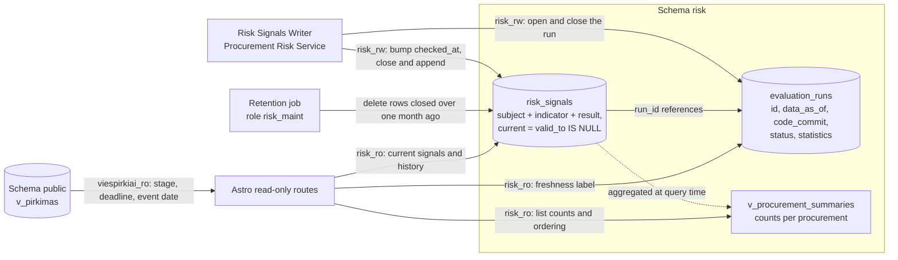

# Schema `risk` — risk signals for public procurement

Status: detailed design

Companion to: [`risk-service-architecture.md`](risk-service-architecture.md) §7, which holds the reasoning behind this
structure, the component that writes it and the run flow that fills it.

Identifiers are English throughout, to stay aligned with international and EU procurement-fraud terminology. Lithuanian
appears only as label VALUES that the GUI renders, and those live in the indicator catalogue in Git.

| Object                         | Kind  | Purpose                                  |
|--------------------------------|-------|------------------------------------------|
| `risk.evaluation_runs`         | table | one row per evaluation run               |
| `risk.risk_signals`            | table | current signals and their recent history |
| `risk.v_procurement_summaries` | view  | list-page aggregate                      |

**Diagram: objects of the `risk` schema and the components that read and write them.**



## 1. Evaluation runs

One row per run of the Procurement Risk Service. It records whether the job ran and whether it succeeded, which is what
lets the site state how fresh its signals are.

### `risk.evaluation_runs`

| Column        | Type                                  | Indexed | Description                                                                                                                                                                                                                |
|---------------|---------------------------------------|---------|----------------------------------------------------------------------------------------------------------------------------------------------------------------------------------------------------------------------------|
| `id`          | `bigint GENERATED ALWAYS AS IDENTITY` | PK      | Sequential run number.                                                                                                                                                                                                     |
| `data_as_of`  | `timestamptz NOT NULL`                |         | The run cutoff: the clock read once when the run opened, passed to every calculation as `$2`. One run is internally consistent, and a rerun at the same cutoff reproduces the same answers.                                |
| `code_commit` | `text NOT NULL`                       |         | The commit the service was deployed from. Runs are kept forever, so a signal's `run_id` recovers the exact indicator code that produced it.                                                                                |
| `started_at`  | `timestamptz NOT NULL DEFAULT now()`  | ✅       | Run start time.                                                                                                                                                                                                            |
| `finished_at` | `timestamptz`                         |         | Set when the run reaches a terminal state.                                                                                                                                                                                 |
| `status`      | `text NOT NULL`                       | ✅       | One of `'running'`, `'succeeded'`, `'partial'`, `'failed'`.                                                                                                                                                                |
| `statistics`  | `jsonb`                               |         | Per-indicator outcome counts and timings, e.g. `{"LT-PRO-08": {"rows": 8421, "triggered": 96, "ms": 1840}, "LT-PRI-01": {"rows": 8421, "error": "statement timeout", "ms": 30000}}`.                                       |
| `error`       | `text`                                |         | Terminal failure message of the run itself.                                                                                                                                                                                |

**Indexes**

| Name                                | Definition                                                           | Reason                               |
|-------------------------------------|----------------------------------------------------------------------|--------------------------------------|
| `evaluation_runs_latest_idx`        | `ON risk.evaluation_runs (started_at DESC)`                          | Fetch the most recent run(s).        |
| `evaluation_runs_single_active_idx` | `UNIQUE ON risk.evaluation_runs ((status)) WHERE status = 'running'` | At most one run in flight at a time. |

## 2. Risk signals

Current state and recent history in one table, separated by a validity interval:

- current rows have `valid_to IS NULL`;
- a run computing the same result advances `checked_at`;
- a run computing a different result closes the current row and inserts a new one.

Sameness is decided over the result columns — `indicator_version`, `applied_parameters`, `state`, `raw_value`,
`threshold`, `evidence`, `missing_data` — with `IS DISTINCT FROM`, in the statement that writes them. Result columns are
immutable after insert; `checked_at` and `valid_to` are the columns a later run changes. The Risk Signals Writer owns
this comparison; [`risk-service-architecture.md`](risk-service-architecture.md) §7.2 describes it in full.

### `risk.risk_signals`

| Column               | Type                                         | Indexed | Description                                                                                                                                                                                                                        |
|----------------------|----------------------------------------------|---------|--------------------------------------------------------------------------------------------------------------------------------------------------------------------------------------------------------------------------------------|
| `id`                 | `bigint GENERATED ALWAYS AS IDENTITY`        | PK      | Surrogate key.                                                                                                                                                                                                                     |
| **WHAT IT IS ABOUT** |                                              |         |                                                                                                                                                                                                                                    |
| `subject_type`       | `text NOT NULL`                              | ✅       | One of `'procurement'`, `'lot'`, `'contract'`, `'supplier'`.                                                                                                                                                                       |
| `subject_key`        | `text NOT NULL`                              | ✅       | Canonical key of the subject, e.g. `cvpis:7000000`.                                                                                                                                                                                |
| `procurement_source` | `text`                                       | ✅       | Navigation key for the procurement and list pages. NULL for a supplier-level signal.                                                                                                                                               |
| `procurement_id`     | `text`                                       | ✅       | Navigation key for the procurement and list pages. NULL for a supplier-level signal.                                                                                                                                               |
| **WHICH INDICATOR**  |                                              |         |                                                                                                                                                                                                                                    |
| `indicator_id`       | `text NOT NULL`                              | ✅       | Canonical catalogue id such as `LT-PRO-08`.                                                                                                                                                                                        |
| `indicator_version`  | `integer NOT NULL`                           |         | `key.version` of the definition in Git.                                                                                                                                                                                            |
| `applied_parameters` | `jsonb`                                      |         | The effective parameter values applied, e.g. `{"minimumDays": 10, "dayCounting": "calendar_days", "validFrom": "2026-07-01"}`.                                                                                                     |
| **THE RESULT**       |                                              |         |                                                                                                                                                                                                                                    |
| `state`              | `text NOT NULL`                              | ✅       | One of `'triggered'`, `'not_triggered'`, `'insufficient_data'`, `'not_applicable'`, `'calculation_error'`. All five are stored, so the page distinguishes "checked, clean" from "never evaluated" from "the calculation failed".   |
| `raw_value`          | `jsonb`                                      |         | What was measured.                                                                                                                                                                                                                 |
| `threshold`          | `jsonb`                                      |         | What it was compared against.                                                                                                                                                                                                      |
| `evidence`           | `jsonb`                                      | ✅       | Structured facts the page renders its Lithuanian explanation from. The wording template lives in `catalogue.generated.json`, keyed by indicator and version, so correcting text leaves these rows untouched.                       |
| `missing_data`       | `jsonb`                                      |         | Input fields that were absent, e.g. `["winningBidAmount", "estimatedValue"]`. This is the derivable basis of the public data-coverage statement.                                                                                   |
| `error_info`         | `jsonb`                                      |         | Set when `state = 'calculation_error'`.                                                                                                                                                                                            |
| `duration_ms`        | `integer`                                    |         | Calculation time attributed to this row's indicator.                                                                                                                                                                               |
| **TIME**             |                                              |         |                                                                                                                                                                                                                                    |
| `data_as_of`         | `timestamptz NOT NULL`                       | ✅       | Source cutoff of the run that produced this result.                                                                                                                                                                                |
| `valid_from`         | `timestamptz NOT NULL DEFAULT now()`         | ✅       | Start of the interval this result has been the current one.                                                                                                                                                                        |
| `valid_to`           | `timestamptz`                                | ✅       | NULL means current.                                                                                                                                                                                                                |
| `checked_at`         | `timestamptz NOT NULL DEFAULT now()`         |         | Last run that recomputed this result and got the same answer. Shown in the GUI as "tikrinta", separating "checked last night, unchanged" from "not checked since March".                                                           |
| `run_id`             | `bigint REFERENCES risk.evaluation_runs(id)` | ✅       | The run that produced this row. `checked_at` advances independently, so `run_id` remains the provenance of the result.                                                                                                             |

**Indexes**

| Name                                   | Definition                                                                                            | Reason                                                                                                                                                                                              |
|----------------------------------------|-------------------------------------------------------------------------------------------------------|-------------------------------------------------------------------------------------------------------------------------------------------------------------------------------------------------------|
| `risk_signals_current_idx`             | `UNIQUE ON risk.risk_signals (subject_type, subject_key, indicator_id) WHERE valid_to IS NULL`        | The current-state pointer: one live row per subject and indicator, which also makes a repeated run idempotent. The version is outside the key, so activating a new version closes one row and opens the next. |
| `risk_signals_procurement_current_idx` | `ON risk.risk_signals (procurement_source, procurement_id) WHERE valid_to IS NULL`                    | Procurement detail page: every current indicator state for one procurement.                                                                                                                         |
| `risk_signals_procurement_history_idx` | `ON risk.risk_signals (procurement_source, procurement_id, valid_from DESC)`                          | Procurement history panel: recent changes for one procurement.                                                                                                                                      |
| `risk_signals_triggered_idx`           | `ON risk.risk_signals (indicator_id, data_as_of DESC) WHERE valid_to IS NULL AND state = 'triggered'` | Methodology page and list filters: currently triggered subjects per indicator.                                                                                                                      |
| `risk_signals_closed_idx`              | `ON risk.risk_signals (valid_to) WHERE valid_to IS NOT NULL`                                          | Retention sweep.                                                                                                                                                                                    |
| `risk_signals_run_idx`                 | `ON risk.risk_signals (run_id)`                                                                       | "What did this run change".                                                                                                                                                                         |
| `risk_signals_evidence_gin`            | `USING gin (evidence jsonb_path_ops)`                                                                 | Containment queries over structured evidence.                                                                                                                                                       |

## 3. List-page read model

A view over `risk.risk_signals` (`WHERE valid_to IS NULL AND procurement_id IS NOT NULL`, grouped by
`procurement_source, procurement_id`). Promote it to a `MATERIALIZED VIEW` refreshed at the end of each run once
measurement on the real corpus shows the need.

### `risk.v_procurement_summaries`

| Column                    | Derivation                                                            | Description                                                                              |
|---------------------------|-----------------------------------------------------------------------|------------------------------------------------------------------------------------------|
| `procurement_source`      | group key                                                             | Source system of the procurement.                                                        |
| `procurement_id`          | group key                                                             | Procurement identifier within that source.                                               |
| `triggered_count`         | `count(*) FILTER (WHERE state = 'triggered')`                         | Default sort key of the list page.                                                       |
| `insufficient_data_count` | `count(*) FILTER (WHERE state = 'insufficient_data')`                 | Feeds the coverage statement.                                                            |
| `not_applicable_count`    | `count(*) FILTER (WHERE state = 'not_applicable')`                    | Indicators outside this procurement's scope.                                             |
| `error_count`             | `count(*) FILTER (WHERE state = 'calculation_error')`                 | Drives the temporary data-processing notice.                                             |
| `evaluated_count`         | `count(*)`                                                            | Denominator of "6 iš 7 rodiklių įvertinti".                                              |
| `triggered_indicators`    | `array_agg(DISTINCT indicator_id) FILTER (WHERE state = 'triggered')` | Also the severity filter handle — see below.                                             |
| `data_as_of`              | `max(data_as_of)`                                                     | Newest cutoff among the procurement's current signals.                                   |
| `oldest_checked_at`       | `min(checked_at)`                                                     | The weakest freshness claim on the page: the list may say "tikrinta" no later than this. |

Stage, deadline and event date come from joining `public.v_pirkimas`.

Ordering is `triggered_count DESC, data_as_of DESC`: countable, explainable and free of calibration.

**Severity filters through indicator IDs.** The page expands a severity filter into the indicator IDs the catalogue
assigns that severity and matches with array overlap, so severity stays a constant of the indicator version in Git:

```sql
WHERE triggered_indicators && ARRAY['LT-COM-01', 'LT-SUP-13']  -- the catalogue's 'high' set
```

## 4. Retention

viespirkiai displays risk, it does not manage it. A closed signal is one the GUI no longer shows as current, so it is
kept for one month to support the recent-changes panel and then deleted.

The scheduled maintenance job runs under the `risk_maint` role, outside the application path:

```sql
DELETE
FROM risk.risk_signals
WHERE valid_to IS NOT NULL
  AND valid_to < now() - interval '1 month';
```

Current rows (`valid_to IS NULL`) are kept however old they are: an untouched procurement keeps its signals until an
indicator changes them.

Evaluation runs accumulate at ~365 rows a year and are kept.
