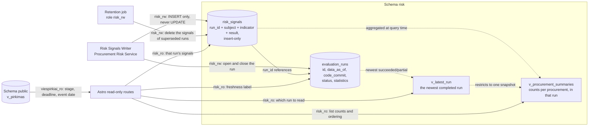

# Schema `risk` — risk signals for public procurement

Status: detailed design

Companion to: [`risk-service-architecture.md`](risk-service-architecture.md) §6, which holds the reasoning behind this
structure, the component that writes it and the run flow that fills it.

Identifiers are English throughout, to stay aligned with international and EU procurement-fraud terminology. Lithuanian
appears only as label VALUES that the GUI renders, and those live in the indicator catalogue in Git.

| Object                         | Kind  | Purpose                                     |
|--------------------------------|-------|---------------------------------------------|
| `risk.evaluation_runs`         | table | one row per evaluation run                  |
| `risk.risk_signals`            | table | insert-only snapshots, one per run          |
| `risk.v_latest_run`            | view  | the one run the site reads                  |
| `risk.v_procurement_summaries` | view  | list-page aggregate over that run           |

**`risk_signals` is insert-only in practice.** A run writes one immutable snapshot of every subject it evaluated; the
site reads exactly one run — the newest completed one — and superseded snapshots are deleted whole by the retention
job. There is no current-state pointer, no validity interval and no column a later run modifies. `risk_rw` holds no
`UPDATE` on this table — a written signal cannot be altered — but does hold `DELETE`, alongside `INSERT`, since it is
also the role the retention job runs as: indicators are derived and can be recalculated at any time, so there is no
need to fence deletion behind a separate credential.

**Diagram: objects of the `risk` schema and the components that read and write them.**



## 1. Evaluation runs

One row per run of the Procurement Risk Service. It records whether the job ran and whether it succeeded, which is what
lets the site state how fresh its signals are.

### `risk.evaluation_runs`

| Column        | Type                                  | Indexed | Description                                                                                                                                                                                                                |
|---------------|---------------------------------------|---------|----------------------------------------------------------------------------------------------------------------------------------------------------------------------------------------------------------------------------|
| `id`          | `bigint GENERATED ALWAYS AS IDENTITY` | PK      | Sequential run number.                                                                                                                                                                                                     |
| `data_as_of`  | `timestamptz NOT NULL`                |         | The run cutoff: the clock read once when the run opened, passed to every calculation as `$2`. One run is internally consistent, and a rerun at the same cutoff reproduces the same answers.                                |
| `code_commit` | `text NOT NULL`                       |         | The commit the service was deployed from. Runs are kept forever, so a signal's `run_id` recovers the exact indicator code that produced it.                                                                                |
| `started_at`  | `timestamptz NOT NULL DEFAULT now()`  | ✅       | Run start time.                                                                                                                                                                                                            |
| `finished_at` | `timestamptz`                         |         | Set when the run reaches a terminal state.                                                                                                                                                                                 |
| `status`      | `text NOT NULL`                       | ✅       | One of `'running'`, `'succeeded'`, `'partial'`, `'failed'`.                                                                                                                                                                |
| `statistics`  | `jsonb`                               |         | Per-indicator outcome counts and timings, e.g. `{"LT-PRO-08": {"rows": 8421, "triggered": 96, "ms": 1840}, "LT-PRI-01": {"rows": 8421, "error": "statement timeout", "ms": 30000}}`.                                       |
| `error`       | `text`                                |         | Terminal failure message of the run itself.                                                                                                                                                                                |

**Indexes**

| Name                                | Definition                                                           | Reason                               |
|-------------------------------------|----------------------------------------------------------------------|--------------------------------------|
| `evaluation_runs_latest_idx`        | `ON risk.evaluation_runs (started_at DESC)`                          | Fetch the most recent run(s).        |
| `evaluation_runs_single_active_idx` | `UNIQUE ON risk.evaluation_runs ((status)) WHERE status = 'running'` | At most one run in flight at a time. |

## 2. Risk signals

One row per `(run, subject, indicator)`, written once and never touched again:

- every run appends a complete snapshot of every subject it evaluated, changed or not;
- the site reads exactly one run — `v_latest_run` — so "current" is a property of the run, not of the row;
- superseded snapshots are deleted whole once they fall outside the retention window (§4).

There is no comparison, no validity interval and no `checked_at`. Freshness comes from the run: every row on a page
shares one `data_as_of` and one `code_commit`, because they were all produced by the same run.
[`risk-service-architecture.md`](risk-service-architecture.md) §6.2 holds the reasoning.

### `risk.risk_signals`

| Column               | Type                                         | Indexed | Description                                                                                                                                                                                                                        |
|----------------------|----------------------------------------------|---------|--------------------------------------------------------------------------------------------------------------------------------------------------------------------------------------------------------------------------------------|
| `id`                 | `bigint GENERATED ALWAYS AS IDENTITY`        | PK      | Surrogate key.                                                                                                                                                                                                                     |
| `run_id`             | `bigint NOT NULL REFERENCES risk.evaluation_runs(id) ON DELETE CASCADE` | ✅ | The run that produced this row, and the leading column of every read path. `CASCADE` guarantees no signal outlives its run.                                                                   |
| **WHAT IT IS ABOUT** |                                              |         |                                                                                                                                                                                                                                    |
| `subject_type`       | `text NOT NULL`                              | ✅       | One of `'procurement'`, `'lot'`, `'contract'`, `'supplier'`.                                                                                                                                                                       |
| `subject_key`        | `text NOT NULL`                              | ✅       | Canonical key of the subject, e.g. `cvpis:7000000`.                                                                                                                                                                                |
| `procurement_source` | `text`                                       | ✅       | Navigation key for the procurement and list pages. NULL for a supplier-level signal.                                                                                                                                               |
| `procurement_id`     | `text`                                       | ✅       | Navigation key for the procurement and list pages. NULL for a supplier-level signal.                                                                                                                                               |
| **WHICH INDICATOR**  |                                              |         |                                                                                                                                                                                                                                    |
| `indicator_id`       | `text NOT NULL`                              | ✅       | Canonical catalogue id such as `LT-PRO-08`.                                                                                                                                                                                        |
| `indicator_version`  | `integer NOT NULL`                           |         | `key.version` of the definition in Git.                                                                                                                                                                                            |
| `applied_parameters` | `jsonb`                                      |         | The effective parameter values applied, e.g. `{"minimumDays": 10, "dayCounting": "calendar_days", "validFrom": "2026-07-01"}`.                                                                                                     |
| **THE RESULT**       |                                              |         |                                                                                                                                                                                                                                    |
| `state`              | `text NOT NULL`                              | ✅       | One of `'triggered'`, `'not_triggered'`, `'insufficient_data'`, `'not_applicable'`, `'calculation_error'`. All five are stored, so the page distinguishes "checked, clean" from "never evaluated" from "the calculation failed".   |
| `raw_value`          | `jsonb`                                      |         | What was measured.                                                                                                                                                                                                                 |
| `threshold`          | `jsonb`                                      |         | What it was compared against.                                                                                                                                                                                                      |
| `evidence`           | `jsonb`                                      | ✅       | Structured facts the page renders its Lithuanian explanation from. The wording template lives in `riskCatalogue`, keyed by indicator and version, so correcting text leaves these rows untouched.                       |
| `missing_data`       | `jsonb`                                      |         | Input fields that were absent, e.g. `["winningBidAmount", "estimatedValue"]`. This is the derivable basis of the public data-coverage statement.                                                                                   |
| `error_info`         | `jsonb`                                      |         | Set when `state = 'calculation_error'`.                                                                                                                                                                                            |
| `duration_ms`        | `integer`                                    |         | Calculation time attributed to this row's indicator.                                                                                                                                                                               |
| **TIME**             |                                              |         |                                                                                                                                                                                                                                    |
| `data_as_of`         | `timestamptz NOT NULL`                       |         | Source cutoff of the run that produced this result. Equal to the run's own `data_as_of`, copied so a row explains itself without a join.                                                                                           |

**Indexes**

Every index leads with `run_id`, because every read is scoped to one run and the retention sweep deletes by one.

| Name                              | Definition                                                                                        | Reason                                                                                                                                                                     |
|-----------------------------------|---------------------------------------------------------------------------------------------------|----------------------------------------------------------------------------------------------------------------------------------------------------------------------------|
| `risk_signals_run_subject_idx`    | `UNIQUE ON risk.risk_signals (run_id, subject_type, subject_key, indicator_id)`                   | The integrity rule of a snapshot: one result per subject and indicator within a run. Also serves subject lookup, and makes the retention `DELETE … WHERE run_id = $1` an index range scan. |
| `risk_signals_run_procurement_idx`| `ON risk.risk_signals (run_id, procurement_source, procurement_id)`                               | Procurement detail page: every indicator state for one procurement, in the run being shown.                                                                                |
| `risk_signals_run_triggered_idx`  | `ON risk.risk_signals (run_id, indicator_id) WHERE state = 'triggered'`                           | Methodology page and list filters: subjects one indicator triggered.                                                                                                       |
| `risk_signals_evidence_gin`       | `USING gin (evidence jsonb_path_ops)`                                                             | Containment queries over structured evidence.                                                                                                                              |

## 3. The run the site shows

### `risk.v_latest_run`

```sql
SELECT * FROM risk.evaluation_runs
WHERE status IN ('succeeded', 'partial')
ORDER BY started_at DESC
LIMIT 1;
```

One definition of "latest successful run", so the read model, the retention job and the Astro application cannot
disagree about which snapshot is live. A `'running'` run is excluded — its snapshot is still being written — and a
`'failed'` one never produced a usable one. `'partial'` counts: it completed, and the indicators that failed within it
simply contributed no rows, which the page reports as "not evaluated in this run" rather than as a stale result.

The application reads this view once, then queries `risk_signals` by the `run_id` it returns.

## 4. List-page read model

A view over `risk.risk_signals` joined to `v_latest_run` (`WHERE procurement_id IS NOT NULL`, grouped by
`procurement_source, procurement_id`). Promote it to a `MATERIALIZED VIEW` refreshed at the end of each run once
measurement on the real corpus shows the need.

### `risk.v_procurement_summaries`

| Column                    | Derivation                                                            | Description                                                                              |
|---------------------------|-----------------------------------------------------------------------|------------------------------------------------------------------------------------------|
| `procurement_source`      | group key                                                             | Source system of the procurement.                                                        |
| `procurement_id`          | group key                                                             | Procurement identifier within that source.                                               |
| `triggered_count`         | `count(*) FILTER (WHERE state = 'triggered')`                         | Default sort key of the list page.                                                       |
| `insufficient_data_count` | `count(*) FILTER (WHERE state = 'insufficient_data')`                 | Feeds the coverage statement.                                                            |
| `not_applicable_count`    | `count(*) FILTER (WHERE state = 'not_applicable')`                    | Indicators outside this procurement's scope.                                             |
| `error_count`             | `count(*) FILTER (WHERE state = 'calculation_error')`                 | Drives the temporary data-processing notice.                                             |
| `evaluated_count`         | `count(*)`                                                            | Denominator of "6 iš 7 rodiklių įvertinti".                                              |
| `triggered_indicators`    | `array_agg(DISTINCT indicator_id) FILTER (WHERE state = 'triggered')` | Also the severity filter handle — see below.                                             |
| `run_id`                  | `min(run_id)`                                                         | The snapshot these counts come from. Constant across the view, by construction.          |
| `data_as_of`              | `min(data_as_of)`                                                     | The run's cutoff. Constant across the view: one snapshot, one clock.                     |

Stage, deadline and event date come from joining `public.v_pirkimas`.

Ordering is `triggered_count DESC, data_as_of DESC`: countable, explainable and free of calibration.

**Severity filters through indicator IDs.** The page expands a severity filter into the indicator IDs the catalogue
assigns that severity and matches with array overlap, so severity stays a constant of the indicator version in Git:

```sql
WHERE triggered_indicators && ARRAY['LT-COM-01', 'LT-SUP-13']  -- the catalogue's 'high' set
```

## 5. Retention

viespirkiai displays risk, it does not manage it. What expires is a whole superseded snapshot, not an individual signal.

The scheduled maintenance job runs under the `risk_rw` role, outside the application path, deleting one run's rows at
a time so that each statement is an index range scan and a long sweep never holds one enormous transaction
(`services/procurement-risk/retention.ts`):

```sql
-- the runs to clear
SELECT r.id
FROM risk.evaluation_runs r
WHERE r.started_at < now() - interval '1 month'
  AND r.id <> (SELECT id FROM risk.v_latest_run)
  AND EXISTS (SELECT 1 FROM risk.risk_signals s WHERE s.run_id = r.id);

-- then, per run
DELETE FROM risk.risk_signals WHERE run_id = $1;
```

**The `v_latest_run` exclusion is the safety belt, and it is why this is not a plain age sweep.** If the service has
been broken for longer than the retention window, the newest successful run is itself past the cutoff, and deleting it
would empty the public pages. Excluding the live snapshot means the worst outcome of a long outage is stale signals,
never missing ones.

Run rows themselves are kept: ~365 a year, and each is the provenance (`code_commit`, `data_as_of`) of the signals it
produced. Nothing in the system holds `DELETE` on `risk.evaluation_runs`.

### Sizing

One run writes one row per evaluated `(subject, indicator)` — on the §7.2 estimate, ~20M rows a night. A one-month
window therefore holds ~30 snapshots, so the retention interval is the direct lever on table size, and it is the number
to revisit first once the real corpus is measured. Shortening it to a few days costs nothing but the depth of run
history available for debugging, because the site only ever reads the newest snapshot.
