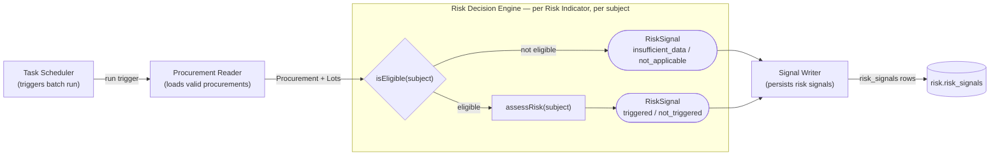
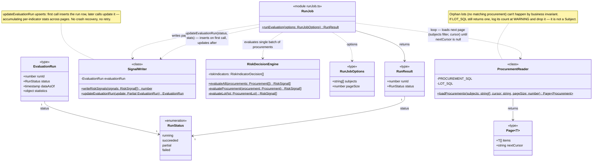
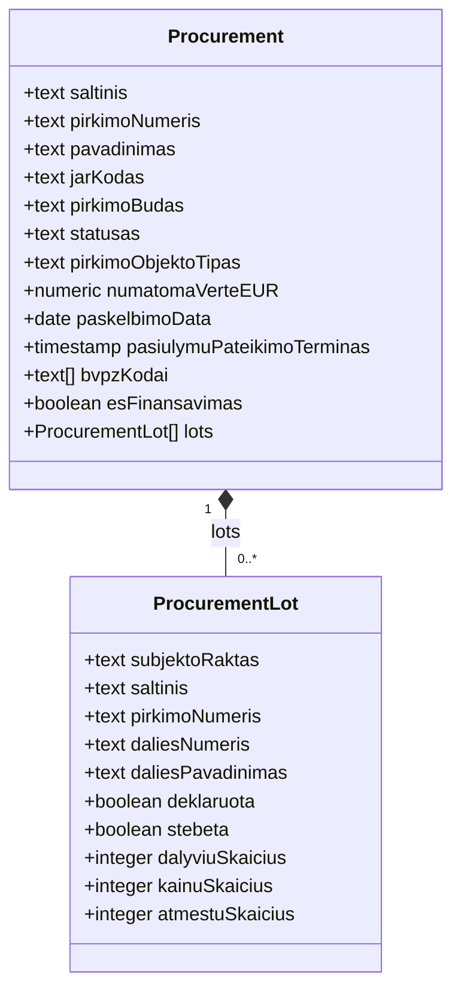
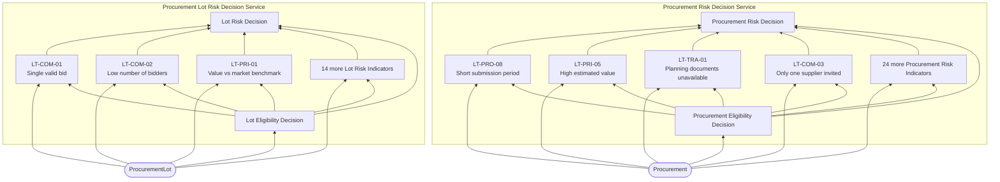
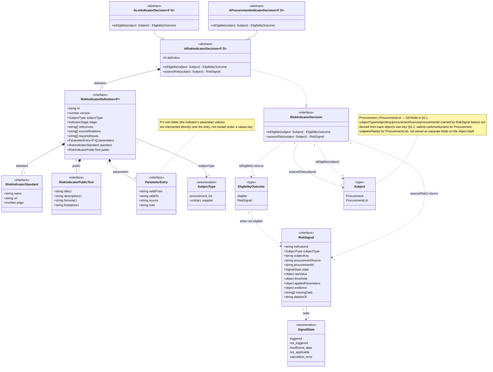

# Procurement Risk Service Architecture

## 1. Procurement Risk Process

### 1.1 Procurement Risk Process Diagram

### 1.2 Procurement Reader and Procurement Writer Components Class Diagram

## 2. Procurement Business Object

### 2.1 Diagram

### 2.2 Field Provenance

| Business Object | Domain Model View | Key                           |
|------------------|-------------------|-------------------------------|
| Procurement      | `v_pirkimas`      | `saltinis` + `pirkimoNumeris` |
| ProcurementLot    | `v_pirkimo_dalis` | `subjektoRaktas`              |

## 3. Risk Decision Services (DRD)

### Decision Areas

- **Procurement Risk Decision Service** (subject: `procurement`)
- **Procurement Lot Risk Decision Service** (subject: `lot`).

### 3.1 Legend

| Shape                     | DMN Element              |
|---------------------------|--------------------------|
| Rectangle                 | Decision                 |
| Rounded (`([...])`)       | Input Data               |
| Leaning sides (`[/.../]`) | Business Knowledge Model |
| Flag (`>...]`)            | Knowledge Source         |
| Bounding box (subgraph)   | Decision Service         |

### 3.2 Diagram

### 3.3 Decision Tables: Eligibility Decisions

#### Procurement Eligibility Decision

| Input: `pirkimoBudas` present | Input: `saltinis` | Output: Eligibility |
|-------------------------------|-------------------|---------------------|
| yes                           | `cvpis`           | eligible            |
| no                            | `cvpp`            | not eligible        |

#### Lot Eligibility Decision

| Input: Parent Procurement Eligibility | Input: `deklaruota` | Output: Eligibility |
|----------------------------------------|----------------------|----------------------|
| eligible                               | true                  | eligible             |
| eligible                               | false                 | not eligible         |
| not eligible                           | any                   | not eligible         |

### 3.4 Risk Indicator Definition

### 3.5 Per-Indicator File Layout

Each deployed indicator version is one directory under `modules/risk/indicators/<CODE>/`:

| File            | Holds                                                                                                                                                                                   |
|-----------------|-----------------------------------------------------------------------------------------------------------------------------------------------------------------------------------------|
| `definition.ts` | The `RiskIndicatorDefinition` object — identity, references, standard, public wording, and the effective-dated parameter timeline. Pure data; no imports of `ARiskIndicatorDecision`. Used in GUI and found in registry. |
| `decision.ts`   | The `ARiskIndicatorDecision` subclass that exposes `isEligible` and `assessRisk`                                                                                                        |
| `test/`         | Unit tests against risk indicator class                                                                                                                                                 |

## 4. Open Questions

| # | Question                                                                                                                                                                                                                               |
|---|----------------------------------------------------------------------------------------------------------------------------------------------------------------------------------------------------------------------------------------|
| 1 | Is one shared Procurement Eligibility Decision sufficient for all 28 indicators, or do some need their own additional eligibility rule? ANSWER: you will extend DRD on demand.                                                         |
| 2 | Where does `requiredInputs` / Data Eligibility Decision sit in this v2 model — inside each Risk Indicator, or as a second shared decision beside Procurement Eligibility Decision? ANSWER: you will read all domain element view data. |
