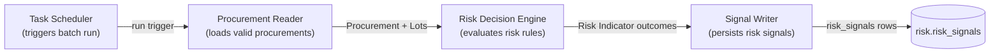
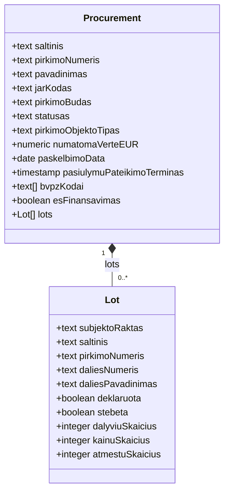
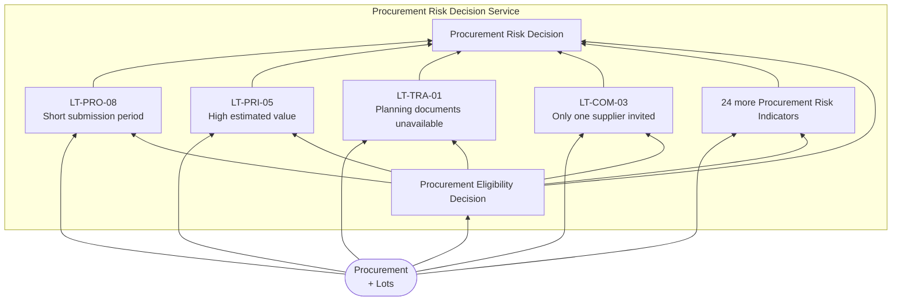
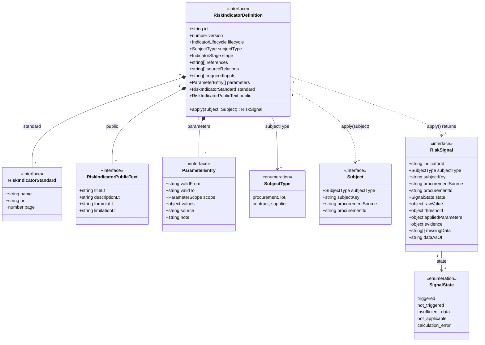

# Procurement Risk Service Architecture v2

Status: draft

## 1. Procurement Risk Process

### 1.1 Procurement Risk Process Diagram

## 2. Procurement Business Object

### 2.1 Diagram

### 2.2 Field Provenance

| Business Object | Domain Model View | Key                           |
|-----------------|-------------------|-------------------------------|
| Procurement     | `v_pirkimas`      | `saltinis` + `pirkimoNumeris` |
| Lot             | `v_pirkimo_dalis` | `subjektoRaktas`              |

## 3. Procurement Risk Decision Service (DRD)

### 3.1 Legend

| Shape                     | DMN Element              |
|---------------------------|--------------------------|
| Rectangle                 | Decision                 |
| Rounded (`([...])`)       | Input Data               |
| Leaning sides (`[/.../]`) | Business Knowledge Model |
| Flag (`>...]`)            | Knowledge Source         |
| Bounding box (subgraph)   | Decision Service         |

### 3.2 Diagram

### 3.3 Decision Table: Procurement Eligibility Decision

| Input: `pirkimoBudas` present | Input: `saltinis` | Output: Eligibility |
|-------------------------------|-------------------|---------------------|
| yes                           | `cvpis`           | eligible            |
| no                            | `cvpp`            | not eligible        |

### 3.4 Risk Indicator Definition

Every node `I1`…`IREST` in §3.2 is one deployed instance of this class, e.g. `ltCom01v1`
(`modules/risk/indicators/LT-COM-01/definition.ts`). It is applied to exactly one subject at a time and always gives
birth to exactly one Risk Signal — never zero, never more than one.

Notes:

- `<<class>>` marks the one class with behaviour (`apply()`); everything else is `<<type>>` — a `Readonly<{...}>` shape
  (`RiskIndicatorStandard`, `RiskIndicatorPublicText`, `ParameterEntry`, `Subject`, `RiskSignal`) or a closed
  string-literal union (`SubjectType`, `SignalState`). No native TS `enum` — the codebase never uses one
  (`modules/risk/contracts.ts`), and a string-literal union is the better default: no runtime object, safer to narrow,
  and it's what `SubjectType`/`SignalState` already are in code.

- `apply(subject)` is the one method. There is no `evaluate()` → `calculate()` → `decide()` split.
- `Subject` is `procurement` \| `lot` \| `contract` \| `supplier` (§4, Open Question 4). Section 2's `Procurement` and
  `Lot` are its only two subject shapes defined so far.
- `RiskSignal` becomes one row of `risk.risk_signals` (§1.1's `Signal Writer`) once the run attaches `run_id`, `id`, and
  `duration_ms` — those three columns belong to persistence, not to what `apply()` produces.

## 4. Procurement Risk Indicators (28)

| Code      | Canonical Indicator                                   |
|-----------|-------------------------------------------------------|
| LT-COM-03 | Only one supplier invited or consulted                |
| LT-COM-18 | Procurement object has elevated cartel risk           |
| LT-PRO-01 | Unjustified non-competitive procedure                 |
| LT-PRO-02 | Direct award contrary to procurement plan             |
| LT-PRO-04 | Procedure without prior publication                   |
| LT-PRO-05 | Accelerated procedure without adequate grounds        |
| LT-PRO-08 | Short submission/advertisement period                 |
| LT-PRO-09 | Unreasonable prequalification requirements            |
| LT-PRO-10 | Tailored or restrictive technical specifications      |
| LT-PRO-11 | Unreasonable participation or document fees           |
| LT-PRO-12 | Excessive tender guarantee                            |
| LT-PRO-13 | Low predefined number of candidates                   |
| LT-PRO-14 | Missing method for reducing candidate numbers         |
| LT-PRI-05 | High estimated value                                  |
| LT-PRI-06 | High estimated framework value                        |
| LT-TRA-01 | Planning documents unavailable                        |
| LT-TRA-02 | Tender insufficiently advertised                      |
| LT-TRA-03 | Key tender information/documents unavailable          |
| LT-TRA-05 | Bidder questions unanswered                           |
| LT-TRA-06 | Procurement decision or reason not documented         |
| LT-TRA-07 | Complaint received                                    |
| LT-TRA-08 | Procurement challenged in court                       |
| LT-TRA-09 | Procurement not conducted electronically              |
| LT-OTH-01 | No documented market research                         |
| LT-OTH-03 | Evaluation/decision period anomalously short or long  |
| LT-OTH-04 | Award-to-signature period unusually long              |
| LT-OTH-05 | Procedure unsuccessful or award not contracted        |
| LT-OTH-06 | Strategic-policy objective not applied where relevant |

## 5. Open Questions

| # | Question                                                                                                                                                                           |
|---|------------------------------------------------------------------------------------------------------------------------------------------------------------------------------------|
| 1 | Is one shared Procurement Eligibility Decision sufficient for all 28 indicators, or do some need their own additional eligibility rule?                                            |
| 2 | Where does `requiredInputs` / Data Eligibility Decision sit in this v2 model — inside each Risk Indicator, or as a second shared decision beside Procurement Eligibility Decision? |
| 3 | Does `Rule` (the TS method) get its own node, or does it stay boxed logic inside each Procurement Risk Indicator decision?                                                         |
| 4 | Same pattern for the other 8 subject types — one shared Eligibility Decision per subject type?                                                                                     |
