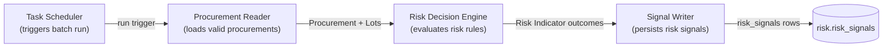
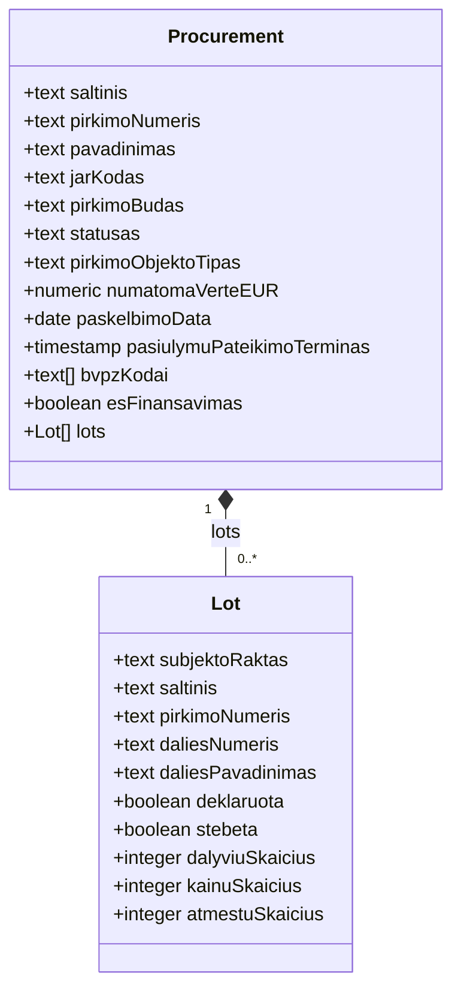

# Procurement Risk Service Architecture v2

Status: draft

## 1. Procurement Risk Process

### 1.1 Procurement Risk Process Diagram

## 2. Procurement Business Object

### 2.1 Diagram

### 2.2 Field Provenance

| Business Object | Domain Model View  | Key                        |
|------------------|---------------------|-----------------------------|
| Procurement       | `v_pirkimas`         | `saltinis` + `pirkimoNumeris` |
| Lot                | `v_pirkimo_dalis`    | `subjektoRaktas`             |

## 3. Procurement Risk Decision Service (DRD)

### 3.1 Legend

| Shape                | DMN Element               |
|------------------------|----------------------------|
| Rectangle              | Decision                   |
| Rounded (`([...])`)    | Input Data                 |
| Leaning sides (`[/.../]`) | Business Knowledge Model |
| Flag (`>...]`)          | Knowledge Source            |
| Bounding box (subgraph) | Decision Service            |

### 3.2 Diagram

### 3.3 Decision Table: Procurement Eligibility Decision

| Input: `pirkimoBudas` present | Input: `saltinis` | Output: Eligibility |
|---------------------------------|---------------------|-----------------------|
| yes                              | `cvpis`              | eligible               |
| no                                | `cvpp`               | not eligible           |

## 4. Procurement Risk Indicators (28)

| Code       | Canonical Indicator                                    |
|------------|----------------------------------------------------------|
| LT-COM-03  | Only one supplier invited or consulted                   |
| LT-COM-18  | Procurement object has elevated cartel risk               |
| LT-PRO-01  | Unjustified non-competitive procedure                     |
| LT-PRO-02  | Direct award contrary to procurement plan                 |
| LT-PRO-04  | Procedure without prior publication                       |
| LT-PRO-05  | Accelerated procedure without adequate grounds             |
| LT-PRO-08  | Short submission/advertisement period                      |
| LT-PRO-09  | Unreasonable prequalification requirements                 |
| LT-PRO-10  | Tailored or restrictive technical specifications           |
| LT-PRO-11  | Unreasonable participation or document fees                |
| LT-PRO-12  | Excessive tender guarantee                                  |
| LT-PRO-13  | Low predefined number of candidates                         |
| LT-PRO-14  | Missing method for reducing candidate numbers               |
| LT-PRI-05  | High estimated value                                        |
| LT-PRI-06  | High estimated framework value                              |
| LT-TRA-01  | Planning documents unavailable                              |
| LT-TRA-02  | Tender insufficiently advertised                            |
| LT-TRA-03  | Key tender information/documents unavailable                |
| LT-TRA-05  | Bidder questions unanswered                                 |
| LT-TRA-06  | Procurement decision or reason not documented               |
| LT-TRA-07  | Complaint received                                          |
| LT-TRA-08  | Procurement challenged in court                              |
| LT-TRA-09  | Procurement not conducted electronically                    |
| LT-OTH-01  | No documented market research                               |
| LT-OTH-03  | Evaluation/decision period anomalously short or long        |
| LT-OTH-04  | Award-to-signature period unusually long                    |
| LT-OTH-05  | Procedure unsuccessful or award not contracted               |
| LT-OTH-06  | Strategic-policy objective not applied where relevant       |

## 5. Open Questions

| # | Question |
|---|-----------|
| 1 | Is one shared Procurement Eligibility Decision sufficient for all 28 indicators, or do some need their own additional eligibility rule? |
| 2 | Where does `requiredInputs` / Data Eligibility Decision sit in this v2 model — inside each Risk Indicator, or as a second shared decision beside Procurement Eligibility Decision? |
| 3 | Does `Rule` (the TS method) get its own node, or does it stay boxed logic inside each Procurement Risk Indicator decision? |
| 4 | Same pattern for the other 8 subject types — one shared Eligibility Decision per subject type? |
