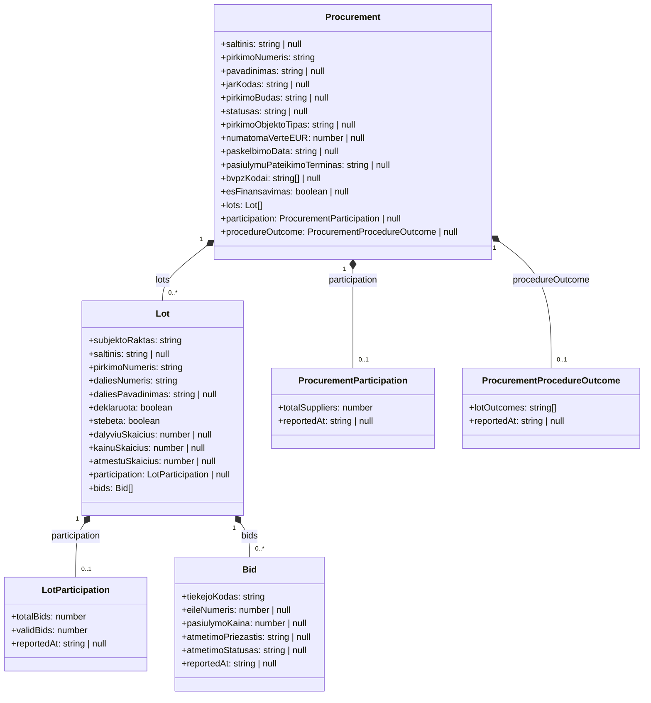
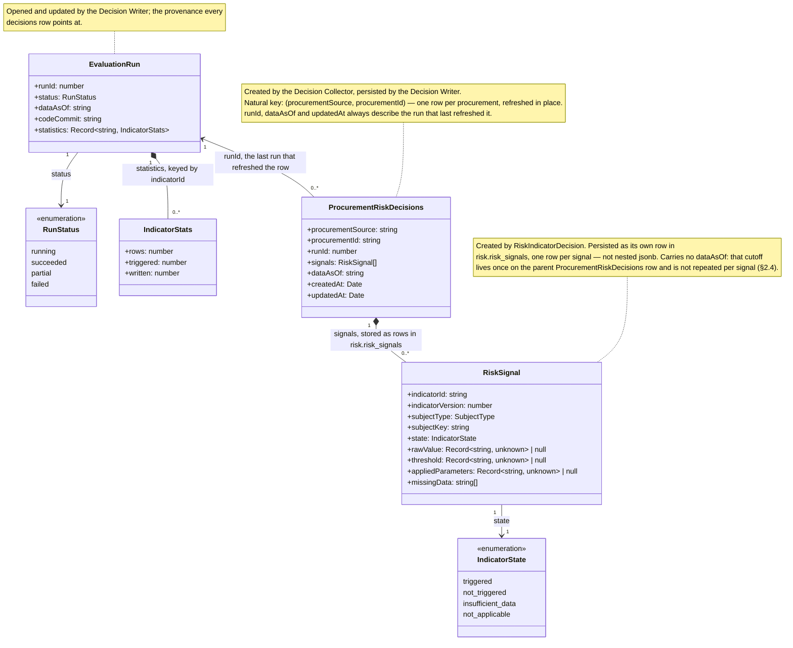

# Procurement Risk Service Architecture

## 1. Procurement Risk Process

### 1.1 Procurement Risk Process Diagram

```mermaid
flowchart LR
    CRON["Task Scheduler<br/>(triggers batch run)"]
    READER["Procurement Reader<br/>(loads valid procurements)"]

    subgraph ENGINE["Risk Decision Engine — per Risk Indicator, per subject"]
        direction LR
        ELIG{"isEligible(subject)"}
        ASSESS["assessRisk(subject)"]
        SIGE(["RiskSignal<br/>insufficient_data / not_applicable"])
        SIGA(["RiskSignal<br/>triggered / not_triggered"])
        ELIG -->|" not eligible "| SIGE
        ELIG -->|" eligible "| ASSESS
        ASSESS --> SIGA
    end

    COLLECT["Decision Collector<br/>(one ProcurementRiskDecisions per procurement"]
    WRITER["Decision Writer<br/>(upserts by procurement, updates the run)"]
    STORE[("risk.risk_procurement_decisions")]
    SIGNALS[("risk.risk_signals")]
    RUNS[("risk.risk_evaluation_runs")]
    CRON -->|" run trigger "| READER
    READER -->|" Procurement + Lots + Bids "| ELIG
    SIGE --> COLLECT
    SIGA --> COLLECT
    COLLECT -->|" ProcurementRiskDecisions "| WRITER
    WRITER -->|" INSERT … ON CONFLICT DO UPDATE "| STORE
    WRITER -->|" DELETE then INSERT, per procurement "| SIGNALS
    WRITER -->|" run row + statistics "| RUNS
    STORE -.->|" run_id "| RUNS
    SIGNALS -.->|" decision_id → id "| STORE
```



### 1.2 Procurement Reader and Decision Writer Components Class Diagram

```mermaid
classDiagram
    class RunJob {
<<modulerunJob.ts>>
+runEvaluation(options: RunJobOptions) Promise~RunResult~
}

class RunJobOptions {
<<type>>
+codeCommit: string
+subjects: string[] | null
+pageSize: number
}

class RunResult {
<<type>>
+runId: number
+status: RunStatus
+statistics: Record~string, IndicatorStats~
}
note for RunResult "RunStatus, IndicatorStats and the EvaluationRun row behind them: §2.3."

class ProcurementReader {
-subjects: string[] | null
-dataAsOf: string
+loadProcurements(cursor: string | null, pageSize: number) Promise~Page~Procurement~~
}
note for ProcurementReader "subjects and dataAsOf are bound once per run, not per page, so lots
    and evidence load once. Orphan lots (no matching procurement) can't happen by business invariant;
    if the query still returns one, its count is logged at WARNING and it is dropped — it is not a Subject."

class Page~T~ {
<<type>>
+items: T[]
+nextCursor: string | null
}

class RiskDecisionEngine {
-procurementIndicators: ARiskIndicatorDecision[]
-lotIndicators: ARiskIndicatorDecision[]
-bidIndicators: ARiskIndicatorDecision[]
+evaluateAll(procurements: Procurement[]) ProcurementRiskDecisions[]
-evaluateProcurement(procurement: Procurement) ProcurementRiskDecisions
-evaluateLot(lot: Lot, procurement: Procurement) RiskSignal[]
-evaluateBid(bid: Bid, lot: Lot, procurement: Procurement) RiskSignal[]
}
note for RiskDecisionEngine "The signals of a procurement, of its lots and of its bids are collected
    into that procurement's single ProcurementRiskDecisions — the grain stays on the signal
    (subjectType, subjectKey), not on the row."

class DecisionWriter {
-evaluationRun: EvaluationRun | null
+writeDecisions(decisions: ProcurementRiskDecisions[]) Promise~number~
+updateEvaluationRun(update: Partial~EvaluationRun~) Promise~EvaluationRun~
}
note for DecisionWriter "writeDecisions upserts the procurement's metadata row on
    (procurement_source, procurement_id) — INSERT … ON CONFLICT DO UPDATE … RETURNING id — then
    wipes and replaces that procurement's rows in risk_signals using the returned id: DELETE
    WHERE decision_id = …, followed by a bulk INSERT of the freshly evaluated signals stamped
    with that same decision_id. Never an UPDATE on risk_signals. updateEvaluationRun upserts the
    run row — the first call inserts it, later calls accumulate per-indicator stats across pages.
    No crash recovery, no retry."

RunJob ..> RunJobOptions: options
RunJob --> RunResult: returns
RunJob ..> ProcurementReader: loop — loads next page (subjects filter, cursor) until nextCursor is null
ProcurementReader --> Page: returns
RunJob ..> RiskDecisionEngine: evaluates one page of procurements
RunJob ..> DecisionWriter: writes the page's decisions, then checkpoints statistics
```



## 2. Procurement Risk Decision Service

### 2.1 Input Data Object Model



- **`null` evidence means nothing was observed** — the `insufficient_data` case. A *present* `participation` whose
  counts are zero is a different, real observation, and `hasRequiredData()` must not confuse the two.
- **The run's `dataAsOf` cuts off evidence, not subjects.** `Bid`, both participations and `ProcurementProcedureOutcome`
  are filtered `ataskaitosData <= dataAsOf`; `Procurement` and `Lot` are whatever the register currently holds.
- **Aggregates are merged, not joined.** One batch query per grain per run, attached to the object — so a decision
  issues no query, and every indicator at that grain shares one read. Orphan lots are dropped by the Reader, so
  `Lot.pirkimoNumeris` always resolves.

### 2.2 Input Data Object Model Source

Each object is read through the risk service's own `_v2` copy of the view, inlined per query as a CTE by
`procurementPublicViews.ts`.

| Business Object               | Domain Model View      |
|-------------------------------|------------------------|
| `Procurement`                 | `v_pirkimas`           |
| `Lot`                         | `v_pirkimo_dalis`      |
| `Bid`                         | `v_dalyviai`           |
| `LotParticipation`            | `v_dalyviai`           |
| `ProcurementParticipation`    | `v_dalyviai`           |
| `ProcurementProcedureOutcome` | `v_proceduros_pabaiga` |

`v_proceduros_pabaiga` is still listed as not-yet-implemented in [`domain-model.md`](domain-model.md) §1.3; the risk
service reads it today through a `_v2`-only view named `v_pirkimo_pabaiga_v2`, with no shared counterpart. Same entity,
two names — to be reconciled.

### 2.3 Output Data Object Model

A run produces one `EvaluationRun`, and one `ProcurementRiskDecisions` per procurement it evaluated. Every
`RiskSignal` the run produced — for the procurement, its lots and its bids — lives inside that procurement's decisions
object. Nothing else.



`RiskSignal` (the domain type) carries neither `procurementSource` / `procurementId` nor `dataAsOf`: the
`ProcurementRiskDecisions` it is collected into already answers both. Persistence resolves the link even more directly
than a stamped natural key — `risk_signals` points at its parent by the parent's own surrogate
`id` (`decision_id`), never by `procurement_source` / `procurement_id` at all (§2.4). That also sidesteps any question
of whether `(procurement_source, procurement_id)` is safe to rely on as a natural key elsewhere:
the signal table's referential integrity doesn't depend on it.

### 2.4 Output Data Object Model Persistence

`ProcurementRiskDecisions` → `risk.risk_procurement_decisions`, **one row per procurement** (not per run) — metadata
only, no signals:

| Field               | Column               | Type          | Note                                                                    |
|---------------------|----------------------|---------------|-------------------------------------------------------------------------|
| —                   | `id`                 | `bigint`      | Identity PK                                                             |
| `procurementSource` | `procurement_source` | `text`        | Natural key, part 1                                                     |
| `procurementId`     | `procurement_id`     | `text`        | Natural key, part 2                                                     |
| `runId`             | `run_id`             | `bigint`      | FK → `risk.risk_evaluation_runs(id)`; **overwritten** on every refresh  |
| `dataAsOf`          | `data_as_of`         | `timestamptz` | Cutoff of the run that last wrote the row                               |
| `createdAt`         | `created_at`         | `timestamptz` | `DEFAULT now()`, never updated — first time this procurement was scored |
| `updatedAt`         | `updated_at`         | `timestamptz` | `now()` on every upsert — the "assessed at" the GUI shows               |

| Constraint / Index                            | Purpose                                                                           |
|-----------------------------------------------|-----------------------------------------------------------------------------------|
| `UNIQUE (procurement_source, procurement_id)` | The upsert conflict target; one row per procurement; FK target for `risk_signals` |
| `INDEX (run_id)`                              | "What did run N touch"; FK maintenance                                            |
| `INDEX (updated_at DESC)`                     | Freshness listings                                                                |

`RiskSignal` → `risk.risk_signals`, **one row per signal**. A procurement's signals are wiped and reinserted whole on
every refresh that touches it — never updated in place (Invariant 2 below). No `id` column: the row has no identity
worth naming outside its parent, nothing references an individual signal row, and the table is always replaced wholesale
rather than addressed row-by-row, so a natural composite key does the job without a surrogate:

| Field               | Column               | Type          | Note                                                                                                   |
|---------------------|----------------------|---------------|--------------------------------------------------------------------------------------------------------|
| —                   | `decision_id`        | `bigint`      | FK → `risk_procurement_decisions(id)` — the only link to the procurement; not on the `RiskSignal` type |
| `indicatorId`       | `indicator_id`       | `text`        |                                                                                                        |
| `indicatorVersion`  | `indicator_version`  | `int`         |                                                                                                        |
| `subjectType`       | `subject_type`       | `text`        | CHECK: the five `SubjectType` values (§3.4)                                                            |
| `subjectKey`        | `subject_key`        | `text`        |                                                                                                        |
| `state`             | `state`              | `text`        | CHECK: the four `IndicatorState` values                                                                |
| `rawValue`          | `raw_value`          | `jsonb`       | Nullable                                                                                               |
| `threshold`         | `threshold`          | `jsonb`       | Nullable                                                                                               |
| `appliedParameters` | `applied_parameters` | `jsonb`       | Nullable                                                                                               |
| `missingData`       | `missing_data`       | `text[]`      |                                                                                                        |
| —                   | `created_at`         | `timestamptz` | `DEFAULT now()` — when this refresh inserted the row                                                   |

No `procurement_source` / `procurement_id` columns: unlike the deprecated table (§5 #1), a signal never carries the
natural key directly — only `decision_id`, resolved once via a join to
`risk_procurement_decisions` when a query needs it. No `data_as_of` column either: the cutoff lives once on the parent
`risk_procurement_decisions.data_as_of` and is read from there, not duplicated per signal.

| Constraint / Index                                                                       | Purpose                                                                                                                                                                   |
|------------------------------------------------------------------------------------------|---------------------------------------------------------------------------------------------------------------------------------------------------------------------------|
| `PRIMARY KEY (decision_id, indicator_id, indicator_version, subject_type, subject_key)`  | One signal per indicator version per subject per procurement; also the FK access path — "all signals for this procurement" (the GUI's main read) leads with `decision_id` |
| `FOREIGN KEY (decision_id) REFERENCES risk_procurement_decisions (id) ON DELETE CASCADE` | Every signal belongs to exactly one procurement's decisions row                                                                                                           |
| `INDEX (indicator_id, state)`                                                            | List filters: which procurements a given indicator triggered                                                                                                              |

`EvaluationRun` → `risk.risk_evaluation_runs`, one row per run:

| Field        | Column        | Type          | Note                                                      |
|--------------|---------------|---------------|-----------------------------------------------------------|
| `runId`      | `id`          | `bigint`      | The FK every decisions row carries                        |
| `dataAsOf`   | `data_as_of`  | `timestamptz` |                                                           |
| `codeCommit` | `code_commit` | `text`        |                                                           |
| `status`     | `status`      | `text`        | CHECK: the four `RunStatus` values                        |
| `statistics` | `statistics`  | `jsonb`       | Per-indicator `rows` / `triggered` / `written`            |
| —            | `started_at`  | `timestamptz` | `DEFAULT now()`                                           |
| —            | `finished_at` | `timestamptz` | Stamped when status becomes terminal                      |
| —            | `error`       | `text`        | Set only by the stale-run sweep at the next process start |

Invariants:

| # | Invariant                                                                                                                                                                                                                                                                                                                                     |
|---|-----------------------------------------------------------------------------------------------------------------------------------------------------------------------------------------------------------------------------------------------------------------------------------------------------------------------------------------------|
| 1 | **One row per procurement, refreshed in place.** There is no per-run snapshot; `risk_procurement_decisions` is the current state. `risk_rw` needs `INSERT` **and** `UPDATE` on it, and `INSERT` **and** `DELETE` on `risk_signals` (no `UPDATE` there — see Invariant 2).                                                                     |
| 2 | **A procurement's signals are wiped, not merged.** Never updated element-wise: the Decision Writer deletes every `risk_signals` row for that `decision_id` and inserts the freshly evaluated set. A refresh re-evaluates every deployed indicator for that procurement, so the replacement set is always internally consistent.               |
| 3 | **A refresh is scoped.** A run over a subset of procurements touches only those procurements' `risk_procurement_decisions` row and its `decision_id`'s `risk_signals` rows; every other procurement keeps its older `run_id` / `updated_at` and untouched signals. Indicators can grow and be re-run without reprocessing the whole register. |
| 4 | **At most one open run** — partial unique index on `status = 'running'` in `risk.risk_evaluation_runs`.                                                                                                                                                                                                                                       |
| 5 | **`updated_at` is the published freshness.** The GUI shows it per procurement; there is no global "as of" for the site any more.                                                                                                                                                                                                              |

Read path:

| View                           | Answers                                                                                                                               |
|--------------------------------|---------------------------------------------------------------------------------------------------------------------------------------|
| `risk.v_latest_run`            | Provenance only: the most recently started `succeeded` / `partial` run. No longer a read filter                                       |
| `risk.v_procurement_summaries` | Per procurement, joining its `risk_signals` rows: counts by state, the `triggered` indicator ids, `updated_at` from the decisions row |

## 3. Risk Decision Services (DRD)

> TBA

### 3.3 Decision Tables: Eligibility Decisions

#### Procurement Eligibility Decision

| Input: `pirkimoBudas` present | Input: `saltinis` | Output: Eligibility |
|-------------------------------|-------------------|---------------------|
| yes                           | `cvpis`           | eligible            |
| no                            | `cvpp`            | not eligible        |

#### Lot Eligibility Decision

| Input: Parent Procurement Eligibility | Input: `deklaruota` | Output: Eligibility |
|---------------------------------------|---------------------|---------------------|
| eligible                              | true                | eligible            |
| eligible                              | false               | not eligible        |
| not eligible                          | any                 | not eligible        |

### 3.4 Risk Indicator Definition


### 3.5 Per-Indicator File Layout

Each deployed indicator version is one directory under `modules/risk/indicators/<CODE>/`:

| File            | Holds                                                                                                                                                                                                                    |
|-----------------|--------------------------------------------------------------------------------------------------------------------------------------------------------------------------------------------------------------------------|
| `definition.ts` | The `RiskIndicatorDefinition` object — identity, references, standard, public wording, and the effective-dated parameter timeline. Pure data; no imports of `ARiskIndicatorDecision`. Used in GUI and found in registry. |
| `decision.ts`   | The `ARiskIndicatorDecision` subclass that exposes `isEligible` and `assessRisk`                                                                                                                                         |
| `test/`         | Unit tests against risk indicator class                                                                                                                                                                                  |

## 4. Running the Service

Entry point: `services/procurement-risk/index.ts` (`npm run risk:run`). One sequential evaluation run per invocation —
not a daemon.

```bash
npm run risk:run                       # full run, every subject
npm run risk:run -- <pirkimoNumeris...>  # only the named procurements
npm run risk:run -- --limit 20         # light run: first 20 distinct ATN-1 procurement ids (deterministic)
```

`--limit N` and explicit subject ids are mutually exclusive. Requires `riskDb` (see `postgres/riskDb.js`) and the
primary Postgres DB configured, as in [Local dev setup](../../CLAUDE.md).

Every invocation is a **refresh**, not a snapshot: it rewrites the decisions row of each procurement it touched and
wipes and reinserts that procurement's `risk_signals` rows, leaving every other procurement untouched. Adding an
indicator and re-running a subset is therefore a normal operation — the whole register is not reprocessed, and each
row's `updated_at` says how fresh it is.

## 5. Deprecated

What exists in the code today and is superseded by §1–§2. To be removed by the refactoring; this section goes with it.

| #  | Deprecated                                                                                                   | Where                                                                | Replacement                                                                                                                                                                                                                                                                  |
|----|--------------------------------------------------------------------------------------------------------------|----------------------------------------------------------------------|------------------------------------------------------------------------------------------------------------------------------------------------------------------------------------------------------------------------------------------------------------------------------|
| 1  | Table `risk.risk_signals` — one flattened row per (subject, indicator), snapshot-per-run                     | `migrations/risk/001_risk.sql`, `003_bid_subject.sql`                | Redesigned `risk.risk_signals` (§2.4): current-state, `procurement_source`/`procurement_id` FK into `risk_procurement_decisions`, wiped and reinserted per procurement, no `run_id` or `dataAsOf` columns. Same table name, unrelated schema — do not assume the old columns |
| 2  | Table name `risk.evaluation_runs`                                                                            | `migrations/risk/001_risk.sql`, `002_roles.sql`                      | `risk.risk_evaluation_runs`                                                                                                                                                                                                                                                  |
| 3  | Snapshot-per-run model: insert-only writes, one live run, `run_id` filter on reads                           | `services/procurement-risk/write.ts`, `risk.v_procurement_summaries` | Current-state upsert by procurement; `run_id` is provenance, not a filter                                                                                                                                                                                                    |
| 4  | `SignalWriter` / `writeRiskSignals()` / `writeObservations()`                                                | `services/procurement-risk/signalWriter.ts`, `write.ts`              | `DecisionWriter` / `writeDecisions()` — upserts the decisions row, then `DELETE` + `INSERT` on `risk_signals`                                                                                                                                                                |
| 5  | `RiskSignal.procurementSource`, `RiskSignal.procurementId`, `RiskSignal.dataAsOf`                            | `modules/risk/types.ts`, `modules/risk/contracts.ts`                 | Held once on the decisions row; the `risk_signals` row links back to it only via `decision_id` (surrogate FK, §2.4) — no natural-key columns are stamped onto the signal row at all, and `dataAsOf` is not duplicated either                                                 |
| 6  | `RiskDecisionEngine.evaluateAll(): RiskSignal[]`                                                             | `modules/risk/riskDecisionEngine.ts`                                 | Returns `ProcurementRiskDecisions[]`, signals grouped per procurement                                                                                                                                                                                                        |
| 7  | Retention by superseded snapshot (`deleteExpiredSnapshots`, `RETENTION_INTERVAL`)                            | `services/procurement-risk/retention.ts`, `retentionJob.ts`          | Nothing to expire — rows are overwritten/replaced. Only run rows accumulate                                                                                                                                                                                                  |
| 8  | Columns `error_info`, `duration_ms` and state `calculation_error`                                            | `migrations/risk/001_risk.sql`                                       | Unused path; a failing indicator is logged and contributes no signal                                                                                                                                                                                                         |
| 9  | Grants: `risk_rw` insert-only on signals, DELETE for retention                                               | `migrations/risk/002_roles.sql`                                      | `SELECT, INSERT, UPDATE` on `risk_procurement_decisions` and `risk_evaluation_runs`; `SELECT, INSERT, DELETE` on `risk_signals` (no `UPDATE` — rows are wiped and reinserted, never edited)                                                                                  |
| 10 | Indexes `risk_signals_run_subject_idx`, `risk_signals_run_procurement_idx`, `risk_signals_run_triggered_idx` | `migrations/risk/001_risk.sql`                                       | `risk_signals` composite PK `(decision_id, indicator_id, indicator_version, subject_type, subject_key)` + `INDEX (indicator_id, state)` (§2.4). No `id` column — the old table's own-identity column is gone along with `run_id`-scoped indexing                             |
| 11 | `IndicatorStats.inserted`                                                                                    | `services/procurement-risk/signalWriter.ts`, `runJob.ts`             | `written` (inserted or updated)                                                                                                                                                                                                                                              |
| 12 | Doc references to `risk-service-architecture-v2.md` / `architecture-v2.md` §-numbers                         | code comments across `modules/risk/`, `services/procurement-risk/`   | This document                                                                                                                                                                                                                                                                |

## 6. Open Questions

| # | Question                                                                                                                                                                                                                               |
|---|----------------------------------------------------------------------------------------------------------------------------------------------------------------------------------------------------------------------------------------|
| 1 | Is one shared Procurement Eligibility Decision sufficient for all 28 indicators, or do some need their own additional eligibility rule? ANSWER: you will extend DRD on demand.                                                         |
| 2 | Where does `requiredInputs` / Data Eligibility Decision sit in this v2 model — inside each Risk Indicator, or as a second shared decision beside Procurement Eligibility Decision? ANSWER: you will read all domain element view data. |
