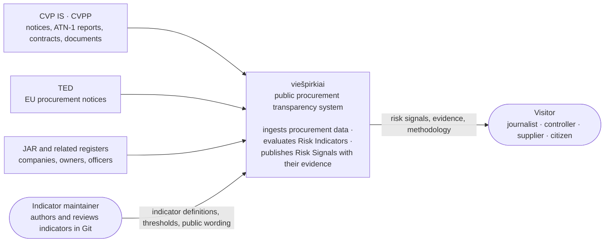
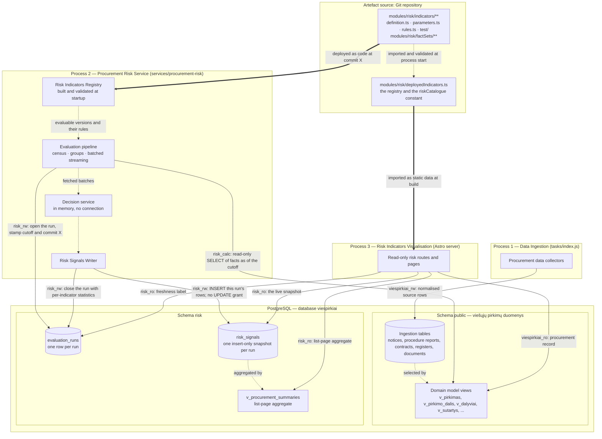
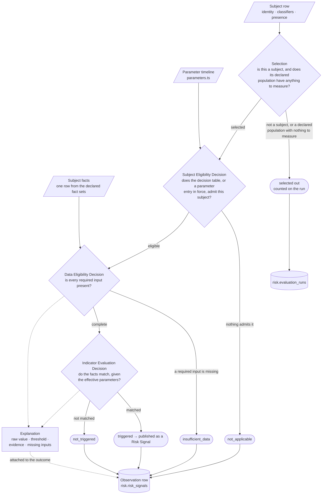
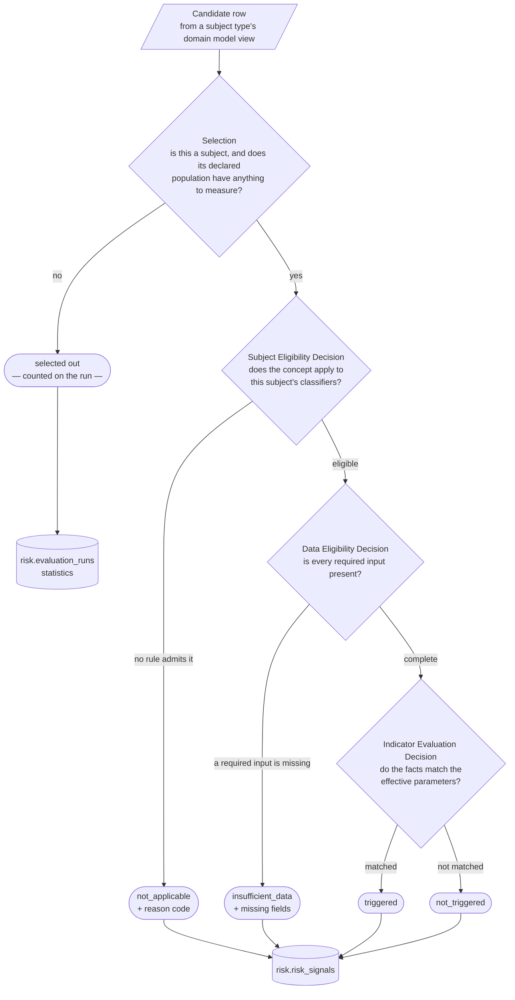
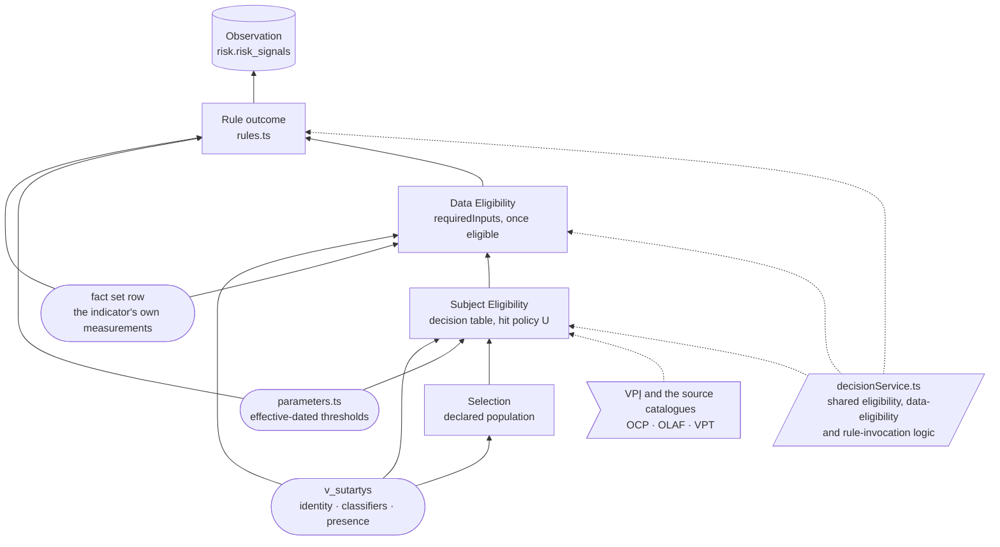
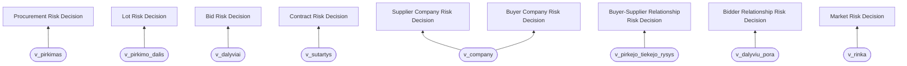
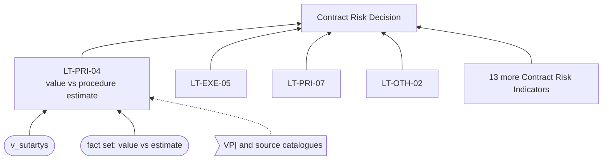
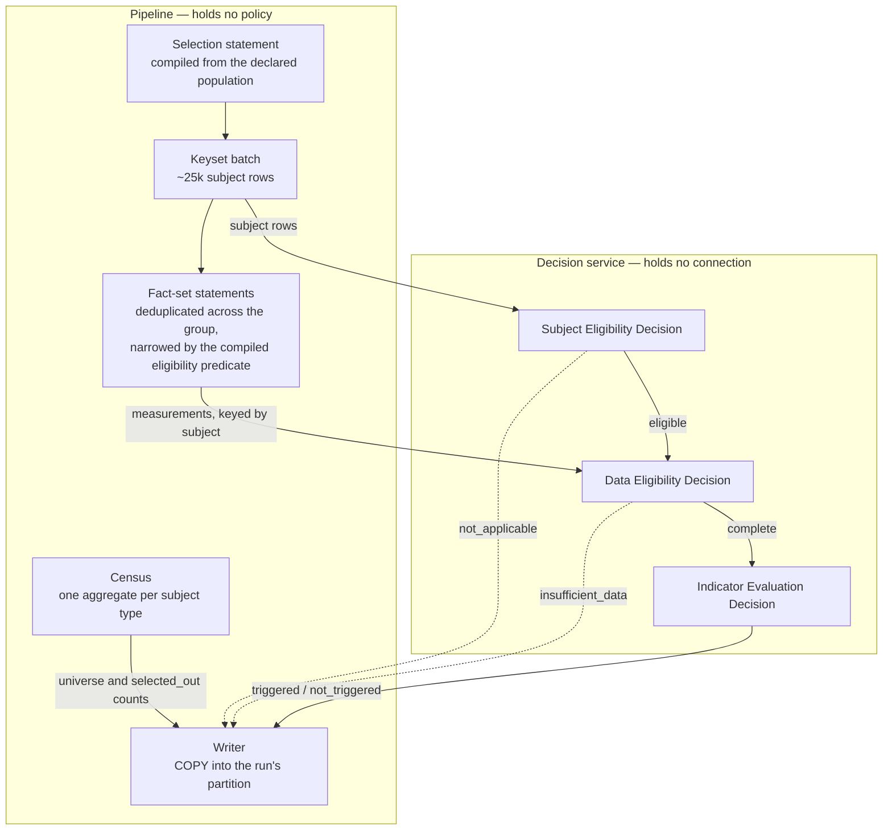
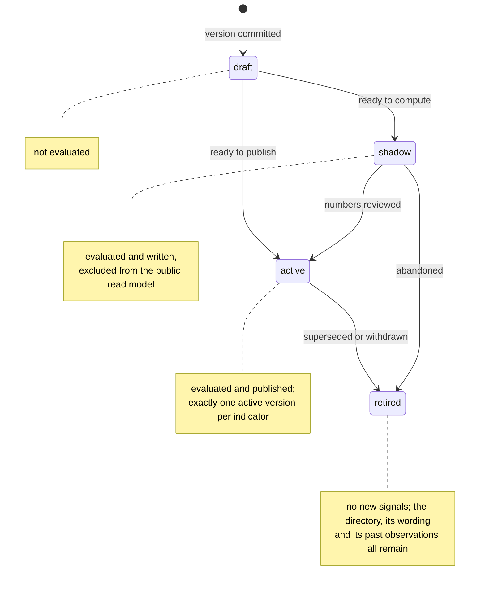

# Procurement Risk Service Architecture

Status: architecture

Core
methodology: [OCP 2024 Red Flags in Public Procurement](https://www.open-contracting.org/wp-content/uploads/2024/12/OCP2024-RedFlagProcurement.pdf)

Indicator catalogue: [Canonical Lithuanian catalogue](indicators-canonical.md)

Database schema: [`risk-schema.md`](risk-schema.md)

Parent design: [Risk signals for current and recently completed procurements](risky-procurements-initial-design.md)

## 1. Overview

The Procurement Risk Service turns the procurement facts viešpirkiai already ingests into **Risk Signals**: named,
versioned, publicly explained reasons to review one procurement. A signal states what was measured, what it was compared
against, which indicator version decided it and what could legitimately explain it — a signal is a reason to look, never
a finding of wrongdoing.

The system is a small business rules system over a procurement database. A **Risk Indicator** is a rule set with
effective-dated parameters and public wording; an **evaluation run** applies every deployed indicator to every
applicable subject at one cutoff and records the outcome; the website publishes the outcomes of the newest completed
run. The whole indicator catalogue lives in the Git repository, and PostgreSQL holds only results and run control state.

The stack is **TypeScript + PostgreSQL**, with no separate analytics, rules or orchestration platform. PostgreSQL
provides durable coordination and set-based computation; TypeScript provides the indicator catalogue, rule evaluation,
validation and operational control.

### 1.1 System context

**Diagram: viešpirkiai and the actors and source systems around it.**



Risk pages never restate the procurement record. They link to the existing procurement page and to the original CVP
IS/CVPP documents, which stay authoritative.

### 1.2 Containers

The system has exactly three processes, each with a single business purpose, its own deployment lifecycle, its own
database role and its own failure mode. **Committed PostgreSQL rows are the only integration between them, and the
domain model is the only vocabulary in which they are read.**

| # | Process                           | Business purpose                                                                       | Deployed as                                    | Writes                                         | Reads                                                                                |
|---|-----------------------------------|----------------------------------------------------------------------------------------|------------------------------------------------|------------------------------------------------|--------------------------------------------------------------------------------------|
| 1 | **Data Ingestion**                | Fetch, normalise and version public procurement records                                | Existing task runner (`tasks/index.js`)        | `public` ingestion tables only                 | Public sources: CVP IS, CVPP, TED, JAR, documents                                    |
| 2 | **Risk Indicators Processing**    | Evaluate every applicable Risk Indicator, one at a time, and record the outcomes       | **Procurement Risk Service**, its own process  | `risk.evaluation_runs` and `risk.risk_signals` | `public` domain model views; the deployed Git catalogue                                 |
| 3 | **Risk Indicators Visualisation** | Show a procurement's risk signals, methodology and evaluation coverage to the public   | Existing Astro web application                 | Nothing                                        | `risk` tables and views read-only; the `riskCatalogue` constant; the procurement record via the domain model |

**Process 2 never reads an ingestion table.** It reads the domain model views defined in
[`domain-model.md`](domain-model.md), and that is a contract rather than a habit: ingestion owns its table layout and
changes it — a source gets replaced, a table family gets renamed — while the domain model's entity names, keys and
grains stay put. An indicator written against `v_pirkimo_dalis` and `daliesNumeris` survives that; one written against
whichever tables happened to back it that quarter does not.

**Diagram: containers, the schemas they use and the role each connection holds.**



Database roles make the separation enforceable rather than conventional
([`migrations/risk/002_roles.sql`](../../migrations/risk/002_roles.sql)):

| Role                         | Used by                                                          | Grants                                                                                                                  |
|------------------------------|------------------------------------------------------------------|-------------------------------------------------------------------------------------------------------------------------|
| `viespirkiai_rw`             | Process 1                                                        | Read/write on `public`                                                                                                  |
| `risk_calc`                  | Process 2, during a calculation                                  | `SELECT` on the `public` domain model views, used inside a read-only transaction with a statement timeout                  |
| `risk_rw`                    | Process 2, for recording results, and the scheduled retention job | `SELECT`, `INSERT`, `UPDATE` on `risk.evaluation_runs`; `SELECT`, `INSERT`, `DELETE` on `risk.risk_signals`, no `UPDATE` |
| `risk_ro` / `viespirkiai_ro` | Process 3                                                        | `SELECT` on the `risk` tables and views and on the `public` domain model views                                             |

`risk_rw` can never alter a written signal in place — there is no `UPDATE` grant on `risk.risk_signals` — but it does
hold `DELETE`, because it is also the role the retention job runs as. Indicator results are derived and recalculable, so
removing a whole superseded snapshot needs no separate credential; immutability of a *written* row is what matters.

Risk evaluation is a separate process rather than a task in `runner/TaskRunner.js`, whose `mode`/`schedule`/`cooldown`
shape would otherwise fit, because four kinds of isolation are load-bearing:

- **Roles.** The grants above are only enforceable if the calculating process connects as `risk_calc`/`risk_rw` and the
  web process as `risk_ro`, each with its own credentials.
- **Blast radius.** A run performs long analytical scans over the whole corpus. Its own process and connection pool keep
  that work away from ingestion, which is the one thing that must keep working.
- **Deployment lifecycle.** Activating an indicator version deploys one commit to the risk service and the web
  application together ([§8.2](#82-adding-a-risk-indicator)), on a schedule independent of ingestion releases.
- **Packaging.** The web bundle imports the indicator definitions and reads the `riskCatalogue` constant. That import
  crosses no process boundary: the definitions are plain TypeScript and Zod, they open no database connection, and
  fact-set SQL is read lazily at calculation time, so nothing in `services/procurement-risk/` reaches the web bundle.

The separation buys four operational properties: a broken ingestion refresh leaves the last computed signals visible,
labelled with their older cutoff; a failing indicator is contained to its own rows; a web deployment cannot mutate risk
results; and rewriting an indicator's rules touches neither ingestion nor web code.

### 1.3 Components of one evaluation

Solid arrows are runtime data flows, labelled with the data crossing the boundary. Dotted arrows are code or
configuration dependencies.

**Diagram: data flow from ingested facts to published risk signals.**

```mermaid
flowchart LR
    subgraph ingestion["Process 1 — Data Ingestion and the state it publishes"]
        S["Procurement data collectors"]
        C[("Domain model facts<br/>schema public")]
        S -->|" normalised procurement records "| C
    end

    subgraph processing["Process 2 — Risk Indicators Processing"]
        M["Git: Risk Indicator definitions,<br/>rules and effective-dated parameters"]
        G["Risk Indicators Registry"]
        K["Risk Indicators Run Job"]
        I["Risk Indicator evaluation<br/>collect facts in SQL, decide in TypeScript"]
        T["Risk Signal Validator"]
        P["Risk Signals Writer"]
        M -.->|" deployed code, loaded and validated at startup "| G
        G -.->|" evaluable versions and their rules "| K
        G -.->|" declares the output contract "| T
    end

    subgraph storage["Schema risk — written only by Process 2"]
        J[("evaluation_runs")]
        H[("risk_signals")]
        R["v_procurement_summaries"]
        H -.->|" aggregated at query time "| R
    end

    subgraph visual["Process 3 — Risk Indicators Visualisation"]
        A["Astro read-only routes"]
        U["Public risk pages and API"]
        A -->|" rendered HTML or JSON response "| U
    end

    K -->|" one open run, stamped with cutoff and commit "| J
    K -->|" cutoff, subject filter and effective parameters "| I
    C -->|" domain model facts as of the cutoff "| I
    I -->|" observation rows "| T
    T -->|" validated rows "| P
    P -->|" append this run's snapshot "| H
    P -->|" per-indicator statistics, terminal state "| J
    H -->|" the live snapshot "| A
    R -->|" list page ordering and counts "| A
    J -->|" freshness label "| A
```



| Component                   | Process | Concrete form                                                          | Responsibility and boundary                                                                                                                                              |
|-----------------------------|---------|------------------------------------------------------------------------|--------------------------------------------------------------------------------------------------------------------------------------------------------------------------|
| Procurement data collectors | 1       | Existing scrapers and importers                                        | Fetch and normalise public source data into `public`. They hold no permission on `risk`.                                                                                 |
| Domain model facts          | 1       | The views of [`domain-model.md`](domain-model.md)                       | Present procurements, notices, lots, bids, contracts, relationships, markets, buyers and suppliers as business entities with stable keys, so an indicator never names an ingestion table and survives the warehouse being restructured. These are the reproducible facts read at the cutoff. |
| Risk Indicators Registry    | 2       | `modules/risk/registry.ts`, built from the deployed code at startup    | Resolves `(indicator id, version)` to one validated Risk Indicator, and answers which versions are active, shadow or retired ([§5.3](#53-decision-requirements-how-a-risk-decision-composes-risk-indicators)). |
| Risk Indicators Run Job     | 2       | `services/procurement-risk/runJob.ts`                                  | Opens the run, takes the census, plans the evaluation groups, executes them, records per-indicator statistics, closes the run. Indicator-independent: one failure is recorded and the run continues ([§6.5](#65-the-run-job)). |
| Evaluation group pass       | 2       | `services/procurement-risk/groupPass.ts`                               | Streams one `(subject type, profile)` population in keyset batches and fetches its deduplicated fact sets. Holds no policy ([§6.4](#64-one-group-pass)).                   |
| Decision service            | 2       | `modules/risk/decisionService.ts` plus one indicator directory ([§5.1](#51-the-risk-indicator-directory)) | Decides eligibility, data eligibility and the rules over rows already fetched. Pure: it opens no connection and reads no clock ([§6.1](#61-the-pipeline-and-the-decision-service)). |
| Risk Signal Validator       | 2       | `RiskIndicator.validateObservations` plus the output contract          | Validates field types, allowed states, subject and indicator identity, and duplicate subject keys, before any row reaches the writer. SQL safety comes from the read-only role, transaction and statement timeout. |
| Risk Signals Writer         | 2       | `services/procurement-risk/write.ts`                                   | `COPY`s validated rows into the open run's partition, one batch at a time. It compares nothing and updates nothing.                                                        |
| Evaluation run              | 2       | `risk.evaluation_runs`                                                 | One durable row per run: cutoff, code commit, terminal state, per-indicator statistics. It answers whether the job ran and whether it succeeded.                          |
| Risk signals                | 2 → 3   | `risk.risk_signals`                                                    | One immutable snapshot per run: outcome, evidence, indicator version, applied parameters and cutoff.                                                                      |
| Procurement summary         | 2 → 3   | `risk.v_procurement_summaries`                                         | Aggregates the live snapshot per procurement for list-page counts, ordering and filters.                                                                                  |
| Astro read-only routes      | 3       | Existing web application on a read-only role                           | Query the live snapshot, the summary view and the run row; read all indicator wording from the `riskCatalogue` constant.                                                  |

A cron schedule guarantees that a run eventually starts. A PostgreSQL `NOTIFY` from ingestion is an optional wake-up
hint that shortens the delay between a source refresh and the next run.

### 1.4 Where the state lives

Risk state lives in four places, and only one of them is outside PostgreSQL.

| Area            | Where                              | Contents                                                                                              | Written by                     | Retention                                                                |
|-----------------|------------------------------------|-------------------------------------------------------------------------------------------------------|--------------------------------|--------------------------------------------------------------------------|
| **Definitions** | Git — `modules/risk/indicators/**`, `modules/risk/factSets/**` | Identity, versions, lifecycle, public wording, selection, eligibility, effective-dated parameters, measurement statements, rules, tests | A reviewed, merged pull request | Forever, as repository history                                    |
| **Runs**        | `risk.evaluation_runs`             | One row per run: cutoff, code commit, state, the census, per-indicator coverage statistics            | Process 2                      | Forever; ~365 rows a year                                                |
| **Signals**     | `risk.risk_signals`                | One insert-only snapshot per run: every in-scope `(subject, indicator)` outcome with its evidence and parameters | Process 2            | Snapshots older than the window are deleted, except the live one         |

The flow is one-way — **definitions + facts → outcomes** — and it is what makes a stored row
self-sufficient. Because definitions live outside the database, each row carries the indicator id, the implementation
version, the exact parameter values applied, the run that produced it (and therefore the code commit) and the structured
evidence. That row stays explainable years later, and it stores no display text, so correcting Lithuanian wording is a
commit rather than a rewrite of history.

PostgreSQL holds nothing that is itself a reviewed policy — **the service produces one thing: Risk Signals.** A
formally reviewed register of legal obligations (which facts Lithuanian law requires, effective-dated, with a citable
basis) is a plausible later addition — it would let the Data Eligibility Decision distinguish *why* a fact was expected
— but recording that reasoning is a decision-trace concern, and the service does not produce decision traces yet
([§3.6](#36-the-data-eligibility-decision), [§10](#10-limitations)).

## 2. Domain language

### 2.1 Terms

The service uses business rules vocabulary, and each term maps to exactly one artefact:

| Term                     | Meaning                                                                                                                                   | Lives in                                                       |
|--------------------------|---------------------------------------------------------------------------------------------------------------------------------------------|----------------------------------------------------------------|
| **Procurement Risk Assessment** | The business process this whole service implements: turning ingested procurement facts into Risk Signals ([§5.3](#53-decision-requirements-how-a-risk-decision-composes-risk-indicators)) | The Procurement Risk Service, end to end |
| **Risk Decision**        | The decision that produces every Risk Signal for one subject type, by requiring the outcome of every Risk Indicator declared for it ([§5.3](#53-decision-requirements-how-a-risk-decision-composes-risk-indicators)) | One per subject type — Procurement Risk Decision, Contract Risk Decision, Supplier Company Risk Decision, … |
| **Risk Indicator**       | One versioned policy concept: what it means, whom it applies to, the rules that decide it, its parameter timeline, its public explanation and its tests | One directory in Git                                            |
| **Rule**                 | A condition over one subject's collected facts and the parameters in force for it                                                          | `rules.ts` in the indicator directory                          |
| **Parameter**            | A reviewed value a rule compares against, effective-dated and scoped                                                                       | `parameters.ts` in the indicator directory                     |
| **Selection**            | The population an indicator speaks about — declared, compiled into SQL, and storing nothing ([§3.4](#34-selection--the-subject-population)) | `selection` in `definition.ts`                                |
| **Fact set**             | One named measurement statement: one fact row per subject, fetched once per evaluation group                                               | `modules/risk/factSets/`                                       |
| **Decision**             | What evaluating one indicator against one subject yields: the outcome state plus the values that explain it                                | Returned by `rules.ts`, assembled into an observation          |
| **Outcome state**        | `triggered`, `not_triggered`, `insufficient_data` or `not_applicable`                                                                      | `state` on every stored row                                    |
| **Risk Signal**          | The public result of a `triggered` outcome: a reason to review this procurement                                                            | What `/rizikos` publishes                                      |
| **Observation**          | The stored row recording one decision — every outcome state, not only triggered ones                                                       | `risk.risk_signals`                                            |
| **Evaluation run**       | One pass of every evaluable indicator over every selected subject at one cutoff                                                            | `risk.evaluation_runs` plus one snapshot of observations       |
| **Evaluation group**     | One `(subject type, source profile)` population, fetched once and judged by every indicator that selected it ([§6.2](#62-evaluation-groups)) | Derived at startup; not declared                             |
| **Indicator catalogue**  | The set of deployed indicator versions                                                                                                     | `modules/risk/indicators/`, published as the `riskCatalogue` constant |

Storing every outcome, not only the matches, is what lets a page distinguish "checked, nothing found" from "not
evaluated" from "the calculation failed". The service records a fifth state, `calculation_error`, on an indicator's
behalf; it is not a decision, it is the absence of one.

Each indicator carries a canonical Lithuanian catalogue id of the form `LT-<AREA>-<NN>`
([canonical catalogue](indicators-canonical.md)), and records the source codes its concept derives from — `OCP-R003`,
`OLAF-CN29`, `VPT-I01` — as references. An OCP-derived indicator therefore stays traceable to OCP while remaining a
viešpirkiai indicator with its own version, wording and thresholds.

### 2.2 Identifiers are English, labels are Lithuanian

**Every identifier in the Procurement Risk Service is English** — schema, tables, columns, TypeScript fields, SQL
aliases, roles, module paths and enum values. The concepts already have settled names in international and EU
procurement-fraud terminology, and the service should use them. Lithuanian survives as **label values** the GUI renders
(`titleLt`, `descriptionLt`, `limitationLt`, `formulaLt`), which live in the indicator catalogue in Git.

The rest of the repository follows the opposite convention, so the boundary is worth stating exactly: the **domain
model** keeps its Lithuanian business names (`v_pirkimas`, `pirkimoNumeris`, `tiekejoKodas`, `daliesNumeris`), because
those are the names the domain actually has and translating them would invent a second vocabulary for the same
concepts. A collection statement crosses the boundary in exactly one place, and the rule is positional: **Lithuanian on
the left of an `AS`, English on the right**. Everything downstream of that statement is English, because it is already
inside the risk service.

That boundary sits on the domain model, not on the warehouse. A collection statement names `v_pirkimo_dalis` and
`daliesNumeris`; it never names the ingestion tables underneath, and it does not have to know whether those were
renamed last week ([§3.4](#34-selection--the-subject-population)).

### 2.3 The decision model of one indicator

Evaluating one indicator against one subject is a chain of decisions, not a single rule test. One **selection** step and
two **eligibility decisions** run before the indicator's own rules, and each has its own disposition, which is why an
absent signal is readable.

The four steps are named for what they do rather than numbered, because the first is categorically unlike the other
three: **a selection removes a population and stores nothing; a decision judges one subject and stores a row that says
why.**

| Step                              | Kind      | Removes / decides                                          | Leaves behind                        |
|-----------------------------------|-----------|------------------------------------------------------------|--------------------------------------|
| **Selection**                     | filter    | Rows that are not subjects, and populations that can never carry the facts | a counted, reasoned population statement |
| **Subject Eligibility Decision**  | decision  | Subjects the indicator's concept does not cover             | `not_applicable` + reason code       |
| **Data Eligibility Decision**     | decision  | Subjects missing a fact the indicator requires               | `insufficient_data` + missing fields |
| **Indicator Evaluation Decision** | decision  | Whether the facts match the effective parameters            | `triggered` / `not_triggered`        |

**Diagram: the decisions that produce one observation.**



Ownership of each step is deliberate. **Selection and both eligibility decisions are executed by shared code**, from
declarations the indicator makes and reviews, so an indicator cannot publish a `triggered` signal that no reviewed
threshold stands behind, and cannot report a data gap about a field it never declared as `requiredInputs` — the code
paths that would do so do not exist. **The rules and the explanation are the indicator's own**, and live in its
`rules.ts` because they are the part a reviewer actually reads. **Identity, subject, applied parameters and the cutoff
are shared too**, stamped onto the observation by the machinery, so no indicator can get them wrong.

[§3](#3-evaluation-population-and-eligibility) specifies the three steps before the rules, and why the difference
between them is the difference between an honest absence and a fabricated one. [§6](#6-evaluation-run) specifies the
pipeline that executes them.

## 3. Evaluation population and eligibility

An indicator is a statement about a kind of subject, and the corpus contains many subjects that kind does not cover. A
rule about how a competitive procedure was run has nothing to say about a verbal low-value purchase that never had a
procedure; a rule that reads the procurement method has nothing to say about a notice ingested from a source that does
not carry the method at all. Both cases end with no signal, and the reason they end there is different, and the
difference is the whole of this section.

Left to each indicator, that reasoning is written 106 times, inconsistently, inside `rules.ts`, where a reviewer meets
it as a chain of null checks rather than as a policy. This section makes it shared, declarative and measurable:
**an indicator declares the population it speaks about and the facts it needs, and the machinery decides the rest.**

The section is the **decision model** — what decides what, from which reviewed artefact, and with which disposition. It
says nothing about how the work is executed; that is [§6](#6-evaluation-run), and the separation is deliberate
([§6.1](#61-the-pipeline-and-the-decision-service)).

### 3.1 The measurement that forces the design

Measured against `viespirkiai` on **2026-08-18**; the counts are `count(*)`, not planner estimates. Full measurement in
[`domain-model.md` §5](domain-model.md#5-measured-coverage).

`v_pirkimas` combines two publication sources whose column coverage is not comparable. Every column below is counted
non-null:

| `saltinis`            |     Rows | Procedure method | Status | Estimated value | Submission deadline | CPV codes | EU funding |
|-----------------------|---------:|-----------------:|-------:|----------------:|--------------------:|----------:|-----------:|
| `cvpis` (primary)     |   50,893 |             100% |   100% |           33.8% |               98.4% |     99.9% |      76.6% |
| `cvpp` (fallback)     |  213,522 |               0% |     0% |              0% |              100.0% |        0% |         0% |

A `cvpp` procurement carries a title, a buyer, a publication date and a submission deadline. It carries **no method, no
status, no estimated value, no CPV and no funding flag, and it never will** — the fallback source does not publish
them. Of the 28 procurement-grain canonical indicators, the ones that read a method, a value, an object type or a CPV
code therefore have a real population of **50,893**, not 264,415 — and, where the estimated value is required, of
**17,200**.

The contract side is the case that prompted this section. Non-deleted contracts by type, with how their link to a
procurement resolves:

| Contract type            |      Rows | Number required?            | Resolves to `cvpis` | Resolves to `cvpp` only | Present but unresolvable |      NULL |
|--------------------------|----------:|-----------------------------|--------------------:|------------------------:|-------------------------:|----------:|
| `PPS`                    |   309,116 | **yes**                     |               6,434 |                 129,041 |                   37,156 |   136,485 |
| `TSP`                    |   157,242 | **yes**                     |              21,933 |                  74,148 |                   11,471 |    49,690 |
| `SP` (amendment)         |   130,009 | inherited                   |                   — |                       — |                        — |    65,760 |
| `MVPŽ`, `MVP`, `ŽS`, `SPŽ`, `Ilgalaikė MVPŽ`, `VS`, `PSĮ`, unset | 5,309,875 | **no — exempt or optional** | — | — | — | 4,971,171 |

Read the two rows that matter together. Only **28,367 of 5,906,258 contracts (0.48%)** are both legally obliged to
carry a procurement number and actually resolve to a `cvpis` notice — the only source that carries the procedure facts
a contract-versus-procedure rule needs. A further **234,802** are obliged to carry one and do not: 186,175 with no value
at all and 48,627 with a value that resolves to nothing. And **5,309,875** are either exempt from CVP IS or use it only
at the buyer's option, so their missing number is not a gap at all.

Those three groups must not receive the same answer, and today they would:

- the 5,309,875 exempt-or-optional contracts are **not subjects of this indicator** — saying "insufficient data" about
  them asserts a gap that does not exist and buries the real one under a hundredfold larger number;
- the 234,802 obliged-but-absent contracts are **exactly the finding** — this is
  [`domain-model.md` §6.3](domain-model.md#63-high-missing-procurement-number-on-contracts), and the risk service is the
  natural place for it to become visible;
- the 28,367 linked contracts are the only ones a rule can actually decide.

**The same absent value means three different things depending on facts the indicator itself does not carry.** That is
why eligibility cannot live in `rules.ts`.

### 3.2 The four dispositions of a subject

Evaluating one indicator against one candidate row resolves to one of four dispositions. Three produce a stored
observation; one is a population statement recorded once per run.

| Disposition           | Stored?                    | Means                                                                                                                | Carries                        |
|-----------------------|----------------------------|------------------------------------------------------------------------------------------------------------------------|--------------------------------|
| **selected out**      | no; counted on the run     | The row is not a subject of this type, or belongs to a declared population the indicator never measures                | a per-run count and reason     |
| **`not_applicable`**  | yes                        | Selected in, but the indicator's concept does not apply to this subject                                                | a reason code                  |
| **`insufficient_data`** | yes                      | Applies, and a fact this indicator requires is missing                                                                 | the missing fields and why     |
| **`triggered` / `not_triggered`** | yes            | Decided                                                                                                                | raw value, threshold, evidence |

The line between the silent disposition and `not_applicable` is the one worth stating precisely, because it is what
keeps the snapshot from being dominated by rows that say nothing:

> **Selection removes a population. Eligibility judges an individual.**

Selection is decided from the profile a row belongs to, or from whether it is a subject at all, and is the same answer
for every row in that population, so enumerating it 5.3 million times per indicator per run stores no information a
single sentence on the methodology page does not already carry. Eligibility is decided from this subject's own
classifier values, differs row by row, and is something a reader of one procurement page legitimately wants to see:
*this indicator was considered here and does not apply, because…*

Left there, that line would be a matter of taste, and the most consequential mistake this design admits is drawing it
one population too wide — selecting out the subjects whose missing fact is the finding.
[§3.3](#33-drawing-the-line-between-not_applicable-and-insufficient_data) is what makes an indicator's author responsible
for drawing it correctly rather than leaving it to the reader to notice it was drawn wrong.

**Diagram: the steps one candidate row passes, and where each disposition leaves it.**



The steps fall either side of the fetch, and that is what decides where each one runs. **Selection runs in SQL**,
because it decides which rows are read at all — the subject type's domain model view is the statement's `FROM` and the
declared population is compiled into its `WHERE`, so a subject with no observation is never fetched. **The three
decisions run in TypeScript**, over rows that were fetched, because each of them produces a stored row. The rule is
therefore simple to hold: *if it stores nothing, it happens in SQL; if it stores a row, it happens in TypeScript.* That
extends the split [§5.1](#51-the-risk-indicator-directory) already draws between measurement and decision one step
earlier — SQL narrows the population, TypeScript judges the individual.

The one qualification is an optimisation, not an exception: the Subject Eligibility Decision is a finite decision table
over a closed vocabulary, so its *eligible* region also compiles to SQL, and the pipeline uses that compiled form to
avoid computing measurements for rows it is about to decline. The decision itself still runs in TypeScript, over every
selected row, and a test proves the two forms agree ([§6.4](#64-one-group-pass)).

### 3.3 Drawing the line between `not_applicable` and `insufficient_data`

All three ways a subject can leave the pipeline without a decision — selected out, `not_applicable`,
`insufficient_data` — turn on one question: **was this subject expected to carry the fact it lacks?** The rule that
follows is one sentence in two halves:

> **Expected absence is `not_applicable`. Unexpected absence is `insufficient_data`.**
> An indicator may report `insufficient_data` only about a field it declared in `requiredInputs`, for a subject its own
> `eligibility` table has already admitted.

There is no shared, database-resident legal-obligation registry backing that line. The indicator's own `eligibility`
decision table ([§3.5](#35-the-subject-eligibility-decision)) and its `requiredInputs` list
([§3.6](#36-the-data-eligibility-decision)) are the only artefacts that draw it, and both are reviewed in the same pull
request as the rest of the indicator. That is a deliberate simplification: the service publishes Risk Signals and
nothing else, and a formally reviewed, effective-dated obligation register — with its own migration, its own
`legal_basis` citations and its own startup gate — is a decision-trace artefact in its own right, useful once the
service needs to *explain a decision* rather than *state one*. It is a plausible later addition, not a v1 concern
([§10](#10-limitations)).

#### `not_published_by_source` — a route, not a party

Most `not_applicable` reason codes ([§3.5](#35-the-subject-eligibility-decision)) describe a subject: this contract type
is exempt, this procedure has not reached the stage the rule judges. `not_published_by_source` describes something
different — a **publication route**: the channel this subject reached us through does not carry the fact, for every row
in that channel, and no ingestion gap is responsible. A `cvpp` procurement has no procedure method for that reason, and
no buyer failed to supply one.

That is worth naming distinctly from an ordinary exemption, because the two say different things in public: an
exemption means the concept does not apply here; a route gap means the concept may well apply, but the transparency
channel does not show it — worth stating on the methodology page even though nobody is answerable for it. It is also
the reason code most capable of quietly hiding a real defect, so an indicator that uses it should point at the
measurement that justified it ([§3.1](#31-the-measurement-that-forces-the-design)), and its fact set's integration test
should assert the field really is never observed non-null within that profile
([§9](#9-tests-and-automated-safeguards)).

#### An author's line, not a machinery-enforced gate

Applied to the contract measurement of [§3.1](#31-the-measurement-that-forces-the-design), the line sorts the three
populations an indicator reading `procurementId` must not conflate:

| Population                                            |      Rows | Why                                                                                        | Disposition                                 |
|------------------------------------------------------|----------:|---------------------------------------------------------------------------------------------|----------------------------------------------|
| Exempt or optional contract types                     | 5,309,875 | not this indicator's concern — out of `selection`, or `not_applicable` from `eligibility`   | selected out, or `not_applicable`             |
| `TSP`/`PPS` whose number resolves only to `cvpp`      |   203,189 | the linked notice never carries the procedure facts                                          | `not_applicable`, `not_published_by_source`   |
| `TSP`/`PPS` obliged to carry a number and lacking one |   234,802 | in scope, and the field this indicator declared required is missing                          | `insufficient_data`                           |

**Getting this wrong is the most consequential mistake this design admits.** Drawing `selection` or `eligibility` one
population too wide silently removes the subjects whose missing fact is the finding, and — unlike a design with a
shared obligation gate — nothing catches that automatically before a run. [§3.1](#31-the-measurement-that-forces-the-design)'s
measurement exists precisely so a reviewer checks a table like the one above against real counts before approving an
indicator, and the coverage identity of [§3.8](#38-coverage-is-a-published-number) catches a population that goes
missing *after* deployment, even though it cannot catch one drawn wrong from the start. That gap — no automated proof
that an excluded population was legitimately excluded — is the trade this section makes explicit rather than hides. A
shared, machine-checkable obligation register would close it, and is exactly the kind of thing worth building once the
service needs it ([§10](#10-limitations)).

`not_applicable` stays reserved for absences the world itself contains. Where an entire publication route is affected,
the honest treatment is neither `not_applicable` nor `insufficient_data` but Selection: the population is not
evaluated, and that is stated once, with a count, rather than once per row.

### 3.4 Selection — the subject population

Each of the nine catalogue subject types resolves to **exactly one entity of the
[domain model](domain-model.md)**, and every selection and every fact set reads from that entity. This is the single change
that answers "which entities does this indicator run on", because after it there is one definition per subject type
rather than one per indicator — and because the entity is a business concept, an indicator survives the warehouse
being restructured underneath it.

| Subject type                  | Domain model view         | Subjects  | Indicators |
|-------------------------------|---------------------------|----------:|-----------:|
| `procurement`                 | `v_pirkimas`              |   264,415 |         28 |
| `lot`                         | `v_pirkimo_dalis`         |    48,564 |         17 |
| `bid`                         | `v_dalyviai`              |    36,793 |         11 |
| `contract`                    | `v_sutartys`              | 5,906,258 |         17 |
| `supplier`                    | `v_company`, as supplier  |    80,479 |         10 |
| `buyer`                       | `v_company`, as buyer     |     6,103 |          3 |
| `buyer_supplier_relationship` | `v_pirkejo_tiekejo_rysys` | 1,090,112 |          5 |
| `bidder_relationship`         | `v_dalyviu_pora`          |    19,989 |         12 |
| `market`                      | `v_rinka`                 |        45 |          3 |

**Every canonical indicator now has a subject to run on.** Buyer and supplier are roles of one entity rather than two
more views, so a company that both buys and sells is one subject with one identity
([domain model §1.1](domain-model.md#11-subject-entities)).

Each subject entity exposes three column groups Selection and the eligibility decisions depend on, on top of the
business attributes an indicator measures:

| Group           | Columns                                                                                                                                 | Purpose                                                              |
|-----------------|-----------------------------------------------------------------------------------------------------------------------------------------|----------------------------------------------------------------------|
| **Identity**    | `subject_key`, and the procurement source and number where the subject has one                                                          | Stamped onto the observation; `subject_key` is the durable composite  |
| **Classifiers** | `source_profile`, procedure type, contract type, object type, stage, event date, value, EU funding, CPV division                          | The only facts Selection and the Subject Eligibility Decision may test |
| **Presence**    | one named flag per fact class the entity may or may not carry — whether a lot was declared, whether its bidders were observed, whether a price is recorded | Whether the row carries a fact class, as a named fact rather than a null check |

The presence group is the direct answer to *"indicators are not able to simply understand that it is applicable to
certain data elements."* Without it every indicator rediscovers the same thing through its own `IS NOT NULL`
predicates, phrased slightly differently, and a reviewer cannot tell whether an omission was deliberate. Named on the
entity, the question is asked once, tested once, and reads the same way in every indicator.

`v_pirkimo_dalis` is the worked example, because a lot becomes known two independent ways. `deklaruota` says the buyer
declared the lot in the procurement notice; `stebeta` says participants were observed competing in it. Of 48,564 known
lots, 43,755 were declared, 13,396 have observed participation, and 8,510 have both. A rule about competition needs
`stebeta`; a rule about how a procurement was structured needs only `deklaruota`. Before those flags existed, both rules
would have read
the same null and drawn different conclusions from it — and the second would have been wrong.

**Classifiers are a closed vocabulary.** Selection and the Subject Eligibility Decision may test nothing else. That
restriction is what keeps eligibility reviewable as a table: if an exclusion needs a fact outside this list, it is not
eligibility, it is a rule, and it belongs in `rules.ts` where it will be explained to the public.

#### Source profiles

A **source profile** is a named, stable statement about *which fact classes a subject can carry*, decided by which
publication route produced it. It is not a data-quality score and not a per-row null pattern: a `cvpp` procurement
lacks the method because the fallback source never publishes one, for every row, forever.

The profiles the measurement in [§3.1](#31-the-measurement-that-forces-the-design) establishes:

| Subject type  | `source_profile`             | Definition                                                             | Rows      | Carries                                                 |
|---------------|------------------------------|-------------------------------------------------------------------------|----------:|---------------------------------------------------------|
| `procurement` | `cvpis`                      | Published through CVP IS                                               |    50,893 | Method, status, object type, CPV, funding, deadline     |
| `procurement` | `cvpp`                       | Known only through the CVPP fallback                                   |   213,522 | Title, buyer, publication date, deadline — nothing else |
| `contract`    | `procedure_linked_cvpis`     | `TSP`/`PPS` whose number resolves to a `cvpis` procurement             |    28,367 | The contract, and its full procedure context            |
| `contract`    | `procedure_linked_cvpp`      | `TSP`/`PPS` whose number resolves only to a `cvpp` procurement         |   203,189 | The contract, and a procurement with no procedure facts |
| `contract`    | `procedure_expected_missing` | `TSP`/`PPS` with a number that is absent or resolves to nothing        |   234,802 | The contract only — **and this is a finding**           |
| `contract`    | `procedure_exempt`           | Types exempt from CVP IS or using it at the buyer's option, plus unset | 5,309,875 | The contract only, legitimately                         |
| `contract`    | `amendment`                  | `SP` — disposition inherited from the amended contract                 |   130,009 | The amendment; context via its parent                   |
| `lot`         | `deklaruota`                 | Declared in the procurement notice, participation never observed       |    35,168 | The lot and its name — no bidders, prices or rejections |
| `lot`         | `stebeta`                    | Participation observed through a procedure report                      |    13,396 | Bidders, offer ranking, prices, rejection reasons       |

**Every row of a subject type carries exactly one profile**, and the profiles of a subject type are exhaustive. That
partition property is not a tidiness preference: it is what makes the coverage arithmetic of
[§3.8](#38-coverage-is-a-published-number) additive and what lets the pipeline treat a profile as the unit of one data
pass ([§6.2](#62-evaluation-groups)). A view test enforces it.

#### Selection is declared, never hand-written

An indicator declares the population it speaks about; it does not write the query that fetches it. The declaration is
data in `definition.ts`, and shared code compiles it into the `WHERE` clause of the subject type's view:

```ts
selection: {
  profiles: ['procedure_linked_cvpis', 'procedure_expected_missing', 'amendment'],
  require:  ['contractSigned'],   // presence flags only — the closed vocabulary of §3.4
},
```

Two things follow from it being a declaration rather than a statement. The **population is defined once per subject
type** rather than once per indicator, so 106 indicators cannot drift into 106 slightly different ideas of what a
contract is, and an indicator survives the warehouse being restructured underneath it. And the declaration is
**mechanically checkable** against the census at run time — the count of rows a `selection` declaration removes is
always answerable, even though [§3.3](#33-drawing-the-line-between-not_applicable-and-insufficient_data) is candid that
nothing today checks it was the *right* count to remove.

`require` names presence flags, never arbitrary predicates. A flag makes a row *not a subject* — an unsigned contract is
not yet a contract to judge — and each named flag is counted separately by the census, so "how many rows did this
exclusion remove?" is always answerable. An exclusion that cannot be expressed as a profile or a presence flag is not
Selection; it is an eligibility decision and it stores a row.

Everything not selected is removed silently but not invisibly: the count and the reason land in the run's `statistics`,
and the methodology page publishes them ([§3.8](#38-coverage-is-a-published-number)).

#### A worked example

For a contract indicator that compares the final contract value against the procedure's estimate:

| Profile                      |      Rows | Disposition                                                             |
|------------------------------|----------:|--------------------------------------------------------------------------|
| `procedure_exempt`           | 5,309,875 | **selected out** — no CVP IS procedure exists to compare against        |
| `procedure_linked_cvpp`      |   203,189 | **selected out** — the linked notice carries no estimated value, ever   |
| `procedure_expected_missing` |   234,802 | selected → `insufficient_data`, missing `procurementId`                 |
| `procedure_linked_cvpis`     |    28,367 | selected → decided, or `insufficient_data` where the estimate is absent |
| `amendment`                  |   130,009 | selected → inherits the parent contract's disposition                   |

The snapshot for that indicator falls from 5.9 million rows to roughly 263,000 with a further 130,000 inherited, and —
the point of the exercise — **the 234,802 rows that remain are the ones a reader should see.** Note which two rows the
author's `selection` declaration excluded and which it deliberately did not: the reduction is 20-fold and it rests on
the author having drawn that line correctly, not on an automated check ([§3.3](#33-drawing-the-line-between-not_applicable-and-insufficient_data)).
Selection is not an optimisation that hides work; it is what makes the residue legible.

**Not every indicator shrinks.** A rule that reads only the contract row — a long framework duration, a high final
value — selects the whole non-deleted population, and its snapshot stays in the millions. Selection is a per-indicator
measurement, not a blanket reduction, which is why [§7.2](#72-one-insert-only-snapshot-per-run)'s sizing estimate must
be recomputed per indicator from its declared population rather than from the subject count.

### 3.5 The Subject Eligibility Decision

Eligibility is expressed as a **decision table over classifier columns**, in `definition.ts`, evaluated by shared
code. It is not a predicate function, and that is deliberate: a table can be diffed, reviewed, checked for overlap,
compiled to SQL and rendered on the methodology page, and a function cannot.

```ts
eligibility: {
  dimensions: ['contractType'],
  hitPolicy: 'unique',
  rules: [
    { contractType: ['TSP', 'PPS'],                      outcome: 'applicable' },
    { contractType: ['SP'],                              outcome: 'inherit', from: 'parentContract' },
    { contractType: ['MVP'],                             outcome: 'not_applicable',
      reason: 'cvpis_use_optional' },
    { contractType: ['MVPŽ', 'Ilgalaikė MVPŽ', 'SPŽ', 'ŽS', 'VS', 'PSĮ', null],
      outcome: 'not_applicable', reason: 'out_of_legal_regime' },
  ],
},
```

`hitPolicy: 'unique'` is the DMN term for *at most one rule may match*, and it is checkable at startup by exactly the
machinery [§5.5](#55-parameters-and-their-resolution) already runs over concurrently valid parameter scopes: the
dimensions are finite, so overlap and incompleteness are both decidable before a run starts. A table that leaves a
classifier value uncovered fails at startup rather than defaulting silently, because a silent default is how an
indicator quietly stops evaluating half its population.

`not_applicable` carries a **reason code from a closed vocabulary**, so the detail page can explain the absence and the
methodology page can count it:

| Reason code                | Means                                                                        |
|----------------------------|--------------------------------------------------------------------------------|
| `out_of_legal_regime`      | The legal regime this subject falls under contains no such obligation or event |
| `cvpis_use_optional`       | The system this indicator reads is optional for this subject                   |
| `procedure_type_excluded`  | The rule is defined for other procedure types                                  |
| `stage_not_reached`        | The subject has not reached the lifecycle stage the rule judges                |
| `subject_shape`            | The subject lacks the structure the rule needs — a cross-lot rule on one lot   |
| `no_parameter_entry`       | No reviewed parameter entry is in force for this subject at the cutoff         |
| `not_published_by_source`  | The publication route carries no such fact, and the indicator selected the profile in anyway |
| `inherited_not_applicable` | Inherited from a parent subject that is itself not applicable                  |

Three of those deserve a note. `no_parameter_entry` is the eligibility rule the architecture already had
([§2.3](#23-the-decision-model-of-one-indicator)) — it survives unchanged, now as one reason among several rather than
the only one. `stage_not_reached` is genuinely temporary: the subject will become eligible in a later run. That is
consistent rather than misleading only because every run re-decides every subject from scratch
([§7.2](#72-one-insert-only-snapshot-per-run)); a current-state model would have had to age the row out. And
`not_published_by_source` should normally be unreachable, because a well-drawn `selection` removes those populations
before this table ever sees them ([§3.3](#33-drawing-the-line-between-not_applicable-and-insufficient_data)); it exists
as the defensive arm for an indicator that deliberately selects such a profile in, and a run in which it is common is a
signal that the indicator's declared population is wrong.

**Inheritance is one hop and it is not recursive.** An `SP` amendment resolves its parent contract, takes the parent's
disposition, and stops. If the parent cannot be resolved the amendment is `insufficient_data` with the missing parent
recorded — not `not_applicable`, because the parent's existence is not in doubt, only our link to it.

Because the hop is single and non-recursive, **the parent's classifiers are carried as columns on `v_sutartys`**, beside
the amendment's own. Inheritance is then decided in memory from the row already fetched: no second query, no dependency
between one evaluation pass and another, and no ordering constraint on the pipeline
([§6.2](#62-evaluation-groups)).

### 3.6 The Data Eligibility Decision

Only after a subject is selected and eligible does the question "do we have the inputs?" become meaningful. Asking it
earlier manufactures a false gap: a data decline about a subject the indicator was never going to decide is noise in
exactly the channel this decision exists to keep clean. `requiredInputs` is a flat list of the fields the rules read:

```ts
requiredInputs: ['procurementId', 'estimatedValueEur', 'finalValueEur'],
```

Shared code applies one rule per field, for a subject the Subject Eligibility Decision has already admitted:

| Field present | Field absent                                     |
|----------------|----------------------------------------------------|
| continue       | `insufficient_data`, field listed in `missing_data` |

That is deliberately the whole rule. There is no `mandatory`/`conditional`/`optional`/`exempt`/`not_published`/`inherited`
taxonomy behind it, because that distinction is already made — by the `eligibility` table that ran first
([§3.5](#35-the-subject-eligibility-decision)) and, for an `SP` amendment, by the inheritance hop it resolves before
this table runs at all. A subject this table sees has already been told the concept applies to it; a required field it
still lacks is `insufficient_data`, full stop.

`missing_data` entries carry the field name, so *"Nepakanka duomenų"* on the detail page can say which fact is missing.
Explaining *why* its absence is a defect — the way [§3.3](#33-drawing-the-line-between-not_applicable-and-insufficient_data)'s
worked table does for `procurementId` — is presently carried by the indicator's own public wording (`limitationLt`)
rather than resolved automatically from a stored legal citation. A `legal_basis` on every `missing_data` entry, and a
shared read model aggregating gaps across indicators for the data team, are exactly what a future obligation register
would restore; today `missing_data` on each observation is the whole of what this decision produces
([§10](#10-limitations)).

### 3.7 What this changes in the indicator package

The package of [§5.1](#51-the-risk-indicator-directory) keeps its shape. Five things move, and one thing becomes
impossible.

| Change                                    | Before                                                | After                                                                    |
|-------------------------------------------|-------------------------------------------------------|---------------------------------------------------------------------------|
| Population definition                     | Each `collect.sql` wrote its own `FROM` and `WHERE`   | `FROM` the subject type's domain model view, one definition per subject type |
| Selection                                 | Implicit in that `WHERE`, invisible to review          | `selection` in `definition.ts`, compiled by shared code, counted on the run |
| Eligibility                               | Null checks in `rules.ts`, or the parameter timeline   | A decision table in `definition.ts`; the parameter timeline is one rule in it |
| Data eligibility                          | Ad-hoc null checks returning `insufficient_data`       | `requiredInputs`, checked once every eligible subject is already established |
| Measurement                               | One `collect.sql` per indicator, run once per indicator | Named fact sets, declared by reference and fetched once per group ([§6.4](#64-one-group-pass)) |
| **`rules.ts` returning `not_applicable`** | Possible                                               | **Removed from the `Decision` type it may return**                       |

That last row is the enforceable form of the whole section. A `rules.ts` reached by the Indicator Evaluation Decision
has already been told the subject is selected, eligible and sufficiently supplied; the only outcomes left to it are
`triggered` and `not_triggered`, and the type system says so. An indicator author cannot accidentally answer an
eligibility question with a data-quality state, because there is no return value for it.

What reaches SQL is worth stating exactly, since [§5.6](#56-where-each-kind-of-logic-belongs) forbids binding parameters
into it:

| Bound into a statement | Carries                                                        | Category                       |
|------------------------|----------------------------------------------------------------|--------------------------------|
| Cutoff                 | The run's clock                                                | *When* the facts are read      |
| Subject filter         | An explicit subject array for a backfill, or `NULL`            | *Whom* to evaluate             |
| Population             | The compiled `selection` predicate — profiles and presence flags | *Whom* to evaluate           |
| Eligible region        | The compiled eligibility predicate, on fact-set statements only | *Whom* it is worth measuring   |
| Keyset bounds          | The batch window ([§6.4](#64-one-group-pass))                  | *How much* at a time           |
| —                      | Thresholds                                                     | **Never** — resolved in TypeScript |

All of them answer *which facts, about whom, as of when*. None answers *is that bad*. The prohibition is on policy
reaching SQL, and a population declaration is not policy. The compiled eligibility predicate is the one that looks like
a borderline case and is not: it removes no row from any stored outcome, it only spares the database from computing
measurements for rows already declined in memory, and a test proves it agrees with the table it was compiled from.

**Diagram: the decision requirements of one indicator, in DMN notation.** Decisions are plain rectangles. Input Data is
rounded. The Business Knowledge Model — reusable decision logic invoked by more than one decision — has leaning sides.
The Knowledge Source is the flagged shape.



The diagram is worth drawing because it makes one property visible. **No decision reads an input or a knowledge source
belonging to a later step**: Selection reads only the subject row, eligibility never reads a measurement, data
eligibility never reads a threshold. That layering is what allows each step to be tested on its own, and it is why the
ordering can be asserted as a test rather than left to review ([§9](#9-tests-and-automated-safeguards)). It is also
what makes `decisionService.ts` a genuine Business Knowledge Model rather than three unrelated functions: the same
module evaluates every indicator's eligibility table, checks its `requiredInputs`, and invokes its `rules.ts`, so its
tests are shared across all 106 indicators rather than duplicated per indicator ([§5.2](#52-shared-machinery)).

What the diagram no longer shows is a shared *knowledge source* feeding both Selection and Data Eligibility — since
[§3.3](#33-drawing-the-line-between-not_applicable-and-insufficient_data) retired that shared artefact, keeping the two
from disagreeing about the same absent fact is the reviewer's job when reading an indicator's `selection`,
`eligibility` and `requiredInputs` together, not a structural guarantee.

### 3.8 Coverage is a published number

An indicator that silently evaluates 0.5% of its subject type is worse than one that does not run, because the page
looks the same. Every step therefore reports a count, and the run row carries them:

```
statistics[indicator] = {
  universe,                                   // rows in the subject type's view, from the census
  selected_out:      { <reason>: n, ... },    // selection — per profile and per presence flag
  selected,
  not_applicable:    { <reason>: n, ... },    // subject eligibility
  insufficient_data: { <field>: n, ... },     // data eligibility
  not_triggered, triggered,                   // indicator evaluation
  calculation_error,
  duration_ms, error
}
```

Those counts satisfy one arithmetic identity on a full run — one with no backfill subject filter narrowing the
population — and it is a test:

```
universe = Σ selected_out
         + Σ not_applicable
         + Σ insufficient_data
         + not_triggered + triggered + calculation_error
```

A step that loses rows fails that identity, which is the cheapest possible detector for the failure mode this section
exists to prevent — a population quietly falling out of evaluation.

**The identity is stronger than it looks, because its two sides have independent origins.** `universe` and every
`selected_out` term come from the census ([§6.3](#63-the-census)), an aggregate the database computes without fetching a
row; every other term is counted by the decision service as it produces observations. Nothing derives one side from the
other, so the check is a genuine reconciliation rather than a restatement — a fetch that silently drops a batch, a
keyset bound that skips a range, or a compiled predicate that disagrees with its table all show up as a shortfall.

That is not hypothetical. The profile counts of [§3.4](#34-selection--the-subject-population) sum to 5,906,242 against a
measured contract total of 5,906,258: **16 rows are in no profile**, and the census would have refused the run rather
than let one indicator quietly not speak about them. Resolving those 16 is a prerequisite for the first contract-grain
indicator, and finding them is the identity doing its job before it is even built.

The methodology page ([§4.3](#43-methodology-catalogue)) publishes the same numbers per indicator as a coverage table:
the population, what was excluded and why, and the share of the population that was actually decidable. Publishing "we
can decide this for 0.5% of contracts, and here is which 0.5%" is a stronger transparency claim than any signal count,
and it is the claim the measurement in [§3.1](#31-the-measurement-that-forces-the-design) obliges the service to make.

### 3.9 Practices this borrows, and what it leaves out

The model is assembled from established business-rules and data-validation practice rather than invented, and the
borrowings are deliberate and partial.

| Practice                                                                 | Taken                                                                                                            | Left out                                                                                        |
|--------------------------------------------------------------------------|------------------------------------------------------------------------------------------------------------------|--------------------------------------------------------------------------------------------------|
| **DMN** — decision tables, hit policies, decision requirements diagrams, the decision service | Eligibility as a table with hit policy `unique`; the DRD as the diagram of an indicator's data requirements; the decision service as a pure function of its inputs, holding no I/O ([§6.1](#61-the-pipeline-and-the-decision-service)) | FEEL, the XML interchange format, and any DMN engine — the tables are TypeScript literals        |
| **BPMN** — process orchestration distinct from decision logic | The pipeline owns fetching, batching, transactions and writing; it holds no policy, and the decision service holds no connection | Process modelling notation, engines and human tasks — the pipeline is one job in TypeScript |
| **Decision Solutions practice** (FICO and equivalents) — selection before eligibility before scoring | Population selection as a distinct, counted step that stores nothing; eligibility declines that carry a reason code back to the operator | Champion/challenger deployment and runtime rule authoring |
| **The Decision Model** (von Halle & Goldberg) — rule families, inferential integrity | Gate ordering: no rule fires until the facts it depends on are established                              | The full rule-family normalisation discipline                                                     |
| **Business Rules Manifesto / RuleSpeak**                                 | Rules are declarative, separate from process, and expressed over a named fact model — hence the closed classifier vocabulary | Natural-language rule authoring                                                          |
| **ARACHNE** and EU fund risk scoring                                     | Entities with insufficient data are reported as unscored, never as low-risk                                       | Composite scoring — this service publishes countable signals, not an index                        |
| **DIGIWHIST / OpenTender**                                               | Per-indicator calculability and published coverage rates                                                          | Aggregating a composite index over whichever indicators happened to be calculable                 |
| **OCP Red Flags guide**                                                  | Required data and procurement stage as first-class indicator metadata                                             | Its thresholds, which are not calibrated on Lithuanian data                                       |
| **ESS/Eurostat validation-rule typology**                                | Every rule carries an explicit domain of applicability, and "not evaluated" is distinct from "passed"             | The severity taxonomy — severity here is a catalogue constant                                     |
| **Credit-risk population scoping**                                       | Scope-in/scope-out is decided before scoring and recorded as a population statement                               | Reject inference — a scoped-out subject gets no imputed outcome                                   |

Two things are deliberately **not** adopted. There is **no rules engine**: a rules engine earns its keep when
non-developers author rules at runtime, and here every rule is a reviewed commit that must ship with tests, so an engine
would add a second place for logic to live and a second thing to version. And there is **no composite risk score**:
scoring across indicators of wildly different coverage is exactly the error the coverage table exists to prevent — an
entity with three signals out of ninety evaluated indicators is not comparable to one with three out of six, and no
weighting recovers that.

## 4. Public information architecture

Three connected pages:

- `/rizikos` — find open and recently changed procurements with active signals;
- `/rizikos/pirkimas/:source/:id` — see all evidence and evaluated indicators for one procurement;
- `/rizikos/metodika` — inspect the public indicator catalogue, rules, versions and coverage.

Every published result is shown with its source facts, its calculation, the indicator version that produced it and its
known limitations. That is the whole editorial contract of the risk pages, and it is why the observation row carries
structured evidence rather than a rendered sentence.

### 4.1 List page

All names and values below are fictional demonstration data.

```text
┌─────────────────────────────────────────────────────────────────────────────┐
│ Rizikos signalai viešuosiuose pirkimuose                    [Metodika]      │
│                                                                             │
│ Automatiniai indikatoriai padeda rasti pirkimus, kuriuos verta peržiūrėti.  │
│ Signalas nėra pažeidimo ar korupcijos įrodymas.                             │
│ [Kaip skaičiuojama]  Duomenys atnaujinti 2026-08-10 19:05                   │
├─────────────────────────────────────────────────────────────────────────────┤
│ [Atviri dabar 1 284] [Neseniai pasibaigę] [Pakeistos sutartys]              │
│                                                                             │
│ 143 su bent vienu signalu  ·  22 nauji per 24 val.  ·  7 aktyvūs rodikliai  │
├───────────────┬─────────────────────────────────────────────────────────────┤
│ FILTRAI       │ Rikiuoti: [Daugiausiai signalų ▼]                           │
│               │                                                             │
│ Signalo grupė │ ┌─────────────────────────────────────────────────────────┐ │
│ □ Konkurencija│ │ 3 signalai · terminas po 14 val.                        │ │
│ □ Skaidrumas  │ │ Mokyklų maitinimo paslaugos (demonstracinis pavyzdys)   │ │
│ □ Procedūra   │ │ Pirkėjas: Pavyzdžio miesto administracija               │ │
│ □ Tiekėjas    │ │ Atviras konkursas · paslaugos · 55500000 · €480 000     │ │
│ □ Sutartis    │ │ Paskelbta 2026-08-06 · terminas 2026-08-11 09:00        │ │
│               │ │                                                         │ │
│ Etapas        │ │ LT-PRO-08  Trumpas pasiūlymų pateikimo terminas         │ │
│ □ Atviras     │ │            4,8 dienos; taikoma riba 10 dienų            │ │
│ □ Vertinamas  │ │ LT-PRO-06  Pirkimo skaidymas siekiant išvengti ribos    │ │
│ □ Sutartis    │ │            €480 tūkst.; 3 panašūs pirkimai per 90 d.    │ │
│               │ │ LT-TRA-03  Pagrindiniai dokumentai neprieinami          │ │
│ Vertė         │ │            2 dokumentai pakeisti likus 24 val.          │ │
│ [nuo] [iki]   │ │                                                         │ │
│               │ │ Duomenų pakankamumas: 6 iš 7 rodiklių įvertinti         │ │
│ BVPŽ          │ │ [Peržiūrėti signalus] [Atverti pirkimą]                 │ │
│ Pirkėjas      │ └─────────────────────────────────────────────────────────┘ │
│ Būdas         │                                                             │
│ Šaltinis      │ ┌─────────────────────────────────────────────────────────┐ │
│               │ │ 1 signalas · pasiūlymų teikimas                         │ │
│ [Išvalyti]    │ │ ...                                                     │ │
└───────────────┴─────────────────────────────────────────────────────────────┘
```

The header establishes interpretation before showing results: a one-sentence purpose, a permanent "signal is not proof"
statement, the cutoff of the underlying snapshot as distinct from the page generation time, a link to the methodology,
and counts computed from the same snapshot as the results. The headline claim is "143 procurements with at least one
active signal", which is exactly what the data supports.

Tabs are lifecycle scopes over one snapshot: **Atviri dabar** (future bid deadline), **Neseniai pasibaigę** (deadline or
award in the selected recent period) and **Pakeistos sutartys** (newly signed or materially changed contracts).

A result card answers five questions in order: what is it (title, buyer, method, CPV, value, dates); what brought it
here (triggered indicator names); what was observed (the decisive value and its comparison in one sentence); what the
evaluation coverage is (evaluated, applicable and insufficient counts); and where the evidence is (detail page and
original procurement). Each indicator line uses the canonical code and short public name. Severity may control a left
border or icon, colour is supplementary, and accessible text is mandatory.

Filters are URL-backed: lifecycle scope and event-date interval, indicator id, signal family and severity, buyer and
supplier, procurement method and object type, CPV prefix, value interval, EU funding, source, evaluation coverage and
data freshness. Sort options are triggered-signal count descending (default), nearest deadline, most recently published
or changed, largest value, and lowest data coverage.

**Ranking is countable.** The default order is the number of triggered indicators — countable, explainable and free of
calibration. Severity is a constant of the indicator version in the Git catalogue and acts as a filter by expanding a
severity set into indicator ids; it does not participate in ordering. Data coverage is stated from `missing_data`.

### 4.2 Detail page

The detail page makes one public result independently understandable. Every signal expands to the same seven sections,
rendered from the structured evidence stored on the observation, with all markup owned by the rendering layer:

| Section                     | Contents                                                                                                        | Source                                             |
|-----------------------------|-------------------------------------------------------------------------------------------------------------------|----------------------------------------------------|
| **Ką matome**               | Plain-language statement of what was observed                                                                    | `raw_value` + catalogue wording                    |
| **Kaip skaičiuota**         | The calculation with this procurement's own values                                                               | `raw_value`, `formulaLt`                           |
| **Riba arba palyginimas**   | The exact effective parameter values applied, or the peer population                                             | `applied_parameters`, `threshold`                  |
| **Kontekstas**              | Comparison sample, where one is relevant                                                                         | `evidence`                                         |
| **Šaltiniai**               | Links, identifiers and the data cutoff                                                                           | `evidence`, `data_as_of`                           |
| **Apribojimai**             | Common legitimate explanations and known data gaps                                                               | `limitationLt`                                     |
| **Metodika**                | Indicator id, implementation version, effective date of the parameter entry applied, source catalogue codes      | `indicator_id`, `indicator_version`, catalogue     |

Coverage is disclosed in proportion to its interest: a collapsed "Įvertinti, signalas nenustatytas" section, a visible
"Nepakanka duomenų" count that lists the missing fields when expanded, `not_applicable` indicators kept out of the main
count and available in the methodology detail, and `calculation_error` shown as a temporary data-processing notice and
raised to maintainers. Stating coverage explicitly is what keeps an absent signal readable as "checked, nothing found"
or "not evaluated" rather than as a clean bill of health.

Two of those sections get their wording from the eligibility decisions rather than from the catalogue. **"Nepakanka
duomenų" names the field, and the indicator's own wording explains why its absence is a defect** — *"pirkimo numeris
privalomas TSP tipo sutartims, bet nenurodytas"* comes from `limitationLt` in the catalogue, keyed by the field
`missing_data` names ([§3.6](#36-the-data-eligibility-decision)). And **`not_applicable` states its reason code in
Lithuanian** rather than
being silently omitted, since *"netaikoma: žodinė mažos vertės sutartis"* is a genuinely useful thing for a reader to
learn about a contract they were looking at. Indicators that selected this subject's whole population out appear on
neither list; they are described once, on the methodology page.

The page states what is true in the live snapshot and how fresh it is. It carries no "new" badge and no "since" wording,
because it reads exactly one run and cannot honestly say when a signal appeared ([§10](#10-limitations)).

### 4.3 Methodology catalogue

`/rizikos/metodika` makes the system inspectable. It contains the citation and link to the OCP core document and the
other source catalogues, an explanation of the four outcome states, a searchable indicator catalogue, active, shadow and
retired versions, the rule and parameter history, coverage and trigger-rate statistics by year, method and CPV where
samples are safe, known source limitations and freshness, and a change log. Opening a catalogue row shows the canonical
definition, the source-catalogue references, the local profile, required data, the rule expressed as a formula,
exclusions, parameters, an example and limitations.

**Every catalogue row carries its coverage table** ([§3.8](#38-coverage-is-a-published-number)): the subject population,
which source profiles were evaluated and which were selected out with the reason, the `not_applicable` breakdown by
reason code, the `insufficient_data` breakdown by missing field, and the share of the population that was actually
decidable.
That table is the most load-bearing thing on the page. An indicator that can decide 0.5% of its subject type is not a
weak indicator, it is a narrow one, and a reader who does not know which 0.5% will read its silence as a clean result
for the other 99.5%.

Everything on the page except the statistics comes from `riskCatalogue`, the constant `deployedIndicators.ts` derives
from the registry and the page imports directly; the statistics come from `risk.risk_signals`. Sourcing wording from the
deployed catalogue is what lets the page describe retired versions and versions with zero current signals.
Where the repository is public, each entry links to the indicator directory and to the commit history of its thresholds.

## 5. The Risk Indicator package

**A Risk Indicator is one directory in the Git repository.** Everything that defines it — its meaning, its
population, the thresholds it has used since which date, its rules and its public explanation — is a file in that
directory, and its whole lifecycle from `draft` to `retired` is a sequence of reviewed commits.

Git is the only home of an indicator, and this is the decision the rest of the design rests on. `git log`, `git blame`
and a pull-request diff answer who changed which threshold, when and why. Formula, threshold, public wording and tests
move in one commit and cannot drift apart. Reverting that commit reverts the indicator entirely. The deployed commit
*is* the definition, and every run records it, so any published result traces back to the exact repository state that
produced it. PostgreSQL is left holding results and run control state: two tables and one view.

The OCP guide describes an indicator through its definition, reason for being a red flag, required data, method, unit of
analysis, procurement stage, example and source. The package preserves those fields and adds the operational ones:
implementation version, parameters, lifecycle state, tests, public wording and known limitations.

### 5.1 The Risk Indicator directory

```text
modules/risk/indicators/LT-COM-01/     ← one directory = one Risk Indicator
│
├── definition.ts        WHAT IT IS. The single exported object all other
│   │                    components resolve. Contains:
│   ├── key              identity: { id, version } — stamped on every
│   │                    observation this indicator ever produces
│   ├── lifecycle        'draft' | 'shadow' | 'active' | 'retired'
│   ├── stage            'planning' | 'tender' | 'award' | 'contract'
│   ├── subjectType      what one result row is about: 'procurement', 'lot', ...
│   ├── references       source catalogue codes: OCP-R018, OLAF-CA02, VPT-I01, ...
│   ├── standard         primary citation: document name, URL and page
│   ├── public           WHAT THE PUBLIC READS. titleLt, descriptionLt,
│   │                    limitationLt, formulaLt — the only text the web renders
│   ├── selection        WHOM IT SPEAKS ABOUT. The source profiles and presence
│   │                    flags that define this indicator's population; everything
│   │                    else is counted on the run and stores no row (§3.4)
│   ├── eligibility      A decision table over the subject view's classifier
│   │                    columns, hit policy 'unique', each ineligible arm
│   │                    carrying a reason code (§3.5)
│   ├── requiredInputs   fields the rules read; missing one on an already-eligible
│   │                    subject is insufficient_data (§3.6)
│   ├── factSets         the named fact sets this indicator measures from, by
│   │                    reference — fetched once per evaluation group (§5.2)
│   ├── decide           the rules that judge one fact row, from rules.ts
│   └── outputContract   runtime validation of the rows evaluation returns
│
├── parameters.ts        WHAT THE RULES COMPARE AGAINST. An append-only,
│   │                    effective-dated timeline kept in its own file so a
│   │                    threshold change is a one-line, blameable diff:
│   └── entries[]        { validFrom, validTo, scope, values, source, note }
│
├── rules.ts             HOW IT DECIDES. A pure function of one fact row and the
│                        parameter values in force for it, returning a Decision:
│                        'triggered' or 'not_triggered' plus the rawValue,
│                        threshold and evidence that explain it. Selection and both
│                        eligibility decisions were settled before it ran, and are
│                        not in its return type. It touches no database and no
│                        clock, so its tests need neither.
│
├── test/                PROOF IT IS RIGHT. Kept out of the four files that
│   │                    define the indicator, so `ls` answers "what is this
│   │                    indicator?" and one level down answers "how do we know
│   │                    it works?".
│   ├── fixtures.ts      Deterministic cases for each outcome state, boundary
│   │                    values and effective-date transitions. Each case states
│   │                    both the source rows and the fact row the declared fact
│   │                    sets must produce, so the two test files meet on one value.
│   └── rules.test.ts    Assertions over those fixtures — the rules alone, no
│                        database, run on every `npm test`.
│
└── README.md            Optional reviewer context: interpretation notes, known
                         false positives, decisions taken during review.
```

Read that as the definition of the entity: **identity + lifecycle + public wording + selection + eligibility + required
inputs + parameter timeline + the fact sets it measures from + exactly one rule set + tests**.

The split between measurement and decision is the load-bearing one, and the rule is a single sentence: **SQL states what
is true about a subject, TypeScript decides what that means.** Counting, joining, filtering and aggregating are what a
set-based engine is for; comparing a measurement to a threshold, choosing an outcome state and assembling an explanation
are ordinary branching code. Keeping them apart means neither has to be read to understand the other, and the deciding
half is testable with plain objects.

`selection`, `eligibility` and `requiredInputs` are the three declarations that let shared code answer *whom this
indicator speaks about* without reading its SQL or its rules. They are data, not code, for the same reason
`parameters.ts` is: a reviewer can diff them, the registry can check them for overlap and gaps at startup, and the
methodology page can render them. An indicator that expressed the same thing as branching inside `rules.ts` would be
reviewable only by reading the branches, and countable only by running it.

**Measurement statements live outside the indicator directory**, and that is the one thing an indicator does not own
outright. A fact set is a named artefact in `modules/risk/factSets/`, referenced by name:

```ts
factSets: ['contract.valueAgainstProcedureEstimate'],
```

The reason is [§6.2](#62-evaluation-groups): a group fetches each distinct fact set once, however many of its member
indicators want it, so sharing must be *identity* rather than coincidence. Two copies of the same statement in two
directories are two fetches and, worse, two things that drift when one is edited. Naming them makes the sharing
explicit, reviewable and countable, and it turns the "shared or expensive intermediate" advice of
[§5.6](#56-where-each-kind-of-logic-belongs) into an artefact with an owner.

The trade is real and worth stating: an indicator directory is no longer entirely self-contained, and editing a fact set
changes the inputs of every indicator referencing it. Three things contain that. A fact set declares the subject types
and profiles it is valid for, so it cannot be referenced from a population it does not cover. Its own integration test
lives with it rather than in any indicator's directory. And a pull request touching a fact set lists every indicator
that reads it, so the blast radius is on the diff rather than in the reviewer's memory.

### 5.2 Shared machinery

Every indicator reuses the same modules, and they are the entire non-indicator surface of the service:

```text
modules/risk/
  contracts.ts                # observation, subject-facts, decision and parameter contract values
  riskIndicator.ts            # the RiskIndicator base class: self-checks, effective parameters,
                              # evaluate(), output and cross-row validation
  decisionService.ts          # the pure decision layer of §6.1: eligibility, data eligibility and
                              # the rules over one fetched batch. Holds no connection.
  eligibilityTable.ts         # the §3.5 decision table: matching, hit-policy 'unique', completeness
                              # checks, and compilation to the SQL predicate of §6.4
  selection.ts                # compiles a declared selection into a predicate (§3.4)
  parameterScope.ts           # scope matching and disjointness, shared by the startup check and
                              # the per-subject parameter lookup
  evaluationContext.ts        # what one run evaluates: cutoff, subjects, population, effective parameters
  coverage.ts                 # the counters and the §3.8 arithmetic identity
  riskDataSource.ts           # how an evaluation reaches a database (the only port)
  registry.ts                 # the catalogue class: lookup, active and evaluable sets
  deployedIndicators.ts       # explicit imports of every deployed version, plus riskCatalogue:
                              # their public metadata as one constant Astro imports
  factSets/                   # named measurement statements, shared across indicators (§5.1)
    <name>.sql                # one parameterised SELECT, one fact row per subject
    <name>.ts                 # its declared subject types, profiles, columns and validity
    <name>.it.ts              # its integration test, against a real PostgreSQL
  sqlLoader.ts                # loads packaged SQL at process start
services/procurement-risk/
  index.ts                    # service entry point and single-instance advisory lock
  runJob.ts                   # the pipeline of §6.5: census, group planning, execution, closure
  census.ts                   # the per-subject-type aggregate of §6.3
  groupPlanner.ts             # derives the (subject type, profile) groups and their fact sets
  groupPass.ts                # streams one group in keyset batches and drives the decision service
  write.ts                    # COPY of a batch's rows into the run's partition of risk.risk_signals
  retention.ts                # drops superseded run partitions, as risk_rw
  retentionJob.ts             # its entry point: npm run risk:retention
migrations/public/
  0NN_domain_model.sql        # the domain model views of §3.4, per domain-model.md
migrations/risk/
  001_risk.sql                # the partitioned signals table, the run table and the views
  002_roles.sql               # the roles and grants of §1.2
```

The catalogue is the set of indicator directories; the complete DDL is in [`risk-schema.md`](risk-schema.md).

Two modules carry the weight of [§6](#6-evaluation-run) and are worth locating precisely. `decisionService.ts` is the
only place an outcome state is produced, and it imports no database module at all — a lint rule enforces that, because
it is the boundary the whole testing strategy rests on. `groupPass.ts` is the only place that fetches, batches and
writes, and it knows nothing about what any indicator means.

### 5.3 Decision Requirements: how a Risk Decision composes Risk Indicators

**Procurement Risk Assessment** is the end-to-end business process this whole service implements: reading ingested
procurement facts, evaluating them and persisting Risk Signals. That process is BPMN's concern, not DMN's, and it is
already diagrammed twice — the data flow of [§1.3](#13-components-of-one-evaluation) and the pipeline of
[§6.1](#61-the-pipeline-and-the-decision-service). A DRD does not model the process; it models the decisions the
process invokes. Once per evaluation run, the process invokes one **Risk Decision** per subject type as a business rule
task. A Risk Decision is what a DMN model calls a decision: it answers one question, over one subject, from named
inputs and knowledge sources, by requiring the outcome of every Risk Indicator declared for that subject type. Each
Risk Indicator ([§2.1](#21-terms)) is itself a leaf decision — an effective-dated rule set that decides `triggered`,
`not_triggered`, `not_applicable` or `insufficient_data` — and a Risk Decision's own outcome is simply the union of what
its member indicators decided.

Every one of the nine subject types of [§3.4](#34-selection--the-subject-population) has exactly one Risk Decision:

| Subject type                  | Risk Decision                            | Domain model view          | Risk Indicators |
|--------------------------------|--------------------------------------------|------------------------------|-----------------:|
| `procurement`                  | Procurement Risk Decision                  | `v_pirkimas`                 |               28 |
| `lot`                           | Lot Risk Decision                          | `v_pirkimo_dalis`            |               17 |
| `bid`                           | Bid Risk Decision                          | `v_dalyviai`                 |               11 |
| `contract`                      | Contract Risk Decision                     | `v_sutartys`                 |               17 |
| `supplier`                      | Supplier Company Risk Decision             | `v_company`, as supplier     |               10 |
| `buyer`                         | Buyer Company Risk Decision                | `v_company`, as buyer        |                3 |
| `buyer_supplier_relationship`   | Buyer-Supplier Relationship Risk Decision  | `v_pirkejo_tiekejo_rysys`    |                5 |
| `bidder_relationship`           | Bidder Relationship Risk Decision          | `v_dalyviu_pora`             |               12 |
| `market`                        | Market Risk Decision                       | `v_rinka`                    |                3 |

**Diagram: the Decision Requirements Diagram (DRD) of the Procurement Risk Assessment — the nine top-level Risk
Decisions the process invokes.** Decisions are plain rectangles; Input Data is rounded, per DMN notation. There is no
process node here — a DRD has none.



Nine independent top-level decisions, each fed by its own domain model view — none of them requires another, which is
why they can run as nine independent evaluation groups ([§6.2](#62-evaluation-groups)) rather than in any particular
order. Each is itself a composite decision, not a leaf: it requires every Risk Indicator declared for its subject type,
and each Risk Indicator requires its own declared fact sets plus a Business Knowledge Model and a Knowledge Source —
[§3.7](#37-what-this-changes-in-the-indicator-package)'s DRD draws that full layer for one indicator. Zoomed in on
Contract Risk Decision, whose 17 members are the largest group:



The pattern repeats for every Risk Decision, with the counts and fact sets from
[§3.4](#34-selection--the-subject-population) and [§5.1](#51-the-risk-indicator-directory): every Risk Indicator is a
decision in its own right, composed the same way regardless of which subject type it decides.

#### Implementation: the `RiskIndicator` class

That decision model is what an indicator author reasons about; how it runs is an implementation choice underneath it.
Every deployed Risk Indicator version is an instance of a `RiskIndicator` subclass, constructed from a read-only
definition object. The base class owns everything every indicator shares — identity, lifecycle, the parameter timeline
and its resolution, `evaluate()` and output validation — and leaves exactly one thing abstract: how the observations
are produced.

**`SubjectFactsIndicator`** (`modules/risk/subjectFactsIndicator.ts`) is the shared implementation for the case where
**the declared fact sets return exactly one fact row per subject** — the `SubjectFacts` contract, hence the name. It
resolves the parameter entry for each row, applies the indicator's rules and assembles the observation, so an author
declares fact sets and writes a function and nothing else. Roughly 78 of the 106 canonical indicators fit it
([§5.4](#54-the-evaluation-contract-covers-every-indicator-shape) breaks down which). The remaining indicators subclass
`RiskIndicator` directly in their own directory and implement `calculate()` themselves, free to run several packaged
statements and assemble the rows; no shared base class covers this case, because what it needs to do differs indicator
by indicator. **The dividing line is one question: is there exactly one fact row per subject?** If a fact set can
produce that row — including by aggregating, joining a benchmark or window-functioning over peers — the indicator is a
`SubjectFactsIndicator`, however much SQL that takes. If the decision needs several rows per subject, or produces
subjects the fact set did not enumerate, it is not.

An indicator implementing its own `calculate()` still declares its `selection` and `eligibility`, and is still counted
by the census and the coverage identity, but it **runs as its own group of one**: it opens its own read transaction,
does its own fetching, and is not batched with anyone. That is the honest cost of the escape hatch, and it is why the
shape table below matters — the 28 indicators outside `SubjectFactsIndicator` are the 28 that pay full price for their
data.

Both forms satisfy the same contract, `calculate(context, data) => Promise<RiskObservationV1[]>`, and both are executed
through the same `evaluate()`, which resolves the effective parameters, calculates and validates the rows against the
output contract. No caller can calculate without validating, or with another indicator's parameters. The registry
(`modules/risk/registry.ts`) holds every deployed instance, validated at startup, and answers `require(key)`, `all()`,
`active()` and `evaluable()`.

Two layers protect a definition. **Compile-time checks** reject missing fields, misspelled lifecycle, stage or state
literals and incompatible parameter types. **Startup runtime checks** — in the constructor for what one indicator can be
wrong about, in the registry for what only a set can be wrong about — reject an id outside the catalogue namespace,
empty public wording, parameter values violating the indicator's own contract, a gapped or ambiguous parameter timeline,
duplicate keys and a second active version of one indicator. All of them run at import time, when the service starts, so
a malformed catalogue never reaches a run.

### 5.4 The evaluation contract covers every indicator shape

The [canonical catalogue](indicators-canonical.md) contains 106 indicators in five computational shapes, and every one
of them is **collect, decide, construct**. What differs is only how much structure the collect step has and how much
work the decide step does:

| Shape                                              | Roughly | Collect                                               | Decide                                     | Construct                     |
|----------------------------------------------------|--------:|-------------------------------------------------------|--------------------------------------------|-------------------------------|
| Row-local arithmetic over one subject's own facts  |     ~60 | one fact row per subject                              | the rules, a few branches                  | shared, `SubjectFactsIndicator` |
| Comparison against a population baseline           |     ~18 | one fact row per subject, carrying its peer benchmark | the rules, a comparison                    | shared, `SubjectFactsIndicator` |
| Collect a sample, compute a statistic, threshold it |      ~8 | a sample per subject                                  | the statistic, in TypeScript               | own `calculate()`             |
| Traversal of the ownership and person-link graph   |      ~7 | edges                                                 | traversal, and the path taken as evidence  | own `calculate()`             |
| Document text, spans and similarity                |      ~9 | documents and spans                                   | comparison, and the spans as evidence      | own `calculate()`             |

Examples per shape, in order: LT-PRO-08 short deadline and LT-COM-01 single valid bid; LT-PRI-01 value versus market
benchmark and LT-COM-06 market concentration; LT-PRI-08 Benford and LT-COM-14 bid rotation; LT-COI-02 shared owner and
LT-SUP-10 connected bidders; LT-COM-16 similar bid documents and LT-PRO-10 tailored specifications.

Four properties follow:

- **The three phases are structural, not a naming convention.** Collection is always SQL, deciding is always TypeScript,
  and assembly is always shared code. That boundary holds for every shape, which is why an indicator that outgrows
  `SubjectFactsIndicator` changes only its middle phase.
- **A collection statement never decides anything.** It carries no indicator identity, no state, no threshold and no
  cutoff echo. This is what makes an unreviewable 80-line `SELECT` impossible: the constructs that produce that length —
  repeated `CASE` over a computed state, `jsonb_build_object` assembly, identity literals — have nowhere to live in it.
- **Database capability comes from the injected data source**, not from the indicator. It is the only way to a database,
  on the `risk_calc` role, inside a read-only transaction with a statement timeout. Every indicator obtains identical
  capability whatever shape it is.
- **Shared or expensive intermediates become domain model facts.** A peer benchmark per CPV division and method, or the
  closure of the ownership graph, is a view in `public`, promoted to a `MATERIALIZED VIEW` refreshed before the
  indicator loop once measurement demands it. It stays a fact every indicator reads on equal terms, which is what keeps
  indicators independent of each other and their execution order irrelevant.

### 5.5 Parameters and their resolution

Parameters are the values the rules compare against, and they are policy: reviewed thresholds, method scopes, legal
dates and exclusions. They live in `parameters.ts`, separate from the rules, so a threshold change is a one-line diff
whose author, date and justification `git blame` answers. A deployed parameter change takes effect on the next run.

An entry is selected per fact row, in TypeScript, in two steps:

1. **By time.** The entries whose validity range contains the run cutoff.
2. **By scope.** Among those, the entry whose `scope` admits the row: `scope.methods`, when present, must contain the
   row's `method`; `scope.objectTypes`, when present, must contain its `objectType`; an absent dimension admits
   everything, and a constrained dimension whose fact is missing does not match.

Concurrently valid entries must have pairwise disjoint scopes, and entries sharing a scope must form a contiguous
timeline. Both are checked at startup, so an indicator with an ambiguous or gapped timeline never runs. Together they
make the result **at most one entry**, which is why the resolved values reach the rules as a plain value object rather
than a list to be searched.

Two-dimensional selection is what lets one implementation version carry different legal thresholds for different
procedure types: ten days for an open procedure and a longer window for a restricted one are two concurrently valid
entries with disjoint `scope.methods`, not two indicator versions.

Because the matched values are copied onto every observation the run produces, **a published signal states its own
threshold**. Carrying the values rather than a foreign key is what keeps a signal explainable after the parameter
timeline has moved on, and carrying them in shared code rather than in each indicator is what makes it a property of
the architecture rather than a habit.

### 5.6 Where each kind of logic belongs

| Logic                                                                    | Belongs in                                                                | Example                                                                |
|--------------------------------------------------------------------------|---------------------------------------------------------------------------|------------------------------------------------------------------------|
| Relational filters, joins, windows and aggregates over one subject       | A named fact set ([§5.1](#51-the-risk-indicator-directory))               | LT-PRO-08 short deadline, LT-COM-01 single valid bid                   |
| Threshold comparison, `triggered`/`not_triggered`, evidence               | `rules.ts`                                                                | every Risk Indicator                                                   |
| Statistics, sequences, pairwise comparison, text spans, graph traversal  | `calculate()` in the indicator's own directory, running its own SQL       | LT-PRI-08 Benford, LT-COM-14 bid rotation, LT-COM-16 similar documents |
| Indicator identity, contract and public metadata                         | `definition.ts`                                                           | every Risk Indicator                                                   |
| Which populations the indicator speaks about                             | `selection` in `definition.ts` ([§3.4](#34-selection--the-subject-population)) | every Risk Indicator                       |
| Which subjects the concept applies to, and why not                       | `eligibility` in `definition.ts` ([§3.5](#35-the-subject-eligibility-decision)) | every Risk Indicator                      |
| Reviewed thresholds and their validity and scope                         | `parameters.ts`                                                           | every Risk Indicator                                                   |
| Whether a missing fact is a gap or a normal absence                      | `eligibility` plus `requiredInputs` in `definition.ts` ([§3.3](#33-drawing-the-line-between-not_applicable-and-insufficient_data)) | every Risk Indicator with required inputs |
| Which subject rows exist at all, their classifiers and fact presence     | A domain model view ([§3.4](#34-selection--the-subject-population))       | one per subject type, shared by every indicator                        |
| Fetching, batching, transactions and writing                             | The pipeline ([§6.1](#61-the-pipeline-and-the-decision-service))          | every evaluation group                                                 |
| Both eligibility decisions, and the outcome states they produce          | `decisionService.ts` ([§6.1](#61-the-pipeline-and-the-decision-service))  | every Risk Indicator                                                   |
| Identity, subject key pass-through, applied parameters, cutoff           | `SubjectFactsIndicator` — shared, written once                            | every row-per-subject Risk Indicator                                   |
| A business concept several indicators need                               | A new domain model entity ([`domain-model.md`](domain-model.md))          | the buyer–supplier relationship; the co-bidder pair                    |
| Stable shared database primitive                                         | A SQL/PG function                                                         | business days between dates                                            |
| A shared or expensive intermediate several indicators compare against    | A view, materialised once measurement demands it                          | peer benchmark per CPV division and method; ownership-graph closure    |
| Scheduling, retries and backfills                                        | Procurement Risk Service and `risk.evaluation_runs`                       | every evaluation run                                                   |
| Result persistence                                                       | Risk Signals Writer                                                       | all Risk Indicators                                                    |

**A parameter value is never bound into a fact set.** If an indicator seems to need one there — a lookback window, a
sample minimum — collect the wider set and let the rules narrow it; the discarded rows usually belonged in `evidence`
anyway. The rare case where that is genuinely too expensive is an own `calculate()`, which binds whatever arguments it
likes, and the cost is then explicit in the diff rather than hidden in a shared calling convention.

**A population declaration is not a parameter.** The compiled `selection` predicate reaches SQL and is bound by shared
code, which looks like a contradiction of the previous paragraph and is not: the cutoff, the subject filter and the
population answer *when*, *about whom* and *about which population*, and none of them answers *is that bad*. The
prohibition protects the boundary where policy would leak into SQL, and a statement of which rows exist is not policy
([§3.7](#37-what-this-changes-in-the-indicator-package)).

**A PostgreSQL function is justified when all four conditions hold:** several indicators need exactly the same stable
primitive; its inputs and output are small and deterministic; it is independently tested and version-controlled through
a migration; and it exposes its source-table access plainly and passes a specific security review before using
`SECURITY DEFINER`. Business-day counting, backed by an effective-dated Lithuanian calendar, is the archetype.

**Two evidence obligations sharpen for text and graph shapes.** Text analysis records exact document, page and span
references, so a reader can verify the claim against the original file. Graph traversal records the path it relied on —
which link, from which register, connecting which parties — because "connected bidders" is an accusation-adjacent
statement and the evidence is what keeps it a signal. The implementation technique stays an internal fact of the
service and out of the public data contract.

## 6. Evaluation run

[§3](#3-evaluation-population-and-eligibility) is the decision model: what decides what, and from which reviewed
artefact. This section is the process model: how one run executes it over 5.9 million contracts without fetching them
106 times.

### 6.1 The pipeline and the decision service

The run is built from two layers with a hard boundary between them, and the boundary is the design's main performance
and testability lever at once:

> **The pipeline touches the database and holds no policy. The decision service holds all policy and never opens a
> connection.**

| Layer                | Owns                                                                                                  | Never does                                    |
|----------------------|-------------------------------------------------------------------------------------------------------|-----------------------------------------------|
| **Pipeline** (BPMN)  | Census, selection statements, fact-set statements, batching, transactions, retries, writing, statistics | Decide an outcome, resolve a threshold, apply an eligibility rule |
| **Decision service** (DMN) | Both eligibility decisions, parameter resolution, the rules, evidence assembly                    | Open a connection, read a clock, perform I/O of any kind |

The decision service is one pure function — `(subjectRow, facts, parameters) → Decision[]` — evaluated in
memory over rows the pipeline already fetched. Three consequences follow, and they are the reasons for the split rather
than pleasant side effects. Every indicator is testable with plain objects and no database, which is what makes 106
indicators tractable to review. Nothing about *which* indicators run together can change *what* any of them decides, so
the grouping below is a pure execution concern. And a run is reproducible from `(cutoff, commit)` alone, because the
only clock is the cutoff the pipeline passes in.

**Diagram: the two layers and the four steps, for one evaluation group.**



### 6.2 Evaluation groups

Running one collection statement per indicator means 106 scans of the same views per run, most of them over the same
rows. The fix follows from a property [§3.4](#34-selection--the-subject-population) already establishes: **`source_profile`
partitions each subject type — every row carries exactly one.** So the natural unit of one data pass is:

> **An evaluation group is one `(subject type, source profile)` pair. Its members are every indicator that selected that
> profile.**

An indicator declaring three profiles is a member of three groups, and its counts sum across them — exactly, with no
double counting, because the profiles partition. The group is **derived at startup from the declarations**, never
declared by hand, so adding an indicator changes the grouping automatically and no one maintains a second list.

| | Per-indicator collection | Evaluation groups |
|---|---|---|
| Subject scans per run | 106 | one per declared `(subject type, profile)` — **~15 today**: 2 procurement, 5 contract, 2 lot, and one default profile for each of the six remaining subject types |
| Rows fetched | once per indicator | once per group, judged by every member |
| Wasted rows | rows an indicator selected but another did not need | none — a group's rows were selected by every member |

Grouping by profile rather than by subject type is what buys the last row. A subject-type group would have to fetch the
union of its members' populations, dragging the 5,309,875 exempt contracts into a pass for the benefit of the two
indicators that want them; profile groups fetch exactly what was selected.

**Groups are independent.** No indicator reads what another produced, and amendment inheritance resolves in memory from
the parent classifiers carried on the subject row ([§3.5](#35-the-subject-eligibility-decision)), so no group waits for
another. Group-level concurrency is therefore safe and order-independent, and the run is reproducible whatever the
interleaving. The pool defaults to 1 and is a configuration value: the case for raising it is measured, not assumed,
because these are analytical scans competing for the same I/O.

### 6.3 The census

Coverage requires knowing what Selection removed, and materialising 5.3 million rows to count them would defeat the
point. The census answers it as an aggregate instead — **one statement per subject type per run**, no rows crossing the
wire:

```sql
SELECT source_profile,
       count(*)                                        AS in_profile,
       count(*) FILTER (WHERE NOT <subject predicate>)  AS not_subject,
       count(*) FILTER (WHERE NOT "contractSigned")     AS excluded_contractSigned,
       ...                                              -- one filter per declared presence flag
FROM public.v_sutartys
GROUP BY source_profile;
```

One scan yields the universe and every exclusion term for **all 17 contract indicators at once**. Each indicator's
`selected_out` is then arithmetic over that result — the profiles it did not select, plus the presence flags it
required — with no per-indicator query at all.

The census is stored on the run row, so the coverage identity of [§3.8](#38-coverage-is-a-published-number) reconciles
two independently produced numbers rather than restating one of them. It runs **before** the group passes, and a census
that fails its own internal identity — profile counts not summing to the universe — aborts the run before any indicator
writes a row.

### 6.4 One group pass

Each group runs on a `risk_calc` connection, inside a read-only `REPEATABLE READ` transaction with a per-statement
timeout. Repeatable read is what makes batch 400 consistent with batch 1 while ingestion keeps writing; the cutoff is
what makes the whole run reproducible later. Both, and neither substitutes for the other.

1. **Stream the subject rows in keyset batches.** `WHERE <compiled selection> AND subject_key > $last ORDER BY
   subject_key LIMIT $batch`, batch ~25k. Memory is bounded by the batch, not by the corpus, so a 5.9-million-row group
   and a 28,000-row group have the same footprint. Keyset paging rather than `OFFSET` keeps every batch an index range
   scan instead of degrading linearly.
2. **Decide subject eligibility in memory**, for every member indicator, over the batch just fetched. This is cheap —
   a decision table over a handful of classifier columns — and it is what makes step 3 worth doing.
3. **Fetch the batch's fact sets.** Each is bound to the *same keyset bounds* as the batch — `subject_key > $last AND
   subject_key <= $upper` — never to a 25,000-element `IN` list, so the statement stays an index range scan with a
   stable plan. Two things shrink this step, which is where nearly all the database cost of a run lives:
   - **Deduplication.** Fact sets are named artefacts referenced by indicators ([§5.1](#51-the-risk-indicator-directory)),
     so the group fetches each distinct fact set once however many members want it.
   - **The compiled eligibility predicate.** The union of the members' eligible regions is compiled to SQL and ANDed in,
     so measurements are never computed for rows already declined `not_applicable` in step 2.
4. **Decide data eligibility and run the rules**, in memory, per member indicator.
5. **Write the batch's observations** on a separate `risk_rw` connection — a different role, therefore necessarily a
   different connection — with `COPY … FROM STDIN` into the run's partition ([§7.2](#72-one-insert-only-snapshot-per-run)).
   `COPY` rather than multi-row `INSERT` is what keeps a multi-million-row snapshot a bulk load instead of a bottleneck.

**The eligibility table is compiled to SQL and interpreted in TypeScript, and the two must agree.** They come from one
artefact, and because the classifier dimensions are finite the agreement is *decidable*: a test enumerates the full
classifier cross-product and asserts that the compiled predicate admits exactly the rows the interpreted table calls
eligible ([§9](#9-tests-and-automated-safeguards)). Compiling policy into SQL is normally how policy escapes review;
here it stays reviewable because the SQL is generated, never written, and proven equivalent to the table a reviewer
reads.

### 6.5 The run job

A run has one input of its own: **the cutoff is the run's clock.** `data_as_of` is read once at run start and bound into
every statement. It keeps one run internally consistent — the first and the hundredth indicator agree on what "now"
means — and makes a rerun at the same cutoff reproducible for every deadline and age comparison. Every time comparison
goes through the cutoff, never through `now()` and never through the process clock. That is the enforceable form of
"reproducible", and it is a test ([§9](#9-tests-and-automated-safeguards)).

A backfill or single-procurement rerun adds a subject filter, which narrows the population without changing any
decision; the coverage identity is asserted only on full runs, where nothing narrows it.

The Procurement Risk Service:

1. takes the single-instance advisory lock, the registry having been built and validated at process start;
2. closes any run left `running` by a previous crash, marking it `failed`;
3. reads the clock once as `data_as_of` and opens one run row stamped with that cutoff and the code commit, and creates
   the run's partition of `risk.risk_signals`;
4. runs the census for every subject type any evaluable indicator selects, and stores it on the run;
5. plans the evaluation groups from the deployed declarations, and resolves each indicator's effective parameter entries
   at the cutoff, once, before any group starts;
6. executes the groups, each as [§6.4](#64-one-group-pass) describes, writing per batch;
7. validates as it writes: column types, allowed states, subject and indicator identity, and duplicate subject keys
   within the run;
8. on completion of every group, checks each indicator's counters against the coverage identity of
   [§3.8](#38-coverage-is-a-published-number), and records its counts, timings and any error in `statistics`;
9. closes the run as `succeeded`, or `partial` when some indicators failed.

Steps 4 and 5 before step 6 is the ordering that matters: everything reviewed is resolved before anything is decided, so
a run cannot begin writing under one parameter timeline and finish under another.

**A failing indicator is contained.** Failure is per indicator, not per group: an indicator that throws is dropped from
the group's remaining batches, its already-written rows are deleted from the run's partition, and its fellow members
carry on over the same fetched rows. It contributes no rows to the snapshot, so the page reports it as not evaluated in
this run rather than showing a result from an older cutoff beside fresh ones. The run closes as `partial` and
`statistics` carries the error. A failure in the *pipeline* — a lost connection, a statement timeout — fails the group,
and the run closes `partial` with every member indicator marked not evaluated.

**Readers never observe a run in progress.** `v_latest_run` excludes `running`, so between steps 3 and 9 the site keeps
serving the previous snapshot in full and switches to the new one atomically when step 9 closes the run. A page never
mixes vintages: every signal on it shares one cutoff and one commit. This is what makes per-batch writing safe despite
the snapshot being incomplete for most of the run: incompleteness is invisible, because completion is a property of the
run row.

## 7. Stored results

**The complete DDL lives in [`risk-schema.md`](risk-schema.md)** — tables, columns, indexes, views and retention. This
section holds the reasoning behind that structure.

### 7.1 Evaluation runs

`risk.evaluation_runs` answers a question the signal rows cannot: **did the job run, and did it succeed?** A site whose
evaluation job has been silently broken for three weeks would otherwise keep displaying its flags with full confidence.
One row per run makes that failure visible on the page: the site keeps serving the last completed snapshot, and states
its age.

The code commit is stored once per run rather than on every signal row, and runs are kept forever, so a signal's
`run_id` recovers the exact code that produced it. A partial unique index on `status = 'running'` is the
database-enforced backstop to the service's advisory lock.

### 7.2 One insert-only snapshot per run

`risk.risk_signals` is **insert-only and partitioned by `run_id`**. Each run appends one complete snapshot into its own
partition — one row per `(subject, indicator)` it evaluated, changed or not — and no row is ever modified afterwards.
There is no validity interval, no current-state pointer and no `checked_at`. "Evaluated" means *selected*: a subject the
indicator selected out contributes a count to the run, not a row to the snapshot
([§3.2](#32-the-four-dispositions-of-a-subject)).

Partitioning is not a later optimisation here, it is what makes the snapshot-per-run model affordable at contract grain.
A run writes into one empty partition, so `COPY` never contends with the live snapshot's indexes; retention becomes
`DETACH` and `DROP` rather than a delete of tens of millions of rows; and every read path is already `run_id`-leading,
so no query changes.

**"Current" is a property of the run, not of the row.** The application resolves the newest completed run through
`v_latest_run` and then reads that run's rows. That view is the single definition of which snapshot is live, so the read
model, the retention job and the Astro application cannot disagree. Old runs are never queried and in-flight runs are
never queried, which is what keeps every read path a `run_id`-leading index scan.

Four properties follow, and they are the reason for the shape:

- **A page is one consistent snapshot.** Every signal a procurement page shows was produced by one run, at one cutoff,
  from one commit. The alternative — a per-subject current-state pointer — mixes vintages on a single page, because
  different indicators last changed at different times.
- **Nothing can be corrupted in place.** `risk_rw` holds no `UPDATE` on the table, so a written row can be deleted —
  whole, by the retention job, one superseded run at a time — but never altered. Immutability is a database permission
  rather than a convention the writer is trusted to honour.
- **The writer is one operation.** A `COPY` per batch, no comparison, no `IS DISTINCT FROM` over result columns, no
  close-and-append bookkeeping, and therefore no class of bug where a signal's history develops a gap or an overlap.
- **A run is atomic per indicator, not per batch.** Batches are written as they are decided, but an indicator that fails
  mid-run has its already-written rows deleted from the open run's partition before the run closes, so a snapshot never
  contains a partial indicator. Atomicity is enforced at the boundary a reader cares about — the completed run — rather
  than at the boundary the writer happens to use.

**All five states are stored**: the four outcome states plus `calculation_error`. The full set is what lets the page say
"we checked 12 indicators, 2 fired" while keeping "checked, clean", "not evaluated in this run" and "the calculation
failed" apart. **Display text stays in the catalogue**, keyed by `(indicator_id, indicator_version)`; the row stores the
structured evidence the sentence is rendered from, so a wording correction is a one-line commit. **The definition is
resolved, not copied**: `(indicator_id, indicator_version)` plus the run's `code_commit` identifies it exactly in Git,
and `applied_parameters` stores the values that decided the row.

**Sizing is a per-indicator measurement, not one multiplication.** The naive figure — every subject × every indicator —
gives 137,950,916 rows for one run, of which contracts alone are 100,189,517
([canonical catalogue](indicators-canonical.md)). Declared scope is what makes that number wrong in the useful
direction, and by wildly different factors:

| Indicator kind                                                    | Population                                                  | Rows per run  |
|-------------------------------------------------------------------|-------------------------------------------------------------|--------------:|
| Contract rule needing a linked procedure (LT-PRI-04, LT-EXE-05, …) | `TSP`/`PPS` only — the exempt 5,309,875 are selected out    |     ~263,000  |
| Contract rule reading only the contract row (LT-PRI-07, LT-OTH-02) | Every non-deleted contract                                  |    5,906,258  |
| Procurement rule needing a method or a value                       | `cvpis` profile only                                        |       50,893  |
| Procurement rule needing only a publication date and deadline      | Both profiles                                               |      264,415  |
| Lot rule needing observed bidders                                  | Lots whose participation was observed                       |        13,396 |
| Lot rule reading only the declared lot                             | Every known lot                                             |        48,564 |
| Bid rules                                                          | Every observed participation                                |        36,793 |

So the lever is selection first and the retention window second. Neither number is worth guessing further: the census
reports each indicator's population before its first run even decides anything, and the window — a one-month window
holds ~30 snapshots, a one-week window ~7 — should be set against the measured sum rather than an estimate. Because only
the newest snapshot is ever read, and each snapshot is its own partition, shortening the window costs nothing but the
depth of run history available for debugging, and reclaims space immediately rather than after a vacuum.

### 7.3 Vintage and retention

Freshness is a statement about the run, and the page makes it once — *"tikrinta 2026-08-11, duomenys iki 2026-08-10"* —
from the live run's `finished_at` and `data_as_of`. It applies to every signal on the page, because they all came from
that run. A stopped service leaves the site showing the last completed snapshot with an increasingly old date.

The scheduled retention job drops the partitions of runs that are both older than the window and no longer the live
snapshot, one run at a time. Excluding the live run is the safety belt: after an outage longer than the window the live
snapshot is itself past the cutoff, and the worst outcome of a long outage must be stale signals, never missing ones.
Run rows are kept.

### 7.4 List page read model

`risk.v_procurement_summaries` aggregates the live snapshot per procurement: triggered, insufficient, not-applicable and
error counts, the triggering indicator ids, and the run they came from. It joins `v_latest_run` itself, so the page
cannot accidentally aggregate across runs. Stage, deadline and event date come from joining `public.v_pirkimas` — they
are ingestion facts, read where they live.

It is a **view**. Promoting it to a materialised view refreshed at the end of each run, once the real corpus shows the
need, is a change to one file.

## 8. Indicator lifecycle and maintenance

### 8.1 Lifecycle

**Diagram: the lifecycle of one Risk Indicator version.**



`shadow` is a tool, not a required stage: it lets a change whose numbers are worth seeing first be merged and computed
without publishing. Retirement is `lifecycle: 'retired'` in the definition, with a retirement note explaining the reason
— data source ended, poor validity, replacement, legal change or excessive false positives. Retiring in place is what
keeps the public methodology able to explain the signals it still shows, since published observations reference the
version by id.

### 8.2 Adding a Risk Indicator

1. Create `modules/risk/indicators/<ID>/` using the canonical catalogue id and record its source-catalogue references.
2. Write `definition.ts`: Lithuanian public text, source-field mapping, `selection`, `eligibility` and limitations.
3. Decide the unit of analysis and the earliest lifecycle point at which it is knowable.
4. Write `parameters.ts` with the first effective-dated entry and its `source`.
5. Declare `requiredInputs`: the fields the rules read, each one a field the `eligibility` table already admits the
   subject as needing ([§3.3](#33-drawing-the-line-between-not_applicable-and-insufficient_data)).
6. Reference the fact sets it measures from. Reuse an existing one where the columns already exist; add a new one to
   `modules/risk/factSets/` with its own integration test where they do not.
7. Write `rules.ts`, plus fixtures and unit tests for all four outcome states and the boundaries between them. These
   need no database, so write them before the SQL runs anywhere.
8. Register the version in `deployedIndicators.ts`. `riskCatalogue` is derived from that registration, so the
   methodology page picks the version up with no further step.
9. Run the tests, commit, and deploy **the same commit** to both the Procurement Risk Service and the web application.

Step 9 is the one ordering constraint a Git-resident catalogue introduces, and it is the reason the deployment unit is a
commit rather than a service: the web application must carry an indicator's public wording before the first signal from
it is published, so deploying the service alone would publish signals the site cannot describe. A page that meets an
observation whose version is absent from its catalogue artefact falls back to rendering the indicator id with the
evidence stored on the observation.

The maintenance surface is that one directory plus one registration line. The run job, the validator, the writer, the
Astro routes and the schema stay as they are; a new indicator adds rows. They change only when the observation contract
itself changes.

### 8.3 What is a new version and what is a new parameter entry

Create a **new implementation version** — a new `key.version` and a new definition — for a change to:

- the rules or the algorithm;
- required data or source mapping, in a way that changes results;
- selection, eligibility or exclusion logic;
- the subject or market definition;
- the material public interpretation of what a trigger means.

Append a **new effective-dated parameter entry**, keeping the implementation version, for a change to:

- a legal numeric threshold;
- a list of mapped methods or object types the same rules already handle;
- a comparison window or sample minimum exposed by the parameter contract;
- an effective date following a regulatory change.

A spelling-only correction to public copy is an ordinary commit and changes no result; wording that alters
interpretation or limitations carries a new version. A threshold that must differ by procedure or object type is several
concurrently valid entries with disjoint scopes, not several versions — the rules are the same, only the value differs.
A new entry overlapping an existing scope in time fails at startup, so the reviewer's question on such a diff is whether
the new scope is genuinely disjoint from its neighbours.

Every active version and every merged parameter entry is immutable: an entry is closed with a `validTo` and its
replacement is appended, so published observations stay reproducible against the values they actually used. The
reviewer's job on any `parameters.ts` diff is to confirm that existing entries were closed rather than rewritten, and CI
enforces it.

**Switching the active version needs no data migration.** The first run after deployment writes the new version's rows
into its own snapshot, and that snapshot becomes live the moment the run closes, so the changeover is atomic for the
whole site rather than row by row. The previous snapshot keeps the old version's stamp until it expires. The uniqueness
rule is per run and excludes the version — `(run_id, subject_type, subject_key, indicator_id)` — so exactly one version
of an indicator is published for a subject at any time, which is also why marking the new version `active` and the
previous one `retired` belongs in the same commit.

## 9. Tests and automated safeguards

The split between collection and decision splits the tests too, and each half gets the kind of test it deserves.

**Rule unit tests** run on every `npm test`, with fixture objects and no database:

- a triggered boundary just below the threshold, and exact threshold behaviour;
- a non-triggered value;
- that the rules are total: every fact row they can be given returns `triggered` or `not_triggered`, and no fact row
  makes them throw;
- that they are pure — the same fact row and parameters return a deeply equal decision on a second call, so a rerun at
  one cutoff reproduces one snapshot.

**Eligibility tests** run alongside them, also with fixtures and no database, and they are where this catalogue's
sharpest failure mode is caught ([§3](#3-evaluation-population-and-eligibility)):

- the eligibility table is **complete and unambiguous**: every value of every classifier dimension — including `NULL`
  — matches exactly one rule, which is `hitPolicy: 'unique'` checked exhaustively rather than sampled;
- each `not_applicable` arm produces its declared reason code, and every reason code is in the closed vocabulary;
- for each `requiredInputs` entry, the same missing field yields `insufficient_data` when `eligibility` admits the
  subject and `not_applicable` when it does not — **the single test that proves the three contract populations of
  [§3.1](#31-the-measurement-that-forces-the-design) are not being conflated**;
- an `inherited` eligibility outcome with an unresolvable parent yields `insufficient_data` naming the parent, never
  `not_applicable`.

**Selection tests** are the ones that protect the population itself, and one of them is the reason the model is
checkable rather than merely principled:

- **compiled/interpreted equivalence**: the SQL predicate compiled from an eligibility table admits exactly the rows the
  interpreted table calls eligible, enumerated over the full classifier cross-product rather than sampled. The
  dimensions are finite, so this is a decision procedure, not a spot check ([§6.4](#64-one-group-pass));
- a `not_published_by_source` classifier is falsifiable: the fact it covers is never observed non-null within the
  profile it covers. A failure here means the claim about the source was wrong, and the population is being wrongly
  excluded;
- a declared presence flag exists on the subject view, and a declared profile exists for the declared subject type.

What no test protects, because nothing checks it mechanically, is whether an indicator's `selection` or `eligibility`
excludes a population it should not have — that is a review responsibility, not a CI one
([§3.3](#33-drawing-the-line-between-not_applicable-and-insufficient_data)).

**Fact set integration tests** live with the fact set rather than with any indicator, run against a real PostgreSQL and
assert facts rather than decisions:

- the fact row produced for each fixture procurement, column by column;
- duplicate source rows and multi-lot/multi-supplier cardinality — exactly one fact row per subject, which is the
  precondition `SubjectFactsIndicator` relies on;
- timezone and daylight-saving boundaries in any date arithmetic the statement performs;
- that every time comparison goes through the bound cutoff, and the statement contains no `now()`, `current_date` or
  `current_timestamp` — **including in every view the statement reads**;
- that the statement mentions no state literal, no indicator id and no threshold — the measurement/decision boundary,
  enforced rather than reviewed;
- that the statement's `FROM` is a domain model view and mentions no ingestion table, so no indicator quietly defines
  its own population or binds itself to a warehouse layout that is free to change;
- that it is keyset-safe: bounded by the batch's `subject_key` range, it returns exactly the rows the unbounded
  statement would have returned for that range — the property batched streaming rests on;
- a reasonable query plan and runtime on a representative sample.

**Subject-view tests** are owned by the views, not by any indicator: `subject_key` is unique and stable across
runs, every row carries exactly one `source_profile`, the profile predicates partition the population with no row in two
profiles and none in none, and each presence flag agrees with the nullability of the column it summarises.

**Pipeline tests** protect the execution model of [§6](#6-evaluation-run), and they matter because a pipeline bug
silently produces fewer signals rather than wrong ones:

- **the census reconciles**: profile counts sum to the universe, and a discrepancy — such as the 16 contracts of
  [§3.8](#38-coverage-is-a-published-number) — aborts the run rather than being absorbed;
- **grouping changes nothing**: a corpus evaluated as one group per indicator and as `(subject type, profile)` groups
  produces byte-identical observations, which is the assertion that lets the pipeline regroup freely;
- **batching loses nothing**: the same corpus at batch sizes 1, 1000 and larger than the population produces identical
  results, so no keyset bound skips or repeats a subject;
- **group order is irrelevant**: any permutation, and any concurrency setting, produces the same snapshot;
- a group that fails mid-stream leaves no rows for its member indicators in the closed run.

**Shared behaviour is tested once**, against the decision service rather than in any indicator directory: step
ordering — a subject that is both selected out and missing an input is never reported as `insufficient_data`; parameter
resolution by time and scope; `not_applicable` with no applied parameters and reason `no_parameter_entry` when no entry
admits a row; the coverage identity of [§3.8](#38-coverage-is-a-published-number) balancing for every indicator; and the
identity, subject and cutoff fields assembled onto every observation. A lint rule asserts the boundary itself:
`decisionService.ts` and every `rules.ts` import no database module. An indicator with its own `calculate()`
additionally tests that its output is a deterministic function of the rows its packaged SQL returned. End to end, each
indicator has one test that exercises `evaluate()` through the same evaluation context the run job supplies, so one
harness covers both forms.

**Registry tests** ensure: unique ids and one active version per indicator; canonical catalogue ids with source codes
recorded as references; every parameter entry validating against its contract; entries sharing a scope neither
overlapping nor leaving gaps, and `validTo` never earlier than `validFrom`; entries valid at the same time having
pairwise disjoint scopes; every declared `selection.profile` existing on the declared subject type's view; every
declared fact set existing and valid for the declared subject type and profiles; every `requiredInputs` field present in
at least one referenced fact set; non-empty public text and limitation; and output containing only requested subjects
and allowed states.

**Catalogue tests** protect the boundary `riskCatalogue` draws: it describes every deployed version whatever its
lifecycle, and it publishes exactly the declared public fields, so an internal field added to a definition — a source
relation, a required input, the SQL file — cannot reach the web layer unless someone names it as public. The web
application describing an indicator exactly as the service executes it needs no check of its own: both read the same
constant, derived from the definitions at import time, and there is no second copy that could go stale.

**CI carries one check specific to a Git-resident catalogue**: a pull request touching `parameters.ts` passes only when
it closes an existing entry and appends a new one.

**Writer and retention tests** protect the storage decision of [§7.2](#72-one-insert-only-snapshot-per-run):

- an indicator's observations are appended to the open run and the previous run's rows are byte-identical afterwards —
  the assertion the whole model rests on;
- the unique index rejects two results for the same `(subject, indicator)` within one run;
- a failing indicator contributes no rows even when earlier batches of it were already written, and the other
  indicators' rows in that run are unaffected;
- `v_latest_run` returns the newest completed run and never a running one, so no reader sees a half-written snapshot;
- retention drops a superseded run's partition past the window and keeps the run row itself;
- retention never deletes the live snapshot, however old it is — the long-outage case, where the alternative is empty
  public pages;
- an interrupted run leaves the rows it already wrote valid, and the next start closes the stale run, whose partial
  snapshot is never read and expires with the window.

Two guarantees are enforced by the database rather than asserted: `risk_rw` holds no `UPDATE` on `risk.risk_signals`, so
no code path in Process 2 can modify a written signal, and `ON DELETE CASCADE` on `run_id` guarantees no signal outlives
its run.

## 10. Limitations

- One evaluation run executes at a time. Within a run, evaluation groups may execute concurrently, but the pool
  defaults to 1 until measurement justifies raising it; distributing groups across *processes* would need leases and
  fencing tokens, and is a later addition the stored contracts already accommodate.
- **A long group pass holds a `REPEATABLE READ` snapshot open.** That is what makes batch 400 consistent with batch 1,
  and the cost is that PostgreSQL cannot vacuum rows the snapshot still sees while ingestion keeps writing to `public`.
  A multi-hour group is therefore a bloat concern on the *ingestion* side, not just a slow job, and it is the first
  reason to split a large population into more, smaller groups rather than the last.
- A rerun at an earlier cutoff reads today's source rows. Reconstruction of the source *as it stood* at that cutoff
  becomes available with the append-only source-observation table in the
  [parent design](risky-procurements-initial-design.md) §5.1, at which point the cutoff becomes a real filter without a
  caller change.
- **There is no public change history.** The site reads exactly one run, so it cannot say when a signal appeared or
  cleared, and cannot distinguish a signal that changed because the *procurement* changed from one that changed because
  the *methodology* did. Answering it from `risk_signals` would mean diffing 20M rows against 20M on a page request, and
  it would go blank as soon as the comparison run fell outside the retention window. Restoring it is a narrow addition
  rather than a change to this model: a small append-only change table written by the run job when a subject's outcome
  differs from the previous run — a few thousand rows a night, surviving retention independently, queried on its own.
- **An indicator that fails is absent from the snapshot, not stale within it.** The page reports it as not evaluated in
  this run rather than showing its previous result, which is truthful but loses information a current-state model would
  have kept.
- **Table size is set by the retention window, not by how much changes.** Every run writes a full snapshot, so the
  window is the one lever on storage and is the first number to revisit against the real corpus. Partitioning by
  `run_id` makes the window cheap to change but does not make it free to widen.
- A threshold change ships as a deployment of both Node processes rather than as a database update.
- The list page orders by triggered count. Severity narrows the result set through indicator-id expansion and does not
  participate in ordering.
- **A selected-out population leaves no per-subject trace.** Asking "why does this contract have no signal from
  LT-PRI-04?" is answered by the methodology page's coverage table and the contract's own type, not by a row. That is
  the deliberate trade of [§3.2](#32-the-four-dispositions-of-a-subject) — 5.3 million identical rows carry no
  information a sentence does not — but it does mean the answer is one navigation step away rather than on the page.
- **`insufficient_data` remains the largest stored disposition for procedure-linked contract indicators**: 234,802 rows
  per such indicator per run, all saying the same thing about the same gap. Nothing today aggregates them across
  indicators for the data team — that read model was cut along with the obligation register it depended on (see below)
  — so a warehouse fix currently has to be prioritised from per-indicator `statistics` rather than from one shared view.
  Emitting the gap once as a shared coverage fact instead of per indicator, and aggregating it, is a natural pair of
  additions once the first real run measures the need.
- **There is no shared legal-obligation registry, and drawing the `not_applicable`/`insufficient_data` line is a review
  responsibility rather than a database-enforced one.** Earlier drafts of this design kept `risk.data_obligations`: a
  reviewed, effective-dated table of which facts Lithuanian law requires, gating what an indicator's `selection` was
  allowed to exclude. It was cut because the service produces one thing — Risk Signals — and a formally reviewed
  obligation register with its own migration, `legal_basis` citations and startup gate is a decision-trace artefact,
  useful once the service needs to *explain* a decision rather than *state* one
  ([§3.3](#33-drawing-the-line-between-not_applicable-and-insufficient_data)). The cost is real: getting an indicator's
  `eligibility` table or `requiredInputs` wrong now misclassifies a whole population between `not_applicable` and
  `insufficient_data` with nothing catching it before a human reviewer does — the most consequential single error this
  design admits, and today an unchecked one. Reintroducing a shared, machine-checkable obligation register is the
  natural way to close that gap, and the artefact this design would build first if the service grew a second output
  beyond Risk Signals.
- **The 16 unaccounted contracts of [§3.8](#38-coverage-is-a-published-number) are unresolved.** The profile predicates
  do not yet partition the contract population exactly, and the census will refuse to run until they do. It is a small
  defect and it is a blocker for the first contract-grain indicator.
- **Eight domain model entities are specified but not implemented**
  ([`domain-model.md` §1.3](domain-model.md#13-entities-specified-but-not-yet-implemented)). Every subject type has an
  entity, so every indicator has a population to run on; but indicators reading documents, amendments, subcontracting,
  ownership, financials or payments are selected out until those evidence entities exist. The run says so rather than
  failing, which is the design working — it is still 30-odd indicators publishing nothing.
- **The domain model is a stability contract, not a stability guarantee.** An entity whose grain or key has to change —
  as `v_pirkimo_dalis` did when declared lots were added alongside observed ones — does move the ground under the
  indicators that read it. What the model buys is that such a change is *visible and reviewed*, in one file, instead of
  arriving as a renamed ingestion table nobody connected to a risk result.
