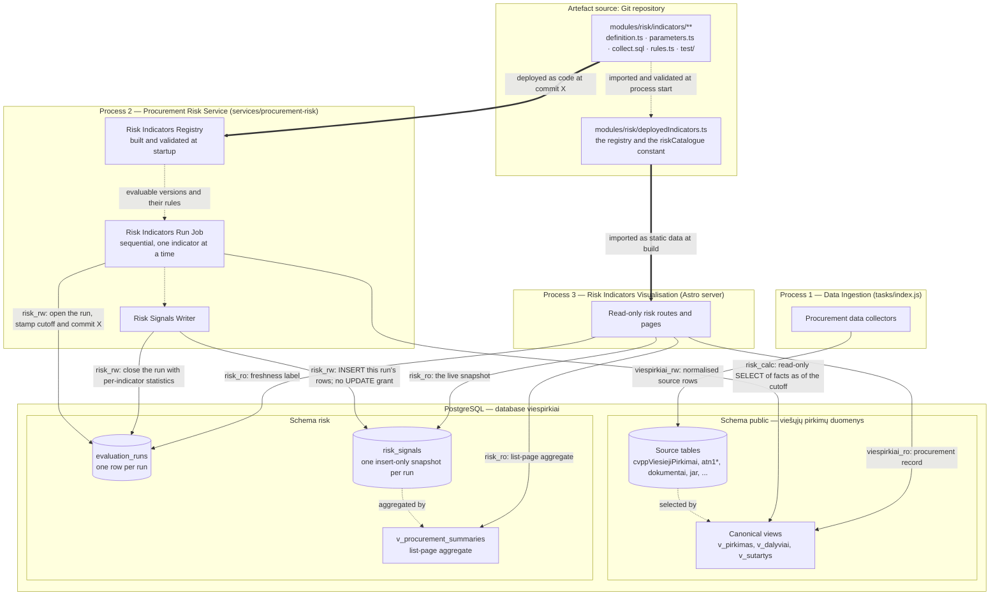
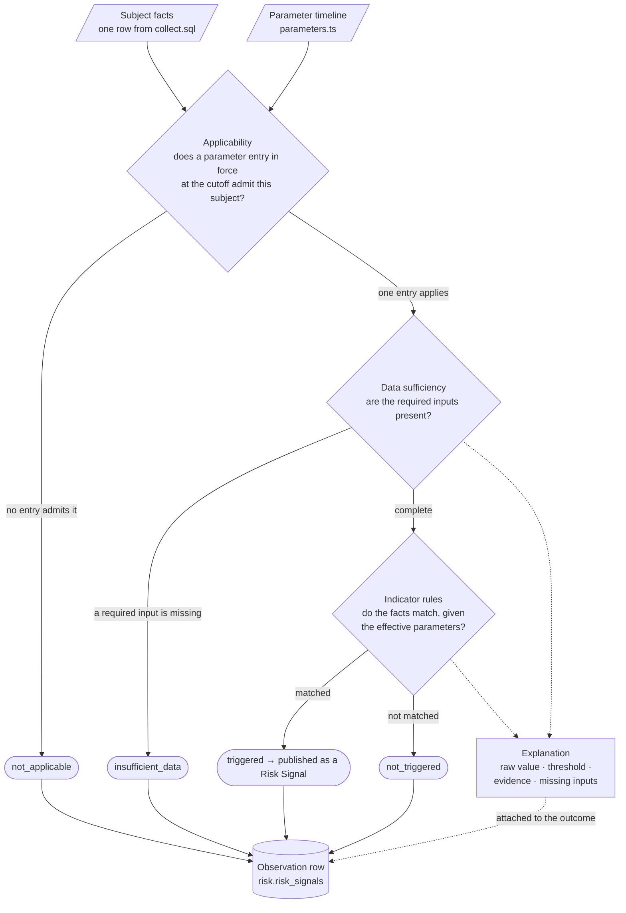
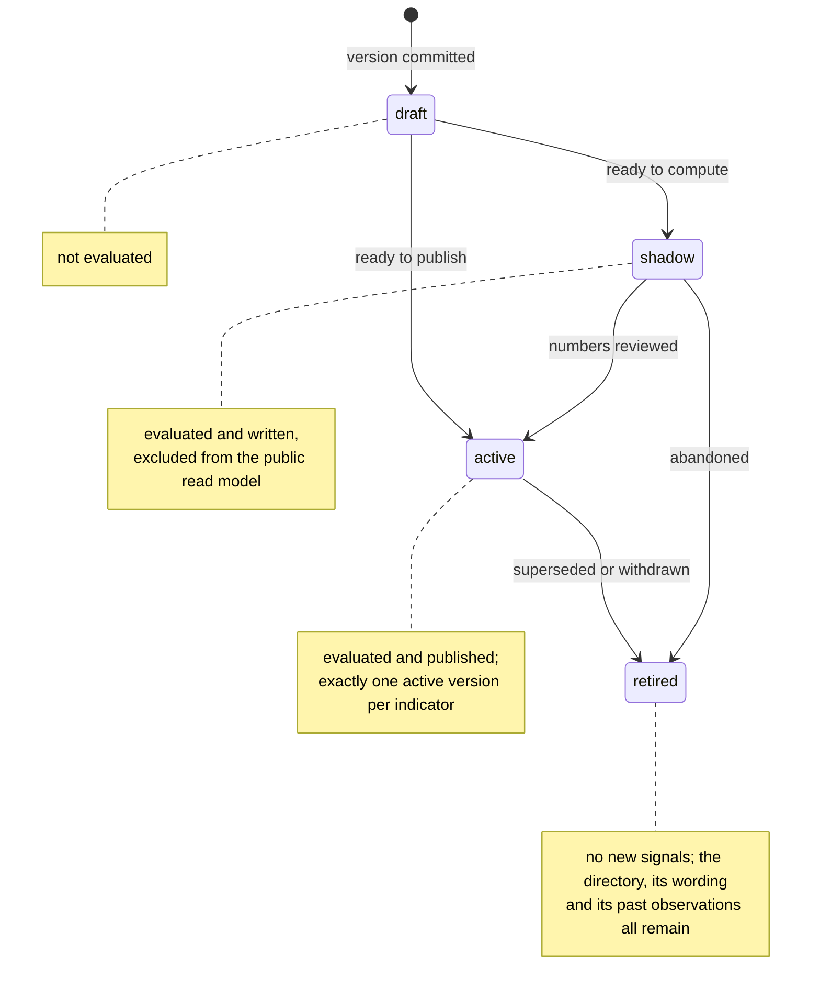

# Procurement Risk Service Architecture

Status: architecture

Core
methodology: [OCP 2024 Red Flags in Public Procurement](https://www.open-contracting.org/wp-content/uploads/2024/12/OCP2024-RedFlagProcurement.pdf)

Indicator catalogue: [Canonical Lithuanian catalogue](indicators-canonical.md)

Database schema: [`risk-schema.md`](risk-schema.md)

Parent design: [Risk signals for current and recently completed procurements](risky-procurements-initial-design.md)

## 1. Overview

The Procurement Risk Service turns the procurement facts viešpirkiai already ingests into **Risk Signals**: named,
versioned, publicly explained reasons to review one procurement. A signal states what was measured, what it was compared
against, which indicator version decided it and what could legitimately explain it — a signal is a reason to look, never
a finding of wrongdoing.

The system is a small business rules system over a procurement database. A **Risk Indicator** is a rule set with
effective-dated parameters and public wording; an **evaluation run** applies every deployed indicator to every
applicable subject at one cutoff and records the outcome; the website publishes the outcomes of the newest completed
run. The whole indicator catalogue lives in the Git repository, and PostgreSQL holds only results and run control state.

The stack is **TypeScript + PostgreSQL**, with no separate analytics, rules or orchestration platform. PostgreSQL
provides durable coordination and set-based computation; TypeScript provides the indicator catalogue, rule evaluation,
validation and operational control.

### 1.1 System context

**Diagram: viešpirkiai and the actors and source systems around it.**


Risk pages never restate the procurement record. They link to the existing procurement page and to the original CVP
IS/CVPP documents, which stay authoritative.

### 1.2 Containers

The system has exactly three processes, each with a single business purpose, its own deployment lifecycle, its own
database role and its own failure mode. **Committed PostgreSQL rows are the only integration between them.**

| # | Process                           | Business purpose                                                                       | Deployed as                                    | Writes                                         | Reads                                                                                |
|---|-----------------------------------|----------------------------------------------------------------------------------------|------------------------------------------------|------------------------------------------------|--------------------------------------------------------------------------------------|
| 1 | **Data Ingestion**                | Fetch, normalise and version public procurement records                                | Existing task runner (`tasks/index.js`)        | `public` schema source tables only             | Public sources: CVP IS, CVPP, TED, JAR, documents                                    |
| 2 | **Risk Indicators Processing**    | Evaluate every applicable Risk Indicator, one at a time, and record the outcomes       | **Procurement Risk Service**, its own process  | `risk.evaluation_runs` and `risk.risk_signals` | `public` canonical views; the deployed Git catalogue                                 |
| 3 | **Risk Indicators Visualisation** | Show a procurement's risk signals, methodology and evaluation coverage to the public   | Existing Astro web application                 | Nothing                                        | `risk` tables and views read-only; the `riskCatalogue` constant; `public` procurement record |

**Diagram: containers, the schemas they use and the role each connection holds.**



Database roles make the separation enforceable rather than conventional
([`migrations/risk/002_roles.sql`](../../migrations/risk/002_roles.sql)):

| Role                         | Used by                                                          | Grants                                                                                                                  |
|------------------------------|------------------------------------------------------------------|-------------------------------------------------------------------------------------------------------------------------|
| `viespirkiai_rw`             | Process 1                                                        | Read/write on `public`                                                                                                  |
| `risk_calc`                  | Process 2, during a calculation                                  | `SELECT` on the `public` canonical views, used inside a read-only transaction with a statement timeout                  |
| `risk_rw`                    | Process 2, for recording results, and the scheduled retention job | `SELECT`, `INSERT`, `UPDATE` on `risk.evaluation_runs`; `SELECT`, `INSERT`, `DELETE` on `risk.risk_signals`, no `UPDATE` |
| `risk_ro` / `viespirkiai_ro` | Process 3                                                        | `SELECT` on the `risk` tables and views and on the `public` canonical views                                             |

`risk_rw` can never alter a written signal in place — there is no `UPDATE` grant on `risk.risk_signals` — but it does
hold `DELETE`, because it is also the role the retention job runs as. Indicator results are derived and recalculable, so
removing a whole superseded snapshot needs no separate credential; immutability of a *written* row is what matters.

Risk evaluation is a separate process rather than a task in `runner/TaskRunner.js`, whose `mode`/`schedule`/`cooldown`
shape would otherwise fit, because four kinds of isolation are load-bearing:

- **Roles.** The grants above are only enforceable if the calculating process connects as `risk_calc`/`risk_rw` and the
  web process as `risk_ro`, each with its own credentials.
- **Blast radius.** A run performs long analytical scans over the whole corpus. Its own process and connection pool keep
  that work away from ingestion, which is the one thing that must keep working.
- **Deployment lifecycle.** Activating an indicator version deploys one commit to the risk service and the web
  application together ([§7.2](#72-adding-a-risk-indicator)), on a schedule independent of ingestion releases.
- **Packaging.** The web bundle imports the indicator definitions and reads the `riskCatalogue` constant. That import
  crosses no process boundary: the definitions are plain TypeScript and Zod, they open no database connection, and
  `collect.sql` is read lazily at calculation time, so nothing in `services/procurement-risk/` reaches the web bundle.

The separation buys four operational properties: a broken ingestion refresh leaves the last computed signals visible,
labelled with their older cutoff; a failing indicator is contained to its own rows; a web deployment cannot mutate risk
results; and rewriting an indicator's rules touches neither ingestion nor web code.

### 1.3 Components of one evaluation

Solid arrows are runtime data flows, labelled with the data crossing the boundary. Dotted arrows are code or
configuration dependencies.

**Diagram: data flow from ingested facts to published risk signals.**

```mermaid
flowchart LR
    subgraph ingestion["Process 1 — Data Ingestion and the state it publishes"]
        S["Procurement data collectors"]
        C[("Canonical procurement facts<br/>schema public")]
        S -->|" normalised procurement records "| C
    end

    subgraph processing["Process 2 — Risk Indicators Processing"]
        M["Git: Risk Indicator definitions,<br/>rules and effective-dated parameters"]
        G["Risk Indicators Registry"]
        K["Risk Indicators Run Job"]
        I["Risk Indicator evaluation<br/>collect facts in SQL, decide in TypeScript"]
        T["Risk Signal Validator"]
        P["Risk Signals Writer"]
        M -.->|" deployed code, loaded and validated at startup "| G
        G -.->|" evaluable versions and their rules "| K
        G -.->|" declares the output contract "| T
    end

    subgraph storage["Schema risk — written only by Process 2"]
        J[("evaluation_runs")]
        H[("risk_signals")]
        R["v_procurement_summaries"]
        H -.->|" aggregated at query time "| R
    end

    subgraph visual["Process 3 — Risk Indicators Visualisation"]
        A["Astro read-only routes"]
        U["Public risk pages and API"]
        A -->|" rendered HTML or JSON response "| U
    end

    K -->|" one open run, stamped with cutoff and commit "| J
    K -->|" cutoff, subject filter and effective parameters "| I
    C -->|" canonical facts as of the cutoff "| I
    I -->|" observation rows "| T
    T -->|" validated rows "| P
    P -->|" append this run's snapshot "| H
    P -->|" per-indicator statistics, terminal state "| J
    H -->|" the live snapshot "| A
    R -->|" list page ordering and counts "| A
    J -->|" freshness label "| A
```



| Component                   | Process | Concrete form                                                          | Responsibility and boundary                                                                                                                                              |
|-----------------------------|---------|------------------------------------------------------------------------|--------------------------------------------------------------------------------------------------------------------------------------------------------------------------|
| Procurement data collectors | 1       | Existing scrapers and importers                                        | Fetch and normalise public source data into `public`. They hold no permission on `risk`.                                                                                 |
| Canonical procurement facts | 1       | Tables and views in `public`                                           | Present procurements, notices, lots, bids, awards, contracts, buyers and suppliers with stable keys and validity semantics. These are the reproducible facts read at the cutoff. |
| Risk Indicators Registry    | 2       | `modules/risk/registry.ts`, built from the deployed code at startup    | Resolves `(indicator id, version)` to one validated Risk Indicator, and answers which versions are active, shadow or retired ([§4.3](#43-the-risk-indicator-class-model)). |
| Risk Indicators Run Job     | 2       | `services/procurement-risk/runJob.ts`                                  | Opens the run, evaluates each registered indicator in turn, records per-indicator statistics, closes the run. Indicator-independent: one failure is recorded and the run continues. |
| Risk Indicator evaluation   | 2       | One indicator directory ([§4.1](#41-the-risk-indicator-directory))     | Collects one subject's facts and decides its outcome at one cutoff, reading canonical facts only through the injected data source.                                        |
| Risk Signal Validator       | 2       | `RiskIndicator.validateObservations` plus the output contract          | Validates field types, allowed states, subject and indicator identity, and duplicate subject keys, before any row reaches the writer. SQL safety comes from the read-only role, transaction and statement timeout. |
| Risk Signals Writer         | 2       | `services/procurement-risk/write.ts`                                   | Appends validated rows to the open run's snapshot with one indicator-independent `INSERT`, inside the caller's transaction. It compares nothing and updates nothing.      |
| Evaluation run              | 2       | `risk.evaluation_runs`                                                 | One durable row per run: cutoff, code commit, terminal state, per-indicator statistics. It answers whether the job ran and whether it succeeded.                          |
| Risk signals                | 2 → 3   | `risk.risk_signals`                                                    | One immutable snapshot per run: outcome, evidence, indicator version, applied parameters and cutoff.                                                                      |
| Procurement summary         | 2 → 3   | `risk.v_procurement_summaries`                                         | Aggregates the live snapshot per procurement for list-page counts, ordering and filters.                                                                                  |
| Astro read-only routes      | 3       | Existing web application on a read-only role                           | Query the live snapshot, the summary view and the run row; read all indicator wording from the `riskCatalogue` constant.                                                  |

A cron schedule guarantees that a run eventually starts. A PostgreSQL `NOTIFY` from ingestion is an optional wake-up
hint that shortens the delay between a source refresh and the next run.

### 1.4 Where the state lives

Risk state lives in three places, and only two of them are in PostgreSQL.

| Area            | Where                              | Contents                                                                                              | Written by                     | Retention                                                                |
|-----------------|------------------------------------|-------------------------------------------------------------------------------------------------------|--------------------------------|--------------------------------------------------------------------------|
| **Definitions** | Git — `modules/risk/indicators/**` | Identity, versions, lifecycle, public wording, effective-dated parameters, rules, tests               | A reviewed, merged pull request | Forever, as repository history                                           |
| **Runs**        | `risk.evaluation_runs`             | One row per run: cutoff, code commit, state, per-indicator statistics                                 | Process 2                      | Forever; ~365 rows a year                                                |
| **Signals**     | `risk.risk_signals`                | One insert-only snapshot per run: every `(subject, indicator)` outcome with its evidence and parameters | Process 2                      | Snapshots older than the window are deleted, except the live one         |

The flow is one-way — **definitions + facts → outcomes** — and it is what makes a stored row self-sufficient. Because
definitions live outside the database, each row carries the indicator id, the implementation version, the exact
parameter values applied, the run that produced it (and therefore the code commit) and the structured evidence. That row
stays explainable years later, and it stores no display text, so correcting Lithuanian wording is a commit rather than a
rewrite of history.

## 2. Domain language

### 2.1 Terms

The service uses business rules vocabulary, and each term maps to exactly one artefact:

| Term                     | Meaning                                                                                                                                   | Lives in                                                       |
|--------------------------|---------------------------------------------------------------------------------------------------------------------------------------------|----------------------------------------------------------------|
| **Risk Indicator**       | One versioned policy concept: what it means, whom it applies to, the rules that decide it, its parameter timeline, its public explanation and its tests | One directory in Git                                            |
| **Rule**                 | A condition over one subject's collected facts and the parameters in force for it                                                          | `rules.ts` in the indicator directory                          |
| **Parameter**            | A reviewed value a rule compares against, effective-dated and scoped                                                                       | `parameters.ts` in the indicator directory                     |
| **Decision**             | What evaluating one indicator against one subject yields: the outcome state plus the values that explain it                                | Returned by `rules.ts`, assembled into an observation          |
| **Outcome state**        | `triggered`, `not_triggered`, `insufficient_data` or `not_applicable`                                                                      | `state` on every stored row                                    |
| **Risk Signal**          | The public result of a `triggered` outcome: a reason to review this procurement                                                            | What `/rizikos` publishes                                      |
| **Observation**          | The stored row recording one decision — every outcome state, not only triggered ones                                                       | `risk.risk_signals`                                            |
| **Evaluation run**       | One pass of every evaluable indicator over every applicable subject at one cutoff                                                           | `risk.evaluation_runs` plus one snapshot of observations       |
| **Indicator catalogue**  | The set of deployed indicator versions                                                                                                     | `modules/risk/indicators/`, published as the `riskCatalogue` constant |

Storing every outcome, not only the matches, is what lets a page distinguish "checked, nothing found" from "not
evaluated" from "the calculation failed". The service records a fifth state, `calculation_error`, on an indicator's
behalf; it is not a decision, it is the absence of one.

Each indicator carries a canonical Lithuanian catalogue id of the form `LT-<AREA>-<NN>`
([canonical catalogue](indicators-canonical.md)), and records the source codes its concept derives from — `OCP-R003`,
`OLAF-CN29`, `VPT-I01` — as references. An OCP-derived indicator therefore stays traceable to OCP while remaining a
viešpirkiai indicator with its own version, wording and thresholds.

### 2.2 Identifiers are English, labels are Lithuanian

**Every identifier in the Procurement Risk Service is English** — schema, tables, columns, TypeScript fields, SQL
aliases, roles, module paths and enum values. The concepts already have settled names in international and EU
procurement-fraud terminology, and the service should use them. Lithuanian survives as **label values** the GUI renders
(`titleLt`, `descriptionLt`, `limitationLt`, `formulaLt`), which live in the indicator catalogue in Git.

The rest of the repository follows the opposite convention, so the boundary is worth stating exactly: the `public`
schema belongs to Data Ingestion and keeps its Lithuanian domain names (`pirkimas`, `tiekejas`, `sutartis`, `jarKodas`).
A collection statement crosses the boundary in exactly one place, and the rule is positional: **Lithuanian on the left
of an `AS`, English on the right**. Everything downstream of that statement is English, because it is already inside the
risk service.

### 2.3 The decision model of one indicator

Evaluating one indicator against one subject is a small chain of decisions, not a single rule test. Three intermediate
decisions run before the indicator's own rules, and each has its own outcome state, which is why an absent signal is
readable.

**Diagram: the decisions that produce one observation.**



Ownership of each decision is deliberate. **Applicability is decided by shared code**, from the parameter timeline, so
an indicator cannot publish a `triggered` signal that no reviewed threshold stands behind — the code path that would do
so does not exist. **Sufficiency, the rules and the explanation are the indicator's own**, and live together in its
`rules.ts` because they are the part a reviewer actually reads. **Identity, subject, applied parameters and the cutoff
are shared too**, stamped onto the observation by the machinery, so no indicator can get them wrong.

## 3. Public information architecture

Three connected pages:

- `/rizikos` — find open and recently changed procurements with active signals;
- `/rizikos/pirkimas/:source/:id` — see all evidence and evaluated indicators for one procurement;
- `/rizikos/metodika` — inspect the public indicator catalogue, rules, versions and coverage.

Every published result is shown with its source facts, its calculation, the indicator version that produced it and its
known limitations. That is the whole editorial contract of the risk pages, and it is why the observation row carries
structured evidence rather than a rendered sentence.

### 3.1 List page

All names and values below are fictional demonstration data.

```text
┌─────────────────────────────────────────────────────────────────────────────┐
│ Rizikos signalai viešuosiuose pirkimuose                    [Metodika]      │
│                                                                             │
│ Automatiniai indikatoriai padeda rasti pirkimus, kuriuos verta peržiūrėti.  │
│ Signalas nėra pažeidimo ar korupcijos įrodymas.                             │
│ [Kaip skaičiuojama]  Duomenys atnaujinti 2026-08-10 19:05                   │
├─────────────────────────────────────────────────────────────────────────────┤
│ [Atviri dabar 1 284] [Neseniai pasibaigę] [Pakeistos sutartys]              │
│                                                                             │
│ 143 su bent vienu signalu  ·  22 nauji per 24 val.  ·  7 aktyvūs rodikliai  │
├───────────────┬─────────────────────────────────────────────────────────────┤
│ FILTRAI       │ Rikiuoti: [Daugiausiai signalų ▼]                           │
│               │                                                             │
│ Signalo grupė │ ┌─────────────────────────────────────────────────────────┐ │
│ □ Konkurencija│ │ 3 signalai · terminas po 14 val.                        │ │
│ □ Skaidrumas  │ │ Mokyklų maitinimo paslaugos (demonstracinis pavyzdys)   │ │
│ □ Procedūra   │ │ Pirkėjas: Pavyzdžio miesto administracija               │ │
│ □ Tiekėjas    │ │ Atviras konkursas · paslaugos · 55500000 · €480 000     │ │
│ □ Sutartis    │ │ Paskelbta 2026-08-06 · terminas 2026-08-11 09:00        │ │
│               │ │                                                         │ │
│ Etapas        │ │ LT-PRO-08  Trumpas pasiūlymų pateikimo terminas         │ │
│ □ Atviras     │ │            4,8 dienos; taikoma riba 10 dienų            │ │
│ □ Vertinamas  │ │ LT-PRO-06  Pirkimo skaidymas siekiant išvengti ribos    │ │
│ □ Sutartis    │ │            €480 tūkst.; 3 panašūs pirkimai per 90 d.    │ │
│               │ │ LT-TRA-03  Pagrindiniai dokumentai neprieinami          │ │
│ Vertė         │ │            2 dokumentai pakeisti likus 24 val.          │ │
│ [nuo] [iki]   │ │                                                         │ │
│               │ │ Duomenų pakankamumas: 6 iš 7 rodiklių įvertinti         │ │
│ BVPŽ          │ │ [Peržiūrėti signalus] [Atverti pirkimą]                 │ │
│ Pirkėjas      │ └─────────────────────────────────────────────────────────┘ │
│ Būdas         │                                                             │
│ Šaltinis      │ ┌─────────────────────────────────────────────────────────┐ │
│               │ │ 1 signalas · pasiūlymų teikimas                         │ │
│ [Išvalyti]    │ │ ...                                                     │ │
└───────────────┴─────────────────────────────────────────────────────────────┘
```

The header establishes interpretation before showing results: a one-sentence purpose, a permanent "signal is not proof"
statement, the cutoff of the underlying snapshot as distinct from the page generation time, a link to the methodology,
and counts computed from the same snapshot as the results. The headline claim is "143 procurements with at least one
active signal", which is exactly what the data supports.

Tabs are lifecycle scopes over one snapshot: **Atviri dabar** (future bid deadline), **Neseniai pasibaigę** (deadline or
award in the selected recent period) and **Pakeistos sutartys** (newly signed or materially changed contracts).

A result card answers five questions in order: what is it (title, buyer, method, CPV, value, dates); what brought it
here (triggered indicator names); what was observed (the decisive value and its comparison in one sentence); what the
evaluation coverage is (evaluated, applicable and insufficient counts); and where the evidence is (detail page and
original procurement). Each indicator line uses the canonical code and short public name. Severity may control a left
border or icon, colour is supplementary, and accessible text is mandatory.

Filters are URL-backed: lifecycle scope and event-date interval, indicator id, signal family and severity, buyer and
supplier, procurement method and object type, CPV prefix, value interval, EU funding, source, evaluation coverage and
data freshness. Sort options are triggered-signal count descending (default), nearest deadline, most recently published
or changed, largest value, and lowest data coverage.

**Ranking is countable.** The default order is the number of triggered indicators — countable, explainable and free of
calibration. Severity is a constant of the indicator version in the Git catalogue and acts as a filter by expanding a
severity set into indicator ids; it does not participate in ordering. Data coverage is stated from `missing_data`.

### 3.2 Detail page

The detail page makes one public result independently understandable. Every signal expands to the same seven sections,
rendered from the structured evidence stored on the observation, with all markup owned by the rendering layer:

| Section                     | Contents                                                                                                        | Source                                             |
|-----------------------------|-------------------------------------------------------------------------------------------------------------------|----------------------------------------------------|
| **Ką matome**               | Plain-language statement of what was observed                                                                    | `raw_value` + catalogue wording                    |
| **Kaip skaičiuota**         | The calculation with this procurement's own values                                                               | `raw_value`, `formulaLt`                           |
| **Riba arba palyginimas**   | The exact effective parameter values applied, or the peer population                                             | `applied_parameters`, `threshold`                  |
| **Kontekstas**              | Comparison sample, where one is relevant                                                                         | `evidence`                                         |
| **Šaltiniai**               | Links, identifiers and the data cutoff                                                                           | `evidence`, `data_as_of`                           |
| **Apribojimai**             | Common legitimate explanations and known data gaps                                                               | `limitationLt`                                     |
| **Metodika**                | Indicator id, implementation version, effective date of the parameter entry applied, source catalogue codes      | `indicator_id`, `indicator_version`, catalogue     |

Coverage is disclosed in proportion to its interest: a collapsed "Įvertinti, signalas nenustatytas" section, a visible
"Nepakanka duomenų" count that lists the missing fields when expanded, `not_applicable` indicators kept out of the main
count and available in the methodology detail, and `calculation_error` shown as a temporary data-processing notice and
raised to maintainers. Stating coverage explicitly is what keeps an absent signal readable as "checked, nothing found"
or "not evaluated" rather than as a clean bill of health.

The page states what is true in the live snapshot and how fresh it is. It carries no "new" badge and no "since" wording,
because it reads exactly one run and cannot honestly say when a signal appeared ([§9](#9-limitations)).

### 3.3 Methodology catalogue

`/rizikos/metodika` makes the system inspectable. It contains the citation and link to the OCP core document and the
other source catalogues, an explanation of the four outcome states, a searchable indicator catalogue, active, shadow and
retired versions, the rule and parameter history, coverage and trigger-rate statistics by year, method and CPV where
samples are safe, known source limitations and freshness, and a change log. Opening a catalogue row shows the canonical
definition, the source-catalogue references, the local profile, required data, the rule expressed as a formula,
exclusions, parameters, an example and limitations.

Everything on the page except the statistics comes from `riskCatalogue`, the constant `deployedIndicators.ts` derives
from the registry and the page imports directly; the statistics come from `risk.risk_signals`. Sourcing wording from the
deployed catalogue is what lets the page describe retired versions and versions with zero current signals.
Where the repository is public, each entry links to the indicator directory and to the commit history of its thresholds.

## 4. The Risk Indicator package

**A Risk Indicator is one directory in the Git repository.** Everything that defines it — its meaning, its
applicability, the thresholds it has used since which date, its rules and its public explanation — is a file in that
directory, and its whole lifecycle from `draft` to `retired` is a sequence of reviewed commits.

Git is the only home of an indicator, and this is the decision the rest of the design rests on. `git log`, `git blame`
and a pull-request diff answer who changed which threshold, when and why. Formula, threshold, public wording and tests
move in one commit and cannot drift apart. Reverting that commit reverts the indicator entirely. The deployed commit
*is* the definition, and every run records it, so any published result traces back to the exact repository state that
produced it. PostgreSQL is left holding results and run control state: two tables and one view.

The OCP guide describes an indicator through its definition, reason for being a red flag, required data, method, unit of
analysis, procurement stage, example and source. The package preserves those fields and adds the operational ones:
implementation version, parameters, lifecycle state, tests, public wording and known limitations.

### 4.1 The Risk Indicator directory

```text
modules/risk/indicators/LT-COM-01/     ← one directory = one Risk Indicator
│
├── definition.ts        WHAT IT IS. The single exported object all other
│   │                    components resolve. Contains:
│   ├── key              identity: { id, version } — stamped on every
│   │                    observation this indicator ever produces
│   ├── lifecycle        'draft' | 'shadow' | 'active' | 'retired'
│   ├── stage            'planning' | 'tender' | 'award' | 'contract'
│   ├── subjectType      what one result row is about: 'procurement', 'lot', ...
│   ├── references       source catalogue codes: OCP-R018, OLAF-CA02, VPT-I01, ...
│   ├── standard         primary citation: document name, URL and page
│   ├── public           WHAT THE PUBLIC READS. titleLt, descriptionLt,
│   │                    limitationLt, formulaLt — the only text the web renders
│   ├── requiredInputs   fields that must be present, else 'insufficient_data'
│   ├── sourceRelations  canonical views the collection statement reads
│   ├── sqlFile          the packaged SELECT that collects this indicator's facts
│   ├── decide           the rules that judge one fact row, from rules.ts
│   └── outputContract   runtime validation of the rows evaluation returns
│
├── parameters.ts        WHAT THE RULES COMPARE AGAINST. An append-only,
│   │                    effective-dated timeline kept in its own file so a
│   │                    threshold change is a one-line, blameable diff:
│   └── entries[]        { validFrom, validTo, scope, values, source, note }
│
├── collect.sql          WHAT IS TRUE. One pure, parameterised SELECT returning
│                        one fact row per subject — $1 the cutoff, $2 an optional
│                        subject filter. It measures; it decides nothing. No
│                        indicator identity, no state, no thresholds.
│
├── rules.ts             HOW IT DECIDES. A pure function of one fact row and the
│                        parameter values in force for it, returning a Decision:
│                        the outcome state plus the rawValue, threshold, evidence
│                        and missingData that explain it. It touches no database
│                        and no clock, so its tests need neither.
│
├── test/                PROOF IT IS RIGHT. Kept out of the four files that
│   │                    define the indicator, so `ls` answers "what is this
│   │                    indicator?" and one level down answers "how do we know
│   │                    it works?".
│   ├── fixtures.ts      Deterministic cases for each outcome state, boundary
│   │                    values and effective-date transitions. Each case states
│   │                    both the source rows and the fact row collect.sql must
│   │                    produce from them, so the two test files meet on one value.
│   ├── rules.test.ts    Assertions over those fixtures — the rules alone, no
│   │                    database, run on every `npm test`.
│   └── collect.it.ts    Integration proof that collect.sql returns the fact rows
│                        the fixtures describe, against a real PostgreSQL.
│
└── README.md            Optional reviewer context: interpretation notes, known
                         false positives, decisions taken during review.
```

Read that as the definition of the entity: **identity + lifecycle + public wording + applicability + parameter
timeline + exactly one collection + exactly one rule set + tests**.

The split between `collect.sql` and `rules.ts` is the load-bearing one, and the rule is a single sentence: **SQL states
what is true about a subject, TypeScript decides what that means.** Counting, joining, filtering and aggregating are
what a set-based engine is for; comparing a measurement to a threshold, choosing an outcome state and assembling an
explanation are ordinary branching code. Keeping them apart means neither file has to be read to understand the other,
and the deciding half is testable with plain objects.

### 4.2 Shared machinery

Every indicator reuses the same modules, and they are the entire non-indicator surface of the service:

```text
modules/risk/
  contracts.ts                # observation, subject-facts, decision and parameter contract values
  riskIndicator.ts            # the RiskIndicator base class: self-checks, effective parameters,
                              # evaluate(), output and cross-row validation
  subjectFactsIndicator.ts    # collect-then-decide: binds $1/$2, resolves the parameter entry per
                              # fact row, applies the rules, assembles observations
  parameterScope.ts           # scope matching and disjointness, shared by the startup check and
                              # the per-subject parameter lookup
  evaluationContext.ts        # what one run evaluates: cutoff, subjects, effective parameters
  riskDataSource.ts           # how an evaluation reaches a database (the only port)
  registry.ts                 # the catalogue class: lookup, active and evaluable sets
  deployedIndicators.ts       # explicit imports of every deployed version, plus riskCatalogue:
                              # their public metadata as one constant Astro imports
  sqlLoader.ts                # loads packaged SQL at process start
services/procurement-risk/
  index.ts                    # service entry point and single-instance advisory lock
  runJob.ts                   # opens the run, evaluates Risk Indicators one at a time
  write.ts                    # one INSERT of the run's rows into risk.risk_signals
  retention.ts                # deletes superseded run snapshots, as risk_rw
  retentionJob.ts             # its entry point: npm run risk:retention
migrations/risk/
  001_risk.sql                # two tables and one view
  002_roles.sql               # the roles and grants of §1.2
```

The catalogue is the set of indicator directories; the complete DDL is in [`risk-schema.md`](risk-schema.md).

### 4.3 The Risk Indicator class model

A Risk Indicator version is an instance of a `RiskIndicator` subclass, constructed from a read-only definition object.
The base class owns everything every indicator shares — identity, lifecycle, the parameter timeline and its resolution,
`evaluate()` and output validation — and leaves exactly one thing abstract: how the observations are produced.

**Diagram: the Risk Indicator class model and its collaborators.**


`SubjectFactsIndicator` is the shared implementation for the case where **the collection statement returns exactly one
fact row per subject** — the `SubjectFacts` contract, hence the name. It binds `$1`/`$2`, resolves the parameter entry
for each row, applies the indicator's rules and assembles the observation, so an author writes a `SELECT` and a
function and nothing else. Roughly 78 of the 106 canonical indicators fit it, and it is the default form: each of its
two files answers one question, which is the easiest thing to review.

The remaining indicators subclass `RiskIndicator` directly in their own directory and implement `calculate()`
themselves, free to run several packaged statements and assemble the rows. **The dividing line is one question: is
there exactly one fact row per subject?** If the statement can produce that row — including by aggregating, joining a
benchmark or window-functioning over peers — the indicator is a `SubjectFactsIndicator`, however much SQL that takes. If
the decision needs several rows per subject, or produces subjects the statement did not enumerate, it is not.

Both forms satisfy the same contract, `calculate(context, data) => Promise<RiskObservationV1[]>`, and both are executed
through the same `evaluate()`, which resolves the effective parameters, calculates and validates the rows against the
output contract. No caller can calculate without validating, or with another indicator's parameters.

Two layers protect a definition. **Compile-time checks** reject missing fields, misspelled lifecycle, stage or state
literals and incompatible parameter types. **Startup runtime checks** — in the constructor for what one indicator can be
wrong about, in the registry for what only a set can be wrong about — reject an id outside the catalogue namespace,
empty public wording, parameter values violating the indicator's own contract, a gapped or ambiguous parameter timeline,
duplicate keys and a second active version of one indicator. All of them run at import time, when the service starts, so
a malformed catalogue never reaches a run.

### 4.4 The evaluation contract covers every indicator shape

The [canonical catalogue](indicators-canonical.md) contains 106 indicators in five computational shapes, and every one
of them is **collect, decide, construct**. What differs is only how much structure the collect step has and how much
work the decide step does:

| Shape                                              | Roughly | Collect                                               | Decide                                     | Construct                     |
|----------------------------------------------------|--------:|-------------------------------------------------------|--------------------------------------------|-------------------------------|
| Row-local arithmetic over one subject's own facts  |     ~60 | one fact row per subject                              | the rules, a few branches                  | shared, `SubjectFactsIndicator` |
| Comparison against a population baseline           |     ~18 | one fact row per subject, carrying its peer benchmark | the rules, a comparison                    | shared, `SubjectFactsIndicator` |
| Collect a sample, compute a statistic, threshold it |      ~8 | a sample per subject                                  | the statistic, in TypeScript               | own `calculate()`             |
| Traversal of the ownership and person-link graph   |      ~7 | edges                                                 | traversal, and the path taken as evidence  | own `calculate()`             |
| Document text, spans and similarity                |      ~9 | documents and spans                                   | comparison, and the spans as evidence      | own `calculate()`             |

Examples per shape, in order: LT-PRO-08 short deadline and LT-COM-01 single valid bid; LT-PRI-01 value versus market
benchmark and LT-COM-06 market concentration; LT-PRI-08 Benford and LT-COM-14 bid rotation; LT-COI-02 shared owner and
LT-SUP-10 connected bidders; LT-COM-16 similar bid documents and LT-PRO-10 tailored specifications.

Four properties follow:

- **The three phases are structural, not a naming convention.** Collection is always SQL, deciding is always TypeScript,
  and assembly is always shared code. That boundary holds for every shape, which is why an indicator that outgrows
  `SubjectFactsIndicator` changes only its middle phase.
- **A collection statement never decides anything.** It carries no indicator identity, no state, no threshold and no
  cutoff echo. This is what makes an unreviewable 80-line `SELECT` impossible: the constructs that produce that length —
  repeated `CASE` over a computed state, `jsonb_build_object` assembly, identity literals — have nowhere to live in it.
- **Database capability comes from the injected data source**, not from the indicator. It is the only way to a database,
  on the `risk_calc` role, inside a read-only transaction with a statement timeout. Every indicator obtains identical
  capability whatever shape it is.
- **Shared or expensive intermediates become canonical facts.** A peer benchmark per CPV division and method, or the
  closure of the ownership graph, is a view in `public`, promoted to a `MATERIALIZED VIEW` refreshed before the
  indicator loop once measurement demands it. It stays a fact every indicator reads on equal terms, which is what keeps
  indicators independent of each other and their execution order irrelevant.

### 4.5 Parameters and their resolution

Parameters are the values the rules compare against, and they are policy: reviewed thresholds, method scopes, legal
dates and exclusions. They live in `parameters.ts`, separate from the rules, so a threshold change is a one-line diff
whose author, date and justification `git blame` answers. A deployed parameter change takes effect on the next run.

An entry is selected per fact row, in TypeScript, in two steps:

1. **By time.** The entries whose validity range contains the run cutoff.
2. **By scope.** Among those, the entry whose `scope` admits the row: `scope.methods`, when present, must contain the
   row's `method`; `scope.objectTypes`, when present, must contain its `objectType`; an absent dimension admits
   everything, and a constrained dimension whose fact is missing does not match.

Concurrently valid entries must have pairwise disjoint scopes, and entries sharing a scope must form a contiguous
timeline. Both are checked at startup, so an indicator with an ambiguous or gapped timeline never runs. Together they
make the result **at most one entry**, which is why the resolved values reach the rules as a plain value object rather
than a list to be searched.

Two-dimensional selection is what lets one implementation version carry different legal thresholds for different
procedure types: ten days for an open procedure and a longer window for a restricted one are two concurrently valid
entries with disjoint `scope.methods`, not two indicator versions.

Because the matched values are copied onto every observation the run produces, **a published signal states its own
threshold**. Carrying the values rather than a foreign key is what keeps a signal explainable after the parameter
timeline has moved on, and carrying them in shared code rather than in each indicator is what makes it a property of
the architecture rather than a habit.

### 4.6 Where each kind of logic belongs

| Logic                                                                    | Belongs in                                                                | Example                                                                |
|--------------------------------------------------------------------------|---------------------------------------------------------------------------|------------------------------------------------------------------------|
| Relational filters, joins, windows and aggregates over one subject       | `collect.sql`                                                             | LT-PRO-08 short deadline, LT-COM-01 single valid bid                   |
| Threshold comparison, outcome state, evidence and `missingData`          | `rules.ts`                                                                | every Risk Indicator                                                   |
| Statistics, sequences, pairwise comparison, text spans, graph traversal  | `calculate()` in the indicator's own directory, running its own SQL       | LT-PRI-08 Benford, LT-COM-14 bid rotation, LT-COM-16 similar documents |
| Indicator identity, contract and public metadata                         | `definition.ts`                                                           | every Risk Indicator                                                   |
| Reviewed thresholds and their validity and scope                         | `parameters.ts`                                                           | every Risk Indicator                                                   |
| Which parameter entry applies, and `not_applicable` when none does       | `SubjectFactsIndicator` ([§2.3](#23-the-decision-model-of-one-indicator))  | every Risk Indicator with a scoped timeline                            |
| Identity, subject key pass-through, applied parameters, cutoff           | `SubjectFactsIndicator` — shared, written once                            | every row-per-subject Risk Indicator                                   |
| Reusable canonical field mapping                                         | A view in `public`                                                        | unified procurement and bidder facts                                   |
| Stable shared database primitive                                         | A SQL/PG function                                                         | business days between dates                                            |
| A shared or expensive intermediate several indicators compare against    | A view, materialised once measurement demands it                          | peer benchmark per CPV division and method; ownership-graph closure    |
| Scheduling, retries and backfills                                        | Procurement Risk Service and `risk.evaluation_runs`                       | every evaluation run                                                   |
| Result persistence                                                       | Risk Signals Writer                                                       | all Risk Indicators                                                    |

**A parameter value is never bound into `collect.sql`.** If an indicator seems to need one there — a lookback window, a
sample minimum — collect the wider set and let the rules narrow it; the discarded rows usually belonged in `evidence`
anyway. The rare case where that is genuinely too expensive is an own `calculate()`, which binds whatever arguments it
likes, and the cost is then explicit in the diff rather than hidden in a shared calling convention.

**A PostgreSQL function is justified when all four conditions hold:** several indicators need exactly the same stable
primitive; its inputs and output are small and deterministic; it is independently tested and version-controlled through
a migration; and it exposes its source-table access plainly and passes a specific security review before using
`SECURITY DEFINER`. Business-day counting, backed by an effective-dated Lithuanian calendar, is the archetype.

**Two evidence obligations sharpen for text and graph shapes.** Text analysis records exact document, page and span
references, so a reader can verify the claim against the original file. Graph traversal records the path it relied on —
which link, from which register, connecting which parties — because "connected bidders" is an accusation-adjacent
statement and the evidence is what keeps it a signal. The implementation technique stays an internal fact of the
service and out of the public data contract.

## 5. Evaluation run

An evaluation run is **one single sequential job**: it executes the evaluable Risk Indicators one after another. A run
has exactly two inputs of its own.

- **The cutoff is the run's clock.** `data_as_of` is read once at run start and passed to every collection statement as
  `$1`. It keeps one run internally consistent — the first and the hundredth indicator agree on what "now" means — and
  makes a rerun at the same cutoff reproducible for every deadline and age comparison. Every time comparison goes
  through the cutoff, never through `now()` and never through the process clock. That is the enforceable form of
  "reproducible", and it is a test ([§8](#8-tests-and-automated-safeguards)).
- **The subject set is the indicator's own `WHERE` clause.** Each indicator has its own unit of analysis — procurement,
  lot, contract, supplier — and its own applicability, so scoping belongs to the definition that owns it. `$2` carries
  an explicit subject array for a backfill or a single-procurement rerun, and `NULL` for a normal full run.

Those two are the collection statement's only arguments. Thresholds are not among them: a parameter entry is resolved in
TypeScript and applied by the rules, so the cutoff reaches SQL and policy does not.

The registry's evaluable versions form an unordered set, since every indicator reads canonical facts plus its own
parameters and nothing another indicator produced. The run job iterates them in declaration order because iteration
needs an order; any permutation produces the same signals.

The Procurement Risk Service:

1. takes the single-instance advisory lock, the registry having been built and validated at process start;
2. closes any run left `running` by a previous crash, marking it `failed`;
3. reads the clock once as `data_as_of` and opens one run row stamped with that cutoff and the code commit;
4. for each evaluable indicator in turn, resolves its effective parameter entries at the cutoff and evaluates it inside
   a read-only transaction with a statement timeout;
5. validates the returned rows: column types, allowed states, subject and indicator identity, and duplicate subject
   keys;
6. appends that indicator's observations to the open run's snapshot, in one transaction per indicator;
7. records that indicator's counts, timings and any error in `statistics`, then continues to the next indicator;
8. closes the run as `succeeded`, or `partial` when some indicators failed.

A full run is one set-based query per indicator, so re-evaluating an unchanged procurement costs almost nothing on the
read side. Every run rewrites the whole snapshot, so the write side is bounded by the run's own row count and the
retention window rather than by how much changed ([§6.2](#62-one-insert-only-snapshot-per-run)).

**A failing indicator is contained.** It contributes no rows to the snapshot, so the page reports it as not evaluated in
this run rather than showing a result from an older cutoff beside fresh ones. The run closes as `partial` and
`statistics` carries the error.

**Readers never observe a run in progress.** `v_latest_run` excludes `running`, so between steps 3 and 8 the site keeps
serving the previous snapshot in full and switches to the new one atomically when step 8 closes the run. A page never
mixes vintages: every signal on it shares one cutoff and one commit.

## 6. Stored results

**The complete DDL lives in [`risk-schema.md`](risk-schema.md)** — tables, columns, indexes, views and retention. This
section holds the reasoning behind that structure.

### 6.1 Evaluation runs

`risk.evaluation_runs` answers a question the signal rows cannot: **did the job run, and did it succeed?** A site whose
evaluation job has been silently broken for three weeks would otherwise keep displaying its flags with full confidence.
One row per run makes that failure visible on the page: the site keeps serving the last completed snapshot, and states
its age.

The code commit is stored once per run rather than on every signal row, and runs are kept forever, so a signal's
`run_id` recovers the exact code that produced it. A partial unique index on `status = 'running'` is the
database-enforced backstop to the service's advisory lock.

### 6.2 One insert-only snapshot per run

`risk.risk_signals` is **insert-only**. Each run appends one complete snapshot — one row per `(subject, indicator)` it
evaluated, changed or not — and no row is ever modified afterwards. There is no validity interval, no current-state
pointer and no `checked_at`.

**"Current" is a property of the run, not of the row.** The application resolves the newest completed run through
`v_latest_run` and then reads that run's rows. That view is the single definition of which snapshot is live, so the read
model, the retention job and the Astro application cannot disagree. Old runs are never queried and in-flight runs are
never queried, which is what keeps every read path a `run_id`-leading index scan.

Four properties follow, and they are the reason for the shape:

- **A page is one consistent snapshot.** Every signal a procurement page shows was produced by one run, at one cutoff,
  from one commit. The alternative — a per-subject current-state pointer — mixes vintages on a single page, because
  different indicators last changed at different times.
- **Nothing can be corrupted in place.** `risk_rw` holds no `UPDATE` on the table, so a written row can be deleted —
  whole, by the retention job, one superseded run at a time — but never altered. Immutability is a database permission
  rather than a convention the writer is trusted to honour.
- **The writer is one statement.** No comparison, no `IS DISTINCT FROM` over result columns, no close-and-append
  bookkeeping, and therefore no class of bug where a signal's history develops a gap or an overlap.
- **A run is atomic per indicator.** Each indicator's rows are inserted in one transaction, so a failure contributes
  nothing rather than half a result.

**All five states are stored**: the four outcome states plus `calculation_error`. The full set is what lets the page say
"we checked 12 indicators, 2 fired" while keeping "checked, clean", "not evaluated in this run" and "the calculation
failed" apart. **Display text stays in the catalogue**, keyed by `(indicator_id, indicator_version)`; the row stores the
structured evidence the sentence is rendered from, so a wording correction is a one-line commit. **The definition is
resolved, not copied**: `(indicator_id, indicator_version)` plus the run's `code_commit` identifies it exactly in Git,
and `applied_parameters` stores the values that decided the row.

**Sizing.** On estimates rather than measurement: perhaps 200k procurements with live lifecycles × ~100 indicators ≈
20M rows per run. The retention window is therefore the direct lever on table size — a one-month window holds ~30
snapshots, a one-week window ~7 — and it is the first number to revisit once the real corpus is measured. Because only
the newest snapshot is ever read, shortening the window costs nothing but the depth of run history available for
debugging.

### 6.3 Vintage and retention

Freshness is a statement about the run, and the page makes it once — *"tikrinta 2026-08-11, duomenys iki 2026-08-10"* —
from the live run's `finished_at` and `data_as_of`. It applies to every signal on the page, because they all came from
that run. A stopped service leaves the site showing the last completed snapshot with an increasingly old date.

The scheduled retention job deletes the signals of runs that are both older than the window and no longer the live
snapshot, one run at a time. Excluding the live run is the safety belt: after an outage longer than the window the live
snapshot is itself past the cutoff, and the worst outcome of a long outage must be stale signals, never missing ones.
Run rows are kept.

### 6.4 List page read model

`risk.v_procurement_summaries` aggregates the live snapshot per procurement: triggered, insufficient, not-applicable and
error counts, the triggering indicator ids, and the run they came from. It joins `v_latest_run` itself, so the page
cannot accidentally aggregate across runs. Stage, deadline and event date come from joining `public.v_pirkimas` — they
are ingestion facts, read where they live.

It is a **view**. Promoting it to a materialised view refreshed at the end of each run, once the real corpus shows the
need, is a change to one file.

## 7. Indicator lifecycle and maintenance

### 7.1 Lifecycle

**Diagram: the lifecycle of one Risk Indicator version.**



`shadow` is a tool, not a required stage: it lets a change whose numbers are worth seeing first be merged and computed
without publishing. Retirement is `lifecycle: 'retired'` in the definition, with a retirement note explaining the reason
— data source ended, poor validity, replacement, legal change or excessive false positives. Retiring in place is what
keeps the public methodology able to explain the signals it still shows, since published observations reference the
version by id.

### 7.2 Adding a Risk Indicator

1. Create `modules/risk/indicators/<ID>/` using the canonical catalogue id and record its source-catalogue references.
2. Write `definition.ts`: Lithuanian public text, source-field mapping, applicability, exclusions and limitations.
3. Decide the unit of analysis and the earliest lifecycle point at which it is knowable.
4. Write `parameters.ts` with the first effective-dated entry and its `source`.
5. Write `collect.sql`: one fact row per subject, measured and not judged.
6. Write `rules.ts`, plus fixtures and unit tests for all four outcome states and the boundaries between them. These
   need no database, so write them before the SQL runs anywhere.
7. Add an integration test proving `collect.sql` returns those fact rows against realistic database shapes.
8. Register the version in `deployedIndicators.ts`. `riskCatalogue` is derived from that registration, so the
   methodology page picks the version up with no further step.
9. Run the tests, commit, and deploy **the same commit** to both the Procurement Risk Service and the web application.

Step 9 is the one ordering constraint a Git-resident catalogue introduces, and it is the reason the deployment unit is a
commit rather than a service: the web application must carry an indicator's public wording before the first signal from
it is published, so deploying the service alone would publish signals the site cannot describe. A page that meets an
observation whose version is absent from its catalogue artefact falls back to rendering the indicator id with the
evidence stored on the observation.

The maintenance surface is that one directory plus one registration line. The run job, the validator, the writer, the
Astro routes and the schema stay as they are; a new indicator adds rows. They change only when the observation contract
itself changes.

### 7.3 What is a new version and what is a new parameter entry

Create a **new implementation version** — a new `key.version` and a new definition — for a change to:

- the rules or the algorithm;
- required data or source mapping, in a way that changes results;
- applicability or exclusion logic;
- the subject or market definition;
- the material public interpretation of what a trigger means.

Append a **new effective-dated parameter entry**, keeping the implementation version, for a change to:

- a legal numeric threshold;
- a list of mapped methods or object types the same rules already handle;
- a comparison window or sample minimum exposed by the parameter contract;
- an effective date following a regulatory change.

A spelling-only correction to public copy is an ordinary commit and changes no result; wording that alters
interpretation or limitations carries a new version. A threshold that must differ by procedure or object type is several
concurrently valid entries with disjoint scopes, not several versions — the rules are the same, only the value differs.
A new entry overlapping an existing scope in time fails at startup, so the reviewer's question on such a diff is whether
the new scope is genuinely disjoint from its neighbours.

Every active version and every merged parameter entry is immutable: an entry is closed with a `validTo` and its
replacement is appended, so published observations stay reproducible against the values they actually used. The
reviewer's job on any `parameters.ts` diff is to confirm that existing entries were closed rather than rewritten, and CI
enforces it.

**Switching the active version needs no data migration.** The first run after deployment writes the new version's rows
into its own snapshot, and that snapshot becomes live the moment the run closes, so the changeover is atomic for the
whole site rather than row by row. The previous snapshot keeps the old version's stamp until it expires. The uniqueness
rule is per run and excludes the version — `(run_id, subject_type, subject_key, indicator_id)` — so exactly one version
of an indicator is published for a subject at any time, which is also why marking the new version `active` and the
previous one `retired` belongs in the same commit.

## 8. Tests and automated safeguards

The split between collection and decision splits the tests too, and each half gets the kind of test it deserves.

**Rule unit tests** run on every `npm test`, with fixture objects and no database:

- a triggered boundary just below the threshold, and exact threshold behaviour;
- a non-triggered value;
- each required field missing, and the `missingData` entry it produces;
- that the rules are total: every fact row they can be given returns one of the four outcome states;
- that they are pure — the same fact row and parameters return a deeply equal decision on a second call, so a rerun at
  one cutoff reproduces one snapshot.

**Collection integration tests** run against a real PostgreSQL and assert facts rather than decisions:

- the fact row produced for each fixture procurement, column by column;
- duplicate source rows and multi-lot/multi-supplier cardinality — exactly one fact row per subject, which is the
  precondition `SubjectFactsIndicator` relies on;
- timezone and daylight-saving boundaries in any date arithmetic the statement performs;
- that every time comparison goes through the `$1` cutoff, and the statement contains no `now()`, `current_date` or
  `current_timestamp`;
- that the statement mentions no state literal, no indicator id and no threshold — the collection/decision boundary,
  enforced rather than reviewed;
- a reasonable query plan and runtime on a representative sample.

**Shared behaviour is tested once**, against `SubjectFactsIndicator` rather than in any indicator directory: parameter
resolution by time and scope, `not_applicable` with no applied parameters when no entry admits a row, and the identity,
subject and cutoff fields assembled onto every observation. An indicator with its own `calculate()` additionally tests
that its output is a deterministic function of the rows its packaged SQL returned. End to end, each indicator has one
test that exercises `evaluate()` through the same evaluation context the run job supplies, so one harness covers both
forms.

**Registry tests** ensure: unique ids and one active version per indicator; canonical catalogue ids with source codes
recorded as references; every parameter entry validating against its contract; entries sharing a scope neither
overlapping nor leaving gaps, and `validTo` never earlier than `validFrom`; entries valid at the same time having
pairwise disjoint scopes; non-empty public text and limitation; and output containing only requested subjects and
allowed states.

**Catalogue tests** protect the boundary `riskCatalogue` draws: it describes every deployed version whatever its
lifecycle, and it publishes exactly the declared public fields, so an internal field added to a definition — a source
relation, a required input, the SQL file — cannot reach the web layer unless someone names it as public. The web
application describing an indicator exactly as the service executes it needs no check of its own: both read the same
constant, derived from the definitions at import time, and there is no second copy that could go stale.

**CI carries one check specific to a Git-resident catalogue**: a pull request touching `parameters.ts` passes only when
it closes an existing entry and appends a new one.

**Writer and retention tests** protect the storage decision of [§6.2](#62-one-insert-only-snapshot-per-run):

- an indicator's observations are appended to the open run and the previous run's rows are byte-identical afterwards —
  the assertion the whole model rests on;
- the unique index rejects two results for the same `(subject, indicator)` within one run;
- a failing indicator contributes no rows, and the other indicators' rows in that run are unaffected;
- `v_latest_run` returns the newest completed run and never a running one, so no reader sees a half-written snapshot;
- retention deletes a superseded run's signals past the window and keeps the run row itself;
- retention never deletes the live snapshot, however old it is — the long-outage case, where the alternative is empty
  public pages;
- an interrupted run leaves the rows it already wrote valid, and the next start closes the stale run, whose partial
  snapshot is never read and expires with the window.

Two guarantees are enforced by the database rather than asserted: `risk_rw` holds no `UPDATE` on `risk.risk_signals`, so
no code path in Process 2 can modify a written signal, and `ON DELETE CASCADE` on `run_id` guarantees no signal outlives
its run.

## 9. Limitations

- One evaluation run executes at a time, and it executes indicators sequentially. Parallel workers, leases and fencing
  tokens fit the same stored contracts and are a later addition.
- A rerun at an earlier cutoff reads today's source rows. Reconstruction of the source *as it stood* at that cutoff
  becomes available with the append-only source-observation table in the
  [parent design](risky-procurements-initial-design.md) §5.1, at which point the cutoff becomes a real filter without a
  caller change.
- **There is no public change history.** The site reads exactly one run, so it cannot say when a signal appeared or
  cleared, and cannot distinguish a signal that changed because the *procurement* changed from one that changed because
  the *methodology* did. Answering it from `risk_signals` would mean diffing 20M rows against 20M on a page request, and
  it would go blank as soon as the comparison run fell outside the retention window. Restoring it is a narrow addition
  rather than a change to this model: a small append-only change table written by the run job when a subject's outcome
  differs from the previous run — a few thousand rows a night, surviving retention independently, queried on its own.
- **An indicator that fails is absent from the snapshot, not stale within it.** The page reports it as not evaluated in
  this run rather than showing its previous result, which is truthful but loses information a current-state model would
  have kept.
- **Table size is set by the retention window, not by how much changes.** Every run writes a full snapshot, so the
  window is the one lever on storage and is the first number to revisit against the real corpus. If snapshots outgrow a
  single table, range-partitioning by `run_id` turns retention into `DROP PARTITION` without changing any read path,
  because every read is already `run_id`-leading.
- A threshold change ships as a deployment of both Node processes rather than as a database update.
- The list page orders by triggered count. Severity narrows the result set through indicator-id expansion and does not
  participate in ordering.
