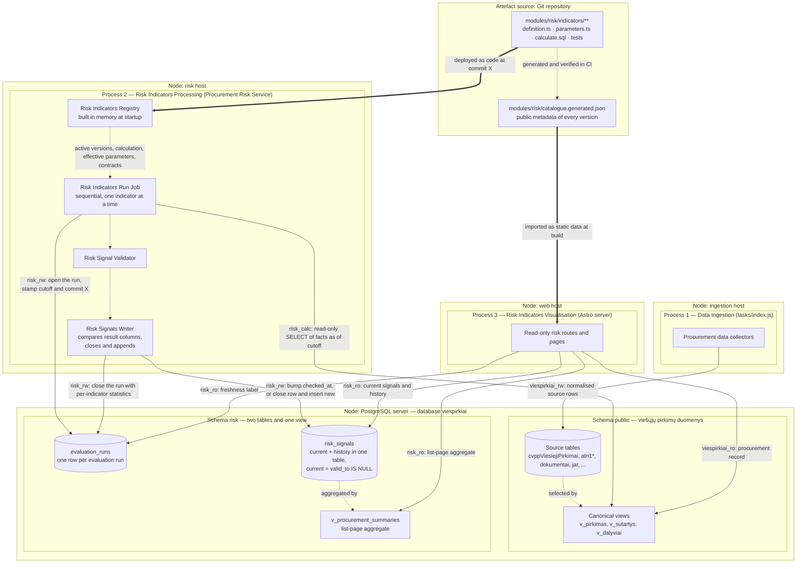
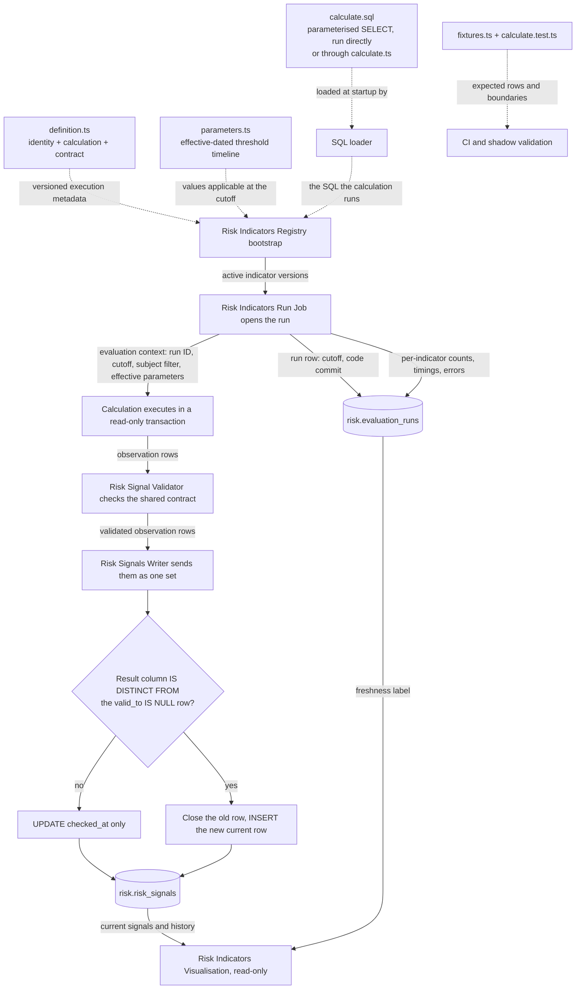
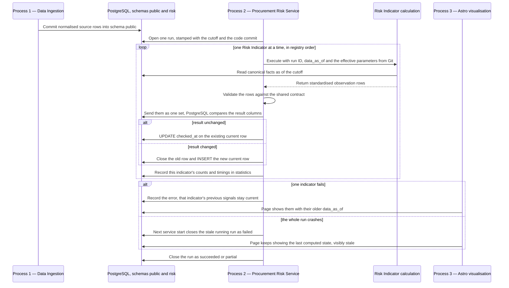
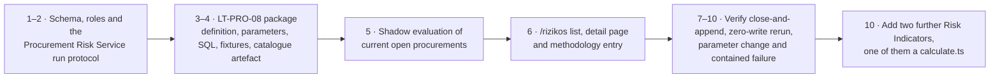

# Procurement Risk Service Architecture

Status: detailed design

Date: 2026-08-11

Core
methodology: [OCP 2024 Red Flags in Public Procurement](https://www.open-contracting.org/wp-content/uploads/2024/12/OCP2024-RedFlagProcurement.pdf)

Indicator catalogue: [Canonical Lithuanian catalogue](indicators-canonical.md)

Parent design: [Risk signals for current and recently completed procurements](risky-procurements-initial-design.md)

Database schema: [`risk-schema.md`](risk-schema.md)

## 1. Design decisions

1. Published indicator results are public and are displayed with their source facts, calculation, version and
   limitations.
2. Every indicator carries a canonical Lithuanian catalogue ID of the form `LT-<AREA>-<NN>`, for example `LT-PRO-08`
   ([canonical catalogue](indicators-canonical.md)). The definition records the source codes the concept derives from —
   `OCP-R003`, `OLAF-CN29`, `VPT-I01` — as references, so an OCP-derived indicator stays traceable to OCP while
   remaining a viespirkiai indicator.
3. A public result is called a **risk signal** (`rizikos signalas`): a reason to review a procurement.
4. Ranking is countable. The list orders by the number of triggered indicators, severity is a constant of the indicator
   version held in the Git catalogue, and data coverage is stated from `missing_data`
   ([`risk-schema.md`](risk-schema.md) §3).
5. A **Risk Indicator** is a versioned package consisting of metadata, public explanation, effective-dated parameters,
   calculation and tests. The package lives entirely in the Git repository.
6. A Risk Indicator calculates and returns rows; the Risk Signals Writer persists them. A calculation executes under a
   read-only database role inside a read-only transaction, and every indicator satisfies one calculation contract
   ([§5.3.1](#531-the-calculation-contract)).
7. Risk calculation runs in its own process — the **Procurement Risk Service** — which holds its own database roles and
   its own deployment lifecycle ([§13](#13-process-isolation-from-the-existing-task-runner)).
8. PostgreSQL views in `public` provide canonical facts. A web request reads persisted risk results; the calculation
   itself belongs to the evaluation run.
9. The public Astro application is a read-only consumer of `risk.risk_signals` and the generated catalogue artefact.
10. PostgreSQL provides durable coordination and computation; TypeScript provides the registry, execution, validation
    and operational control. The design uses no separate analytics or orchestration platform.
11. The system has exactly three processes with separate lifecycles and separate database roles: **Data Ingestion**,
    **Risk Indicators Processing** and **Risk Indicators Visualisation**. They exchange committed PostgreSQL rows and
    nothing else.
12. Risk Indicators Processing is one **single sequential job**. It executes the applicable Risk Indicators one after
    another.
13. **Git is the only home of a Risk Indicator.** `git log`, `git blame` and a pull-request diff answer who changed
    which threshold, when and why. PostgreSQL stores results and run control state.
14. **Every identifier in the Procurement Risk Service is English** — schema, tables, columns, TypeScript fields, SQL
    aliases, roles, module paths and enum values. This keeps the system aligned with international and EU
    procurement-fraud terminology, where the concepts already have settled names. Lithuanian survives as **label
    values** the GUI renders (`titleLt`, `descriptionLt`, `limitationLt`, `formulaLt`), and those live in the indicator
    catalogue in Git.

The naming boundary is exact and worth stating, because the rest of the repository follows the opposite convention: the
`public` schema is Data Ingestion's and keeps its Lithuanian domain names (`pirkimas`, `tiekejas`, `sutartis`,
`jarKodas`). A risk calculation reading those views crosses the boundary in a single statement, and the rule is
positional — Lithuanian on the left of an `AS`, English on the right ([§5.4](#54-sql-calculation-example)).

The OCP guide describes an indicator through its definition, reason for being a red flag, required data, method, unit of
analysis, procurement stage, example and source. The local indicator package preserves these fields and adds operational
fields: implementation version, parameters, lifecycle state, owner, tests, public wording and known limitations.

### 1.1 The three processes

The concrete stack is **TypeScript + PostgreSQL**. Each process has a single business purpose, its own deployment
lifecycle, its own database role and its own failure mode. Committed PostgreSQL rows are the only integration between
them.

| # | Process                           | Business purpose                                                                             | Deployed as                                                                                        | Writes                                         | Reads                                                                                 |
|---|-----------------------------------|----------------------------------------------------------------------------------------------|----------------------------------------------------------------------------------------------------|------------------------------------------------|---------------------------------------------------------------------------------------|
| 1 | **Data Ingestion**                | Populate the viešieji pirkimai data: fetch, normalise and version public procurement records | Existing task runner (`tasks/index.js`)                                                            | `public` schema source tables only             | Public sources (CVP IS, CVPP, TED, JAR, documents)                                    |
| 2 | **Risk Indicators Processing**    | Execute every applicable Risk Indicator, one by one, and record the resulting signals        | **Procurement Risk Service** — one long-running Node process running one sequential evaluation run | `risk.evaluation_runs` and `risk.risk_signals` | `public` canonical views; the deployed Git definitions; `risk` for the previous state |
| 3 | **Risk Indicators Visualisation** | Show a procurement's risk signals, methodology and coverage to the public                    | Existing Astro web application                                                                     | Nothing                                        | `risk` signals read-only; `catalogue.generated.json`; `public` procurement record     |

The separation buys four operational properties:

- a broken ingestion refresh leaves the last computed signals visible, labelled with their older `data_as_of`;
- a failed indicator leaves its previous signals current and records a `calculation_error` state of its own;
- a web deployment is unable to mutate risk results, because its role holds no write grant on `risk`;
- rewriting an indicator's calculation touches neither ingestion nor web code.

Process 1 is fully decoupled from `risk`: ingestion holds no grant on the risk schema. Process 2 takes the set of
indicators to execute from the deployed registry and records each run in one run table ([§7.1](#71-evaluation-runs)),
executing exactly one run at a time.

### 1.2 Deployment view

Outer boxes with a `Node:` prefix are deployment nodes (hosts). Inner boxes are the three processes and their
components. Cylinders are storage areas — the two schemas of the existing `viespirkiai` database. Solid arrows leaving a
process are database connections, labelled with the role used and what crosses the wire. Dotted arrows are in-process
calls and stay inside one node. The Git repository is drawn as a deployment artefact source: it is what the two Node
processes are built from.

**Diagram: deployment of the three processes over the `viespirkiai` database.**



Database roles make the process separation enforceable rather than conventional:

| Role                         | Used by                          | Grants                                                                                                 |
|------------------------------|----------------------------------|--------------------------------------------------------------------------------------------------------|
| `viespirkiai_rw`             | Process 1                        | Read/write on `public`                                                                                 |
| `risk_calc`                  | Process 2, during a calculation  | `SELECT` on the `public` canonical views, used inside a read-only transaction with a statement timeout |
| `risk_rw`                    | Process 2, for recording results | `SELECT`, `INSERT`, `UPDATE` on `risk`                                                                 |
| `risk_ro` / `viespirkiai_ro` | Process 3                        | `SELECT` on the `risk` tables and view and on the `public` canonical views                             |
| `risk_maint`                 | Scheduled retention job          | `DELETE` on `risk.risk_signals` ([`risk-schema.md`](risk-schema.md) §4)                                |

Closed signal rows are the recent-change history, so removing them is a scheduled maintenance concern held by its own
role rather than an application capability.

A new indicator version becomes active once both Process 2 and Process 3 run the same commit;
[§10.1](#101-adding-a-risk-indicator) makes this a step in the procedure. A page that meets an observation whose version
is absent from its catalogue artefact renders the indicator ID together with the evidence stored on the observation.

#### 1.2.1 Storage areas

Risk data lives in three places, and two of them are in PostgreSQL. Section 5 defines the Git package; section 7
summarises the database and links the full DDL in [`risk-schema.md`](risk-schema.md).

| Area            | Where                              | Contents                                                                                                                  | Written by                         | Visible to visualisation                                      | Retention                                                                                       |
|-----------------|------------------------------------|---------------------------------------------------------------------------------------------------------------------------|------------------------------------|---------------------------------------------------------------|-------------------------------------------------------------------------------------------------|
| **Definitions** | Git — `modules/risk/indicators/**` | Identity, versions, lifecycle, public wording, effective-dated parameters, calculation, tests                             | A reviewed and merged pull request | Yes, via `catalogue.generated.json` built into the web bundle | Forever, as repository history                                                                  |
| **Runs**        | `risk.evaluation_runs`             | One row per evaluation run: cutoff, code commit, state, per-indicator statistics                                          | Risk Indicators Processing         | Yes — the freshness label and the "is the job healthy" check  | Forever; ~365 rows a year                                                                       |
| **Signals**     | `risk.risk_signals`                | Every current and historical `(subject, indicator)` result state, with evidence, applied parameters and the producing run | Risk Indicators Processing         | Yes — this is the public read model                           | Current rows forever; closed rows are the recent-change history and are deleted after one month |

The flow is one-way, **definitions + facts → signals**: a calculation reads the deployed definition and the `public`
schema and produces rows. Because definitions live outside the database, a signal row is self-sufficient — it stores the
indicator ID, the implementation version, the exact parameter values applied, the run that produced it (which carries
the code commit) and the structured evidence. That row stays explainable years later, and it stores no display text, so
correcting the Lithuanian wording is a commit rather than a rewrite of history.

### 1.3 Data flow across the three processes

Solid arrows are runtime data flows; their labels name the data crossing the boundary. Dotted arrows are code or
configuration dependencies.

**Diagram: data flow from ingested facts to published risk signals.**

```mermaid
flowchart LR
    subgraph ingestion["Process 1 — Data Ingestion and the state it publishes"]
        S["Procurement data collectors"]
        C[("Canonical procurement facts<br/>schema public")]
        S -->|" normalised procurement records "| C
    end

    subgraph processing["Process 2 — Risk Indicators Processing"]
        M["Git: Risk Indicator definitions<br/>and effective-dated parameters"]
        G["Risk Indicators Registry"]
        K["Risk Indicators Run Job"]
        I["Risk Indicator calculation<br/>packaged SELECT, or a function over it"]
        T["Risk Signal Validator"]
        P["Risk Signals Writer"]
        M -.->|" deployed code, loaded and validated at startup "| G
        G -.->|" active versions and their implementations "| K
        G -.->|" declares the output contract "| T
    end

    subgraph storage["Schema risk — written only by Process 2"]
        J[("evaluation_runs")]
        H[("risk_signals")]
        R["v_procurement_summaries"]
        H -.->|" aggregated at query time "| R
    end

    subgraph visual["Process 3 — Risk Indicators Visualisation"]
        A["Astro read-only routes"]
        U["Public risk pages and API"]
        A -->|" rendered HTML or JSON response "| U
    end

    K -->|" one open run, stamped with cutoff and commit "| J
    K -->|" cutoff and effective parameters "| I
    C -->|" canonical facts as of cutoff "| I
    I -->|" standard observation rows "| T
    T -->|" validated rows "| P
    P -->|" unchanged: bump checked_at<br/>changed: close row, insert new "| H
    P -->|" per-indicator statistics, terminal state "| J
    H -->|" current signals, detail and history "| A
    R -->|" list page ordering and counts "| A
    J -->|" freshness label "| A
```



### 1.4 Component responsibilities

| Component                   | Process | Concrete form                                                                                                                                                                                                             | Responsibility and boundary                                                                                                                                                                                                                                                                                         |
|-----------------------------|---------|---------------------------------------------------------------------------------------------------------------------------------------------------------------------------------------------------------------------------|---------------------------------------------------------------------------------------------------------------------------------------------------------------------------------------------------------------------------------------------------------------------------------------------------------------------|
| Procurement data collectors | 1       | Existing scrapers and importers                                                                                                                                                                                           | Fetch and normalise public source data into `public`. They hold no permission on `risk`.                                                                                                                                                                                                                            |
| Canonical procurement facts | 1       | PostgreSQL tables and views in `public`                                                                                                                                                                                   | Present procurements, notices, lots, bids, awards, contracts, buyers and suppliers with stable keys and `valid_from`/`valid_to` semantics. They are the reproducible facts read at `data_as_of`.                                                                                                                    |
| Risk Indicator parameters   | 2       | Effective-dated entries in `parameters.ts`, versioned in Git                                                                                                                                                              | Hold reviewed thresholds, method scopes, legal dates and exclusions in a file separate from the formula. The run cutoff selects the applicable entry, and `git blame` shows who approved it.                                                                                                                        |
| Risk Indicators Registry    | 2       | Immutable in-process TypeScript catalogue, built from the deployed code at startup                                                                                                                                        | Resolves `(indicator ID, version)` to one validated Risk Indicator: implementation, subject, lifecycle, inputs, effective parameters, output contract and public methodology. Section 5.2 defines it precisely.                                                                                                     |
| Evaluation run              | 2       | `risk.evaluation_runs`                                                                                                                                                                                                    | One durable row per run holding cutoff, code commit, terminal state and per-indicator statistics. It answers whether the job ran and whether it succeeded.                                                                                                                                                          |
| Risk Indicators Run Job     | 2       | One sequential TypeScript loop, single instance guaranteed by an advisory lock                                                                                                                                            | Takes the advisory lock, opens the run row with the cutoff, walks the registry's active versions and invokes each declared calculation with the cutoff and the effective parameters, recording the outcome into `statistics`. It is indicator-independent: one failing indicator is recorded and the run continues. |
| Risk Indicator calculation  | 2       | One function per indicator version, living in its own directory — most often the `{ sqlFile }` shorthand for a single packaged `SELECT`, otherwise a `calculate.ts` that runs its own packaged SQL and processes the rows | Produces the standard observation rows for one indicator at one cutoff, reading canonical facts through the evaluation context ([§5.3.1](#531-the-calculation-contract)).                                                                                                                                           |
| Risk Signal Validator       | 2       | Shared TypeScript validation module plus database permissions                                                                                                                                                             | Validates the returned rows: field types, allowed states, subject and indicator identity, evidence size, duplicate keys and cross-row invariants. SQL safety comes from a read-only role, a read-only transaction and a statement timeout.                                                                          |
| Risk Signals Writer         | 2       | Shared TypeScript module issuing indicator-independent PostgreSQL statements                                                                                                                                              | Sends the validated observations to PostgreSQL as one set and lets the database decide what changed: it advances `checked_at`, closes every current row whose result columns differ from the incoming one, and inserts the replacements — three statements per indicator, in one transaction.                       |
| Risk signals                | 2 → 3   | `risk.risk_signals`                                                                                                                                                                                                       | Holds current and historical state together, distinguished by `valid_to IS NULL`. Preserves state, evidence, indicator version, applied parameter values and `data_as_of` for audit and history queries. Result columns are immutable after insert.                                                                 |
| Procurement summary         | 2 → 3   | `risk.v_procurement_summaries`                                                                                                                                                                                            | Aggregates current signals per procurement for list-page counts, ordering and filters.                                                                                                                                                                                                                              |
| Astro read-only routes      | 3       | Existing web application using a read-only role                                                                                                                                                                           | Query the `risk` signals, the summary view and the run row, and read all indicator wording from `catalogue.generated.json`. The web bundle excludes the registry and every calculation module.                                                                                                                      |
| Public risk pages and API   | 3       | Browser-visible HTML and public JSON                                                                                                                                                                                      | Display the list, procurement detail and methodology with evidence, freshness and “signal is not proof” wording.                                                                                                                                                                                                    |

The schedule guarantees that a run eventually starts. A PostgreSQL `NOTIFY` issued by ingestion serves as an optional
wake-up hint that shortens the delay between a source refresh and the next run.

## 2. Public information architecture

Three connected pages:

- `/rizikos` — find open and recently changed procurements with active signals;
- `/rizikos/pirkimas/:source/:id` — see all evidence and evaluated indicators for one procurement;
- `/rizikos/metodika` — inspect the public indicator catalogue, formulas, versions and coverage.

The existing procurement page remains the authoritative procurement record. Risk pages link to it and to original CVP
IS/CVPP documents rather than duplicating every field.

### 2.1 Main list page wireframe

All names and values below are fictional demonstration data.

```text
┌─────────────────────────────────────────────────────────────────────────────┐
│ Rizikos signalai viešuosiuose pirkimuose                    [Metodika]      │
│                                                                             │
│ Automatiniai indikatoriai padeda rasti pirkimus, kuriuos verta peržiūrėti.  │
│ Signalas nėra pažeidimo ar korupcijos įrodymas.                             │
│ [Kaip skaičiuojama]  Duomenys atnaujinti 2026-08-10 19:05                   │
├─────────────────────────────────────────────────────────────────────────────┤
│ [Atviri dabar 1 284] [Neseniai pasibaigę] [Pakeistos sutartys]              │
│                                                                             │
│ 143 su bent vienu signalu  ·  22 nauji per 24 val.  ·  7 aktyvūs rodikliai  │
├───────────────┬─────────────────────────────────────────────────────────────┤
│ FILTRAI       │ Rikiuoti: [Daugiausiai signalų ▼]                           │
│               │                                                             │
│ Signalo grupė │ ┌─────────────────────────────────────────────────────────┐ │
│ □ Konkurencija│ │ 3 signalai · terminas po 14 val.                        │ │
│ □ Skaidrumas  │ │ Mokyklų maitinimo paslaugos (demonstracinis pavyzdys)   │ │
│ □ Procedūra   │ │ Pirkėjas: Pavyzdžio miesto administracija               │ │
│ □ Tiekėjas    │ │ Atviras konkursas · paslaugos · 55500000 · €480 000     │ │
│ □ Sutartis    │ │ Paskelbta 2026-08-06 · terminas 2026-08-11 09:00        │ │
│               │ │                                                         │ │
│ Etapas        │ │ LT-PRO-08  Trumpas pasiūlymų pateikimo terminas         │ │
│ □ Atviras     │ │            4,8 dienos; taikoma riba 10 dienų            │ │
│ □ Vertinamas  │ │ LT-PRO-06  Pirkimo skaidymas siekiant išvengti ribos    │ │
│ □ Sutartis    │ │            €480 tūkst.; 3 panašūs pirkimai per 90 d.    │ │
│               │ │ LT-TRA-03  Pagrindiniai dokumentai neprieinami          │ │
│ Vertė         │ │            2 dokumentai pakeisti likus 24 val.          │ │
│ [nuo] [iki]   │ │                                                         │ │
│               │ │ Duomenų pakankamumas: 6 iš 7 rodiklių įvertinti         │ │
│ BVPŽ          │ │ [Peržiūrėti signalus] [Atverti pirkimą]                 │ │
│ Pirkėjas      │ └─────────────────────────────────────────────────────────┘ │
│ Būdas         │                                                             │
│ Šaltinis      │ ┌─────────────────────────────────────────────────────────┐ │
│               │ │ 1 signalas · pasiūlymų teikimas                         │ │
│ [Išvalyti]    │ │ ...                                                     │ │
└───────────────┴─────────────────────────────────────────────────────────────┘
```

### 2.2 Header and aggregate numbers

The header establishes interpretation before showing results. It contains:

- a one-sentence purpose;
- a permanent “signal is not proof” statement;
- `data_as_of` of the underlying signals, distinct from the web page generation time;
- a link to the public methodology;
- counts calculated from the same current read model as the results.

The headline states “143 procurements with at least one active signal”, which is the claim the data supports.

Tabs are lifecycle scopes over the same read model:

- **Atviri dabar** — future bid deadline;
- **Neseniai pasibaigę** — deadline or award in the selected recent period;
- **Pakeistos sutartys** — newly signed or materially changed contracts.

### 2.3 Result card

The result card answers five questions in order:

1. **What is it?** Title, buyer, method, CPV, value and dates.
2. **What brought it here?** Triggered indicator names.
3. **What was observed?** Raw value and threshold or comparison in one sentence.
4. **What is the evaluation coverage?** Evaluated, applicable and insufficient counts.
5. **Where is the evidence?** Detail page and original procurement.

Each indicator line uses the canonical code (`LT-PRO-08`) and short public name. Severity may control a left border or
icon; colour is supplementary and accessible text is mandatory. The card carries the decisive fact and its comparison,
and the detail page carries the full calculation.

### 2.4 Filtering and sorting

URL-backed filters:

- lifecycle scope and event-date interval;
- indicator ID;
- signal family and severity;
- buyer and supplier, when known;
- procurement method and object type;
- CPV prefix;
- value interval;
- EU funding;
- source;
- evaluation coverage (`complete`, `partial`, `insufficient`);
- data freshness.

Sort options:

- number of triggered signals, descending (default);
- nearest deadline;
- most recently published or changed;
- largest value;
- lowest data coverage, useful for transparency monitoring.

The default order is a count of triggered indicators: countable, explainable and free of calibration ([
`risk-schema.md`](risk-schema.md) §3). Severity acts as a filter by expanding the catalogue's severity set into
indicator IDs.

## 3. Procurement risk detail page

The detail page makes a public result independently understandable.

```text
Mokyklų maitinimo paslaugos (demonstracinis pavyzdys)
Pasiūlymų teikimas · CVP IS 7000000

3 aktyvūs signalai                          Duomenys iki 2026-08-10 19:05
7 taikomi indikatoriai: 6 įvertinti, 1 nepakanka duomenų

Pirkimo eiga
● 08-06 paskelbta ── ● 08-10 pakeisti dokumentai ── ○ 08-11 terminas

LT-PRO-08 · Trumpas pasiūlymų pateikimo terminas
┌────────────────────────────────────────────────────────────────────┐
│ Ką matome                                                          │
│ Nuo paskelbimo iki termino: 4,8 kalendorinės dienos.               │
│                                                                    │
│ Kaip skaičiuota                                                    │
│ 2026-08-11 09:00 − 2026-08-06 13:48 = 4,8 dienos.                  │
│ Šiam būdui taikytas parametras: 10 dienų.                          │
│                                                                    │
│ Kontekstas                                                         │
│ To paties būdo ir BVPŽ grupės mediana: 10,8 dienos (n=842).        │
│                                                                    │
│ Šaltiniai                                                          │
│ CVP IS skelbimas · pirkimo duomenys · nuskaityta 19:05             │
│                                                                    │
│ Apribojimai                                                        │
│ Pagreitinta procedūra ar teisėta išimtis gali paaiškinti terminą.  │
│                                                                    │
│ Metodika: LT-PRO-08, versija 2 · aktyvi nuo 2026-07-01             │
│ Šaltinio kodai: OCP-R003, OCP-R014, OLAF-CN29, OT-I04              │
└────────────────────────────────────────────────────────────────────┘

[Kiti aktyvūs signalai]
[Įvertinti, bet nesuveikę indikatoriai (3)]
[Nepakanka duomenų (1)]
```

### 3.1 Signal explanation contract

Every public signal expands to the same sections:

- **Ką matome** — plain-language observation;
- **Kaip skaičiuota** — formula with this procurement's values;
- **Riba arba palyginimas** — the exact effective parameter or peer population;
- **Kontekstas** — comparison sample, if relevant;
- **Šaltiniai** — links, identifiers and data-as-of time;
- **Apribojimai** — common legitimate explanations and known data gaps;
- **Metodika** — indicator ID, implementation version, the effective date of the parameter entry applied, and the source
  catalogue codes the concept references.

The page renders these sections from structured evidence, and the rendering layer owns all markup.

### 3.2 Evaluation coverage disclosure

The detail page discloses evaluation coverage in proportion to its interest:

- a collapsed **“Įvertinti, signalas nenustatytas”** section;
- a visible **“Nepakanka duomenų”** count, listing the missing fields after expansion;
- `not_applicable` indicators kept out of the main count and available in the methodology detail;
- `calculation_error` shown as a temporary data-processing notice, preserved as its own state, and raised to
  maintainers.

Stating coverage explicitly is what keeps an absent signal readable as "checked, nothing found" or "not evaluated"
rather than as a clean bill of health.

### 3.3 Change history

The page shows a short history of signal appearance, change and clearance:

```text
2026-08-10 19:05  LT-TRA-03 appeared after a new document version was observed
2026-08-09 18:10  LT-PRO-08 recalculated: deadline extended from 3.8 to 4.8 days
2026-08-06 14:02  First evaluation completed
```

The history derives from the signal rows themselves. It is one query — every row for this procurement ordered by
`valid_from` — because a closed row (`valid_to IS NOT NULL`) is exactly a state that used to be shown. Each line's
timestamp is that row's `valid_from`, and the reason for the change follows from comparing its `raw_value` and
`indicator_version` with the row it replaced.

The page preserves two distinctions the data supports:

- a signal that **stopped** (a new row with a different state) against one that is merely **stale** (no new row, and
  `checked_at` falling behind);
- a change caused by the **procurement** (same indicator version, different measured value) against one caused by **the
  methodology** (a new `indicator_version`, or the same version with different `applied_parameters`). Presenting a
  threshold change as a change in the buyer's behaviour would misrepresent the record.

## 4. Public methodology catalogue

`/rizikos/metodika` makes the system inspectable. It contains:

- link and citation to the OCP core document and the other source catalogues;
- explanation of `triggered`, `not_triggered`, `insufficient_data` and `not_applicable`;
- a searchable indicator catalogue;
- active, shadow and retired versions;
- calculation and parameter history;
- coverage and trigger-rate statistics by year, method and CPV where samples are safe;
- known source limitations and freshness;
- a change log.

Example catalogue row:

| ID        | Public name                          | Stage  | Unit        | Active version | Coverage, 30 d. | Trigger rate | Updated    |
|-----------|--------------------------------------|--------|-------------|---------------:|----------------:|-------------:|------------|
| LT-PRO-08 | Trumpas pasiūlymų pateikimo terminas | Tender | Procurement |              2 |           98.9% |         7.4% | 2026-07-01 |

Opening a row shows the canonical definition, the source-catalogue references, the local profile, required data, the
exact SQL-style formula, exclusions, parameters, an example, limitations, owner and validation date.

Everything on this page except the statistics comes from `catalogue.generated.json`, the artefact generated from the
indicator directories and shipped inside the web bundle. The statistics come from `risk.risk_signals`. Sourcing wording
from the deployed code is what lets the methodology page describe retired versions and versions with zero current
signals. Where the repository is public, each entry links directly to the directory and to the commit history of its
thresholds.

## 5. The Risk Indicator package

A **Risk Indicator** is the policy concept and reproducible test that turns public procurement facts into one of four
states: `triggered`, `not_triggered`, `insufficient_data` or `not_applicable`. The service records a fifth state,
`calculation_error`, on its behalf when a calculation fails.

Concretely, **a Risk Indicator is one directory in the Git repository**. Everything that defines it — its meaning, its
applicability, the thresholds it has used since which date, its calculation and its public explanation — is a file in
that directory. Its whole lifecycle, from `draft` to `retired`, is a sequence of reviewed commits.

### 5.1 The Risk Indicator directory

```text
modules/risk/indicators/LT-PRO-08/     ← one directory = one Risk Indicator
│
├── definition.ts        WHAT IT IS. The single exported object all other
│   │                    components resolve. Contains:
│   ├── key              identity: { id: 'LT-PRO-08', version: 2 } — stamped on
│   │                    every observation this indicator ever produces
│   ├── lifecycle        'draft' | 'shadow' | 'active' | 'retired' — this line
│   │                    activates or retires the indicator
│   ├── stage            'planning' | 'tender' | 'award' | 'contract'
│   ├── subjectType      what one result row is about: 'procurement', 'lot', ...
│   ├── owner            responsible team, mirrored by CODEOWNERS on this directory
│   ├── references       source catalogue codes: OCP-R003, OLAF-CN29, OT-I04, ...
│   ├── standard         primary citation: document name, URL and page
│   ├── public           WHAT THE PUBLIC READS. titleLt, descriptionLt,
│   │                    limitationLt, formulaLt — the only text the web renders
│   ├── requiredInputs   fields that must be present, else 'insufficient_data'
│   ├── applicability    scope rules that decide 'not_applicable'
│   ├── sourceRelations  canonical views the calculation reads
│   ├── calculation      the one function that produces observations, or the
│   │                    { sqlFile } shorthand for the common one-SELECT case
│   └── outputContract   runtime validation of the rows the calculation returns
│
├── parameters.ts        WHAT IT COMPARES AGAINST. An append-only, effective-dated
│   │                    timeline kept in its own file so a threshold change is a
│   │                    one-line, reviewable, blameable diff:
│   └── entries[]        { validFrom, validTo, scope: { methods, objectTypes },
│                          values: { minimumDays: 10, ... }, source, note }
│
├── calculate.sql        HOW IT CALCULATES, for the common case: one pure,
│                        parameterised SELECT — $1 run ID, $2 data_as_of, $3
│                        effective parameters, $4 optional subject filter.
│   and/or
├── calculate.ts         HOW IT CALCULATES, for an indicator with an internal
│                        shape: an ordinary function over the evaluation context,
│                        free to run its own packaged .sql files from this
│                        directory, process the rows and assemble the
│                        observations. Same inputs and same output contract
│                        either way (§5.3.1).
│
├── fixtures.ts          PROOF IT IS RIGHT. Deterministic input rows for the
│                        triggered / not-triggered / insufficient / not-applicable
│                        cases, boundary values and effective-date transitions.
├── calculate.test.ts    Assertions over those fixtures, run in CI.
│
└── README.md            Optional reviewer context: interpretation notes, known
                         false positives, decisions taken during review.
```

Read that as the definition of the entity: **identity + lifecycle + public wording + applicability + parameter
timeline + exactly one calculation + tests**. A change to any file in the directory is a change to the indicator,
visible in one `git log modules/risk/indicators/LT-PRO-08/`.

The rest of the repository is shared machinery that every indicator reuses:

```text
modules/risk/
  contracts.ts               # shared observation and run contracts
  registry.ts                # explicit imports of every Risk Indicator version
  sqlLoader.ts               # loads packaged SQL at process start
  catalogue.generated.json   # public metadata of all versions, generated from the
                             # definitions, committed, verified in CI, imported by Astro
services/procurement-risk/
  index.ts                   # service entry point and single-instance advisory lock
  runJob.ts                  # opens the run, executes Risk Indicators one at a time
  validate.ts                # runtime output and cross-row checks
  write.ts                   # column comparison, close-and-append into risk.risk_signals
migrations/risk/
  001_risk.sql               # the whole schema: two tables and one view
```

The catalogue is the set of indicator directories; the only migration is the DDL in
[`risk-schema.md`](risk-schema.md).

#### 5.1.1 Git as the single audit trail

Keeping the whole entity in Git gives:

- **One audit trail.** `git log -p modules/risk/indicators/LT-PRO-08/parameters.ts` shows who raised a threshold, when,
  in which pull request, with what justification in the commit message.
- **One source of truth.** The deployed commit *is* the definition, and every run records that commit.
- **Atomic review.** Formula, threshold, public wording and tests change in one pull request under one CODEOWNERS
  approval.
- **Trivial rollback.** Reverting a commit reverts the indicator, including its wording and thresholds.
- **A small schema.** `risk` holds results and run control state: two tables and one view.

### 5.2 The Risk Indicators Registry

A **Risk Indicator definition** is a read-only TypeScript object conforming to the shared `RiskIndicator` contract. It
describes how one exact indicator version is executed, validated, explained and audited. It is metadata and executable
wiring around the formula.

The definition is written in TypeScript regardless of what language the formula uses. LT-PRO-08 has a TypeScript
definition while its calculation is a PostgreSQL `SELECT` in `calculate.sql`.

Expressing the definition as a checked TypeScript type gives two layers of protection:

1. **Compile-time checks** reject missing fields and misspelled lifecycle, stage or state literals, and incompatible
   calculation or parameter types, during development and CI.
2. **Startup runtime checks** reject duplicate IDs, a second active version of one indicator, an unreadable SQL file,
   overlapping or gapped parameter validity ranges, and public text that violates the required contract.

The **Risk Indicators Registry** is the immutable, explicitly constructed in-process catalogue of every deployed Risk
Indicator definition. Its key is `(indicator_id, implementation_version)`. Given that key, the Risk Indicators Run Job
retrieves exactly one validated definition. The registry also answers which version is `active`, `shadow` or `retired`.

`createRiskIndicatorRegistry` validates the definition files when the Procurement Risk Service starts. Each run stores
the code commit it was deployed from, so any published result traces back to the exact repository state that produced
it.

A definition declares two kinds of input:

- `sourceRelations` — canonical PostgreSQL facts the calculation reads;
- `parameters` — effective-dated policy values from `parameters.ts`, selected at `data_as_of`. A deployed parameter
  change takes effect on the next run.

#### 5.2.1 Indicator independence and execution order

Each calculation reads canonical facts from `public` together with its own effective parameters, which is what lets it
execute as `risk_calc`. The registry's active versions therefore form an unordered set, and the run job iterates them in
declaration order because iteration needs an order; any permutation produces the same signals.

Indicators that look derived — LT-PRO-03 institutional use of non-competitive methods, LT-COM-04 buyer–supplier
concentration, LT-COM-06 market concentration — aggregate procurement *facts*. A shared intermediate such as a peer
median or a market-share denominator becomes a canonical view in `public`, or a derived table computed once before the
loop: a fact available to every indicator on equal terms.

#### 5.2.2 The run cutoff and the subject set

A run has exactly two inputs:

- **`data_as_of` is the run's clock**, read once at run start and passed to every calculation as `$2`. It keeps one run
  internally consistent — the first and the hundredth indicator agree on what "now" means — and makes a rerun at the
  same cutoff reproducible for every deadline and age comparison. Every time comparison in an indicator's SQL goes
  through `$2`, which is the enforceable form of "reproducible", and it is a test.
- **The subject set is the indicator's own `WHERE` clause.** Each indicator has its own unit of analysis (procurement,
  lot, contract, supplier) and its own applicability, so scoping belongs to the definition that owns it. `$4` carries an
  explicit subject array for a backfill or a single-procurement rerun, and `NULL` for a normal full run.

A full run is one set-based query per indicator, so re-evaluating an unchanged procurement costs almost nothing on the
read side. The write side is bounded by writing only on change ([§7.2](#72-current-state-and-history-in-one-table)).

### 5.3 Definition and registry example

This abbreviated example shows the contracts, one definition, explicit registration and lookup. The shared runtime
contracts validate values that cross a trust boundary, including rows returned by PostgreSQL.

```ts
type IndicatorLifecycle = 'draft' | 'shadow' | 'active' | 'retired';
type IndicatorStage = 'planning' | 'tender' | 'award' | 'contract';
type SubjectType = 'procurement' | 'lot' | 'contract' | 'supplier';

// The four states a calculation returns.
type IndicatorState =
    | 'triggered'
    | 'not_triggered'
    | 'insufficient_data'
    | 'not_applicable';

// The state stored in risk.risk_signals: the four above, plus the one the run job
// records on behalf of a calculation that failed.
type SignalState = IndicatorState | 'calculation_error';

type RuntimeContract<T> = Readonly<{
    validate(value: unknown): T;
}>;

// Canonical catalogue identity, e.g. { id: 'LT-PRO-08', version: 2 }.
type RiskIndicatorKey = Readonly<{
    id: `LT-${string}`;
    version: number;
}>;

type RiskObservationV1 = Readonly<{
    indicatorId: RiskIndicatorKey['id'];
    indicatorVersion: number;
    subjectType: SubjectType;
    subjectKey: string;
    procurementSource: string | null;
    procurementId: string | null;
    state: IndicatorState;
    rawValue: Readonly<Record<string, unknown>> | null;
    threshold: Readonly<Record<string, unknown>> | null;
    appliedParameters: Readonly<Record<string, unknown>> | null;
    evidence: Readonly<Record<string, unknown>>;
    missingData: readonly string[];
    dataAsOf: string;
}>;

type LtPro08Parameters = Readonly<{
    minimumDays: number;
    dayCounting: 'calendar_days' | 'business_days';
}>;

// One effective-dated entry of a parameter timeline. Appending an entry is the
// way a threshold changes; entries are immutable once merged.
type ParameterEntry<P> = Readonly<{
    validFrom: string;
    validTo: string | null;
    scope: Readonly<{
        methods?: readonly string[];
        objectTypes?: readonly string[];
    }>;
    values: P;
    source: string;
    note?: string;
}>;

// The evaluation context is the way a calculation reaches data. `sql` runs a .sql
// file packaged in the indicator's own directory, on the read-only risk_calc
// connection, inside the run job's read-only transaction and statement timeout.
type EvaluationContext = Readonly<{
    runId: number;
    dataAsOf: string;
    parameters: readonly ParameterEntry<unknown>[];
    subjects: readonly string[] | null;
    sql<T>(file: string, params?: readonly unknown[]): Promise<readonly T[]>;
}>;

// One contract, whatever the calculation is made of.
type Calculation = (ctx: EvaluationContext) => Promise<readonly RiskObservationV1[]>;

type RiskIndicator<P> = Readonly<{
    key: RiskIndicatorKey;
    lifecycle: IndicatorLifecycle;
    subjectType: SubjectType;
    stage: IndicatorStage;
    owner: string;
    references: readonly string[];
    sourceRelations: readonly string[];
    requiredInputs: readonly string[];
    parameters: readonly ParameterEntry<P>[];
    parameterContract: RuntimeContract<P>;
    // defineRiskIndicator expands the { sqlFile } shorthand to (ctx) => ctx.sql(sqlFile),
    // so the run job calls a Calculation and shared code stays implementation-agnostic.
    calculation: Calculation | Readonly<{ sqlFile: string }>;
    outputContract: RuntimeContract<RiskObservationV1>;
    standard: Readonly<{ name: string; url: string; page?: number }>;
    public: Readonly<{
        titleLt: string;
        descriptionLt: string;
        formulaLt: string;
        limitationLt: string;
    }>;
}>;

// parameters.ts — the effective-dated timeline. Append entries; close them with validTo.
// A git diff of this file is the complete history of "who changed which threshold".
export const ltPro08Parameters: readonly ParameterEntry<LtPro08Parameters>[] = [
    {
        validFrom: '2026-07-01',
        validTo: null,
        scope: {methods: ['Atviras konkursas'], objectTypes: ['Prekės', 'Paslaugos']},
        values: {minimumDays: 10, dayCounting: 'calendar_days'},
        source: 'approved Lithuanian procurement-rule profile',
        note: 'Demonstration value pending legal review.',
    },
];

// definition.ts — the common case: one SELECT, declared as the shorthand.
export const ltPro08v2 = defineRiskIndicator<LtPro08Parameters>({
    key: {id: 'LT-PRO-08', version: 2},
    lifecycle: 'active',
    owner: 'procurement-risk',
    subjectType: 'procurement',
    stage: 'tender',
    references: ['OCP-R003', 'OCP-R014', 'OLAF-CN29', 'OT-I04'],
    sourceRelations: ['public.v_pirkimo_gyvavimo_ciklo_versijos'],
    requiredInputs: ['publicationDate', 'submissionDeadline', 'procurementMethod'],
    parameters: ltPro08Parameters,
    parameterContract: ltPro08ParametersContract,
    calculation: {sqlFile: './calculate.sql'},
    outputContract: riskObservationV1Contract,
    standard: {
        name: 'OCP Red Flags in Public Procurement 2024',
        url: 'https://www.open-contracting.org/wp-content/uploads/2024/12/OCP2024-RedFlagProcurement.pdf',
        page: 25,
    },
    public: {
        titleLt: 'Trumpas pasiūlymų pateikimo terminas',
        descriptionLt: 'Pasiūlymams pateikti skirtas laikas trumpesnis už šiam pirkimo būdui taikomą ribą.',
        formulaLt: 'submissionDeadline − publicationDate < taikoma riba',
        limitationLt: 'Trumpesnį laiką gali teisėtai paaiškinti pagreitinta procedūra ar kita išimtis.',
    },
});

// definition.ts of an indicator with an internal shape. Everything above the
// `calculation` line is identical; the calculation itself is a function.
export const ltCom14v1 = defineRiskIndicator<LtCom14Parameters>({
    key: {id: 'LT-COM-14', version: 1},
    lifecycle: 'shadow',
    // ... same identity, lifecycle, parameters and public wording fields ...
    calculation: async (ctx) => {
        const markets = await ctx.sql<MarketRow>('./collect.sql', [ctx.dataAsOf]);
        return markets.flatMap((m) => rotationObservations(m, ctx));
    },
});

// registry.ts: registration is explicit and reviewable in a pull request.
const deployedIndicators = [
    ltPro08v2,
    ltCom14v1,
] as const satisfies readonly RiskIndicator<unknown>[];

export const riskIndicatorRegistry = createRiskIndicatorRegistry(deployedIndicators);

// runJob.ts: the whole plan. The set is unordered, the run cutoff selects the
// parameter entries in force, and each indicator scopes its own subjects.
const run = await openRun({dataAsOf: new Date(), codeCommit: COMMIT});
for (const key of riskIndicatorRegistry.activeVersions()) {
    const indicator = riskIndicatorRegistry.require(key);
    const effective = riskIndicatorRegistry.parametersAsOf(key, run.dataAsOf);
    // ... execute, validate, write; record the outcome in run.statistics
}
```

`defineRiskIndicator` freezes and type-checks one definition, validates every parameter entry against
`parameterContract`, and expands a `{ sqlFile }` shorthand into a `Calculation`. `createRiskIndicatorRegistry` performs
cross-definition and filesystem validation once at startup and exposes read-only lookup methods such as `require`,
`activeVersions` and `parametersAsOf`. The Risk Indicators Run Job is generic: after lookup it calls
`indicator.calculation(ctx)` and checks the rows against `indicator.outputContract`, so adding an indicator adds a
directory and one registry line.

`parametersAsOf` returns the entries whose validity range contains the run cutoff. Those entries are passed into the
calculation, and the matched values are copied onto every observation the run produces, so a published signal carries
its own threshold.

`RuntimeContract<T>` is a small project-owned interface with a `validate(unknown): T` operation. Stable stage,
lifecycle, state and subject values are TypeScript unions backed by those runtime checks. Public text is versioned and
reviewed, and the web application renders it from the catalogue artefact.

#### 5.3.1 The calculation contract

The [canonical catalogue](indicators-canonical.md) contains 106 indicators in five computational shapes:

| Shape                                             | Roughly | Examples                                                                                                                                                   |
|---------------------------------------------------|--------:|------------------------------------------------------------------------------------------------------------------------------------------------------------|
| Row-local arithmetic over one subject's own facts |     ~60 | LT-PRO-08 short deadline, LT-COM-01 single valid bid, LT-AWD-01/02/04 disqualification counts, LT-EXE-01–04 amendments, LT-TRA-04 contract not published   |
| Comparison against a population baseline          |     ~18 | LT-PRI-01 value vs market benchmark, LT-PRO-07 threshold bunching, LT-PRO-03 buyer's non-competitive rate, LT-COM-05 market share, LT-COM-06 concentration |
| Collect, compute a statistic, then threshold it   |      ~8 | LT-PRI-08 Benford, LT-COM-11 fixed-multiple prices, LT-COM-12 suspiciously close prices, LT-COM-14 bid rotation, LT-COM-17 repeated submission order       |
| Traversal of the ownership and person-link graph  |      ~7 | LT-COI-02/03/06 shared owner or controller, LT-SUP-10 connected bidders, LT-COI-07 politically exposed person                                              |
| Document text, spans and similarity               |      ~9 | LT-COM-16 similar bid documents, LT-PRO-10 tailored specifications, LT-AWD-07/08 award criteria, LT-EXE-09 delivery differs from specification             |

The first shape is a single `SELECT`. The others have an internal structure — **collect, process, construct**.

All five satisfy **one** calculation contract, `(ctx) => Promise<RiskObservationV1[]>`, and `{ sqlFile }` is its
shorthand for the first shape, expanded by `defineRiskIndicator` into `(ctx) => ctx.sql(file)`. Adding an indicator with
a harder shape adds a directory.

Three properties follow:

- **The three phases are a convention.** They are how an author writes `calculate.ts` and names the files next to it
  (`collect.sql`, then processing, then assembly). The steps differ between indicators — per lot, pairwise within a lot,
  per market sequence, per document span — so the convention stays a naming convention. For the ~60 row-local indicators
  the three phases collapse into one `SELECT`.
- **The safety guarantees come from `ctx`.** Its `sql` runs packaged files from the indicator's own directory, on the
  `risk_calc` role, inside a read-only transaction with a statement timeout. A TypeScript calculation and a SQL
  calculation obtain identical database capability ([§5.6](#56-delegation-of-persistence-to-the-risk-signals-writer)).
- **Shared or expensive intermediates become materialised views on measurement.** Several indicators in shapes two, four
  and five share an underlying computation — a peer benchmark per CPV division and method, the closure of the ownership
  graph. It stays a view, promoted to a `MATERIALIZED VIEW` refreshed before the indicator loop once the real corpus
  shows the need. It remains a canonical fact that every indicator reads on equal terms.

### 5.4 SQL calculation example

This is the common case of [§5.3.1](#531-the-calculation-contract): the whole calculation is one file, declared as
`calculation: { sqlFile: './calculate.sql' }`. A `calculate.ts` indicator runs its own `.sql` files through `ctx.sql`
with the same four arguments, so the statement below is also the collection step of every other indicator.

The SQL file is one parameterised, read-only `SELECT` with four inputs: `$1` is the evaluation run ID, `$2` is the
reproducible `data_as_of` cutoff, `$3` is the effective parameter entries the registry resolved from `parameters.ts` for
that cutoff, and `$4` is an optional subject-key filter — `NULL` for a normal full run, or an explicit array for a
backfill or a single-procurement rerun.

The calculation reads the `public` schema only. Its thresholds arrive as an argument and its scope arrives as an
argument, which is what makes `risk_calc` a role with grants on `public` alone.

```sql
WITH candidates AS (
    -- The subject set is a predicate, not a table. $4 IS NULL means the whole
    -- applicable population; an array restricts the run to those subjects.
    -- Columns here belong to the ingestion schema, so they stay Lithuanian.
    SELECT p.*
    FROM public.v_pirkimo_gyvavimo_ciklo_versijos p
    WHERE p.galioja_nuo <= $2::timestamptz
      AND (p.galioja_iki IS NULL OR p.galioja_iki > $2::timestamptz)
      AND ($4:: text [] IS NULL
       OR p.subjekto_raktas = ANY ($4:: text []))),
     parameters AS (
         -- $3 is the JSON array of entries already filtered to the run cutoff by the
         -- registry; SQL picks the entry whose scope matches each row.
         SELECT entry.value AS param_entry
         FROM jsonb_array_elements($3::jsonb) AS entry(value)),
     evaluated AS (SELECT c.*,
                          p.param_entry -> 'values' AS applied_parameters,
                          (p.param_entry -> 'values' ->> 'minimumDays')::numeric   AS minimum_days, EXTRACT(EPOCH FROM (c.terminas - c.paskelbta)) / 86400.0 AS submission_days
                   FROM candidates c
                            LEFT JOIN parameters p
                                      ON p.param_entry -> 'scope' -> 'methods' ? c.pirkimo_budas)
-- The output aliases are the shared observation contract, and are English.
SELECT 'LT-PRO-08'::text  AS indicator_id, 2::integer         AS indicator_version, 'procurement'::text AS subject_type, subjekto_raktas AS subject_key,
       pirkimo_saltinis                                AS procurement_source,
       pirkimo_id                                      AS procurement_id,
       CASE
           WHEN minimum_days IS NULL THEN 'not_applicable'
           WHEN paskelbta IS NULL OR terminas IS NULL THEN 'insufficient_data'
           WHEN submission_days < minimum_days THEN 'triggered'
           ELSE 'not_triggered'
           END::text      AS state, jsonb_build_object('submissionWindowDays', submission_days) AS raw_value,
       jsonb_build_object('minimumDays', minimum_days) AS threshold,
       applied_parameters,
       jsonb_build_object(
               'publicationDate', paskelbta,
               'submissionDeadline', terminas,
               'method', pirkimo_budas
       )                                               AS evidence,
       (CASE WHEN paskelbta IS NULL THEN jsonb_build_array('publicationDate') ELSE '[]'::jsonb END
           || CASE WHEN terminas IS NULL THEN jsonb_build_array('submissionDeadline') ELSE '[]'::jsonb END)
                                                       AS missing_data,
       $2::timestamptz    AS data_as_of
FROM evaluated;
```

The mapping rule is visible in that one statement: everything to the left of an `AS` may be Lithuanian, because it
belongs to the ingestion schema; everything to the right is the risk observation contract, and is English.

`applied_parameters` is the exact threshold object that decided the row. Carrying the values instead of a foreign key is
what keeps a signal explainable after the parameter timeline moves on.

The statement returns the observation contract and nothing else: identity, subject, state, measured values, evidence,
coverage and the cutoff. Public wording belongs to `catalogue.generated.json` and the validity interval belongs to the
Risk Signals Writer. The calculation states what is true about a subject at a cutoff, and a separate generic step
decides whether that constitutes a change.

The calculation role holds `SELECT`, and the run job starts a read-only transaction with a statement timeout, so
correctness rests on database permissions. Business-day counting, where required, is one shared tested PostgreSQL
function backed by an effective-dated Lithuanian calendar.

### 5.5 Component interaction inside the Procurement Risk Service

**Diagram: components of one indicator package and the shared machinery that executes it.**



`definition.ts` tells the service what LT-PRO-08's calculation is and what contract it returns. The shared run job calls
it and takes the rows: the calculation calculates, and generic components validate and persist. The Astro application
shares public response types and reads results from the database.

### 5.6 Delegation of persistence to the Risk Signals Writer

The Risk Signals Writer is the single component that owns `valid_from`, `valid_to`, `checked_at` and the
close-and-append rule. It accepts validated observation rows and issues indicator-independent statements, so a
maintainer adding a Risk Indicator writes no `INSERT` or `UPDATE` at all.

Concentrating persistence in one component gives:

- safe preview and `EXPLAIN` of any calculation;
- repeatable backtests at a chosen `data_as_of`;
- database-enforced read-only calculation permissions;
- one output validator and one write strategy;
- consistent current/history semantics across all 106 indicators;
- direct comparison of an old and a new indicator version;
- containment: a failed indicator affects its own signals only;
- one execution path shared by CI, shadow, backfill and production.

## 6. Placement of logic

Every indicator satisfies one calculation contract ([§5.3.1](#531-the-calculation-contract)), so the question for a
maintainer is which layer a given piece of logic belongs to:

| Logic                                                                   | Belongs in                                                                    | Example                                                                |
|-------------------------------------------------------------------------|-------------------------------------------------------------------------------|------------------------------------------------------------------------|
| Relational filters, joins, windows and aggregates over one subject      | A packaged `SELECT`, usually the whole calculation                            | LT-PRO-08 short deadline, LT-COM-01 single valid bid                   |
| Reusable canonical field mapping                                        | PostgreSQL view in `public`                                                   | unified procurement and bidder facts                                   |
| Stable shared database primitive                                        | SQL/PG function ([§6.3](#63-shared-postgresql-functions))                     | business days between dates                                            |
| A shared or expensive intermediate several indicators compare against   | A view, materialised once measurement demands it                              | peer benchmark per CPV division and method; ownership-graph closure    |
| Statistics, sequences, pairwise comparison, text spans, graph traversal | `calculate.ts` in the indicator's own directory, running its own packaged SQL | LT-PRI-08 Benford, LT-COM-14 bid rotation, LT-COM-16 similar documents |
| Indicator identity, contract and public metadata                        | `definition.ts`                                                               | every Risk Indicator                                                   |
| Scheduling, retries and backfills                                       | Procurement Risk Service + `risk.evaluation_runs`                             | every evaluation run                                                   |
| Result persistence and history                                          | Risk Signals Writer (column compare, close and append)                        | all Risk Indicators                                                    |

### 6.1 Default form of a calculation

`definition.ts` plus `calculate.sql`, declared with the `{ sqlFile }` shorthand, covers roughly sixty of the canonical
indicators and is the easiest form to review. SQL is set-based and executes close to the data. A `calculate.ts` is the
right form once the indicator has an internal shape — collect, process, construct.

### 6.2 Evidence obligations for text and graph calculations

The output contract is the same for every shape, and two obligations sharpen. Text analysis records exact document, page
and span references, so a reader verifies the claim against the original file. Graph traversal records the path it
relied on — which link, from which register, connecting which parties — because "connected bidders" is an
accusation-adjacent statement and the evidence is what keeps it a signal. The implementation technique is an internal
fact of the service and stays out of the public data contract.

### 6.3 Shared PostgreSQL functions

A PostgreSQL function is justified when all four conditions hold:

- several indicators need exactly the same stable primitive;
- its inputs and output are small and deterministic;
- it is independently tested and version-controlled through a migration;
- it exposes its source-table access plainly and passes a specific security review before using `SECURITY DEFINER`.

PG functions are deployment artefacts of the shared machinery.

## 7. Database schema

**The complete DDL lives in [`risk-schema.md`](risk-schema.md)** — tables, columns, indexes, view and retention. This
section holds the reasoning behind that structure; the schema document is the artefact to review and to turn into a
migration.

### 7.1 Evaluation runs

`risk.evaluation_runs` answers a question the signal rows cannot: **did the job run, and did it succeed?** A site whose
evaluation job has been silently broken for three weeks would otherwise keep displaying its flags with full confidence.
One row per run, together with `checked_at` on each signal, makes that failure visible on the page.

The commit is stored once per run rather than on every signal row, and runs are kept forever, so a signal's `run_id`
recovers the exact code that produced it. A partial unique index on `status = 'running'` is the database-enforced
backstop to the service's advisory lock.

### 7.2 Current state and history in one table

Current signals and signal history are **the same rows**, distinguished by the validity interval `valid_from` /
`valid_to`, with `valid_to IS NULL` marking the current state. The partial unique index
`(subject_type, subject_key, indicator_id) WHERE valid_to IS NULL` *is* the current-state pointer: it serves the
procurement page as an index-only lookup and makes a repeated run idempotent.

**Write on change, not on every run.** Rough sizing, on estimates rather than measurement: perhaps 200k procurements
with live lifecycles × ~100 indicators ≈ 20M evaluations per run. Appending every run nightly would be ~7 billion rows a
year, almost all identical to the night before, because an awarded and closed procurement has frozen indicators. Writing
only the rows that differ reduces that to the few thousand a night that genuinely changed, and keeps the table small
enough to serve a public page directly.

**Difference is decided in the database, on the result columns.** The writer sends the indicator's validated
observations as one set and joins them to the current rows, comparing `indicator_version`, `applied_parameters`,
`state`, `raw_value`, `threshold`, `evidence` and `missing_data` with `IS DISTINCT FROM`, so a NULL on either side
compares correctly. The comparison covers the result columns themselves, in the statement that writes them, and excludes
`run_id`, `data_as_of`, `duration_ms` and `error_info` — which is what keeps an unrelated redeploy, or a retried failure
with a different message, from registering as a changed signal.

**Advance `checked_at` on every run.** On a site that publishes red flags, "as of when" is a public claim, so each run
updates `checked_at` on the rows it re-confirms, which separates "checked last night, unchanged" from "not checked since
March". A full run evaluates the indicator's whole applicable population by construction, so this needs no join against
the returned rows:

```sql
UPDATE risk.risk_signals
SET checked_at = $2
WHERE indicator_id = $1
  AND valid_to IS NULL;
```

That is the largest write a run performs. A subject-filtered rerun adds the filter to the same statement.

Three further properties of the row:

- **All five states are stored**: `triggered`, `not_triggered`, `insufficient_data`, `not_applicable` and
  `calculation_error`. The full set is what lets the page say "we checked 12 indicators, 2 fired" and keep "checked,
  clean", "never evaluated" and "the calculation failed" apart.
- **Display text stays in the catalogue.** Titles and explanation templates come from `catalogue.generated.json`, keyed
  by `(indicator_id, indicator_version)`. The row stores the structured evidence the sentence is rendered from:
  `raw_value`, `threshold` and `evidence`, so a wording correction is a one-line commit.
- **The definition is resolved, not copied.** `(indicator_id, indicator_version)` plus the `code_commit` of the row's
  run identifies it exactly in Git, and `applied_parameters` stores the effective values that decided the row.

Result columns are immutable after insert; `checked_at` and `valid_to` are the columns a later run changes.

### 7.3 Vintage and retention

Every row carries `data_as_of` (the cutoff it was computed at) and `checked_at` (the last run that re-confirmed it), and
the page states both: *"tikrinta 2026-08-11, duomenys iki 2026-08-10"*. A stopped service leaves the site showing the
last known state with an increasingly old date.

Current rows are kept however old they are: an untouched procurement keeps its signals until an indicator changes them.
Closed rows — those a newer state replaced — are deleted after one month by the scheduled retention job ([
`risk-schema.md`](risk-schema.md) §4), because viespirkiai displays risk rather than managing it.

### 7.4 List page read model

`risk.v_procurement_summaries` aggregates current signals per procurement: triggered, insufficient, not-applicable and
error counts, the triggering indicator IDs, and the freshness bounds the page states. Stage, deadline and event date
come from joining `public.v_pirkimas` — they are ingestion facts, read where they live.

It is a **view**. Promoting it to a materialised view refreshed at the end of each run, once the real corpus shows the
need, is a change to one file.

## 8. Stored data example

### 8.1 The definition in Git

The equivalent of a catalogue row is the content of `modules/risk/indicators/LT-PRO-08/`.

`definition.ts`, summarised:

- `key` — `{ id: 'LT-PRO-08', version: 2 }`
- `lifecycle` — `active`
- `calculation` — `{ sqlFile: './calculate.sql' }`
- `stage` / `subjectType` — `tender` / `procurement`
- `owner` — `procurement-risk`
- `references` — `OCP-R003`, `OCP-R014`, `OLAF-CN29`, `OT-I04`
- `standard` — OCP Red Flags 2024, p. 25
- `public.titleLt` — Trumpas pasiūlymų pateikimo terminas
- `public.formulaLt` — `submissionDeadline − publicationDate < taikoma riba`

`parameters.ts`, one entry of the timeline:

```typescript
const parameters = {
    validFrom: '2026-07-01',
    validTo: null,
    scope: {
        jurisdiction: 'LT',
        methods: [
            'Atviras konkursas'
        ],
        objectTypes: [
            'Prekės',
            'Paslaugos'
        ]
    },
    values: {
        minimumDays: 10,
        dayCounting: 'calendar_days',
        expeditedProcedureExcluded: true
    },
    source: 'approved Lithuanian procurement-rule profile'
}
```

The number above is demonstration data, not a legal conclusion or a production threshold.

Raising that threshold to 12 days from 2027-01-01 means appending a second entry and closing this one — a four-line pull
request whose diff, author, date, reviewer and justification are the audit record:

```text
$ git log --follow -p modules/risk/indicators/LT-PRO-08/parameters.ts
commit 4f1c9ae  2026-12-18  Jonas P.  (PR #412, approved by @teise)
+   { validFrom: '2027-01-01', validTo: null, ... minimumDays: 12 ... }
-     validTo: null,
+     validTo: '2027-01-01',
```

### 8.2 Triggered signal

One current row of `risk.risk_signals`, represented as JSON. `validTo: null` marks the current state, and the gap
between `validFrom` and `checkedAt` shows a signal that first appeared on 6 August and has been re-confirmed unchanged
by every run since, which is why no further rows were written.

```json
{
  "id": 98122,
  "runId": 412,
  "indicator": "LT-PRO-08/2",
  "appliedParameters": {
    "minimumDays": 10,
    "dayCounting": "calendar_days",
    "validFrom": "2026-07-01"
  },
  "subjectType": "procurement",
  "subjectKey": "cvpis:7000000",
  "procurementSource": "cvpis",
  "procurementId": "7000000",
  "state": "triggered",
  "rawValue": {
    "submissionWindowDays": 4.8,
    "publicationDate": "2026-08-06T13:48:00+03:00",
    "submissionDeadline": "2026-08-11T09:00:00+03:00"
  },
  "threshold": {
    "minimumDays": 10,
    "dayCounting": "calendar_days"
  },
  "evidence": {
    "facts": [
      {
        "field": "publicationDate",
        "source": "CVP IS notice",
        "value": "2026-08-06T13:48:00+03:00"
      },
      {
        "field": "submissionDeadline",
        "source": "CVP IS notice",
        "value": "2026-08-11T09:00:00+03:00"
      }
    ],
    "comparison": {
      "peerDefinition": "same method and CPV division, previous 365 days",
      "medianDays": 10.8,
      "sampleSize": 842
    }
  },
  "missingData": [],
  "dataAsOf": "2026-08-10T19:05:00+03:00",
  "validFrom": "2026-08-06T21:14:00+03:00",
  "validTo": null,
  "checkedAt": "2026-08-11T03:12:00+03:00"
}
```

The page composes the published sentence from `catalogue.generated.json` entry `LT-PRO-08/2` and the structured values
above.

### 8.3 Insufficient data signal

```json
{
  "indicator": "LT-PRI-01/1",
  "subjectKey": "cvpis:7000000",
  "state": "insufficient_data",
  "rawValue": null,
  "threshold": null,
  "evidence": {},
  "missingData": [
    "winningBidAmount",
    "estimatedValue"
  ],
  "dataAsOf": "2026-08-10T19:05:00+03:00",
  "validTo": null
}
```

Both records matter. The first supports a public signal; the second supports the public coverage statement, and storing
all five states is what makes "we checked and found nothing" and "we never checked" separately expressible.

### 8.4 A signal that stopped

A buyer extends a deadline, the next run computes `not_triggered`, the `state` column differs from the current row, and
the writer closes the old row:

```text
id      indicator     state          valid_from           valid_to             checked_at
98122   LT-PRO-08/2   triggered      2026-08-06 21:14     2026-08-14 03:09     2026-08-14 03:09
99871   LT-PRO-08/2   not_triggered  2026-08-14 03:09     NULL                 2026-08-19 03:11
```

The procurement page shows row `99871`. The history panel shows both, with the date the flag was raised and the date it
was cleared, and those two rows are what the public change history in [§3.3](#33-change-history) is built from.

## 9. Evaluation run execution

The schedule or an explicit backfill request starts a run. The cutoff is the clock, the order is the registry's, and the
subject set belongs to each indicator ([§5.2.2](#522-the-run-cutoff-and-the-subject-set)).

The Procurement Risk Service:

1. takes the single-instance advisory lock, the Risk Indicators Registry having been built and validated at process
   start;
2. closes any run left `running` by a previous crash, marking it `failed`;
3. reads the clock once as `data_as_of` and opens one run row stamped with that cutoff and the code commit;
4. resolves each indicator's effective parameter entries at the cutoff and calls the active Risk Indicators'
   calculations **one at a time**, each with its own evaluation context, inside a read-only transaction with a statement
   timeout;
5. validates column types, allowed states, subject identity, uniqueness and semantic invariants after each indicator;
6. in one transaction per indicator, advances `checked_at` on that indicator's current rows, closes the ones whose
   result columns differ from the returned observation, and inserts the replacements;
7. records that indicator's counts, timings and any error in `statistics`, then continues to the next indicator;
8. closes the run as `succeeded`, or `partial` when some indicators failed.

**Diagram: one evaluation run across the three processes.**



Step 4 is where the cutoff earns its keep: an indicator compares against `$2`, so the hundredth indicator of a two-hour
run measures deadlines against the same instant as the first, and a rerun at the same cutoff produces the same answer.

Two consequences are worth stating explicitly.

**A failing indicator is contained.** Its previous signals stay current with their older `data_as_of`, and the page
shows them as such, so only the indicators that actually ran get new vintages.

**Readers observe a run in progress.** Between steps 6 and 8 a page may show LT-PRO-08 at tonight's cutoff beside
LT-PRI-01 at last night's. Every row carries `data_as_of`, so the mixture is visible on the page, and step 8 bounds how
long it lasts.

## 10. Indicator maintenance

### 10.1 Adding a Risk Indicator

1. Create `modules/risk/indicators/<ID>/` using the canonical catalogue ID and record its source-catalogue references.
2. Write `definition.ts`: Lithuanian public text, source-field mapping, applicability, exclusions and limitations, with
   `lifecycle: 'draft'`.
3. Decide the unit of analysis and the earliest lifecycle point at which it is knowable.
4. Write `parameters.ts` with the first effective-dated entry and its `source`.
5. Implement the calculation — one `calculate.sql` where that suffices, otherwise a `calculate.ts` over its own packaged
   SQL — plus fixtures for the triggered, non-triggered, insufficient and not-applicable outcomes.
6. Add integration tests against realistic database shapes.
7. Add the version to `registry.ts` and regenerate `catalogue.generated.json`; CI verifies that the artefact matches the
   definitions.
8. Merge with `lifecycle: 'shadow'`, then run a historical backtest and publish coverage and trigger-rate diagnostics.
9. Review samples; approval is the pull-request approval on the directory, recorded by CODEOWNERS.
10. Flip `lifecycle` to `'active'` in a second pull request, deploy that commit to **both** the risk service and the web
    application, then backfill current subjects.

**Diagram: adding a Risk Indicator, from directory to published signals.**

```mermaid
flowchart LR
    DIR["Author creates modules/risk/indicators/&lt;ID&gt;/<br/>definition.ts · parameters.ts · calculation · fixtures"]
    REG["Author registers the version in registry.ts<br/>and regenerates catalogue.generated.json"]
    CI["CI verifies types, registry rules, fixtures,<br/>integration tests and the catalogue artefact"]
    SH["Merge with lifecycle shadow<br/>historical backtest and diagnostics"]
    REV["Methodology review of coverage, trigger rate<br/>and sampled cases, approved via CODEOWNERS"]
    ACT["Second pull request sets lifecycle active"]
    DEP["Deploy the commit to the Procurement Risk Service<br/>and to the Astro application"]
    RUN["Next run publishes signals<br/>and backfills current subjects"]
    DIR --> REG --> CI --> SH --> REV --> ACT --> DEP --> RUN
```



Step 10 is the ordering constraint the Git-resident catalogue introduces: the web application carries the new version's
public wording before the first signal from it is published.

Adding a Risk Indicator is therefore exactly one reviewed pull request per stage, and merging the branch plus deploying
the commit to both Node processes is the whole activation procedure. The maintenance surface is one directory —
`definition.ts`, `parameters.ts`, the calculation, fixtures and tests — plus one line in `registry.ts`. The Risk
Indicators Run Job, Risk Signal Validator, Risk Signals Writer, Astro route code and the schema stay as they are; a new
indicator adds rows. They change when the observation contract itself changes.

### 10.2 Version and parameter change rules

Create a new Risk Indicator implementation version — a new `key.version` and a new definition file — for a change to:

- formula or algorithm;
- required data or source mapping in a way that changes results;
- applicability or exclusion logic;
- subject or market definition;
- the material public interpretation of what a trigger means.

Append a new effective-dated entry to `parameters.ts`, keeping the implementation version, for a change to:

- a legal numeric threshold;
- a list of mapped methods or object types supported by the same formula;
- a comparison window or sample minimum exposed by the parameter contract;
- an effective date following a regulatory change.

A spelling-only public-copy correction is an ordinary commit to `definition.ts`, and it changes no result. Wording that
alters interpretation or limitations carries a new Risk Indicator version.

Every active version and every merged parameter entry is immutable: an entry is closed with a `validTo` and the
replacement is appended, so published observations stay reproducible against the values they actually used. The
reviewer's job on any `parameters.ts` diff is to confirm that existing entries were closed rather than rewritten, and CI
enforces it ([§11](#11-tests-and-automated-safeguards)).

### 10.3 Changing an active Risk Indicator

The old and the proposed version run in parallel:

```text
LT-PRO-08 v2 active ────────────┐
                                ├─ compare state/value changes and reviewed samples
LT-PRO-08 v3 shadow ────────────┘
```

**A shadow version is evaluated in memory.** Shadow execution runs the v3 calculation, holds its rows in memory, diffs
them against the current v2 rows, and emits a comparison report as a build artefact. The current-state index is unique
on `(subject_type, subject_key, indicator_id)` and excludes the version, so exactly one version of an indicator is
published for a subject at any time, and the public read model stays on v2 for the whole shadow period.

The comparison report includes:

- subjects newly triggered or no longer triggered;
- state changes involving insufficient data;
- trigger rate by method, CPV and buyer type;
- query and runtime cost;
- reviewed false-positive explanations.

Activation is a one-line `lifecycle` change in `definition.ts`, reviewed and deployed like any other code change. The
first run after deployment computes v3 results, and wherever they differ from the stored v2 result, the v2 row is closed
and a v3 row opens. Closed v2 rows keep their version stamp forever, so the history panel shows that a change of
methodology — rather than of the procurement — moved the signal.

**Diagram: promoting a new indicator version from pull request to published results.**

```mermaid
flowchart LR
    PR["Pull request: definition.ts + parameters.ts + SQL + fixtures"] -->|" candidate version package "| CI["Type-check, registry validation, tests, catalogue artefact check"]
    CI -->|" approved deployable artefact "| SH["Run v3 in shadow, results held in memory"]
    SH -->|" v3 rows diffed against current v2 rows "| CMP["Compare v2 vs v3<br/>coverage, triggers, evidence, cost"]
    CMP -->|" comparison report artefact "| REV["Methodology, legal and data-owner approval"]
    REV --> G{"Report accepted?"}
    G -->|" defects or unexplained changes "| SH
    G -->|" accepted "| SW["Merge lifecycle active and deploy the commit"]
    SW -->|" next run closes v2 rows, opens v3 rows "| KEEP["Closed v2 rows keep their version stamp forever"]
```



### 10.4 Retiring a Risk Indicator

Retirement is `lifecycle: 'retired'` in the definition. It stops new public signals from the version while preserving
history and methodology: the directory stays in the repository, the generated catalogue keeps publishing its wording,
and every past observation remains valid. The definition's retirement note explains the reason — data source ended, poor
validity, replacement, legal change or excessive false positives.

Retiring in place is what keeps the public methodology able to explain the signals it still shows, since published
observations reference the version by ID.

## 11. Tests and automated safeguards

Every Risk Indicator tests:

- a triggered boundary just below the threshold;
- exact threshold behaviour;
- a non-triggered value;
- each required field missing;
- an explicit non-applicable method or stage;
- timezone and daylight-saving boundaries;
- duplicate source rows and multi-lot/multi-supplier cardinality;
- the effective-date transition between parameter entries;
- byte-stable output for an unchanged cutoff and unchanged source rows, which is what makes write-on-change work;
- that every time comparison goes through the `$2` cutoff;
- for a `calculate.ts` calculation, that its output is a deterministic function of the rows its packaged SQL returned;
- a reasonable query plan and runtime on a representative sample.

The tests exercise the calculation through the same evaluation context the run job supplies, so one harness covers both
calculation forms.

Risk Indicators Registry tests ensure:

- unique IDs and one active version per indicator;
- canonical catalogue IDs, with source-catalogue codes recorded as references;
- every parameter entry validates against `parameterContract`;
- parameter entries within one scope neither overlap nor leave gaps, and `validTo` is never earlier than `validFrom`;
- public text and limitation are non-empty;
- calculation output contains only requested subjects and allowed states.

CI carries two checks specific to a Git-resident catalogue:

- `catalogue.generated.json` is regenerated and compared against the definitions; a stale artefact fails the build, so
  the web application describes an indicator exactly as the service executes it;
- a pull request touching `parameters.ts` passes only when it closes an existing entry and appends a new one.

The Risk Signals Writer is generic and therefore tested once. Its tests protect the storage decision in
[§7.2](#72-current-state-and-history-in-one-table):

- a run whose results are identical to the previous run writes **zero** rows and only advances `checked_at` — the
  assertion the whole table size depends on;
- a changed result closes the old row with `valid_to` equal to the new row's `valid_from`, leaving no gap and no
  overlap;
- the partial unique index rejects a second current row for the same `(subject, indicator)`, so a run executed twice
  keeps state unique;
- the comparison fires on a change in `state`, `raw_value`, `threshold`, `evidence`, `missing_data`,
  `indicator_version` or `applied_parameters`, and ignores a change in `run_id`, `data_as_of`, `duration_ms` or
  `error_info`;
- a NULL appearing or disappearing on either side of a compared column counts as a change, which is the
  `IS DISTINCT FROM` case;
- a `calculation_error` for one indicator leaves other indicators' current rows untouched;
- an interrupted run leaves the rows it already wrote valid and consistent, and the next start closes the stale
  `running` run.

## 12. First implementation slice

Build one complete vertical slice with LT-PRO-08:

1. apply [`risk-schema.md`](risk-schema.md): two tables, one view, the indexes and the roles;
2. establish the Procurement Risk Service entry point, its single-instance lock and the run-open/run-close protocol,
   independently of the web application;
3. create `modules/risk/indicators/LT-PRO-08/` with `definition.ts`, `parameters.ts`, `calculate.sql`, fixtures and
   tests, plus the registry and the generated catalogue artefact with its CI check;
4. use demonstration parameter values until the Lithuanian legal profile is approved;
5. evaluate current open procurements in shadow mode;
6. build `/rizikos`, one detail page and the LT-PRO-08 methodology entry, reading results from the database and wording
   from the catalogue artefact;
7. verify that changing the deadline creates a new observation and a public history item;
8. verify that running the job twice with no source change writes **zero** new rows and only advances `checked_at`;
9. verify that appending a `parameters.ts` entry and deploying produces new observations carrying the new threshold,
   while existing observations keep the old one;
10. verify that a deliberately broken indicator writes `calculation_error`, leaves its previous signals current and lets
    the run continue, then add the next two Risk Indicators.

**Diagram: the first vertical slice, in build order.**



Make one of those next two a `calculate.ts` indicator. LT-PRO-08 exercises the shorthand, and the value of a single
calculation contract is that a harder shape adds a directory and nothing else ([§5.3.1](#531-the-calculation-contract));
that claim is worth testing while the run job is still small enough to change cheaply.

Steps 7 and 8 are the ones that exercise the schema decision and are worth writing first: step 7 proves the
close-and-append rule, and step 8 proves the write-on-change rule the table size depends on.

This slice tests the important architecture boundaries: three separate processes, one sequential run, results and
history in one table, and a catalogue that lives only in Git.

## 13. Process isolation from the existing task runner

A run is "execute about a hundred SQL statements in a fixed order on a schedule", which is close to what
`runner/TaskRunner.js` does with `mode`, `schedule`, `cooldown` and `onSuccess`. The Procurement Risk Service is a
separate process because the isolation it provides is the load-bearing property:

- **Database roles.** The separation in [§1.2](#12-deployment-view) is enforceable because the calculating process
  connects as `risk_calc`/`risk_rw` and the web process as `risk_ro`, each with its own credentials.
- **Blast radius.** A run performs long analytical scans over the corpus, and its own process and connection pool keep
  that work away from ingestion, which is the one thing that must keep working.
- **Deployment lifecycle.** Activating an indicator version deploys a specific commit to the calculating process and the
  web process together ([§10.1](#101-adding-a-risk-indicator) step 10), on a schedule independent of ingestion releases.
- **Packaging.** The web bundle excludes indicator code (decision 9), which is a packaging boundary of its own.

The stored contract in [`risk-schema.md`](risk-schema.md) is independent of this choice: the schema records which run
wrote a row, not which process hosted it.

## 14. Limitations

- One evaluation run executes at a time, and it executes indicators sequentially. Parallel workers, leases and fencing
  tokens fit the same stored contracts and are a later addition.
- A rerun at an earlier `data_as_of` reads today's source rows. Reconstruction of the source *as it stood* at that
  cutoff becomes available with the append-only source-observation table in
  the [parent design](risky-procurements-initial-design.md) §5.1, at which point `$2` becomes a real filter without a
  caller change.
- The public change history reaches back one month, the retention window for closed signal rows.
- A threshold change ships as a deployment of both Node processes rather than as a database update.
- The list page orders by triggered count. Severity narrows the result set through indicator-ID expansion and does not
  participate in ordering.
