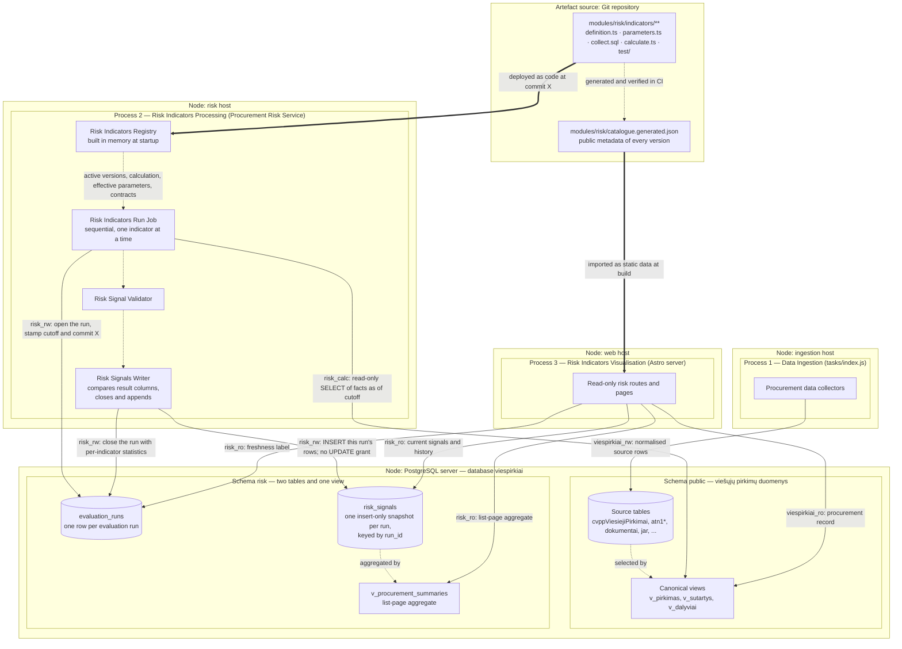
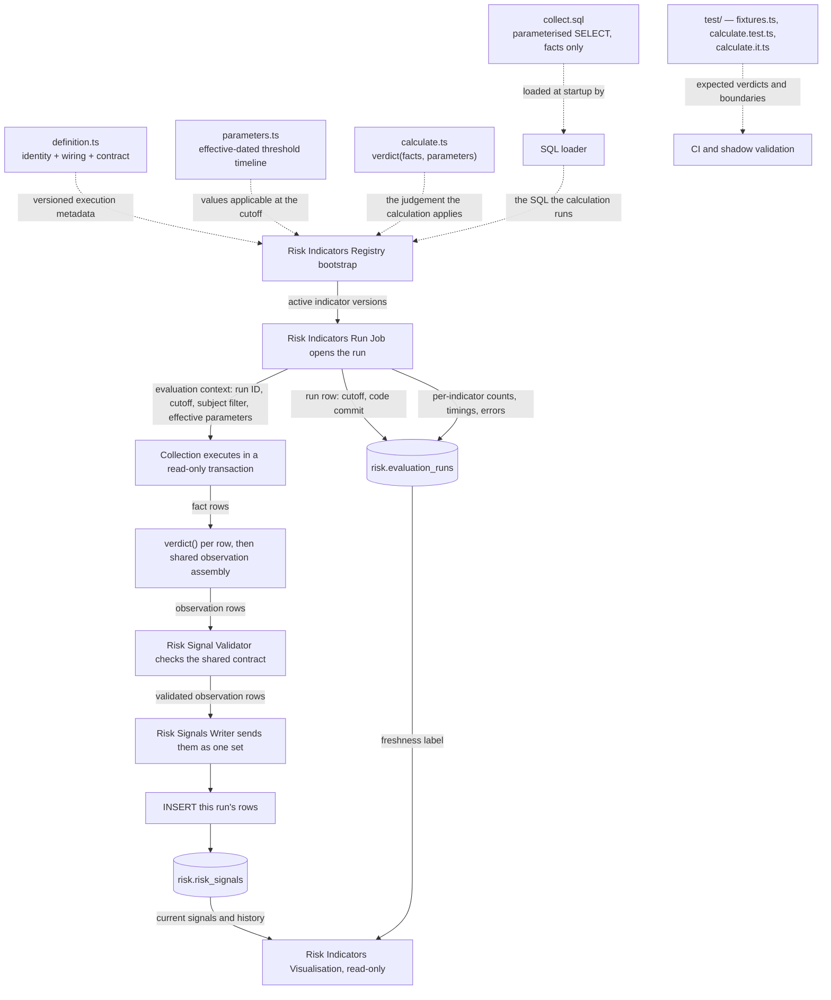
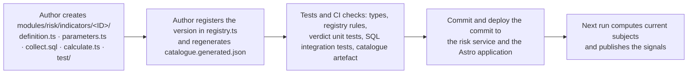
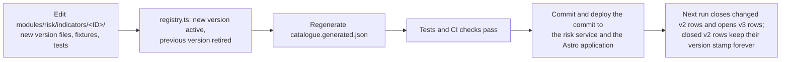
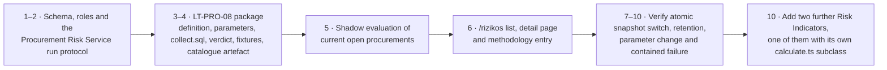

# Procurement Risk Service Architecture

Status: detailed design

Date: 2026-08-11

Core
methodology: [OCP 2024 Red Flags in Public Procurement](https://www.open-contracting.org/wp-content/uploads/2024/12/OCP2024-RedFlagProcurement.pdf)

Indicator catalogue: [Canonical Lithuanian catalogue](indicators-canonical.md)

Parent design: [Risk signals for current and recently completed procurements](risky-procurements-initial-design.md)

Database schema: [`risk-schema.md`](risk-schema.md)

## 1. Design decisions

1. Published indicator results are public and are displayed with their source facts, calculation, version and
   limitations.
2. Every indicator carries a canonical Lithuanian catalogue ID of the form `LT-<AREA>-<NN>`, for example `LT-PRO-08`
   ([canonical catalogue](indicators-canonical.md)). The definition records the source codes the concept derives from —
   `OCP-R003`, `OLAF-CN29`, `VPT-I01` — as references, so an OCP-derived indicator stays traceable to OCP while
   remaining a viespirkiai indicator.
3. A public result is called a **risk signal** (`rizikos signalas`): a reason to review a procurement.
4. Ranking is countable. The list orders by the number of triggered indicators, severity is a constant of the indicator
   version held in the Git catalogue, and data coverage is stated from `missing_data`
   ([`risk-schema.md`](risk-schema.md) §3).
5. A **Risk Indicator** is a versioned package consisting of metadata, public explanation, effective-dated parameters,
   calculation and tests. The package lives entirely in the Git repository.
6. A Risk Indicator calculates and returns rows; the Risk Signals Writer persists them. A calculation executes under a
   read-only database role inside a read-only transaction, and every indicator satisfies one calculation contract
   ([§5.3.1](#531-the-calculation-contract)).
7. Risk calculation runs in its own process — the **Procurement Risk Service** — which holds its own database roles and
   its own deployment lifecycle ([§13](#13-process-isolation-from-the-existing-task-runner)).
8. PostgreSQL views in `public` provide canonical facts. A web request reads persisted risk results; the calculation
   itself belongs to the evaluation run.
9. The public Astro application is a read-only consumer of `risk.risk_signals` and the generated catalogue artefact.
10. PostgreSQL provides durable coordination and computation; TypeScript provides the registry, execution, validation
    and operational control. The design uses no separate analytics or orchestration platform.
11. The system has exactly three processes with separate lifecycles and separate database roles: **Data Ingestion**,
    **Risk Indicators Processing** and **Risk Indicators Visualisation**. They exchange committed PostgreSQL rows and
    nothing else.
12. Risk Indicators Processing is one **single sequential job**. It executes the applicable Risk Indicators one after
    another.
13. **Git is the only home of a Risk Indicator.** `git log`, `git blame` and a pull-request diff answer who changed
    which threshold, when and why. PostgreSQL stores results and run control state.
14. **Every identifier in the Procurement Risk Service is English** — schema, tables, columns, TypeScript fields, SQL
    aliases, roles, module paths and enum values. This keeps the system aligned with international and EU
    procurement-fraud terminology, where the concepts already have settled names. Lithuanian survives as **label
    values** the GUI renders (`titleLt`, `descriptionLt`, `limitationLt`, `formulaLt`), and those live in the indicator
    catalogue in Git.

The naming boundary is exact and worth stating, because the rest of the repository follows the opposite convention: the
`public` schema is Data Ingestion's and keeps its Lithuanian domain names (`pirkimas`, `tiekejas`, `sutartis`,
`jarKodas`). A risk calculation reading those views crosses the boundary in exactly one place — the collection
statement — and the rule is positional: Lithuanian on the left of an `AS`, English on the right
([§5.4](#54-collection-and-judgement-example)). Everything downstream of that statement, including the fact rows it
returns, is English, because it is already inside the Procurement Risk Service.

The OCP guide describes an indicator through its definition, reason for being a red flag, required data, method, unit of
analysis, procurement stage, example and source. The local indicator package preserves these fields and adds operational
fields: implementation version, parameters, lifecycle state, tests, public wording and known limitations.

### 1.1 The three processes

The concrete stack is **TypeScript + PostgreSQL**. Each process has a single business purpose, its own deployment
lifecycle, its own database role and its own failure mode. Committed PostgreSQL rows are the only integration between
them.

| # | Process                           | Business purpose                                                                             | Deployed as                                                                                        | Writes                                         | Reads                                                                                 |
|---|-----------------------------------|----------------------------------------------------------------------------------------------|----------------------------------------------------------------------------------------------------|------------------------------------------------|---------------------------------------------------------------------------------------|
| 1 | **Data Ingestion**                | Populate the viešieji pirkimai data: fetch, normalise and version public procurement records | Existing task runner (`tasks/index.js`)                                                            | `public` schema source tables only             | Public sources (CVP IS, CVPP, TED, JAR, documents)                                    |
| 2 | **Risk Indicators Processing**    | Execute every applicable Risk Indicator, one by one, and record the resulting signals        | **Procurement Risk Service** — one long-running Node process running one sequential evaluation run | `risk.evaluation_runs` and `risk.risk_signals` | `public` canonical views; the deployed Git definitions; `risk` for the previous state |
| 3 | **Risk Indicators Visualisation** | Show a procurement's risk signals, methodology and coverage to the public                    | Existing Astro web application                                                                     | Nothing                                        | `risk` signals read-only; `catalogue.generated.json`; `public` procurement record     |

The separation buys four operational properties:

- a broken ingestion refresh leaves the last computed signals visible, labelled with their older `data_as_of`;
- a failed indicator leaves its previous signals current and records a `calculation_error` state of its own;
- a web deployment is unable to mutate risk results, because its role holds no write grant on `risk`;
- rewriting an indicator's calculation touches neither ingestion nor web code.

Process 1 is fully decoupled from `risk`: ingestion holds no grant on the risk schema. Process 2 takes the set of
indicators to execute from the deployed registry and records each run in one run table ([§7.1](#71-evaluation-runs)),
executing exactly one run at a time.

### 1.2 Deployment view

Outer boxes with a `Node:` prefix are deployment nodes (hosts). Inner boxes are the three processes and their
components. Cylinders are storage areas — the two schemas of the existing `viespirkiai` database. Solid arrows leaving a
process are database connections, labelled with the role used and what crosses the wire. Dotted arrows are in-process
calls and stay inside one node. The Git repository is drawn as a deployment artefact source: it is what the two Node
processes are built from.

**Diagram: deployment of the three processes over the `viespirkiai` database.**



Database roles make the process separation enforceable rather than conventional:

| Role                         | Used by                                            | Grants                                                                                                          |
|------------------------------|-----------------------------------------------------|------------------------------------------------------------------------------------------------------------------|
| `viespirkiai_rw`             | Process 1                                          | Read/write on `public`                                                                                          |
| `risk_calc`                  | Process 2, during a calculation                    | `SELECT` on the `public` canonical views, used inside a read-only transaction with a statement timeout          |
| `risk_rw`                    | Process 2, for recording results, and the scheduled retention job | `SELECT`, `INSERT`, `UPDATE` on `risk.evaluation_runs`; `SELECT`, `INSERT`, `DELETE` on `risk.risk_signals`, no `UPDATE` |
| `risk_ro` / `viespirkiai_ro` | Process 3                                          | `SELECT` on the `risk` tables and view and on the `public` canonical views                                      |

`risk_rw` writes rows and can never alter one in place — there is no `UPDATE` grant on `risk.risk_signals` — but it
does hold `DELETE`, because it is also the role the retention job runs as ([`risk-schema.md`](risk-schema.md) §5).
Indicators are derived and can be recalculated at any time, so deletion of superseded snapshots doesn't need to be
fenced off behind a separate role: immutability of a *written* row is what matters, not who is allowed to remove a
whole superseded one.

A new indicator version becomes active once both Process 2 and Process 3 run the same commit;
[§10.1](#101-adding-a-risk-indicator) makes this a step in the procedure. A page that meets an observation whose version
is absent from its catalogue artefact renders the indicator ID together with the evidence stored on the observation.

#### 1.2.1 Storage areas

Risk data lives in three places, and two of them are in PostgreSQL. Section 5 defines the Git package; section 7
summarises the database and links the full DDL in [`risk-schema.md`](risk-schema.md).

| Area            | Where                              | Contents                                                                                                                  | Written by                         | Visible to visualisation                                      | Retention                                                                                       |
|-----------------|------------------------------------|---------------------------------------------------------------------------------------------------------------------------|------------------------------------|---------------------------------------------------------------|-------------------------------------------------------------------------------------------------|
| **Definitions** | Git — `modules/risk/indicators/**` | Identity, versions, lifecycle, public wording, effective-dated parameters, calculation, tests                             | A reviewed and merged pull request | Yes, via `catalogue.generated.json` built into the web bundle | Forever, as repository history                                                                  |
| **Runs**        | `risk.evaluation_runs`             | One row per evaluation run: cutoff, code commit, state, per-indicator statistics                                          | Risk Indicators Processing         | Yes — the freshness label and the "is the job healthy" check  | Forever; ~365 rows a year                                                                       |
| **Signals**     | `risk.risk_signals`                | One insert-only snapshot per run: every `(subject, indicator)` result state, with evidence, applied parameters and the producing run | Risk Indicators Processing         | Yes — the newest completed run is the public read model        | Snapshots older than one month are deleted, except the one the site is showing |

The flow is one-way, **definitions + facts → signals**: a calculation reads the deployed definition and the `public`
schema and produces rows. Because definitions live outside the database, a signal row is self-sufficient — it stores the
indicator ID, the implementation version, the exact parameter values applied, the run that produced it (which carries
the code commit) and the structured evidence. That row stays explainable years later, and it stores no display text, so
correcting the Lithuanian wording is a commit rather than a rewrite of history.

### 1.3 Data flow across the three processes

Solid arrows are runtime data flows; their labels name the data crossing the boundary. Dotted arrows are code or
configuration dependencies.

**Diagram: data flow from ingested facts to published risk signals.**

```mermaid
flowchart LR
    subgraph ingestion["Process 1 — Data Ingestion and the state it publishes"]
        S["Procurement data collectors"]
        C[("Canonical procurement facts<br/>schema public")]
        S -->|" normalised procurement records "| C
    end

    subgraph processing["Process 2 — Risk Indicators Processing"]
        M["Git: Risk Indicator definitions<br/>and effective-dated parameters"]
        G["Risk Indicators Registry"]
        K["Risk Indicators Run Job"]
        I["Risk Indicator calculation<br/>collect facts in SQL, judge them in TypeScript"]
        T["Risk Signal Validator"]
        P["Risk Signals Writer"]
        M -.->|" deployed code, loaded and validated at startup "| G
        G -.->|" active versions and their implementations "| K
        G -.->|" declares the output contract "| T
    end

    subgraph storage["Schema risk — written only by Process 2"]
        J[("evaluation_runs")]
        H[("risk_signals")]
        R["v_procurement_summaries"]
        H -.->|" aggregated at query time "| R
    end

    subgraph visual["Process 3 — Risk Indicators Visualisation"]
        A["Astro read-only routes"]
        U["Public risk pages and API"]
        A -->|" rendered HTML or JSON response "| U
    end

    K -->|" one open run, stamped with cutoff and commit "| J
    K -->|" cutoff and effective parameters "| I
    C -->|" canonical facts as of cutoff "| I
    I -->|" standard observation rows "| T
    T -->|" validated rows "| P
    P -->|" append this run's snapshot "| H
    P -->|" per-indicator statistics, terminal state "| J
    H -->|" current signals, detail and history "| A
    R -->|" list page ordering and counts "| A
    J -->|" freshness label "| A
```



### 1.4 Component responsibilities

| Component                   | Process | Concrete form                                                                                                                                                                                                             | Responsibility and boundary                                                                                                                                                                                                                                                                                         |
|-----------------------------|---------|---------------------------------------------------------------------------------------------------------------------------------------------------------------------------------------------------------------------------|---------------------------------------------------------------------------------------------------------------------------------------------------------------------------------------------------------------------------------------------------------------------------------------------------------------------|
| Procurement data collectors | 1       | Existing scrapers and importers                                                                                                                                                                                           | Fetch and normalise public source data into `public`. They hold no permission on `risk`.                                                                                                                                                                                                                            |
| Canonical procurement facts | 1       | PostgreSQL tables and views in `public`                                                                                                                                                                                   | Present procurements, notices, lots, bids, awards, contracts, buyers and suppliers with stable keys and `valid_from`/`valid_to` semantics. They are the reproducible facts read at `data_as_of`.                                                                                                                    |
| Risk Indicator parameters   | 2       | Effective-dated entries in `parameters.ts`, versioned in Git                                                                                                                                                              | Hold reviewed thresholds, method scopes, legal dates and exclusions in a file separate from the formula. The run cutoff selects the applicable entry, and `git blame` shows who approved it.                                                                                                                        |
| Risk Indicators Registry    | 2       | Immutable in-process TypeScript catalogue, built from the deployed code at startup                                                                                                                                        | Resolves `(indicator ID, version)` to one validated Risk Indicator: implementation, subject, lifecycle, inputs, effective parameters, output contract and public methodology. Section 5.2 defines it precisely.                                                                                                     |
| Evaluation run              | 2       | `risk.evaluation_runs`                                                                                                                                                                                                    | One durable row per run holding cutoff, code commit, terminal state and per-indicator statistics. It answers whether the job ran and whether it succeeded.                                                                                                                                                          |
| Risk Indicators Run Job     | 2       | One sequential TypeScript loop, single instance guaranteed by an advisory lock                                                                                                                                            | Takes the advisory lock, opens the run row with the cutoff, walks the registry's active versions and invokes each declared calculation with the cutoff and the effective parameters, recording the outcome into `statistics`. It is indicator-independent: one failing indicator is recorded and the run continues. |
| Risk Indicator calculation  | 2       | One indicator directory: a packaged `SELECT` that collects facts, and a pure TypeScript function that judges them — wired together by the shared `RowLocalSqlIndicator` for the common shape, or by a `RiskIndicator` subclass in `calculate.ts` for a harder one | Produces the standard observation rows for one indicator at one cutoff, reading canonical facts through the evaluation context ([§5.3.1](#531-the-calculation-contract)).                                                                                                                                           |
| Risk Signal Validator       | 2       | Shared TypeScript validation module plus database permissions                                                                                                                                                             | Validates the returned rows: field types, allowed states, subject and indicator identity, evidence size, duplicate keys and cross-row invariants. SQL safety comes from a read-only role, a read-only transaction and a statement timeout.                                                                          |
| Risk Signals Writer         | 2       | Shared TypeScript module issuing one indicator-independent `INSERT`                                                                                                                                                       | Appends the validated observations to the open run's snapshot — one statement per indicator, in the caller's transaction. It compares nothing and updates nothing, because `risk_signals` is insert-only.                                                                                                          |
| Risk signals                | 2 → 3   | `risk.risk_signals`                                                                                                                                                                                                       | Holds one immutable snapshot per run: state, evidence, indicator version, applied parameter values and the run's cutoff. Rows are never modified after insert; a superseded snapshot is deleted whole.                                                                                                             |
| Procurement summary         | 2 → 3   | `risk.v_procurement_summaries`                                                                                                                                                                                            | Aggregates current signals per procurement for list-page counts, ordering and filters.                                                                                                                                                                                                                              |
| Astro read-only routes      | 3       | Existing web application using a read-only role                                                                                                                                                                           | Query the `risk` signals, the summary view and the run row, and read all indicator wording from `catalogue.generated.json`. The web bundle excludes the registry and every calculation module.                                                                                                                      |
| Public risk pages and API   | 3       | Browser-visible HTML and public JSON                                                                                                                                                                                      | Display the list, procurement detail and methodology with evidence, freshness and “signal is not proof” wording.                                                                                                                                                                                                    |

The schedule guarantees that a run eventually starts. A PostgreSQL `NOTIFY` issued by ingestion serves as an optional
wake-up hint that shortens the delay between a source refresh and the next run.

## 2. Public information architecture

Three connected pages:

- `/rizikos` — find open and recently changed procurements with active signals;
- `/rizikos/pirkimas/:source/:id` — see all evidence and evaluated indicators for one procurement;
- `/rizikos/metodika` — inspect the public indicator catalogue, formulas, versions and coverage.

The existing procurement page remains the authoritative procurement record. Risk pages link to it and to original CVP
IS/CVPP documents rather than duplicating every field.

### 2.1 Main list page wireframe

All names and values below are fictional demonstration data.

```text
┌─────────────────────────────────────────────────────────────────────────────┐
│ Rizikos signalai viešuosiuose pirkimuose                    [Metodika]      │
│                                                                             │
│ Automatiniai indikatoriai padeda rasti pirkimus, kuriuos verta peržiūrėti.  │
│ Signalas nėra pažeidimo ar korupcijos įrodymas.                             │
│ [Kaip skaičiuojama]  Duomenys atnaujinti 2026-08-10 19:05                   │
├─────────────────────────────────────────────────────────────────────────────┤
│ [Atviri dabar 1 284] [Neseniai pasibaigę] [Pakeistos sutartys]              │
│                                                                             │
│ 143 su bent vienu signalu  ·  22 nauji per 24 val.  ·  7 aktyvūs rodikliai  │
├───────────────┬─────────────────────────────────────────────────────────────┤
│ FILTRAI       │ Rikiuoti: [Daugiausiai signalų ▼]                           │
│               │                                                             │
│ Signalo grupė │ ┌─────────────────────────────────────────────────────────┐ │
│ □ Konkurencija│ │ 3 signalai · terminas po 14 val.                        │ │
│ □ Skaidrumas  │ │ Mokyklų maitinimo paslaugos (demonstracinis pavyzdys)   │ │
│ □ Procedūra   │ │ Pirkėjas: Pavyzdžio miesto administracija               │ │
│ □ Tiekėjas    │ │ Atviras konkursas · paslaugos · 55500000 · €480 000     │ │
│ □ Sutartis    │ │ Paskelbta 2026-08-06 · terminas 2026-08-11 09:00        │ │
│               │ │                                                         │ │
│ Etapas        │ │ LT-PRO-08  Trumpas pasiūlymų pateikimo terminas         │ │
│ □ Atviras     │ │            4,8 dienos; taikoma riba 10 dienų            │ │
│ □ Vertinamas  │ │ LT-PRO-06  Pirkimo skaidymas siekiant išvengti ribos    │ │
│ □ Sutartis    │ │            €480 tūkst.; 3 panašūs pirkimai per 90 d.    │ │
│               │ │ LT-TRA-03  Pagrindiniai dokumentai neprieinami          │ │
│ Vertė         │ │            2 dokumentai pakeisti likus 24 val.          │ │
│ [nuo] [iki]   │ │                                                         │ │
│               │ │ Duomenų pakankamumas: 6 iš 7 rodiklių įvertinti         │ │
│ BVPŽ          │ │ [Peržiūrėti signalus] [Atverti pirkimą]                 │ │
│ Pirkėjas      │ └─────────────────────────────────────────────────────────┘ │
│ Būdas         │                                                             │
│ Šaltinis      │ ┌─────────────────────────────────────────────────────────┐ │
│               │ │ 1 signalas · pasiūlymų teikimas                         │ │
│ [Išvalyti]    │ │ ...                                                     │ │
└───────────────┴─────────────────────────────────────────────────────────────┘
```

### 2.2 Header and aggregate numbers

The header establishes interpretation before showing results. It contains:

- a one-sentence purpose;
- a permanent “signal is not proof” statement;
- `data_as_of` of the underlying signals, distinct from the web page generation time;
- a link to the public methodology;
- counts calculated from the same current read model as the results.

The headline states “143 procurements with at least one active signal”, which is the claim the data supports.

Tabs are lifecycle scopes over the same read model:

- **Atviri dabar** — future bid deadline;
- **Neseniai pasibaigę** — deadline or award in the selected recent period;
- **Pakeistos sutartys** — newly signed or materially changed contracts.

### 2.3 Result card

The result card answers five questions in order:

1. **What is it?** Title, buyer, method, CPV, value and dates.
2. **What brought it here?** Triggered indicator names.
3. **What was observed?** Raw value and threshold or comparison in one sentence.
4. **What is the evaluation coverage?** Evaluated, applicable and insufficient counts.
5. **Where is the evidence?** Detail page and original procurement.

Each indicator line uses the canonical code (`LT-PRO-08`) and short public name. Severity may control a left border or
icon; colour is supplementary and accessible text is mandatory. The card carries the decisive fact and its comparison,
and the detail page carries the full calculation.

### 2.4 Filtering and sorting

URL-backed filters:

- lifecycle scope and event-date interval;
- indicator ID;
- signal family and severity;
- buyer and supplier, when known;
- procurement method and object type;
- CPV prefix;
- value interval;
- EU funding;
- source;
- evaluation coverage (`complete`, `partial`, `insufficient`);
- data freshness.

Sort options:

- number of triggered signals, descending (default);
- nearest deadline;
- most recently published or changed;
- largest value;
- lowest data coverage, useful for transparency monitoring.

The default order is a count of triggered indicators: countable, explainable and free of calibration ([
`risk-schema.md`](risk-schema.md) §3). Severity acts as a filter by expanding the catalogue's severity set into
indicator IDs.

## 3. Procurement risk detail page

The detail page makes a public result independently understandable.

```text
Mokyklų maitinimo paslaugos (demonstracinis pavyzdys)
Pasiūlymų teikimas · CVP IS 7000000

3 aktyvūs signalai                          Duomenys iki 2026-08-10 19:05
7 taikomi indikatoriai: 6 įvertinti, 1 nepakanka duomenų

Pirkimo eiga
● 08-06 paskelbta ── ● 08-10 pakeisti dokumentai ── ○ 08-11 terminas

LT-PRO-08 · Trumpas pasiūlymų pateikimo terminas
┌────────────────────────────────────────────────────────────────────┐
│ Ką matome                                                          │
│ Nuo paskelbimo iki termino: 4,8 kalendorinės dienos.               │
│                                                                    │
│ Kaip skaičiuota                                                    │
│ 2026-08-11 09:00 − 2026-08-06 13:48 = 4,8 dienos.                  │
│ Šiam būdui taikytas parametras: 10 dienų.                          │
│                                                                    │
│ Kontekstas                                                         │
│ To paties būdo ir BVPŽ grupės mediana: 10,8 dienos (n=842).        │
│                                                                    │
│ Šaltiniai                                                          │
│ CVP IS skelbimas · pirkimo duomenys · nuskaityta 19:05             │
│                                                                    │
│ Apribojimai                                                        │
│ Pagreitinta procedūra ar teisėta išimtis gali paaiškinti terminą.  │
│                                                                    │
│ Metodika: LT-PRO-08, versija 2 · aktyvi nuo 2026-07-01             │
│ Šaltinio kodai: OCP-R003, OCP-R014, OLAF-CN29, OT-I04              │
└────────────────────────────────────────────────────────────────────┘

[Kiti aktyvūs signalai]
[Įvertinti, bet nesuveikę indikatoriai (3)]
[Nepakanka duomenų (1)]
```

### 3.1 Signal explanation contract

Every public signal expands to the same sections:

- **Ką matome** — plain-language observation;
- **Kaip skaičiuota** — formula with this procurement's values;
- **Riba arba palyginimas** — the exact effective parameter or peer population;
- **Kontekstas** — comparison sample, if relevant;
- **Šaltiniai** — links, identifiers and data-as-of time;
- **Apribojimai** — common legitimate explanations and known data gaps;
- **Metodika** — indicator ID, implementation version, the effective date of the parameter entry applied, and the source
  catalogue codes the concept references.

The page renders these sections from structured evidence, and the rendering layer owns all markup.

### 3.2 Evaluation coverage disclosure

The detail page discloses evaluation coverage in proportion to its interest:

- a collapsed **“Įvertinti, signalas nenustatytas”** section;
- a visible **“Nepakanka duomenų”** count, listing the missing fields after expansion;
- `not_applicable` indicators kept out of the main count and available in the methodology detail;
- `calculation_error` shown as a temporary data-processing notice, preserved as its own state, and raised to
  maintainers.

Stating coverage explicitly is what keeps an absent signal readable as "checked, nothing found" or "not evaluated"
rather than as a clean bill of health.

### 3.3 Change history

**Not in this design.** The page states what is true in the current snapshot and how fresh that snapshot is; it does not
show when a signal appeared or cleared.

This follows directly from [§7.2](#72-one-insert-only-snapshot-per-run): the site reads exactly one run, and a history
panel is by definition a question about earlier ones. Answering it from `risk_signals` would mean scanning the previous
run's snapshot and diffing it — 20M rows against 20M rows — on a page request, and it would go blank as soon as the
comparison run fell outside the retention window. Neither is acceptable for a public page.

The cost is real and worth stating plainly: a reader cannot see that a flag was raised last Tuesday, and cannot tell a
signal that changed because the *procurement* changed from one that changed because the *methodology* did. The page must
therefore not imply either — no "new" badges, no "since" wording.

Bringing it back is a separate, narrow addition rather than a change to this model: a small append-only
`risk_signal_changes` table, written by the run job when a subject's state differs from the previous run, holding one
row per actual change instead of one per evaluation. That is a few thousand rows a night rather than 20M, it survives
retention independently, and it is a query on its own small table. Deliberately out of scope until the read model exists
and someone wants the feature.

## 4. Public methodology catalogue

`/rizikos/metodika` makes the system inspectable. It contains:

- link and citation to the OCP core document and the other source catalogues;
- explanation of `triggered`, `not_triggered`, `insufficient_data` and `not_applicable`;
- a searchable indicator catalogue;
- active, shadow and retired versions;
- calculation and parameter history;
- coverage and trigger-rate statistics by year, method and CPV where samples are safe;
- known source limitations and freshness;
- a change log.

Example catalogue row:

| ID        | Public name                          | Stage  | Unit        | Active version | Coverage, 30 d. | Trigger rate | Updated    |
|-----------|--------------------------------------|--------|-------------|---------------:|----------------:|-------------:|------------|
| LT-PRO-08 | Trumpas pasiūlymų pateikimo terminas | Tender | Procurement |              2 |           98.9% |         7.4% | 2026-07-01 |

Opening a row shows the canonical definition, the source-catalogue references, the local profile, required data, the
exact SQL-style formula, exclusions, parameters, an example and limitations.

Everything on this page except the statistics comes from `catalogue.generated.json`, the artefact generated from the
indicator directories and shipped inside the web bundle. The statistics come from `risk.risk_signals`. Sourcing wording
from the deployed code is what lets the methodology page describe retired versions and versions with zero current
signals. Where the repository is public, each entry links directly to the directory and to the commit history of its
thresholds.

## 5. The Risk Indicator package

A **Risk Indicator** is the policy concept and reproducible test that turns public procurement facts into one of four
states: `triggered`, `not_triggered`, `insufficient_data` or `not_applicable`. The service records a fifth state,
`calculation_error`, on its behalf when a calculation fails.

Concretely, **a Risk Indicator is one directory in the Git repository**. Everything that defines it — its meaning, its
applicability, the thresholds it has used since which date, its calculation and its public explanation — is a file in
that directory. Its whole lifecycle, from `draft` to `retired`, is a sequence of reviewed commits.

### 5.1 The Risk Indicator directory

```text
modules/risk/indicators/LT-PRO-08/     ← one directory = one Risk Indicator
│
├── definition.ts        WHAT IT IS. The single exported object all other
│   │                    components resolve. Contains:
│   ├── key              identity: { id: 'LT-PRO-08', version: 2 } — stamped on
│   │                    every observation this indicator ever produces
│   ├── lifecycle        'draft' | 'shadow' | 'active' | 'retired' — this line
│   │                    activates or retires the indicator
│   ├── stage            'planning' | 'tender' | 'award' | 'contract'
│   ├── subjectType      what one result row is about: 'procurement', 'lot', ...
│   ├── references       source catalogue codes: OCP-R003, OLAF-CN29, OT-I04, ...
│   ├── standard         primary citation: document name, URL and page
│   ├── public           WHAT THE PUBLIC READS. titleLt, descriptionLt,
│   │                    limitationLt, formulaLt — the only text the web renders
│   ├── requiredInputs   fields that must be present, else 'insufficient_data'
│   ├── applicability    scope rules that decide 'not_applicable'
│   ├── sourceRelations  canonical views the collection statement reads
│   ├── sqlFile          the packaged SELECT that collects this indicator's facts
│   ├── verdict          the pure function that judges one fact row, imported
│   │                    from calculate.ts
│   └── outputContract   runtime validation of the rows the calculation returns
│
├── parameters.ts        WHAT IT COMPARES AGAINST. An append-only, effective-dated
│   │                    timeline kept in its own file so a threshold change is a
│   │                    one-line, reviewable, blameable diff:
│   └── entries[]        { validFrom, validTo, scope: { methods, objectTypes },
│                          values: { minimumDays: 10, ... }, source, note }
│
├── collect.sql          WHAT IS TRUE. One pure, parameterised SELECT returning
│                        one fact row per subject — $1 data_as_of, $2 optional
│                        subject filter. It reports measurements; it decides
│                        nothing. No indicator identity, no state, no thresholds
│                        (§5.4).
│
├── calculate.ts         HOW IT JUDGES. For the common shape, the pure function
│                        verdict(facts, parameters) => Verdict: state plus the
│                        rawValue, threshold, evidence and missingData that
│                        explain it. It touches no database and no clock, so its
│                        tests need neither. An indicator with an internal shape
│                        exports a RiskIndicator subclass here instead, free to
│                        run several packaged .sql files from this directory.
│                        Same output contract either way (§5.3.1).
│
├── test/                PROOF IT IS RIGHT. Everything that only exists to check
│   │                    the indicator, kept out of the four files that define it,
│   │                    so `ls` on the directory answers "what is this indicator?"
│   │                    and one level down answers "how do we know it works?".
│   ├── fixtures.ts      Deterministic cases for the triggered / not-triggered /
│   │                    insufficient / not-applicable outcomes, boundary values and
│   │                    effective-date transitions. Each case states both the source
│   │                    rows and the fact row collect.sql must produce from them, so
│   │                    the two test files below meet on one value.
│   ├── calculate.test.ts  Assertions over those fixtures — verdict() alone, no
│   │                    database, run on every `npm test`.
│   └── calculate.it.ts  Integration proof that collect.sql returns the fact rows
│                        the fixtures describe, run against a real PostgreSQL.
│
└── README.md            Optional reviewer context: interpretation notes, known
                         false positives, decisions taken during review.
```

Read that as the definition of the entity: **identity + lifecycle + public wording + applicability + parameter
timeline + exactly one collection + exactly one judgement + tests**. Four files define the indicator and `test/` holds
everything that only proves it; a change to any of them is a change to the indicator, visible in one
`git log modules/risk/indicators/LT-PRO-08/`.

The split between `collect.sql` and `calculate.ts` is the load-bearing one, and the rule is a single sentence: **SQL
states what is true about a subject, TypeScript decides what that means.** Counting, joining, filtering and aggregating
are what a set-based engine is for; comparing a measurement to a threshold, choosing between four states and assembling
an explanation are ordinary branching code, and they are the part a reviewer actually needs to read. Keeping them apart
means neither file has to be read to understand the other, and the judgement half is testable with plain objects.

The rest of the repository is shared machinery that every indicator reuses:

```text
modules/risk/
  contracts.ts               # shared observation, fact-row and verdict contract values
  riskIndicator.ts           # the RiskIndicator base class: self-checks, effective
                             # parameters, evaluate(), output and cross-row validation
  rowLocalSqlIndicator.ts    # collect-then-judge: binds $1/$2, resolves the parameter
                             # entry per fact row, calls verdict(), assembles observations
  parameterScope.ts          # scope matching and disjointness, shared by the startup
                             # check and the per-subject parameter lookup
  evaluationContext.ts       # what one run evaluates: cutoff, subjects, parameters
  riskDataSource.ts          # how a calculation reaches a database (the only port)
  registry.ts                # the catalogue class: lookup, active and evaluable sets
  deployedIndicators.ts      # explicit imports of every Risk Indicator version
  sqlLoader.ts               # loads packaged SQL at process start
  catalogue.generated.json   # public metadata of all versions, generated from the
                             # definitions, committed, verified in CI, imported by Astro
services/procurement-risk/
  index.ts                   # service entry point and single-instance advisory lock
  runJob.ts                  # opens the run, executes Risk Indicators one at a time
  write.ts                   # one INSERT of the run's rows into risk.risk_signals
  retention.ts               # deletes superseded run snapshots, as risk_rw
  retentionJob.ts            # its entry point: npm run risk:retention
migrations/risk/
  001_risk.sql               # the whole schema: two tables and one view
```

The catalogue is the set of indicator directories; the only migration is the DDL in
[`risk-schema.md`](risk-schema.md).

#### 5.1.1 Git as the single audit trail

Keeping the whole entity in Git gives:

- **One audit trail.** `git log -p modules/risk/indicators/LT-PRO-08/parameters.ts` shows who raised a threshold, when,
  in which commit, with what justification in the commit message.
- **One source of truth.** The deployed commit *is* the definition, and every run records that commit.
- **Atomic change.** Formula, threshold, public wording and tests move together in one commit, so they cannot drift
  apart.
- **Trivial rollback.** Reverting a commit reverts the indicator, including its wording and thresholds.
- **A small schema.** `risk` holds results and run control state: two tables and one view.

### 5.2 The Risk Indicators Registry

A **Risk Indicator definition** is a subclass instance of the shared `RiskIndicator` base class, constructed from a
read-only metadata object. It describes how one exact indicator version is executed, validated, explained and audited.
It is metadata and executable wiring around the formula.

The definition is written in TypeScript regardless of what language the formula uses. LT-PRO-08 has a TypeScript
definition, collects its facts with a PostgreSQL `SELECT` in `collect.sql`, and judges them with a TypeScript function
in `calculate.ts`.

Expressing the definition as a checked TypeScript type gives two layers of protection:

1. **Compile-time checks** reject missing fields and misspelled lifecycle, stage or state literals, and incompatible
   calculation or parameter types, during development and CI.
2. **Startup runtime checks** reject duplicate IDs, a second active version of one indicator, an unreadable SQL file,
   overlapping or gapped parameter validity ranges, and public text that violates the required contract.

The **Risk Indicators Registry** is the immutable, explicitly constructed in-process catalogue of every deployed Risk
Indicator definition. Its key is `(indicator_id, implementation_version)`. Given that key, the Risk Indicators Run Job
retrieves exactly one validated definition. The registry also answers which version is `active`, `shadow` or `retired`.

Each indicator checks itself in its constructor, and `RiskIndicatorRegistry` checks what only a *set* can be wrong
about; both run at import time, when the Procurement Risk Service starts. Each run stores the code commit it was
deployed from, so any published result traces back to the exact repository state that produced it.

A definition declares two kinds of input:

- `sourceRelations` — canonical PostgreSQL facts the calculation reads;
- `parameters` — effective-dated policy values from `parameters.ts`, selected at `data_as_of`. A deployed parameter
  change takes effect on the next run.

#### 5.2.1 Indicator independence and execution order

Each calculation reads canonical facts from `public` together with its own effective parameters, which is what lets it
execute as `risk_calc`. The registry's active versions therefore form an unordered set, and the run job iterates them in
declaration order because iteration needs an order; any permutation produces the same signals.

Indicators that look derived — LT-PRO-03 institutional use of non-competitive methods, LT-COM-04 buyer–supplier
concentration, LT-COM-06 market concentration — aggregate procurement *facts*. A shared intermediate such as a peer
median or a market-share denominator becomes a canonical view in `public`, or a derived table computed once before the
loop: a fact available to every indicator on equal terms.

#### 5.2.2 The run cutoff and the subject set

A run has exactly two inputs:

- **`data_as_of` is the run's clock**, read once at run start and passed to every collection statement as `$1`. It keeps
  one run internally consistent — the first and the hundredth indicator agree on what "now" means — and makes a rerun at
  the same cutoff reproducible for every deadline and age comparison. Every time comparison goes through the cutoff,
  never through `now()` and never through the process clock, which is the enforceable form of "reproducible", and it is
  a test.
- **The subject set is the indicator's own `WHERE` clause.** Each indicator has its own unit of analysis (procurement,
  lot, contract, supplier) and its own applicability, so scoping belongs to the definition that owns it. `$2` carries an
  explicit subject array for a backfill or a single-procurement rerun, and `NULL` for a normal full run.

Those two are the collection statement's only arguments. Thresholds are not among them: a parameter entry is resolved in
TypeScript and applied by `verdict()` ([§5.3.2](#532-parameter-resolution)), so the run cutoff reaches SQL and policy
does not.

A full run is one set-based query per indicator, so re-evaluating an unchanged procurement costs almost nothing on the
read side. Every run rewrites the whole snapshot, so the write side is bounded by the run's own row count and the
retention window rather than by how much changed ([§7.2](#72-one-insert-only-snapshot-per-run)).

### 5.3 Definition and registry example

This abbreviated example shows the contracts, one definition, explicit registration and lookup. The shared runtime
contracts validate values that cross a trust boundary, including rows returned by PostgreSQL.

```ts
type IndicatorLifecycle = 'draft' | 'shadow' | 'active' | 'retired';
type IndicatorStage = 'planning' | 'tender' | 'award' | 'contract';
type SubjectType = 'procurement' | 'lot' | 'contract' | 'supplier';

// The four states a calculation returns.
type IndicatorState =
    | 'triggered'
    | 'not_triggered'
    | 'insufficient_data'
    | 'not_applicable';

// The state stored in risk.risk_signals: the four above, plus the one the run job
// records on behalf of a calculation that failed.
type SignalState = IndicatorState | 'calculation_error';

type RuntimeContract<T> = Readonly<{
    validate(value: unknown): T;
}>;

// Canonical catalogue identity, e.g. { id: 'LT-PRO-08', version: 2 }.
type RiskIndicatorKey = Readonly<{
    id: `LT-${string}`;
    version: number;
}>;

type RiskObservationV1 = Readonly<{
    indicatorId: RiskIndicatorKey['id'];
    indicatorVersion: number;
    subjectType: SubjectType;
    subjectKey: string;
    procurementSource: string | null;
    procurementId: string | null;
    state: IndicatorState;
    rawValue: Readonly<Record<string, unknown>> | null;
    threshold: Readonly<Record<string, unknown>> | null;
    appliedParameters: Readonly<Record<string, unknown>> | null;
    evidence: Readonly<Record<string, unknown>>;
    missingData: readonly string[];
    dataAsOf: string;
}>;

// The columns every collect.sql returns, whatever else it measures. They are the
// half of the observation that is the same for all 106 indicators, so the shared
// class fills them in and no verdict() ever mentions them.
type SubjectFacts = Readonly<{
    subjectKey: string;
    procurementSource: string | null;
    procurementId: string | null;
    // Read only by the shared scope test, and only when a parameter entry
    // narrows the corresponding dimension (§5.3.2).
    method?: string | null;
    objectType?: string | null;
}>;

// The half a verdict decides: the state, and the values that explain it.
type Verdict = Readonly<{
    state: IndicatorState;
    rawValue?: Readonly<Record<string, unknown>> | null;
    threshold?: Readonly<Record<string, unknown>> | null;
    evidence?: Readonly<Record<string, unknown>>;
    missingData?: readonly string[];
}>;

type LtPro08Parameters = Readonly<{
    minimumDays: number;
    dayCounting: 'calendar_days' | 'business_days';
}>;

// One effective-dated entry of a parameter timeline. Appending an entry is the
// way a threshold changes; entries are immutable once merged.
type ParameterEntry<P> = Readonly<{
    validFrom: string;
    validTo: string | null;
    scope: Readonly<{
        methods?: readonly string[];
        objectTypes?: readonly string[];
    }>;
    values: P;
    source: string;
    note?: string;
}>;

// What one run evaluates: the cutoff, the subject set, and the parameter entries
// in force at that cutoff. A value object — it holds no database handle.
type EvaluationRun = Readonly<{
    runId: number;
    dataAsOf: string;
    subjects: readonly string[] | null;
}>;

class EvaluationContext {
    readonly runId: number;
    readonly dataAsOf: string;
    readonly subjects: readonly string[] | null;
    readonly parameters: readonly ParameterEntry<unknown>[];
    constructor(run: EvaluationRun, parameters: readonly ParameterEntry<unknown>[]);
}

// How a calculation reaches data — the one port between an indicator and a
// database. The run job passes a source on the read-only risk_calc connection,
// used inside its read-only transaction and statement timeout; a test passes one
// on the local Postgres. PostgresRiskDataSource is the shipped implementation.
interface RiskDataSource {
    query<T>(sqlText: string, params?: readonly unknown[]): Promise<readonly T[]>;
}

// WHAT IT IS: the reviewable metadata of one version, with no behaviour of its own.
type RiskIndicatorDefinition<P> = Readonly<{
    key: RiskIndicatorKey;
    lifecycle: IndicatorLifecycle;
    subjectType: SubjectType;
    stage: IndicatorStage;
    references: readonly string[];
    sourceRelations: readonly string[];
    requiredInputs: readonly string[];
    parameters: readonly ParameterEntry<P>[];
    parameterContract: RuntimeContract<P>;
    outputContract?: RuntimeContract<RiskObservationV1>;   // defaults to riskObservationV1Contract
    standard: Readonly<{ name: string; url: string; page?: number }>;
    public: Readonly<{
        titleLt: string;
        descriptionLt: string;
        formulaLt: string;
        limitationLt: string;
    }>;
}>;

// One indicator version. The constructor runs the startup checks; the one thing
// that differs between indicators is the abstract calculate().
abstract class RiskIndicator<P = unknown> {
    constructor(definition: RiskIndicatorDefinition<P>);   // + readonly fields of the definition

    get id(): RiskIndicatorKey['id'];
    get version(): number;
    get isActive(): boolean;
    get isEvaluable(): boolean;                            // 'active' | 'shadow'

    parametersAsOf(dataAsOf: string): readonly ParameterEntry<P>[];

    // The one call the run job and the tests make: resolve this indicator's
    // effective parameters for the cutoff, calculate, validate.
    evaluate(run: EvaluationRun, data: RiskDataSource): Promise<readonly RiskObservationV1[]>;
    validateObservations(observations: readonly unknown[]): readonly RiskObservationV1[];

    protected abstract calculate(
        context: EvaluationContext,
        data: RiskDataSource,
    ): Promise<readonly RiskObservationV1[]>;
}

// The common shape (§5.3.1): collect fact rows with one packaged SELECT, judge
// each one with a pure function, and assemble the observations. The class owns
// the $1/$2 calling convention, the parameter-entry lookup and everything on an
// observation that is not a verdict, so an author writes SQL and a function and
// nothing else.
class RowLocalSqlIndicator<F extends SubjectFacts, P> extends RiskIndicator<P> {
    constructor(
        definition: RiskIndicatorDefinition<P> & {
            sqlFile: string;
            verdict: (facts: F, parameters: P) => Verdict;
        },
        definitionUrl: string,
    );

    protected async calculate(context: EvaluationContext, data: RiskDataSource) {
        const facts = await data.query<F>(this.loadSql(), [context.dataAsOf, context.subjects]);
        return facts.map((row) => this.observe(row, context.dataAsOf));
    }
}

// parameters.ts — the effective-dated timeline. Append entries; close them with validTo.
// A git diff of this file is the complete history of "who changed which threshold".
export const ltPro08Parameters: readonly ParameterEntry<LtPro08Parameters>[] = [
    {
        validFrom: '2026-07-01',
        validTo: null,
        scope: {methods: ['Atviras konkursas'], objectTypes: ['Prekės', 'Paslaugos']},
        values: {minimumDays: 10, dayCounting: 'calendar_days'},
        source: 'approved Lithuanian procurement-rule profile',
        note: 'Demonstration value pending legal review.',
    },
];

// calculate.ts — HOW IT JUDGES. A pure function over one fact row and the
// parameter values in force for it. No database, no clock, no identity fields:
// everything it does not return is assembled by RowLocalSqlIndicator.
export type LtPro08Facts = SubjectFacts & Readonly<{
    publicationDate: string | null;
    submissionDeadline: string | null;
    submissionDays: number | null;
}>;

export function ltPro08Verdict(facts: LtPro08Facts, {minimumDays}: LtPro08Parameters): Verdict {
    const missingData = [
        ...(facts.publicationDate === null ? ['publicationDate'] : []),
        ...(facts.submissionDeadline === null ? ['submissionDeadline'] : []),
    ];
    const evidence = {
        publicationDate: facts.publicationDate,
        submissionDeadline: facts.submissionDeadline,
        method: facts.method,
    };
    if (facts.submissionDays === null) return {state: 'insufficient_data', evidence, missingData};

    return {
        state: facts.submissionDays < minimumDays ? 'triggered' : 'not_triggered',
        rawValue: {submissionWindowDays: facts.submissionDays},
        threshold: {minimumDays},
        evidence,
    };
}

// definition.ts — the common shape: one collection statement and one verdict.
export const ltPro08v2 = new RowLocalSqlIndicator<LtPro08Facts, LtPro08Parameters>({
    key: {id: 'LT-PRO-08', version: 2},
    lifecycle: 'active',
    subjectType: 'procurement',
    stage: 'tender',
    references: ['OCP-R003', 'OCP-R014', 'OLAF-CN29', 'OT-I04'],
    sourceRelations: ['public.v_pirkimo_gyvavimo_ciklo_versijos'],
    requiredInputs: ['publicationDate', 'submissionDeadline', 'procurementMethod'],
    parameters: ltPro08Parameters,
    parameterContract: ltPro08ParametersContract,
    sqlFile: './collect.sql',
    verdict: ltPro08Verdict,
    standard: {
        name: 'OCP Red Flags in Public Procurement 2024',
        url: 'https://www.open-contracting.org/wp-content/uploads/2024/12/OCP2024-RedFlagProcurement.pdf',
        page: 25,
    },
    public: {
        titleLt: 'Trumpas pasiūlymų pateikimo terminas',
        descriptionLt: 'Pasiūlymams pateikti skirtas laikas trumpesnis už šiam pirkimo būdui taikomą ribą.',
        formulaLt: 'submissionDeadline − publicationDate < taikoma riba',
        limitationLt: 'Trumpesnį laiką gali teisėtai paaiškinti pagreitinta procedūra ar kita išimtis.',
    },
}, import.meta.url);   // resolves sqlFile against this indicator's own directory

// calculate.ts of an indicator with an internal shape: the same metadata, and a
// calculate() of its own because one fact row per subject is not enough — it
// collects a sequence per market and derives its subjects from it.
class LtCom14 extends RiskIndicator<LtCom14Parameters> {
    protected async calculate(context: EvaluationContext, data: RiskDataSource) {
        const markets = await data.query<MarketRow>(collectSql, [context.dataAsOf, context.subjects]);
        return markets.flatMap((market) => rotationObservations(market, context));
    }
}

export const ltCom14v1 = new LtCom14({
    key: {id: 'LT-COM-14', version: 1},
    lifecycle: 'shadow',
    // ... same identity, lifecycle, parameters and public wording fields ...
});

// deployedIndicators.ts: registration is explicit and reviewable in a pull request.
const deployedIndicators = [
    ltPro08v2,
    ltCom14v1,
] as const satisfies readonly RiskIndicator<unknown>[];

export const riskIndicatorRegistry = new RiskIndicatorRegistry(deployedIndicators);

// runJob.ts: the whole plan. The set is unordered, the run cutoff selects the
// parameter entries in force, and each indicator scopes its own subjects.
const run = await openRun({dataAsOf: new Date(), codeCommit: COMMIT});
const canonicalFacts = new PostgresRiskDataSource(readOnlyPool);
for (const indicator of riskIndicatorRegistry.evaluable()) {
    const observations = await indicator.evaluate(run, canonicalFacts);
    // ... write; record the outcome in run.statistics
}
```

The `RiskIndicator` constructor type-checks one definition, validates every parameter entry against
`parameterContract`, and rejects a gapped or overlapping timeline. `RiskIndicatorRegistry` performs the
cross-definition validation once at startup and exposes read-only lookup: `require`, `all`, `active` and `evaluable`.
The Risk Indicators Run Job is generic: it calls `indicator.evaluate(run, data)` — which resolves the effective
parameters, calculates and validates the rows against `outputContract` — so adding an indicator adds a directory and
one registration line, and no caller can calculate without validating.

`parametersAsOf` returns the entries whose validity range contains the run cutoff. `evaluate` resolves them for the
indicator it belongs to, passes them into the calculation, and the matched values are copied onto every observation the
run produces, so a published signal carries its own threshold.

`RuntimeContract<T>` is a small project-owned interface with a `validate(unknown): T` operation. Stable stage,
lifecycle, state and subject values are TypeScript unions backed by those runtime checks. Public text is versioned and
reviewed, and the web application renders it from the catalogue artefact.

Notice what `ltPro08Verdict` does not contain: no `indicatorId`, no `indicatorVersion`, no `subjectType`, no
`subjectKey`, no `appliedParameters`, no `dataAsOf`, and no rule for what happens when no parameter entry applies. Those
are identical for all 106 indicators, so they are written once in `RowLocalSqlIndicator` and cannot be got wrong in an
indicator directory. What is left in the function is the indicator itself, and it fits on a screen.

#### 5.3.1 The calculation contract

The [canonical catalogue](indicators-canonical.md) contains 106 indicators in five computational shapes:

| Shape                                             | Roughly | Examples                                                                                                                                                   |
|---------------------------------------------------|--------:|------------------------------------------------------------------------------------------------------------------------------------------------------------|
| Row-local arithmetic over one subject's own facts |     ~60 | LT-PRO-08 short deadline, LT-COM-01 single valid bid, LT-AWD-01/02/04 disqualification counts, LT-EXE-01–04 amendments, LT-TRA-04 contract not published   |
| Comparison against a population baseline          |     ~18 | LT-PRI-01 value vs market benchmark, LT-PRO-07 threshold bunching, LT-PRO-03 buyer's non-competitive rate, LT-COM-05 market share, LT-COM-06 concentration |
| Collect, compute a statistic, then threshold it   |      ~8 | LT-PRI-08 Benford, LT-COM-11 fixed-multiple prices, LT-COM-12 suspiciously close prices, LT-COM-14 bid rotation, LT-COM-17 repeated submission order       |
| Traversal of the ownership and person-link graph  |      ~7 | LT-COI-02/03/06 shared owner or controller, LT-SUP-10 connected bidders, LT-COI-07 politically exposed person                                              |
| Document text, spans and similarity               |      ~9 | LT-COM-16 similar bid documents, LT-PRO-10 tailored specifications, LT-AWD-07/08 award criteria, LT-EXE-09 delivery differs from specification             |

Every one of them is **collect, process, construct**. What differs is only how much structure the collect step has and
how much work the process step does:

| Shape                             | Collect                                       | Process                                       | Construct                     |
|-----------------------------------|-----------------------------------------------|-----------------------------------------------|-------------------------------|
| Row-local (~60)                   | one fact row per subject                      | `verdict()`, a few branches                   | shared, in `RowLocalSqlIndicator` |
| Population baseline (~18)         | one fact row per subject, carrying its peer benchmark | `verdict()`, a comparison                     | shared, in `RowLocalSqlIndicator` |
| Statistic then threshold (~8)     | a sample per subject                          | the statistic, in TypeScript                  | own `calculate.ts`            |
| Graph traversal (~7)              | edges                                         | traversal, and the path taken as evidence     | own `calculate.ts`            |
| Text spans and similarity (~9)    | documents and spans                           | comparison, and the spans as evidence         | own `calculate.ts`            |

All five satisfy **one** calculation contract, `calculate(context, data) => Promise<RiskObservationV1[]>`.
`RowLocalSqlIndicator` implements that contract once for the two shapes whose collect step is "one row per subject" —
roughly 78 of the 106 — leaving their authors a `SELECT` and a function. The remaining shapes subclass `RiskIndicator`
in their own `calculate.ts`, which is free to run several packaged statements and assemble the rows itself.

Four properties follow:

- **The three phases are structural, not a naming convention.** Collection is always SQL, judgement is always
  TypeScript, and assembly is always shared code. That boundary holds for every shape, which is why an indicator that
  outgrows the row-local class changes only its middle phase.
- **A collection statement never decides anything.** It carries no indicator identity, no state, no threshold and no
  `data_as_of` echo. This is what makes an unreviewable 80-line `SELECT` impossible: the constructs that produced the
  length — repeated `CASE` over a computed state, `jsonb_build_object` assembly, identity literals — have no place to
  live in it.
- **The safety guarantees come from the `RiskDataSource` the run job passes in.** It is the only way to a database,
  on the `risk_calc` role, inside a read-only transaction with a statement timeout. A TypeScript calculation and a SQL
  calculation obtain identical database capability ([§5.6](#56-delegation-of-persistence-to-the-risk-signals-writer)).
- **Shared or expensive intermediates become materialised views on measurement.** Several indicators in shapes two, four
  and five share an underlying computation — a peer benchmark per CPV division and method, the closure of the ownership
  graph. It stays a view, promoted to a `MATERIALIZED VIEW` refreshed before the indicator loop once the real corpus
  shows the need. It remains a canonical fact that every indicator reads on equal terms.

The dividing line between the row-local class and an own `calculate.ts` is one question: **is there exactly one fact row
per subject?** If the collection statement can produce that row — including by aggregating, joining a benchmark, or
window-functioning over peers — the indicator is row-local, however much SQL that takes. If the judgement needs several
rows per subject, or produces subjects the statement did not enumerate, it is not.

#### 5.3.2 Parameter resolution

A parameter entry is selected in TypeScript, per fact row, by `RowLocalSqlIndicator`, in two steps:

1. **By time.** `parametersAsOf(dataAsOf)` returns the entries whose validity range contains the run cutoff.
2. **By scope.** Among those, the entry whose `scope` admits the row wins: `scope.methods`, when present, must contain
   the row's `method`; `scope.objectTypes`, when present, must contain its `objectType`; an absent dimension admits
   everything.

Concurrently valid entries must have pairwise disjoint scopes, and entries sharing a scope must form a contiguous
timeline — both checked in the `RiskIndicator` constructor at startup, so an indicator with an ambiguous or gapped
timeline never runs. Together those two rules make the result of step 2 **at most one entry**, which is why the resolved
values can be passed to `verdict()` as a plain `P` rather than a list to be searched.

The two-dimensional selection is what lets one implementation version carry different legal thresholds for different
procedure types — LT-PRO-08's ten days for an open procedure and a longer window for a restricted one are two
concurrently valid entries with disjoint `scope.methods`, not two indicator versions.

**When no entry admits a row, the observation is `not_applicable`** with `appliedParameters: null`, and the shared class
decides that before `verdict()` is ever called. This is the rule that most wants to live in one place: an indicator
cannot silently publish a `triggered` signal that no reviewed threshold stands behind, because the code path that would
do so does not exist.

### 5.4 Collection and judgement example

This is LT-PRO-08 end to end, in the common shape of [§5.3.1](#531-the-calculation-contract). The three phases are three
artefacts: `collect.sql` states what is true, `verdict()` in `calculate.ts` decides what it means, and
`RowLocalSqlIndicator` assembles the observation. Only the first two live in the indicator's directory.

#### Phase 1 — `collect.sql`: what is true

One parameterised, read-only `SELECT` with two inputs: `$1` is the reproducible `data_as_of` cutoff, and `$2` is an
optional subject filter — `NULL` for a normal full run, or an explicit array for a backfill or a single-procurement
rerun. It reads the `public` schema only, which is what makes `risk_calc` a role with grants on `public` alone.

```sql
-- LT-PRO-08 facts: one row per procurement, measured but not judged.
WITH candidates AS (
    -- The subject set is a predicate, not a table. $2 IS NULL means the whole
    -- applicable population; an array restricts the run to those subjects.
    -- Columns here belong to the ingestion schema, so they stay Lithuanian.
    SELECT p.*
    FROM public.v_pirkimo_gyvavimo_ciklo_versijos p
    WHERE p.galioja_nuo <= $1::timestamptz
      AND (p.galioja_iki IS NULL OR p.galioja_iki > $1::timestamptz)
      AND ($2::text[] IS NULL OR p.subjekto_raktas = ANY ($2::text[]))
)
-- Every alias is English: past this statement we are inside the risk service.
SELECT subjekto_raktas                                            AS "subjectKey",
       pirkimo_saltinis                                           AS "procurementSource",
       pirkimo_id                                                 AS "procurementId",
       pirkimo_budas                                              AS "method",
       pirkimo_objektas                                           AS "objectType",
       paskelbta                                                  AS "publicationDate",
       terminas                                                   AS "submissionDeadline",
       EXTRACT(EPOCH FROM (terminas - paskelbta)) / 86400.0       AS "submissionDays"
FROM candidates;
```

The mapping rule is visible in that one statement: everything to the left of an `AS` may be Lithuanian, because it
belongs to the ingestion schema; everything to the right is the risk service's own vocabulary, and is English. Four of
the aliases (`subjectKey`, `procurementSource`, `procurementId`, and `method`/`objectType` where a parameter scope needs
them) are the shared `SubjectFacts` contract; the rest are this indicator's measurements.

`submissionDays` is computed in SQL because the subtraction is relational work over columns the statement already has.
`minimumDays` is nowhere in the file, because a threshold is policy, and the statement holds no policy.

#### Phase 2 — `verdict()` in `calculate.ts`: what it means

`ltPro08Verdict` in [§5.3](#53-definition-and-registry-example) is the whole of it: a total function from one fact row
and one set of parameter values to a state and its explanation. It has no `await`, no `data`, no `now()` and no branch
for "no parameters" — the shared class has already established that an entry applies before calling it. A test of it is
a plain object in and a plain object out.

#### Phase 3 — `RowLocalSqlIndicator`: the observation

The shared class binds `$1`/`$2`, resolves the parameter entry for each row ([§5.3.2](#532-parameter-resolution)), calls
`verdict`, and fills in everything a verdict does not return:

```ts
const entry = resolveEntry(this.parametersAsOf(dataAsOf), facts);
const verdict = entry ? this.verdict(facts, entry.values) : {state: 'not_applicable'};

return {
    indicatorId: this.key.id,              // from the definition, never from SQL
    indicatorVersion: this.key.version,
    subjectType: this.subjectType,
    subjectKey: facts.subjectKey,
    procurementSource: facts.procurementSource,
    procurementId: facts.procurementId,
    state: verdict.state,
    rawValue: verdict.rawValue ?? null,
    threshold: verdict.threshold ?? null,
    appliedParameters: entry?.values ?? null,
    evidence: verdict.evidence ?? {},
    missingData: verdict.missingData ?? [],
    dataAsOf,                              // the run's cutoff, not an echoed argument
};
```

`appliedParameters` is the exact threshold object that decided the row. Carrying the values instead of a foreign key is
what keeps a signal explainable after the parameter timeline moves on — and carrying it here, rather than in each
indicator's own code, is what makes "every published signal states its threshold" a property of the architecture rather
than a habit.

The assembled row is the observation contract and nothing else: identity, subject, state, measured values, evidence,
coverage and the cutoff. Public wording belongs to `catalogue.generated.json` and the validity interval belongs to the
Risk Signals Writer. The calculation states what is true about a subject at a cutoff, and a separate generic step
decides whether that constitutes a change.

The calculation role holds `SELECT`, and the run job starts a read-only transaction with a statement timeout, so
correctness rests on database permissions. Business-day counting, where required, is one shared tested PostgreSQL
function backed by an effective-dated Lithuanian calendar.

### 5.5 Component interaction inside the Procurement Risk Service

**Diagram: components of one indicator package and the shared machinery that executes it.**



`definition.ts` tells the service which statement collects LT-PRO-08's facts, which function judges them, and what
contract the result satisfies. The shared run job calls it and takes the rows: the calculation calculates, and generic
components assemble, validate and persist. The Astro application shares public response types and reads results from the
database.

### 5.6 Delegation of persistence to the Risk Signals Writer

The Risk Signals Writer is the single component that turns validated observation rows into stored rows. It issues one
indicator-independent `INSERT` into the open run's snapshot, so a maintainer adding a Risk Indicator writes no SQL of
their own. It owns nothing else: a written row is never modified, and `risk_rw` holds no `UPDATE` on `risk_signals`
to enforce that. Deletion of a whole superseded snapshot is the retention job's concern, not the writer's.

Concentrating persistence in one component gives:

- safe preview and `EXPLAIN` of any calculation;
- repeatable backtests at a chosen `data_as_of`;
- database-enforced read-only calculation permissions;
- one output validator and one write strategy;
- consistent current/history semantics across all 106 indicators;
- direct comparison of an old and a new indicator version;
- containment: a failed indicator affects its own signals only;
- one execution path shared by CI, shadow, backfill and production.

## 6. Placement of logic

Every indicator satisfies one calculation contract ([§5.3.1](#531-the-calculation-contract)), so the question for a
maintainer is which layer a given piece of logic belongs to:

| Logic                                                                       | Belongs in                                                                    | Example                                                                |
|-----------------------------------------------------------------------------|-------------------------------------------------------------------------------|------------------------------------------------------------------------|
| Relational filters, joins, windows and aggregates over one subject          | `collect.sql`                                                                 | LT-PRO-08 short deadline, LT-COM-01 single valid bid                   |
| Threshold comparison, state choice, evidence and `missingData`              | `verdict()` in `calculate.ts`                                                 | every Risk Indicator                                                   |
| Indicator identity, subject key pass-through, applied parameters, cutoff    | `RowLocalSqlIndicator` — shared, written once                                 | every row-local Risk Indicator                                         |
| Which parameter entry applies, and `not_applicable` when none does          | `RowLocalSqlIndicator` ([§5.3.2](#532-parameter-resolution))                   | every Risk Indicator with a scoped timeline                            |
| Reusable canonical field mapping                                            | PostgreSQL view in `public`                                                   | unified procurement and bidder facts                                   |
| Stable shared database primitive                                            | SQL/PG function ([§6.3](#63-shared-postgresql-functions))                     | business days between dates                                            |
| A shared or expensive intermediate several indicators compare against       | A view, materialised once measurement demands it                              | peer benchmark per CPV division and method; ownership-graph closure    |
| Statistics, sequences, pairwise comparison, text spans, graph traversal     | `calculate.ts` in the indicator's own directory, running its own packaged SQL | LT-PRI-08 Benford, LT-COM-14 bid rotation, LT-COM-16 similar documents |
| Indicator identity, contract and public metadata                            | `definition.ts`                                                               | every Risk Indicator                                                   |
| Scheduling, retries and backfills                                           | Procurement Risk Service + `risk.evaluation_runs`                             | every evaluation run                                                   |
| Result persistence and history                                              | Risk Signals Writer (column compare, close and append)                        | all Risk Indicators                                                    |

### 6.1 Default form of a calculation

`definition.ts` plus `collect.sql` plus a `verdict()` in `calculate.ts`, wired by `RowLocalSqlIndicator`, covers roughly
78 of the canonical indicators and is the easiest form to review, because each of the two files answers one question.
SQL is set-based and executes close to the data; the judgement is branching code and belongs where branching code is
cheap to read and cheap to test. An own `calculate.ts` subclass is the right form only once the collect step stops
producing one row per subject ([§5.3.1](#531-the-calculation-contract)).

A parameter value is never bound into `collect.sql`. If an indicator seems to need one there — a lookback window, a
sample minimum — collect the wider set and let `verdict()` narrow it; the discarded rows usually belonged in `evidence`
anyway. The rare case where that is genuinely too expensive is an own `calculate.ts`, which binds whatever arguments it
likes, and the cost is then explicit in the diff rather than hidden in a shared calling convention.

### 6.2 Evidence obligations for text and graph calculations

The output contract is the same for every shape, and two obligations sharpen. Text analysis records exact document, page
and span references, so a reader verifies the claim against the original file. Graph traversal records the path it
relied on — which link, from which register, connecting which parties — because "connected bidders" is an
accusation-adjacent statement and the evidence is what keeps it a signal. The implementation technique is an internal
fact of the service and stays out of the public data contract.

### 6.3 Shared PostgreSQL functions

A PostgreSQL function is justified when all four conditions hold:

- several indicators need exactly the same stable primitive;
- its inputs and output are small and deterministic;
- it is independently tested and version-controlled through a migration;
- it exposes its source-table access plainly and passes a specific security review before using `SECURITY DEFINER`.

PG functions are deployment artefacts of the shared machinery.

## 7. Database schema

**The complete DDL lives in [`risk-schema.md`](risk-schema.md)** — tables, columns, indexes, view and retention. This
section holds the reasoning behind that structure; the schema document is the artefact to review and to turn into a
migration.

### 7.1 Evaluation runs

`risk.evaluation_runs` answers a question the signal rows cannot: **did the job run, and did it succeed?** A site whose
evaluation job has been silently broken for three weeks would otherwise keep displaying its flags with full confidence.
One row per run makes that failure visible on the page: the site keeps serving the last completed snapshot, and states its age.

The commit is stored once per run rather than on every signal row, and runs are kept forever, so a signal's `run_id`
recovers the exact code that produced it. A partial unique index on `status = 'running'` is the database-enforced
backstop to the service's advisory lock.

### 7.2 One insert-only snapshot per run

`risk.risk_signals` is **insert-only**. Each run appends one complete snapshot — one row per `(subject, indicator)` it
evaluated, changed or not — and no row is ever modified afterwards. There is no validity interval, no current-state
pointer and no `checked_at`.

**"Current" is a property of the run, not of the row.** The application resolves the newest completed run once, then
reads that run's rows:

```sql
SELECT id, data_as_of, code_commit FROM risk.v_latest_run;      -- one row
SELECT * FROM risk.risk_signals WHERE run_id = $1 AND ...;       -- that snapshot
```

`v_latest_run` ([`risk-schema.md`](risk-schema.md) §3) is the single definition of which snapshot is live, so the read
model, the retention job and the Astro application cannot disagree. Old runs are never queried and in-flight runs are
never queried, which is what keeps every read path a `run_id`-leading index scan.

Four properties follow, and they are the reason for the shape:

- **A page is one consistent snapshot.** Every signal a procurement page shows was produced by one run, at one
  `data_as_of`, from one `code_commit`. The alternative — a per-subject current-state pointer — mixes vintages on a
  single page, because different indicators last changed at different times.
- **Nothing can be corrupted in place.** `risk_rw` holds no `UPDATE` on the table ([§1.2](#12-deployment-view)), so a
  written row can be deleted — whole, by the retention job, superseded run at a time — but never altered.
  Immutability of a written row is a database permission rather than a convention the writer is trusted to honour.
- **The writer is one statement.** No comparison, no `IS DISTINCT FROM` over result columns, no close-and-append
  bookkeeping, and therefore no class of bug where a signal's history develops a gap or an overlap.
- **A run is atomic per indicator.** Each indicator's rows are inserted in one transaction, so a failure contributes
  nothing rather than half a result.

**A new run is only visible once it completes.** `v_latest_run` excludes `'running'`, so the site keeps serving the
previous snapshot while the next one is being written, and switches to it atomically when the run closes. No reader ever
sees a half-written run.

**A failed indicator is absent from the snapshot rather than stale within it.** If LT-PRI-01 times out, the run closes
as `'partial'` and that indicator simply has no rows in it, so the page reports it as not evaluated in this run —
truthfully — instead of showing a result from an older cutoff beside fresh ones. `statistics` on the run row carries the
error. This is the one behaviour that differs from a current-state model, and it is the honest reading of the data.

**Sizing.** On estimates rather than measurement: perhaps 200k procurements with live lifecycles × ~100 indicators ≈ 20M
rows per run. The retention window is therefore the direct lever on table size — a one-month window holds ~30 snapshots,
a one-week window ~7 — and it is the first number to revisit once the real corpus is measured. Because only the newest
snapshot is ever read, shortening the window costs nothing but the depth of run history available for debugging.

Three further properties of the row:

- **All five states are stored**: `triggered`, `not_triggered`, `insufficient_data`, `not_applicable` and
  `calculation_error`. The full set is what lets the page say "we checked 12 indicators, 2 fired" and keep "checked,
  clean", "not evaluated in this run" and "the calculation failed" apart.
- **Display text stays in the catalogue.** Titles and explanation templates come from `catalogue.generated.json`, keyed
  by `(indicator_id, indicator_version)`. The row stores the structured evidence the sentence is rendered from:
  `raw_value`, `threshold` and `evidence`, so a wording correction is a one-line commit.
- **The definition is resolved, not copied.** `(indicator_id, indicator_version)` plus the `code_commit` of the row's
  run identifies it exactly in Git, and `applied_parameters` stores the effective values that decided the row.

### 7.3 Vintage and retention

Freshness is a statement about the run, and the page makes it once: *"tikrinta 2026-08-11, duomenys iki 2026-08-10"*
comes from `v_latest_run`'s `finished_at` and `data_as_of`, and applies to every signal on the page because they all
came from that run. A stopped service leaves the site showing the last completed snapshot with an increasingly old date.

The scheduled retention job (`services/procurement-risk/retention.ts`, role `risk_rw`) deletes the signals of runs
that are both older than the window and no longer the live snapshot, one run at a time
([`risk-schema.md`](risk-schema.md) §5). Excluding `v_latest_run` is the safety belt: after an outage longer than the
window the live snapshot is itself past the cutoff, and the worst outcome of a long outage must be stale signals, never
missing ones. Run rows are kept — ~365 a year, each the provenance of the signals it produced.

### 7.4 List page read model

`risk.v_procurement_summaries` aggregates the live snapshot's signals per procurement: triggered, insufficient,
not-applicable and error counts, the triggering indicator IDs, and the run they came from. It joins `v_latest_run`
itself, so the page cannot accidentally aggregate across runs. Stage, deadline and event date come from joining
`public.v_pirkimas` — they are ingestion facts, read where they live.

It is a **view**. Promoting it to a materialised view refreshed at the end of each run, once the real corpus shows the
need, is a change to one file.

## 8. Stored data example

### 8.1 The definition in Git

The equivalent of a catalogue row is the content of `modules/risk/indicators/LT-PRO-08/`.

`definition.ts`, summarised:

- `key` — `{ id: 'LT-PRO-08', version: 2 }`
- `lifecycle` — `active`
- `sqlFile` / `verdict` — `'./collect.sql'` and `ltPro08Verdict` (a `RowLocalSqlIndicator`)
- `stage` / `subjectType` — `tender` / `procurement`
- `references` — `OCP-R003`, `OCP-R014`, `OLAF-CN29`, `OT-I04`
- `standard` — OCP Red Flags 2024, p. 25
- `public.titleLt` — Trumpas pasiūlymų pateikimo terminas
- `public.formulaLt` — `submissionDeadline − publicationDate < taikoma riba`

`parameters.ts`, one entry of the timeline:

```typescript
const parameters = {
    validFrom: '2026-07-01',
    validTo: null,
    scope: {
        jurisdiction: 'LT',
        methods: [
            'Atviras konkursas'
        ],
        objectTypes: [
            'Prekės',
            'Paslaugos'
        ]
    },
    values: {
        minimumDays: 10,
        dayCounting: 'calendar_days',
        expeditedProcedureExcluded: true
    },
    source: 'approved Lithuanian procurement-rule profile'
}
```

The number above is demonstration data, not a legal conclusion or a production threshold.

Raising that threshold to 12 days from 2027-01-01 means appending a second entry and closing this one — a four-line pull
request whose diff, author, date, reviewer and justification are the audit record:

```text
$ git log --follow -p modules/risk/indicators/LT-PRO-08/parameters.ts
commit 4f1c9ae  2026-12-18  Jonas P.  (PR #412, approved by @teise)
+   { validFrom: '2027-01-01', validTo: null, ... minimumDays: 12 ... }
-     validTo: null,
+     validTo: '2027-01-01',
```

### 8.2 Triggered signal

One current row of `risk.risk_signals`, represented as JSON. `validTo: null` marks the current state, and the gap
between `validFrom` and `checkedAt` shows a signal that first appeared on 6 August and has been re-confirmed unchanged
by every run since, which is why no further rows were written.

```json
{
  "id": 98122,
  "runId": 412,
  "indicator": "LT-PRO-08/2",
  "appliedParameters": {
    "minimumDays": 10,
    "dayCounting": "calendar_days",
    "validFrom": "2026-07-01"
  },
  "subjectType": "procurement",
  "subjectKey": "cvpis:7000000",
  "procurementSource": "cvpis",
  "procurementId": "7000000",
  "state": "triggered",
  "rawValue": {
    "submissionWindowDays": 4.8,
    "publicationDate": "2026-08-06T13:48:00+03:00",
    "submissionDeadline": "2026-08-11T09:00:00+03:00"
  },
  "threshold": {
    "minimumDays": 10,
    "dayCounting": "calendar_days"
  },
  "evidence": {
    "facts": [
      {
        "field": "publicationDate",
        "source": "CVP IS notice",
        "value": "2026-08-06T13:48:00+03:00"
      },
      {
        "field": "submissionDeadline",
        "source": "CVP IS notice",
        "value": "2026-08-11T09:00:00+03:00"
      }
    ],
    "comparison": {
      "peerDefinition": "same method and CPV division, previous 365 days",
      "medianDays": 10.8,
      "sampleSize": 842
    }
  },
  "missingData": [],
  "dataAsOf": "2026-08-10T19:05:00+03:00",
  "validFrom": "2026-08-06T21:14:00+03:00",
  "validTo": null,
  "checkedAt": "2026-08-11T03:12:00+03:00"
}
```

The page composes the published sentence from `catalogue.generated.json` entry `LT-PRO-08/2` and the structured values
above.

### 8.3 Insufficient data signal

```json
{
  "indicator": "LT-PRI-01/1",
  "subjectKey": "cvpis:7000000",
  "state": "insufficient_data",
  "rawValue": null,
  "threshold": null,
  "evidence": {},
  "missingData": [
    "winningBidAmount",
    "estimatedValue"
  ],
  "dataAsOf": "2026-08-10T19:05:00+03:00",
  "runId": 412
}
```

Both records matter. The first supports a public signal; the second supports the public coverage statement, and storing
all five states is what makes "we checked and found nothing" and "we never checked" separately expressible.

### 8.4 A signal that stopped

A buyer extends a deadline. The next run computes `not_triggered` and appends it to its own snapshot; the previous run's
row is untouched and simply stops being read:

```text
id      run_id  indicator     state          data_as_of
98122   411     LT-PRO-08/2   triggered      2026-08-13 19:05
99871   412     LT-PRO-08/2   not_triggered  2026-08-14 19:05
```

`v_latest_run` returns 412, so the procurement page shows row `99871`. Row `98122` remains readable while run 411 is
inside the retention window, which is what a "what changed since the last run" comparison would use — but no page
queries it, because the site reads exactly one run ([§7.2](#72-one-insert-only-snapshot-per-run)).

## 9. Evaluation run execution

The schedule or an explicit backfill request starts a run. The cutoff is the clock, the order is the registry's, and the
subject set belongs to each indicator ([§5.2.2](#522-the-run-cutoff-and-the-subject-set)).

The Procurement Risk Service:

1. takes the single-instance advisory lock, the Risk Indicators Registry having been built and validated at process
   start;
2. closes any run left `running` by a previous crash, marking it `failed`;
3. reads the clock once as `data_as_of` and opens one run row stamped with that cutoff and the code commit;
4. resolves each indicator's effective parameter entries at the cutoff and calls the active Risk Indicators'
   calculations **one at a time**, each with its own evaluation context, inside a read-only transaction with a statement
   timeout;
5. validates column types, allowed states, subject identity, uniqueness and semantic invariants after each indicator;
6. in one transaction per indicator, appends that indicator's observations to the open run's snapshot;
7. records that indicator's counts, timings and any error in `statistics`, then continues to the next indicator;
8. closes the run as `succeeded`, or `partial` when some indicators failed.

**Diagram: one evaluation run across the three processes.**

```mermaid
sequenceDiagram
    participant S as Process 1 — Data Ingestion
    participant P as PostgreSQL, schemas public and risk
    participant E as Process 2 — Procurement Risk Service
    participant Q as Risk Indicator calculation
    participant A as Process 3 — Astro visualisation
    S ->> P: Commit normalised source rows into schema public
    E ->> P: Open one run, stamped with the cutoff and the code commit
    loop one Risk Indicator at a time, in registry order
        E ->> Q: Execute with run ID, data_as_of and the effective parameters from Git
        Q ->> P: Read canonical facts as of the cutoff
        Q -->> E: Return standardised observation rows
        E ->> E: Validate the rows against the shared contract
        E ->> P: INSERT them into the open run's snapshot, in one transaction
        E ->> P: Record this indicator's counts and timings in statistics
    end
    alt one indicator fails
        E ->> P: Record the error; that indicator contributes no rows to this run
        A ->> P: Page reports it as not evaluated in the current snapshot
    else the whole run crashes
        E ->> P: Next service start closes the stale running run as failed
        A ->> P: v_latest_run still points at the last completed snapshot, visibly stale
    end
    E ->> P: Close the run as succeeded or partial
```

Step 4 is where the cutoff earns its keep: an indicator compares against `$2`, so the hundredth indicator of a two-hour
run measures deadlines against the same instant as the first, and a rerun at the same cutoff produces the same answer.

Two consequences are worth stating explicitly.

**A failing indicator is contained.** It contributes no rows to the snapshot, so the page reports it as not evaluated
in this run rather than showing a result from an older cutoff beside fresh ones ([§7.2](#72-one-insert-only-snapshot-per-run)).

**Readers never observe a run in progress.** `v_latest_run` excludes `'running'`, so between steps 3 and 8 the site
keeps serving the previous snapshot in full, and switches to the new one atomically when step 8 closes the run. A page
never mixes vintages: every signal on it shares one cutoff and one commit.

## 10. Indicator maintenance

### 10.1 Adding a Risk Indicator

Adding an indicator is a new directory and one line in the registry. Write it, test it, commit it, deploy it.

1. Create `modules/risk/indicators/<ID>/` using the canonical catalogue ID and record its source-catalogue references.
2. Write `definition.ts`: Lithuanian public text, source-field mapping, applicability, exclusions and limitations.
3. Decide the unit of analysis and the earliest lifecycle point at which it is knowable.
4. Write `parameters.ts` with the first effective-dated entry and its `source`.
5. Write `collect.sql`: one fact row per subject, measured and not judged.
6. Write `verdict()` in `calculate.ts`, plus fixtures and unit tests for the triggered, non-triggered, insufficient and
   not-applicable outcomes and the boundary between them. These need no database, so write them before the SQL runs
   anywhere.
7. Add an integration test proving `collect.sql` returns those fact rows against realistic database shapes.
8. Add the version to `registry.ts` as `active` and regenerate `catalogue.generated.json`; CI verifies that the artefact
   matches the definitions.
9. Run the tests, commit, and deploy the same commit to **both** the Procurement Risk Service and the web application.
   The next run computes the indicator for current subjects and publishes its signals.

**Diagram: adding a Risk Indicator, from directory to published signals.**



Step 9 is the one ordering constraint the Git-resident catalogue introduces: both processes run the same commit, so the
web application carries the new indicator's public wording before the first signal from it is published. Deploying the
service first would publish signals the site cannot yet describe.

An indicator whose behaviour is not settled yet can be committed as `lifecycle: 'draft'` or `'shadow'` and flipped to
`'active'` in a later commit; that is a choice the author makes, not a required stage.

Adding a Risk Indicator is therefore one branch and one deployment. The maintenance surface is one directory —
`definition.ts`, `parameters.ts`, `collect.sql`, `calculate.ts` and `test/` — plus one line in `registry.ts`. The Risk
Indicators Run Job, Risk Signal Validator, Risk Signals Writer, Astro route code and the schema stay as they are; a new
indicator adds rows. They change when the observation contract itself changes.

### 10.2 Version and parameter change rules

Create a new Risk Indicator implementation version — a new `key.version` and a new definition file — for a change to:

- formula or algorithm;
- required data or source mapping in a way that changes results;
- applicability or exclusion logic;
- subject or market definition;
- the material public interpretation of what a trigger means.

Append a new effective-dated entry to `parameters.ts`, keeping the implementation version, for a change to:

- a legal numeric threshold;
- a list of mapped methods or object types supported by the same formula;
- a comparison window or sample minimum exposed by the parameter contract;
- an effective date following a regulatory change.

A spelling-only public-copy correction is an ordinary commit to `definition.ts`, and it changes no result. Wording that
alters interpretation or limitations carries a new Risk Indicator version.

A threshold that must differ by procedure type or object type is several concurrently valid entries with disjoint
`scope`s, not several indicator versions — the formula is the same, only the value it compares against differs
([§5.3.2](#532-parameter-resolution)). A new entry that overlaps an existing scope in time fails at startup, so the
reviewer's question on such a diff is whether the new scope is genuinely disjoint from its neighbours.

Every active version and every merged parameter entry is immutable: an entry is closed with a `validTo` and the
replacement is appended, so published observations stay reproducible against the values they actually used. The
reviewer's job on any `parameters.ts` diff is to confirm that existing entries were closed rather than rewritten, and CI
enforces it ([§11](#11-tests-and-automated-safeguards)).

### 10.3 Changing an active Risk Indicator

Changing an indicator is an ordinary code change. Viešpirkiai is an information system, not a regulated ledger: there
is no parallel run, no comparison report and no promotion ceremony. Open the editor, edit the indicator directory, raise
the version, commit, deploy.

1. Copy `modules/risk/indicators/<ID>/` to the new version's files and change what needs changing — the formula, the
   applicability, the source mapping or the public wording ([§10.2](#102-version-and-parameter-change-rules) decides
   whether the change needs a new version at all, or just a new `parameters.ts` entry).
2. Update the fixtures and tests to the intended new behaviour.
3. In `registry.ts`, mark the new version `active` and the previous one `retired`; one indicator has exactly one active
   version, and CI enforces that.
4. Regenerate `catalogue.generated.json` so the public wording matches the code that produces the signals.
5. Run the tests, commit, and deploy the same commit to the Procurement Risk Service and to the Astro application.

**The switch needs no data migration.** The first run after deployment writes v3 results into its own snapshot, and
that snapshot becomes live the moment the run closes — so the changeover is atomic for the whole site, not row by row.
The previous snapshot keeps its v2 stamp until it expires. The uniqueness rule is per run and excludes the version
(`(run_id, subject_type, subject_key, indicator_id)`), so exactly one version of an indicator is published for a subject
at any time.

If a change looks risky enough to want the numbers before the public sees them, merging it as `lifecycle: 'shadow'`
first keeps the version out of the read model until a later commit flips it to `'active'`. That is a tool, not a
required stage.

**Diagram: changing an active Risk Indicator.**



### 10.4 Retiring a Risk Indicator

Retirement is `lifecycle: 'retired'` in the definition. It stops new public signals from the version while preserving
history and methodology: the directory stays in the repository, the generated catalogue keeps publishing its wording,
and every past observation remains valid. The definition's retirement note explains the reason — data source ended, poor
validity, replacement, legal change or excessive false positives.

Retiring in place is what keeps the public methodology able to explain the signals it still shows, since published
observations reference the version by ID.

## 11. Tests and automated safeguards

The split between collection and judgement splits the tests too, and each half gets the kind of test it deserves.

**`verdict()` unit tests** run on every `npm test`, with fixture objects and no database:

- a triggered boundary just below the threshold;
- exact threshold behaviour;
- a non-triggered value;
- each required field missing, and the `missingData` entry it produces;
- that the function is total: every fact row it can be given returns one of the four states;
- that it is pure — the same fact row and parameters return a deeply equal verdict on a second call, so a rerun at one
  cutoff reproduces one snapshot.

**`collect.sql` integration tests** run against a real PostgreSQL, and assert facts rather than verdicts:

- the fact row produced for each fixture procurement, column by column;
- duplicate source rows and multi-lot/multi-supplier cardinality — exactly one fact row per subject, which is the
  precondition `RowLocalSqlIndicator` relies on;
- timezone and daylight-saving boundaries in any date arithmetic the statement performs;
- that every time comparison goes through the `$1` cutoff, and the statement contains no `now()`, `current_date` or
  `current_timestamp`;
- that the statement mentions no state literal, no indicator ID and no threshold — the collection/judgement boundary,
  enforced rather than reviewed;
- a reasonable query plan and runtime on a representative sample.

**Shared behaviour is tested once**, against `RowLocalSqlIndicator` rather than in any indicator directory: parameter
resolution by time and scope, `not_applicable` with `appliedParameters: null` when no entry admits a row, and the
identity, subject and cutoff fields assembled onto every observation. An indicator with an own `calculate.ts` also tests
that its output is a deterministic function of the rows its packaged SQL returned.

End-to-end, each indicator has one test that exercises `evaluate()` through the same evaluation context the run job
supplies, so one harness covers both calculation forms.

Risk Indicators Registry tests ensure:

- unique IDs and one active version per indicator;
- canonical catalogue IDs, with source-catalogue codes recorded as references;
- every parameter entry validates against `parameterContract`;
- parameter entries sharing a scope neither overlap nor leave gaps, and `validTo` is never earlier than `validFrom`;
- parameter entries valid at the same time have pairwise disjoint scopes, so resolution is unambiguous
  ([§5.3.2](#532-parameter-resolution));
- public text and limitation are non-empty;
- calculation output contains only requested subjects and allowed states.

CI carries two checks specific to a Git-resident catalogue:

- `catalogue.generated.json` is regenerated and compared against the definitions; a stale artefact fails the build, so
  the web application describes an indicator exactly as the service executes it;
- a pull request touching `parameters.ts` passes only when it closes an existing entry and appends a new one.

The Risk Signals Writer and the retention job are generic and therefore tested once. Their tests protect the storage
decision in [§7.2](#72-one-insert-only-snapshot-per-run):

- an indicator's observations are appended to the open run and the previous run's rows are byte-identical afterwards —
  the assertion the whole model rests on;
- the unique index rejects two results for the same `(subject, indicator)` within one run;
- a failing indicator contributes no rows to the snapshot, and the other indicators' rows in that run are unaffected;
- `v_latest_run` returns the newest `succeeded`/`partial` run and never a `running` one, so no reader sees a
  half-written snapshot;
- retention deletes the signals of a superseded run past the window, and keeps the run row itself;
- retention never deletes the snapshot `v_latest_run` points at, however old it is — the long-outage case, where the
  alternative is empty public pages;
- an interrupted run leaves the rows it already wrote valid and consistent, and the next start closes the stale
  `running` run, whose partial snapshot is never read and expires with the window.

Two of these are enforced by the database rather than asserted: `risk_rw` holds no `UPDATE` on `risk.risk_signals`,
so no code path in Process 2 can modify a written signal, and `ON DELETE CASCADE` on `run_id` guarantees no signal
outlives its run.

## 12. First implementation slice

Build one complete vertical slice with LT-PRO-08:

1. apply [`risk-schema.md`](risk-schema.md): two tables, one view, the indexes and the roles;
2. establish the Procurement Risk Service entry point, its single-instance lock and the run-open/run-close protocol,
   independently of the web application;
3. create `modules/risk/indicators/LT-PRO-08/` with `definition.ts`, `parameters.ts`, `collect.sql`, `calculate.ts` and
   its `test/` directory, plus the registry and the generated catalogue artefact with its CI check;
4. use demonstration parameter values until the Lithuanian legal profile is approved;
5. evaluate current open procurements in shadow mode;
6. build `/rizikos`, one detail page and the LT-PRO-08 methodology entry, reading results from the database and wording
   from the catalogue artefact;
7. verify that a new run's snapshot becomes live atomically when the run closes, and that the previous snapshot is
   readable and unchanged until retention removes it;
8. verify that retention deletes a superseded snapshot and refuses to delete the one `v_latest_run` points at;
9. verify that appending a `parameters.ts` entry and deploying produces new observations carrying the new threshold,
   while existing observations keep the old one;
10. verify that a deliberately broken indicator writes `calculation_error`, leaves its previous signals current and lets
    the run continue, then add the next two Risk Indicators.

**Diagram: the first vertical slice, in build order.**



Make one of those next two an indicator whose `calculate.ts` is a `RiskIndicator` subclass rather than a `verdict()`.
LT-PRO-08 exercises the row-local shorthand, and the value of a single calculation contract is that a harder shape adds a
directory and nothing else ([§5.3.1](#531-the-calculation-contract)); that claim is worth testing while the run job is
still small enough to change cheaply.

Steps 7 and 8 are the ones that exercise the schema decision and are worth writing first: step 7 proves that readers
only ever see a completed snapshot, and step 8 proves the retention rule the table size depends on — including its
refusal to delete the live snapshot after a long outage.

This slice tests the important architecture boundaries: three separate processes, one sequential run, results and
history in one table, and a catalogue that lives only in Git.

## 13. Process isolation from the existing task runner

A run is "execute about a hundred SQL statements in a fixed order on a schedule", which is close to what
`runner/TaskRunner.js` does with `mode`, `schedule`, `cooldown` and `onSuccess`. The Procurement Risk Service is a
separate process because the isolation it provides is the load-bearing property:

- **Database roles.** The separation in [§1.2](#12-deployment-view) is enforceable because the calculating process
  connects as `risk_calc`/`risk_rw` and the web process as `risk_ro`, each with its own credentials.
- **Blast radius.** A run performs long analytical scans over the corpus, and its own process and connection pool keep
  that work away from ingestion, which is the one thing that must keep working.
- **Deployment lifecycle.** Activating an indicator version deploys a specific commit to the calculating process and the
  web process together ([§10.1](#101-adding-a-risk-indicator) step 10), on a schedule independent of ingestion releases.
- **Packaging.** The web bundle excludes indicator code (decision 9), which is a packaging boundary of its own.

The stored contract in [`risk-schema.md`](risk-schema.md) is independent of this choice: the schema records which run
wrote a row, not which process hosted it.

## 14. Limitations

- One evaluation run executes at a time, and it executes indicators sequentially. Parallel workers, leases and fencing
  tokens fit the same stored contracts and are a later addition.
- A rerun at an earlier `data_as_of` reads today's source rows. Reconstruction of the source *as it stood* at that
  cutoff becomes available with the append-only source-observation table in
  the [parent design](risky-procurements-initial-design.md) §5.1, at which point `$2` becomes a real filter without a
  caller change.
- **There is no public change history.** The site shows the current snapshot only, and cannot say when a signal appeared
  or cleared ([§3.3](#33-change-history)). A narrow append-only change table would restore it without changing the read
  model.
- **An indicator that fails is absent from the snapshot, not stale within it.** The page reports it as not evaluated in
  this run rather than showing its previous result, which is truthful but loses information a current-state model would
  have kept.
- **Table size is set by the retention window, not by how much changes.** Every run writes a full snapshot, so the
  window is the one lever on storage and is the first number to revisit against the real corpus
  ([`risk-schema.md`](risk-schema.md) §5). If snapshots outgrow a single table, range-partitioning by `run_id` turns
  retention into `DROP PARTITION` without changing any read path, because every read is already `run_id`-leading.
- A threshold change ships as a deployment of both Node processes rather than as a database update.
- The list page orders by triggered count. Severity narrows the result set through indicator-ID expansion and does not
  participate in ordering.
