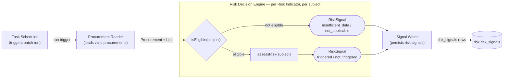
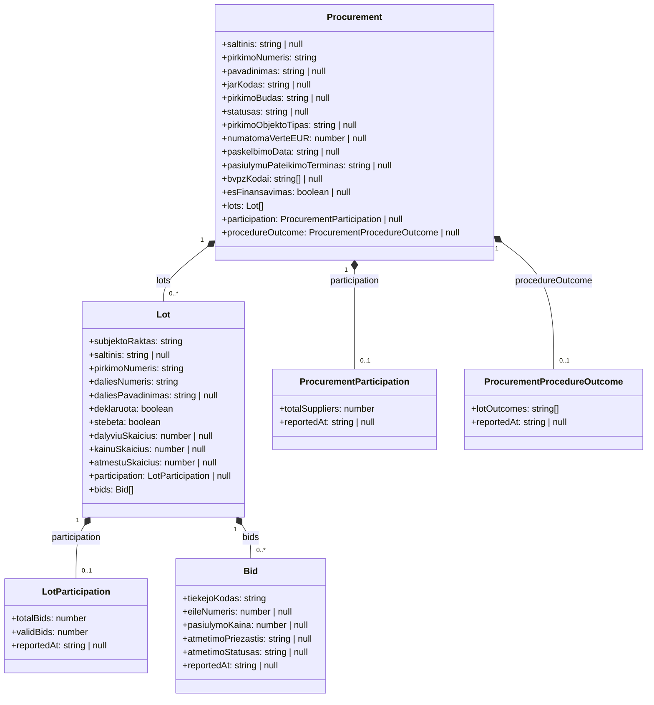
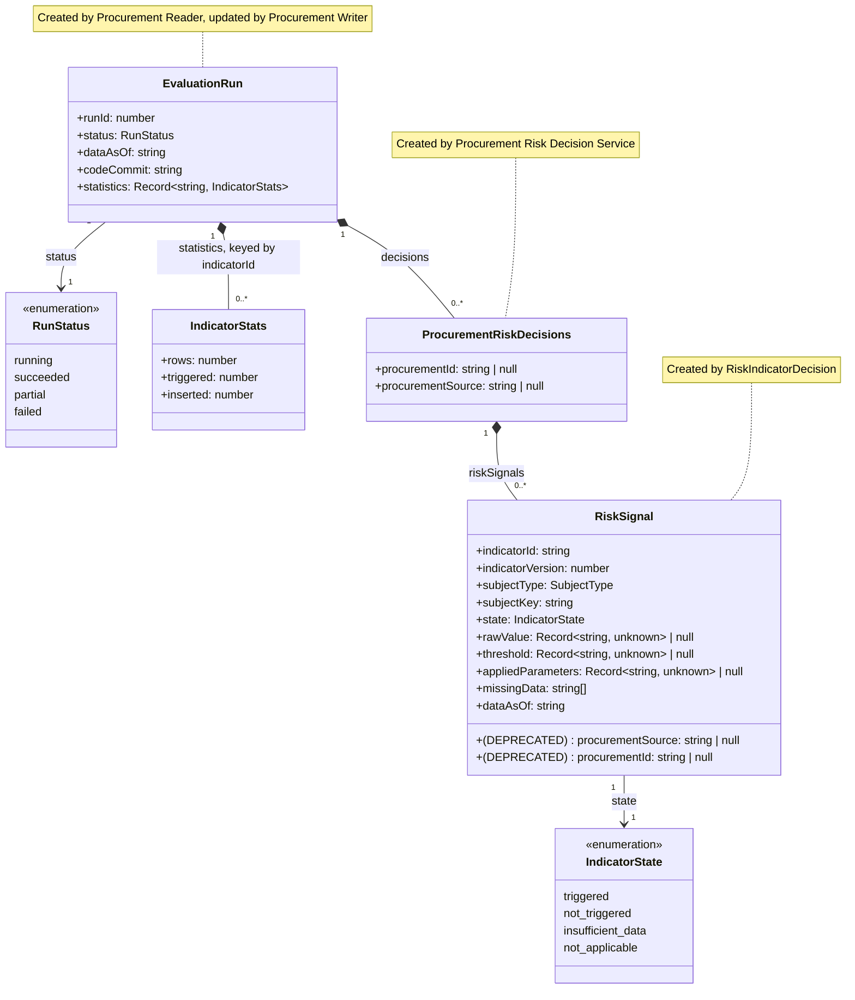

# Procurement Risk Service Architecture

## 1. Procurement Risk Process

### 1.1 Procurement Risk Process Diagram



### 1.2 Procurement Reader and Signal Writer Components Class Diagram

```mermaid
classDiagram
    class RunJob {
        <<module runJob.ts>>
        +runEvaluation(options: RunJobOptions) Promise~RunResult~
    }

    class RunJobOptions {
        <<type>>
        +codeCommit: string
        +subjects: string[] | null
        +pageSize: number
    }

    class RunResult {
        <<type>>
        +runId: number
        +status: RunStatus
        +statistics: Record~string, IndicatorStats~
    }
    note for RunResult "RunStatus, IndicatorStats and the EvaluationRun row behind them: §2.3."

    class ProcurementReader {
        -subjects: string[] | null
        -dataAsOf: string
        +loadProcurements(cursor: string | null, pageSize: number) Promise~Page~Procurement~~
    }
    note for ProcurementReader "subjects and dataAsOf are bound once per run, not per page, so lots
    and evidence load once. Orphan lots (no matching procurement) can't happen by business invariant;
    if the query still returns one, its count is logged at WARNING and it is dropped — it is not a Subject."

    class Page~T~ {
        <<type>>
        +items: T[]
        +nextCursor: string | null
    }

    class RiskDecisionEngine {
        -procurementIndicators: ARiskIndicatorDecision[]
        -lotIndicators: ARiskIndicatorDecision[]
        -bidIndicators: ARiskIndicatorDecision[]
        +evaluateAll(procurements: Procurement[]) RiskSignal[]
        -evaluateProcurement(procurement: Procurement) RiskSignal[]
        -evaluateLot(lot: Lot, procurement: Procurement) RiskSignal[]
        -evaluateBid(bid: Bid, lot: Lot, procurement: Procurement) RiskSignal[]
    }

    class SignalWriter {
        -evaluationRun: EvaluationRun | null
        +writeRiskSignals(signals: RiskSignal[]) Promise~number~
        +updateEvaluationRun(update: Partial~EvaluationRun~) Promise~EvaluationRun~
    }
    note for SignalWriter "updateEvaluationRun upserts: the first call inserts the run row, later calls
    update it — accumulating per-indicator stats across pages. No crash recovery, no retry."

    RunJob ..> RunJobOptions: options
    RunJob --> RunResult: returns
    RunJob ..> ProcurementReader: loop — loads next page (subjects filter, cursor) until nextCursor is null
    ProcurementReader --> Page: returns
    RunJob ..> RiskDecisionEngine: evaluates one page of procurements
    RunJob ..> SignalWriter: writes the page's signals, then checkpoints statistics
```



## 2. Procurement Risk Decision Service

The service's data contract: what a run reads (§2.1, §2.2) and what it writes (§2.3, §2.4). Every type below is
declared in `modules/risk/types.ts`; `RiskSignal` is additionally validated at runtime by `riskSignalSchema` in
`modules/risk/contracts.ts`.

### 2.1 Input Data Object Model

The Procurement Reader loads one object graph per page, rooted at `Procurement`. A Risk Indicator reads only this
graph, never the database. Its three grains are the three implemented subject types — `Procurement`, `Lot`, `Bid`;
`contract` and `supplier` are admitted by the schema but have no object yet.



- **`null` evidence means nothing was observed** — the `insufficient_data` case. A *present* `participation` whose
  counts are zero is a different, real observation, and `hasRequiredData()` must not confuse the two.
- **The run's `dataAsOf` cuts off evidence, not subjects.** `Bid`, both participations and `ProcurementProcedureOutcome`
  are filtered `ataskaitosData <= dataAsOf`; `Procurement` and `Lot` are whatever the register currently holds.
- **Aggregates are merged, not joined.** One batch query per grain per run, attached to the object — so a decision
  issues no query, and every indicator at that grain shares one read. Orphan lots are dropped by the Reader, so
  `Lot.pirkimoNumeris` always resolves.

### 2.2 Input Data Object Model Source

Each object is read through the risk service's own `_v2` copy of the view, inlined per query as a CTE by
`procurementPublicViews.ts`.

| Business Object               | Domain Model View       |
|-------------------------------|-------------------------|
| `Procurement`                 | `v_pirkimas`            |
| `Lot`                         | `v_pirkimo_dalis`       |
| `Bid`                         | `v_dalyviai`            |
| `LotParticipation`            | `v_dalyviai`            |
| `ProcurementParticipation`    | `v_dalyviai`            |
| `ProcurementProcedureOutcome` | `v_proceduros_pabaiga`  |

`v_proceduros_pabaiga` is still listed as not-yet-implemented in [`domain-model.md`](domain-model.md) §1.3; the risk
service reads it today through a `_v2`-only view named `v_pirkimo_pabaiga_v2`, with no shared counterpart. Same
entity, two names — to be reconciled.

### 2.3 Output Data Object Model

A run produces one `EvaluationRun` and one `RiskSignal` per (subject, indicator) pair it evaluated. Nothing else.



### 2.4 Output Data Object Model Persistence

`RiskSignal` → `risk.risk_signals`, one row per signal:

| Field               | Column               | Type          | Note                                                        |
|---------------------|----------------------|---------------|-------------------------------------------------------------|
| —                   | `run_id`             | `bigint`      | Supplied by the Signal Writer, not by the indicator          |
| `subjectType`       | `subject_type`       | `text`        | CHECK: `procurement`, `lot`, `bid`, `contract`, `supplier`   |
| `subjectKey`        | `subject_key`        | `text`        |                                                              |
| `procurementSource` | `procurement_source` | `text`        | Denormalised, so a lot/bid row filters by procurement        |
| `procurementId`     | `procurement_id`     | `text`        | Same                                                         |
| `indicatorId`       | `indicator_id`       | `text`        |                                                              |
| `indicatorVersion`  | `indicator_version`  | `integer`     | `NOT NULL` — an indicator's identity is (id, version)        |
| `appliedParameters` | `applied_parameters` | `jsonb`       | The parameter entry in force at `dataAsOf`                   |
| `state`             | `state`              | `text`        | CHECK: `IndicatorState` plus `calculation_error`             |
| `rawValue`          | `raw_value`          | `jsonb`       | What was measured                                            |
| `threshold`         | `threshold`          | `jsonb`       | What it was measured against                                 |
| `missingData`       | `missing_data`       | `jsonb`       | Field names, when `state = insufficient_data`                |
| `dataAsOf`          | `data_as_of`         | `timestamptz` | Copied from the run, so a row explains itself without a join |

`EvaluationRun` → `risk.evaluation_runs`, one row per run:

| Field        | Column        | Type          | Note                                                      |
|--------------|---------------|---------------|-----------------------------------------------------------|
| `runId`      | `id`          | `bigint`      | The FK every signal carries                               |
| `dataAsOf`   | `data_as_of`  | `timestamptz` |                                                           |
| `codeCommit` | `code_commit` | `text`        |                                                           |
| `status`     | `status`      | `text`        | CHECK: the four `RunStatus` values                        |
| `statistics` | `statistics`  | `jsonb`       | Per-indicator `rows` / `triggered` / `inserted`           |
| —            | `started_at`  | `timestamptz` | `DEFAULT now()`                                           |
| —            | `finished_at` | `timestamptz` | Stamped when status becomes terminal                      |
| —            | `error`       | `text`        | Set only by the stale-run sweep at the next process start |

`state`'s CHECK admits a fifth value, `calculation_error`, that no run writes: the engine contains a failing
indicator by logging it and contributing no signal. The columns `error_info` and `duration_ms` belong to that same
unused path.

Three invariants:

- **A run is an immutable snapshot.** `risk.risk_signals` is insert-only — `risk_rw` holds no UPDATE or DELETE — so
  there is no current-state row to maintain. A superseded snapshot is deleted whole by the retention job.
- **One result per subject and indicator, per run** — unique index `(run_id, subject_type, subject_key, indicator_id)`.
- **At most one open run** — partial unique index on `status = 'running'`.

Two views are the only read path, so the site, the retention job and the service cannot disagree about which
snapshot is live:

| View                           | Answers                                                                                    |
|--------------------------------|--------------------------------------------------------------------------------------------|
| `risk.v_latest_run`            | Which run the site shows — the most recently started `succeeded` or `partial` run           |
| `risk.v_procurement_summaries` | Per procurement, within that run: counts by state and the list of `triggered` indicator ids |

## 3. Risk Decision Services (DRD)

Two decision areas are drawn below: the **Procurement Risk Decision Service** (subject `procurement`) and the
**Procurement Lot Risk Decision Service** (subject `lot`). A third subject, `bid`, is implemented (§2.1, LT-COM-20)
but has no decision service drawn here yet.

### 3.1 Legend

| Shape                     | DMN Element              |
|---------------------------|--------------------------|
| Rectangle                 | Decision                 |
| Rounded (`([...])`)       | Input Data               |
| Leaning sides (`[/.../]`) | Business Knowledge Model |
| Flag (`>...]`)            | Knowledge Source         |
| Bounding box (subgraph)   | Decision Service         |

### 3.2 Diagram


### 3.3 Decision Tables: Eligibility Decisions

#### Procurement Eligibility Decision

| Input: `pirkimoBudas` present | Input: `saltinis` | Output: Eligibility |
|-------------------------------|-------------------|---------------------|
| yes                           | `cvpis`           | eligible            |
| no                            | `cvpp`            | not eligible        |

#### Lot Eligibility Decision

| Input: Parent Procurement Eligibility | Input: `deklaruota` | Output: Eligibility |
|----------------------------------------|----------------------|----------------------|
| eligible                               | true                  | eligible             |
| eligible                               | false                 | not eligible         |
| not eligible                           | any                   | not eligible         |

### 3.4 Risk Indicator Definition

```mermaid
classDiagram
    class RiskIndicatorDefinition~P~ {
        <<interface>>
        +key: RiskIndicatorKey
        +subjectType: SubjectType
        +stage: IndicatorStage
        +references: string[]
        +sourceRelations: string[]
        +requiredInputs: string[]
        +parameters: P
        +standard: RiskIndicatorStandard
        +public: RiskIndicatorPublicText
    }
    class RiskIndicatorKey {
        <<type>>
        +id: string
        +version: number
    }
    class RiskIndicatorStandard {
        <<interface>>
        +name: string
        +url: string
        +page?: number
    }
    class RiskIndicatorPublicText {
        <<interface>>
        +titleLt: string
        +descriptionLt: string
        +formulaLt: string
        +limitationLt: string
    }
    class BaseParameters {
        <<type>>
        +validFrom: string
        +validTo: string | null
        +source: string
        +note?: string
    }
    note for BaseParameters "P extends BaseParameters: an indicator's own parameter values are
    intersected directly onto it, not nested under a values key. One entry, one validity window —
    parameterEntryFor(dataAsOf) returns it or null."

    class SubjectType {
        <<enumeration>>
        procurement, lot, bid,
        contract, supplier
    }
    class IndicatorStage {
        <<enumeration>>
        planning, tender,
        award, contract
    }

    class RiskIndicatorDecision~S~ {
        <<interface>>
        +isEligible(subject: S) EligibilityOutcome
        +assessRisk(subject: S) RiskSignal
    }
    class ARiskIndicatorDecision~D S~ {
        <<abstract>>
        +definition: D
        +context: EvaluationContext
        +isEligible(subject: S) EligibilityOutcome*
        +assessRisk(subject: S) RiskSignal*
        #hasRequiredData(subject: S) boolean*
        #signalFor(subject: S, partial: PartialRiskSignal) RiskSignal
    }
    class AProcurementIndicatorDecision~D~ {
        <<abstract>>
        +isEligible(subject: ProcurementSubject) EligibilityOutcome
    }
    class ALotIndicatorDecision~D~ {
        <<abstract>>
        +isEligible(subject: LotSubject) EligibilityOutcome
    }
    class ABidIndicatorDecision~D~ {
        <<abstract>>
        +isEligible(subject: BidSubject) EligibilityOutcome
    }

    class Subject {
        <<type>>
        ProcurementSubject
        LotSubject
        BidSubject
    }
    note for Subject "Each variant wraps the object the Reader already loaded — Procurement, Lot or Bid
    (§2.1) — together with its non-null parents, so a decision never re-fetches what the Reader knows.
    subjectType, subjectKey, procurementSource and procurementId are derived from the wrapped
    object's own key, not stored on it."

    class EligibilityOutcome {
        <<type>>
        +eligible: boolean
        +signal: RiskSignal
    }
    note for EligibilityOutcome "A discriminated union: signal is present only when eligible is false,
    and is then already the final RiskSignal (not_applicable or insufficient_data)."

    class RiskSignal {
        <<interface>>
    }
    note for RiskSignal "Fields, states and persistence: §2.3, §2.4."

    RiskIndicatorDefinition "1" *-- "1" RiskIndicatorKey: key
    RiskIndicatorDefinition "1" --> "1" SubjectType: subjectType
    RiskIndicatorDefinition "1" --> "1" IndicatorStage: stage
    RiskIndicatorDefinition "1" *-- "1" BaseParameters: parameters
    RiskIndicatorDefinition "1" *-- "1" RiskIndicatorStandard: standard
    RiskIndicatorDefinition "1" *-- "1" RiskIndicatorPublicText: public
    ARiskIndicatorDecision ..|> RiskIndicatorDecision
    ARiskIndicatorDecision "1" *-- "1" RiskIndicatorDefinition: definition
    AProcurementIndicatorDecision --|> ARiskIndicatorDecision
    ALotIndicatorDecision --|> ARiskIndicatorDecision
    ABidIndicatorDecision --|> ARiskIndicatorDecision
    RiskIndicatorDecision "1" ..> "1" Subject: isEligible(subject), assessRisk(subject)
    RiskIndicatorDecision "1" ..> "1" EligibilityOutcome: isEligible() returns
    RiskIndicatorDecision "1" ..> "1" RiskSignal: assessRisk() returns
    EligibilityOutcome "1" ..> "0..1" RiskSignal: when not eligible
```



### 3.5 Per-Indicator File Layout

Each deployed indicator version is one directory under `modules/risk/indicators/<CODE>/`:

| File            | Holds                                                                                                                                                                                   |
|-----------------|-----------------------------------------------------------------------------------------------------------------------------------------------------------------------------------------|
| `definition.ts` | The `RiskIndicatorDefinition` object — identity, references, standard, public wording, and the effective-dated parameter timeline. Pure data; no imports of `ARiskIndicatorDecision`. Used in GUI and found in registry. |
| `decision.ts`   | The `ARiskIndicatorDecision` subclass that exposes `isEligible` and `assessRisk`                                                                                                        |
| `test/`         | Unit tests against risk indicator class                                                                                                                                                 |

## 4. Running the Service

Entry point: `services/procurement-risk/index.ts` (`npm run risk:run`). One sequential evaluation run per invocation — not a daemon.

```bash
npm run risk:run                       # full run, every subject
npm run risk:run -- <pirkimoNumeris...>  # only the named procurements
npm run risk:run -- --limit 20         # light run: first 20 distinct ATN-1 procurement ids (deterministic)
```

`--limit N` and explicit subject ids are mutually exclusive. Requires `riskDb` (see `postgres/riskDb.js`) and the primary Postgres DB configured, as in [Local dev setup](../../CLAUDE.md).

## 5. Open Questions

| # | Question                                                                                                                                                                                                                               |
|---|----------------------------------------------------------------------------------------------------------------------------------------------------------------------------------------------------------------------------------------|
| 1 | Is one shared Procurement Eligibility Decision sufficient for all 28 indicators, or do some need their own additional eligibility rule? ANSWER: you will extend DRD on demand.                                                         |
| 2 | Where does `requiredInputs` / Data Eligibility Decision sit in this v2 model — inside each Risk Indicator, or as a second shared decision beside Procurement Eligibility Decision? ANSWER: you will read all domain element view data. |
