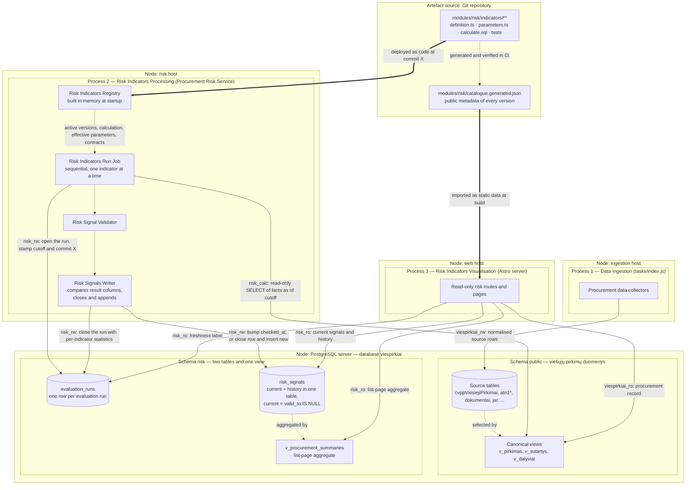
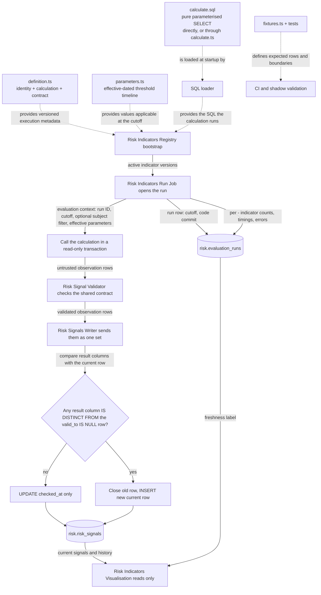

```mermaid
flowchart LR
    subgraph ingestion["Process 1 — Data Ingestion and the state it publishes"]
        S["Procurement data collectors"]
        C[("Canonical procurement facts<br/>schema public")]
        S -->|" normalised procurement records "| C
    end

    subgraph processing["Process 2 — Risk Indicators Processing"]
        M["Git: Risk Indicator definitions<br/>and effective-dated parameters"]
        G["Risk Indicators Registry"]
        K["Risk Indicators Run Job"]
        I["Risk Indicator calculation<br/>packaged SELECT, or a function over it"]
        T["Risk Signal Validator"]
        P["Risk Signals Writer"]
        M -.->|" deployed code, loaded and validated at startup "| G
        G -.->|" active versions and their implementations "| K
        G -.->|" declares the output contract "| T
    end

    subgraph storage["Schema risk — written only by Process 2"]
        J[("evaluation_runs")]
        H[("risk_signals")]
        R["v_procurement_summaries"]
        H -.->|" aggregated at query time "| R
    end

    subgraph visual["Process 3 — Risk Indicators Visualisation"]
        A["Astro read-only routes"]
        U["Public risk pages and API"]
        A -->|" rendered HTML or JSON response "| U
    end

    K -->|" one open run, stamped with cutoff and commit "| J
    K -->|" cutoff and effective parameters "| I
    C -->|" canonical facts as of cutoff "| I
    I -->|" standard observation rows "| T
    T -->|" validated rows "| P
    P -->|" unchanged: bump checked_at<br/>changed: close row, insert new "| H
    P -->|" per-indicator statistics, terminal state "| J
    H -->|" current signals, detail and history "| A
    R -->|" list page ordering and counts "| A
    J -->|" freshness label "| A
```

# Procurement Risk Service Architecture

Status: detailed design draft

Date: 2026-08-11

Core
methodology: [OCP 2024 Red Flags in Public Procurement](https://www.open-contracting.org/wp-content/uploads/2024/12/OCP2024-RedFlagProcurement.pdf)

Parent design: [Risk signals for current and recently completed procurements](risky-procurements-initial-design.md)

## 1. Decisions

1. Published indicator results are public and are displayed with their source facts, calculation, version and
   limitations.
2. The OCP code is retained for an OCP indicator, for example `R003`. A Lithuania-specific indicator gets an `LT` code,
   for example `LT001`; it must not be presented as an OCP indicator.
3. A public result is called a **risk signal** (`rizikos signalas`), not a finding of corruption or fraud.
4. There is no unexplained corruption probability, and no composite score. A signal row carries no `strength`,`severity`
   or `confidence`: the list sorts on the number of triggered indicators, severity is a constant of the indicator
   version living in the Git catalogue, and data coverage is stated from `missing_data` ([
   `risk-schema.md`](risk-schema.md) §3).
5. A **Risk Indicator** is a versioned package consisting of metadata, public explanation, effective-dated parameters,
   calculation and tests. The package lives entirely in the Git repository.
6. A Risk Indicator calculates and returns rows; it never persists them. Whatever it is made of, it issues no `INSERT`,
   `UPDATE`, `DELETE`, table creation or transaction control, and it reads no risk result. There is one calculation
   contract, not one per implementation technique
   ([§5.3.1](#531-one-calculation-contract-and-what-to-do-when-one-select-is-not-enough)).
7. Risk calculation runs in its own process — the **Procurement Risk Service** — primarily so that it holds its own
   database roles and cannot starve ingestion or the web application.
   See [§13](#13-why-this-is-not-the-existing-task-runner) for the honest limits of that argument.
8. PostgreSQL views provide canonical facts; they are not the persisted risk result and should not run the complete risk
   system during a web request.
9. The public Astro application is a read-only consumer of `risk.risk_signals` and the generated catalogue artefact. It
   never imports indicator code, starts evaluation work or calculates a signal in a request.
10. The design uses no separate analytics or orchestration platform. PostgreSQL provides durable coordination and
    computation; TypeScript provides the registry, execution, validation and operational control.
11. The system has exactly three processes with separate lifecycles and separate database roles: **Data Ingestion**,
    **Risk Indicators Processing** and **Risk Indicators Visualisation**. They exchange nothing but committed PostgreSQL
    rows.
12. Risk Indicators Processing is one **single sequential job**. It executes the applicable Risk Indicators one after
    another. Parallel workers, leases, fencing tokens and horizontal scaling are deliberately out of scope for this
    design; they can be added later without changing any stored contract described here.
13. **Git is the only home of a Risk Indicator.** There are no database tables for indicator identity, versions, public
    wording, lifecycle state or parameter values. `git log`, `git blame` and a pull-request diff answer who changed
    which threshold, when and why. PostgreSQL stores results and run control state; it never stores the definition of an
    indicator.
14. **Every identifier in the Procurement Risk Service is English** — schema, tables, columns, TypeScript fields, SQL
    aliases, roles, module paths and enum values. This keeps the system aligned with international and EU
    procurement-fraud terminology, where the concepts already have settled names. Lithuanian survives only as **label
    values** the GUI renders (`titleLt`, `descriptionLt`, `limitationLt`, `formulaLt`), and those live in the indicator
    catalogue in Git, never as an identifier.

The boundary is exact and worth stating, because the rest of the repository follows the opposite convention: the`public`
schema is Data Ingestion's and keeps its Lithuanian domain names (`pirkimas`, `tiekejas`, `sutartis`,`jarKodas`). A risk
calculation reading those views therefore crosses the boundary in a single statement, and the rule is positional —
Lithuanian on the left of an `AS`, English on the right ([§5.4](#54-example-sql-calculation)).

The OCP guide describes an indicator through its definition, reason for being a red flag, required data, method, unit of
analysis, procurement stage, example and source. The local indicator package preserves these fields and adds operational
fields: implementation version, parameters, lifecycle state, owner, tests, public wording and known limitations.

### 1.1 The three processes

The concrete stack is **TypeScript + PostgreSQL**. Everything below is organised around three named processes. Each one
has a single business purpose, its own deployment lifecycle, its own database role and its own failure mode. They never
call each other; the only integration is committed PostgreSQL rows.

| # | Process                           | Business purpose                                                                             | Deployed as                                                                                        | Writes                                                     | Reads                                                                                 |
|---|-----------------------------------|----------------------------------------------------------------------------------------------|----------------------------------------------------------------------------------------------------|------------------------------------------------------------|---------------------------------------------------------------------------------------|
| 1 | **Data Ingestion**                | Populate the viešieji pirkimai data: fetch, normalise and version public procurement records | Existing task runner (`tasks/index.js`)                                                            | `public` schema source tables only — **nothing in `risk`** | Public sources (CVP IS, CVPP, TED, JAR, documents)                                    |
| 2 | **Risk Indicators Processing**    | Execute every applicable Risk Indicator, one by one, and record the resulting signals        | **Procurement Risk Service** — one long-running Node process running one sequential evaluation run | `risk.evaluation_runs` and `risk.risk_signals`             | `public` canonical views; the deployed Git definitions; `risk` for the previous state |
| 3 | **Risk Indicators Visualisation** | Show a procurement's risk signals, methodology and coverage to the public                    | Existing Astro web application                                                                     | Nothing in `risk`                                          | `risk` signals read-only; `catalogue.generated.json`; `public` procurement record     |

What this separation buys:

- A broken ingestion refresh leaves the last computed signals visible, labelled with their older `data_as_of`.
- A failed indicator leaves its previous signals in place and writes `calculation_error` rows rather than silently
  blanking the page.
- A web deployment cannot mutate risk results, because its role has no write grant on `risk`.
- Rewriting how an indicator calculates never touches ingestion or web code.

Process 1 is fully decoupled from `risk`: ingestion holds no grant on the risk schema and does not know the risk system
exists. Process 2 takes the set of indicators to execute from the deployed registry and records each run in one run
table ([§7.1](#71-evaluation-runs)). It does **not** run indicators concurrently: exactly one run executes at a time.

### 1.2 Deployment view

Outer boxes with a `Node:` prefix are deployment nodes (hosts). Inner boxes are the three processes and their
components. Cylinders are storage areas — the two schemas of the existing `viespirkiai` database. Solid arrows leaving a
process are database connections, labelled with the role used and what crosses the wire. Dotted arrows are in-process
calls and stay inside one node. The Git repository is drawn as a deployment artefact source: it is not reachable at
runtime, it is what the two Node processes are built from.



`risk` stores results and run history. What an indicator *is* comes from the code the service was deployed with, and
every run is stamped with that commit.

Database roles make the process separation enforceable rather than conventional:

| Role                         | Used by                          | Grants                                                                                                       |
|------------------------------|----------------------------------|--------------------------------------------------------------------------------------------------------------|
| `viespirkiai_rw`             | Process 1                        | Read/write on `public`. **No grant on `risk` whatsoever.**                                                   |
| `risk_calc`                  | Process 2, during a calculation  | `SELECT` only, on the `public` canonical views; used inside a read-only transaction with a statement timeout |
| `risk_rw`                    | Process 2, for recording results | `SELECT`, `INSERT`, `UPDATE` on `risk`; no `DELETE`, and no write grant on `public`                          |
| `risk_ro` / `viespirkiai_ro` | Process 3                        | `SELECT` on the `risk` tables and view and the `public` canonical views; nothing else                        |

`risk_rw` has no `DELETE`: signals are never removed by the application, because closed rows are the recent-change
history. Ageing them out is a separate scheduled maintenance concern with its own role ([
`risk-schema.md`](risk-schema.md) §4).

Because the definition is code, the two Node processes must agree on it. A new indicator version is activated only after
both Process 2 and Process 3 run the same commit; §10.1 makes this a step in the workflow. If a page nevertheless meets
an observation whose version is absent from its catalogue artefact, it degrades to the indicator code plus the evidence
stored on the observation instead of inventing wording.

#### 1.2.1 Storage areas

Risk data lives in three places, and only two of them are in PostgreSQL. Section 5 defines the Git package; section 7
explains the database and links the full DDL in [`risk-schema.md`](risk-schema.md).

| Area            | Where                              | Contents                                                                                                                  | Written by                         | Visible to visualisation                                      | Retention                                                                                       |
|-----------------|------------------------------------|---------------------------------------------------------------------------------------------------------------------------|------------------------------------|---------------------------------------------------------------|-------------------------------------------------------------------------------------------------|
| **Definitions** | Git — `modules/risk/indicators/**` | Identity, versions, lifecycle, public wording, effective-dated parameters, calculation, tests                             | A reviewed and merged pull request | Yes, via `catalogue.generated.json` built into the web bundle | Forever, as repository history                                                                  |
| **Runs**        | `risk.evaluation_runs`             | One row per evaluation run: cutoff, code commit, state, per-indicator statistics                                          | Risk Indicators Processing         | Yes — the freshness label and the "is the job healthy" check  | Forever; ~365 rows a year                                                                       |
| **Signals**     | `risk.risk_signals`                | Every current and historical `(subject, indicator)` result state, with evidence, applied parameters and the producing run | Risk Indicators Processing         | Yes — this is the public read model                           | Current rows forever; closed rows are the recent-change history and are deleted after one month |

Two properties matter. First, the one-way flow **definitions + facts → signals**: a calculation reads the deployed
definition and the `public` schema and produces rows; nothing in PostgreSQL can change what an indicator means, and no
indicator formula writes its own result ([§5.6](#56-why-a-risk-indicator-does-not-write-its-result)).

Second, because definitions are not in the database, a signal row must be self-sufficient: it stores the indicator ID,
the implementation version, the exact parameter values applied, the run that produced it — which carries the code
commit — and the structured evidence. That row can be re-explained years later even if the indicator has since been
retired from the repository — and, equally important, it stores no display text, so correcting the Lithuanian wording
never means rewriting history ([§7.2](#72-risk-signals-current-state-and-history-in-one-table)).

### 1.3 Data flow across the three processes

Solid arrows are runtime data flows; their labels name the data crossing the boundary. Dotted arrows are code or
configuration dependencies. An arrow does not mean two components share a process — in particular, database rows are
what cross between the ingestion, processing and visualisation processes.



### 1.4 Component definitions

Every component named above has one concrete role:

| Component                   | Process | Concrete form                                                                                                                                                                                                             | Responsibility and boundary                                                                                                                                                                                                                                                                                                                                                                          |
|-----------------------------|---------|---------------------------------------------------------------------------------------------------------------------------------------------------------------------------------------------------------------------------|------------------------------------------------------------------------------------------------------------------------------------------------------------------------------------------------------------------------------------------------------------------------------------------------------------------------------------------------------------------------------------------------------|
| Procurement data collectors | 1       | Existing scrapers and importers                                                                                                                                                                                           | Fetch and normalise public source data into `public`. They never calculate or record risk signals, and hold no permission on `risk`.                                                                                                                                                                                                                                                                 |
| Canonical procurement facts | 1       | PostgreSQL tables and views in `public`                                                                                                                                                                                   | Present procurements, notices, lots, bids, awards, contracts, buyers and suppliers with stable keys and `valid_from`/`valid_to` semantics. They are the reproducible facts read at `data_as_of`.                                                                                                                                                                                                     |
| Risk Indicator parameters   | 2       | Effective-dated entries in `parameters.ts`, versioned in Git                                                                                                                                                              | Hold reviewed thresholds, method scopes, legal dates and exclusions in a file separate from the formula. The run cutoff selects the applicable entry; adding an entry never rewrites historical results, and `git blame` shows who approved the change.                                                                                                                                              |
| Risk Indicators Registry    | 2       | Immutable in-process TypeScript catalogue, built from the deployed code at startup                                                                                                                                        | Resolves `(indicator ID, version)` to one validated Risk Indicator: implementation, subject, lifecycle, inputs, dependencies, effective parameters, output contract and public methodology. It holds no procurement result rows, writes nothing to the database and schedules nothing. Section 5 defines it precisely.                                                                               |
| Evaluation run              | 2       | `risk.evaluation_runs`                                                                                                                                                                                                    | One durable row per run holding cutoff, code commit, terminal state and per-indicator statistics. It is how "did the job run and did it succeed" is answered — the failure mode a risk site cannot afford to hide.                                                                                                                                                                                   |
| Risk Indicators Run Job     | 2       | One sequential TypeScript loop, single instance guaranteed by an advisory lock                                                                                                                                            | Takes the advisory lock, opens the run row with the cutoff, then walks the registry's active versions and invokes each declared calculation with the cutoff and the effective parameters, recording the outcome into `statistics`. It contains no indicator-specific branch, resolves no subject sets, and never runs two indicators at once. A failing indicator is recorded and the run continues. |
| Risk Indicator calculation  | 2       | One function per indicator version, living in its own directory — most often the `{ sqlFile }` shorthand for a single packaged `SELECT`, otherwise a `calculate.ts` that runs its own packaged SQL and processes the rows | Produces the standard observation rows for one indicator at one cutoff, reading only canonical facts through the evaluation context. It cannot mutate risk or source tables, cannot read a risk result, and no shared component branches on how it is implemented ([§5.3.1](#531-one-calculation-contract-and-what-to-do-when-one-select-is-not-enough)).                                            |
| Risk Signal Validator       | 2       | Shared TypeScript validation module plus database permissions                                                                                                                                                             | Validates the returned rows: field types, allowed states, subject and indicator identity, evidence size, duplicate keys and cross-row invariants. SQL safety comes from a read-only role, a read-only transaction and a timeout — not from keyword parsing.                                                                                                                                          |
| Risk Signals Writer         | 2       | Shared TypeScript module issuing indicator-independent PostgreSQL statements                                                                                                                                              | Sends the validated observations to PostgreSQL as one set and lets the database decide what changed: it advances `checked_at`, closes every current row whose result columns differ from the incoming one, and inserts the replacements — three statements per indicator, in one transaction. It contains no `if (indicatorId === ...)` logic.                                                       |
| Risk signals                | 2 → 3   | `risk.risk_signals`                                                                                                                                                                                                       | Holds current and historical state together, distinguished by `valid_to IS NULL`. Preserves state, evidence, indicator version, applied parameter values, code commit and `data_as_of` for audit and history queries. Result columns are never updated after insert.                                                                                                                                 |
| Procurement summary         | 2 → 3   | `risk.v_procurement_summaries`                                                                                                                                                                                            | Aggregates current signals per procurement for list-page counts, ordering and filters. A view, not a maintained table, until measurement justifies otherwise.                                                                                                                                                                                                                                        |
| Astro read-only routes      | 3       | Existing web application using a read-only role                                                                                                                                                                           | Query only `risk` signals, the summary view and the run row; read all indicator wording from `catalogue.generated.json`; authorise no calculation work. They do not import the registry or any calculation code.                                                                                                                                                                                     |
| Public risk pages and API   | 3       | Browser-visible HTML and public JSON                                                                                                                                                                                      | Display the list, procurement detail and methodology with evidence, freshness and “signal is not proof” wording. They never receive credentials or private review notes.                                                                                                                                                                                                                             |

PostgreSQL `LISTEN/NOTIFY` may reduce the delay between an ingestion release and the next run, but a notification is
only a wake-up hint; the schedule is what guarantees a run eventually runs.

## 2. Public information architecture

Use three connected pages:

| Route                           | Purpose                                                                 |
|---------------------------------|-------------------------------------------------------------------------|
| `/rizikos`                      | Find open and recently changed procurements with active signals         |
| `/rizikos/pirkimas/:source/:id` | See all evidence and evaluated indicators for one procurement           |
| `/rizikos/metodika`             | Inspect the public indicator catalogue, formulas, versions and coverage |

The existing procurement page remains the authoritative procurement record. Risk pages link to it and to original CVP
IS/CVPP documents rather than duplicating every field.

### 2.1 Main list page wireframe

All names and values below are fictional demonstration data.

```text
┌─────────────────────────────────────────────────────────────────────────────┐
│ Rizikos signalai viešuosiuose pirkimuose                    [Metodika]      │
│                                                                             │
│ Automatiniai indikatoriai padeda rasti pirkimus, kuriuos verta peržiūrėti.  │
│ Signalas nėra pažeidimo ar korupcijos įrodymas.                             │
│ [Kaip skaičiuojama]  Duomenys atnaujinti 2026-08-10 19:05                  │
├─────────────────────────────────────────────────────────────────────────────┤
│ [Atviri dabar 1 284] [Neseniai pasibaigę] [Pakeistos sutartys]              │
│                                                                             │
│ 143 su bent vienu signalu  ·  22 nauji per 24 val.  ·  5 aktyvūs rodikliai │
├───────────────┬─────────────────────────────────────────────────────────────┤
│ FILTRAI       │ Rikiuoti: [Daugiausiai signalų ▼]                           │
│               │                                                             │
│ Signalo grupė │ ┌─────────────────────────────────────────────────────────┐ │
│ □ Konkurencija│ │ 3 signalai · terminas po 14 val.                       │ │
│ □ Skaidrumas  │ │ Mokyklų maitinimo paslaugos (demonstracinis pavyzdys)  │ │
│ □ Procedūra   │ │ Pirkėjas: Pavyzdžio miesto administracija              │ │
│ □ Tiekėjas    │ │ Atviras konkursas · paslaugos · 55500000 · €480 000    │ │
│ □ Sutartis    │ │ Paskelbta 2026-08-06 · terminas 2026-08-11 09:00       │ │
│               │ │                                                         │ │
│ Etapas        │ │ R003  Trumpas pasiūlymų pateikimo terminas             │ │
│ □ Atviras     │ │       4,8 dienos; taikoma riba 10 dienų                │ │
│ □ Vertinamas  │ │ LT002 Pirkimas neskaidomas į dalis                     │ │
│ □ Sutartis    │ │       €480 tūkst.; 1 dalis; panašių pirkimų mediana 4  │ │
│               │ │ LT004 Dokumentai pakeisti arti termino                 │ │
│ Vertė         │ │       2 dokumentai pakeisti likus mažiau nei 24 val.   │ │
│ [nuo] [iki]   │ │                                                         │ │
│               │ │ Duomenų pakankamumas: 6 iš 7 rodiklių įvertinti        │ │
│ BVPŽ          │ │ [Peržiūrėti signalus] [Atverti pirkimą]                │ │
│ Pirkėjas      │ └─────────────────────────────────────────────────────────┘ │
│ Būdas         │                                                             │
│ Šaltinis      │ ┌─────────────────────────────────────────────────────────┐ │
│               │ │ 1 signalas · pasiūlymų teikimas                        │ │
│ [Išvalyti]    │ │ ...                                                     │ │
└───────────────┴─────────────────────────────────────────────────────────────┘
```

### 2.2 Header and aggregate numbers

The header establishes interpretation before showing results. It contains:

- a one-sentence purpose;
- a permanent “signal is not proof” statement;
- `data_as_of` of the underlying signals, not merely the web page generation time;
- link to the public methodology;
- counts calculated from the same current read model as the results.

Do not headline “143 risky procurements”. Use “143 procurements with at least one active signal”.

Tabs are lifecycle scopes, not separate databases:

- **Atviri dabar**: future bid deadline;
- **Neseniai pasibaigę**: deadline or award in the selected recent period;
- **Pakeistos sutartys**: newly signed or materially changed contracts.

### 2.3 Result card

The result card answers five questions in order:

1. **What is it?** Title, buyer, method, CPV, value and dates.
2. **Why is it here?** Triggered indicator names.
3. **What was observed?** Raw value and threshold/comparison in one sentence.
4. **How complete is the evaluation?** Evaluated/applicable/insufficient counts.
5. **Where is the evidence?** Detail page and original procurement.

Each indicator line uses the stable code (`R003`) and short public name. Severity may control a left border or icon, but
color is supplementary and accessible text remains mandatory.

Do not show every stored evidence field on the card. Show the decisive fact and comparison; the full calculation belongs
on the detail page.

### 2.4 Filtering and sorting

Recommended URL-backed filters:

- lifecycle scope and event-date interval;
- OCP/local indicator ID;
- signal family and severity;
- buyer and supplier, when known;
- procurement method and object type;
- CPV prefix;
- value interval;
- EU funding;
- source;
- evaluation coverage (`complete`, `partial`, `insufficient`);
- data freshness.

Sort options:

- number of triggered signals, descending (default);
- nearest deadline;
- most recently published/changed;
- largest value;
- lowest data coverage, useful for transparency monitoring.

The default order is a count of triggered indicators, not a score: it is countable, explainable and needs no calibration
([`risk-schema.md`](risk-schema.md) §3). The UI must not label it “corruption risk 82%”, and there is no weighted
attention total behind it to be mistaken for one. Severity filters by expanding the catalogue's severity set into
indicator IDs; it does not sort.

## 3. Procurement risk detail page

The detail page should make a public result independently understandable.

```text
Mokyklų maitinimo paslaugos (demonstracinis pavyzdys)
Pasiūlymų teikimas · CVP IS 7000000

3 aktyvūs signalai                          Duomenys iki 2026-08-10 19:05
7 taikomi indikatoriai: 6 įvertinti, 1 nepakanka duomenų

Pirkimo eiga
● 08-06 paskelbta ── ● 08-10 pakeisti dokumentai ── ○ 08-11 terminas

R003 · Trumpas pasiūlymų pateikimo terminas
┌────────────────────────────────────────────────────────────────────┐
│ Ką matome                                                        │
│ Nuo paskelbimo iki termino: 4,8 kalendorinės dienos.             │
│                                                                  │
│ Kaip skaičiuota                                                  │
│ 2026-08-11 09:00 − 2026-08-06 13:48 = 4,8 dienos.                │
│ Šiam būdui taikytas parametras: 10 dienų.                        │
│                                                                  │
│ Kontekstas                                                       │
│ To paties būdo ir CPV grupės mediana: 10,8 dienos (n=842).       │
│                                                                  │
│ Šaltiniai                                                        │
│ CVP IS skelbimas · pirkimo duomenys · nuskaityta 19:05           │
│                                                                  │
│ Apribojimai                                                      │
│ Pagreitinta procedūra ar teisėta išimtis gali paaiškinti terminą.│
│                                                                  │
│ Metodika: R003, vietinė versija 2 · aktyvi nuo 2026-07-01        │
└────────────────────────────────────────────────────────────────────┘

[Kiti aktyvūs signalai]
[Įvertinti, bet nesuveikę indikatoriai (3)]
[Nepakanka duomenų (1)]
```

### 3.1 Signal explanation contract

Every public signal expands to the same sections:

- **Ką matome** — plain-language observation;
- **Kaip skaičiuota** — formula with this procurement's values;
- **Riba arba palyginimas** — the exact effective parameter or peer population;
- **Kontekstas** — comparison sample, if relevant;
- **Šaltiniai** — links, identifiers and data-as-of time;
- **Apribojimai** — common legitimate explanations and known data gaps;
- **Metodika** — indicator ID, implementation version and the effective date of the parameter entry that was applied.

The page renders these fields from structured evidence. Indicator code must not construct arbitrary HTML.

### 3.2 Non-triggered and unavailable indicators

The detail page should disclose evaluation coverage without overwhelming the user:

- collapsed **“Įvertinti, signalas nenustatytas”** section;
- visible **“Nepakanka duomenų”** count, with missing fields after expansion;
- `not_applicable` indicators omitted from the main count but visible in methodology/debug information if needed;
- calculation errors never converted to `insufficient_data`; show a temporary data-processing notice and alert
  maintainers.

This prevents the public from interpreting absent signals as a comprehensive clean bill of health.

### 3.3 Change history

When a signal appears, changes or disappears, show a short history:

```text
2026-08-10 19:05  LT004 appeared after a new document version was observed
2026-08-09 18:10  R003 recalculated: deadline extended from 3.8 to 4.8 days
2026-08-06 14:02  First evaluation completed
```

The history is derived from the signal rows themselves, not reconstructed from logs. It is one query — every row for
this procurement ordered by `valid_from` — because a closed row (`valid_to IS NOT NULL`) is exactly "a state that used
to be shown and no longer is". Each line's timestamp is that row's `valid_from`, and the reason for the change is
derivable from comparing its `raw_value` and `indicator_version` with the row it replaced.

Two distinctions the page must preserve, because the data supports them and readers will otherwise assume the wrong one:

- a signal that **stopped** (a new row with a different state) versus one that is merely **stale** (no new row, and
  `checked_at` falling behind);
- a change caused by the **procurement** (same indicator version, different measured value) versus one caused by **the
  methodology** (a new `indicator_version`, or the same version with different `applied_parameters`). Presenting a
  threshold change as though the buyer's behaviour changed would be a straightforward misrepresentation.

## 4. Public methodology catalogue

`/rizikos/metodika` makes the system inspectable. It contains:

- link and citation to the OCP core document;
- explanation of `triggered`, `not_triggered`, `insufficient_data` and `not_applicable`;
- searchable indicator catalogue;
- active, shadow and retired versions;
- calculation and parameter history;
- coverage and trigger-rate statistics by year/method/CPV where samples are safe;
- known source limitations and freshness;
- change log.

Example catalogue row:

| ID   | Public name                          | Stage  | Unit        | Active version | Coverage, 30 d. | Trigger rate | Updated    |
|------|--------------------------------------|--------|-------------|---------------:|----------------:|-------------:|------------|
| R003 | Trumpas pasiūlymų pateikimo terminas | Tender | Procurement |              2 |           98.9% |         7.4% | 2026-07-01 |

Opening it shows the original OCP definition, the local profile, required data, exact SQL-style formula, exclusions,
parameters, example, limitations, owner and validation date.

Everything on this page except the statistics comes from `catalogue.generated.json`, the artefact generated from the
indicator directories and shipped inside the web bundle. The statistics come from `risk.risk_signals`. This is what lets
the methodology page describe retired versions and versions with zero current signals: the catalogue is the deployed
code, not a summary of the results table. Where the repository is public, each entry can link directly to the directory
and to the commit history of its thresholds.

## 5. What exactly is one Risk Indicator?

A **Risk Indicator** is the policy concept and reproducible test that turns public procurement facts into one of four
states: `triggered`, `not_triggered`, `insufficient_data` or `not_applicable`. It is not one database statement and it
is not the result row.

Concretely, **a Risk Indicator is one directory in the Git repository**. Everything that defines it — what it means,
when it applies, which thresholds it uses since which date, how it calculates, and what its public explanation says — is
a file in that directory. Nothing about it lives in the database. Its whole lifecycle, from `draft` to `retired`, is a
sequence of reviewed commits.

### 5.1 The Risk Indicator directory

```text
modules/risk/indicators/R003/          ← one directory = one Risk Indicator
│
├── definition.ts        WHAT IT IS. The single exported object all other
│   │                    components resolve. Contains:
│   ├── key              identity: { id: 'R003', version: 2 } — stamped on every
│   │                    observation this indicator ever produces
│   ├── lifecycle        'draft' | 'shadow' | 'active' | 'retired' — changing this
│   │                    line is what activates or retires the indicator
│   ├── stage            'planning' | 'tender' | 'award' | 'contract'
│   ├── subjectType      what one result row is about: 'procurement', 'lot', ...
│   ├── owner            responsible team, mirrored by CODEOWNERS on this directory
│   ├── standard         OCP citation: document name, URL and page
│   ├── public           WHAT THE PUBLIC READS. titleLt, descriptionLt,
│   │                    limitationLt, formulaLt — the only text the web renders
│   ├── requiredInputs   fields that must be present, else 'insufficient_data'
│   ├── applicability    scope rules that decide 'not_applicable'
│   ├── sourceRelations  canonical views the calculation may read
│   ├── calculation      the one function that produces observations, or the
│   │                    { sqlFile } shorthand for the common one-SELECT case
│   └── outputContract   runtime validation of the rows the calculation returns
│
├── parameters.ts        WHAT IT COMPARES AGAINST. An append-only, effective-dated
│   │                    timeline kept in its own file so a threshold change is a
│   │                    one-line, reviewable, blameable diff:
│   └── entries[]        { validFrom, validTo, scope: { methods, objectTypes },
│                          values: { minimumDays: 10, ... }, source, note }
│
├── calculate.sql        HOW IT CALCULATES, for the common case: one pure,
│                        parameterised SELECT — $1 run ID, $2 data_as_of, $3
│                        effective parameters, $4 optional subject filter.
│                        Never INSERT/UPDATE/DELETE, never its own transaction.
│   and/or
├── calculate.ts         HOW IT CALCULATES, when one SELECT is not enough: an
│                        ordinary function over the evaluation context, free to
│                        run its own packaged .sql files from this directory,
│                        process the rows and assemble the observations. Same
│                        inputs and same output contract either way (§5.3.1).
│
├── fixtures.ts          PROOF IT IS RIGHT. Deterministic input rows for the
│                        triggered / not-triggered / insufficient / not-applicable
│                        cases, boundary values and effective-date transitions.
├── calculate.test.ts    Assertions over those fixtures, run in CI.
│
└── README.md            Optional reviewer context: interpretation notes, known
                         false positives, decisions taken during review.
```

Read that as the definition of the entity: **identity + lifecycle + public wording + applicability + parameter
timeline + exactly one calculation + tests**. A file missing from this directory is a property the indicator does not
have; a change to any file in it is a change to the indicator, visible in one `git log modules/risk/indicators/R003/`.

The rest of the repository is shared machinery that every indicator reuses and no indicator owns:

```text
modules/risk/
  contracts.ts               # shared observation and run contracts
  registry.ts                # explicit imports of every Risk Indicator version
  sqlLoader.ts               # loads packaged SQL at process start
  catalogue.generated.json   # public metadata of all versions, generated from the
                             # definitions, committed, verified in CI, imported by Astro
services/procurement-risk/
  index.ts                   # service entry point and single-instance advisory lock
  runJob.ts                  # opens the run, executes Risk Indicators one at a time
  validate.ts                # runtime output and cross-row checks
  write.ts                   # column comparison, close-and-append into risk.risk_signals
migrations/risk/
  001_risk.sql             # the whole schema: two tables and one view
```

The catalogue is the set of directories above; the only migration is the DDL in [`risk-schema.md`](risk-schema.md).

#### 5.1.1 Why Git and not database tables

Keeping the whole entity in Git gives:

- **One audit trail instead of two.** `git log -p modules/risk/indicators/R003/parameters.ts` shows who raised a
  threshold, when, in which pull request, with what justification in the commit message. No separate `patvirtino`/
  `patvirtinta_at` columns to keep honest.
- **No drift.** A code hash that must match a database row is a class of incident that now cannot happen, because there
  is no row to disagree with.
- **Atomic review.** Formula, threshold, public wording and tests change in one pull request and one CODEOWNERS
  approval. Previously a threshold could be changed in production without touching the repository.
- **Trivial rollback.** Reverting a commit reverts the indicator, including its wording and thresholds.
- **A smaller schema.** `risk` stores results and nothing else: two tables and one view.

The cost is accepted deliberately: a threshold change requires a deployment rather than an `UPDATE`, and the two Node
processes must run the same commit before a new version is activated. For a public-transparency system where every
threshold must be explainable and attributable, that is the right trade.

### 5.2 The Risk Indicators Registry

A **Risk Indicator definition** is a read-only TypeScript object conforming to the shared `RiskIndicator` contract. It
describes how one exact indicator version is planned, executed, validated, explained and audited. It is metadata and
executable wiring around the formula; it is neither the formula's observation rows nor a class with its own scheduler or
persistence methods.

The definition is written in TypeScript regardless of what language the formula uses. R003 has a TypeScript definition
while its actual calculation remains a PostgreSQL `SELECT` in `calculate.sql`.

Expressing the definition as a checked TypeScript type gives two layers of protection:

1. **Compile-time checks** reject missing fields, misspelled lifecycle, stage or state literals and incompatible
   calculation or parameter types during development and CI.
2. **Startup runtime checks** reject problems the compiler cannot see: duplicate IDs, more than one active version of an
   indicator, an unreadable SQL file, overlapping or gapped parameter validity ranges, or public text that violates the
   required contract.

The **Risk Indicators Registry** is the immutable, explicitly constructed in-process catalogue of every deployed Risk
Indicator definition. Its key is `(indicator_id, implementation_version)`. Given that key, the Risk Indicators Run Job
retrieves exactly one validated definition. The registry also answers which version is `active`, `shadow` or `retired`.

The registry is deliberately not:

- a table of calculated signals;
- arbitrary TypeScript files discovered by scanning a directory at runtime;
- an admin-editable formula store;
- the work queue or scheduler;
- the visualisation process's source of results.

The repository definition files are the only source of truth. When the Procurement Risk Service starts,
`createRiskIndicatorRegistry` validates them. Each run stores the code commit it was deployed from, so any published
result can be traced back to the exact repository state that produced it. Nothing is written to a catalogue table,
because there is none.

A definition declares only two kinds of input, and neither of them orders anything:

| Definition field  | Meaning                                                                      |                                     Affects execution order? |
|-------------------|------------------------------------------------------------------------------|-------------------------------------------------------------:|
| `sourceRelations` | Canonical PostgreSQL facts the calculation reads                             |                        No; the run cutoff controls readiness |
| `parameters`      | Effective-dated policy values from `parameters.ts`, selected at `data_as_of` | No; a deployed parameter change takes effect on the next run |

#### 5.2.1 There are no indicator dependencies, and therefore no execution order

An earlier draft gave each definition an `indicatorDependencies` list and had the run job topologically sort it. That
field cannot exist, because it contradicts [decision 6](#1-decisions)
and [§5.6](#56-why-a-risk-indicator-does-not-write-its-result): a calculation reads the `public` schema and nothing in
`risk`, which is exactly what lets it run as `risk_calc`. An indicator that cannot read another indicator's signals
cannot depend on one.

Nor is the field wanted. Reviewing all 106 canonical indicators, the ones that look derived — LT-PRO-03 institutional
use of non-competitive methods, LT-COM-04 buyer–supplier concentration, LT-COM-06 market concentration — aggregate
procurement *facts*, not other indicators' *results*. If a genuinely shared intermediate ever appears (a peer median, a
market share denominator), the answer is a canonical view in `public`, or a derived table computed once before the
loop — a fact, available to every indicator on equal terms, not an edge in a dependency graph.

What remains is an unordered set. The run job iterates the registry's active versions in declaration order because
iteration needs some order, not because the order carries meaning; any permutation produces the same signals. There is
no topological sort, no cycle check and no "prerequisite failed, skip the dependant" rule.

#### 5.2.2 The run cutoff, and who chooses the subject set

A run has exactly two inputs, and neither needs a planning phase:

- **`data_as_of` is the run's clock**, read once at run start and passed to every calculation as `$2`. It is not derived
  from ingestion state, and no attempt is made to infer how fresh the source data is. Its two jobs today are to keep one
  run internally consistent — the first and the thirtieth indicator agree on what "now" means — and to make a rerun with
  the same cutoff reproducible for every deadline and age comparison. **An indicator's SQL must never call `now()`**;
  that is the enforceable form of "reproducible", and it is a test.
- **The subject set is the indicator's own `WHERE` clause.** Nothing outside the indicator can resolve it: each one has
  its own unit of analysis (procurement, lot, contract, supplier) and its own applicability, so a central resolver would
  be 106 scoping rules re-implemented outside the definitions that own them. `$4` exists only as an override — an
  explicit subject array for a backfill or a single-procurement rerun, `NULL` for a normal run.

Genuine as-of time travel — reading the source *as it stood* at an earlier cutoff — is not available yet and is not
assumed here. It requires the append-only source-observation table proposed in
the [parent design](risky-procurements-initial-design.md) §5.1, because today ingestion upserts rows and replaces
decomposed children. When that table exists, `$2` becomes a real filter without any caller changing.

**Nothing skips "stale" subjects, deliberately.** A full run is one set-based query per indicator, not a row-by-row
walk, so re-evaluating an unchanged procurement costs almost nothing on the read side; the cost is on the write side and
is addressed by writing only on change ([§7.2](#72-risk-signals-current-state-and-history-in-one-table)). Skipping would
also require knowing that a subject's facts have not changed, which is not derivable until ingestion stamps a
per-procurement change time. If measurement ever justifies it, it belongs in the indicator's own `WHERE` as one shared
predicate — never in a scheduler that guesses on behalf of 106 different formulas.

### 5.3 Example Risk Indicator definition and registry

This abbreviated example shows the contracts, one definition, explicit registration and lookup. The shared runtime
contracts validate values that cross a trust boundary, including rows returned by PostgreSQL.

```ts
type IndicatorLifecycle = 'active' | 'shadow' | 'retired';
type IndicatorStage = 'planning' | 'tender' | 'award' | 'contract';
type IndicatorState =
    | 'triggered'
    | 'not_triggered'
    | 'insufficient_data'
    | 'not_applicable';

type RuntimeContract<T> = Readonly<{
    validate(value: unknown): T;
}>;

type RiskIndicatorKey = Readonly<{
    id: `R${number}` | `LT${number}`;
    version: number;
}>;

type RiskObservationV1 = Readonly<{
    indicatorId: RiskIndicatorKey['id'];
    indicatorVersion: number;
    subjectType: 'procurement';
    subjectKey: string;
    state: IndicatorState;
    rawValue: number | null;
    thresholdValue: number | null;
    evidence: Readonly<Record<string, unknown>>;
    dataAsOf: string;
}>;

type R003Parameters = Readonly<{
    minimumDays: number;
    dayCounting: 'calendar_days' | 'business_days';
}>;

// One effective-dated entry of a parameter timeline. Adding an entry is the only
// way to change a threshold; entries are never edited or deleted.
type ParameterEntry<P> = Readonly<{
    validFrom: string;
    validTo: string | null;
    scope: Readonly<{
        methods?: readonly string[];
        objectTypes?: readonly string[];
    }>;
    values: P;
    source: string;
    note?: string;
}>;

// The evaluation context is the only way a calculation reaches data. `sql` runs a
// .sql file packaged in the indicator's own directory, on the read-only risk_calc
// connection, inside the run job's read-only transaction and statement timeout.
type EvaluationContext = Readonly<{
    runId: number;
    dataAsOf: string;
    parameters: readonly ParameterEntry<unknown>[];
    subjects: readonly string[] | null;
    sql<T>(file: string, params?: readonly unknown[]): Promise<readonly T[]>;
}>;

// One contract, whatever the calculation is made of.
type Calculation = (ctx: EvaluationContext) => Promise<readonly RiskObservationV1[]>;

type RiskIndicator<P> = Readonly<{
    key: RiskIndicatorKey;
    lifecycle: IndicatorLifecycle;
    subjectType: 'procurement';
    stage: IndicatorStage;
    owner: string;
    sourceRelations: readonly string[];
    requiredInputs: readonly string[];
    parameters: readonly ParameterEntry<P>[];
    parameterContract: RuntimeContract<P>;
    // The shorthand { sqlFile } is not a second kind of indicator. defineRiskIndicator
    // expands it to (ctx) => ctx.sql(sqlFile), so the run job only ever calls a
    // Calculation and no code anywhere branches on how an indicator is implemented.
    calculation: Calculation | Readonly<{ sqlFile: string }>;
    outputContract: RuntimeContract<RiskObservationV1>;
    standard: Readonly<{ name: string; url: string }>;
    public: Readonly<{ titleLt: string; limitationLt: string }>;
}>;

// parameters.ts — the effective-dated timeline. Append entries; never edit one.
// A git diff of this file is the complete history of "who changed which threshold".
export const r003Parameters: readonly ParameterEntry<R003Parameters>[] = [
    {
        validFrom: '2026-07-01',
        validTo: null,
        scope: {methods: ['Atviras konkursas'], objectTypes: ['Prekės', 'Paslaugos']},
        values: {minimumDays: 10, dayCounting: 'calendar_days'},
        source: 'approved Lithuanian procurement-rule profile',
        note: 'Demonstration value pending legal review.',
    },
];

// definition.ts — the common case: one SELECT, declared as the shorthand.
export const R003v2 = defineRiskIndicator<R003Parameters>({
    key: {id: 'R003', version: 2},
    lifecycle: 'shadow',
    owner: 'procurement-risk',
    subjectType: 'procurement',
    stage: 'tender',
    sourceRelations: ['public.v_pirkimo_gyvavimo_ciklo_versijos'],
    requiredInputs: ['publicationDate', 'submissionDeadline', 'procurementMethod'],
    parameters: r003Parameters,
    parameterContract: r003ParametersContract,
    calculation: {sqlFile: './calculate.sql'},
    outputContract: riskObservationV1Contract,
    standard: {
        name: 'OCP Red Flags in Public Procurement 2024',
        url: 'https://www.open-contracting.org/wp-content/uploads/2024/12/OCP2024-RedFlagProcurement.pdf',
    },
    public: {
        titleLt: 'Trumpas pasiūlymų pateikimo terminas',
        limitationLt: 'Trumpesnį laiką gali teisėtai paaiškinti pagreitinta procedūra ar kita išimtis.',
    },
});

// definition.ts of an indicator that needs more than one statement. Everything
// above the `calculation` line is identical; only the calculation is a function.
export const LTCOM14v1 = defineRiskIndicator<LtCom14Parameters>({
    key: {id: 'LT-COM-14', version: 1},
    lifecycle: 'shadow',
    // ... same identity, lifecycle, parameters and public wording fields ...
    calculation: async (ctx) => {
        const markets = await ctx.sql<MarketRow>('./collect.sql', [ctx.dataAsOf]);
        return markets.flatMap((m) => rotationObservations(m, ctx));
    },
});

// registry.ts: registration is explicit and reviewable in a pull request.
const deployedIndicators = [
    R003v2,
    LTCOM14v1,
] as const satisfies readonly RiskIndicator<unknown>[];

export const riskIndicatorRegistry = createRiskIndicatorRegistry(deployedIndicators);

// runJob.ts: the whole plan. The set is unordered; the run cutoff selects the
// parameter entries that were in force, and each indicator scopes its own subjects.
const run = await openRun({dataAsOf: new Date(), codeCommit: COMMIT});
for (const key of riskIndicatorRegistry.activeVersions()) {
    const indicator = riskIndicatorRegistry.require(key);
    const effective = riskIndicatorRegistry.parametersAsOf(key, run.dataAsOf);
    // ... execute, validate, write; record the outcome in run.statistics
}
```

`defineRiskIndicator` freezes and type-checks one definition, validates every parameter entry against
`parameterContract`, and expands a `{ sqlFile }` shorthand into a `Calculation`. `createRiskIndicatorRegistry` performs
cross-definition and filesystem validation once at startup and exposes read-only lookup methods such as `require`,
`activeVersions` and `parametersAsOf`. The Risk Indicators Run Job is generic: after lookup it calls
`indicator.calculation(ctx)` and checks the rows against `indicator.outputContract`. Adding R003 does not add a
`switch ('R003')` branch to the run job — and neither does adding LT-COM-14, because there is no engine to switch on.

`parametersAsOf` returns the entries whose validity range contains the run cutoff. Those entries are passed into the
calculation and, crucially, the matched values are copied onto every observation the run produces — so a published
signal carries its own threshold rather than a pointer to one.

`RuntimeContract<T>` is a small project-owned interface with a `validate(unknown): T` operation; it is not a third-party
product. Stable stage, lifecycle, state and subject values are TypeScript unions backed by those runtime checks. The
real shared `RiskObservationV1` contract includes the columns shown in the SQL example below. Public text is versioned
and reviewed. The web application does not derive explanations from SQL column names.

#### 5.3.1 One calculation contract, and what to do when one `SELECT` is not enough

An earlier draft made this an either/or: `engine: 'sql' | 'typescript'`, with TypeScript framed as the exception for
work that "genuinely does not fit relational SQL". Reading the [canonical catalogue](indicators-canonical.md) makes that
framing untenable, because the exception is about a third of it:

| Shape                                             | Roughly | Examples                                                                                                                                                   |
|---------------------------------------------------|--------:|------------------------------------------------------------------------------------------------------------------------------------------------------------|
| Row-local arithmetic over one subject's own facts |     ~60 | LT-PRO-08 short deadline, LT-COM-01 single valid bid, LT-AWD-01/02/04 disqualification counts, LT-EXE-01–04 amendments, LT-TRA-04 contract not published   |
| Comparison against a population baseline          |     ~18 | LT-PRI-01 value vs market benchmark, LT-PRO-07 threshold bunching, LT-PRO-03 buyer's non-competitive rate, LT-COM-05 market share, LT-COM-06 concentration |
| Collect, compute a statistic, then threshold it   |      ~8 | LT-PRI-08 Benford, LT-COM-11 fixed-multiple prices, LT-COM-12 suspiciously close prices, LT-COM-14 bid rotation, LT-COM-17 repeated submission order       |
| Traversal of the ownership and person-link graph  |      ~7 | LT-COI-02/03/06 shared owner or controller, LT-SUP-10 connected bidders, LT-COI-07 politically exposed person                                              |
| Document text, spans and similarity               |      ~9 | LT-COM-16 similar bid documents, LT-PRO-10 tailored specifications, LT-AWD-07/08 award criteria, LT-EXE-09 delivery differs from specification             |

Only the first group is a single `SELECT`. The rest have an internal shape — **collect, process, construct** — and
forcing it into one statement produces SQL nobody will review honestly.

So there is **one** calculation contract, `(ctx) => Promise<RiskObservationV1[]>`, and `{ sqlFile }` is its shorthand
for the first group, expanded by `defineRiskIndicator` into `(ctx) => ctx.sql(file)`. Adding an indicator with a harder
shape adds a directory, not a branch in shared code.

Three things follow, and one deliberately does not:

- **The three phases are a convention, not a framework.** They are how you write `calculate.ts` and how you name the
  files next to it (`collect.sql`, then processing, then assembly). They are not an interface with declared steps: the
  steps differ too much between indicators — per lot, pairwise within a lot, per market sequence, per document span —
  and any step format expressive enough for LT-COM-16 becomes a worse programming language. For the ~60 row-local
  indicators the three phases collapse into one `SELECT`, and imposing them would be pure ceremony.
- **The safety guarantees do not come from the declaration shape.** They come from `ctx`: its `sql` runs packaged files
  from the indicator's own directory, on the `risk_calc` role, inside a read-only transaction with a statement timeout.
  A TypeScript calculation is exactly as unable to write a result as a SQL one, and for the same enforced reason
  ([§5.6](#56-why-a-risk-indicator-does-not-write-its-result)).
- **Shared or expensive intermediates become materialised views, when measurement says so.** Several indicators in
  groups two, four and five want the same underlying computation — a peer benchmark per CPV division and method, the
  closure of the ownership graph. The answer is the same one the list-page read model already takes
  ([§7.4](#74-list-page-read-model)): keep it a view, promote it to a `MATERIALIZED VIEW` refreshed before the indicator
  loop if and only if the real corpus shows it is too slow. It stays a canonical fact that every indicator reads on
  equal terms, so it introduces no schema, no new lifecycle to maintain and no dependency between indicators.
- **Rejected: one query that emits observations for several indicators at once.** It looks like the same optimisation
  and is not. It breaks one directory per indicator, independent `key.version`, independent parameter timelines and
  independent `active`/`shadow`/`retired` lifecycle — a shared query would have to re-implement the registry's lifecycle
  filtering in SQL, and a shadow version would be writing through a path that is supposed to write nothing. It also
  merges failure: the containment promise in [§9](#9-calculation-and-write-flow) is that one broken indicator leaves the
  others' signals alone. And it buys little, because scanning a few hundred thousand procurement rows is cheap; the
  expensive work is the shared intermediate, which a materialised view already computes exactly once. If one query looks
  like it should produce five indicators, what is really there is one wide row of derived facts and five short
  indicators reading it.

### 5.4 Example SQL calculation

This is the common case of [§5.3.1](#531-one-calculation-contract-and-what-to-do-when-one-select-is-not-enough): the
whole calculation is one file, declared as `calculation: { sqlFile: './calculate.sql' }`. A `calculate.ts` indicator
runs its own `.sql` files through `ctx.sql` with the same four arguments, so what follows describes the collection step
of every indicator, not a separate kind of indicator.

The SQL file is one parameterised, read-only `SELECT` with four inputs: `$1` is the evaluation run ID, `$2` is the
reproducible `data_as_of` cutoff, `$3` is the effective parameter entries the registry resolved from `parameters.ts` for
that cutoff, and `$4` is an optional subject-key filter — `NULL` for a normal full run, or an explicit array for a
backfill or a single-procurement rerun.

The calculation touches **no `risk` table at all**. Its thresholds arrive as an argument, its scope arrives as an
argument, and the previous state it might be compared against is none of its business. That is what makes `risk_calc` a
role with grants only on `public`.

```sql
WITH candidates AS (
    -- The subject set is a predicate, not a table. $4 IS NULL means the whole
    -- applicable population; an array restricts the run to those subjects.
    -- Columns here are the ingestion schema's, so they stay Lithuanian.
    SELECT p.*
    FROM public.v_pirkimo_gyvavimo_ciklo_versijos p
    WHERE p.galioja_nuo <= $2::timestamptz
      AND (p.galioja_iki IS NULL OR p.galioja_iki > $2::timestamptz)
      AND ($4:: text [] IS NULL
       OR p.subjekto_raktas = ANY ($4:: text []))),
     parameters AS (
         -- $3 is the JSON array of entries already filtered to the run cutoff by the
         -- registry; SQL only has to pick the entry whose scope matches each row.
         SELECT entry.value AS param_entry
         FROM jsonb_array_elements($3::jsonb) AS entry(value)),
     evaluated AS (SELECT c.*,
                          p.param_entry -> 'values' AS applied_parameters,
                          (p.param_entry -> 'values' ->> 'minimumDays')::numeric AS minimum_days, EXTRACT(EPOCH FROM (c.terminas - c.paskelbta)) / 86400.0 AS submission_days
                   FROM candidates c
                            LEFT JOIN parameters p
                                      ON p.param_entry -> 'scope' -> 'methods' ? c.pirkimo_budas)
-- The output aliases are the shared observation contract, and are English.
SELECT 'R003'::text          AS indicator_id, 2::integer            AS indicator_version, 'procurement'::text   AS subject_type, subjekto_raktas AS subject_key,
       pirkimo_saltinis AS                                procurement_source,
       pirkimo_id AS                                      procurement_id,
       CASE
           WHEN minimum_days IS NULL THEN 'not_applicable'
           WHEN paskelbta IS NULL OR terminas IS NULL THEN 'insufficient_data'
           WHEN submission_days < minimum_days THEN 'triggered'
           ELSE 'not_triggered'
           END::text             AS state, jsonb_build_object('submissionWindowDays', submission_days) AS raw_value,
       jsonb_build_object('minimumDays', minimum_days) AS threshold,
       applied_parameters,
       jsonb_build_object(
               'publicationDate', paskelbta,
               'submissionDeadline', terminas,
               'method', pirkimo_budas
       ) AS                                               evidence,
       $2::timestamptz       AS data_as_of
FROM evaluated;
```

The mapping rule is visible in that one statement: everything to the left of an `AS` may be Lithuanian, because it
belongs to the ingestion schema; everything to the right is the risk observation contract, and is English.

`applied_parameters` is the exact threshold object that decided this row. Carrying the values instead of a foreign key
is what lets a signal stay explainable after the parameter timeline moves on, without a catalogue table to join against.

Note what the `SELECT` does **not** return: no indicator title, no rendered Lithuanian sentence, no `valid_from`/
`valid_to`, and no opinion about whether this differs from last night. Wording belongs to `catalogue.generated.json` and
the validity interval belongs to the Risk Signals Writer. The calculation states what is true about a subject at a
cutoff; deciding whether that constitutes a change is a separate, generic step.

The calculation role has `SELECT` only, and the run job also starts a read-only transaction with a statement timeout.
Correctness does not depend on trying to parse SQL text for forbidden keywords. Business-day counting, when required, is
one shared tested PostgreSQL function backed by an effective-dated Lithuanian calendar.

### 5.5 How the TypeScript and SQL files interact



Runtime sequence for one source update, across the three processes:

```mermaid
sequenceDiagram
    participant S as Process 1 — Data Ingestion
    participant P as PostgreSQL (public + risk)
    participant E as Process 2 — Procurement Risk Service
    participant Q as Risk Indicator calculation
    participant A as Process 3 — Astro visualisation
    S ->> P: Commit normalised source rows into schema public
    E ->> P: Open one run, stamped with the cutoff and the code commit
loop one Risk Indicator at a time, in registry order
E->>Q: Execute with run ID, data_as_of and the effective parameters from Git
Q->>P: Read canonical facts as of the cutoff
Q-->>E: Return standardised observation rows
E->>E: Validate the rows against the shared contract
E->>P: Send them as one set ; PostgreSQL compares the result columns
        alt result unchanged
E->>P: UPDATE checked_at on the existing current row
else result changed
E->>P: Close the old row and INSERT the new current row
end
E->>P: Record this indicator's counts and timings in statistics
end
alt one indicator fails
E->>P: Record the error ; that indicator's previous signals stay current
A->>P: Page shows them with their older data_as_of
else the whole run crashes
E->>P: Next service start closes the stale running run as failed
A->>P: Page keeps showing the last computed state, visibly stale
end
E->>P: Close the run as succeeded or partial
```

`definition.ts` tells the service what R003's calculation is and what contract it must return. The shared run job calls
it and takes the rows. The calculation calculates only; generic code validates and persists. Astro may share public
response types, but it never imports the Risk Indicators Registry.

### 5.6 Why a Risk Indicator does not write its result

Keeping calculation and persistence separate gives:

- safe preview and `EXPLAIN` without data mutation;
- repeatable backtests with an `as_of` date;
- database-enforced read-only calculation permissions;
- one output validator and one write strategy;
- consistent current/history semantics;
- easier comparison of old and new versions;
- a failed indicator affecting only its own signals;
- the same execution path in CI, shadow, backfill and production.

The Risk Signals Writer is the only component that knows about `valid_from`, `valid_to`, `checked_at` and the
close-and-append rule; an indicator that wrote its own result would have to reimplement that logic correctly thirty
times over. It accepts validated observation rows and contains no formula branch keyed by indicator ID. No maintainer
writes indicator-specific `INSERT` or `UPDATE` statements when adding a Risk Indicator.

## 6. Where each kind of logic belongs

The question is never "SQL indicator or TypeScript indicator" — there is one kind of indicator
([§5.3.1](#531-one-calculation-contract-and-what-to-do-when-one-select-is-not-enough)). The question is which layer a
given piece of logic belongs to:

| Logic                                                                   | Belongs in                                                                    | Example                                                                |
|-------------------------------------------------------------------------|-------------------------------------------------------------------------------|------------------------------------------------------------------------|
| Relational filters, joins, windows and aggregates over one subject      | A packaged `SELECT`, usually the whole calculation                            | LT-PRO-08 short deadline, LT-COM-01 single valid bid                   |
| Reusable canonical field mapping                                        | PostgreSQL view in `public`                                                   | unified procurement and bidder facts                                   |
| Stable shared database primitive                                        | SQL/PG function ([§6.3](#63-postgresql-functions))                            | business days between dates                                            |
| A shared or expensive intermediate several indicators compare against   | A view, materialised only if measurement demands it                           | peer benchmark per CPV division and method; ownership-graph closure    |
| Statistics, sequences, pairwise comparison, text spans, graph traversal | `calculate.ts` in the indicator's own directory, running its own packaged SQL | LT-PRI-08 Benford, LT-COM-14 bid rotation, LT-COM-16 similar documents |
| Indicator identity, contract and public metadata                        | `definition.ts`                                                               | every Risk Indicator                                                   |
| Scheduling, retries and backfills                                       | Procurement Risk Service + `risk.evaluation_runs`                             | every evaluation run                                                   |
| Result persistence and history                                          | Risk Signals Writer (column compare, close and append)                        | all Risk Indicators                                                    |

### 6.1 Default: definition plus one SQL SELECT

This covers roughly sixty of the canonical indicators and is the easiest form to review: `definition.ts` plus
`calculate.sql`, declared with the `{ sqlFile }` shorthand. SQL is set-based and executes close to the data. Reach for
`calculate.ts` when the indicator genuinely has an internal shape — collect, process, construct — not to avoid writing a
join.

### 6.2 Evidence obligations when the calculation is not one SELECT

The output contract does not change, but two obligations get sharper. Text analysis must record exact document, page and
span references, so a reader can verify the claim against the original file rather than trusting a similarity score.
Graph traversal must record the path it relied on — which link, from which register, connecting which parties — because
"connected bidders" is an accusation-adjacent statement and the evidence is what keeps it a signal. How the calculation
was implemented is an internal fact and never appears in the public data contract.

### 6.3 PostgreSQL functions

Do not create one PG function per Risk Indicator. A function is justified only when:

- several indicators need exactly the same stable primitive;
- its inputs and output are small and deterministic;
- it is independently tested and version-controlled through a migration;
- it does not hide source-table access or use `SECURITY DEFINER` without a specific security review.

PG procedures/functions are deployment artefacts, not the indicator catalogue or maintenance UI.

## 7. Database schema draft

**The complete DDL lives in [`risk-schema.md`](risk-schema.md)** — tables, indexes, view and retention. This section
explains the reasoning; that file is the artefact to review and to turn into a migration.

The whole schema is **two tables and one view**:

| Object                         | Rows                                      | Purpose                                                         |
|--------------------------------|-------------------------------------------|-----------------------------------------------------------------|
| `risk.evaluation_runs`         | ~365/year                                 | One row per evaluation run. Proves the job is actually running. |
| `risk.risk_signals`            | one per (subject, indicator) result state | Current signals **and** their full history, in one table.       |
| `risk.v_procurement_summaries` | derived                                   | List-page aggregate. A view until measurement says otherwise.   |

### 7.1 Evaluation runs

`risk.evaluation_runs` holds one row per run of the Procurement Risk Service: the cutoff `data_as_of`, the `code_commit`
the service was deployed from, start and end times, a terminal state, and per-indicator counts and timings in
`statistics`.

The commit is stored once per run rather than on every signal row, and runs are kept forever, so a signal's `run_id` is
enough to recover the exact code that produced it. There is no `registry_hash`: a hash of the deployed definition files,
checked against a literal committed alongside them, would be a second answer to a question `code_commit` already
answers.

It answers a question the signal rows cannot: **did the job run, and did it succeed?** A site whose evaluation job has
been silently broken for three weeks otherwise keeps displaying its flags with full confidence. One row per run, plus
`checked_at` on each signal, makes that failure visible. A partial unique index on `status = 'running'` is the
database-enforced backstop to the service's advisory lock.

### 7.2 Risk signals: current state and history in one table

Current signals and signal history are **the same rows**, distinguished by a validity interval:

```sql
valid_from  timestamptz NOT NULL,   -- when this result first appeared
valid_to  timestamptz,            -- NULL = this is the current state
```

```sql
CREATE UNIQUE INDEX risk_signals_current_idx
    ON risk.risk_signals (subject_type, subject_key, indicator_id)
    WHERE valid_to IS NULL;
```

That partial unique index *is* the current-state pointer. It serves the procurement page as an index-only lookup and
makes a repeated run idempotent — a second identical run physically cannot insert a duplicate current row.

**Write on change, not on every run.** Rough sizing, on estimates rather than measurement: perhaps 200k procurements
with live lifecycles × ~30 indicators ≈ 6M evaluations per run. Appending every run nightly would be ~2.2 billion rows a
year, almost all identical to the night before — once a procurement is awarded and closed, its indicators are frozen.
Writing only the rows that differ reduces that to the few thousand a night that genuinely changed. Deleting the excess
afterwards by retention is not an alternative: at a one-month TTL that is still ~180 million live rows to serve a public
page from.

**"Different" is decided in the database, on the result columns.** The writer sends the indicator's validated
observations as one set and joins them to the current rows, comparing `indicator_version`, `applied_parameters`,`state`,
`raw_value`, `threshold`, `evidence` and `missing_data` with `IS DISTINCT FROM` so that NULLs on either side compare
correctly. Timestamps, `run_id`, `duration_ms` and `error_info` are excluded from the comparison, which is what stops an
unrelated redeploy — or a failing indicator whose error message changes — from registering as a changed signal.

There is **no `result_hash`**. A hash would be a second encoding of the result columns that has to be kept in agreement
with them: recomputed identically in TypeScript and in every backfill, and re-derived for every existing row whenever a
column is added. `IS DISTINCT FROM` over the columns themselves cannot drift from the values it compares, and it is one
predicate in a statement PostgreSQL already has to execute.

**Advance `checked_at` on every run.** Write-on-change alone leaves "checked last night, unchanged" indistinguishable
from "not checked since March". On a site that publishes red flags, "as of when" is a public claim, so each run updates
`checked_at` on the rows it re-confirms. On a full run this needs no join against the returned rows at all — the run
evaluated the indicator's whole applicable population by construction, so it is one statement:

```sql
UPDATE risk.risk_signals
SET checked_at = $2
WHERE indicator_id = $1
  AND valid_to IS NULL;
```

That matters, because this is the largest write the run performs — larger than the inserts it saves. A subject-filtered
rerun adds the filter to the same statement.

Result columns are never updated after insert: only `checked_at` and `valid_to` change.

Three further properties of the row:

- **All five states are stored**, not only triggers: `triggered`, `not_triggered`, `insufficient_data`,`not_applicable`,
  `calculation_error`. Without the non-triggering ones the page cannot distinguish "checked, clean"from "never
  evaluated" from "the calculation crashed", and cannot honestly say "we checked 12 indicators, 2 fired".
- **Display text is not stored.** Titles and explanation templates come from `catalogue.generated.json`, keyed by
  `(indicator_id, indicator_version)`. What the row stores is the structured evidence the sentence is rendered from:
  `raw_value`, `threshold` and `evidence`. A wording correction is then a one-line commit rather than a mass `UPDATE`.
- **The definition is resolved, not copied.** `(indicator_id, indicator_version)` plus the `code_commit` of the row's
  run identifies it exactly in Git. `applied_parameters` stores the effective values that decided the row — small, and
  enough to re-explain the signal years later.

### 7.3 Vintage and retention

Every row carries `data_as_of` (the cutoff it was computed at) and `checked_at` (the last run that re-confirmed it), and
the page states both: *"tikrinta 2026-08-11, duomenys iki 2026-08-10"*. If the service stops, the site keeps showing the
last known state with an increasingly old date rather than silently emptying the page.

Current rows are never deleted, however old: an untouched procurement keeps its signals until an indicator changes them.

Closed rows — those the GUI no longer shows, because a newer state replaced them — are **deleted after one month**.
viespirkiai displays risk; it does not manage it, so a state that is neither current nor recent has no reader. One
consequence to accept deliberately: the change-history panel in [§3.3](#33-change-history) can only reach back one
month, so "this flag was raised in March and cleared in June" stops being answerable once those rows age out.

### 7.4 List-page read model

`risk.v_procurement_summaries` aggregates current signals per procurement: triggered/insufficient/not-applicable/error
counts and the triggering indicator IDs. It carries no attention points and no maximum severity — both were aggregates
over per-row scores the signal no longer stores, and severity filtering is done by expanding the catalogue's severity
set into indicator IDs ([`risk-schema.md`](risk-schema.md) §3). Stage, deadline and event date come from joining
`public.v_pirkimas` — they are ingestion facts and are not copied into `risk`.

It is a **view**. If it proves slow on the real corpus, promoting it to a materialised view refreshed at the end of each
run is a change to one file and to nothing else.

## 8. Stored data example

### 8.1 The definition in Git

There is nothing to show from a catalogue table, because there is none. The equivalent state is the content of
`modules/risk/indicators/R003/`.

`definition.ts`, summarised:

| Field                   | Value                                                       |
|-------------------------|-------------------------------------------------------------|
| `key`                   | `{ id: 'R003', version: 2 }`                                |
| `lifecycle`             | `active`                                                    |
| `calculation`           | `{ sqlFile: './calculate.sql' }`                            |
| `stage` / `subjectType` | `tender` / `procurement`                                    |
| `owner`                 | `procurement-risk`                                          |
| `standard`              | OCP Red Flags 2024, p. 25                                   |
| `public.titleLt`        | Trumpas pasiūlymų pateikimo terminas                        |
| `public.formulaLt`      | `submissionDeadline - publicationDate < applicable minimum` |

`parameters.ts`, one entry of the timeline:

```ts
{
    validFrom: '2026-07-01',
        validTo
:
    null,
        scope
:
    {
        jurisdiction: 'LT',
            methods
    :
        ['Atviras konkursas'],
            objectTypes
    :
        ['Prekės', 'Paslaugos'],
    }
,
    values: {
        minimumDays: 10,
            dayCounting
    :
        'calendar_days',
            expeditedProcedureExcluded
    :
        true,
    }
,
    source: 'approved Lithuanian procurement-rule profile',
}
```

The number above is demonstration data, not a legal conclusion or a production threshold.

Raising that threshold to 12 days from 2027-01-01 means appending a second entry and closing this one — a four-line pull
request whose diff, author, date, reviewer and justification are the audit record:

```text
$ git log --follow -p modules/risk/indicators/R003/parameters.ts
commit 4f1c9ae  2026-12-18  Jonas P.  (PR #412, approved by @teise)
+   { validFrom: '2027-01-01', validTo: null, ... minimumDays: 12 ... }
-     validTo: null,
+     validTo: '2027-01-01',
```

### 8.2 Triggered signal

One current row of `risk.risk_signals`, represented as JSON. Note `validTo: null` — this is the current state — and the
gap between `validFrom` and `checkedAt`: the signal first appeared on 6 August and has been re-confirmed unchanged every
run since, which is why no further rows were written.

```json
{
  "id": 98122,
  "runId": 412,
  "indicator": "R003/2",
  "appliedParameters": {
    "minimumDays": 10,
    "dayCounting": "calendar_days",
    "validFrom": "2026-07-01"
  },
  "subjectType": "procurement",
  "subjectKey": "cvpis:7000000",
  "procurementSource": "cvpis",
  "procurementId": "7000000",
  "state": "triggered",
  "rawValue": {
    "submissionWindowDays": 4.8,
    "publicationDate": "2026-08-06T13:48:00+03:00",
    "submissionDeadline": "2026-08-11T09:00:00+03:00"
  },
  "threshold": {
    "minimumDays": 10,
    "dayCounting": "calendar_days"
  },
  "evidence": {
    "facts": [
      {
        "field": "publicationDate",
        "source": "CVP IS notice",
        "value": "2026-08-06T13:48:00+03:00"
      },
      {
        "field": "submissionDeadline",
        "source": "CVP IS notice",
        "value": "2026-08-11T09:00:00+03:00"
      }
    ],
    "comparison": {
      "peerDefinition": "same method and CPV division, previous 365 days",
      "medianDays": 10.8,
      "sampleSize": 842
    }
  },
  "missingData": [],
  "dataAsOf": "2026-08-10T19:05:00+03:00",
  "validFrom": "2026-08-06T21:14:00+03:00",
  "validTo": null,
  "checkedAt": "2026-08-11T03:12:00+03:00"
}
```

There is deliberately no `title`, no `descriptionLt` and no rendered explanation sentence on this row. There is equally
deliberately no `strength`, `severity`, `confidence` or `resultHash`: the first three were uncalibrated scores
([decision 4](#1-decisions)), and the fourth was a redundant encoding of the result columns
([§7.2](#72-risk-signals-current-state-and-history-in-one-table)). The page composes those from
`catalogue.generated.json` entry `R003/2` and the structured values above, so a wording correction is a one-line commit
rather than a mass `UPDATE`.

### 8.3 Insufficient-data signal

```json
{
  "indicator": "R031/1",
  "subjectKey": "cvpis:7000000",
  "state": "insufficient_data",
  "rawValue": null,
  "threshold": null,
  "evidence": {},
  "missingData": [
    "winningBidAmount",
    "estimatedValue"
  ],
  "dataAsOf": "2026-08-10T19:05:00+03:00",
  "validTo": null
}
```

Both records are important. The first supports a public signal; the second supports the public coverage statement and
prevents a false “no signal” interpretation. Storing all five states is what makes the difference between "we checked
and found nothing" and "we never checked" expressible.

### 8.4 A signal that stopped

When a buyer extends a deadline, the next run computes `not_triggered`, the `state` column differs from the current row,
and the writer closes the old row rather than deleting it:

```text
id      indicator  state          valid_from          valid_to          checked_at
98122   R003/2     triggered      2026-08-06 21:14     2026-08-14 03:09     2026-08-14 03:09
99871   R003/2     not_triggered  2026-08-14 03:09     NULL                 2026-08-19 03:11
```

The procurement page shows row `99871`. The history panel shows both, with the date the flag was raised and the date it
was cleared. Nothing was overwritten, and the two rows are what the public change history in [§3.3](#33-change-history)
is built from.

## 9. Calculation and write flow

A run is started by the schedule or by an explicit backfill request. It has no planning phase: the cutoff is the clock,
the order is the registry's, and the subject set belongs to each indicator
([§5.2.2](#522-the-run-cutoff-and-who-chooses-the-subject-set)). The Procurement Risk Service:

1. takes the single-instance advisory lock; the Risk Indicators Registry was already built and validated at process
   start;
2. closes any run left `running` by a previous crash, marking it `failed`;
3. reads the clock once as `data_as_of` and opens one run row stamped with that cutoff and the code commit;
4. resolves each indicator's effective parameter entries at the cutoff and calls the active Risk Indicators'calculations
   **one at a time**, each with its own evaluation context, inside a read-only transaction with a statement timeout;
5. validates column types, allowed states, subject identity, uniqueness and semantic invariants after each indicator;
6. in one transaction per indicator, advances `checked_at` on that indicator's current rows, closes the ones whose
   result columns differ from the returned observation, and inserts the replacements;
7. records that indicator's counts, timings and any error in `statistics`, then continues to the next indicator;
8. closes the run as `succeeded`, or `partial` if some indicators failed.

Step 4 is where the cutoff earns its keep: an indicator compares against `$2`, never `now()`, so the thirtieth indicator
of a two-hour run measures deadlines against the same instant as the first, and re-running the same cutoff produces the
same answer.

Two consequences are worth being explicit about.

**A failing indicator is contained, not fatal.** Its previous signals stay current with their older `data_as_of`, and
the page shows them as such. Only the indicators that actually ran get new vintages. This is weaker than an
all-or-nothing publication and stronger than the obvious alternative of writing error rows over good results.

**Readers can observe a run in progress.** Between steps 6 and 8 a page may show R003 at tonight's cutoff beside R018 at
last night's. Every row carries `data_as_of`, so the mixture is visible rather than silent, and step 9 bounds how long
it lasts.

The Risk Signals Writer receives already validated standardised rows and contains no indicator-specific formula.

## 10. Indicator maintenance workflow

### 10.1 Adding an OCP indicator

1. Create `modules/risk/indicators/<ID>/` and select the OCP ID, copying its reference metadata without changing its
   meaning.
2. Write `definition.ts`: Lithuanian public text, source-field mapping, applicability, exclusions and limitations, with
   `lifecycle: 'draft'`.
3. Decide the unit of analysis and earliest lifecycle point at which it can be known.
4. Write `parameters.ts` with the first effective-dated entry and its `source`.
5. Implement the calculation — one `calculate.sql` if that is all it needs, otherwise a `calculate.ts` over its own
   packaged SQL — and fixtures for triggered, non-triggered, insufficient and not-applicable outcomes.
6. Add integration tests against realistic database shapes.
7. Add the version to `registry.ts` and regenerate `catalogue.generated.json`; CI verifies the artefact matches the
   definitions.
8. Merge with `lifecycle: 'shadow'`, then run a historical backtest and publish coverage/trigger-rate diagnostics.
9. Review samples; approval is the pull-request approval on the directory, recorded by CODEOWNERS.
10. Flip `lifecycle` to `'active'` in a second pull request, deploy that commit to **both** the risk service and the web
    application, then backfill current subjects.

Step 10 is the only ordering constraint the Git-based catalogue introduces: the web application must already carry the
new version's public wording when the first signal from it is published.

Adding a Risk Indicator is therefore exactly one reviewed pull request — never manual editing of a database row, view or
function in production. There is no separate "parameter deployment" step and no production data entry: merging the
branch and deploying the commit to both Node processes is the whole activation procedure.

The normal maintenance surface for a new Risk Indicator is exactly one directory: `definition.ts`, `parameters.ts`, the
calculation, fixtures and tests, plus one line in `registry.ts`. The Risk Indicators Run Job, Risk Signal Validator,
Risk Signals Writer and Astro route code do not change, and neither does the schema — a new indicator adds rows, never
columns or tables. They change only when the observation contract itself changes. An indicator whose calculation is a
`calculate.ts` over several packaged statements has more files in that one directory and changes nothing outside it.

### 10.2 What constitutes a new version?

Create a new Risk Indicator implementation version — a new `key.version` and a new definition file — when changing:

- formula or algorithm;
- required data or source mapping in a way that changes results;
- applicability/exclusion logic;
- subject or market definition;
- material public interpretation of what a trigger means.

Append a new effective-dated entry to `parameters.ts`, without changing implementation version, when changing:

- a legal numeric threshold;
- a list of mapped methods or object types supported by the same formula;
- a comparison window/sample minimum exposed by the parameter contract;
- an effective date following a regulatory change.

A spelling-only public-copy correction is an ordinary commit to `definition.ts`; it changes no result, so no
recomputation is needed. If the wording changes interpretation or limitations, issue a new Risk Indicator version.

Never edit an active version or an existing parameter entry in place, even though Git would let you. Close the entry
with a `validTo` and append the replacement, so old published observations remain reproducible against the values they
actually used. The reviewer's job on any `parameters.ts` diff is to check that existing entries were closed rather than
rewritten.

### 10.3 Changing an active Risk Indicator safely

Run old and proposed versions in parallel:

```text
R003 v2 active ────────────────┐
                               ├─ compare state/value changes and reviewed samples
R003 v3 shadow ────────────────┘
```

**A shadow version never writes to `risk.risk_signals`.** The current-state index is unique on
`(subject_type, subject_key, indicator_id)` and deliberately excludes the version, so a shadow v3 row would collide with
the active v2 row for the same subject. Shadow execution therefore runs the v3 calculation, holds its rows in memory,
diffs them against the current v2 rows, and emits a comparison report as a build artefact. Nothing about the public read
model changes while a version is in shadow, and no shadow-results table is needed to make that true.

The comparison report includes:

- subjects newly triggered or no longer triggered;
- state changes involving insufficient data;
- trigger rate by method, CPV and buyer type;
- query/runtime cost;
- reviewed false-positive explanations.

Activation is a one-line `lifecycle` change in `definition.ts`, reviewed and deployed like any other code change. The
first run after deployment computes v3 results; wherever they differ from the stored v2 result, the v2 row is closed and
a v3 row opens. Closed v2 rows keep their version stamp forever, so the history panel can show that the change of
methodology — not a change in the procurement — is what moved the signal.

```mermaid
flowchart LR
    PR[Pull request: definition.ts + parameters.ts + SQL + fixtures] -->|candidate version package| CI[Type-check, registry validation, tests, catalogue artefact check]
    CI -->|approved deployable artefact| SH[Run v3 in shadow: results held in memory, never written]
    SH -->|v3 rows diffed against current v2 rows| CMP[Compare v2 vs v3<br/>coverage, triggers, evidence, cost]
    CMP -->|comparison report artefact| REV[Methodology/legal/data-owner approval]
    REV -->|approved version and effective date| G{Report accepted?}
    G -->|no: defects and unexplained changes| SH
    G -->|yes| SW[Merge lifecycle:'active' and deploy the commit]
    SW -->|next run closes v2 rows, opens v3 rows| KEEP[Closed v2 rows keep their version stamp forever]
```



### 10.4 Retiring a Risk Indicator

Retirement is `lifecycle: 'retired'` in the definition. It stops new public signals from the version but does not delete
history or methodology: the directory stays in the repository, the generated catalogue keeps publishing its wording, and
every past observation remains valid. The definition's retirement note explains why — data source ended, poor validity,
replacement, legal change or excessive false positives.

Deleting the directory outright is the one destructive action to avoid. Published observations reference the version by
ID, not by foreign key, so nothing in the database breaks — but the public methodology loses the ability to explain
signals it already shows. Retire in place; use the Git history only for reconstruction of what an old commit looked
like.

## 11. Tests and automated safeguards

Every Risk Indicator must test:

- triggered boundary just below the threshold;
- exact threshold behavior;
- non-triggered value;
- each required field missing;
- explicit non-applicable method/stage;
- timezone and daylight-saving boundaries;
- duplicate source rows and multi-lot/multi-supplier cardinality;
- effective-date transition between parameter entries;
- byte-stable output for an unchanged cutoff and unchanged source rows, which is what makes write-on-change work;
- no use of `now()`, `current_date` or any other implicit clock: every time comparison goes through the `$2` cutoff;
- for a `calculate.ts` calculation, that its output is a deterministic function of the rows its packaged SQL returned —
  no ambient state, no ordering dependence, no wall-clock or random input;
- reasonable query plan and runtime on a representative sample.

The tests exercise the calculation through the same evaluation context the run job supplies, so a `calculate.ts`
indicator is tested exactly the way a single-`SELECT` one is, and nothing needs a second harness.

Risk Indicators Registry tests ensure:

- unique IDs and one active version;
- OCP IDs use the original catalogue code;
- every parameter entry validates against `parameterContract`;
- parameter entries within one scope neither overlap nor leave gaps, and `validTo` is never earlier than `validFrom`;
- public text and limitation are non-empty;
- calculation output contains only requested subjects and allowed states.

Because the catalogue is code, CI carries two checks that a database catalogue would have enforced at runtime:

- `catalogue.generated.json` is regenerated and compared against the definitions; a stale artefact fails the build, so
  the web application can never describe an indicator differently from the way the service executes it;
- a pull request touching `parameters.ts` fails if it modifies or deletes an existing entry instead of closing it and
  appending a new one.

The Risk Signals Writer is generic and therefore tested once, not per indicator. Its tests are the ones that protect the
storage decision in [§7.2](#72-risk-signals-current-state-and-history-in-one-table):

- a run whose results are identical to the previous run writes **zero** rows and only advances `checked_at` — the
  assertion the whole table size depends on;
- a changed result closes the old row with `valid_to` equal to the new row's `valid_from`, leaving no gap and no
  overlap;
- the partial unique index rejects a second current row for the same `(subject, indicator)`, so a run accidentally run
  twice cannot duplicate state;
- the comparison fires on a change in `state`, `raw_value`, `threshold`, `evidence`, `missing_data`, `indicator_version`
  or `applied_parameters`, and ignores a change in `run_id`, `data_as_of`, `duration_ms` or `error_info`;
- a NULL appearing or disappearing on either side of a compared column counts as a change, which is the
  `IS DISTINCT FROM` case a plain `<>` would silently miss;
- a `calculation_error` for one indicator leaves other indicators' current rows untouched;
- an interrupted run leaves the rows it already wrote valid and consistent, and the next start closes the stale`running`
  run.

## 12. Recommended first implementation slice

Build one complete vertical slice with R003:

1. apply [`risk-schema.md`](risk-schema.md): two tables, one view, the indexes and the roles;
2. establish the Procurement Risk Service entry point, its single-instance lock and the run-open/run-close protocol,
   independently from the web application;
3. create `modules/risk/indicators/R003/` with `definition.ts`, `parameters.ts`, `calculate.sql`, fixtures and tests,
   plus the registry and the generated catalogue artefact with its CI check;
4. use demonstration parameter values until the Lithuanian legal profile is approved;
5. evaluate current open procurements in shadow mode;
6. build `/rizikos`, one detail page and the R003 methodology entry, reading results from the database and wording from
   the catalogue artefact;
7. verify that changing the deadline creates a new immutable observation and public history item;
8. verify that appending a `parameters.ts` entry and deploying produces new observations carrying the new threshold,
   while old observations keep the old one;
9. verify that a deliberately broken indicator writes `calculation_error`, leaves its previous signals current and does
   not stop the run, then add the next two Risk Indicators.

Make one of those next two a `calculate.ts` indicator rather than a third single-`SELECT` one. R003 exercises only the
shorthand, and the point of the single calculation contract is that a harder shape adds a directory and nothing else
([§5.3.1](#531-one-calculation-contract-and-what-to-do-when-one-select-is-not-enough)); that claim is worth testing
while the run job is still small enough to change cheaply.

Two verifications in this list are the ones that actually exercise the schema decision, and they are worth writing
first. Step 7 proves the close-and-append rule; running the job twice with no source change proves the other half — the
second run must write **zero** new rows and only advance `checked_at`. If that assertion fails, the table grows by 6M
rows a night and the design is broken.

This slice tests the important architecture boundaries: three separate processes, one sequential run, results and
history in one table, and a catalogue that lives only in Git. Adding many SQL snippets before the
current/history/version/parameter semantics exist would create a catalogue that is quick to start and expensive to
maintain.

## 13. Why this is not the existing task runner

A run is "run about thirty SQL statements in a fixed order on a schedule", which is close to what `runner/TaskRunner.js`
already does with `mode`, `schedule`, `cooldown` and `onSuccess`. The case for a separate process therefore rests on
isolation, not on orchestration:

- **Database roles.** The separation in [§1.2](#12-deployment-view) is enforceable only if the calculating process
  connects as `risk_calc`/`risk_rw` and the web process as `risk_ro`. Inside the existing task runner the risk job would
  share whatever role ingestion uses, and "a web deployment cannot mutate risk results" would become a convention rather
  than a permission.
- **Blast radius.** A run runs long analytical scans over the corpus. Sharing a process — and therefore a connection
  pool — with ingestion means a pathological indicator query can starve ingestion, which is the one thing that must keep
  working.
- **Deployment lifecycle.** Activating an indicator version requires deploying a specific commit to the calculating
  process and the web process together ([§10.1](#101-adding-an-ocp-indicator) step 10). Coupling that to the ingestion
  deployment schedule makes an unrelated ingestion change able to activate an indicator.
- **The web process must not import indicator code** (decision 9), which is a packaging boundary regardless of where the
  job runs.

Only the second and third genuinely require a *separate process*; the first requires a separate *connection*, and the
fourth a separate *bundle*. So this is a defensible choice rather than a forced one, and running the run as a task in
the existing runner with its own database role is a legitimate alternative worth revisiting if operating two Node
deployments proves more expensive than the isolation is worth. The stored contract in [`risk-schema.md`](risk-schema.md)
is identical either way — nothing in the schema knows which process wrote to it.
