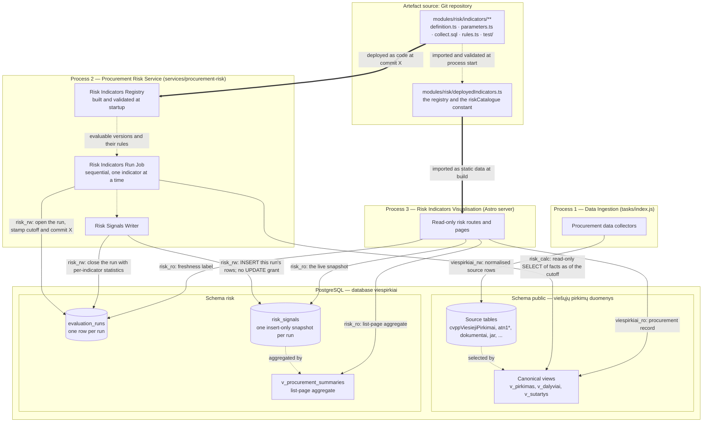
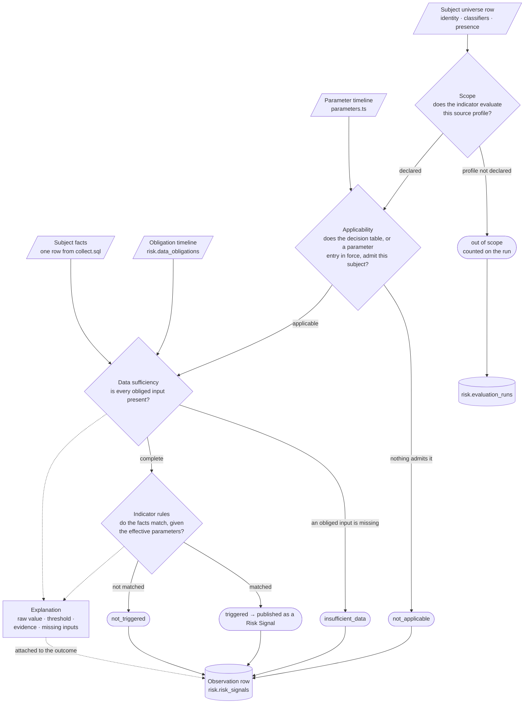
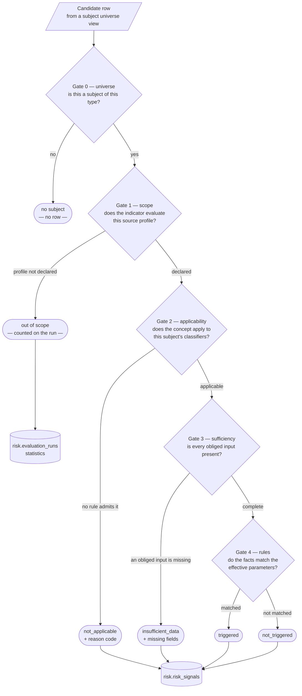
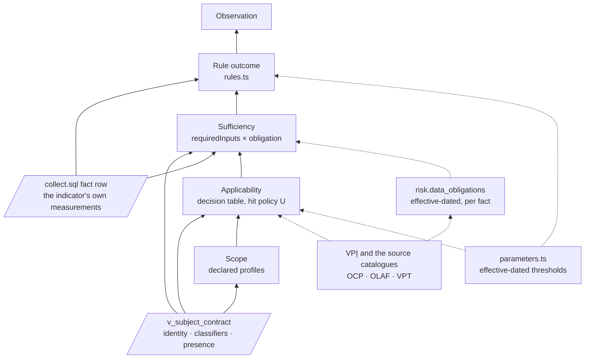
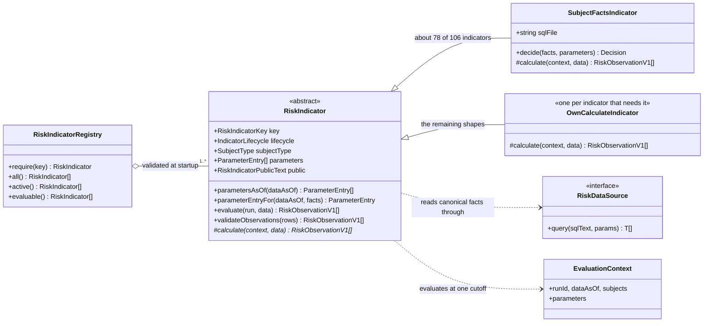
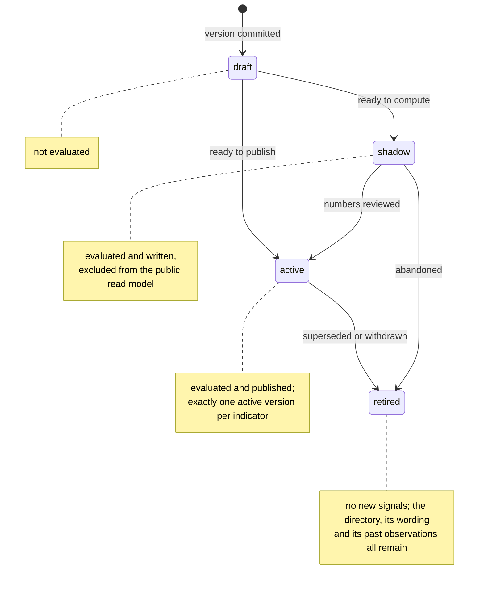

# Procurement Risk Service Architecture

Status: architecture

Core
methodology: [OCP 2024 Red Flags in Public Procurement](https://www.open-contracting.org/wp-content/uploads/2024/12/OCP2024-RedFlagProcurement.pdf)

Indicator catalogue: [Canonical Lithuanian catalogue](indicators-canonical.md)

Database schema: [`risk-schema.md`](risk-schema.md)

Parent design: [Risk signals for current and recently completed procurements](risky-procurements-initial-design.md)

## 1. Overview

The Procurement Risk Service turns the procurement facts viešpirkiai already ingests into **Risk Signals**: named,
versioned, publicly explained reasons to review one procurement. A signal states what was measured, what it was compared
against, which indicator version decided it and what could legitimately explain it — a signal is a reason to look, never
a finding of wrongdoing.

The system is a small business rules system over a procurement database. A **Risk Indicator** is a rule set with
effective-dated parameters and public wording; an **evaluation run** applies every deployed indicator to every
applicable subject at one cutoff and records the outcome; the website publishes the outcomes of the newest completed
run. The whole indicator catalogue lives in the Git repository, and PostgreSQL holds only results and run control state.

The stack is **TypeScript + PostgreSQL**, with no separate analytics, rules or orchestration platform. PostgreSQL
provides durable coordination and set-based computation; TypeScript provides the indicator catalogue, rule evaluation,
validation and operational control.

### 1.1 System context

**Diagram: viešpirkiai and the actors and source systems around it.**


Risk pages never restate the procurement record. They link to the existing procurement page and to the original CVP
IS/CVPP documents, which stay authoritative.

### 1.2 Containers

The system has exactly three processes, each with a single business purpose, its own deployment lifecycle, its own
database role and its own failure mode. **Committed PostgreSQL rows are the only integration between them.**

| # | Process                           | Business purpose                                                                       | Deployed as                                    | Writes                                         | Reads                                                                                |
|---|-----------------------------------|----------------------------------------------------------------------------------------|------------------------------------------------|------------------------------------------------|--------------------------------------------------------------------------------------|
| 1 | **Data Ingestion**                | Fetch, normalise and version public procurement records                                | Existing task runner (`tasks/index.js`)        | `public` schema source tables only             | Public sources: CVP IS, CVPP, TED, JAR, documents                                    |
| 2 | **Risk Indicators Processing**    | Evaluate every applicable Risk Indicator, one at a time, and record the outcomes       | **Procurement Risk Service**, its own process  | `risk.evaluation_runs` and `risk.risk_signals` | `public` canonical views; the deployed Git catalogue                                 |
| 3 | **Risk Indicators Visualisation** | Show a procurement's risk signals, methodology and evaluation coverage to the public   | Existing Astro web application                 | Nothing                                        | `risk` tables and views read-only; the `riskCatalogue` constant; `public` procurement record |

**Diagram: containers, the schemas they use and the role each connection holds.**



Database roles make the separation enforceable rather than conventional
([`migrations/risk/002_roles.sql`](../../migrations/risk/002_roles.sql)):

| Role                         | Used by                                                          | Grants                                                                                                                  |
|------------------------------|------------------------------------------------------------------|-------------------------------------------------------------------------------------------------------------------------|
| `viespirkiai_rw`             | Process 1                                                        | Read/write on `public`                                                                                                  |
| `risk_calc`                  | Process 2, during a calculation                                  | `SELECT` on the `public` canonical views, used inside a read-only transaction with a statement timeout                  |
| `risk_rw`                    | Process 2, for recording results, and the scheduled retention job | `SELECT`, `INSERT`, `UPDATE` on `risk.evaluation_runs`; `SELECT`, `INSERT`, `DELETE` on `risk.risk_signals`, no `UPDATE` |
| `risk_ro` / `viespirkiai_ro` | Process 3                                                        | `SELECT` on the `risk` tables and views and on the `public` canonical views                                             |

`risk_rw` can never alter a written signal in place — there is no `UPDATE` grant on `risk.risk_signals` — but it does
hold `DELETE`, because it is also the role the retention job runs as. Indicator results are derived and recalculable, so
removing a whole superseded snapshot needs no separate credential; immutability of a *written* row is what matters.

Risk evaluation is a separate process rather than a task in `runner/TaskRunner.js`, whose `mode`/`schedule`/`cooldown`
shape would otherwise fit, because four kinds of isolation are load-bearing:

- **Roles.** The grants above are only enforceable if the calculating process connects as `risk_calc`/`risk_rw` and the
  web process as `risk_ro`, each with its own credentials.
- **Blast radius.** A run performs long analytical scans over the whole corpus. Its own process and connection pool keep
  that work away from ingestion, which is the one thing that must keep working.
- **Deployment lifecycle.** Activating an indicator version deploys one commit to the risk service and the web
  application together ([§8.2](#82-adding-a-risk-indicator)), on a schedule independent of ingestion releases.
- **Packaging.** The web bundle imports the indicator definitions and reads the `riskCatalogue` constant. That import
  crosses no process boundary: the definitions are plain TypeScript and Zod, they open no database connection, and
  `collect.sql` is read lazily at calculation time, so nothing in `services/procurement-risk/` reaches the web bundle.

The separation buys four operational properties: a broken ingestion refresh leaves the last computed signals visible,
labelled with their older cutoff; a failing indicator is contained to its own rows; a web deployment cannot mutate risk
results; and rewriting an indicator's rules touches neither ingestion nor web code.

### 1.3 Components of one evaluation

Solid arrows are runtime data flows, labelled with the data crossing the boundary. Dotted arrows are code or
configuration dependencies.

**Diagram: data flow from ingested facts to published risk signals.**

```mermaid
flowchart LR
    subgraph ingestion["Process 1 — Data Ingestion and the state it publishes"]
        S["Procurement data collectors"]
        C[("Canonical procurement facts<br/>schema public")]
        S -->|" normalised procurement records "| C
    end

    subgraph processing["Process 2 — Risk Indicators Processing"]
        M["Git: Risk Indicator definitions,<br/>rules and effective-dated parameters"]
        G["Risk Indicators Registry"]
        K["Risk Indicators Run Job"]
        I["Risk Indicator evaluation<br/>collect facts in SQL, decide in TypeScript"]
        T["Risk Signal Validator"]
        P["Risk Signals Writer"]
        M -.->|" deployed code, loaded and validated at startup "| G
        G -.->|" evaluable versions and their rules "| K
        G -.->|" declares the output contract "| T
    end

    subgraph storage["Schema risk — written only by Process 2"]
        J[("evaluation_runs")]
        H[("risk_signals")]
        R["v_procurement_summaries"]
        H -.->|" aggregated at query time "| R
    end

    subgraph visual["Process 3 — Risk Indicators Visualisation"]
        A["Astro read-only routes"]
        U["Public risk pages and API"]
        A -->|" rendered HTML or JSON response "| U
    end

    K -->|" one open run, stamped with cutoff and commit "| J
    K -->|" cutoff, subject filter and effective parameters "| I
    C -->|" canonical facts as of the cutoff "| I
    I -->|" observation rows "| T
    T -->|" validated rows "| P
    P -->|" append this run's snapshot "| H
    P -->|" per-indicator statistics, terminal state "| J
    H -->|" the live snapshot "| A
    R -->|" list page ordering and counts "| A
    J -->|" freshness label "| A
```



| Component                   | Process | Concrete form                                                          | Responsibility and boundary                                                                                                                                              |
|-----------------------------|---------|------------------------------------------------------------------------|--------------------------------------------------------------------------------------------------------------------------------------------------------------------------|
| Procurement data collectors | 1       | Existing scrapers and importers                                        | Fetch and normalise public source data into `public`. They hold no permission on `risk`.                                                                                 |
| Canonical procurement facts | 1       | Tables and views in `public`                                           | Present procurements, notices, lots, bids, awards, contracts, buyers and suppliers with stable keys and validity semantics. These are the reproducible facts read at the cutoff. |
| Risk Indicators Registry    | 2       | `modules/risk/registry.ts`, built from the deployed code at startup    | Resolves `(indicator id, version)` to one validated Risk Indicator, and answers which versions are active, shadow or retired ([§5.3](#53-the-risk-indicator-class-model)). |
| Risk Indicators Run Job     | 2       | `services/procurement-risk/runJob.ts`                                  | Opens the run, evaluates each registered indicator in turn, records per-indicator statistics, closes the run. Indicator-independent: one failure is recorded and the run continues. |
| Risk Indicator evaluation   | 2       | One indicator directory ([§5.1](#51-the-risk-indicator-directory))     | Collects one subject's facts and decides its outcome at one cutoff, reading canonical facts only through the injected data source.                                        |
| Risk Signal Validator       | 2       | `RiskIndicator.validateObservations` plus the output contract          | Validates field types, allowed states, subject and indicator identity, and duplicate subject keys, before any row reaches the writer. SQL safety comes from the read-only role, transaction and statement timeout. |
| Risk Signals Writer         | 2       | `services/procurement-risk/write.ts`                                   | Appends validated rows to the open run's snapshot with one indicator-independent `INSERT`, inside the caller's transaction. It compares nothing and updates nothing.      |
| Evaluation run              | 2       | `risk.evaluation_runs`                                                 | One durable row per run: cutoff, code commit, terminal state, per-indicator statistics. It answers whether the job ran and whether it succeeded.                          |
| Risk signals                | 2 → 3   | `risk.risk_signals`                                                    | One immutable snapshot per run: outcome, evidence, indicator version, applied parameters and cutoff.                                                                      |
| Procurement summary         | 2 → 3   | `risk.v_procurement_summaries`                                         | Aggregates the live snapshot per procurement for list-page counts, ordering and filters.                                                                                  |
| Astro read-only routes      | 3       | Existing web application on a read-only role                           | Query the live snapshot, the summary view and the run row; read all indicator wording from the `riskCatalogue` constant.                                                  |

A cron schedule guarantees that a run eventually starts. A PostgreSQL `NOTIFY` from ingestion is an optional wake-up
hint that shortens the delay between a source refresh and the next run.

### 1.4 Where the state lives

Risk state lives in four places, and only one of them is outside PostgreSQL.

| Area            | Where                              | Contents                                                                                              | Written by                     | Retention                                                                |
|-----------------|------------------------------------|-------------------------------------------------------------------------------------------------------|--------------------------------|--------------------------------------------------------------------------|
| **Definitions** | Git — `modules/risk/indicators/**` | Identity, versions, lifecycle, public wording, scope, applicability, effective-dated parameters, rules, tests | A reviewed, merged pull request | Forever, as repository history                                    |
| **Obligations** | `risk.data_obligations`            | When Lithuanian law requires a fact to exist, effective-dated, with its legal basis                   | A reviewed migration            | Forever; append-only, entries are closed rather than rewritten           |
| **Runs**        | `risk.evaluation_runs`             | One row per run: cutoff, code commit, state, per-indicator and per-gate statistics                    | Process 2                      | Forever; ~365 rows a year                                                |
| **Signals**     | `risk.risk_signals`                | One insert-only snapshot per run: every in-scope `(subject, indicator)` outcome with its evidence and parameters | Process 2            | Snapshots older than the window are deleted, except the live one         |

The flow is one-way — **definitions + obligations + facts → outcomes** — and it is what makes a stored row
self-sufficient. Because definitions live outside the database, each row carries the indicator id, the implementation
version, the exact parameter values applied, the run that produced it (and therefore the code commit) and the structured
evidence. That row stays explainable years later, and it stores no display text, so correcting Lithuanian wording is a
commit rather than a rewrite of history.

Obligations are the one thing that lives in PostgreSQL rather than in Git, and the reason is that they are read
set-wise: deciding whether 466,358 contracts were obliged to carry a procurement number is a join, not a lookup, and it
is the same join for every indicator that needs the answer. They keep the Git-resident discipline anyway — a reviewed
migration, append-only, entries closed rather than rewritten — so `git log` still answers who changed an obligation and
why ([§3.5](#35-expected-absence-and-unexpected-absence)).

## 2. Domain language

### 2.1 Terms

The service uses business rules vocabulary, and each term maps to exactly one artefact:

| Term                     | Meaning                                                                                                                                   | Lives in                                                       |
|--------------------------|---------------------------------------------------------------------------------------------------------------------------------------------|----------------------------------------------------------------|
| **Risk Indicator**       | One versioned policy concept: what it means, whom it applies to, the rules that decide it, its parameter timeline, its public explanation and its tests | One directory in Git                                            |
| **Rule**                 | A condition over one subject's collected facts and the parameters in force for it                                                          | `rules.ts` in the indicator directory                          |
| **Parameter**            | A reviewed value a rule compares against, effective-dated and scoped                                                                       | `parameters.ts` in the indicator directory                     |
| **Decision**             | What evaluating one indicator against one subject yields: the outcome state plus the values that explain it                                | Returned by `rules.ts`, assembled into an observation          |
| **Outcome state**        | `triggered`, `not_triggered`, `insufficient_data` or `not_applicable`                                                                      | `state` on every stored row                                    |
| **Risk Signal**          | The public result of a `triggered` outcome: a reason to review this procurement                                                            | What `/rizikos` publishes                                      |
| **Observation**          | The stored row recording one decision — every outcome state, not only triggered ones                                                       | `risk.risk_signals`                                            |
| **Evaluation run**       | One pass of every evaluable indicator over every applicable subject at one cutoff                                                           | `risk.evaluation_runs` plus one snapshot of observations       |
| **Indicator catalogue**  | The set of deployed indicator versions                                                                                                     | `modules/risk/indicators/`, published as the `riskCatalogue` constant |

Storing every outcome, not only the matches, is what lets a page distinguish "checked, nothing found" from "not
evaluated" from "the calculation failed". The service records a fifth state, `calculation_error`, on an indicator's
behalf; it is not a decision, it is the absence of one.

Each indicator carries a canonical Lithuanian catalogue id of the form `LT-<AREA>-<NN>`
([canonical catalogue](indicators-canonical.md)), and records the source codes its concept derives from — `OCP-R003`,
`OLAF-CN29`, `VPT-I01` — as references. An OCP-derived indicator therefore stays traceable to OCP while remaining a
viešpirkiai indicator with its own version, wording and thresholds.

### 2.2 Identifiers are English, labels are Lithuanian

**Every identifier in the Procurement Risk Service is English** — schema, tables, columns, TypeScript fields, SQL
aliases, roles, module paths and enum values. The concepts already have settled names in international and EU
procurement-fraud terminology, and the service should use them. Lithuanian survives as **label values** the GUI renders
(`titleLt`, `descriptionLt`, `limitationLt`, `formulaLt`), which live in the indicator catalogue in Git.

The rest of the repository follows the opposite convention, so the boundary is worth stating exactly: the `public`
schema belongs to Data Ingestion and keeps its Lithuanian domain names (`pirkimas`, `tiekejas`, `sutartis`, `jarKodas`).
A collection statement crosses the boundary in exactly one place, and the rule is positional: **Lithuanian on the left
of an `AS`, English on the right**. Everything downstream of that statement is English, because it is already inside the
risk service.

### 2.3 The decision model of one indicator

Evaluating one indicator against one subject is a chain of decisions, not a single rule test. Four decisions run before
the indicator's own rules, and each has its own disposition, which is why an absent signal is readable.

**Diagram: the decisions that produce one observation.**



Ownership of each decision is deliberate. **Scope, applicability and sufficiency are decided by shared code**, from
declarations the indicator makes and reviewed artefacts it does not own, so an indicator cannot publish a `triggered`
signal that no reviewed threshold stands behind, and cannot report a data gap about a fact its subject was never obliged
to have — the code paths that would do so do not exist. **The rules and the explanation are the indicator's own**, and
live in its `rules.ts` because they are the part a reviewer actually reads. **Identity, subject, applied parameters and
the cutoff are shared too**, stamped onto the observation by the machinery, so no indicator can get them wrong.

[§3](#3-evaluation-scope-and-applicability) specifies the four gates before the rules, and why the difference between
them is the difference between an honest absence and a fabricated one.

## 3. Evaluation scope and applicability

An indicator is a statement about a kind of subject, and the corpus contains many subjects that kind does not cover. A
rule about how a competitive procedure was run has nothing to say about a verbal low-value purchase that never had a
procedure; a rule that reads the procurement method has nothing to say about a notice ingested from a source that does
not carry the method at all. Both cases end with no signal, and the reason they end there is different, and the
difference is the whole of this section.

Left to each indicator, that reasoning is written 106 times, inconsistently, inside `rules.ts`, where a reviewer meets
it as a chain of null checks rather than as a policy. This section makes it shared, declarative and measurable:
**an indicator declares the population it speaks about and the facts it needs, and the machinery decides the rest.**

### 3.1 The measurement that forces the design

Live database snapshot: **2026-08-18, `viespirkiai` on `10.1.10.2:9118`.** The counts below are `count(*)`, not planner
estimates.

`v_pirkimas` is a `UNION ALL` of two sources with radically different column coverage. Every column below is counted
non-null:

| Profile               |     Rows | `pirkimoBudas` | `statusas` | `numatomaVerteEUR` | `pasiulymuPateikimoTerminas` | `bvpzKodai` | `esFinansavimas` |
|-----------------------|---------:|---------------:|-----------:|-------------------:|-----------------------------:|------------:|-----------------:|
| `cvpis` (primary)     |   50,893 |           100% |       100% |              33.8% |                        98.4% |       99.9% |            76.6% |
| `cvpp` (fallback)     |  213,522 |             0% |         0% |                 0% |                       100.0% |          0% |               0% |

A `cvpp` procurement carries a title, a buyer, a publication date and a submission deadline. It carries **no method, no
status, no estimated value, no CPV and no funding flag, and it never will** — the fallback branch of `v_pirkimas.sql`
selects those columns as literal `NULL`. Of the 28 procurement-grain canonical indicators, the ones that read a method,
a value, an object type or a CPV code therefore have a real population of **50,893**, not 264,415 — and, where the
estimated value is required, of **17,200**.

The contract side is the case that prompted this section. Non-deleted contracts by type, with how their
`pirkimoNumeris` resolves:

| Type                     |      Rows | Number required?   |  Resolves to `cvpis` | Resolves to `cvpp` only | Present but unresolvable |      NULL |
|--------------------------|----------:|--------------------|---------------------:|------------------------:|-------------------------:|----------:|
| `PPS`                    |   309,116 | **yes**            |                6,434 |                 129,041 |                   37,156 |   136,485 |
| `TSP`                    |   157,242 | **yes**            |               21,933 |                  74,148 |                   11,471 |    49,690 |
| `SP` (amendment)         |   130,009 | inherited          |                    — |                       — |                        — |    65,760 |
| `MVPŽ`, `MVP`, `ŽS`, `SPŽ`, `Ilgalaikė MVPŽ`, `VS`, `PSĮ`, unset | 5,309,875 | **no — exempt or optional** | — | — | — | 4,971,171 |
| **Total non-deleted**    | 5,906,242 |                    |                      |                         |                          |           |

Read the two rows that matter together. Only **28,367 of 5,906,242 contracts (0.48%)** are both legally obliged to carry
a procurement number and actually resolve to a `cvpis` notice — the only notice source that carries the procedure facts
a contract-versus-procedure rule needs. A further **234,802** are obliged to carry one and do not: 186,175 with no value
at all and 48,627 with a value that resolves to nothing. And **5,309,875** are either exempt from CVP IS or use it only
at the buyer's option, so their missing number is not a gap at all.

Those three groups must not receive the same answer, and today they would:

- the 5,309,875 exempt-or-optional contracts are **not subjects of this indicator** — saying "insufficient data" about
  them asserts a gap that does not exist and buries the real one under a hundredfold larger number;
- the 234,802 obliged-but-absent contracts are **exactly the finding** — this is Problem 3 of
  [`domain-model.md`](domain-model.md), and the risk service is the natural place for it to become visible;
- the 28,367 linked contracts are the only ones a rule can actually decide.

**The same absent value means three different things depending on facts the indicator itself does not carry.** That is
why applicability cannot live in `rules.ts`.

### 3.2 The five dispositions of a subject

Evaluating one indicator against one candidate row now resolves to one of five dispositions. Three of them produce a
stored observation; two of them are population statements recorded once per run.

| Disposition           | Stored?                    | Means                                                                                       | Carries                        |
|-----------------------|----------------------------|---------------------------------------------------------------------------------------------|--------------------------------|
| **out of universe**   | no                         | The row is not a subject of this type at all — a deleted contract, a non-notice CVPP record | nothing                        |
| **out of scope**      | no; counted on the run     | The source profile this row belongs to can never carry the facts the indicator needs         | a per-run count and reason     |
| **`not_applicable`**  | yes                        | In scope, but the indicator's concept does not apply to this subject                          | a reason code                  |
| **`insufficient_data`** | yes                      | Applies, and a fact this subject was obliged to have is missing                              | the missing fields and why     |
| **`triggered` / `not_triggered`** | yes            | Decided                                                                                       | raw value, threshold, evidence |

The line between the two silent dispositions and `not_applicable` is the one worth stating precisely, because it is
what keeps the snapshot from being dominated by rows that say nothing:

> **Scope removes a population. Applicability judges an individual.**

Scope is decided from the profile a row belongs to and is the same answer for every row in that profile, so enumerating
it 5.3 million times per indicator per run stores no information a single sentence on the methodology page does not
already carry. Applicability is decided from this subject's own classifier values, differs row by row, and is something
a reader of one procurement page legitimately wants to see: *this indicator was considered here and does not apply,
because…*

**Diagram: the gates one candidate row passes, and where each disposition leaves it.**



The gates fall either side of the fetch, and that is what decides where each one runs. **Gates 0 and 1 run in SQL**,
because they decide which rows are read at all — the universe view is the statement's `FROM` and the declared profiles
are bound as `$3`, so a subject with no observation is never fetched. **Gates 2, 3 and 4 run in TypeScript**, over rows
that were fetched, because each of them produces a stored row. The rule is therefore simple to hold: *if it stores
nothing, it happens in SQL; if it stores a row, it happens in TypeScript.* That extends the split
[§5.1](#51-the-risk-indicator-directory) already draws between `collect.sql` and `rules.ts` one step earlier — SQL
narrows the population, TypeScript judges the individual.

### 3.3 Gate 0 — the subject universe

Each of the nine catalogue subject types gets **one view that enumerates its subjects**, and every collection statement
reads from that view instead of re-deriving the population. This is the single change that answers "which entities does
this indicator run on", because after it there is exactly one definition per subject type rather than one per indicator.

| Subject type                  | Universe view                  | Derived from                                                     | Measured rows                                     |
|-------------------------------|--------------------------------|------------------------------------------------------------------|---------------------------------------------------|
| `procurement`                 | `v_subject_procurement`        | `v_pirkimas`                                                     | 264,415                                           |
| `lot`                         | `v_subject_lot`                | `v_pirkimo_dalis`                                                | 13,396 — see [§3.11](#311-known-defects-this-section-depends-on) (fixed) |
| `bid`                         | `v_subject_bid`                | `v_dalyviai`                                                     | 36,793                                            |
| `contract`                    | `v_subject_contract`           | `v_sutartys` where `istrinta = false`                            | 5,906,242                                         |
| `supplier`                    | `v_subject_supplier`           | `v_company` restricted to codes appearing as a supplier          | to be measured                                    |
| `buyer`                       | `v_subject_buyer`              | `v_company` restricted to codes appearing as a buyer             | to be measured                                    |
| `buyer_supplier_relationship` | `v_subject_buyer_supplier`     | `v_sutartys` grouped by (buyer, supplier)                        | **view does not exist**                           |
| `bidder_relationship`         | `v_subject_bidder_pair`        | `v_dalyviai` self-joined within a lot, order-independent pairs    | **view does not exist**                           |
| `market`                      | `v_subject_market`             | CPV codes from `v_pirkimas.bvpzKodai` / `v_sutartys.bvpzKodai`   | **view does not exist**                           |

Three of the nine subject types the catalogue already assigns indicators to have no canonical view behind them at all,
and a fourth — `lot` — has one that cannot currently be created. That is the concrete form of "the domain model does not
cover all the data" on the subject axis: the 12 bidder-relationship, 5 buyer–supplier and 3 market indicators cannot be
scoped, let alone evaluated, and the 17 lot indicators are blocked behind a repair. **37 of the 106 canonical
indicators — 35% — have no subject to run on today**, and no amount of indicator authoring changes that.

Every `v_subject_*` view exposes the same three column groups, and nothing else:

| Group           | Columns                                                                                                                                 | Purpose                                                              |
|-----------------|-----------------------------------------------------------------------------------------------------------------------------------------|----------------------------------------------------------------------|
| **Identity**    | `subject_type`, `subject_key`, `procurement_source`, `procurement_id`                                                                   | Stamped onto the observation; `subject_key` is the durable composite  |
| **Classifiers** | `source_profile`, `procedure_type`, `contract_type`, `object_type`, `stage`, `event_date`, `value_eur`, `eu_funded`, `cpv_division`      | The only facts gates 1 and 2 may test                                |
| **Presence**    | `has_bids`, `has_lots`, `has_price`, `has_estimate`, `has_deadline`, `has_documents`, `has_linked_procurement`, `has_linked_plan`         | Whether the row carries a fact class, as a named fact rather than a null check |

The presence group is the direct answer to *"indicators are not able to simply understand that it is applicable to
certain data elements."* Today every indicator rediscovers that with its own `IS NOT NULL` predicates, phrased
slightly differently, and a reviewer cannot tell whether an omission was deliberate. Named on the universe view, the
same question is asked once, tested once, and reads the same way in every indicator.

**Classifiers are a closed vocabulary.** Gates 1 and 2 may test nothing else. That restriction is what keeps
applicability reviewable as a table: if an exclusion needs a fact outside this list, it is not applicability, it is a
rule, and it belongs in `rules.ts` where it will be explained to the public.

### 3.4 Gate 1 — scope is a property of the source profile

A **source profile** is a named, stable statement about *which fact classes a row can carry*, decided by which pipeline
produced it. It is not a data-quality score and not a per-row null pattern: a `cvpp` procurement lacks the method
because the fallback branch selects `NULL`, for every row, forever.

The profiles the measurement in [§3.1](#31-the-measurement-that-forces-the-design) establishes:

| Subject type  | `source_profile`             | Definition                                                              | Rows      | Carries                                            |
|---------------|------------------------------|--------------------------------------------------------------------------|----------:|----------------------------------------------------|
| `procurement` | `cvpis`                      | Row from `viesiejiPirkimai`                                             |    50,893 | Method, status, object type, CPV, funding, deadline |
| `procurement` | `cvpp`                       | Fallback row from `cvppViesiejiPirkimai`                                |   213,522 | Title, buyer, publication date, deadline — nothing else |
| `contract`    | `procedure_linked_cvpis`     | `TSP`/`PPS` whose number resolves to a `cvpis` notice                   |    28,367 | The contract, and its full procedure context       |
| `contract`    | `procedure_linked_cvpp`      | `TSP`/`PPS` whose number resolves only to a `cvpp` notice               |   203,189 | The contract, and a notice with no procedure facts |
| `contract`    | `procedure_expected_missing` | `TSP`/`PPS` with a number that is absent or resolves to nothing         |   234,802 | The contract only — **and this is a finding**      |
| `contract`    | `procedure_exempt`           | Types exempt from CVP IS or using it at the buyer's option, plus unset  | 5,309,875 | The contract only, legitimately                    |
| `contract`    | `amendment`                  | `SP` — disposition inherited from the amended contract                  |   130,009 | The amendment; context via its parent              |

An indicator declares the profiles it evaluates. Everything else is scoped out, silently but not invisibly: the count
and the reason land in the run's `statistics`, and the methodology page publishes them
([§3.9](#39-coverage-is-a-published-number)).

A worked example, for a contract indicator that compares the final contract value against the procedure's estimate:

| Profile                      |      Rows | Disposition                                                             |
|------------------------------|----------:|--------------------------------------------------------------------------|
| `procedure_exempt`           | 5,309,875 | **out of scope** — no CVP IS procedure exists to compare against        |
| `procedure_linked_cvpp`      |   203,189 | **out of scope** — the linked notice carries no estimated value, ever   |
| `procedure_expected_missing` |   234,802 | in scope → `insufficient_data`, missing `procurementId`                 |
| `procedure_linked_cvpis`     |    28,367 | in scope → decided, or `insufficient_data` where the estimate is absent |
| `amendment`                  |   130,009 | in scope → inherits the parent contract's disposition                   |

The snapshot for that indicator falls from 5.9 million rows to roughly 263,000 with a further 130,000 inherited, and —
the point of the exercise — **the 234,802 rows that remain are the ones a reader should see.** Scope is not an
optimisation that hides work; it is what makes the residue legible.

**Not every indicator shrinks.** A rule that reads only the contract row — a long framework duration, a high final
value — is in scope for the whole non-deleted population, and its snapshot stays in the millions. Scope is a per-indicator
measurement, not a blanket reduction, which is why [§7.2](#72-one-insert-only-snapshot-per-run)'s sizing estimate must
be recomputed per indicator from its declared profiles rather than from the subject count.

### 3.5 Expected absence and unexpected absence

Gates 2 and 3 both fire on a missing value, and the rule that tells them apart is one sentence:

> **Expected absence is `not_applicable`. Unexpected absence is `insufficient_data`.**
> An indicator may report `insufficient_data` only about a fact this subject was **obliged** to have.

"Obliged" is a legal fact about Lithuanian procurement, not a property of the pipeline, so it belongs in a reviewed
artefact rather than in an indicator author's judgement. `risk.data_obligations` is that artefact: a small,
effective-dated table seeded by migration, one row per rule.

| Column                | Meaning                                                                              |
|-----------------------|----------------------------------------------------------------------------------------|
| `subject_type`        | `procurement`, `contract`, `lot`, …                                                  |
| `fact`                | The canonical fact name, matching a `requiredInputs` entry                           |
| `classifier`          | Which classifier column the rule keys on — `contract_type`, `procedure_type`, …       |
| `classifier_value`    | The value it applies to                                                              |
| `valid_from`/`valid_to` | The period the obligation was in force; law changes, and old subjects keep old rules |
| `obligation`          | `mandatory` \| `conditional` \| `optional` \| `exempt` \| `inherited`                  |
| `legal_basis`         | The VPĮ article or source document the row is justified by                            |
| `note`                | Free text for the reviewer                                                            |

Seeded from the analysis already written up in [`domain-model.md`](domain-model.md), the procurement-number rules read:

| `subject_type` | `fact`          | `classifier`    | `classifier_value`                                     | `obligation` | Consequence when absent |
|----------------|-----------------|-----------------|--------------------------------------------------------|--------------|--------------------------|
| `contract`     | `procurementId` | `contract_type` | `TSP`, `PPS`                                           | `mandatory`  | `insufficient_data`      |
| `contract`     | `procurementId` | `contract_type` | `SP`                                                   | `inherited`  | resolve the parent first |
| `contract`     | `procurementId` | `contract_type` | `MVP`                                                  | `optional`   | `not_applicable`         |
| `contract`     | `procurementId` | `contract_type` | `MVPŽ`, `Ilgalaikė MVPŽ`, `SPŽ`, `ŽS`, `VS`, `PSĮ`     | `exempt`     | `not_applicable`         |

The table has a second, quieter use: it is the definition against which "how bad is the gap?" is measured. `TSP` and
`PPS` are 31.6% and 44.2% missing against an obligation of `mandatory`; `MVPŽ` is 95.3% missing against `exempt`. Only
the first pair is a defect, and only a stored obligation makes that statement checkable rather than editorial.

One boundary is worth naming, because it is tempting to get wrong. **A fact our pipeline has not ingested, but which
exists in the source system, is `insufficient_data`, not `not_applicable`.** The state means "we cannot tell", and we
cannot. `not_applicable` is reserved for absences the world itself contains. Where an entire profile is affected —
`cvpp` and the procurement method — the honest treatment is neither state but scope: we do not evaluate that population
and we say so once.

### 3.6 Gate 2 — applicability as a decision table

Applicability is expressed as a **decision table over classifier columns**, in `definition.ts`, evaluated by shared
code. It is not a predicate function, and that is deliberate: a table can be diffed, reviewed, checked for overlap and
rendered on the methodology page, and a function cannot.

```ts
applicability: {
  dimensions: ['contractType'],
  hitPolicy: 'unique',
  rules: [
    { contractType: ['TSP', 'PPS'],                      outcome: 'applicable' },
    { contractType: ['SP'],                              outcome: 'inherit', from: 'parentContract' },
    { contractType: ['MVP'],                             outcome: 'not_applicable',
      reason: 'cvpis_use_optional' },
    { contractType: ['MVPŽ', 'Ilgalaikė MVPŽ', 'SPŽ', 'ŽS', 'VS', 'PSĮ', null],
      outcome: 'not_applicable', reason: 'out_of_legal_regime' },
  ],
},
```

`hitPolicy: 'unique'` is the DMN term for *at most one rule may match*, and it is checkable at startup by exactly the
machinery [§5.5](#55-parameters-and-their-resolution) already runs over concurrently valid parameter scopes: the
dimensions are finite, so overlap and incompleteness are both decidable before a run starts. A table that leaves a
classifier value uncovered fails at startup rather than defaulting silently, because a silent default is how an
indicator quietly stops evaluating half its population.

`not_applicable` carries a **reason code from a closed vocabulary**, so the detail page can explain the absence and the
methodology page can count it:

| Reason code                | Means                                                                        |
|----------------------------|--------------------------------------------------------------------------------|
| `out_of_legal_regime`      | The legal regime this subject falls under contains no such obligation or event |
| `cvpis_use_optional`       | The system this indicator reads is optional for this subject                   |
| `procedure_type_excluded`  | The rule is defined for other procedure types                                  |
| `stage_not_reached`        | The subject has not reached the lifecycle stage the rule judges                |
| `subject_shape`            | The subject lacks the structure the rule needs — a cross-lot rule on one lot   |
| `no_parameter_entry`       | No reviewed parameter entry is in force for this subject at the cutoff         |
| `inherited_not_applicable` | Inherited from a parent subject that is itself not applicable                  |

Two of those deserve a note. `no_parameter_entry` is the applicability rule the architecture already had
([§2.3](#23-the-decision-model-of-one-indicator)) — it survives unchanged, now as one reason among several rather than
the only one. And `stage_not_reached` is genuinely temporary: the subject will become applicable in a later run. That is
consistent rather than misleading only because every run re-decides every subject from scratch
([§7.2](#72-one-insert-only-snapshot-per-run)); a current-state model would have had to age the row out.

**Inheritance is one hop and it is not recursive.** An `SP` amendment resolves its parent contract, takes the parent's
disposition, and stops. If the parent cannot be resolved the amendment is `insufficient_data` with the missing parent
recorded — not `not_applicable`, because the parent's existence is not in doubt, only our link to it.

### 3.7 Gate 3 — sufficiency

Only after a subject is in scope and applicable does the question "do we have the inputs?" become meaningful.
`requiredInputs` grows from a flat list of field names into the pairing that makes the answer mechanical:

```ts
requiredInputs: [
  { field: 'procurementId', obligation: 'contract.procurementId' },
  { field: 'estimatedValueEur', obligation: 'procurement.numatomaVerteEUR' },
  { field: 'finalValueEur',    obligation: 'contract.faktineIvykdimoVerte' },
],
```

Each entry names the `risk.data_obligations` rule that justifies calling its absence a gap. Shared code resolves the
obligation for this subject's classifiers at the cutoff and applies one rule:

| Obligation at this subject | Field present | Field absent                                    |
|----------------------------|---------------|--------------------------------------------------|
| `mandatory`                | continue      | `insufficient_data`, field listed in `missing_data` |
| `conditional`              | continue      | `insufficient_data` if the condition holds, else `not_applicable` |
| `optional`                 | continue      | `not_applicable`, reason `cvpis_use_optional`   |
| `exempt`                   | continue      | `not_applicable`, reason `out_of_legal_regime`  |
| `inherited`                | continue      | resolve the parent, then re-apply this table    |

`missing_data` entries carry the field, the obligation that made it required and the legal basis, so
*"Nepakanka duomenų"* on the detail page can say which fact is missing and why its absence is a defect rather than a
normal state. That is a materially stronger public statement than a bare field name, and it costs nothing at render time
because the obligation was already resolved to decide the row.

### 3.8 What this changes in the indicator package

The package of [§5.1](#51-the-risk-indicator-directory) keeps its shape. Four things move, and one thing becomes
impossible.

| Change                                    | Before                                                | After                                                                    |
|-------------------------------------------|-------------------------------------------------------|---------------------------------------------------------------------------|
| Population definition                     | Each `collect.sql` wrote its own `FROM` and `WHERE`   | `FROM public.v_subject_<type>`, one definition per subject type          |
| Scope                                     | Implicit in that `WHERE`, invisible to review          | `scope.profiles` in `definition.ts`, bound as `$3`, counted on the run   |
| Applicability                             | Null checks in `rules.ts`, or the parameter timeline   | A decision table in `definition.ts`; the parameter timeline is one rule in it |
| Sufficiency                               | Ad-hoc null checks returning `insufficient_data`       | `requiredInputs` paired with `risk.data_obligations`                     |
| **`rules.ts` returning `not_applicable`** | Possible                                               | **Removed from the `Decision` type it may return**                       |

That last row is the enforceable form of the whole section. A `rules.ts` reached at gate 4 has already been told the
subject is in scope, applicable and sufficiently supplied; the only outcomes left to it are `triggered` and
`not_triggered`, and the type system says so. An indicator author cannot accidentally answer an applicability question
with a data-quality state, because there is no return value for it.

Collection statements now take three arguments rather than two, and the distinction between them and a parameter is
worth stating exactly, since [§5.6](#56-where-each-kind-of-logic-belongs) forbids binding parameters into SQL:

| Argument | Carries                                            | Category                       |
|----------|----------------------------------------------------|--------------------------------|
| `$1`     | The run cutoff                                     | *When* the facts are read      |
| `$2`     | An explicit subject filter, or `NULL`              | *Whom* to evaluate             |
| `$3`     | The declared `source_profile` array                | *Whom* to evaluate             |
| —        | Thresholds                                         | **Never** — resolved in TypeScript |

All three answer *which facts, about whom, as of when*. None of them answers *is that bad*. The prohibition is on
policy reaching SQL, and a population declaration is not policy.

**Diagram: the decision requirements of one indicator, in DMN terms.** Rectangles are decisions, parallelograms are
input data, and the dashed shapes are the reviewed knowledge the decisions are justified by.



The diagram is worth drawing because it makes one property visible: **no decision reads an input or a knowledge source
belonging to a later gate.** Scope reads only the universe row; applicability never reads a measurement; sufficiency
never reads a threshold. That layering is what allows each gate to be tested on its own, and it is why gate ordering can
be asserted as a test rather than left to review ([§9](#9-tests-and-automated-safeguards)).

### 3.9 Coverage is a published number

An indicator that silently evaluates 0.5% of its subject type is worse than one that does not run, because the page
looks the same. Every gate therefore reports a count, and the run row carries them:

```
statistics[indicator] = {
  universe,                                   // rows in the subject universe view
  scoped_out:        { <profile>: n, ... },   // gate 1
  in_scope,
  not_applicable:    { <reason>: n, ... },    // gate 2
  insufficient_data: { <field>: n, ... },     // gate 3
  not_triggered, triggered,                   // gate 4
  calculation_error,
  duration_ms, error
}
```

Those counts satisfy one arithmetic identity on a full run — one where `$2` is `NULL`, so the universe is not narrowed
by a backfill filter — and it is a test:

```
universe = Σ scoped_out
         + Σ not_applicable
         + Σ insufficient_data
         + not_triggered + triggered + calculation_error
```

A gate that loses rows fails that identity, which is the cheapest possible detector for the failure mode this section
exists to prevent — a population quietly falling out of evaluation. The methodology page
([§4.3](#43-methodology-catalogue)) publishes the same numbers per indicator as a coverage table: the population, what
was excluded and why, and the share of the population that was actually decidable. Publishing "we can decide this for
0.5% of contracts, and here is which 0.5%" is a stronger transparency claim than any signal count, and it is the claim
the measurement in [§3.1](#31-the-measurement-that-forces-the-design) obliges the service to make.

### 3.10 Practices this borrows, and what it leaves out

The model is assembled from established business-rules and data-validation practice rather than invented, and the
borrowings are deliberate and partial.

| Practice                                                                 | Taken                                                                                                            | Left out                                                                                        |
|--------------------------------------------------------------------------|------------------------------------------------------------------------------------------------------------------|--------------------------------------------------------------------------------------------------|
| **DMN** — decision tables, hit policies, decision requirements diagrams | Applicability as a table with hit policy `unique`; the DRD as the diagram of an indicator's data requirements    | FEEL, the XML interchange format, and any DMN engine — the tables are TypeScript literals        |
| **The Decision Model** (von Halle & Goldberg) — rule families, inferential integrity | Gate ordering: no rule fires until the facts it depends on are established                              | The full rule-family normalisation discipline                                                     |
| **Business Rules Manifesto / RuleSpeak**                                 | Rules are declarative, separate from process, and expressed over a named fact model — hence the closed classifier vocabulary | Natural-language rule authoring                                                          |
| **ARACHNE** and EU fund risk scoring                                     | Entities with insufficient data are reported as unscored, never as low-risk                                       | Composite scoring — this service publishes countable signals, not an index                        |
| **DIGIWHIST / OpenTender**                                               | Per-indicator calculability and published coverage rates                                                          | Aggregating a composite index over whichever indicators happened to be calculable                 |
| **OCP Red Flags guide**                                                  | Required data and procurement stage as first-class indicator metadata                                             | Its thresholds, which are not calibrated on Lithuanian data                                       |
| **ESS/Eurostat validation-rule typology**                                | Every rule carries an explicit domain of applicability, and "not evaluated" is distinct from "passed"             | The severity taxonomy — severity here is a catalogue constant                                     |
| **Credit-risk population scoping**                                       | Scope-in/scope-out is decided before scoring and recorded as a population statement                               | Reject inference — a scoped-out subject gets no imputed outcome                                   |

Two things are deliberately **not** adopted. There is **no rules engine**: a rules engine earns its keep when
non-developers author rules at runtime, and here every rule is a reviewed commit that must ship with tests, so an engine
would add a second place for logic to live and a second thing to version. And there is **no composite risk score**:
scoring across indicators of wildly different coverage is exactly the error the coverage table exists to prevent — an
entity with three signals out of ninety evaluated indicators is not comparable to one with three out of six, and no
weighting recovers that.

### 3.11 Known defects this section depends on

This model is specified against the canonical views as they should be. Four gaps stood between it and a run, found by
querying the live database on 2026-08-18. They were data-layer work, not risk-service work, but the risk service could
not be built past the design stage without them.

| # | Defect                                                                                                                                                                      | Effect                                                            | Status |
|---|-----------------------------------------------------------------------------------------------------------------------------------------------------------------------------|---------------------------------------------------------------------|--------|
| 1 | `v_pirkimo_dalis.sql` read `atn1ataskaitos` and `atn1pirkimoDalys`. Those tables no longer exist — the family was replaced by `xlsxPPA*`, which is what `v_dalyviai` already reads. | The view could not be created; the whole `lot` subject type was blocked, and with it 17 canonical indicators | **Fixed** — now reads `xlsxPPAataskaitos`/`xlsxPPApirkimoDalys`, same value-match pattern as `v_dalyviai` |
| 2 | `v_pirkimo_dalis.sql` cast `pirkimoNumeris::integer` to compare against `viesiejiPirkimai.pirkimoId`. Real values exceed `int4` — `3782102904` is in the data today.        | The view errored at query time on the real corpus, not just returned wrong rows | **Fixed** — compares as text (`vp."pirkimoId"::text = d."pirkimoNumeris"`), matching `v_pirkimas.sql`'s own pattern |
| 3 | The deployed `v_pirkimas` exposed the key as `pirkimoId`; the repository file already renamed it to `pirkimoNumeris`.                                                        | Every join documented as `p."pirkimoNumeris" = d."pirkimoNumeris"` failed against the database as it stood | **Not a separate defect** — `ensureAnalystViews` (`ensureViews.ts`) issues `CREATE OR REPLACE VIEW` for every view on every process start, using the app's own DB role, which owns these views. Defect 1 made that call throw on `v_pirkimo_dalis` before it ever completed a pass, and the memoized promise stayed rejected, so `v_pirkimas` was never actually redeployed with the current repo definition. Fixing defect 1 removes that block; the next process start redeploys `v_pirkimas` (and every other view) with `pirkimoNumeris`, no code change needed here |
| 4 | `v_company` decided `melagingisTiekejas` and `nepatikimasTiekejas` with `CURRENT_DATE`.                                                                                      | Violated the cutoff rule of [§6](#6-evaluation-run): the same run at the same `data_as_of` gave different answers on different days | **Fixed** — replaced by `melagingisTiekejasNuo`/`melagingisTiekejasIki` and `nepatikimasTiekejasNuo`/`nepatikimasTiekejasIki`, each the most-current entry's validity interval (open-ended when `*Iki IS NULL`); an indicator compares these to `$1` itself instead of the view deciding against the wall clock |

### 3.12 Domain-model coverage this section assumes

The missing subject views of [§3.3](#33-gate-0--the-subject-universe) are the gap on the *subject* axis. This is the gap
on the *fact* axis: the seven canonical views cover a fraction of the ingested corpus, and the uncovered part is not
incidental — it is where several catalogue areas get their facts. Verified against `information_schema` on 2026-08-18;
row counts are `count(*)`.

| Fact class needed by the catalogue | Source tables, present and unexposed                                                                                             | Rows                 | Canonical areas blocked                       |
|------------------------------------|------------------------------------------------------------------------------------------------------------------------------------|---------------------:|-----------------------------------------------|
| Procurement plans                  | `planuojamiPirkimai` + its 9 satellite tables                                                                                     |               91,838 | LT-PRO-02, LT-TRA-01, LT-OTH-01               |
| Notice and publication events      | `viesiejiPirkimaiSkelbimai`, `cvppSkelbimai`, `tedNotices`                                                                        |     to be measured   | LT-PRO-04, LT-PRO-08, LT-TRA-02, LT-OTH-03/04 |
| Declared lots (notice side)        | `viesiejiPirkimaiDalys` — lots as *declared*, independent of whether a PPA report exists                                          |               43,755 | Would raise lot coverage far above the 13,396 reconstructed from bids |
| Procedure outcome                  | `xlsxPPAproceduruPabaiga`, `xlsxPPAsutartys`, `xlsxPPAvertinimoKriterijai`, `cvppDumpAtn1ProcedureEnds`                            | 11,484 (dump alone)  | LT-OTH-05, LT-AWD-07, LT-AWD-08               |
| Subcontracting                     | `cvppDumpAtn1ContractSubcontractors`, `cvppDumpAtn1ContractUnknownSubcontractors`, `xlsxPPAsutartys.subrangosInfo`                 |                  227 | LT-EXE-11, LT-EXE-12, LT-EXE-13               |
| Contract amendments                | `vpmSutartysChanges`, plus the `SP` contract type                                                                                 |     to be measured   | LT-EXE-01 … LT-EXE-06                         |
| Payments against contracts         | `sabisSaskaitos`, `sabisSutartys`                                                                                                 |     to be measured   | LT-EXE-07                                     |
| Ownership and control              | `jarValdymas`, `jarValdymoOrganai`, `istatinisKapitalas`, `jadis` — beyond the declared links `v_person_links` already exposes    |     to be measured   | LT-COI-02, LT-COI-03, LT-COI-06, LT-SUP-10    |
| Company financials                 | `balansoAtaskaitos`, `pelnoNuostoliuAtaskaitos`, `mokesciai`                                                                      |     to be measured   | LT-SUP-13                                     |
| Documents and their text           | `dokumentai`, `files*`, `viesiejiPirkimaiFailai`, `vpmSutartysFailai`, `cvppFailai`                                               |     to be measured   | LT-TRA-03, LT-PRO-10, LT-COM-16               |
| EU funding                         | `cpvaProjektuSutartys`, `2014Esinvesticijos`                                                                                      |     to be measured   | The ARACHNE-referenced supplier indicators    |
| Court proceedings, current source  | `liteko2*` — `v_bylos` reads the older `teismoNuosprendziai`                                                                      |     to be measured   | LT-TRA-08                                     |

Each row of that table is one canonical view and one profile declaration away from being usable, and none of it needs a
change to this section's model — which is the point of putting scope in the universe views rather than in the
indicators. Adding a fact class adds a view and a profile; it does not touch a single existing indicator.

## 4. Public information architecture

Three connected pages:

- `/rizikos` — find open and recently changed procurements with active signals;
- `/rizikos/pirkimas/:source/:id` — see all evidence and evaluated indicators for one procurement;
- `/rizikos/metodika` — inspect the public indicator catalogue, rules, versions and coverage.

Every published result is shown with its source facts, its calculation, the indicator version that produced it and its
known limitations. That is the whole editorial contract of the risk pages, and it is why the observation row carries
structured evidence rather than a rendered sentence.

### 4.1 List page

All names and values below are fictional demonstration data.

```text
┌─────────────────────────────────────────────────────────────────────────────┐
│ Rizikos signalai viešuosiuose pirkimuose                    [Metodika]      │
│                                                                             │
│ Automatiniai indikatoriai padeda rasti pirkimus, kuriuos verta peržiūrėti.  │
│ Signalas nėra pažeidimo ar korupcijos įrodymas.                             │
│ [Kaip skaičiuojama]  Duomenys atnaujinti 2026-08-10 19:05                   │
├─────────────────────────────────────────────────────────────────────────────┤
│ [Atviri dabar 1 284] [Neseniai pasibaigę] [Pakeistos sutartys]              │
│                                                                             │
│ 143 su bent vienu signalu  ·  22 nauji per 24 val.  ·  7 aktyvūs rodikliai  │
├───────────────┬─────────────────────────────────────────────────────────────┤
│ FILTRAI       │ Rikiuoti: [Daugiausiai signalų ▼]                           │
│               │                                                             │
│ Signalo grupė │ ┌─────────────────────────────────────────────────────────┐ │
│ □ Konkurencija│ │ 3 signalai · terminas po 14 val.                        │ │
│ □ Skaidrumas  │ │ Mokyklų maitinimo paslaugos (demonstracinis pavyzdys)   │ │
│ □ Procedūra   │ │ Pirkėjas: Pavyzdžio miesto administracija               │ │
│ □ Tiekėjas    │ │ Atviras konkursas · paslaugos · 55500000 · €480 000     │ │
│ □ Sutartis    │ │ Paskelbta 2026-08-06 · terminas 2026-08-11 09:00        │ │
│               │ │                                                         │ │
│ Etapas        │ │ LT-PRO-08  Trumpas pasiūlymų pateikimo terminas         │ │
│ □ Atviras     │ │            4,8 dienos; taikoma riba 10 dienų            │ │
│ □ Vertinamas  │ │ LT-PRO-06  Pirkimo skaidymas siekiant išvengti ribos    │ │
│ □ Sutartis    │ │            €480 tūkst.; 3 panašūs pirkimai per 90 d.    │ │
│               │ │ LT-TRA-03  Pagrindiniai dokumentai neprieinami          │ │
│ Vertė         │ │            2 dokumentai pakeisti likus 24 val.          │ │
│ [nuo] [iki]   │ │                                                         │ │
│               │ │ Duomenų pakankamumas: 6 iš 7 rodiklių įvertinti         │ │
│ BVPŽ          │ │ [Peržiūrėti signalus] [Atverti pirkimą]                 │ │
│ Pirkėjas      │ └─────────────────────────────────────────────────────────┘ │
│ Būdas         │                                                             │
│ Šaltinis      │ ┌─────────────────────────────────────────────────────────┐ │
│               │ │ 1 signalas · pasiūlymų teikimas                         │ │
│ [Išvalyti]    │ │ ...                                                     │ │
└───────────────┴─────────────────────────────────────────────────────────────┘
```

The header establishes interpretation before showing results: a one-sentence purpose, a permanent "signal is not proof"
statement, the cutoff of the underlying snapshot as distinct from the page generation time, a link to the methodology,
and counts computed from the same snapshot as the results. The headline claim is "143 procurements with at least one
active signal", which is exactly what the data supports.

Tabs are lifecycle scopes over one snapshot: **Atviri dabar** (future bid deadline), **Neseniai pasibaigę** (deadline or
award in the selected recent period) and **Pakeistos sutartys** (newly signed or materially changed contracts).

A result card answers five questions in order: what is it (title, buyer, method, CPV, value, dates); what brought it
here (triggered indicator names); what was observed (the decisive value and its comparison in one sentence); what the
evaluation coverage is (evaluated, applicable and insufficient counts); and where the evidence is (detail page and
original procurement). Each indicator line uses the canonical code and short public name. Severity may control a left
border or icon, colour is supplementary, and accessible text is mandatory.

Filters are URL-backed: lifecycle scope and event-date interval, indicator id, signal family and severity, buyer and
supplier, procurement method and object type, CPV prefix, value interval, EU funding, source, evaluation coverage and
data freshness. Sort options are triggered-signal count descending (default), nearest deadline, most recently published
or changed, largest value, and lowest data coverage.

**Ranking is countable.** The default order is the number of triggered indicators — countable, explainable and free of
calibration. Severity is a constant of the indicator version in the Git catalogue and acts as a filter by expanding a
severity set into indicator ids; it does not participate in ordering. Data coverage is stated from `missing_data`.

### 4.2 Detail page

The detail page makes one public result independently understandable. Every signal expands to the same seven sections,
rendered from the structured evidence stored on the observation, with all markup owned by the rendering layer:

| Section                     | Contents                                                                                                        | Source                                             |
|-----------------------------|-------------------------------------------------------------------------------------------------------------------|----------------------------------------------------|
| **Ką matome**               | Plain-language statement of what was observed                                                                    | `raw_value` + catalogue wording                    |
| **Kaip skaičiuota**         | The calculation with this procurement's own values                                                               | `raw_value`, `formulaLt`                           |
| **Riba arba palyginimas**   | The exact effective parameter values applied, or the peer population                                             | `applied_parameters`, `threshold`                  |
| **Kontekstas**              | Comparison sample, where one is relevant                                                                         | `evidence`                                         |
| **Šaltiniai**               | Links, identifiers and the data cutoff                                                                           | `evidence`, `data_as_of`                           |
| **Apribojimai**             | Common legitimate explanations and known data gaps                                                               | `limitationLt`                                     |
| **Metodika**                | Indicator id, implementation version, effective date of the parameter entry applied, source catalogue codes      | `indicator_id`, `indicator_version`, catalogue     |

Coverage is disclosed in proportion to its interest: a collapsed "Įvertinti, signalas nenustatytas" section, a visible
"Nepakanka duomenų" count that lists the missing fields when expanded, `not_applicable` indicators kept out of the main
count and available in the methodology detail, and `calculation_error` shown as a temporary data-processing notice and
raised to maintainers. Stating coverage explicitly is what keeps an absent signal readable as "checked, nothing found"
or "not evaluated" rather than as a clean bill of health.

Two of those sections get their wording from the gates rather than from the catalogue. **"Nepakanka duomenų" names the
obligation, not just the field** — *"pirkimo numeris privalomas TSP tipo sutartims, bet nenurodytas"* — because
`missing_data` carries the obligation and its legal basis alongside the field name
([§3.7](#37-gate-3--sufficiency)). And **`not_applicable` states its reason code in Lithuanian** rather than being
silently omitted, since *"netaikoma: žodinė mažos vertės sutartis"* is a genuinely useful thing for a reader to learn
about a contract they were looking at. Indicators that scoped this subject's whole population out appear on neither
list; they are described once, on the methodology page.

The page states what is true in the live snapshot and how fresh it is. It carries no "new" badge and no "since" wording,
because it reads exactly one run and cannot honestly say when a signal appeared ([§10](#10-limitations)).

### 4.3 Methodology catalogue

`/rizikos/metodika` makes the system inspectable. It contains the citation and link to the OCP core document and the
other source catalogues, an explanation of the four outcome states, a searchable indicator catalogue, active, shadow and
retired versions, the rule and parameter history, coverage and trigger-rate statistics by year, method and CPV where
samples are safe, known source limitations and freshness, and a change log. Opening a catalogue row shows the canonical
definition, the source-catalogue references, the local profile, required data, the rule expressed as a formula,
exclusions, parameters, an example and limitations.

**Every catalogue row carries its coverage table** ([§3.9](#39-coverage-is-a-published-number)): the subject population,
which source profiles were evaluated and which were scoped out with the reason, the `not_applicable` breakdown by reason
code, the `insufficient_data` breakdown by missing field, and the share of the population that was actually decidable.
That table is the most load-bearing thing on the page. An indicator that can decide 0.5% of its subject type is not a
weak indicator, it is a narrow one, and a reader who does not know which 0.5% will read its silence as a clean result
for the other 99.5%.

Everything on the page except the statistics comes from `riskCatalogue`, the constant `deployedIndicators.ts` derives
from the registry and the page imports directly; the statistics come from `risk.risk_signals`. Sourcing wording from the
deployed catalogue is what lets the page describe retired versions and versions with zero current signals.
Where the repository is public, each entry links to the indicator directory and to the commit history of its thresholds.

## 5. The Risk Indicator package

**A Risk Indicator is one directory in the Git repository.** Everything that defines it — its meaning, its
applicability, the thresholds it has used since which date, its rules and its public explanation — is a file in that
directory, and its whole lifecycle from `draft` to `retired` is a sequence of reviewed commits.

Git is the only home of an indicator, and this is the decision the rest of the design rests on. `git log`, `git blame`
and a pull-request diff answer who changed which threshold, when and why. Formula, threshold, public wording and tests
move in one commit and cannot drift apart. Reverting that commit reverts the indicator entirely. The deployed commit
*is* the definition, and every run records it, so any published result traces back to the exact repository state that
produced it. PostgreSQL is left holding results and run control state: two tables and one view.

The OCP guide describes an indicator through its definition, reason for being a red flag, required data, method, unit of
analysis, procurement stage, example and source. The package preserves those fields and adds the operational ones:
implementation version, parameters, lifecycle state, tests, public wording and known limitations.

### 5.1 The Risk Indicator directory

```text
modules/risk/indicators/LT-COM-01/     ← one directory = one Risk Indicator
│
├── definition.ts        WHAT IT IS. The single exported object all other
│   │                    components resolve. Contains:
│   ├── key              identity: { id, version } — stamped on every
│   │                    observation this indicator ever produces
│   ├── lifecycle        'draft' | 'shadow' | 'active' | 'retired'
│   ├── stage            'planning' | 'tender' | 'award' | 'contract'
│   ├── subjectType      what one result row is about: 'procurement', 'lot', ...
│   ├── references       source catalogue codes: OCP-R018, OLAF-CA02, VPT-I01, ...
│   ├── standard         primary citation: document name, URL and page
│   ├── public           WHAT THE PUBLIC READS. titleLt, descriptionLt,
│   │                    limitationLt, formulaLt — the only text the web renders
│   ├── scope            WHOM IT SPEAKS ABOUT. The source profiles of the subject
│   │                    universe this indicator evaluates; everything else is
│   │                    counted on the run and stores no row (§3.4)
│   ├── applicability    A decision table over the universe view's classifier
│   │                    columns, hit policy 'unique', each non-applicable arm
│   │                    carrying a reason code (§3.6)
│   ├── requiredInputs   fields paired with the risk.data_obligations rule that
│   │                    makes their absence a gap rather than a normal state (§3.7)
│   ├── sourceRelations  canonical views the collection statement reads
│   ├── sqlFile          the packaged SELECT that collects this indicator's facts
│   ├── decide           the rules that judge one fact row, from rules.ts
│   └── outputContract   runtime validation of the rows evaluation returns
│
├── parameters.ts        WHAT THE RULES COMPARE AGAINST. An append-only,
│   │                    effective-dated timeline kept in its own file so a
│   │                    threshold change is a one-line, blameable diff:
│   └── entries[]        { validFrom, validTo, scope, values, source, note }
│
├── collect.sql          WHAT IS TRUE. One pure, parameterised SELECT returning
│                        one fact row per subject, read FROM the subject universe
│                        view — $1 the cutoff, $2 an optional subject filter,
│                        $3 the declared source profiles. It measures; it decides
│                        nothing. No indicator identity, no state, no thresholds.
│
├── rules.ts             HOW IT DECIDES. A pure function of one fact row and the
│                        parameter values in force for it, returning a Decision:
│                        'triggered' or 'not_triggered' plus the rawValue,
│                        threshold and evidence that explain it. Scope,
│                        applicability and sufficiency were settled before it ran,
│                        and are not in its return type. It touches no database
│                        and no clock, so its tests need neither.
│
├── test/                PROOF IT IS RIGHT. Kept out of the four files that
│   │                    define the indicator, so `ls` answers "what is this
│   │                    indicator?" and one level down answers "how do we know
│   │                    it works?".
│   ├── fixtures.ts      Deterministic cases for each outcome state, boundary
│   │                    values and effective-date transitions. Each case states
│   │                    both the source rows and the fact row collect.sql must
│   │                    produce from them, so the two test files meet on one value.
│   ├── rules.test.ts    Assertions over those fixtures — the rules alone, no
│   │                    database, run on every `npm test`.
│   └── collect.it.ts    Integration proof that collect.sql returns the fact rows
│                        the fixtures describe, against a real PostgreSQL.
│
└── README.md            Optional reviewer context: interpretation notes, known
                         false positives, decisions taken during review.
```

Read that as the definition of the entity: **identity + lifecycle + public wording + scope + applicability + required
inputs + parameter timeline + exactly one collection + exactly one rule set + tests**.

The split between `collect.sql` and `rules.ts` is the load-bearing one, and the rule is a single sentence: **SQL states
what is true about a subject, TypeScript decides what that means.** Counting, joining, filtering and aggregating are
what a set-based engine is for; comparing a measurement to a threshold, choosing an outcome state and assembling an
explanation are ordinary branching code. Keeping them apart means neither file has to be read to understand the other,
and the deciding half is testable with plain objects.

`scope`, `applicability` and `requiredInputs` are the three declarations that let shared code answer *whom this
indicator speaks about* without reading its SQL or its rules. They are data, not code, for the same reason
`parameters.ts` is: a reviewer can diff them, the registry can check them for overlap and gaps at startup, and the
methodology page can render them. An indicator that expressed the same thing as branching inside `rules.ts` would be
reviewable only by reading the branches, and countable only by running it.

### 5.2 Shared machinery

Every indicator reuses the same modules, and they are the entire non-indicator surface of the service:

```text
modules/risk/
  contracts.ts                # observation, subject-facts, decision and parameter contract values
  riskIndicator.ts            # the RiskIndicator base class: self-checks, effective parameters,
                              # evaluate(), output and cross-row validation
  subjectFactsIndicator.ts    # collect-then-decide: binds $1/$2/$3, runs the gates of §3, resolves
                              # the parameter entry per fact row, applies the rules, assembles observations
  applicabilityTable.ts       # the §3.6 decision table: matching, hit-policy 'unique' and
                              # completeness checks, shared by the startup check and the per-row lookup
  obligations.ts              # resolves risk.data_obligations for a subject's classifiers at the
                              # cutoff; the only thing allowed to decide 'obliged' (§3.5)
  parameterScope.ts           # scope matching and disjointness, shared by the startup check and
                              # the per-subject parameter lookup
  evaluationContext.ts        # what one run evaluates: cutoff, subjects, profiles, effective parameters
  coverage.ts                 # per-gate counters and the §3.9 arithmetic identity
  riskDataSource.ts           # how an evaluation reaches a database (the only port)
  registry.ts                 # the catalogue class: lookup, active and evaluable sets
  deployedIndicators.ts       # explicit imports of every deployed version, plus riskCatalogue:
                              # their public metadata as one constant Astro imports
  sqlLoader.ts                # loads packaged SQL at process start
services/procurement-risk/
  index.ts                    # service entry point and single-instance advisory lock
  runJob.ts                   # opens the run, evaluates Risk Indicators one at a time
  write.ts                    # one INSERT of the run's rows into risk.risk_signals
  retention.ts                # deletes superseded run snapshots, as risk_rw
  retentionJob.ts             # its entry point: npm run risk:retention
migrations/public/
  0NN_subject_views.sql       # the nine v_subject_* universe views of §3.3
migrations/risk/
  001_risk.sql                # two tables and one view
  002_roles.sql               # the roles and grants of §1.2
  003_data_obligations.sql    # the obligation matrix of §3.5, seeded from domain-model.md
```

The catalogue is the set of indicator directories; the complete DDL is in [`risk-schema.md`](risk-schema.md).

### 5.3 The Risk Indicator class model

A Risk Indicator version is an instance of a `RiskIndicator` subclass, constructed from a read-only definition object.
The base class owns everything every indicator shares — identity, lifecycle, the parameter timeline and its resolution,
`evaluate()` and output validation — and leaves exactly one thing abstract: how the observations are produced.

**Diagram: the Risk Indicator class model and its collaborators.**



`SubjectFactsIndicator` is the shared implementation for the case where **the collection statement returns exactly one
fact row per subject** — the `SubjectFacts` contract, hence the name. It binds `$1`/`$2`, resolves the parameter entry
for each row, applies the indicator's rules and assembles the observation, so an author writes a `SELECT` and a
function and nothing else. Roughly 78 of the 106 canonical indicators fit it, and it is the default form: each of its
two files answers one question, which is the easiest thing to review.

The remaining indicators subclass `RiskIndicator` directly in their own directory and implement `calculate()`
themselves, free to run several packaged statements and assemble the rows. **The dividing line is one question: is
there exactly one fact row per subject?** If the statement can produce that row — including by aggregating, joining a
benchmark or window-functioning over peers — the indicator is a `SubjectFactsIndicator`, however much SQL that takes. If
the decision needs several rows per subject, or produces subjects the statement did not enumerate, it is not.

Both forms satisfy the same contract, `calculate(context, data) => Promise<RiskObservationV1[]>`, and both are executed
through the same `evaluate()`, which resolves the effective parameters, calculates and validates the rows against the
output contract. No caller can calculate without validating, or with another indicator's parameters.

Two layers protect a definition. **Compile-time checks** reject missing fields, misspelled lifecycle, stage or state
literals and incompatible parameter types. **Startup runtime checks** — in the constructor for what one indicator can be
wrong about, in the registry for what only a set can be wrong about — reject an id outside the catalogue namespace,
empty public wording, parameter values violating the indicator's own contract, a gapped or ambiguous parameter timeline,
duplicate keys and a second active version of one indicator. All of them run at import time, when the service starts, so
a malformed catalogue never reaches a run.

### 5.4 The evaluation contract covers every indicator shape

The [canonical catalogue](indicators-canonical.md) contains 106 indicators in five computational shapes, and every one
of them is **collect, decide, construct**. What differs is only how much structure the collect step has and how much
work the decide step does:

| Shape                                              | Roughly | Collect                                               | Decide                                     | Construct                     |
|----------------------------------------------------|--------:|-------------------------------------------------------|--------------------------------------------|-------------------------------|
| Row-local arithmetic over one subject's own facts  |     ~60 | one fact row per subject                              | the rules, a few branches                  | shared, `SubjectFactsIndicator` |
| Comparison against a population baseline           |     ~18 | one fact row per subject, carrying its peer benchmark | the rules, a comparison                    | shared, `SubjectFactsIndicator` |
| Collect a sample, compute a statistic, threshold it |      ~8 | a sample per subject                                  | the statistic, in TypeScript               | own `calculate()`             |
| Traversal of the ownership and person-link graph   |      ~7 | edges                                                 | traversal, and the path taken as evidence  | own `calculate()`             |
| Document text, spans and similarity                |      ~9 | documents and spans                                   | comparison, and the spans as evidence      | own `calculate()`             |

Examples per shape, in order: LT-PRO-08 short deadline and LT-COM-01 single valid bid; LT-PRI-01 value versus market
benchmark and LT-COM-06 market concentration; LT-PRI-08 Benford and LT-COM-14 bid rotation; LT-COI-02 shared owner and
LT-SUP-10 connected bidders; LT-COM-16 similar bid documents and LT-PRO-10 tailored specifications.

Four properties follow:

- **The three phases are structural, not a naming convention.** Collection is always SQL, deciding is always TypeScript,
  and assembly is always shared code. That boundary holds for every shape, which is why an indicator that outgrows
  `SubjectFactsIndicator` changes only its middle phase.
- **A collection statement never decides anything.** It carries no indicator identity, no state, no threshold and no
  cutoff echo. This is what makes an unreviewable 80-line `SELECT` impossible: the constructs that produce that length —
  repeated `CASE` over a computed state, `jsonb_build_object` assembly, identity literals — have nowhere to live in it.
- **Database capability comes from the injected data source**, not from the indicator. It is the only way to a database,
  on the `risk_calc` role, inside a read-only transaction with a statement timeout. Every indicator obtains identical
  capability whatever shape it is.
- **Shared or expensive intermediates become canonical facts.** A peer benchmark per CPV division and method, or the
  closure of the ownership graph, is a view in `public`, promoted to a `MATERIALIZED VIEW` refreshed before the
  indicator loop once measurement demands it. It stays a fact every indicator reads on equal terms, which is what keeps
  indicators independent of each other and their execution order irrelevant.

### 5.5 Parameters and their resolution

Parameters are the values the rules compare against, and they are policy: reviewed thresholds, method scopes, legal
dates and exclusions. They live in `parameters.ts`, separate from the rules, so a threshold change is a one-line diff
whose author, date and justification `git blame` answers. A deployed parameter change takes effect on the next run.

An entry is selected per fact row, in TypeScript, in two steps:

1. **By time.** The entries whose validity range contains the run cutoff.
2. **By scope.** Among those, the entry whose `scope` admits the row: `scope.methods`, when present, must contain the
   row's `method`; `scope.objectTypes`, when present, must contain its `objectType`; an absent dimension admits
   everything, and a constrained dimension whose fact is missing does not match.

Concurrently valid entries must have pairwise disjoint scopes, and entries sharing a scope must form a contiguous
timeline. Both are checked at startup, so an indicator with an ambiguous or gapped timeline never runs. Together they
make the result **at most one entry**, which is why the resolved values reach the rules as a plain value object rather
than a list to be searched.

Two-dimensional selection is what lets one implementation version carry different legal thresholds for different
procedure types: ten days for an open procedure and a longer window for a restricted one are two concurrently valid
entries with disjoint `scope.methods`, not two indicator versions.

Because the matched values are copied onto every observation the run produces, **a published signal states its own
threshold**. Carrying the values rather than a foreign key is what keeps a signal explainable after the parameter
timeline has moved on, and carrying them in shared code rather than in each indicator is what makes it a property of
the architecture rather than a habit.

### 5.6 Where each kind of logic belongs

| Logic                                                                    | Belongs in                                                                | Example                                                                |
|--------------------------------------------------------------------------|---------------------------------------------------------------------------|------------------------------------------------------------------------|
| Relational filters, joins, windows and aggregates over one subject       | `collect.sql`                                                             | LT-PRO-08 short deadline, LT-COM-01 single valid bid                   |
| Threshold comparison, `triggered`/`not_triggered`, evidence               | `rules.ts`                                                                | every Risk Indicator                                                   |
| Statistics, sequences, pairwise comparison, text spans, graph traversal  | `calculate()` in the indicator's own directory, running its own SQL       | LT-PRI-08 Benford, LT-COM-14 bid rotation, LT-COM-16 similar documents |
| Indicator identity, contract and public metadata                         | `definition.ts`                                                           | every Risk Indicator                                                   |
| Which populations the indicator speaks about                             | `scope.profiles` in `definition.ts` ([§3.4](#34-gate-1--scope-is-a-property-of-the-source-profile)) | every Risk Indicator                     |
| Which subjects the concept applies to, and why not                       | `applicability` in `definition.ts` ([§3.6](#36-gate-2--applicability-as-a-decision-table))          | every Risk Indicator                     |
| Reviewed thresholds and their validity and scope                         | `parameters.ts`                                                           | every Risk Indicator                                                   |
| Whether a missing fact is a gap or a normal absence                      | `risk.data_obligations` ([§3.5](#35-expected-absence-and-unexpected-absence))                       | every Risk Indicator with required inputs |
| Which subject rows exist at all, their classifiers and fact presence     | `public.v_subject_*` ([§3.3](#33-gate-0--the-subject-universe))            | one per subject type, shared by every indicator                        |
| Running the gates, and `not_applicable`/`insufficient_data` from them    | `SubjectFactsIndicator` ([§2.3](#23-the-decision-model-of-one-indicator))  | every Risk Indicator                                                   |
| Identity, subject key pass-through, applied parameters, cutoff           | `SubjectFactsIndicator` — shared, written once                            | every row-per-subject Risk Indicator                                   |
| Reusable canonical field mapping                                         | A view in `public`                                                        | unified procurement and bidder facts                                   |
| Stable shared database primitive                                         | A SQL/PG function                                                         | business days between dates                                            |
| A shared or expensive intermediate several indicators compare against    | A view, materialised once measurement demands it                          | peer benchmark per CPV division and method; ownership-graph closure    |
| Scheduling, retries and backfills                                        | Procurement Risk Service and `risk.evaluation_runs`                       | every evaluation run                                                   |
| Result persistence                                                       | Risk Signals Writer                                                       | all Risk Indicators                                                    |

**A parameter value is never bound into `collect.sql`.** If an indicator seems to need one there — a lookback window, a
sample minimum — collect the wider set and let the rules narrow it; the discarded rows usually belonged in `evidence`
anyway. The rare case where that is genuinely too expensive is an own `calculate()`, which binds whatever arguments it
likes, and the cost is then explicit in the diff rather than hidden in a shared calling convention.

**A population declaration is not a parameter.** `$3` carries the declared `source_profile` array into the statement and
is bound by shared code, which looks like a contradiction of the previous paragraph and is not: `$1`, `$2` and `$3`
answer *when*, *about whom* and *about which population*, and none of them answers *is that bad*. The prohibition
protects the boundary where policy would leak into SQL, and a statement of which rows exist is not policy
([§3.8](#38-what-this-changes-in-the-indicator-package)).

**A PostgreSQL function is justified when all four conditions hold:** several indicators need exactly the same stable
primitive; its inputs and output are small and deterministic; it is independently tested and version-controlled through
a migration; and it exposes its source-table access plainly and passes a specific security review before using
`SECURITY DEFINER`. Business-day counting, backed by an effective-dated Lithuanian calendar, is the archetype.

**Two evidence obligations sharpen for text and graph shapes.** Text analysis records exact document, page and span
references, so a reader can verify the claim against the original file. Graph traversal records the path it relied on —
which link, from which register, connecting which parties — because "connected bidders" is an accusation-adjacent
statement and the evidence is what keeps it a signal. The implementation technique stays an internal fact of the
service and out of the public data contract.

## 6. Evaluation run

An evaluation run is **one single sequential job**: it executes the evaluable Risk Indicators one after another. A run
has exactly two inputs of its own.

- **The cutoff is the run's clock.** `data_as_of` is read once at run start and passed to every collection statement as
  `$1`. It keeps one run internally consistent — the first and the hundredth indicator agree on what "now" means — and
  makes a rerun at the same cutoff reproducible for every deadline and age comparison. Every time comparison goes
  through the cutoff, never through `now()` and never through the process clock. That is the enforceable form of
  "reproducible", and it is a test ([§9](#9-tests-and-automated-safeguards)).
- **The subject set comes from the universe view and the indicator's declared scope.** Each indicator has its own unit
  of analysis — procurement, lot, contract, supplier — and reads `public.v_subject_<type>`, so the population is defined
  once per subject type rather than once per indicator ([§3.3](#33-gate-0--the-subject-universe)). `$2` carries an
  explicit subject array for a backfill or a single-procurement rerun, and `NULL` for a normal full run. `$3` carries the
  `scope.profiles` array from the definition.

Those three are the collection statement's only arguments. Thresholds are not among them: a parameter entry is resolved
in TypeScript and applied by the rules, so the cutoff and the population reach SQL and policy does not.

The registry's evaluable versions form an unordered set, since every indicator reads canonical facts plus its own
parameters and nothing another indicator produced. The run job iterates them in declaration order because iteration
needs an order; any permutation produces the same signals.

The Procurement Risk Service:

1. takes the single-instance advisory lock, the registry having been built and validated at process start;
2. closes any run left `running` by a previous crash, marking it `failed`;
3. reads the clock once as `data_as_of` and opens one run row stamped with that cutoff and the code commit;
4. for each evaluable indicator in turn, resolves its effective parameter entries and its obligation rules at the cutoff
   and evaluates it inside a read-only transaction with a statement timeout, running the gates of
   [§3.2](#32-the-five-dispositions-of-a-subject) before the rules;
5. validates the returned rows: column types, allowed states, subject and indicator identity, and duplicate subject
   keys, and checks the per-gate counters against the coverage identity of
   [§3.9](#39-coverage-is-a-published-number);
6. appends that indicator's observations to the open run's snapshot, in one transaction per indicator;
7. records that indicator's per-gate counts, timings and any error in `statistics`, then continues to the next
   indicator;
8. closes the run as `succeeded`, or `partial` when some indicators failed.

A full run is one set-based query per indicator, so re-evaluating an unchanged procurement costs almost nothing on the
read side. Every run rewrites the whole snapshot, so the write side is bounded by the run's own row count and the
retention window rather than by how much changed ([§7.2](#72-one-insert-only-snapshot-per-run)).

**A failing indicator is contained.** It contributes no rows to the snapshot, so the page reports it as not evaluated in
this run rather than showing a result from an older cutoff beside fresh ones. The run closes as `partial` and
`statistics` carries the error.

**Readers never observe a run in progress.** `v_latest_run` excludes `running`, so between steps 3 and 8 the site keeps
serving the previous snapshot in full and switches to the new one atomically when step 8 closes the run. A page never
mixes vintages: every signal on it shares one cutoff and one commit.

## 7. Stored results

**The complete DDL lives in [`risk-schema.md`](risk-schema.md)** — tables, columns, indexes, views and retention. This
section holds the reasoning behind that structure.

### 7.1 Evaluation runs

`risk.evaluation_runs` answers a question the signal rows cannot: **did the job run, and did it succeed?** A site whose
evaluation job has been silently broken for three weeks would otherwise keep displaying its flags with full confidence.
One row per run makes that failure visible on the page: the site keeps serving the last completed snapshot, and states
its age.

The code commit is stored once per run rather than on every signal row, and runs are kept forever, so a signal's
`run_id` recovers the exact code that produced it. A partial unique index on `status = 'running'` is the
database-enforced backstop to the service's advisory lock.

### 7.2 One insert-only snapshot per run

`risk.risk_signals` is **insert-only**. Each run appends one complete snapshot — one row per `(subject, indicator)` it
evaluated, changed or not — and no row is ever modified afterwards. There is no validity interval, no current-state
pointer and no `checked_at`. "Evaluated" means *in scope*: a subject the indicator scoped out contributes a count to the
run, not a row to the snapshot ([§3.2](#32-the-five-dispositions-of-a-subject)).

**"Current" is a property of the run, not of the row.** The application resolves the newest completed run through
`v_latest_run` and then reads that run's rows. That view is the single definition of which snapshot is live, so the read
model, the retention job and the Astro application cannot disagree. Old runs are never queried and in-flight runs are
never queried, which is what keeps every read path a `run_id`-leading index scan.

Four properties follow, and they are the reason for the shape:

- **A page is one consistent snapshot.** Every signal a procurement page shows was produced by one run, at one cutoff,
  from one commit. The alternative — a per-subject current-state pointer — mixes vintages on a single page, because
  different indicators last changed at different times.
- **Nothing can be corrupted in place.** `risk_rw` holds no `UPDATE` on the table, so a written row can be deleted —
  whole, by the retention job, one superseded run at a time — but never altered. Immutability is a database permission
  rather than a convention the writer is trusted to honour.
- **The writer is one statement.** No comparison, no `IS DISTINCT FROM` over result columns, no close-and-append
  bookkeeping, and therefore no class of bug where a signal's history develops a gap or an overlap.
- **A run is atomic per indicator.** Each indicator's rows are inserted in one transaction, so a failure contributes
  nothing rather than half a result.

**All five states are stored**: the four outcome states plus `calculation_error`. The full set is what lets the page say
"we checked 12 indicators, 2 fired" while keeping "checked, clean", "not evaluated in this run" and "the calculation
failed" apart. **Display text stays in the catalogue**, keyed by `(indicator_id, indicator_version)`; the row stores the
structured evidence the sentence is rendered from, so a wording correction is a one-line commit. **The definition is
resolved, not copied**: `(indicator_id, indicator_version)` plus the run's `code_commit` identifies it exactly in Git,
and `applied_parameters` stores the values that decided the row.

**Sizing is a per-indicator measurement, not one multiplication.** The naive figure — every subject × every indicator —
gives 137,950,916 rows for one run, of which contracts alone are 100,189,517
([canonical catalogue](indicators-canonical.md)). Declared scope is what makes that number wrong in the useful
direction, and by wildly different factors:

| Indicator kind                                                    | Population                                                  | Rows per run  |
|-------------------------------------------------------------------|-------------------------------------------------------------|--------------:|
| Contract rule needing a linked procedure (LT-PRI-04, LT-EXE-05, …) | `TSP`/`PPS` only — the exempt 5,309,875 are out of scope    |     ~263,000  |
| Contract rule reading only the contract row (LT-PRI-07, LT-OTH-02) | Every non-deleted contract                                  |    5,906,242  |
| Procurement rule needing a method or a value                       | `cvpis` profile only                                        |       50,893  |
| Procurement rule needing only a publication date and deadline      | Both profiles                                               |      264,415  |
| Lot and bid rules                                                  | Whatever PPA reporting covers                               | 13,396 / 36,793 |

So the lever is scope first and the retention window second. Neither number is worth guessing further: each indicator's
`statistics` reports its own population at the end of its first run, and the window — a one-month window holds ~30
snapshots, a one-week window ~7 — should be set against the measured sum rather than an estimate. Because only the
newest snapshot is ever read, shortening the window costs nothing but the depth of run history available for debugging.

### 7.3 Vintage and retention

Freshness is a statement about the run, and the page makes it once — *"tikrinta 2026-08-11, duomenys iki 2026-08-10"* —
from the live run's `finished_at` and `data_as_of`. It applies to every signal on the page, because they all came from
that run. A stopped service leaves the site showing the last completed snapshot with an increasingly old date.

The scheduled retention job deletes the signals of runs that are both older than the window and no longer the live
snapshot, one run at a time. Excluding the live run is the safety belt: after an outage longer than the window the live
snapshot is itself past the cutoff, and the worst outcome of a long outage must be stale signals, never missing ones.
Run rows are kept.

### 7.4 List page read model

`risk.v_procurement_summaries` aggregates the live snapshot per procurement: triggered, insufficient, not-applicable and
error counts, the triggering indicator ids, and the run they came from. It joins `v_latest_run` itself, so the page
cannot accidentally aggregate across runs. Stage, deadline and event date come from joining `public.v_pirkimas` — they
are ingestion facts, read where they live.

It is a **view**. Promoting it to a materialised view refreshed at the end of each run, once the real corpus shows the
need, is a change to one file.

## 8. Indicator lifecycle and maintenance

### 8.1 Lifecycle

**Diagram: the lifecycle of one Risk Indicator version.**



`shadow` is a tool, not a required stage: it lets a change whose numbers are worth seeing first be merged and computed
without publishing. Retirement is `lifecycle: 'retired'` in the definition, with a retirement note explaining the reason
— data source ended, poor validity, replacement, legal change or excessive false positives. Retiring in place is what
keeps the public methodology able to explain the signals it still shows, since published observations reference the
version by id.

### 8.2 Adding a Risk Indicator

1. Create `modules/risk/indicators/<ID>/` using the canonical catalogue id and record its source-catalogue references.
2. Write `definition.ts`: Lithuanian public text, source-field mapping, applicability, exclusions and limitations.
3. Decide the unit of analysis and the earliest lifecycle point at which it is knowable.
4. Write `parameters.ts` with the first effective-dated entry and its `source`.
5. Write `collect.sql`: one fact row per subject, measured and not judged.
6. Write `rules.ts`, plus fixtures and unit tests for all four outcome states and the boundaries between them. These
   need no database, so write them before the SQL runs anywhere.
7. Add an integration test proving `collect.sql` returns those fact rows against realistic database shapes.
8. Register the version in `deployedIndicators.ts`. `riskCatalogue` is derived from that registration, so the
   methodology page picks the version up with no further step.
9. Run the tests, commit, and deploy **the same commit** to both the Procurement Risk Service and the web application.

Step 9 is the one ordering constraint a Git-resident catalogue introduces, and it is the reason the deployment unit is a
commit rather than a service: the web application must carry an indicator's public wording before the first signal from
it is published, so deploying the service alone would publish signals the site cannot describe. A page that meets an
observation whose version is absent from its catalogue artefact falls back to rendering the indicator id with the
evidence stored on the observation.

The maintenance surface is that one directory plus one registration line. The run job, the validator, the writer, the
Astro routes and the schema stay as they are; a new indicator adds rows. They change only when the observation contract
itself changes.

### 8.3 What is a new version and what is a new parameter entry

Create a **new implementation version** — a new `key.version` and a new definition — for a change to:

- the rules or the algorithm;
- required data or source mapping, in a way that changes results;
- applicability or exclusion logic;
- the subject or market definition;
- the material public interpretation of what a trigger means.

Append a **new effective-dated parameter entry**, keeping the implementation version, for a change to:

- a legal numeric threshold;
- a list of mapped methods or object types the same rules already handle;
- a comparison window or sample minimum exposed by the parameter contract;
- an effective date following a regulatory change.

A spelling-only correction to public copy is an ordinary commit and changes no result; wording that alters
interpretation or limitations carries a new version. A threshold that must differ by procedure or object type is several
concurrently valid entries with disjoint scopes, not several versions — the rules are the same, only the value differs.
A new entry overlapping an existing scope in time fails at startup, so the reviewer's question on such a diff is whether
the new scope is genuinely disjoint from its neighbours.

Every active version and every merged parameter entry is immutable: an entry is closed with a `validTo` and its
replacement is appended, so published observations stay reproducible against the values they actually used. The
reviewer's job on any `parameters.ts` diff is to confirm that existing entries were closed rather than rewritten, and CI
enforces it.

**Switching the active version needs no data migration.** The first run after deployment writes the new version's rows
into its own snapshot, and that snapshot becomes live the moment the run closes, so the changeover is atomic for the
whole site rather than row by row. The previous snapshot keeps the old version's stamp until it expires. The uniqueness
rule is per run and excludes the version — `(run_id, subject_type, subject_key, indicator_id)` — so exactly one version
of an indicator is published for a subject at any time, which is also why marking the new version `active` and the
previous one `retired` belongs in the same commit.

## 9. Tests and automated safeguards

The split between collection and decision splits the tests too, and each half gets the kind of test it deserves.

**Rule unit tests** run on every `npm test`, with fixture objects and no database:

- a triggered boundary just below the threshold, and exact threshold behaviour;
- a non-triggered value;
- that the rules are total: every fact row they can be given returns `triggered` or `not_triggered`, and no fact row
  makes them throw;
- that they are pure — the same fact row and parameters return a deeply equal decision on a second call, so a rerun at
  one cutoff reproduces one snapshot.

**Gate tests** run alongside them, also with fixtures and no database, and they are where this catalogue's
sharpest failure mode is caught ([§3](#3-evaluation-scope-and-applicability)):

- the applicability table is **complete and unambiguous**: every value of every classifier dimension — including `NULL`
  — matches exactly one rule, which is `hitPolicy: 'unique'` checked exhaustively rather than sampled;
- each `not_applicable` arm produces its declared reason code, and every reason code is in the closed vocabulary;
- for each `requiredInputs` entry, the same missing field yields `insufficient_data` under a `mandatory` obligation and
  `not_applicable` under an `exempt` one — **the single test that proves the three contract populations of
  [§3.1](#31-the-measurement-that-forces-the-design) are not being conflated**;
- an obligation whose validity window does not contain the cutoff resolves to the entry that was in force then, not the
  newest one;
- an `inherited` obligation with an unresolvable parent yields `insufficient_data` naming the parent, never
  `not_applicable`.

**Collection integration tests** run against a real PostgreSQL and assert facts rather than decisions:

- the fact row produced for each fixture procurement, column by column;
- duplicate source rows and multi-lot/multi-supplier cardinality — exactly one fact row per subject, which is the
  precondition `SubjectFactsIndicator` relies on;
- timezone and daylight-saving boundaries in any date arithmetic the statement performs;
- that every time comparison goes through the `$1` cutoff, and the statement contains no `now()`, `current_date` or
  `current_timestamp` — **including in every view the statement reads**; `v_company` was the one canonical view that
  violated this ([§3.11](#311-known-defects-this-section-depends-on), defect 4) until it was fixed to expose validity
  intervals instead;
- that the statement mentions no state literal, no indicator id and no threshold — the collection/decision boundary,
  enforced rather than reviewed;
- that the statement's `FROM` is a `v_subject_*` view, so no indicator quietly defines its own population;
- a reasonable query plan and runtime on a representative sample.

**Subject-universe tests** are owned by the views, not by any indicator: `subject_key` is unique and stable across
runs, every row carries exactly one `source_profile`, the profile predicates partition the population with no row in two
profiles and none in none, and each presence flag agrees with the nullability of the column it summarises.

**Shared behaviour is tested once**, against `SubjectFactsIndicator` rather than in any indicator directory: gate
ordering — a subject that is both out of scope and missing an input is reported as out of scope, never as
`insufficient_data`; parameter resolution by time and scope; `not_applicable` with no applied parameters and reason
`no_parameter_entry` when no entry admits a row; the coverage identity of [§3.9](#39-coverage-is-a-published-number)
balancing for every indicator; and the identity, subject and cutoff fields assembled onto every observation. An
indicator with its own `calculate()` additionally tests that its output is a deterministic function of the rows its
packaged SQL returned. End to end, each indicator has one test that exercises `evaluate()` through the same evaluation
context the run job supplies, so one harness covers both forms.

**Registry tests** ensure: unique ids and one active version per indicator; canonical catalogue ids with source codes
recorded as references; every parameter entry validating against its contract; entries sharing a scope neither
overlapping nor leaving gaps, and `validTo` never earlier than `validFrom`; entries valid at the same time having
pairwise disjoint scopes; every declared `scope.profile` existing on the declared subject type's universe view; every
`requiredInputs` obligation reference resolving to a `risk.data_obligations` rule; non-empty public text and limitation;
and output containing only requested subjects and allowed states.

**Catalogue tests** protect the boundary `riskCatalogue` draws: it describes every deployed version whatever its
lifecycle, and it publishes exactly the declared public fields, so an internal field added to a definition — a source
relation, a required input, the SQL file — cannot reach the web layer unless someone names it as public. The web
application describing an indicator exactly as the service executes it needs no check of its own: both read the same
constant, derived from the definitions at import time, and there is no second copy that could go stale.

**CI carries one check specific to a Git-resident catalogue**: a pull request touching `parameters.ts` passes only when
it closes an existing entry and appends a new one.

**Writer and retention tests** protect the storage decision of [§7.2](#72-one-insert-only-snapshot-per-run):

- an indicator's observations are appended to the open run and the previous run's rows are byte-identical afterwards —
  the assertion the whole model rests on;
- the unique index rejects two results for the same `(subject, indicator)` within one run;
- a failing indicator contributes no rows, and the other indicators' rows in that run are unaffected;
- `v_latest_run` returns the newest completed run and never a running one, so no reader sees a half-written snapshot;
- retention deletes a superseded run's signals past the window and keeps the run row itself;
- retention never deletes the live snapshot, however old it is — the long-outage case, where the alternative is empty
  public pages;
- an interrupted run leaves the rows it already wrote valid, and the next start closes the stale run, whose partial
  snapshot is never read and expires with the window.

Two guarantees are enforced by the database rather than asserted: `risk_rw` holds no `UPDATE` on `risk.risk_signals`, so
no code path in Process 2 can modify a written signal, and `ON DELETE CASCADE` on `run_id` guarantees no signal outlives
its run.

## 10. Limitations

- One evaluation run executes at a time, and it executes indicators sequentially. Parallel workers, leases and fencing
  tokens fit the same stored contracts and are a later addition.
- A rerun at an earlier cutoff reads today's source rows. Reconstruction of the source *as it stood* at that cutoff
  becomes available with the append-only source-observation table in the
  [parent design](risky-procurements-initial-design.md) §5.1, at which point the cutoff becomes a real filter without a
  caller change.
- **There is no public change history.** The site reads exactly one run, so it cannot say when a signal appeared or
  cleared, and cannot distinguish a signal that changed because the *procurement* changed from one that changed because
  the *methodology* did. Answering it from `risk_signals` would mean diffing 20M rows against 20M on a page request, and
  it would go blank as soon as the comparison run fell outside the retention window. Restoring it is a narrow addition
  rather than a change to this model: a small append-only change table written by the run job when a subject's outcome
  differs from the previous run — a few thousand rows a night, surviving retention independently, queried on its own.
- **An indicator that fails is absent from the snapshot, not stale within it.** The page reports it as not evaluated in
  this run rather than showing its previous result, which is truthful but loses information a current-state model would
  have kept.
- **Table size is set by the retention window, not by how much changes.** Every run writes a full snapshot, so the
  window is the one lever on storage and is the first number to revisit against the real corpus. If snapshots outgrow a
  single table, range-partitioning by `run_id` turns retention into `DROP PARTITION` without changing any read path,
  because every read is already `run_id`-leading.
- A threshold change ships as a deployment of both Node processes rather than as a database update.
- The list page orders by triggered count. Severity narrows the result set through indicator-id expansion and does not
  participate in ordering.
- **A scoped-out population leaves no per-subject trace.** Asking "why does this contract have no signal from
  LT-PRI-04?" is answered by the methodology page's coverage table and the contract's own type, not by a row. That is
  the deliberate trade of [§3.2](#32-the-five-dispositions-of-a-subject) — 5.3 million identical rows carry no
  information a sentence does not — but it does mean the answer is one navigation step away rather than on the page.
- **`insufficient_data` remains the largest stored disposition for procedure-linked contract indicators**: 234,802 rows
  per such indicator per run, all saying the same thing about the same gap. Emitting them once as a shared coverage fact
  instead of per indicator would compress that, at the cost of a second read path on the detail page. The right moment
  to decide is after the first real run measures it, not now.
- **The obligation matrix is a legal interpretation, and it is ours.** `risk.data_obligations` encodes when VPĮ requires
  a fact, and that reading has not been reviewed by a procurement lawyer. Every row carries a `legal_basis` so the
  interpretation is challengeable, and getting one wrong misclassifies a whole population between `not_applicable` and
  `insufficient_data` — the most consequential single error this design admits.
- **Four canonical-view defects blocked the model as specified** ([§3.11](#311-known-defects-this-section-depends-on)),
  including the `lot` subject type — 17 canonical indicators — which could not be evaluated at all until
  `v_pirkimo_dalis` was repaired. All four are fixed; `v_pirkimo_dalis` still needs a live-DB integration test run to
  confirm against real data before the `lot` subject type is trusted in production.
