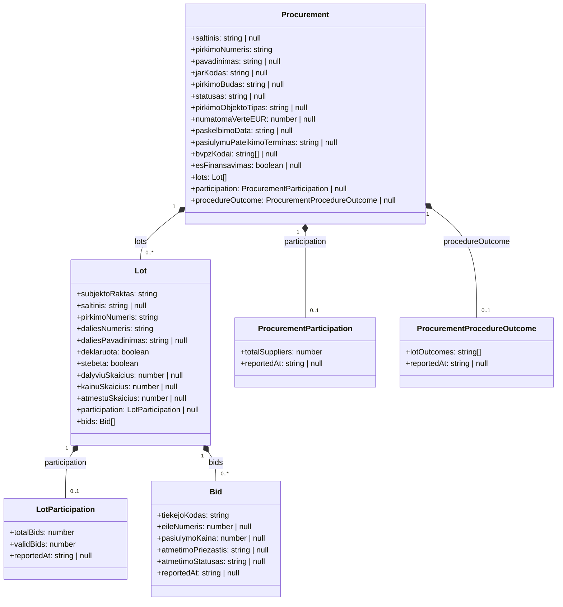
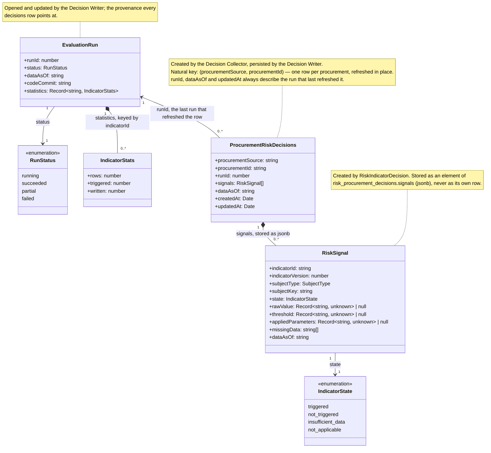
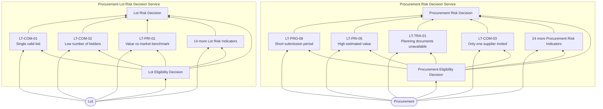

# Procurement Risk Service Architecture

## 1. Procurement Risk Process

### 1.1 Procurement Risk Process Diagram

```mermaid
flowchart LR
    CRON["Task Scheduler<br/>(triggers batch run)"]
    READER["Procurement Reader<br/>(loads valid procurements)"]

    subgraph ENGINE["Risk Decision Engine — per Risk Indicator, per subject"]
        direction LR
        ELIG{"isEligible(subject)"}
        ASSESS["assessRisk(subject)"]
        SIGE(["RiskSignal<br/>insufficient_data / not_applicable"])
        SIGA(["RiskSignal<br/>triggered / not_triggered"])
        ELIG -->|" not eligible "| SIGE
        ELIG -->|" eligible "| ASSESS
        ASSESS --> SIGA
    end

    COLLECT["Decision Collector<br/>(one ProcurementRiskDecisions per procurement"]
    WRITER["Decision Writer<br/>(upserts by procurement, updates the run)"]
    STORE[("risk.risk_procurement_decisions")]
    RUNS[("risk.risk_evaluation_runs")]

    CRON -->|" run trigger "| READER
    READER -->|" Procurement + Lots + Bids "| ELIG
    SIGE --> COLLECT
    SIGA --> COLLECT
    COLLECT -->|" ProcurementRiskDecisions "| WRITER
    WRITER -->|" INSERT … ON CONFLICT DO UPDATE "| STORE
    WRITER -->|" run row + statistics "| RUNS
    STORE -.->|" run_id "| RUNS
```



### 1.2 Procurement Reader and Decision Writer Components Class Diagram

```mermaid
classDiagram
    class RunJob {
        <<module runJob.ts>>
        +runEvaluation(options: RunJobOptions) Promise~RunResult~
    }

    class RunJobOptions {
        <<type>>
        +codeCommit: string
        +subjects: string[] | null
        +pageSize: number
    }

    class RunResult {
        <<type>>
        +runId: number
        +status: RunStatus
        +statistics: Record~string, IndicatorStats~
    }
    note for RunResult "RunStatus, IndicatorStats and the EvaluationRun row behind them: §2.3."

    class ProcurementReader {
        -subjects: string[] | null
        -dataAsOf: string
        +loadProcurements(cursor: string | null, pageSize: number) Promise~Page~Procurement~~
    }
    note for ProcurementReader "subjects and dataAsOf are bound once per run, not per page, so lots
    and evidence load once. Orphan lots (no matching procurement) can't happen by business invariant;
    if the query still returns one, its count is logged at WARNING and it is dropped — it is not a Subject."

    class Page~T~ {
        <<type>>
        +items: T[]
        +nextCursor: string | null
    }

    class RiskDecisionEngine {
        -procurementIndicators: ARiskIndicatorDecision[]
        -lotIndicators: ARiskIndicatorDecision[]
        -bidIndicators: ARiskIndicatorDecision[]
        +evaluateAll(procurements: Procurement[]) ProcurementRiskDecisions[]
        -evaluateProcurement(procurement: Procurement) ProcurementRiskDecisions
        -evaluateLot(lot: Lot, procurement: Procurement) RiskSignal[]
        -evaluateBid(bid: Bid, lot: Lot, procurement: Procurement) RiskSignal[]
    }
    note for RiskDecisionEngine "The signals of a procurement, of its lots and of its bids are collected
    into that procurement's single ProcurementRiskDecisions — the grain stays on the signal
    (subjectType, subjectKey), not on the row."

    class DecisionWriter {
        -evaluationRun: EvaluationRun | null
        +writeDecisions(decisions: ProcurementRiskDecisions[]) Promise~number~
        +updateEvaluationRun(update: Partial~EvaluationRun~) Promise~EvaluationRun~
    }
    note for DecisionWriter "writeDecisions upserts on (procurement_source, procurement_id): one
    statement per page, INSERT … ON CONFLICT DO UPDATE. updateEvaluationRun upserts the run row —
    the first call inserts it, later calls accumulate per-indicator stats across pages.
    No crash recovery, no retry."

    RunJob ..> RunJobOptions: options
    RunJob --> RunResult: returns
    RunJob ..> ProcurementReader: loop — loads next page (subjects filter, cursor) until nextCursor is null
    ProcurementReader --> Page: returns
    RunJob ..> RiskDecisionEngine: evaluates one page of procurements
    RunJob ..> DecisionWriter: writes the page's decisions, then checkpoints statistics
```



## 2. Procurement Risk Decision Service

### 2.1 Input Data Object Model



- **`null` evidence means nothing was observed** — the `insufficient_data` case. A *present* `participation` whose
  counts are zero is a different, real observation, and `hasRequiredData()` must not confuse the two.
- **The run's `dataAsOf` cuts off evidence, not subjects.** `Bid`, both participations and `ProcurementProcedureOutcome`
  are filtered `ataskaitosData <= dataAsOf`; `Procurement` and `Lot` are whatever the register currently holds.
- **Aggregates are merged, not joined.** One batch query per grain per run, attached to the object — so a decision
  issues no query, and every indicator at that grain shares one read. Orphan lots are dropped by the Reader, so
  `Lot.pirkimoNumeris` always resolves.

### 2.2 Input Data Object Model Source

Each object is read through the risk service's own `_v2` copy of the view, inlined per query as a CTE by
`procurementPublicViews.ts`.

| Business Object               | Domain Model View       |
|-------------------------------|-------------------------|
| `Procurement`                 | `v_pirkimas`            |
| `Lot`                         | `v_pirkimo_dalis`       |
| `Bid`                         | `v_dalyviai`            |
| `LotParticipation`            | `v_dalyviai`            |
| `ProcurementParticipation`    | `v_dalyviai`            |
| `ProcurementProcedureOutcome` | `v_proceduros_pabaiga`  |

`v_proceduros_pabaiga` is still listed as not-yet-implemented in [`domain-model.md`](domain-model.md) §1.3; the risk
service reads it today through a `_v2`-only view named `v_pirkimo_pabaiga_v2`, with no shared counterpart. Same
entity, two names — to be reconciled.

### 2.3 Output Data Object Model

A run produces one `EvaluationRun`, and one `ProcurementRiskDecisions` per procurement it evaluated. Every
`RiskSignal` the run produced — for the procurement, its lots and its bids — lives inside that procurement's
decisions object. Nothing else.



`RiskSignal` no longer carries `procurementSource` / `procurementId`: the row it lives in already answers that.

### 2.4 Output Data Object Model Persistence

`ProcurementRiskDecisions` → `risk.risk_procurement_decisions`, **one row per procurement** (not per run):

| Field               | Column               | Type          | Note                                                                   |
|---------------------|----------------------|---------------|------------------------------------------------------------------------|
| —                   | `id`                 | `bigint`      | Identity PK                                                            |
| `procurementSource` | `procurement_source` | `text`        | Natural key, part 1                                                    |
| `procurementId`     | `procurement_id`     | `text`        | Natural key, part 2                                                    |
| `runId`             | `run_id`             | `bigint`      | FK → `risk.risk_evaluation_runs(id)`; **overwritten** on every refresh  |
| `signals`           | `signals`            | `jsonb`       | Array of `RiskSignal` — procurement, lot and bid grains together        |
| `dataAsOf`          | `data_as_of`         | `timestamptz` | Cutoff of the run that last wrote the row                              |
| `createdAt`         | `created_at`         | `timestamptz` | `DEFAULT now()`, never updated — first time this procurement was scored |
| `updatedAt`         | `updated_at`         | `timestamptz` | `now()` on every upsert — the "assessed at" the GUI shows              |

| Constraint / Index                                            | Purpose                                                    |
|---------------------------------------------------------------|-------------------------------------------------------------|
| `UNIQUE (procurement_source, procurement_id)`                 | The upsert conflict target; one row per procurement         |
| `GIN (signals jsonb_path_ops)`                                | List filters: which procurements a given indicator triggered |
| `INDEX (run_id)`                                              | "What did run N touch"; FK maintenance                      |
| `INDEX (updated_at DESC)`                                     | Freshness listings                                           |

`EvaluationRun` → `risk.risk_evaluation_runs`, one row per run:

| Field        | Column        | Type          | Note                                                      |
|--------------|---------------|---------------|-----------------------------------------------------------|
| `runId`      | `id`          | `bigint`      | The FK every decisions row carries                        |
| `dataAsOf`   | `data_as_of`  | `timestamptz` |                                                           |
| `codeCommit` | `code_commit` | `text`        |                                                           |
| `status`     | `status`      | `text`        | CHECK: the four `RunStatus` values                        |
| `statistics` | `statistics`  | `jsonb`       | Per-indicator `rows` / `triggered` / `written`            |
| —            | `started_at`  | `timestamptz` | `DEFAULT now()`                                           |
| —            | `finished_at` | `timestamptz` | Stamped when status becomes terminal                      |
| —            | `error`       | `text`        | Set only by the stale-run sweep at the next process start |

Invariants:

| # | Invariant                                                                                                                                                              |
|---|-------------------------------------------------------------------------------------------------------------------------------------------------------------------------|
| 1 | **One row per procurement, refreshed in place.** There is no per-run snapshot; the table is the current state. `risk_rw` needs `INSERT` **and** `UPDATE`.                 |
| 2 | **`signals` is replaced whole, never merged element-wise.** A refresh re-evaluates every deployed indicator for that procurement, so the array is always internally consistent. |
| 3 | **A refresh is scoped.** A run over a subset of procurements updates only those rows; every other row keeps its older `run_id` / `updated_at`. Indicators can grow and be re-run without reprocessing the whole register. |
| 4 | **At most one open run** — partial unique index on `status = 'running'` in `risk.risk_evaluation_runs`.                                                                    |
| 5 | **`updated_at` is the published freshness.** The GUI shows it per procurement; there is no global "as of" for the site any more.                                          |

Read path:

| View                           | Answers                                                                                             |
|--------------------------------|------------------------------------------------------------------------------------------------------|
| `risk.v_latest_run`            | Provenance only: the most recently started `succeeded` / `partial` run. No longer a read filter        |
| `risk.v_procurement_summaries` | Per procurement, from its own `signals` jsonb: counts by state, the `triggered` indicator ids, `updated_at` |

## 3. Risk Decision Services (DRD)

Two decision areas are drawn below: the **Procurement Risk Decision Service** (subject `procurement`) and the
**Procurement Lot Risk Decision Service** (subject `lot`). A third subject, `bid`, is implemented (§2.1, LT-COM-20)
but has no decision service drawn here yet.

### 3.1 Legend

| Shape                     | DMN Element              |
|---------------------------|--------------------------|
| Rectangle                 | Decision                 |
| Rounded (`([...])`)       | Input Data               |
| Leaning sides (`[/.../]`) | Business Knowledge Model |
| Flag (`>...]`)            | Knowledge Source         |
| Bounding box (subgraph)   | Decision Service         |

### 3.2 Diagram



### 3.3 Decision Tables: Eligibility Decisions

#### Procurement Eligibility Decision

| Input: `pirkimoBudas` present | Input: `saltinis` | Output: Eligibility |
|-------------------------------|-------------------|---------------------|
| yes                           | `cvpis`           | eligible            |
| no                            | `cvpp`            | not eligible        |

#### Lot Eligibility Decision

| Input: Parent Procurement Eligibility | Input: `deklaruota` | Output: Eligibility |
|----------------------------------------|----------------------|----------------------|
| eligible                               | true                  | eligible             |
| eligible                               | false                 | not eligible         |
| not eligible                           | any                   | not eligible         |

### 3.4 Risk Indicator Definition

```mermaid
classDiagram
    class RiskIndicatorDefinition~P~ {
        <<interface>>
        +key: RiskIndicatorKey
        +subjectType: SubjectType
        +stage: IndicatorStage
        +references: string[]
        +sourceRelations: string[]
        +requiredInputs: string[]
        +parameters: P
        +standard: RiskIndicatorStandard
        +public: RiskIndicatorPublicText
    }
    class RiskIndicatorKey {
        <<type>>
        +id: string
        +version: number
    }
    class RiskIndicatorStandard {
        <<interface>>
        +name: string
        +url: string
        +page?: number
    }
    class RiskIndicatorPublicText {
        <<interface>>
        +titleLt: string
        +descriptionLt: string
        +formulaLt: string
        +limitationLt: string
    }
    class BaseParameters {
        <<type>>
        +validFrom: string
        +validTo: string | null
        +source: string
        +note?: string
    }
    note for BaseParameters "P extends BaseParameters: an indicator's own parameter values are
    intersected directly onto it, not nested under a values key. One entry, one validity window —
    parameterEntryFor(dataAsOf) returns it or null."

    class SubjectType {
        <<enumeration>>
        procurement, lot, bid,
        contract, supplier
    }
    class IndicatorStage {
        <<enumeration>>
        planning, tender,
        award, contract
    }

    class RiskIndicatorDecision~S~ {
        <<interface>>
        +isEligible(subject: S) EligibilityOutcome
        +assessRisk(subject: S) RiskSignal
    }
    class ARiskIndicatorDecision~D S~ {
        <<abstract>>
        +definition: D
        +context: EvaluationContext
        +isEligible(subject: S) EligibilityOutcome*
        +assessRisk(subject: S) RiskSignal*
        #hasRequiredData(subject: S) boolean*
        #signalFor(subject: S, partial: PartialRiskSignal) RiskSignal
    }
    class AProcurementIndicatorDecision~D~ {
        <<abstract>>
        +isEligible(subject: ProcurementSubject) EligibilityOutcome
    }
    class ALotIndicatorDecision~D~ {
        <<abstract>>
        +isEligible(subject: LotSubject) EligibilityOutcome
    }
    class ABidIndicatorDecision~D~ {
        <<abstract>>
        +isEligible(subject: BidSubject) EligibilityOutcome
    }

    class Subject {
        <<type>>
        ProcurementSubject
        LotSubject
        BidSubject
    }
    note for Subject "Each variant wraps the object the Reader already loaded — Procurement, Lot or Bid
    (§2.1) — together with its non-null parents, so a decision never re-fetches what the Reader knows.
    subjectType and subjectKey are derived from the wrapped object's own key, not stored on it; the
    procurement key belongs to the ProcurementRiskDecisions row, not to the signal (§2.3)."

    class EligibilityOutcome {
        <<type>>
        +eligible: boolean
        +signal: RiskSignal
    }
    note for EligibilityOutcome "A discriminated union: signal is present only when eligible is false,
    and is then already the final RiskSignal (not_applicable or insufficient_data)."

    class RiskSignal {
        <<interface>>
    }
    note for RiskSignal "Fields, states and persistence: §2.3, §2.4."

    RiskIndicatorDefinition "1" *-- "1" RiskIndicatorKey: key
    RiskIndicatorDefinition "1" --> "1" SubjectType: subjectType
    RiskIndicatorDefinition "1" --> "1" IndicatorStage: stage
    RiskIndicatorDefinition "1" *-- "1" BaseParameters: parameters
    RiskIndicatorDefinition "1" *-- "1" RiskIndicatorStandard: standard
    RiskIndicatorDefinition "1" *-- "1" RiskIndicatorPublicText: public
    ARiskIndicatorDecision ..|> RiskIndicatorDecision
    ARiskIndicatorDecision "1" *-- "1" RiskIndicatorDefinition: definition
    AProcurementIndicatorDecision --|> ARiskIndicatorDecision
    ALotIndicatorDecision --|> ARiskIndicatorDecision
    ABidIndicatorDecision --|> ARiskIndicatorDecision
    RiskIndicatorDecision "1" ..> "1" Subject: isEligible(subject), assessRisk(subject)
    RiskIndicatorDecision "1" ..> "1" EligibilityOutcome: isEligible() returns
    RiskIndicatorDecision "1" ..> "1" RiskSignal: assessRisk() returns
    EligibilityOutcome "1" ..> "0..1" RiskSignal: when not eligible
```



### 3.5 Per-Indicator File Layout

Each deployed indicator version is one directory under `modules/risk/indicators/<CODE>/`:

| File            | Holds                                                                                                                                                                                   |
|-----------------|-----------------------------------------------------------------------------------------------------------------------------------------------------------------------------------------|
| `definition.ts` | The `RiskIndicatorDefinition` object — identity, references, standard, public wording, and the effective-dated parameter timeline. Pure data; no imports of `ARiskIndicatorDecision`. Used in GUI and found in registry. |
| `decision.ts`   | The `ARiskIndicatorDecision` subclass that exposes `isEligible` and `assessRisk`                                                                                                        |
| `test/`         | Unit tests against risk indicator class                                                                                                                                                 |

## 4. Running the Service

Entry point: `services/procurement-risk/index.ts` (`npm run risk:run`). One sequential evaluation run per invocation — not a daemon.

```bash
npm run risk:run                       # full run, every subject
npm run risk:run -- <pirkimoNumeris...>  # only the named procurements
npm run risk:run -- --limit 20         # light run: first 20 distinct ATN-1 procurement ids (deterministic)
```

`--limit N` and explicit subject ids are mutually exclusive. Requires `riskDb` (see `postgres/riskDb.js`) and the primary Postgres DB configured, as in [Local dev setup](../../CLAUDE.md).

Every invocation is a **refresh**, not a snapshot: it rewrites the decisions row of each procurement it touched and
leaves the rest untouched. Adding an indicator and re-running a subset is therefore a normal operation — the whole
register is not reprocessed, and each row's `updated_at` says how fresh it is.

## 5. Deprecated

What exists in the code today and is superseded by §1–§2. To be removed by the refactoring; this section goes with it.

| # | Deprecated                                                                        | Where                                                                  | Replacement                                                                              |
|---|-----------------------------------------------------------------------------------|------------------------------------------------------------------------|-------------------------------------------------------------------------------------------|
| 1 | Table `risk.risk_signals` — one flattened row per (subject, indicator)            | `migrations/risk/001_risk.sql`, `003_bid_subject.sql`                   | `risk.risk_procurement_decisions`, signals as `jsonb`                                     |
| 2 | Table name `risk.evaluation_runs`                                                 | `migrations/risk/001_risk.sql`, `002_roles.sql`                         | `risk.risk_evaluation_runs`                                                               |
| 3 | Snapshot-per-run model: insert-only writes, one live run, `run_id` filter on reads | `services/procurement-risk/write.ts`, `risk.v_procurement_summaries`    | Current-state upsert by procurement; `run_id` is provenance, not a filter                 |
| 4 | `SignalWriter` / `writeRiskSignals()` / `writeObservations()`                      | `services/procurement-risk/signalWriter.ts`, `write.ts`                 | `DecisionWriter` / `writeDecisions()` — `INSERT … ON CONFLICT DO UPDATE`                  |
| 5 | `RiskSignal.procurementSource`, `RiskSignal.procurementId`                         | `modules/risk/types.ts`, `modules/risk/contracts.ts`                    | Held once on the decisions row                                                            |
| 6 | `RiskDecisionEngine.evaluateAll(): RiskSignal[]`                                   | `modules/risk/riskDecisionEngine.ts`                                    | Returns `ProcurementRiskDecisions[]`, signals grouped per procurement                     |
| 7 | Retention by superseded snapshot (`deleteExpiredSnapshots`, `RETENTION_INTERVAL`)  | `services/procurement-risk/retention.ts`, `retentionJob.ts`             | Nothing to expire — rows are overwritten. Only run rows accumulate                        |
| 8 | Columns `error_info`, `duration_ms` and state `calculation_error`                  | `migrations/risk/001_risk.sql`                                          | Unused path; a failing indicator is logged and contributes no signal                       |
| 9 | Grants: `risk_rw` insert-only on signals, DELETE for retention                     | `migrations/risk/002_roles.sql`                                         | `SELECT, INSERT, UPDATE` on both `risk_*` tables                                          |
| 10 | Indexes `risk_signals_run_subject_idx`, `risk_signals_run_procurement_idx`, `risk_signals_run_triggered_idx` | `migrations/risk/001_risk.sql`                       | Unique natural key + GIN on `signals` (§2.4)                                              |
| 11 | `IndicatorStats.inserted`                                                          | `services/procurement-risk/signalWriter.ts`, `runJob.ts`                | `written` (inserted or updated)                                                            |
| 12 | Doc references to `risk-service-architecture-v2.md` / `architecture-v2.md` §-numbers | code comments across `modules/risk/`, `services/procurement-risk/`     | This document                                                                              |

## 6. Open Questions

| # | Question                                                                                                                                                                                                                               |
|---|----------------------------------------------------------------------------------------------------------------------------------------------------------------------------------------------------------------------------------------|
| 1 | Is one shared Procurement Eligibility Decision sufficient for all 28 indicators, or do some need their own additional eligibility rule? ANSWER: you will extend DRD on demand.                                                         |
| 2 | Where does `requiredInputs` / Data Eligibility Decision sit in this v2 model — inside each Risk Indicator, or as a second shared decision beside Procurement Eligibility Decision? ANSWER: you will read all domain element view data. |
