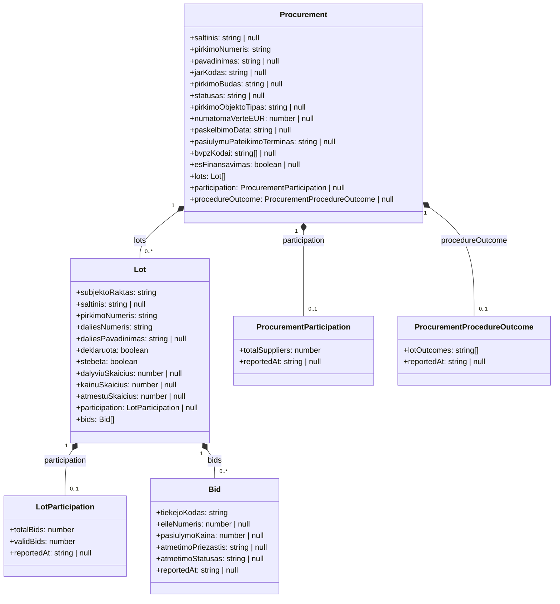

# Procurement Risk Service Architecture

## 1. Procurement Risk Process

### 1.1 Procurement Risk Process Diagram

```mermaid
flowchart LR
    CRON["Task Scheduler<br/>(triggers batch run)"]
    READER["Procurement Reader<br/>(loads valid procurements)"]

    subgraph ENGINE["Risk Decision Engine — per Risk Indicator, per subject"]
        direction LR
        ELIG{"isEligible(subject)"}
        ASSESS["assessRisk(subject)"]
        SIGE(["RiskSignal<br/>insufficient_data / not_applicable"])
        SIGA(["RiskSignal<br/>triggered / not_triggered"])
        ELIG -->|" not eligible "| SIGE
        ELIG -->|" eligible "| ASSESS
        ASSESS --> SIGA
    end

    COLLECT["Decision Collector<br/>(one ProcurementRiskDecisions per procurement"]
    WRITER["Decision Writer<br/>(upserts by procurement, updates the run)"]
    STORE[("risk.\"procurementDecisions\"")]
    SIGNALS[("risk.\"signals\"")]
    CRON -->|" run trigger "| READER
    READER -->|" Procurement + Lots + Bids "| ELIG
    SIGE --> COLLECT
    SIGA --> COLLECT
    COLLECT -->|" ProcurementRiskDecisions "| WRITER
    WRITER -->|" INSERT … ON CONFLICT DO UPDATE "| STORE
    WRITER -->|" DELETE then INSERT, per procurement "| SIGNALS
    SIGNALS -.->|" decisionId → id "| STORE
```



### 1.2 Procurement Reader and Decision Writer Components Class Diagram

```mermaid
classDiagram
    class RunJob {
<<modulerunJob.ts>>
+runEvaluation(options: RunJobOptions) Promise~RunResult~
}

class RunJobOptions {
<<type>>
+subjects: string[] | null
+pageSize: number
}

class RunResult {
<<type>>
+status: RunStatus
+statistics: Record~string, IndicatorStats~
}
note for RunResult "RunStatus and IndicatorStats: §2.3. Returned to the caller only — a batch
    persists nothing about itself; each decisions row carries its own freshness."

class ProcurementReader {
-subjects: string[] | null
-dataAsOf: string
+loadProcurements(cursor: string | null, pageSize: number) Promise~Page~Procurement~~
}
note for ProcurementReader "subjects and dataAsOf are bound once per run, not per page, so lots
    and evidence load once. Orphan lots (no matching procurement) can't happen by business invariant;
    if the query still returns one, its count is logged at WARNING and it is dropped — it is not a Subject."

class Page~T~ {
<<type>>
+items: T[]
+nextCursor: string | null
}

class RiskDecisionEngine {
-procurementIndicators: ARiskIndicatorDecision[]
-lotIndicators: ARiskIndicatorDecision[]
-bidIndicators: ARiskIndicatorDecision[]
+evaluateAll(procurements: Procurement[]) ProcurementRiskDecisions[]
-evaluateProcurement(procurement: Procurement) ProcurementRiskDecisions
-evaluateLot(lot: Lot, procurement: Procurement) RiskSignal[]
-evaluateBid(bid: Bid, lot: Lot, procurement: Procurement) RiskSignal[]
}
note for RiskDecisionEngine "The signals of a procurement, of its lots and of its bids are collected
    into that procurement's single ProcurementRiskDecisions — the grain stays on the signal
    (subjectType, subjectKey), not on the row."

class DecisionWriter {
+writeDecisions(decisions: ProcurementRiskDecisions[]) Promise~number~
}
note for DecisionWriter "writeDecisions upserts the procurement's metadata row on
    (procurementSource, procurementId) — INSERT … ON CONFLICT DO UPDATE … RETURNING id — then
    wipes and replaces that procurement's rows in risk.signals using the returned id: DELETE
    WHERE decisionId = …, followed by a bulk INSERT of the freshly evaluated signals stamped
    with that same decisionId. Never an UPDATE on risk.signals. There is no run row to open or
    close: a crash mid-batch leaves committed pages current and the rest untouched."

RunJob ..> RunJobOptions: options
RunJob --> RunResult: returns
RunJob ..> ProcurementReader: loop — loads next page (subjects filter, cursor) until nextCursor is null
ProcurementReader --> Page: returns
RunJob ..> RiskDecisionEngine: evaluates one page of procurements
RunJob ..> DecisionWriter: writes the page's decisions, then checkpoints statistics
```



## 2. Procurement Risk Decision Service

### 2.1 Input Data Object Model



- **`null` evidence means nothing was observed** — the `insufficient_data` case. A *present* `participation` whose
  counts are zero is a different, real observation, and `hasRequiredData()` must not confuse the two.
- **The run's `dataAsOf` cuts off evidence, not subjects.** `Bid`, both participations and `ProcurementProcedureOutcome`
  are filtered `ataskaitosData <= dataAsOf`; `Procurement` and `Lot` are whatever the register currently holds.
- **Aggregates are merged, not joined.** One batch query per grain per run, attached to the object — so a decision
  issues no query, and every indicator at that grain shares one read. Orphan lots are dropped by the Reader, so
  `Lot.pirkimoNumeris` always resolves.

### 2.2 Input Data Object Model Source

Each object is read through the risk service's own `_v2` copy of the view, inlined per query as a CTE by
`procurementPublicViews.ts`.

| Business Object               | Domain Model View      |
|-------------------------------|------------------------|
| `Procurement`                 | `v_pirkimas`           |
| `Lot`                         | `v_pirkimo_dalis`      |
| `Bid`                         | `v_dalyviai`           |
| `LotParticipation`            | `v_dalyviai`           |
| `ProcurementParticipation`    | `v_dalyviai`           |
| `ProcurementProcedureOutcome` | `v_proceduros_pabaiga` |

`v_proceduros_pabaiga` is still listed as not-yet-implemented in [`domain-model.md`](domain-model.md) §1.3; the risk
service reads it today through a `_v2`-only view named `v_pirkimo_pabaiga_v2`, with no shared counterpart. Same entity,
two names — to be reconciled.

### 2.3 Output Data Object Model

A run produces one `ProcurementRiskDecisions` per procurement it evaluated. Every
`RiskSignal` the run produced — for the procurement, its lots and its bids — lives inside that procurement's decisions
object. Nothing else.

```mermaid
classDiagram
    class ProcurementRiskDecisions {
        +procurementSource: string
        +procurementId: string
        +signals: RiskSignal[]
        +dataAsOf: string
        +createdAt: Date
        +updatedAt: Date
    }
    note for ProcurementRiskDecisions "Created by the Decision Collector, persisted by the Decision Writer.
    Natural key: (procurementSource, procurementId) — one row per procurement, refreshed in place.
    dataAsOf and updatedAt always describe the evaluation that last refreshed it."

    class RiskSignal {
        +indicatorId: string
        +indicatorVersion: number
        +subjectType: SubjectType
        +subjectKey: string
        +state: IndicatorState
        +rawValue: Record~string, unknown~ | null
        +threshold: Record~string, unknown~ | null
        +appliedParameters: Record~string, unknown~ | null
        +missingData: string[]
    }
    note for RiskSignal "Created by RiskIndicatorDecision. Persisted as its own row in
    risk."signals", one row per signal — not nested jsonb. Carries no dataAsOf: that cutoff
    lives once on the parent ProcurementRiskDecisions row and is not repeated per signal (§2.4)."

    class IndicatorState {
        <<enumeration>>
        triggered
        not_triggered
        insufficient_data
        not_applicable
    }

    class IndicatorStats {
        +rows: number
        +triggered: number
        +written: number
    }

    class RunStatus {
        <<enumeration>>
        succeeded
        partial
        failed
    }
    note for RunStatus "On RunResult only (§1.2) — a batch's outcome is returned to its caller,
    never stored."

    RunResult "1" --> "1" RunStatus: status
    RunResult "1" *-- "0..*" IndicatorStats: statistics, keyed by indicatorId
    ProcurementRiskDecisions "1" *-- "0..*" RiskSignal: signals, stored as rows in risk."signals"
    RiskSignal "1" --> "1" IndicatorState: state
```

`RiskSignal` (the domain type) carries neither `procurementSource` / `procurementId` nor `dataAsOf`: the
`ProcurementRiskDecisions` it is collected into already answers both. Persistence resolves the link even more directly
than a stamped natural key — `risk."signals"` points at its parent by the parent's own surrogate
`id` (`decision_id`), never by `procurement_source` / `procurement_id` at all (§2.4). That also sidesteps any question
of whether `(procurement_source, procurement_id)` is safe to rely on as a natural key elsewhere:
the signal table's referential integrity doesn't depend on it.

### 2.4 Output Data Object Model Persistence

`ProcurementRiskDecisions` → `risk."procurementDecisions"`, **one row per procurement** (not per run) — metadata
only, no signals:

| Field               | Column               | Type          | Note                                                                    |
|---------------------|----------------------|---------------|-------------------------------------------------------------------------|
| —                   | `id`                 | `bigint`      | Identity PK                                                             |
| `procurementSource` | `"procurementSource"` | `text`        | Natural key, part 1                                                     |
| `procurementId`     | `"procurementId"`     | `text`        | Natural key, part 2                                                     |
| `dataAsOf`          | `"dataAsOf"`         | `timestamptz` | Cutoff of the evaluation that last wrote the row                        |
| `createdAt`         | `"createdAt"`         | `timestamptz` | `DEFAULT now()`, never updated — first time this procurement was scored |
| `updatedAt`         | `"updatedAt"`         | `timestamptz` | `now()` on every upsert — the "assessed at" the GUI shows               |

| Constraint / Index                            | Purpose                                                                           |
|-----------------------------------------------|-----------------------------------------------------------------------------------|
| `UNIQUE ("procurementSource", "procurementId")` | The upsert conflict target; one row per procurement; FK target for `risk."signals"` |
| `INDEX ("updatedAt" DESC)`                     | Freshness listings                                                                |

`RiskSignal` → `risk."signals"`, **one row per signal**. A procurement's signals are wiped and reinserted whole on
every refresh that touches it — never updated in place (Invariant 2 below). No `id` column: the row has no identity
worth naming outside its parent, nothing references an individual signal row, and the table is always replaced wholesale
rather than addressed row-by-row, so a natural composite key does the job without a surrogate:

| Field               | Column               | Type          | Note                                                                                                   |
|---------------------|----------------------|---------------|--------------------------------------------------------------------------------------------------------|
| —                   | `"decisionId"`        | `bigint`      | FK → `risk."procurementDecisions"("id")` — the only link to the procurement; not on the `RiskSignal` type |
| `indicatorId`       | `"indicatorId"`       | `text`        |                                                                                                        |
| `indicatorVersion`  | `"indicatorVersion"`  | `int`         |                                                                                                        |
| `subjectType`       | `"subjectType"`       | `text`        | CHECK: the five `SubjectType` values (§3.4)                                                            |
| `subjectKey`        | `"subjectKey"`        | `text`        |                                                                                                        |
| `state`             | `state`              | `text`        | CHECK: the four `IndicatorState` values                                                                |
| `rawValue`          | `"rawValue"`          | `jsonb`       | Nullable                                                                                               |
| `threshold`         | `threshold`          | `jsonb`       | Nullable                                                                                               |
| `appliedParameters` | `"appliedParameters"` | `jsonb`       | Nullable                                                                                               |
| `missingData`       | `"missingData"`       | `text[]`      |                                                                                                        |
| —                   | `"createdAt"`         | `timestamptz` | `DEFAULT now()` — when this refresh inserted the row                                                   |

No `"procurementSource"` / `"procurementId"` columns: unlike the deprecated table (§5 #1), a signal never carries the
natural key directly — only `"decisionId"`, resolved once via a join to
`risk."procurementDecisions"` when a query needs it. No `"dataAsOf"` column either: the cutoff lives once on the parent
`risk."procurementDecisions"."dataAsOf"` and is read from there, not duplicated per signal.

| Constraint / Index                                                                       | Purpose                                                                                                                                                                   |
|------------------------------------------------------------------------------------------|---------------------------------------------------------------------------------------------------------------------------------------------------------------------------|
| `PRIMARY KEY ("decisionId", "indicatorId", "indicatorVersion", "subjectType", "subjectKey")`  | One signal per indicator version per subject per procurement; also the FK access path — "all signals for this procurement" (the GUI's main read) leads with `"decisionId"` |
| `FOREIGN KEY ("decisionId") REFERENCES risk."procurementDecisions" ("id") ON DELETE CASCADE` | Every signal belongs to exactly one procurement's decisions row                                                                                                           |
| `INDEX ("indicatorId", "state") INCLUDE ("decisionId")`                                  | List filters: which procurements a given indicator triggered — covering, so the read stays index-only                                                                     |

Invariants:

| # | Invariant                                                                                                                                                                                                                                                                                                                                     |
|---|-----------------------------------------------------------------------------------------------------------------------------------------------------------------------------------------------------------------------------------------------------------------------------------------------------------------------------------------------|
| 1 | **One row per procurement, refreshed in place.** There is no per-run snapshot; `risk."procurementDecisions"` is the current state. `risk_rw` needs `INSERT` **and** `UPDATE` on it, and `INSERT` **and** `DELETE` on `risk."signals"` (no `UPDATE` there — see Invariant 2).                                                                     |
| 2 | **A procurement's signals are wiped, not merged.** Never updated element-wise: the Decision Writer deletes every `risk."signals"` row for that `"decisionId"` and inserts the freshly evaluated set. A refresh re-evaluates every deployed indicator for that procurement, so the replacement set is always internally consistent.               |
| 3 | **A refresh is scoped.** A run over a subset of procurements touches only those procurements' `risk."procurementDecisions"` row and its `"decisionId"`'s `risk."signals"` rows; every other procurement keeps its older `"dataAsOf"` / `"updatedAt"` and untouched signals. Indicators can grow and be re-run without reprocessing the whole register. |
| 4 | **One evaluation at a time** — a Postgres advisory lock taken by `services/procurement-risk/index.ts` for the length of the process. There is no run table to enforce it in the schema, and a crash releases the lock with no row left behind to reconcile.                                                                                    |
| 5 | **`"updatedAt"` is the published freshness.** The GUI shows it per procurement; there is no global "as of" for the site any more.                                                                                                                                                                                                              |

Read path:

| View                           | Answers                                                                                                                               |
|--------------------------------|---------------------------------------------------------------------------------------------------------------------------------------|
| `risk."vProcurementSummaries"` | Per procurement, joining its `risk."signals"` rows: counts by state, the `triggered` indicator ids, `"updatedAt"` from the decisions row |

## 3. Risk Decision Services (DRD)

> TBA

### 3.3 Decision Tables: Eligibility Decisions

#### Procurement Eligibility Decision

| Input: `pirkimoBudas` present | Input: `saltinis` | Output: Eligibility |
|-------------------------------|-------------------|---------------------|
| yes                           | `cvpis`           | eligible            |
| no                            | `cvpp`            | not eligible        |

#### Lot Eligibility Decision

| Input: Parent Procurement Eligibility | Input: `deklaruota` | Output: Eligibility |
|---------------------------------------|---------------------|---------------------|
| eligible                              | true                | eligible            |
| eligible                              | false               | not eligible        |
| not eligible                          | any                 | not eligible        |

### 3.4 Risk Indicator Definition


### 3.5 Per-Indicator File Layout

Each deployed indicator version is one directory under `modules/risk/indicators/<CODE>/`:

| File            | Holds                                                                                                                                                                                                                    |
|-----------------|--------------------------------------------------------------------------------------------------------------------------------------------------------------------------------------------------------------------------|
| `definition.ts` | The `RiskIndicatorDefinition` object — identity, references, standard, public wording, and the effective-dated parameter timeline. Pure data; no imports of `ARiskIndicatorDecision`. Used in GUI and found in registry. |
| `decision.ts`   | The `ARiskIndicatorDecision` subclass that exposes `isEligible` and `assessRisk`                                                                                                                                         |
| `test/`         | Unit tests against risk indicator class                                                                                                                                                                                  |

## 4. Running the Service

Entry point: `services/procurement-risk/index.ts` (`npm run risk:run`). One sequential evaluation run per invocation —
not a daemon.

```bash
npm run risk:run                       # full run, every subject
npm run risk:run -- <pirkimoNumeris...>  # only the named procurements
npm run risk:run -- --limit 20         # light run: first 20 distinct ATN-1 procurement ids (deterministic)
```

`--limit N` and explicit subject ids are mutually exclusive. Requires the primary Postgres DB configured, as in
[Local dev setup](../../CLAUDE.md) — the `risk` schema lives in that same database and is reached through the same
`postgres` pool.

Every invocation is a **refresh**, not a snapshot: it rewrites the decisions row of each procurement it touched and
wipes and reinserts that procurement's `risk."signals"` rows, leaving every other procurement untouched. Adding an
indicator and re-running a subset is therefore a normal operation — the whole register is not reprocessed, and each
row's `updated_at` says how fresh it is.

## 5. Deprecated

What exists in the code today and is superseded by §1–§2. To be removed by the refactoring; this section goes with it.

Migration filenames below (`002_roles.sql` through `006_drop_code_commit.sql`) predate a 2026-09 flattening: with no risk data anywhere worth an upgrade path, they were folded into a single `001_risk.sql` reflecting the schema they converged to. The filenames are kept here only as history of what changed and in what order — they no longer exist as separate files.
Table and column names below are also written as they stood at the time: a later 2026-09 change converted the schema to
the repo's quoted camelCase convention (`risk.risk_procurement_decisions` → `risk."procurementDecisions"`,
`risk.risk_signals` → `risk."signals"`, `risk.risk_evaluation_runs` → `risk."evaluationRuns"`, and every column with
it). §2.4 above is the current spec.

| #  | Deprecated                                                                                                   | Where                                                                | Replacement                                                                                                                                                                                                                                                                  |
|----|--------------------------------------------------------------------------------------------------------------|----------------------------------------------------------------------|------------------------------------------------------------------------------------------------------------------------------------------------------------------------------------------------------------------------------------------------------------------------------|
| 1  | Table `risk.risk_signals` as a flattened row per (subject, indicator), snapshot-per-run; then briefly folded into `risk_procurement_decisions.signals` (a jsonb array, one row per procurement, no signal-level table at all) | `migrations/risk/001_risk.sql`, `003_bid_subject.sql`, `004_decisions.sql` | Redesigned `risk.risk_signals` (§2.4, `005_signals_table.sql`): its own table again, current-state, `decision_id` FK into `risk_procurement_decisions` (not `procurement_source`/`procurement_id` — no natural-key columns are stamped onto the signal row at all), wiped and reinserted per procurement, no `run_id` or `data_as_of` columns. Same table name as the pre-004 table, unrelated schema — do not assume the old columns |
| 2  | Table name `risk.evaluation_runs`                                                                            | `migrations/risk/001_risk.sql`, `002_roles.sql`                      | `risk.risk_evaluation_runs`                                                                                                                                                                                                                                                  |
| 3  | Snapshot-per-run model: insert-only writes, one live run, `run_id` filter on reads                           | `services/procurement-risk/write.ts`, `risk.v_procurement_summaries` | Current-state upsert by procurement; `run_id` is provenance, not a filter                                                                                                                                                                                                    |
| 4  | `SignalWriter` / `writeRiskSignals()` / `writeObservations()`                                                | `services/procurement-risk/signalWriter.ts`, `write.ts`              | `DecisionWriter` / `writeDecisions()` — upserts the decisions row, then `DELETE` + `INSERT` on `risk_signals`                                                                                                                                                                |
| 5  | `RiskSignal.procurementSource`, `RiskSignal.procurementId`, `RiskSignal.dataAsOf`                            | `modules/risk/types.ts`, `modules/risk/contracts.ts`                 | Held once on the decisions row; the `risk_signals` row links back to it only via `decision_id` (surrogate FK, §2.4) — no natural-key columns are stamped onto the signal row at all, and `dataAsOf` is not duplicated either                                                 |
| 6  | `RiskDecisionEngine.evaluateAll(): RiskSignal[]`                                                             | `modules/risk/riskDecisionEngine.ts`                                 | Returns `ProcurementRiskDecisions[]`, signals grouped per procurement                                                                                                                                                                                                        |
| 7  | Retention by superseded snapshot (`deleteExpiredSnapshots`, `RETENTION_INTERVAL`)                            | `services/procurement-risk/retention.ts`, `retentionJob.ts`          | Nothing to expire — rows are overwritten/replaced. Only run rows accumulate                                                                                                                                                                                                  |
| 8  | Columns `error_info`, `duration_ms` and state `calculation_error`                                            | `migrations/risk/001_risk.sql`                                       | Unused path; a failing indicator is logged and contributes no signal                                                                                                                                                                                                         |
| 9  | Grants: `risk_rw` insert-only on signals, DELETE for retention                                               | `migrations/risk/002_roles.sql`                                      | `SELECT, INSERT, UPDATE` on `risk_procurement_decisions` and `risk_evaluation_runs`; `SELECT, INSERT, DELETE` on `risk_signals` (no `UPDATE` — rows are wiped and reinserted, never edited) — see `004_decisions.sql`/`005_signals_table.sql` for how the grants moved as the table split evolved                                                                                  |
| 10 | Indexes `risk_signals_run_subject_idx`, `risk_signals_run_procurement_idx`, `risk_signals_run_triggered_idx`; also the `004_decisions.sql`-era `risk_procurement_decisions_signals_gin_idx` on the jsonb `signals` column | `migrations/risk/001_risk.sql`, `004_decisions.sql`                  | `risk_signals` composite PK `(decision_id, indicator_id, indicator_version, subject_type, subject_key)` + `INDEX (indicator_id, state)` (§2.4, `005_signals_table.sql`). No `id` column — the old table's own-identity column is gone along with `run_id`-scoped indexing     |
| 11 | `IndicatorStats.inserted`                                                                                    | `services/procurement-risk/signalWriter.ts`, `runJob.ts`             | `written` (inserted or updated)                                                                                                                                                                                                                                              |
| 12 | Doc references to `risk-service-architecture-v2.md` / `architecture-v2.md` §-numbers                         | code comments across `modules/risk/`, `services/procurement-risk/`   | This document                                                                                                                                                                                                                                                                |

## 6. Open Questions

| # | Question                                                                                                                                                                                                                               |
|---|----------------------------------------------------------------------------------------------------------------------------------------------------------------------------------------------------------------------------------------|
| 1 | Is one shared Procurement Eligibility Decision sufficient for all 28 indicators, or do some need their own additional eligibility rule? ANSWER: you will extend DRD on demand.                                                         |
| 2 | Where does `requiredInputs` / Data Eligibility Decision sit in this v2 model — inside each Risk Indicator, or as a second shared decision beside Procurement Eligibility Decision? ANSWER: you will read all domain element view data. |
