# Risk signals for current and recently completed procurements

Status: initial technical design

Date: 2026-08-11

Scope: public-facing discovery and prioritisation page, not an automated finding of corruption

Detailed companion: [public page, storage and indicator maintenance specification](risk-indicators-public-page-and-maintenance.md).

## 1. Decision summary

The recommended solution is a hybrid:

1. **Canonical database views** define procurement, buyer, supplier, bid, award, contract and payment facts consistently.
2. **Version-controlled indicator packages** calculate explainable risk signals. Most contain a typed TypeScript definition plus a pure SQL `SELECT`; exceptional text/graph/model indicators use TypeScript with the same output contract.
3. **Effective-dated business parameters** hold Lithuanian legal thresholds, exclusions, comparison groups and severity settings. They are data, not hard-coded constants scattered through SQL.
4. **Persisted current and historical signal tables** make evaluation incremental, auditable and fast to serve. The web request never calculates cross-procurement indicators.
5. **Thin read views and an application service** expose the persisted results to Astro pages.
6. **Human review and outcome feedback** validate indicators and later provide labels for ranking or machine-learning models.
7. **Independent execution** uses a dedicated TypeScript risk service and durable PostgreSQL control tables for source events, jobs, dependencies, leases, retries, reconciliation and backfills. The existing Node task runner and public web process are not part of the calculation control plane.

Views alone are insufficient because several indicators require expensive rolling windows, peer-group percentiles, graph analysis, source watermarks and reproducible historical results. Stored procedures are also the wrong primary abstraction: they hide policy logic inside the live database, are awkward to review and test with the application, and make versioned replay harder. Stored procedures are appropriate only for small atomic database operations, such as swapping a completed result set into the current table.

The first release should present **risk signals**, evidence and data coverage, not a supposed probability of corruption. A flag means “worth attention”, never “misconduct proven”. This follows the Open Contracting Partnership (OCP) and OECD guidance: indicators are context-dependent proxies that need triangulation and investigation.

## 2. Product definition

### 2.1 Primary views

The page should support two default scopes:

- **Open now**: procurements whose submission deadline has not passed. These are the most actionable because a buyer, supplier or monitor can still react.
- **Recently changed or completed**: procurements whose deadline, award, contract or material amendment occurred within a configurable period, initially 30 days.

A procurement remains the same object as it moves through planning, tender, award, contract and implementation. New facts enrich its signal set; it must not become a disconnected “new result” at every stage.

Recommended routes:

- `/rizikos` — ranked/filterable list;
- `/rizikos/pirkimas/:source/:id` — procurement signal and evidence detail;
- `/rizikos/metodika` — definitions, versions, limitations and trigger-rate statistics.

### 2.2 List-card content

Each result should show:

- title, buyer, source identifier and lifecycle stage;
- publication date and the next relevant deadline/event;
- estimated or contract value, CPV group and procurement method when available;
- triggered signals grouped as competition, transparency, procedure, supplier, contract and implementation;
- the observed value and comparison, for example “submission window 4.2 days; peer median 10.8 days”;
- evidence/source links and the time through which the underlying data is current;
- data coverage/confidence independently from attention priority;
- a prominent explanation that the result is an automated signal, not a finding of wrongdoing.

Useful filters include lifecycle stage, signal family, signal ID, buyer, supplier, CPV, method, value, location, EU funding, deadline, source and data-confidence level. The default sort should be attention priority and recency, with value as a secondary factor. Users must also be able to sort by publication/deadline and value.

Do not display only an unexplained red/amber/green badge. A compact priority label is acceptable if the exact contributing signals remain visible.

## 3. Standards and design principles

The baseline indicator catalogue should be OCP's 2024 **Red Flags in Public Procurement** guide. It defines 73 indicators across planning through implementation, maps their required fields to OCDS, supports configurable thresholds/exclusions, distinguishes multiple units of analysis, and explicitly requires local adaptation and result validation. OCP recommends prioritising a smaller number of useful indicators over a large unvalidated catalogue ([guide](https://www.open-contracting.org/resources/red-flags-in-public-procurement-a-guide-to-using-data-to-detect-and-mitigate-risks/), [full methodology](https://www.open-contracting.org/wp-content/uploads/2024/12/OCP2024-RedFlagProcurement.pdf)).

Use the **Open Contracting Data Standard (OCDS)** as the conceptual lifecycle and field-mapping model even if the operational PostgreSQL schema remains Lithuanian. OCDS separates planning, tender, award, contract and implementation, and treats releases as immutable observations of events. That is especially useful here because the current database stores several current snapshots but not a full notice history ([OCDS lifecycle](https://standard.open-contracting.org/latest/en/primer/how/), [release reference](https://standard.open-contracting.org/latest/en/schema/reference/)).

The 2026 OECD integrity outlook highlights single bidding, non-competitive procedures and unjustified contract modifications as commonly used indicators, but warns that market structure, geography and buyer capacity can produce the same patterns. It recommends triangulating signals and interpreting them in country and sector context ([OECD 2026](https://www.oecd.org/en/publications/anti-corruption-and-integrity-outlook-2026_16708b78-en/full-report/component-14.html)). The OECD's procurement-risk guidance also recommends continuous red-flag systems plus an owned, regularly reviewed risk register ([OECD 2023](https://www.oecd.org/content/dam/oecd/en/publications/reports/2023/06/managing-risks-in-the-public-procurement-of-goods-services-and-infrastructure_b0d29f96/45667d2f-en.pdf)).

EU Single Market Scoreboard metrics are useful benchmarks, not transaction-level guilt thresholds. Its measures include single bidding, direct awards, price-only criteria, decision speed and use of lots ([EU scoreboard](https://single-market-scoreboard.ec.europa.eu/node/264_hr)).

Lithuanian context is essential. VPT's analysis links single-supplier outcomes to both market limitations and buyer-created barriers such as short deadlines and disproportionate requirements ([VPT analysis](https://vpt.lrv.lt/lt/naujienos-3/viesuju-pirkimu-vykdytojams-keliamas-tikslas-mazinti-1-tiekejo-rodikli/)). STT and OECD completed a Lithuanian public-procurement risk-model pilot in 2026 that integrates state-register data and machine learning, while retaining specialist analysis for final decisions ([STT pilot](https://www.stt.lt/naujienos/7464/_2026/sukurtas-dirbtiniu-intelektu-gristas-viesuju-pirkimu-korupcijos-riziku-vertinimo-bandomasis-modelis%3A4162)). Coordination or methodology exchange with STT/VPT would prevent duplicated or contradictory public indicators.

## 4. Findings from the live database

All queries for this investigation were read-only. Structural catalogues were readable; the supplied role lacked `SELECT` on some important current tables, as anticipated.

### 4.1 Current notices are timely enough for preventive signals

`public."viesiejiPirkimai"` is the strongest source for the open-now page:

| Finding as of 2026-08-10 | Value |
|---|---:|
| Current rows | 50,262 |
| Earliest / latest publication | 2022-09-24 / 2026-08-10 |
| Published in previous 365 days | 28,386 |
| Future submission deadline | 1,284 |
| Recent rows with buyer code | 27,749 (97.8%) |
| Recent rows with CPV | 27,833 (98.1%) |
| Recent rows with deadline | 28,154 (99.2%) |
| Recent rows with estimated value | 9,640 (34.0%) |

For recent notices with both dates, the 5th/25th/50th/75th/95th percentiles of the submission window were approximately 3.8/6.9/10.8/18.7/37.1 days. This is useful for peer comparisons, but legal-compliance checks must use effective Lithuanian rules by procedure and circumstance, not these empirical percentiles alone.

The main row is refreshed hourly in [`tasks/viesiejiPirkimai.js`](../tasks/viesiejiPirkimai.js), and the latest live publication was from the day of this investigation.

### 4.2 Notice detail is rich, but history is missing

The database has decomposed notice detail:

- `viesiejiPirkimaiKeys`: important dates, criteria, lots, contract type, language and other scalar fields;
- `viesiejiPirkimaiDalys`: lots/categories;
- `viesiejiPirkimaiFailai` and `viesiejiPirkimaiFailuVersijos`: documents and source-declared versions;
- `viesiejiPirkimaiSkelbimai`: notices;
- `viesiejiPirkimaiAtnaujinimai`: scrape bookkeeping.

However, [`modules/viesiejiPirkimai/scrape.js`](../modules/viesiejiPirkimai/scrape.js) upserts the current list row, and [`modules/viesiejiPirkimai/persistTurinys.js`](../modules/viesiejiPirkimai/persistTurinys.js) replaces decomposed child rows after a content-hash change. It does not retain an immutable snapshot of each notice change. The source's document-version list can reveal some amendments, but previous status, dates, fields and removed content cannot be reconstructed reliably.

An append-only procurement release/change table is therefore a prerequisite for robust indicators such as deadline shortening, repeated cancellation/republication, late material document changes and “what was known before the deadline”.

### 4.3 Bid and award coverage is the main limitation

The parsed `atn1*` tables contain:

- 443 reports for 425 procurements;
- bidder rows for 403 procurements (1,461 bidder rows);
- 67 reports indicating a claim and 4 indicating court action;
- records loaded over a narrow two-day interval in June 2026.

This is not sufficient population coverage for a public “single bidder” or bid-rigging ranking. Catalog inspection also found the older `cvppDumpAtn1*` family with an estimated 10,907 reports, 22,998 contracted-candidate rows and 5,991 rejected-candidate rows, but the supplied role could not read it. Unlocking, profiling and unifying these sources is a high-priority data task.

The current analyst view `v_dalyviai` is a useful semantic starting point, but it currently covers only the small parsed ATN-1 population. Missing bidder data must result in `insufficient_data`, never “no risk”.

### 4.4 Contracts and payments are broad but need canonicalisation

The readable `sutartysAtviriDuomenys` table contains 2,366,424 contracts, including 62,520 signed in the preceding 365 days. Its latest signature was 2025-12-31 and its latest registration was 2026-01-05, so it is stale for an August 2026 “just happened” page. Among those recent rows, only 9,021 linked to a current `viesiejiPirkimai` ID; 15,149 had a procurement number not in the current notice source and 38,350 had no procurement number.

The newer `vpmSutartys` family is much larger and apparently current (about 5.9 million current rows by catalogue estimate). It includes canonical values, buyer/supplier identifiers, actual completion data, a 7,238-row `vpmSutartysChanges` history and supporting dimension tables. The supplied role could inspect its structure but not its data. Implementation should use this family, not the stale open-data import, once a narrowly scoped worker/read role is granted.

SABIS provides approximately 2.53 million contract rows and 14.4 million invoices, with links through `sutartiesUid` and sometimes procurement ID. It can support “invoiced total exceeds contract”, unusual invoice timing and implementation-stage signals. Date validation is mandatory: 3,221 SABIS contract rows and 274 invoices had implausible dates outside a 2014 through near-future range.

### 4.5 Useful enrichment sources already exist

The database includes:

- `nepatikimiTiekejai` and `melagingiTiekejai`, both current through 2026-08-10;
- `neskelbiamosDerybos`, current through 2026-07-31;
- PINREG relationships, current on the day of investigation;
- company registration, management, financial statement, tax, Sodra, job, domain and court datasets;
- VDI violations;
- CPVA project, supplier and subcontractor data;
- planning tables (`planuojamiPirkimai*`), though a deterministic plan-to-notice link is not yet defined.

These sources are valuable after a bidder/supplier becomes known. Personal relationship evidence requires a separate privacy and publication review; an internal analytic signal is not automatically suitable for a public page.

## 5. Canonical lifecycle model

Use a canonical text key because CVP IS uses integer IDs while CVPP and contract sources use text identifiers. Never treat `pirkimoNumeris` as a universally strict foreign key.

Create a `rizika` schema with canonical read models such as:

- `rizika.v_pirkimas`: one current compiled procurement per `(saltinis, saltinio_id)`;
- `rizika.v_pirkimo_dalis`;
- `rizika.v_pasiulymas` and `rizika.v_dalyvis`;
- `rizika.v_sprendimas_del_laimejimo`;
- `rizika.v_sutartis` and `rizika.v_mokejimas`;
- `rizika.v_organizacija`;
- `rizika.v_pirkimo_gyvavimo_ciklas`: a convenient one-row lifecycle projection for simple indicators.

Keep a separate crosswalk table:

```text
rizika.pirkimo_rysys
  from_source, from_id
  to_source, to_id
  link_method          -- exact ID, source-declared, contract join, fuzzy title/date, manual
  confidence           -- 0..1
  evidence
  valid_from, valid_to
```

Only exact/source-declared links should be used for high-confidence public claims. Fuzzy matches may create analyst leads but must be labelled and should not silently merge records.

### 5.1 Append-only source observations

Add an OCDS-inspired append-only release table for notice and planning snapshots:

```text
rizika.saltinio_versija
  source, object_type, object_id
  observed_at, source_modified_at
  content_hash
  payload_jsonb or changed_fields_jsonb
  ingestion_run_id
  unique(source, object_type, object_id, content_hash)
```

Write only when the canonical hash changes. Keep the current decomposed tables for serving; the new table is the audit/time-travel record. Evaluate historical observations using an explicit `data_as_of` cutoff so later award or registry facts do not leak into earlier risk results.

## 6. Indicator contract and storage

Each indicator should have stable metadata:

```text
id                    R003, LT001, ...
version               monotonic integer
name, description
risk_family           competition, transparency, procedure, supplier, contract, implementation
lifecycle_stage       planning, tender, award, contract, implementation
subject_type          procurement, lot, bidder, supplier, buyer, market
earliest_detectable_at
required_fields
applicability rules
calculation method
parameter-set version
severity and public explanation template
source/methodology links
owner and review date
status                draft, shadow, active, retired
code hash
```

The output contract must distinguish five states:

- `triggered`;
- `not_triggered`;
- `insufficient_data`;
- `not_applicable`;
- `calculation_error`.

Persist both current and historical results:

```text
rizika.signalas_dabartinis
rizika.signalas_istorija
  subject_type, subject_key
  procurement_source, procurement_id
  indicator_id, indicator_version
  state
  raw_value_jsonb
  threshold_jsonb
  strength_0_1
  severity
  confidence_0_1
  evidence_jsonb
  data_as_of
  evaluated_at
  run_id
```

Evidence should contain stable source row IDs, dates and comparison-group statistics, not only prose. Public prose is generated from a reviewed template. A signal must be reproducible from its indicator version, parameter set, source versions and `data_as_of` timestamp.

Maintain a denormalised `rizika.pirkimo_santrauka` table for the list page, indexed for the default filters and sort. This table contains current stage, counts by signal family, attention points, data coverage and source watermarks. It is a read model, not the source of truth.

## 7. Where each kind of logic belongs

| Mechanism | Use it for | Do not use it for |
|---|---|---|
| Normal PostgreSQL view | Canonical names/types, safe joins, simple current facts | Large rolling windows or page-time ranking |
| Materialized view | Nightly peer baselines or stable aggregates where full/concurrent refresh is acceptable | Fast-changing per-procurement state; PostgreSQL has no native incremental MV maintenance |
| Versioned SQL indicator | Set-based deterministic indicator calculation | Hidden mutable parameters or side effects |
| Typed TypeScript definition | Identity, dependencies, contract, methodology and ownership | Embedding relational formula logic |
| Dedicated TypeScript risk service | Durable planning, leases, retries, isolated failures, partitions and backfills | Indicator-specific formulas |
| Isolated TypeScript calculator | Document/text, graph or model features that do not fit relational SQL | Updating public result tables directly |
| Effective-dated parameter table | Legal thresholds, method mappings, exclusions, weights, peer definitions | Executable arbitrary SQL edited through an admin UI |
| Stored procedure/function | Small atomic merge/swap or shared deterministic helper with a stable contract | The indicator catalogue, policy ownership or cron orchestration |
| ML/anomaly model | Later-stage ranking or text/graph patterns after labels and validation exist | Initial public corruption score |

The concrete stack is TypeScript and PostgreSQL only. The risk engine is a separate long-running service, not another function inside the existing task runner. PostgreSQL is the durable coordinator: transactional outbox events, idempotent jobs, dependencies, attempts, leases, staging rows, run history and publication state survive process restarts. TypeScript supplies the typed registry, planner, bounded workers, output validation, reconciliation and generic publisher.

The normative component map is the [reference architecture](risk-indicators-public-page-and-maintenance.md#11-reference-architecture); it defines every box and distinguishes labelled runtime data flow from dotted code/configuration dependencies. The pipeline below is only its compact evaluation view.

## 8. Evaluation pipeline

```mermaid
flowchart LR
    S[Source scrapers and imports] -->|normalised releases and change events| H[Append-only releases + transactional outbox]
    H -->|unconsumed source-change events| P[TypeScript planner]
    P -->|idempotent partition jobs| J[(PostgreSQL jobs + dependencies + leases)]
    J -->|claimed job and fenced lease| W[Bounded TypeScript workers]
    C[Canonical views/version tables] -->|facts as of run cutoff| I[Pure SQL indicator calculations]
    PARAM[Effective-dated parameters] -->|applicable threshold and scope values| I
    B[Peer and market baselines] -->|versioned comparison statistics| I
    W -->|SQL run context and candidate partition| I
    W -->|TypeScript run context and candidate partition| X[Optional TypeScript text/graph calculations]
    I -->|standard observation rows| V[Runtime contract + semantic validation]
    X -->|standard observation rows| V
    V -->|validated candidate observations| T[(Run-scoped staging)]
    T -->|all publication checks pass| R[Atomic history + current publication]
    R -->|current signal aggregates| M[Public procurement summary read model]
    M -->|filtered public rows| A[Read-only Astro page/API]
    R -->|versioned observations and evidence| D[Read-only methodology/detail page]
    U[Human review outcomes] -->|labelled validation cases| FB[Validation and later model training]
```



Recommended scheduling:

- commit an outbox event with each source refresh; the TypeScript planner polls durable events and may use `LISTEN/NOTIFY` only as a wake-up hint;
- derive affected procurement/supplier/buyer partitions from immutable source changes rather than coupling to an application callback;
- recompute local single-procurement indicators incrementally;
- recompute peer-group and market baselines nightly;
- re-evaluate dependent signals when a baseline or legal parameter version changes;
- reclaim expired leases continuously and retry with bounded exponential backoff;
- perform a weekly end-to-end watermark reconciliation to catch missed source events or linkage changes.

Workers claim ready jobs with `FOR UPDATE SKIP LOCKED`, execute outside the claim transaction under renewable leases and use database uniqueness constraints for idempotency. Expired jobs are reclaimed by reconciliation. Delivery is at least once; repeat execution is safe. Indicator calculation uses a read-only role and statement timeouts. Publication advances the active publication only after gating checks in one short transaction. A failed indicator does not replace the last successful publication or block unrelated partitions or the page.

## 9. Initial indicator backlog

### 9.1 Release 1: actionable with current/open data

| Indicator | Earliest phase | Current feasibility | Notes |
|---|---|---|---|
| OCP R003: submission period too short | Tender | High | Method- and law-aware threshold; show peer percentile as context |
| Missing key tender fields/documents | Tender | High after grants | Check required fields by method/type; do not flag legally non-public fields |
| Material document added/changed near deadline | Tender | Medium | Requires append-only notice history; source-declared file versions help |
| Deadline shortened or repeatedly extended | Tender | Blocked by history | High-value preventive signal once releases are retained |
| Large/heterogeneous tender not split into lots | Tender | Medium | Use value, CPV breadth, category and peer practice; lots are not always appropriate |
| Estimated value anomaly within CPV/method/buyer peers | Tender | Medium/low coverage | Estimated value exists for only 34% of recent notices; minimum peer sample required |
| Expedited or unusual method without visible rationale | Tender | Medium | Method-specific legal review and exemptions required |
| Buyer cancellation/republication pattern | Tender | Blocked by history | Compare same buyer/title/CPV and source lifecycle |
| Buyer historical single-supplier/non-competitive rate | Tender | Medium | Context signal based on prior completed procurements, never proof about the current one |
| Possible purchase splitting near threshold (R011/R055) | Planning/tender | Medium | Needs effective legal thresholds and buyer+CPV time windows; plan-to-notice links improve it |

The first public launch should require at least three well-validated indicators, not all ten. R003, missing key information/documents and one buyer-history context indicator are the best candidates after data-access and legal-parameter work.

### 9.2 Release 2: award and supplier enrichment

| Indicator | Dependency |
|---|---|
| Single bid received (R018) | Materially better ATN-1/eForms bidder coverage |
| Excessive or all-but-winner disqualifications (R035/R038) | Bidder and rejection data |
| Lowest bid disqualified (R036) | Comparable bid prices and rejection reason |
| Winning bid close to/above estimate (R031) | Estimate plus ranked bids |
| Complaints or court action (R020) | ATN-1 and review/court linkage |
| Repeat awards / buyer-supplier concentration (R040/R050) | Canonical current contracts and market definition |
| Newly registered or implausibly low-capacity winner | Supplier ID plus JAR/Sodra/financial data; sector-sensitive thresholds |
| Winner on unreliable/false-information list (R046 family) | Already available and fresh; apply validity dates as of award |
| Potential official/supplier relationship | PINREG/ownership linkage plus privacy/publication review |
| Co-bidding pairs, recurrent winner, bid rotation (R053/R057) | Broad and representative bidder history |

### 9.3 Release 3: contract implementation

- contract modifications and price/duration increases (R064/R069);
- large award-to-contract or initial-to-final value difference (R059);
- invoices/transactions exceeding contract value (R068);
- late contract publication and repeated post-signature changes;
- actual completion value/date overruns;
- losing bidder later used as subcontractor (R070);
- duplicate, round, sequential or unusual invoices, only after robust supplier/invoice baselines.

Benford tests should not be used on individual procurements or tiny samples. If explored, they belong to adequately sized, homogeneous aggregate populations and must be validated separately.

## 10. Attention priority, confidence and coverage

Keep three concepts separate:

1. **Signal strength**: how far the observed value is beyond the indicator threshold.
2. **Evidence confidence**: source quality, link certainty, sample size and freshness.
3. **Attention priority**: a transparent weighted sum used only for sorting work.

Do not label the combined number as a probability of corruption. Initially calculate:

```text
attention_points = sum(indicator_weight * signal_strength * evidence_confidence)
```

Show triggered signal count and data coverage beside it. Missing or inaccessible inputs never contribute zero-risk points. Weights are versioned and should initially be expert-set only to establish a review queue. Later, reviewed outcomes can support calibrated ranking; imported weights from another country or model should not be reused without local validation.

## 11. Validation and governance

Before activation, every indicator moves through:

1. fixture and edge-case tests;
2. historical backtest and trigger-rate review by method, CPV, buyer type and year;
3. `shadow` execution without public display;
4. analyst review of a stratified sample of triggers and non-triggers;
5. documented approval by an indicator owner;
6. monitored production with a retirement/recalibration date.

Track at least:

- input coverage and freshness;
- trigger rate and stability over time;
- precision among the top N reviewed results;
- dismissal reason and confirmed concern type;
- lead time before bid deadline/award;
- review workload and time to disposition;
- distribution across sectors, buyer sizes and regions;
- query duration, queue lag and calculation failures.

The review table should record reviewer, status (`new`, `in_review`, `explained`, `referred`, `confirmed_data_issue`), rationale, disposition time and optional protected notes. Public dismissal/confirmation publication is a separate policy decision.

Methodology pages must expose active indicator version, formula, required inputs, exclusions, parameter effective dates, known limitations, trigger rate and last validation date. Retain old versions so historical page results remain explainable.

## 12. Security, privacy and publication boundaries

- Create separate roles: source-reader, risk-worker writer, application read-only and internal reviewer.
- Grant each role only the required `rizika` schema objects and narrowly selected source tables.
- Do not put source credentials, private registry attributes or reviewer notes in evidence returned to the public application.
- Treat public-company facts differently from personal relationship data. Perform a documented privacy and proportionality review before exposing PINREG/person-link evidence.
- Use neutral wording: “signal”, “unusual compared with peers”, “data unavailable”. Avoid “corrupt”, “fraudulent” or “guilty”.
- Log indicator runs and reviewer actions, but never use application query logs as the authoritative evidence record.

The current investigation role cannot read `vpmSutartys`, notice child tables, plan tables or `cvppDumpAtn1*`. Development should not broaden the web application's privileges. Instead, create a dedicated risk-worker role with explicit `SELECT` grants and keep the public application restricted to the persisted `rizika` read model.

## 13. Repository implementation shape

Suggested structure, separating risk processing from the existing application:

```text
modules/rizika/
  contracts.ts
  registry.ts
  sqlLoader.ts
  indikatoriai/R003/
    definition.ts
    calculate.sql
    fixtures.ts
    calculate.test.ts
services/risk-engine/
  main.ts
  planner.ts
  worker.ts
  validate.ts
  publish.ts
  reconcile.ts
migrations/rizika/
  control.sql
  storage.sql
src/pages/rizikos/index.astro
src/pages/rizikos/pirkimas/[source]/[id].astro
src/pages/rizikos/metodika.astro
```

A **typed indicator definition** is an immutable TypeScript object for one exact indicator version; its shared contract identifies the calculation, required parameter set, true indicator dependencies, source relations, public metadata, ownership and output contract. A **typed indicator registry** is the immutable in-process catalogue keyed by `(indicator ID, version)` that validates these definitions and resolves a durable job to exactly one implementation. It is neither a results table nor a scheduler. The detailed design gives the [precise definitions and a TypeScript example](risk-indicators-public-page-and-maintenance.md#51-typed-indicator-and-typed-indicator-registry).

The explicit registry validates and hashes all definitions and packaged SQL at startup. A generic TypeScript publisher accepts validated staging rows and applies indicator-independent publication SQL. The public Astro code has no dependency on the executable registry and queries only the published schema. Integration tests run against deterministic fixtures and compare complete output rows, including `insufficient_data` cases.

Prefer explicit migrations for the new schema. Do not make page startup create or mutate the risk schema. The worker may verify schema/indicator-version compatibility and fail fast.

## 14. Delivery plan

### Phase 0 — data and policy foundations (1–2 weeks)

- obtain scoped read grants for the risk worker;
- profile `vpmSutartys`, plan data and `cvppDumpAtn1*` exactly;
- define canonical IDs and strict/semantic/fuzzy link rules;
- implement notice snapshot history before more current-state changes are lost;
- compile an effective-dated Lithuanian method/threshold/exemption table with a procurement-law owner;
- agree public wording and privacy boundary with VPT/STT/legal stakeholders.

### Phase 1 — vertical slice (2–4 weeks)

- create `rizika` schema, run registry, current/history signal storage and summary read model;
- implement R003 plus two other tender-stage signals;
- add hourly incremental evaluation and nightly baselines;
- build list, detail and methodology pages;
- run in shadow mode and review at least a stratified sample of 100 triggered and 100 non-triggered procurements.

### Phase 2 — award and contract enrichment (3–6 weeks)

- unify ATN-1/CVPP/eForms participants and quantify coverage by period/method;
- connect current contracts and SABIS with validated dates and link confidence;
- add supplier, concentration, amendment and payment indicators;
- add reviewer workflow and operational metrics.

### Phase 3 — advanced analytics

- document text features for restrictive specifications, missing clauses and suspicious similarity, always with evidence spans;
- graph/co-bidding indicators after bidder coverage is representative;
- supervised or learning-to-rank models only after enough reviewed outcomes exist, using time-split validation, calibration, drift checks and human override;
- consider an OCDS export and OCP Cardinal run as an interoperability benchmark, not necessarily as the production serving engine.

## 15. Open decisions and immediate next actions

The following decisions need named owners before implementation:

1. Who is the target user: public, journalist, supplier, VPT/STT analyst, or separate public/internal views?
2. What event defines “recent”: publication, deadline, award, signature, amendment or any material change?
3. Which Lithuanian rules and thresholds apply by procedure, buyer type and effective date, and who approves changes?
4. Which personal relationship evidence may legally and proportionately be public?
5. Can VPT/STT share bidder coverage, indicator definitions or validation outcomes from the 2026 pilot?
6. What reviewed outcome counts as indicator success: data correction, buyer explanation, audit referral or confirmed breach?

Recommended immediate technical work is Phase 0: add immutable notice history, obtain scoped worker grants, and produce a source/field/coverage matrix for the first three indicators. Those steps reduce the largest current risks to correctness and can proceed before final visual design.
