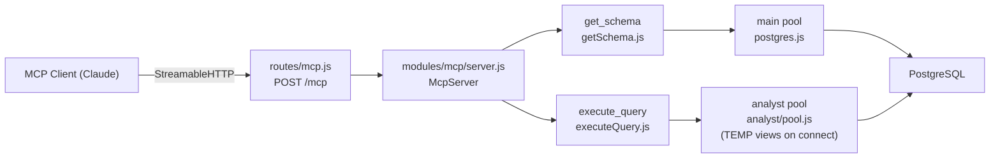
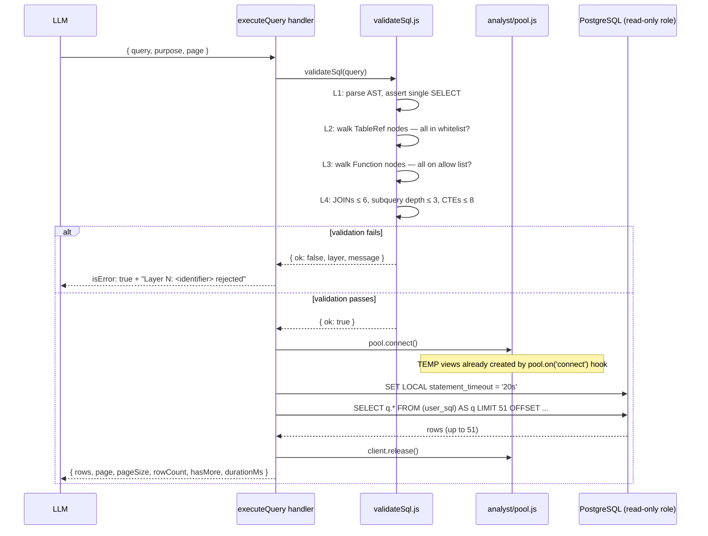

# MCP Risk Intelligence Tools — Specification

## Purpose

Exposes the procurement database to LLM agents as a safe, general-purpose analytical query interface. The agent
forms hypotheses about procurement fraud, tests them against real records, and iterates — like a human analyst
would. Pre-built result views are not the right model here: the LLM already knows bid-rigging patterns, OECD red
flags, shell-company signatures, and Benford's law. What it needs is the ability to look at the actual data and run
the investigation itself.

Two MCP tools provide this:

- **`get_schema`** — schema introspection so the LLM can write correct SQL
- **`execute_query`** — validated, sandboxed, audited SQL execution against a read-only analyst connection

---

## Architecture



The read-only analyst role cannot create the `v_*` helper views itself, so they are created as **persistent
views** by the admin pool (see `ensureViews.ts`); the analyst pool only runs read-only SELECTs against them. The
main pool is used only for `get_schema` schema introspection (no views needed there).

Key files:

- [`modules/mcp/tools/getSchema.js`](../../modules/mcp/tools/getSchema.js) — `get_schema` handler
- [`modules/mcp/tools/executeQuery.js`](../../modules/mcp/tools/executeQuery.js) — `execute_query` handler
- [`modules/mcp/analyst/pool.js`](../../modules/mcp/analyst/pool.js) — analyst `pg.Pool`, runs `TEMP_VIEWS_SQL` on
  connect
- [`modules/mcp/analyst/tempViews.js`](../../modules/mcp/analyst/tempViews.js) — six `CREATE TEMP VIEW` definitions
- [`modules/mcp/analyst/validateSql.js`](../../modules/mcp/analyst/validateSql.js) — multi-layer SQL guardrails

---

## Tool 1: `get_schema`

Returns schema for the procurement database. Uses the **main pool** — no sandbox needed for introspection.
Results are cached in-process for the lifetime of the server (schema is stable between deploys).

### `mode` parameter

| `mode`        | Returns                                       | Typical use                        |
|---------------|-----------------------------------------------|------------------------------------|
| `"inventory"` | `id`, `kind`, `tags`, `keys` for all entities | First call — entity routing        |
| `"detail"`    | Full columns + types, pk, joins, one example  | Before writing a multi-field query |
| `"columns"`   | Column name → type map only                   | Forgot a column name               |
| `"joins"`     | `pk` and `joins` tuples only                  | Building a multi-table join        |
| `"examples"`  | Example SQL only                              | Need a query template              |

Default is `"inventory"` when no `table` is given; `"detail"` when a `table` is given.

### Inventory response shape

```json
{
  "entities": [
    {
      "id": "v_company",
      "kind": "view",
      "tags": [
        "capacity",
        "blacklist",
        "labor",
        "domains",
        "court"
      ],
      "keys": [
        "jarKodas",
        "pavadinimas",
        "darbuotojai",
        "melagingisTiekejas",
        "bylosSkaicius"
      ]
    },
    {
      "id": "v_sutartys",
      "kind": "view",
      "tags": [
        "contracts",
        "buyer-supplier",
        "cpv",
        "value",
        "timing"
      ],
      "keys": [
        "sutartiesUnikalusId",
        "pirkejoKodas",
        "tiekejoKodas",
        "verte",
        "sudarymoData"
      ]
    },
    {
      "id": "sodra",
      "kind": "table",
      "keys": [
        "jarKodas",
        "data",
        "draustieji"
      ],
      "rowCountEstimate": 4200000
    }
  ]
}
```

Views appear first. `tags` are investigation-theme labels — the agent matches its current theme to a view tag
rather than reasoning from prose descriptions.

### Detail response shape

```json
{
  "id": "v_sutartys",
  "pk": [
    "sutartiesUnikalusId"
  ],
  "columns": {
    "sutartiesUnikalusId": "bigint",
    "pirkejoKodas": "text",
    "tiekejoKodas": "text",
    "verte": "numeric",
    "sudarymoData": "timestamp without time zone"
  },
  "joins": [
    [
      "pirkejoKodas",
      "v_company.jarKodas",
      "strict"
    ],
    [
      "tiekejoKodas",
      "v_company.jarKodas",
      "strict"
    ],
    [
      "pirkimoNumeris",
      "v_pirkimas.pirkimoId",
      "semantic"
    ]
  ],
  "ex": "SELECT \"sutartiesUnikalusId\", pirkejas, tiekejas, verte FROM v_sutartys WHERE ..."
}
```

### `joinType` semantics

| Value        | Meaning                                            |
|--------------|----------------------------------------------------|
| `"strict"`   | Enforced FK; safe for `INNER JOIN`                 |
| `"semantic"` | Logically related; may not have a matching row     |
| `"sparse"`   | FK exists but large fraction of rows have no match |

This prevents incorrect multi-table inferences in risk investigations (e.g. `v_sutartys.pirkimoNumeris →
v_pirkimas.pirkimoId` is semantic — contracts imported from the old CVP IS do not have a matching `"eppsViesiejiPirkimai"."pirkimai"`
row).

### View metadata

View column lists, join tuples, tags, and example queries are defined statically in
[`getSchema.js`](../../modules/mcp/tools/getSchema.js) as `VIEW_METADATA`. An `assertViewMetadataCompleteness()`
guard runs at module load and throws if any view entry is missing required fields — so a misconfigured deploy
fails fast rather than silently returning incomplete schema.

### Covered-table redirect

Tables that are fully covered by a view (`asmenys`, `sutartys`, `pirkimai`, `juridiniaiRysiaiPilni`,
`ppa."ataskaitos"`, `bylosDalyviai`) return a redirect message instead of raw column data:

> *"Table 'asmenys' is fully covered by view 'v_company'. Call get_schema with 'v_company' to see columns, joins,
> and an example query."*

The mapping is defined in [`tempViews.js`](../../modules/mcp/analyst/tempViews.js) as `COVERED_TABLES_BY_VIEWS`.

---

## Tool 2: `execute_query`

Accepts a SQL SELECT, validates it through a four-layer guardrail stack, executes it on the analyst connection
(which has TEMP views), and returns paginated results.

### Input schema

| Field     | Type                    | Default | Description                                  |
|-----------|-------------------------|---------|----------------------------------------------|
| `query`   | `string`, 10–3072 chars | —       | SQL SELECT to execute (required)             |
| `purpose` | `string`, 5–500 chars   | —       | Human-readable reason — audit log (required) |
| `page`    | `integer ≥ 1`           | `1`     | Page number (1-based). Page size fixed at 50 |

### Guardrail stack

```
+---------------------------------------+
|  1. SQL Parser (AST)                  |
|     node-sql-parser (PostgreSQL mode) |
|     - reject if not a single SELECT   |
|     - reject DDL, DML, COPY, etc.     |
|     - reject multiple statements      |
+---------------------------------------+
|  2. Table whitelist                   |
|     AST walk: every table reference   |
|     must be in TABLE_WHITELIST or     |
|     VIEW_NAMES (TEMP views). Rejects  |
|     pg_catalog, information_schema,   |
|     schema-qualified refs (db.table). |
+---------------------------------------+
|  3. Function whitelist (strict)       |
|     Reject any function NOT in the    |
|     allow list. Error names the       |
|     rejected function for LLM rewrite.|
+---------------------------------------+
|  4. Complexity limits                 |
|     - max JOIN count: 6               |
|     - max subquery depth: 3           |
|     - max CTE count: 8               |
|     - WITH RECURSIVE: rejected        |
+---------------------------------------+
```

Layers are independent and short-circuit on first failure. Implemented in
[`validateSql.js`](../../modules/mcp/analyst/validateSql.js) as a synchronous `validateSql(sql)` function that
returns `{ ok: true }` or `{ ok: false, layer, message }`.

### Execution wrapper

After validation, the query is wrapped before execution:

```sql
SELECT q.*
FROM (<user_sql>) AS q
LIMIT 51 OFFSET (<page> - 1) * 50
```

51 rows are fetched (one extra) to detect `hasMore` without a separate `COUNT(*)` round-trip. The extra row is
stripped before returning. `SET LOCAL statement_timeout = '20s'` is applied per query.

### Success response

```json
{
  "rows": [
    ...
  ],
  "page": 1,
  "pageSize": 50,
  "rowCount": 50,
  "hasMore": true,
  "durationMs": 214
}
```

| Field        | Description                            |
|--------------|----------------------------------------|
| `rows`       | Result rows for this page (at most 50) |
| `page`       | Page number echoed from input          |
| `pageSize`   | Always `50`                            |
| `rowCount`   | `rows.length`                          |
| `hasMore`    | `true` if a 51st row was detected      |
| `durationMs` | Query wall time in ms                  |

### Error response

```json
{
  "content": [
    {
      "type": "text",
      "text": "<message>"
    }
  ],
  "isError": true
}
```

Validation errors name the layer and the rejected identifier (e.g. `"Layer 2: Table 'pg_class' is not in the
allowed table list"`). Execution errors include the raw PostgreSQL error message so the LLM can self-correct.

### Validation decision table

| Input condition                         | Layer | Action                               |
|-----------------------------------------|-------|--------------------------------------|
| SQL parse fails                         | 1     | Return parser error                  |
| Multiple statements                     | 1     | "only a single SELECT is allowed"    |
| Statement type is not SELECT            | 1     | "only SELECT statements allowed"     |
| Table not in whitelist                  | 2     | Reject and name the blocked table    |
| Schema-qualified reference (`db.table`) | 2     | Reject                               |
| Function not on whitelist               | 3     | Reject and name the function         |
| JOIN count > 6                          | 4     | "too many JOINs (max 6)"             |
| Subquery depth > 3                      | 4     | "subquery nesting too deep (max 3)"  |
| CTE count > 8                           | 4     | "too many CTEs (max 8)"              |
| `WITH RECURSIVE` present                | 4     | Reject; recursive CTEs not allowed   |
| All layers pass                         | —     | Execute wrapped query                |

### Single-query execution flow



---

## Analytical Views

Six session-scoped `TEMP VIEW`s are created once per physical backend connection via the analyst pool's
`pool.on('connect')` hook. Definitions live in
[`tempViews.js`](../../modules/mcp/analyst/tempViews.js).

The LLM should use views for standard lookups; write directly against raw tables for window functions, CTEs, or
recursive graph traversal where full schema control is needed.

| View             | Tags                                                      | Main table               | Key additions                                                       |
|------------------|-----------------------------------------------------------|--------------------------|---------------------------------------------------------------------|
| `v_company`      | capacity, blacklist, labor, domains, court                | `asmenys` (rcJar)            | Latest Sodra snapshot (LATERAL), compliance flags, count subqueries |
| `v_sutartys`     | contracts, buyer-supplier, cpv, value, timing, frameworks | `sutartys`               | Buyer + seller names denormalized; `::text` cast on `jarKodas`      |
| `v_pirkimas`     | procedures, criteria, lot-count, single-bidder            | `pirkimai`               | Organizer name, municipality, short code                            |
| `v_person_links` | conflict-of-interest, directors, beneficial-owners        | `pinreg."juridiniaiRysiai"` | Company name joined; `irasoTipas` distinguishes role type           |
| `v_dalyviai`     | bid-ranking, rejections, co-bidding, single-bidder        | `ppa."ataskaitos"`      | Full bidder list with rank, bid amount, rejection reason            |
| `v_bylos`        | court, litigation, enforcement                            | `bylosDalyviai`          | Case metadata joined; company name denormalized                     |

`v_dalyviai` is the **only source of non-winner participants** in a procurement. `sutartys` records winners only;
bid-rigging and cover-bidding analysis requires this view.

Raw tables used directly (no covering view):

| Table                    | Why no view                                           |
|--------------------------|-------------------------------------------------------|
| `cpvaProjektuSutartys`   | CPVA subcontractor data — join shape varies per query |
| `domenai`                | Domain pair queries need flexible self-join           |
| `sutikimai` (arba `sutikimaiPilni`) | VPT sutikimai neskelbiamoms deryboms; išvada – `isvados` žodyne |
| `pinreg."juridiniaiRysiai"` | Revolving-door queries need self-join on date ranges |

---

## Table Whitelist

All tables accessible to `execute_query` (Layer 2) and queryable by the analyst PostgreSQL role:

```
vpmSutartys: atviriDuomenys, atviriDuomenysImp, atviriDuomenysPilni, atviriDuomenysImpPilni, atviriTiekejai, atviriPirkejai, atviriCpvKodai, atviriObjektai, atviriValstybes, atviriPirkimoBudai
rcJar: asmenys, spintaAsmenys (data.gov.lt/Spinta), spintaKapitalas (įstatinis kapitalas per Spintą)
eppsViesiejiPirkimai: pirkimai, vykdytojai
pinreg: deklaracijos, juridiniaiRysiai, juridiniaiRysiaiPilni, rysiuPobudziai, teisinesFormos
failai
sabis: sutartys, sutarciuSalys, saskaitos, saskaituSalys
cpvaProjektuSutartys, cpvaProjektuSarasas
cvpp: archyvoSkelbimai (CVPP archyvas)
eiluciuSkaiciai | bvpz: kodai (BVPŽ/CPV)
sodra | regitra: priemoniuTipai, matymai, atnaujinimai
vptJuodiejiSarasai: tiekejai, pagrindimai, sarasai (VPT juodieji sąrašai)
jadis: suvestine, dalyviuSkaiciai, dalyviuSarasai, valstybesDalyviai | rcInformaciniaiPranesimai: pranesimai, pranesimaiPilni, juridiniuPavadinimai, leidiniai
domenai, kotis
adpFinansinesAtaskaitos: balansoEilutes, pelnoNuostoliuEilutes
uzt: darboVietos, darboVietosPilnos, darbdaviai, profesijos, profesijuGrupes, issilavinimai, mokymoProgramos
ppa: ataskaitos, dalyviai, pasiulymuEile, atmestiPasiulymai
neskelbiamosDerybos: sutikimai, isvados, sutikimaiPilni
vdiPazeidimai
bylos, bylosDalyviai
vmi: mokesciai, mokesciaiPilni
```

Plus the six TEMP view names. The in-code `TABLE_WHITELIST` in
[`validateSql.js`](../../modules/mcp/analyst/validateSql.js) must be kept in sync with the analyst role's actual
grants.

---

## Function Whitelist

Layer 3 rejects any function **not** in this set. Add reactively when the LLM hits a legitimate wall during
investigation; do not weaken the gate by adding broad categories.

| Category      | Allowed                                                                                                                                                                                                                                                                                                                           |
|---------------|-----------------------------------------------------------------------------------------------------------------------------------------------------------------------------------------------------------------------------------------------------------------------------------------------------------------------------------|
| Aggregates    | `count`, `sum`, `avg`, `min`, `max`, `stddev`, `stddev_pop`, `stddev_samp`, `variance`, `var_pop`, `var_samp`, `bool_and`, `bool_or`, `every`, `string_agg`, `array_agg`, `jsonb_agg`, `json_agg`, `percentile_cont`, `percentile_disc`, `mode`                                                                                   |
| Window        | `row_number`, `rank`, `dense_rank`, `percent_rank`, `cume_dist`, `ntile`, `lag`, `lead`, `first_value`, `last_value`, `nth_value`                                                                                                                                                                                                 |
| Conditional   | `coalesce`, `nullif`, `greatest`, `least`                                                                                                                                                                                                                                                                                         |
| Math          | `round`, `abs`, `ceil`, `ceiling`, `floor`, `trunc`, `sign`, `mod`, `power`, `sqrt`, `exp`, `ln`, `log`, `div`                                                                                                                                                                                                                    |
| Date / time   | `now`, `current_date`, `current_timestamp`, `date_trunc`, `date_part`, `extract`, `age`, `to_char`, `to_date`, `to_timestamp`, `make_date`, `make_interval`, `justify_interval`                                                                                                                                                   |
| String        | `upper`, `lower`, `length`, `char_length`, `trim`, `ltrim`, `rtrim`, `btrim`, `substring`, `substr`, `left`, `right`, `concat`, `concat_ws`, `replace`, `split_part`, `position`, `strpos`, `lpad`, `rpad`, `regexp_match`, `regexp_matches`, `regexp_replace`, `regexp_split_to_array`, `regexp_split_to_table`, `format`, `md5` |
| Array         | `unnest`, `array_length`, `array_position`, `array_remove`, `array_replace`, `cardinality`, `string_to_array`, `array_to_string`                                                                                                                                                                                                  |
| JSON          | `jsonb_build_object`, `json_build_object`, `jsonb_build_array`, `jsonb_object_keys`, `jsonb_array_elements`, `jsonb_array_elements_text`, `jsonb_extract_path`, `jsonb_extract_path_text`                                                                                                                                         |
| Set-returning | `generate_series`                                                                                                                                                                                                                                                                                                                 |

Never allowed: `pg_read_file`, `pg_read_binary_file`, `pg_ls_dir`, `dblink*`, `lo_*`, `pg_sleep*`, `set_config`,
`current_setting`, `pg_terminate_backend`, `pg_cancel_backend`, `pg_advisory_*`, any `pg_*` admin function.

---

## Investigation Flow Example

A typical agent investigation against a suspected bid-rigging ring:

**Step 1 — Find the company**

```
get_schema() → inventory → pick v_company
search_juridiniai(search: "Greitas Statyba") → jarKodas: 304567890
```

**Step 2 — Capacity and compliance profile**

```sql
SELECT "jarKodas",
       pavadinimas,
       darbuotojai,
       "vidutinisAtlyginimas",
       "melagingisTiekejas",
       "nepatikimasTiekejas",
       "vdiPazeidimuSkaicius",
       "bylosSkaicius"
FROM v_company
WHERE "jarKodas" = '304567890'
```

**Step 3 — Contract volume trend and cost overrun**

```sql
SELECT DATE_TRUNC('year', "sudarymoData")::date AS metai, COUNT(*) AS sutarciu_sk,
       ROUND(SUM(verte) / 1000) AS                                      verte_tukst,
       ROUND(SUM("faktineIvykdimoVerte") / NULLIF(SUM(verte), 0), 2) AS virsijimo_koef,
       pirkejas
FROM v_sutartys
WHERE "tiekejoKodas" = '304567890'
  AND istrinta IS NOT TRUE
GROUP BY metai, pirkejas
ORDER BY metai
```

**Step 4–8** follow the same pattern: procedure mix from `v_pirkimas`, win rate and cover-bidding from
`v_dalyviai` (using `RANK() OVER (PARTITION BY "pirkimoNumeris" ORDER BY "pasiulymoKaina")`), person links from
`v_person_links` (self-join to find shared directors), court exposure from `v_bylos`.

---

## Auditing

Every tool call is logged via the existing `logToolCall` wrapper in `server.js`, which writes to the
`mcp."toolCalls"` table. That table holds only facts (`durationMs`, `success`, `createdAt`) plus references
into the dictionary tables `mcp."toolName"`, `mcp."userAgent"` and `mcp."errorMsg"`, so
reading the audit log means joining those three (DDL: `mcpSchema.sql`). Each row
is also queued for Quickwit indexing in `mcp."indexQueue"`. The `purpose` field from
`execute_query` becomes a human-readable narrative of the investigation in the audit log. No additional
audit infrastructure is needed.

---

## Connection Lifecycle

The analyst pool fires `pool.on('connect', client => client.query(TEMP_VIEWS_SQL))` so the six TEMP views are
created **once per physical backend connection**. TEMP views are session-scoped and disappear automatically when
the connection closes — no cleanup needed, and the views are not re-created on every query.

Config keys required (`config.js` / `config.sample.js`):

```js
pgAnalystUser: "...",            // existing read-only role
    pgAnalystPassword
:
"...",
    pgAnalystPort
:
9118,             // PG port
    pgAnalystMaxConnections
:
5,      // role is capped at 5 connections
```


# PG config

```sql
-- Rolė
CREATE ROLE analyst LOGIN PASSWORD 'CHANGE_ME';

-- Defense-in-depth: nieko nesuteikiame pagal nutylėjimą
REVOKE ALL ON DATABASE viespirkiai FROM analyst;
REVOKE ALL ON SCHEMA public FROM analyst;

-- Prieiga prie DB ir schemos
GRANT CONNECT, TEMPORARY ON DATABASE viespirkiai TO analyst;
GRANT USAGE ON SCHEMA public TO analyst;
GRANT USAGE ON SCHEMA sodra TO analyst;   -- kaip ir domenai/liteko/vdi
GRANT USAGE ON SCHEMA ppa TO analyst;
GRANT USAGE ON SCHEMA cvpp TO analyst;
GRANT USAGE ON SCHEMA "eppsViesiejiPirkimai" TO analyst;
GRANT USAGE ON SCHEMA "rcJar" TO analyst;
GRANT USAGE ON SCHEMA sabis TO analyst;
GRANT USAGE ON SCHEMA regitra TO analyst;
GRANT USAGE ON SCHEMA "rcInformaciniaiPranesimai" TO analyst;
GRANT USAGE ON SCHEMA jadis TO analyst;
GRANT USAGE ON SCHEMA "adpFinansinesAtaskaitos" TO analyst;
GRANT USAGE ON SCHEMA vmi TO analyst;
GRANT USAGE ON SCHEMA uzt TO analyst;
GRANT USAGE ON SCHEMA "vptJuodiejiSarasai" TO analyst;
GRANT USAGE ON SCHEMA "vpmSutartys" TO analyst;
GRANT USAGE ON SCHEMA bvpz TO analyst;
GRANT USAGE ON SCHEMA pinreg TO analyst;
GRANT USAGE ON SCHEMA "neskelbiamosDerybos" TO analyst;
GRANT USAGE ON SCHEMA cpva TO analyst;

-- SELECT ant whitelistintų lentelių (iš validateSql.ts TABLE_WHITELIST)
GRANT SELECT ON
    "rcJar"."asmenys",
    "vpmSutartys"."atviriDuomenys", "vpmSutartys"."atviriDuomenysImp",
    "vpmSutartys"."atviriDuomenysPilni", "vpmSutartys"."atviriDuomenysImpPilni",
    "vpmSutartys"."atviriTiekejai", "vpmSutartys"."atviriPirkejai",
    "vpmSutartys"."atviriCpvKodai", "vpmSutartys"."atviriObjektai",
    "vpmSutartys"."atviriValstybes", "vpmSutartys"."atviriPirkimoBudai",
    "rcJar"."spintaAsmenys", "rcJar"."spintaKapitalas",
    "eppsViesiejiPirkimai"."pirkimai", "eppsViesiejiPirkimai"."vykdytojai",
    pinreg."deklaracijos", pinreg."juridiniaiRysiai", pinreg."juridiniaiRysiaiPilni",
    pinreg."rysiuPobudziai", pinreg."teisinesFormos", sabis."sutartys", sabis."sutarciuSalys", sabis."saskaitos",
    sabis."saskaituSalys", sabis."saskaituSalysTipai", sabis."saskaituSalysVeiklosVieta",
    cpva."projektai", cpva."projektaiPilni", cpva."projektuLesos",
    cpva."pirkimuSutartys", cpva."pirkimuSutartysPilnos", cpva."organizacijos",
    cpva."institucijos", cpva."busenos", cpva."apskritys",
    cpva."igyvendinimoVietos", cpva."lesuStraipsniai", cpva."pirkimuBudai",
    cpva."objektuRusys", cpva."subjektuStatusai", cvpp."archyvoSkelbimai",
    "eiluciuSkaiciai", bvpz."kodai",
    sodra."menesiniai", sodra."evrk", sodra."importai",
    sodra."pavadinimai", sodra."savivaldybes",
    regitra."priemoniuTipai", regitra."matymai", regitra."atnaujinimai",
    "vptJuodiejiSarasai"."tiekejai", "vptJuodiejiSarasai"."pagrindimai",
    "vptJuodiejiSarasai"."sarasai",
    jadis."suvestine", jadis."dalyviuSkaiciai", jadis."dalyviuSarasai", jadis."valstybesDalyviai",
    "rcInformaciniaiPranesimai"."pranesimai", "rcInformaciniaiPranesimai"."pranesimaiPilni",
    "rcInformaciniaiPranesimai"."juridiniuPavadinimai", "rcInformaciniaiPranesimai"."leidiniai",
    "domenai", "kotis",
    "adpFinansinesAtaskaitos"."balansoEilutes", "adpFinansinesAtaskaitos"."pelnoNuostoliuEilutes",
    uzt."darboVietos", uzt."darboVietosPilnos", uzt."darbdaviai",
    uzt."profesijos", uzt."profesijuGrupes", uzt."savivaldybes",
    uzt."issilavinimai", uzt."mokymoProgramos", uzt."statusai", uzt."valiutos",
    uzt."registravimoPagrindai", uzt."registravimoBudai", uzt."pageidavimoBudai",
    uzt."susisiekimoBudai", uzt."rizikos", uzt."gebejimai",
    uzt."teisiniaiStatusai", uzt."teisinesFormos", uzt."kontraktuTipai",
    "neskelbiamosDerybos"."sutikimai", "neskelbiamosDerybos"."isvados",
    "neskelbiamosDerybos"."sutikimaiPilni", "vdiPazeidimai",
    "teismoNuosprendziai", "teismoNuosprendziaiDalyviai",
    vmi."mokesciai", vmi."mokesciaiPilni",
    ppa."ataskaitos", ppa."dalyviai", ppa."ataskaituSutartys",
    ppa."pasiulymuEile", ppa."atmestiPasiulymai"
TO analyst;

-- v_* view'us sukuria ir SELECT teises jiems suteikia ensureViews.ts (admin pool'u).
-- Jei programa jungiasi rolė BE DDL teisių, view'us reikia sukurti/atnaujinti admin'u
-- rankiniu būdu (modules/mcp/analyst/views/*.sql) — ensureViews tada tik pasitikrina,
-- kad esami view'ai nuskaitomi.

-- Saugiklis: išjungti įrašymą net jei kažkas suteiks per error
ALTER ROLE analyst SET default_transaction_read_only = on;

-- (Pasirinktinai) griežtesnis pool-wide timeout
ALTER ROLE analyst SET statement_timeout = '180s';

-- Iškeltos schemos matomos nekvalifikuotai (menesiniai, pazeidimai, domenai ir t. t.)
ALTER ROLE analyst SET search_path = public, viespirkiai, domenai, ppa, sabis, regitra, jadis, vmi, uzt, bvpz, pinreg, "vptJuodiejiSarasai", "vpmSutartys", "adpFinansinesAtaskaitos", "eppsViesiejiPirkimai", liteko, vdi, sodra, cvpp, "rcJar", "rcInformaciniaiPranesimai", "neskelbiamosDerybos", cpva;
```
