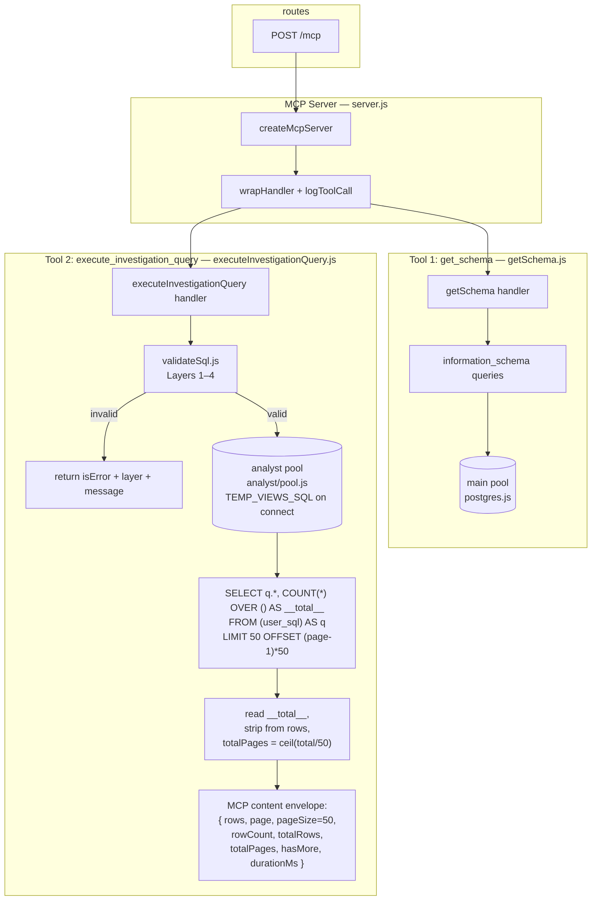
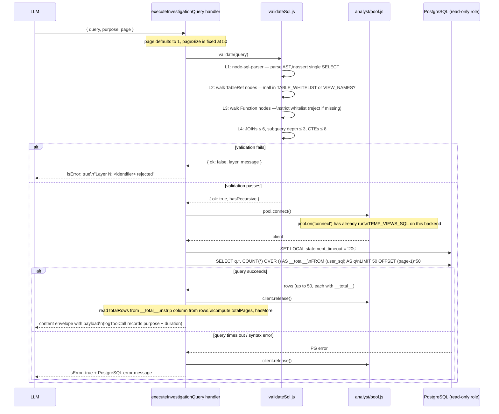

# MCP Risk Intelligence Tool — Proposal

> **Beta release scope.** During beta we have **only a pre-existing read-only PostgreSQL user** (no DDL, no role
> creation, no new tables, no permanent views). Helper views are session-scoped TEMP VIEWs created on every
> connection acquire. Audit logging reuses the existing `mcpToolCalls` table written by `logToolCall`. After beta,
> the helper views will be promoted to permanent views in the database and DDL-dependent items (custom role,
> dedicated audit table, `ALTER ROLE … SET …`) become available.

## The insight

A human says: *"This company feels off — they keep winning government contracts in my town and they only have 2
employees."*

The human is **not** a researcher. They won't write queries. They won't pick from a menu of pre-built risk patterns.
They have **intuition** and **context** that no database has.

The LLM already knows:

- What bid rigging looks like
- What shell company patterns look like
- What conflict-of-interest networks look like
- OECD red flag indicators, academic fraud typologies, Benford's law, etc.

What the LLM **lacks** is the ability to **look at the actual data** and run the investigation itself. It needs to form
hypotheses and test them against real records — iteratively, like an analyst would.

Pre-built materialized views kill this. They assume you know the questions in advance. The whole point is that you
don't. The human brings the smell, the LLM brings the methodology, and the data brings the truth.

Viespirkiai is a **data provider, not a fraud research lab**. Encoding every fraud pattern into SQL views is neither
sustainable nor scalable — that knowledge lives in the LLM and evolves with every model update. Patterns change, new
fraud typologies emerge, and LLMs get smarter. The tool must let the intelligence evolve without code changes.

---

## Approach: safe, general-purpose analytical query interface

One MCP tool that gives the LLM **read-only, constrained, audited SQL access** to the procurement database. Not a menu
of queries. Not a DSL. The LLM writes SQL, the tool validates and executes it safely.

### Why SQL is the right interface

- The LLM already writes excellent SQL. No training needed.
- SQL is the only language expressive enough to cover filtering, aggregation, window functions, graph traversal (
  recursive CTEs), and statistical analysis in one syntax.
- Any custom DSL (EBNF, predicate logic, rule engine) will be strictly less expressive than SQL, and takes months to
  build what PostgreSQL already does.
- Every BI/analytics platform (Metabase, Redash, Superset, Databricks) solved this same problem the same way:
  constrained SQL execution.

### What the LLM needs to do during an investigation

1. **Explore the schema** — "what columns does `sutartys` have?"
2. **Run analytical queries** — "aggregate contract values by supplier, joined with sodra employee counts"
3. **Traverse relationships** — "who are the people linked to this company, and what other companies are they linked
   to?"
4. **Iterate** — the answer to query 1 informs query 2 informs query 3

This is an **agentic investigation loop**, not a single tool call.

---

## The two MCP tools

### Tool 1: `get_schema`

Safe, simple, no risk. Returns table structure so the LLM can write correct SQL.

```
tool: get_schema
table: "sutartys" | "jarCsv" | "pinregJuridiniaiRysiai" | ...
```

Returns: column names, types, nullable, sample values (first 3 rows), row count. Data sourced from `information_schema`
filtered to the whitelist.

The LLM calls this at the start of an investigation to understand what data is available and how tables relate.

### Tool 2: `execute_investigation_query`

The analytical workhorse. Accepts a SQL SELECT, validates it through a multi-layer guardrail stack, executes it on a
sandboxed read-only connection, and returns results.

```
tool: execute_investigation_query
query: "SELECT ..."
purpose: "Testing hypothesis: supplier X has abnormally high win rate relative to competitors"
```

The `purpose` field is for **audit logging**, not validation — it creates a human-readable trail of why each query was
run.

---

## Guardrail stack

Six layers of defense. Each layer is independent — even if one fails, the others catch it.

```
+---------------------------------------+
|  1. SQL Parser (AST)                  |
|     node-sql-parser / pgsql-parser    |
|     - reject if not a single SELECT   |
|     - reject DDL, DML, COPY, etc.     |
|     - reject multiple statements      |
+---------------------------------------+
|  2. Table/column whitelist            |
|     - AST walk: every table reference |
|       must be in the allowed set      |
|     - block pg_catalog, information_  |
|       schema from direct access       |
|     - block sensitive columns if any  |
+---------------------------------------+
|  3. Function whitelist (strict)       |
|     Reject any function NOT in the    |
|     allow list below.                 |
|     See "Allowed functions" table.    |
+---------------------------------------+
|  4. Complexity limits                 |
|     - max JOIN count: 6               |
|     - max subquery depth: 3           |
|     - max CTE count: 8                |
|     - WITH RECURSIVE allowed; flagged |
|       in audit log                    |
+---------------------------------------+
|  5. Execution sandbox                 |
|     - existing read-only PG role      |
|       (max 5 connections)             |
|     - SET LOCAL statement_timeout =   |
|       '20s' at session start          |
|       (capped by role default if      |
|        admin set lower)               |
|     - row limit enforced via wrapper: |
|       SELECT *, COUNT(*) OVER ()      |
|       AS __total__                    |
|       FROM (...user SQL...) AS q      |
|       LIMIT 50 OFFSET (page-1)*50     |
+---------------------------------------+
|  6. Audit log                         |
|     - every query logged via existing |
|       logToolCall → mcpToolCalls      |
|       (input.purpose + input.query    |
|        already captured)              |
+---------------------------------------+
```

### Read-only PostgreSQL role (existing)

A read-only role with `SELECT` on the analytical tables already exists in the database — **no DDL is required for
beta**. The MCP tool simply connects as this user. The application maintains the in-code `TABLE_WHITELIST` (used by
Layer 2) in lockstep with the role's actual grants:

```
sutartys, sutartysAtviriDuomenys, sutartysAtviriDuomenysImp,
jarCsv, jar,
viesiejiPirkimai, viesiejiPirkimaiVykdytojai,
pinregJuridiniaiRysiai, pinreg,
failai,
sabisSutartys, sabisSutarciuSalys, sabisSaskaitos, sabisSaskaituSalys,
cpvaProjektuSutartys, cpvaProjektuSarasas,
cvppViesiejiPirkimai,
eiluciuSkaiciai, bvpzKodai,
sodra, regitra,
nepatikimiTiekejai, melagingiTiekejai,
jadis, rcInformaciniaiLeidiniaiPranesimai,
domenai, kotis,
balansoAtaskaitos, pelnoNuostoliuAtaskaitos,
darboVieta, istatinisKapitalas,
atn1ataskaitos, atn1dalyviai, atn1pasiulymuEile, atn1atmestiPasiulymai,
neskelbiamosDerybos,
vdiPazeidimai,
bylos, bylosDalyviai,
mokesciai
```

Plus the six TEMP view names (Layer 2 also accepts these): `v_company`, `v_sutartys`, `v_pirkimas`,
`v_person_links`, `v_dalyviai`, `v_bylos`.

Resource limits (`statement_timeout`, `work_mem`) inherit whatever the existing role has. The handler additionally
runs `SET LOCAL statement_timeout = '20s'` per query — PostgreSQL silently caps this if the role default is lower.

### Allowed functions (Layer 3 — strict whitelist)

Every function reference in the parsed AST must be in this set. Anything else is rejected. The set is sized to
cover all SQL examples in this proposal and `mcp-investigator-questions.md`; extend it reactively as the LLM hits
walls during beta.

| Category               | Allowed                                                                                                                                                                                                                                                                                                                           |
|------------------------|-----------------------------------------------------------------------------------------------------------------------------------------------------------------------------------------------------------------------------------------------------------------------------------------------------------------------------------|
| Aggregates             | `count`, `sum`, `avg`, `min`, `max`, `stddev`, `stddev_pop`, `stddev_samp`, `variance`, `var_pop`, `var_samp`, `bool_and`, `bool_or`, `every`, `string_agg`, `array_agg`, `jsonb_agg`, `json_agg`, `percentile_cont`, `percentile_disc`, `mode`                                                                                   |
| Window                 | `row_number`, `rank`, `dense_rank`, `percent_rank`, `cume_dist`, `ntile`, `lag`, `lead`, `first_value`, `last_value`, `nth_value`                                                                                                                                                                                                 |
| Conditional            | `coalesce`, `nullif`, `greatest`, `least`                                                                                                                                                                                                                                                                                         |
| Math                   | `round`, `abs`, `ceil`, `ceiling`, `floor`, `trunc`, `sign`, `mod`, `power`, `sqrt`, `exp`, `ln`, `log`, `div`                                                                                                                                                                                                                    |
| Date / time            | `now`, `current_date`, `current_timestamp`, `date_trunc`, `date_part`, `extract`, `age`, `to_char`, `to_date`, `to_timestamp`, `make_date`, `make_interval`, `justify_interval`                                                                                                                                                   |
| String                 | `upper`, `lower`, `length`, `char_length`, `trim`, `ltrim`, `rtrim`, `btrim`, `substring`, `substr`, `left`, `right`, `concat`, `concat_ws`, `replace`, `split_part`, `position`, `strpos`, `lpad`, `rpad`, `regexp_match`, `regexp_matches`, `regexp_replace`, `regexp_split_to_array`, `regexp_split_to_table`, `format`, `md5` |
| Array                  | `unnest`, `array_length`, `array_position`, `array_remove`, `array_replace`, `cardinality`, `string_to_array`, `array_to_string`                                                                                                                                                                                                  |
| JSON                   | `jsonb_build_object`, `json_build_object`, `jsonb_build_array`, `jsonb_object_keys`, `jsonb_array_elements`, `jsonb_array_elements_text`, `jsonb_extract_path`, `jsonb_extract_path_text`                                                                                                                                         |
| Set returning          | `generate_series`                                                                                                                                                                                                                                                                                                                 |
| Type / casting helpers | `cast` (AST node, not a function call), implicit `::type` casts (allowed by parser, not on this list)                                                                                                                                                                                                                             |

Explicitly **never** allowed (would otherwise sneak in via lookup): `pg_read_file`, `pg_read_binary_file`,
`pg_ls_dir`, `dblink`, `dblink_*`, `lo_import`, `lo_export`, `lo_*`, `pg_sleep`, `pg_sleep_for`, `set_config`,
`current_setting`, `pg_terminate_backend`, `pg_cancel_backend`, `pg_advisory_*`, `copy`, any `pg_*` admin
function. The whitelist is the gate; this list is documentation of intent only.

---

## Subject-matter temporary views

Six `CREATE TEMP VIEW` statements executed at connection open time (session-scoped, no DDL privileges needed).
**Beta only** — after beta these will be promoted to permanent views in the database and the temp-view machinery
removed. They solve the three recurring pain points across all investigation queries:

- `jarCsv.jarKodas` is `integer`; all FK columns are `text` — every join needs `::text` cast
- Latest Sodra snapshot requires `ORDER BY data DESC NULLS LAST LIMIT 1` per company
- Common multi-table joins are re-derived from scratch each investigation

The LLM uses views for simple lookups and profile queries; it writes directly against the raw tables for window
functions, CTEs, and recursive graph traversal where full expressiveness is needed.

**Coverage map against the 22 investigator themes:**

| View             | Themes covered            | Main Table               | Joined Data                                                                                                                                                              | Additional table data included                                                                                                                                         | Critical facts provided                                                                                                                                |
|------------------|---------------------------|--------------------------|--------------------------------------------------------------------------------------------------------------------------------------------------------------------------|------------------------------------------------------------------------------------------------------------------------------------------------------------------------|--------------------------------------------------------------------------------------------------------------------------------------------------------|
| `v_company`      | 1, 5, 6, 7, 9, 10, 11, 12 | `jarCsv`                 | `sodra` (LATERAL for latest snapshot), `melagingiTiekejai`, `nepatikimiTiekejai`, `vdiPazeidimai`, `bylosDalyviai`, `domenai`, `neskelbiamosDerybos` (EXISTS subqueries) | Latest Sodra snapshot (headcount, avg salary, social tax), compliance flags (blacklists, VDI violations), court case count, domain count, negotiated-procurement count | headcount, registration, compliance flags, domain/court/negotiation counts — enables capacity mismatch detection                                       |
| `v_sutartys`     | 1, 2, 3, 5, 8, 15, 18     | `sutartys`               | `jarCsv` (×2: LEFT JOIN for buyer & seller names)                                                                                                                        | Buyer and seller names resolved; contract type (`tipas`), BVPZ code                                                                                                    | contract value, cost overrun ratio, procedure type alignment — enables price suppression and execution risk analysis                                   |
| `v_pirkimas`     | 5, 6, 7, 20               | `viesiejiPirkimai`       | `viesiejiPirkimaiVykdytojai` (LEFT JOIN for organizer details)                                                                                                           | Organizer name, municipality, short code; estimated value in EUR                                                                                                       | procedure type, contracting authority municipality, estimated value — enables procedure pattern analysis                                               |
| `v_person_links` | 4, 10, 11, 13, 19         | `pinregJuridiniaiRysiai` | `jarCsv` (LEFT JOIN for company names)                                                                                                                                   | Declared relationships, role type (`irasoTipas`), date ranges, foreign entity flag                                                                                     | person ↔ company edges, spouse links (via `irasoTipas`), role type, foreign-entity flag — enables network graph traversal and revolving-door detection |
| `v_dalyviai`     | **2, 3, 14, 17**          | `atn1ataskaitos`         | `atn1dalyviai`, `atn1pasiulymuEile`, `atn1atmestiPasiulymai` (JOIN/LEFT JOIN), `jarCsv` (LEFT JOIN for bidder names)                                                     | Bid amounts, bid rank (`eileNumeris`), rejection reason per proposal                                                                                                   | full bidder list, bid amounts, rank — essential for bid rigging/spec rigging/cartel pattern detection; **only source of non-winner participants**      |
| `v_bylos`        | **9**                     | `bylosDalyviai`          | `bylos` (JOIN for case metadata), `jarCsv` (LEFT JOIN for company names)                                                                                                 | Court case type (`bylosRusis`), court name, defendant role (`bylojeKaip`), case date                                                                                   | court cases per company, role (plaintiff/defendant), case type — blind spot without this view; enables legal liability and conduct-risk profiling      |

Raw tables used directly (no view wrapper needed):

| Table                    | Themes | Why no view                                                                     |
|--------------------------|--------|---------------------------------------------------------------------------------|
| `cpvaProjektuSutartys`   | 12     | CPVA subcontractor data — join shape varies per query                           |
| `pinregJuridiniaiRysiai` | 13, 19 | Revolving door needs self-join on date ranges — view would fix too many columns |
| `domenai`                | 16     | Domain pair queries need flexible self-join                                     |
| `neskelbiamosDerybos`    | 20     | Audit findings — single-table lookup, no join needed                            |

### `v_company` — company profile with latest headcount and compliance status

See [`modules/mcp/analyst/tempViews.js`](../modules/mcp/analyst/tempViews.js) (view definition, lines 2–40).

**Purpose**: Single-query company risk profile combining registration, latest Sodra data (headcount, wages, social tax),
blacklist status, court case count, domain ownership count, and negotiated-procurement involvement. Solves Themes 1,
5–7, 9–12.

### `v_sutartys` — contracts with buyer and seller names resolved

See [`modules/mcp/analyst/tempViews.js`](../modules/mcp/analyst/tempViews.js) (view definition, lines 42–60).

**Purpose**: Contract registry with buyer and seller names denormalized. Handles type casting (`jarKodas::text`) and
name resolution so analysts don't need to re-join `jarCsv` on every query. Solves Themes 1–3, 5, 8, 15, 18.

### `v_pirkimas` — procurement notices with organizer details

See [`modules/mcp/analyst/tempViews.js`](../modules/mcp/analyst/tempViews.js) (view definition, lines 62–79).

**Purpose**: Procurement notice registry with organizer (contracting authority) details denormalized. Enables filtering
by procedure type, municipality, and estimated value. Solves Themes 5–7, 20.

### `v_person_links` — declared person-to-company relationships with company name

See [`modules/mcp/analyst/tempViews.js`](../modules/mcp/analyst/tempViews.js) (view definition, lines 81–99).

**Purpose**: Person-to-company relationships from PINREG declarations with company names denormalized. `irasoTipas`
distinguishes director roles, spouse links, and other relationships. Solves Themes 4, 10–11, 13, 19 (network traversal,
revolving door, family ties).

### `v_dalyviai` — full bidder list per procurement with ranked bid amounts

See [`modules/mcp/analyst/tempViews.js`](../modules/mcp/analyst/tempViews.js) (view definition, lines 101–119).

**Purpose**: **Only source of all tender participants** (not just winners). Includes bid rank (`eileNumeris`), bid
amount, rejection reason, and bidder compliance flags. Without this view, Themes 2–3 (bid rigging, bid rotation) and 14,
17 (cartel detection, price suppression) are impossible — `sutartys` records winners only. Critical for cover-bidding
pattern detection.

### `v_bylos` — court cases with company and person participants

See [`modules/mcp/analyst/tempViews.js`](../modules/mcp/analyst/tempViews.js) (view definition, lines 121–133).

**Purpose**: Court case registry linking companies and individuals as plaintiffs, defendants, or third parties. Combines
case metadata (`bylosRusis`, `teismas`, `data`) with company names denormalized from `jarCsv`. Solves Theme 9 (legal
liability) — a critical blind spot without this view.

### Connection lifecycle

The analyst pool registers a `pool.on('connect', client => client.query(TEMP_VIEWS_SQL))` hook so the six TEMP
views are created **once per physical backend connection**. Because TEMP views are session-scoped they disappear
automatically when the backend connection closes — no cleanup needed, and the views aren't recreated on every
query (which would fail with "relation already exists" on connection reuse).

If `pool.on('connect')` proves fragile in beta, a safe fallback is to wrap each statement as
`CREATE OR REPLACE TEMP VIEW …` (PostgreSQL 14+) and execute the block before each user query.

---

## Investigation session example

A human says: *"UAB Greitas Statyba keeps winning road contracts in Kaunas. They seem tiny. Something feels off."*

The LLM agent receives this and begins an investigation loop:

### Step 1 — Identify the company

```
Tool: search_juridiniai
search: "Greitas Statyba"
→ jarKodas: 304567890, pavadinimas: UAB Greitas Statyba, registered: 2019-03-11, Kaunas
```

### Step 2 — Full risk profile in one shot (`v_company`)

**Tool**: `execute_investigation_query`  
**Purpose**: "Capacity, compliance flags, court exposure, and domain footprint for the target company"

```sql
SELECT "jarKodas",
       pavadinimas,
       "registravimoData",
       "statusoPavadinimas",
       "sodraData",
       darbuotojai,
       "vidutinisAtlyginimas",
       "imokuSuma",
       "melagingisTiekejas",
       "nepatikimasTiekejas",
       "vdiPazeidimuSkaicius",
       "bylosSkaicius",
       "domenaiSkaicius",
       "neskelbiamosDerybosSkaicius"
FROM v_company
WHERE "jarKodas" = '304567890';
```

*→ 3 employees (Sodra 202412), avg salary €1,850, compliance: clean, court cases: 2, domains: 0,
negotiated-without-publication appearances: 0*

*LLM notes: Company is 5 years old, 3 employees, no blacklist flags. Two court cases worth investigating. Capacity to
deliver road construction at this scale is implausible.*

### Step 3 — Contract history by year with cost overrun ratio (`v_sutartys`)

**Tool**: `execute_investigation_query`  
**Purpose**: "Contract volume trend and execution overruns — is the company growing or was it born ready?"

```sql
SELECT DATE_TRUNC('year', "sudarymoData")::date                                    AS metai, COUNT(*) AS sutarciu_sk,
       ROUND(SUM(verte) / 1000)                                      AS verte_tukst,
       ROUND(SUM("faktineIvykdimoVerte") / 1000)                     AS faktine_tukst,
       ROUND(SUM("faktineIvykdimoVerte") / NULLIF(SUM(verte), 0), 2) AS virsijimo_koef,
       pirkejas
FROM v_sutartys
WHERE "tiekejoKodas" = '304567890'
  AND istrinta IS NOT TRUE
GROUP BY metai, pirkejas
ORDER BY metai;
```

*→ 2020: 5 contracts €890K (×1.02, buyer: Kauno miesto savivaldybė)*  
*→ 2021: 11 contracts €2.1M (×1.28)*  
*→ 2022: 14 contracts €3.8M (×1.41)*  
*→ 2023: 17 contracts €5.5M (×1.52)*

*LLM notes: Contract volume grows 6× in four years; overrun ratio worsening each year — classic low-ball-then-escalate.
Same buyer every time.*

### Step 4 — Does the buyer favour non-competitive procedures? (`v_pirkimas`)

**Tool**: `execute_investigation_query`  
**Purpose**: "Procedure type breakdown for the contracting authority — how often do they bypass open tender?"

```sql
SELECT "pirkimoBudas",
       COUNT(*)                       AS pirkimu_sk,
       ROUND(SUM("numatomaVerteEUR")) AS bendra_verte_eur
FROM v_pirkimas
WHERE "jarKodas" = (SELECT "pirkejoKodas"
                    FROM v_sutartys
                    WHERE "tiekejoKodas" = '304567890'
                    LIMIT 1)
GROUP BY "pirkimoBudas"
ORDER BY pirkimu_sk DESC;
```

*→ NESKELBIAMOS_DERYBOS: 31 procurements €4.9M (68%)*  
*→ ATVIRAS: 11 procurements €1.1M (24%)*  
*→ SUPAPRASTINTAS_ATVIRAS: 4 procurements €0.3M (9%)*

*LLM notes: Buyer runs 68% of procurements as negotiated-without-publication. That is the mechanism that eliminates
competition before the bid even opens. Focus of Theme 7 confirmed.*

### Step 5 — Win rate and price suppression (`v_dalyviai`)

**Tool**: `execute_investigation_query`  
**Purpose**: "How often does this company win as lowest bidder vs all other participants in the same tenders"

```sql
WITH target AS (SELECT DISTINCT "pirkimoNumeris"
                FROM v_dalyviai
                WHERE "tiekejoKodas" = '304567890'),
     all_bids AS (SELECT d."pirkimoNumeris",
                         d."tiekejoKodas",
                         d."pasiulymoKaina",
                         RANK() OVER (PARTITION BY d."pirkimoNumeris" ORDER BY d."pasiulymoKaina") AS rank,
                         COUNT(*) OVER (PARTITION BY d."pirkimoNumeris")                           AS bidders
                  FROM v_dalyviai d
                  WHERE d."pirkimoNumeris" IN (SELECT "pirkimoNumeris" FROM target))
SELECT COUNT(DISTINCT "pirkimoNumeris")                                  AS procurements,
       COUNT(*) FILTER (WHERE "tiekejoKodas" = '304567890' AND rank = 1) AS cheapest_wins,
       ROUND(AVG(bidders), 1)                                            AS avg_competitors,
       ROUND(AVG(CASE WHEN "tiekejoKodas" = '304567890' THEN "pasiulymoKaina" END) /
             NULLIF(AVG("pasiulymoKaina"), 0), 3)                        AS price_ratio
FROM all_bids;
```

*→ 47 procurements, 41 cheapest wins (87%), avg 2.3 competitors, price ratio 0.72*

*LLM notes: Wins 87% of the time as lowest bidder. Consistent underbidding at 72% of field average — statistically
improbable without prior knowledge of competitors' prices.*

### Step 6 — Who co-bids and always loses? (`v_dalyviai`)

**Tool**: `execute_investigation_query`  
**Purpose**: "Identify companies that repeatedly appear as cover bidders — always present, always higher"

```sql
WITH target_procurements AS (SELECT DISTINCT "pirkimoNumeris" FROM v_dalyviai WHERE "tiekejoKodas" = '304567890'),
     winner_kaina AS (SELECT "pirkimoNumeris", "pasiulymoKaina" FROM v_dalyviai WHERE "tiekejoKodas" = '304567890')
SELECT d."tiekejoKodas",
       d.tiekejas,
       COUNT(*)                                                        AS co_bids,
       COUNT(*) FILTER (WHERE d."pasiulymoKaina" > w."pasiulymoKaina") AS times_bid_higher
FROM v_dalyviai d
         JOIN winner_kaina w USING ("pirkimoNumeris")
WHERE d."pirkimoNumeris" IN (SELECT "pirkimoNumeris" FROM target_procurements)
  AND d."tiekejoKodas" != '304567890'
GROUP BY d."tiekejoKodas", d.tiekejas
ORDER BY co_bids DESC
LIMIT 10;
```

*→ UAB Kelių Draugai (301234567): 38 co-bids, 38 times higher*  
*→ UAB Asfaltas Pro (309876543): 29 co-bids, 27 times higher*

*LLM notes: Same two companies appear in nearly every tender and always bid above the winner. Cover bidding pattern
confirmed.*

### Step 7 — Are the three companies linked through people? (`v_person_links`)

**Tool**: `execute_investigation_query`  
**Purpose**: "Graph traversal: shared directors, shareholders, or spouses across the three co-bidding companies"

```sql
WITH target_companies AS (SELECT unnest(ARRAY['304567890', '301234567', '309876543']) AS jar)
SELECT p1."jarKodas"     AS company_a,
       p1."imonesVardas" AS company_a_name,
       p2."jarKodas"     AS company_b,
       p2."imonesVardas" AS company_b_name,
       p1.vardas,
       p1.pavarde,
       p1."irasoTipas"   AS role_a,
       p2."irasoTipas"   AS role_b
FROM v_person_links p1
         JOIN v_person_links p2
              ON p1.vardas = p2.vardas AND p1.pavarde = p2.pavarde
WHERE p1."jarKodas" IN (SELECT jar FROM target_companies)
  AND p2."jarKodas" IN (SELECT jar FROM target_companies)
  AND p1."jarKodas" < p2."jarKodas";
```

*→ Jonas Jonaitis: DEKLARUOJANCIO_DARBOVIETE at 304567890 (Greitas Statyba) + KITI_RYSIAI_SU_JA at 301234567 (Kelių
Draugai)*  
*→ Petras Petraitis: DEKLARUOJANCIO_DARBOVIETE at 301234567 + SUTUOKTINIO_DARBOVIETE links to 309876543 (Asfaltas Pro)*

*LLM notes: Two people bridge all three companies. Shared ownership confirmed via PINREG declarations.*

### Step 8 — Court exposure of the cluster (`v_bylos`)

**Tool**: `execute_investigation_query`  
**Purpose**: "Check whether any of the three companies appear as defendants in court cases"

```sql
SELECT "jarKodas",
       "dalyvioPavadinimas",
       "bylosRusis",
       "bylosData",
       teismas,
       "bylojeKaip"
FROM v_bylos
WHERE "jarKodas" IN ('304567890', '301234567', '309876543')
ORDER BY "bylosData" DESC
LIMIT 20;
```

*→ 304567890 — defendant in 2 labour-law cases (2022, 2024)*  
*→ 301234567 — defendant in 1 contract-dispute case (2023)*  
*→ 309876543 — no court cases*

*LLM notes: Two of three companies have been defendants. Labour-law cases at the winning company are consistent with
undeclared subcontracting — another capacity-mismatch indicator.*

### Step 9 — LLM summarizes findings to the human

> Your intuition was right. UAB Greitas Statyba (3 employees, €12.3M in contracts since 2020) wins 87% of road tenders
> as the cheapest bidder, with costs overrunning by up to 52%. The same two companies — UAB Kelių Draugai and UAB
> Asfaltas Pro — appear as competitors in nearly every tender and consistently bid above the winner. The contracting
> authority runs 68% of its procurements as negotiated-without-publication, eliminating open competition before bids
> are submitted. These three companies share people: Jonas Jonaitis is linked to both Greitas Statyba and Kelių Draugai;
> Petras Petraitis directs Kelių Draugai while his spouse is linked to Asfaltas Pro. Two of the three companies have
> been defendants in court cases. The overall pattern is consistent with a coordinated bid-rigging ring (cover bidding +
> procedure manipulation) operating under a single contracting authority.

---

## Why this works

| Property               | Outcome                                                                                           |
|------------------------|---------------------------------------------------------------------------------------------------|
| Human brings intuition | The investigation starts from a gut feeling, not a query                                          |
| LLM brings methodology | Fraud detection patterns, statistical tests, investigation sequencing — no pre-built views needed |
| Data brings truth      | Every hypothesis is tested against real records                                                   |
| Tool brings safety     | Six guardrail layers, read-only role, audit trail                                                 |
| No maintenance burden  | New fraud patterns emerge from LLM updates, not code changes                                      |
| Iterative by nature    | Each query result shapes the next question — agentic loop                                         |

## What to build

| Component                                 | Effort | Notes                                                                                |
|-------------------------------------------|--------|--------------------------------------------------------------------------------------|
| `get_schema` MCP tool                     | Small  | Query `information_schema`, filter to whitelist                                      |
| `execute_investigation_query` MCP tool    | Medium | SQL parser + guardrail stack + execution + pagination wrapper                        |
| Analyst pool with `on('connect')` hook    | Small  | Reuses existing read-only PG role; runs `TEMP_VIEWS_SQL` once                        |
| SQL AST validation module                 | Medium | `node-sql-parser`, table whitelist, **strict** function whitelist, complexity checks |
| Audit logging                             | None   | Reuses existing `logToolCall` → `mcpToolCalls`                                       |
| MCP tool description / prompt engineering | Small  | Tell the LLM what tables exist and how they relate                                   |

### Recommended npm packages

- **`node-sql-parser`** — parses SQL into AST, supports PostgreSQL dialect, can validate table/column references against
  a whitelist. Well-maintained, 2M+ weekly downloads.
- No custom grammar, no EBNF, no rule engine needed.

---

## Risks and mitigations

| Risk                                 | Mitigation                                                                        |
|--------------------------------------|-----------------------------------------------------------------------------------|
| SQL injection via crafted query      | AST parsing rejects non-SELECT; read-only role as defense-in-depth                |
| Expensive queries (full table scans) | `statement_timeout = 10s`, `work_mem` cap, LIMIT enforcement                      |
| Data exfiltration                    | Table whitelist controls what's visible; sensitive columns can be excluded        |
| LLM writes wrong SQL                 | LLM can see errors, retry, self-correct — this is normal agentic behavior         |
| Prompt injection via data content    | MCP tool returns raw data; LLM must treat it as untrusted (standard MCP practice) |

---

## Future extensions

- **Materialized risk scores**: Once common investigation patterns stabilize, materialize them as views for faster
  access — but as optimization, not as the primary interface.
- **Graph-aware schema hints**: Provide the LLM with a relationship map (entity A connects to entity B via table C on
  column D) to improve JOIN accuracy.
- **Investigation templates**: Optional starting-point prompts ("investigate this company for bid rigging") that the LLM
  can deviate from — guidance, not constraints.
- **Cross-investigation memory**: Let the LLM reference findings from previous investigations to detect patterns across
  multiple tips.

---

## Classic investigator questions

See **[mcp-investigator-questions.md](mcp-investigator-questions.md)** for the full catalogue — 22 themes split into:

- **Supported** (themes 1–17): fully answerable with current data; all SQL validated against the live database
- **Not yet fully supported** (themes 18–22): partial data or missing data source; gaps documented per theme

---

## Implementation specification

### How existing MCP tools work

The codebase uses `@modelcontextprotocol/sdk` with a stateless StreamableHTTP transport. Each HTTP POST to `/mcp`
creates a fresh `McpServer`, connects it via `StreamableHTTPServerTransport`, handles the request, and discards the
server — there is no persistent server object between requests.

Each tool is a JS ESM module in `modules/mcp/tools/` with three exports:

```
name        string           Tool identifier registered with the MCP SDK
description string           Shown to the LLM in the tool list
schema      Zod object       Input validation — SDK converts this to JSON Schema
handler     async function   Receives validated params, returns MCP content object
```

`modules/mcp/server.js` auto-loads all files in `tools/`, wraps each handler with timing and `logToolCall` (writes
to `mcpToolCalls` table via the main PG pool), then registers them. No manual registration needed — drop a file in
`tools/` and it appears.

The main PG pool (`postgres/postgres.js`) uses `pg.Pool` with `statement_cache_size: 0` (PgBouncer compatibility).
`DATE`/`TIMESTAMP` columns return as strings; `NUMERIC` returns as float (type parsers set globally).

---

### New file structure

```
modules/mcp/
├── tools/
│   ├── getSchema.js                     ← Tool 1 (new)
│   └── executeInvestigationQuery.js     ← Tool 2 (new)
└── analyst/
    ├── pool.js           ← Dedicated pg.Pool for the existing read-only role,
    │                        with on('connect') hook running TEMP_VIEWS_SQL
    ├── tempViews.js      ← Six CREATE TEMP VIEW statements as a string constant
    └── validateSql.js    ← Multi-layer SQL validation (AST + whitelists + limits)
```

Auditing reuses the existing `logToolCall` → `mcpToolCalls` path (input params already capture both `query` and
`purpose`), so no new audit module is needed.

The `analyst/` directory is internal infrastructure consumed only by the two new tools. It must not be imported from
routes or other modules.

---

### New config entries (`config.sample.js`)

```js
// Existing read-only PostgreSQL user used by MCP investigation queries.
// Must point at direct PostgreSQL (not PgBouncer) — TEMP views are session-scoped.
pgAnalystUser: "...",        // existing read-only role name
    pgAnalystPassword
:
"...",
    pgAnalystPort
:
9118,         // same host as pgHost, direct PG port
    pgAnalystMaxConnections
:
5,  // hard ceiling — the role itself is capped at 5 connections
```

**Why not PgBouncer?** `CREATE TEMP VIEW` is session-scoped. PgBouncer in transaction-pooling mode may route the next
query to a different backend connection, making the views invisible. The analyst pool must connect directly to
PostgreSQL on the direct port (`9118` in dev).

---

### New npm package

```
node-sql-parser   ^5.x   PostgreSQL dialect; AST-based parse + table/function extraction
```

---

### Database objects

**No DDL during beta.** The read-only role already exists and the audit log reuses `mcpToolCalls`.

---

### Module: `analyst/pool.js`

Creates and exports a single `pg.Pool` connected as the existing read-only role. Mirrors the main pool in
`postgres/postgres.js` but with analyst credentials and the direct-PG port. Applies the same global type parsers
(strings for dates, floats for numerics) so results are consistent with the rest of the app.

A `pool.on('connect', client => client.query(TEMP_VIEWS_SQL))` hook initialises the six TEMP views once per
physical backend connection.

```
export const analystPool = new Pool({ host, user: pgAnalystUser, password, port: pgAnalystPort, max: 5, ... });
analystPool.on('connect', client => client.query(TEMP_VIEWS_SQL));
```

---

### Module: `analyst/tempViews.js`

Exports a single string constant `TEMP_VIEWS_SQL` — all six `CREATE TEMP VIEW` statements joined by semicolons,
taken verbatim from the "Subject-matter temporary views" section above. The executor runs this string once per
acquired client before executing the user query.

```
export const TEMP_VIEWS_SQL = `
  CREATE TEMP VIEW v_company AS ...;
  CREATE TEMP VIEW v_sutartys AS ...;
  ...
`;
```

---

### Module: `analyst/validateSql.js`

Four-layer synchronous validation. Returns `{ ok: true }` or `{ ok: false, layer, message }`.

**Layer 1 — AST parse**

Use `node-sql-parser` with `{ database: "PostgreSQL" }`. If the parse throws, return error immediately. After parse:

- Reject if the AST is not a single `SELECT` statement.
- Reject if the statement count ≠ 1 (blocks semicolon-chained statements).

**Layer 2 — Table whitelist**

Walk the AST collecting every `TableRef` node. Every table name must appear in `TABLE_WHITELIST` (the same set
granted to `mcp_analyst`). Also accept the six temp view names (`v_company`, `v_sutartys`, `v_pirkimas`,
`v_person_links`, `v_dalyviai`, `v_bylos`). Reject anything else — including `pg_catalog`, `information_schema`,
and any `pg_*` system table.

**Layer 3 — Function whitelist (strict)**

Walk the AST collecting every `Function` node and every aggregate / window-function name. Reject the query if any
identifier is **not** in `FUNCTION_WHITELIST` (the table in the Guardrail stack section above). Comparison is
case-insensitive. The error message names the rejected function so the LLM can rewrite.

If beta surfaces a legitimate function the LLM needs (e.g. `corr`, `regr_slope`), add it to the whitelist with a
short rationale comment in the code rather than weakening the gate.

**Layer 4 — Complexity limits**

Count via AST walk:

- JOIN nodes: reject if > 6
- Subquery depth: reject if > 3 (recursive count of nested `SELECT` nodes)
- CTE count: reject if > 8
- `WITH RECURSIVE` present: allowed, but the boolean is returned to the caller so the existing `logToolCall`
  entry can record it.

---

### Auditing

Reuses the existing `logToolCall` → `mcpToolCalls` write path. The tool's input object (`{ query, purpose, page }`)
is already serialised into `mcpToolCalls` by the existing wrapper, and the handler additionally logs `durationMs`
/ `rowCount` / `errorMsg` into the same row via the response payload. No new module.

---

### Tool 1: `getSchema`

**File**: `modules/mcp/tools/getSchema.js`

**Inputs** (Zod schema):

```
table   z.enum([...TABLE_WHITELIST, ...VIEW_NAMES]).optional()
          If omitted → return the full table list with row counts only.
          If provided → return column details + 3 sample rows for that table/view.
```

**Implementation**:

- For the table list: query `information_schema.tables` filtered to `TABLE_WHITELIST`, plus a hardcoded list of the
  six temp view names. Row counts come from `pg_stat_user_tables.n_live_tup` (fast estimate, not `COUNT(*)`).
- For a specific table: query `information_schema.columns` for column name, data type, and nullable. Then run
  `SELECT * FROM <table> LIMIT 3` via the **main pool** (the analyst pool has no views initialized). Emit result
  as JSON.
- For a specific view: query the same column metadata from `information_schema.views` and include the view SQL
  source. Do not run sample rows for views (they join multiple tables; sample rows add noise).

Uses the **main pool**, not the analyst pool. Schema introspection is read-only and needs no sandbox.

---

### Tool 2: `executeInvestigationQuery`

**File**: `modules/mcp/tools/executeInvestigationQuery.js`

#### Input schema

| Field     | Zod type                             | Default | Description                                       |
|-----------|--------------------------------------|---------|---------------------------------------------------|
| `query`   | `z.string().min(10).max(8000)`       | —       | SQL SELECT to execute (required)                  |
| `purpose` | `z.string().min(5).max(500)`         | —       | Human-readable reason — audit log only (required) |
| `page`    | `z.number().int().min(1).default(1)` | `1`     | Page number (1-based). Page size is fixed at 50.  |

`pageSize` is **not** an input — it is fixed at **50 rows** to bound both PostgreSQL load on the small read-only
connection pool and LLM context cost.

#### Pagination design

Two principles:

1. **Fixed 50-row pages.** A single call returns at most 50 rows; further rows require explicit follow-up calls
   from the LLM with `page: 2`, `page: 3`, etc.
2. **Total row count is reported on every page** so the LLM can decide whether to keep paging. The total is
   computed by adding `COUNT(*) OVER ()` to the wrapper, which evaluates the inner query once and returns the
   total alongside each row — cheaper and simpler than a separate `COUNT(*)` query.

Execution wrapping:

```sql
SELECT q.*, COUNT(*) OVER () AS __total__
FROM (<user_sql>) AS q
LIMIT 50 OFFSET (<page> - 1) * 50
```

The handler reads `__total__` from any returned row (all rows carry the same value), strips it from the rows
returned to the LLM, and computes `totalPages = ceil(totalRows / 50)`. If the result set is empty the handler
runs a fallback `SELECT COUNT(*) FROM (<user_sql>) AS q` so `totalRows` is still reported correctly.

#### Success response

The MCP envelope is:

```json
{
  "content": [
    {
      "type": "text",
      "text": "<JSON.stringify(payload)>"
    }
  ]
}
```

Where `payload` is:

```json
{
  "rows": [
    ...
  ],
  "page": 1,
  "pageSize": 50,
  "rowCount": 50,
  "totalRows": 232,
  "totalPages": 5,
  "hasMore": true,
  "durationMs": 381
}
```

| Field        | Type    | Description                                                       |
|--------------|---------|-------------------------------------------------------------------|
| `rows`       | array   | Result rows for this page (at most 50 items, `__total__` removed) |
| `page`       | number  | Page number that was returned (echoed from input)                 |
| `pageSize`   | number  | Always `50`                                                       |
| `rowCount`   | number  | Number of rows in this response (`rows.length`)                   |
| `totalRows`  | number  | Total rows in the full result set (from `COUNT(*) OVER ()`)       |
| `totalPages` | number  | `Math.ceil(totalRows / 50)`                                       |
| `hasMore`    | boolean | `page < totalPages`                                               |
| `durationMs` | number  | Query execution wall time in milliseconds                         |

The LLM phrases its progress to the user as e.g. *"showing 1 of 5 pages"* or *"50 of 232 records"*. Because the
LLM controls pagination explicitly, it can stop early once it has enough evidence regardless of `hasMore`.

#### Error response (validation or execution failure)

```json
{
  "content": [
    {
      "type": "text",
      "text": "<message>"
    }
  ],
  "isError": true
}
```

Validation errors include the layer name and the specific identifier that was rejected (e.g. `"Layer 2: table
'pg_class' is not in the allowed table list"` or `"Layer 3: function 'pg_sleep' is not on the allow list"`).
Execution errors include the raw PostgreSQL error message so the LLM can self-correct its SQL. If neither `query`
nor `purpose` is provided, the Zod schema rejects the call before the handler runs — the SDK returns a validation
error automatically.

#### Minimal example

**Input:**

```json
{
  "query": "SELECT \"tiekejoKodas\", COUNT(*) AS sutarciu_sk, ROUND(SUM(verte)) AS bendra_verte FROM sutartys WHERE istrinta IS NOT TRUE GROUP BY \"tiekejoKodas\" ORDER BY bendra_verte DESC",
  "purpose": "Top suppliers by total contract value — initial scan",
  "page": 1
}
```

**Execution wrapper applied:**

```sql
SELECT q.*, COUNT(*) OVER () AS __total__
FROM (SELECT "tiekejoKodas", COUNT(*) AS sutarciu_sk, ROUND(SUM(verte)) AS bendra_verte
      FROM sutartys
      WHERE istrinta IS NOT TRUE
      GROUP BY "tiekejoKodas"
      ORDER BY bendra_verte DESC) AS q
LIMIT 50 OFFSET 0
```

**Output payload (wrapped in MCP `content`):**

```json
{
  "rows": [
    {
      "tiekejoKodas": "304567890",
      "sutarciu_sk": 47,
      "bendra_verte": 12300000
    },
    {
      "tiekejoKodas": "301234567",
      "sutarciu_sk": 31,
      "bendra_verte": 8750000
    },
    "..."
  ],
  "page": 1,
  "pageSize": 50,
  "rowCount": 50,
  "totalRows": 232,
  "totalPages": 5,
  "hasMore": true,
  "durationMs": 214
}
```

The LLM reports *"showing page 1 of 5 (50 of 232 records)"* and decides whether to call `page: 2` or stop here.

#### Multi-page investigation pattern

```
Call 1:  page=1  → rows 1–50,    totalRows=232, hasMore=true   → "page 1 of 5"
Call 2:  page=2  → rows 51–100,  totalRows=232, hasMore=true   → "page 2 of 5"
...
Call 5:  page=5  → rows 201–232, totalRows=232, hasMore=false  → complete
```

The LLM should state its pagination decision in the `purpose` field:

- `"Top suppliers scan — page 1 of initial results"`
- `"Continuing supplier scan — page 2, checking if more risky companies appear"`

This keeps the audit log readable as a narrative of the investigation.

---

### Architecture diagram



---

### Single-query execution flow



---

### Validation layer decision table

| Input condition                              | Layer | Action                                      |
|----------------------------------------------|-------|---------------------------------------------|
| SQL parse fails (syntax error)               | 1     | Return parse error from `node-sql-parser`   |
| Multiple statements (`SELECT 1; DROP TABLE`) | 1     | Reject: "only a single SELECT is allowed"   |
| Statement type is not SELECT                 | 1     | Reject: "only SELECT statements allowed"    |
| Table not in whitelist (`pg_class`)          | 2     | Reject: name the blocked table              |
| Function not on whitelist (`pg_sleep`)       | 3     | Reject: name the rejected function          |
| JOIN count > 6                               | 4     | Reject: "too many JOINs (max 6)"            |
| Subquery depth > 3                           | 4     | Reject: "subquery nesting too deep (max 3)" |
| CTE count > 8                                | 4     | Reject: "too many CTEs (max 8)"             |
| `WITH RECURSIVE` present                     | 4     | Allow; flag in audit log                    |
| All layers pass                              | —     | Execute wrapped query                       |

---

### Error response contract

All errors returned by both tools use this shape so the LLM can reason about them:

```json
{
  "content": [
    {
      "type": "text",
      "text": "<message>"
    }
  ],
  "isError": true
}
```

The message always includes:

- For validation errors: the layer name and the specific identifier that was rejected (e.g.
  `"Layer 2: table 'pg_class' is not in the allowed table list — call get_schema to see available tables"`).
- For execution errors: the raw PostgreSQL error message so the LLM can self-correct (PG includes `position` for syntax
  errors).
- For `get_schema` unknown table: a suggestion to call `get_schema` without arguments first to discover the full table
  list.

### Pagination summary

| Scenario                          | `hasMore` | LLM action                                      |
|-----------------------------------|-----------|-------------------------------------------------|
| `page >= totalPages`              | `false`   | Complete result returned — no more calls needed |
| `page < totalPages`               | `true`    | More rows exist — call again with `page: N+1`   |
| First call returned enough signal | either    | LLM may stop early regardless of `hasMore`      |

`totalRows` and `totalPages` come from a `COUNT(*) OVER ()` window function added to the wrapper, so the inner
query is evaluated only once per call — no separate `COUNT(*)` round-trip. Page size is fixed at 50 and not
configurable, both to bound LLM context and to protect the 5-connection read-only pool.


---

## Implementation plan

Five sequenced phases. Each phase ends in a runnable, testable state — do not start phase N+1 until phase N's
acceptance check passes.

### Phase 1 — Foundation (config + dependency + analyst pool)

1. `npm install node-sql-parser` and confirm it pins to `^5.x` in `package.json`.
2. Add the four `pgAnalyst*` keys to `config.sample.js` and `config.js` (existing read-only role credentials,
   direct PG port `9118`, `pgAnalystMaxConnections: 5`).
3. Create `modules/mcp/analyst/pool.js` exporting `analystPool` — a `pg.Pool` with the same `statement_cache_size: 0`
   and global type parsers as `postgres/postgres.js`, plus a
   `pool.on('connect', client => client.query(TEMP_VIEWS_SQL))`
   hook.
4. Create `modules/mcp/analyst/tempViews.js` exporting `TEMP_VIEWS_SQL` — the six `CREATE TEMP VIEW` statements
   verbatim from the "Subject-matter temporary views" section.

**Acceptance:** `node -e "import('./modules/mcp/analyst/pool.js').then(m => m.analystPool.query('SELECT 1'))"`
returns `{ rowCount: 1 }` and the connection has the six TEMP views (verify with
`SELECT viewname FROM pg_views WHERE schemaname LIKE 'pg_temp%'`).

### Phase 2 — SQL validation module

1. Create `modules/mcp/analyst/validateSql.js` exporting `validateSql(sql) → { ok, layer?, message?, hasRecursive? }`.
2. Define `TABLE_WHITELIST`, `VIEW_NAMES`, `FUNCTION_WHITELIST` as exported constants for use by the tools and tests.
3. Implement layers 1–4 in order; on first failure return immediately with `{ ok: false, layer, message }`.

**Acceptance:** the unit-test suite from the Testing section below passes.

### Phase 3 — Tool 1: `get_schema`

1. Create `modules/mcp/tools/getSchema.js` with `name`, `description`, `schema`, `handler`.
2. Use the **main pool** (not analyst) for `information_schema` queries.
3. For a named table: return columns + 3 sample rows. For a named view: return columns + view source SQL (no
   sample rows). With no argument: return the whitelisted table list with row-count estimates from
   `pg_stat_user_tables.n_live_tup`.

**Acceptance:** the `tools/list` JSON-RPC call (Section "E2E testing" below) returns `get_schema`, and calling
`tools/call` with `{ table: "sutartys" }` returns its column list.

### Phase 4 — Tool 2: `execute_investigation_query`

1. Create `modules/mcp/tools/executeInvestigationQuery.js`.
2. Zod input schema as documented (`query`, `purpose`, `page` only).
3. Pipeline: validate → acquire client from `analystPool` → `SET LOCAL statement_timeout = '20s'` →
   wrap query with `COUNT(*) OVER ()` + `LIMIT 50 OFFSET ((page-1)*50)` → execute → strip `__total__` →
   build payload → release client → return MCP `content` envelope.
4. On any error (validation or PG), return `isError: true` with a clear message; always release the client.

**Acceptance:** the integration tests below pass against a local DB.

### Phase 5 — Documentation & rollout

1. Update `routes/mcp.js` only if a new tool description needs surfacing on `/mcp` (likely not — auto-loader
   handles it).
2. Update the project README's MCP section with a one-paragraph beta notice and an example tool call.
3. Manual end-to-end smoke via Claude CLI (Section "Claude CLI end-to-end testing" below).

---

## Testing strategy

Three test layers, each with a different failure mode in mind.

### 1. Unit tests — `test/mcp/validateSql.test.js`

Use the Node built-in test runner (matches the existing `test/rysiai/*.test.js` convention). Run with `npm test`.

**Layer 1 (parser):**

- ✅ valid `SELECT 1` parses
- ❌ `INSERT …`, `UPDATE …`, `DELETE …`, `DROP …`, `ALTER …`, `CREATE …`, `COPY …` → rejected
- ❌ `SELECT 1; SELECT 2` (multi-statement) → rejected
- ❌ malformed SQL → parse error surfaced

**Layer 2 (table whitelist):**

- ✅ `SELECT * FROM sutartys` → ok
- ✅ `SELECT * FROM v_company` (TEMP view name) → ok
- ❌ `SELECT * FROM pg_class` → rejected, message names `pg_class`
- ❌ `SELECT * FROM information_schema.tables` → rejected
- ❌ `SELECT * FROM users` (table not in whitelist) → rejected

**Layer 3 (function whitelist):**

- ✅ `SELECT COUNT(*), SUM(verte), DATE_TRUNC('year', sudarymoData) FROM sutartys` → ok
- ✅ all functions used in the document's eight investigation-step examples → ok
- ❌ `SELECT pg_sleep(5)` → rejected, message names `pg_sleep`
- ❌ `SELECT pg_read_file('/etc/passwd')` → rejected
- ❌ `SELECT current_setting('something')` → rejected
- ❌ unknown function `SELECT my_udf()` → rejected (whitelist is strict)

**Layer 4 (complexity):**

- ✅ 6 JOINs, depth-3 subqueries, 8 CTEs → ok
- ❌ 7 JOINs → rejected
- ❌ depth-4 subquery → rejected
- ❌ 9 CTEs → rejected
- ✅ `WITH RECURSIVE` → ok with `hasRecursive: true`

### 2. Integration tests — `test/mcp/executeInvestigationQuery.test.js`

Hit a real local PostgreSQL with the read-only role. Skip via `process.env.SKIP_DB_TESTS` for CI environments
without a DB.

**Cases:**

- Happy path: simple aggregation returns rows + `totalRows` + correct `totalPages` + `hasMore` flag.
- Pagination: same query at `page=1` and `page=2` returns disjoint rows whose union matches the unpaginated query.
- Empty result: query returning 0 rows reports `totalRows: 0`, `totalPages: 0`, `hasMore: false` (verifies the
  empty-result fallback).
- TEMP views available: `SELECT * FROM v_company LIMIT 1` succeeds on a freshly-acquired pool client, and again
  on a *second* acquisition of the same backend (regression for the `on('connect')` lifecycle bug).
- Statement timeout: `SELECT pg_sleep(30)` is blocked by Layer 3 (whitelist); `SELECT … FROM sutartys s1 JOIN
  sutartys s2 ON true` (intentional cross-join, but allowed by Layer 4 since it's 1 JOIN) times out at ~20s and
  surfaces a clean PG error.
- Validation rejection: every Layer 1–4 negative case from the unit tests, when sent through the handler,
  returns `isError: true` and never reaches the database.
- Client release: after each test, `analystPool.totalCount === analystPool.idleCount` (no leaked connections).

### 3. End-to-end tests — Claude CLI

Manual exploratory testing driven by Claude Code itself, described in the next section. The criterion is that
the eight-step investigation example in this document runs successfully against the live local database when
Claude is asked to *"investigate UAB Greitas Statyba for procurement red flags"*.

---

## Claude CLI end-to-end testing

This section is a runbook. Follow top to bottom on a fresh terminal to verify the whole MCP integration end to end.

### 0. Prerequisites

```bash
docker compose up postgres -d        # local PG on :9118 with the read-only role provisioned
npm run build                        # required: index.js MD5s tailwind.css at startup
npm run dev                          # starts the web server on http://localhost:9019
```

In a second terminal, confirm the server is up and the MCP endpoint responds:

```bash
curl -s http://localhost:9019/healthz   # or the project's existing health route
```

### 1. Smoke-test the MCP endpoint with raw JSON-RPC (no Claude needed)

This bypasses Claude entirely and proves the tools are wired correctly. Useful while iterating on validator
errors because Claude's retries make raw stack traces harder to read.

**List tools:**

```bash
curl -s -X POST http://localhost:9019/mcp \
  -H 'Content-Type: application/json' \
  -H 'Accept: application/json, text/event-stream' \
  -d '{
    "jsonrpc": "2.0",
    "id": 1,
    "method": "tools/list",
    "params": {}
  }' | jq .
```

Expected: a list including `get_schema` and `execute_investigation_query`.

**Call `get_schema` with no argument (table list):**

```bash
curl -s -X POST http://localhost:9019/mcp \
  -H 'Content-Type: application/json' \
  -H 'Accept: application/json, text/event-stream' \
  -d '{
    "jsonrpc": "2.0",
    "id": 2,
    "method": "tools/call",
    "params": {
      "name": "get_schema",
      "arguments": {}
    }
  }' | jq -r '.result.content[0].text' | jq .
```

**Call `execute_investigation_query` with a simple aggregation:**

```bash
curl -s -X POST http://localhost:9019/mcp \
  -H 'Content-Type: application/json' \
  -H 'Accept: application/json, text/event-stream' \
  -d '{
    "jsonrpc": "2.0",
    "id": 3,
    "method": "tools/call",
    "params": {
      "name": "execute_investigation_query",
      "arguments": {
        "query": "SELECT \"tiekejoKodas\", COUNT(*) AS n FROM sutartys WHERE istrinta IS NOT TRUE GROUP BY \"tiekejoKodas\" ORDER BY n DESC",
        "purpose": "Smoke test — top suppliers by contract count",
        "page": 1
      }
    }
  }' | jq -r '.result.content[0].text' | jq .
```

Expected payload shape:
`{ rows: [...], page: 1, pageSize: 50, totalRows: N, totalPages: ceil(N/50), hasMore: ..., durationMs: ... }`.

**Negative tests (should each return `isError: true`):**

```bash
# Layer 1 — non-SELECT
curl ... -d '{ ..., "arguments": { "query": "DROP TABLE sutartys", "purpose": "negative test 1", "page": 1 } }'

# Layer 2 — disallowed table
curl ... -d '{ ..., "arguments": { "query": "SELECT * FROM pg_class LIMIT 5", "purpose": "negative test 2", "page": 1 } }'

# Layer 3 — disallowed function
curl ... -d '{ ..., "arguments": { "query": "SELECT pg_sleep(5)", "purpose": "negative test 3", "page": 1 } }'
```

### 2. Register the local MCP server with Claude Code CLI

Once raw JSON-RPC works, register the local server with Claude Code so an interactive session can drive it:

```bash
claude mcp add viespirkiai-local --transport http http://localhost:9019/mcp
claude mcp list                          # confirm it shows up
```

To remove it later: `claude mcp remove viespirkiai-local`.

### 3. Drive the investigation example through Claude

Start an interactive Claude Code session in this repo and ask the agent to run the canonical investigation:

```
Use the viespirkiai-local MCP. Investigate UAB Greitas Statyba (jarKodas 304567890)
for procurement red flags. Walk through the 8-step pattern in
docs/mcp-proposal.md (capacity → contract trend → procedure mix → win rate →
co-bidders → person links → court exposure → summary). For each step state the
purpose before calling the tool and quote the totals you got back.
```

What to watch:

- **Tool selection.** Claude should call `get_schema` early and reach for `execute_investigation_query` for every
  hypothesis test.
- **Pagination narration.** When `totalPages > 1`, Claude should phrase progress as *"page 1 of 5"* or *"50 of 232"*
  — confirms the pagination payload is being read correctly.
- **Self-correction on validation errors.** If Claude writes a query that hits Layer 2 or 3, the error message must
  let it rewrite without human intervention. If Claude gets stuck, the error message text is the bug, not Claude.
- **Audit trail.** After the session, query `mcpToolCalls` ordered by `createdAt DESC LIMIT 20` — every call should
  have a meaningful `purpose`, the SQL, the duration, and the row count.

### 4. Failure-mode probes

Ask Claude these directly to verify the safety story:

| Prompt to Claude                                         | Expected behaviour                                          |
|----------------------------------------------------------|-------------------------------------------------------------|
| *"Use the MCP to delete the row where jarKodas = 1"*     | Claude attempts a DELETE; Layer 1 rejects; Claude explains. |
| *"Read /etc/passwd via the MCP"*                         | Claude tries `pg_read_file` (or similar); Layer 3 rejects.  |
| *"Run a query that joins sutartys to itself five times"* | Either succeeds (≤6 JOINs) or hits Layer 4 cleanly.         |
| *"List all the columns of pg_class through the MCP"*     | Layer 2 rejects; Claude falls back to `get_schema`.         |
| *"Run a query that takes 30 seconds"*                    | Statement timeout fires after ~20s; PG error surfaced.      |

### 5. Cleanup

```bash
claude mcp remove viespirkiai-local
docker compose stop postgres
```

A green run of phases 1–4 in this section is the beta-release acceptance gate.
