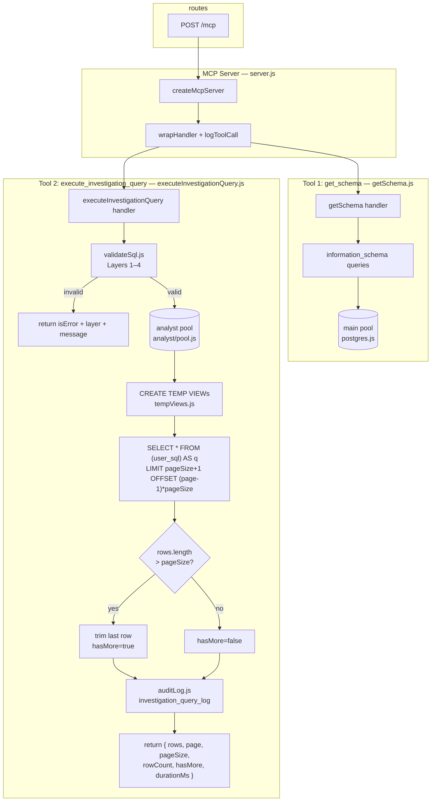
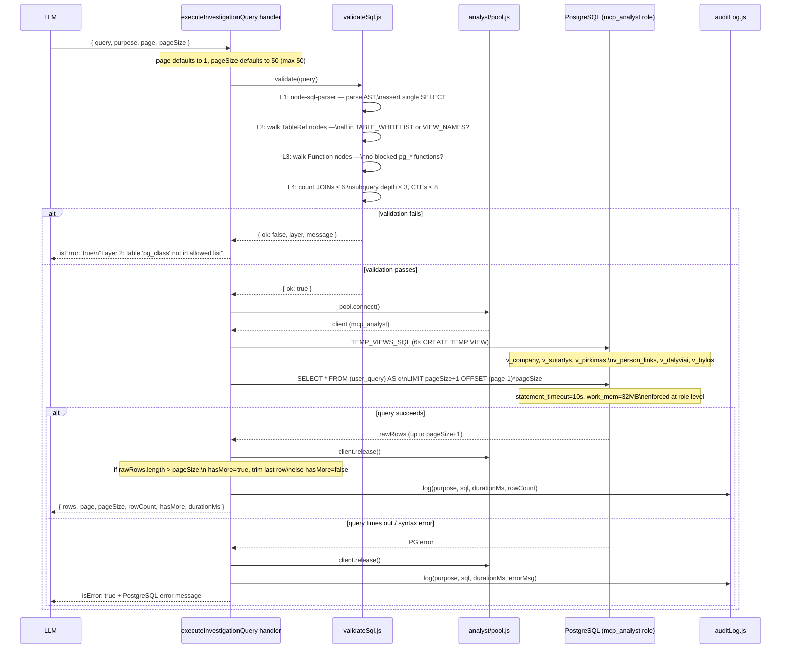

# MCP Risk Intelligence Tool — Proposal

## The insight

A human says: *"This company feels off — they keep winning government contracts in my town and they only have 2
employees."*

The human is **not** a researcher. They won't write queries. They won't pick from a menu of pre-built risk patterns.
They have **intuition** and **context** that no database has.

The LLM already knows:

- What bid rigging looks like
- What shell company patterns look like
- What conflict-of-interest networks look like
- OECD red flag indicators, academic fraud typologies, Benford's law, etc.

What the LLM **lacks** is the ability to **look at the actual data** and run the investigation itself. It needs to form
hypotheses and test them against real records — iteratively, like an analyst would.

Pre-built materialized views kill this. They assume you know the questions in advance. The whole point is that you
don't. The human brings the smell, the LLM brings the methodology, and the data brings the truth.

Viespirkiai is a **data provider, not a fraud research lab**. Encoding every fraud pattern into SQL views is neither
sustainable nor scalable — that knowledge lives in the LLM and evolves with every model update. Patterns change, new
fraud typologies emerge, and LLMs get smarter. The tool must let the intelligence evolve without code changes.

---

## Approach: safe, general-purpose analytical query interface

One MCP tool that gives the LLM **read-only, constrained, audited SQL access** to the procurement database. Not a menu
of queries. Not a DSL. The LLM writes SQL, the tool validates and executes it safely.

### Why SQL is the right interface

- The LLM already writes excellent SQL. No training needed.
- SQL is the only language expressive enough to cover filtering, aggregation, window functions, graph traversal (
  recursive CTEs), and statistical analysis in one syntax.
- Any custom DSL (EBNF, predicate logic, rule engine) will be strictly less expressive than SQL, and takes months to
  build what PostgreSQL already does.
- Every BI/analytics platform (Metabase, Redash, Superset, Databricks) solved this same problem the same way:
  constrained SQL execution.

### What the LLM needs to do during an investigation

1. **Explore the schema** — "what columns does `sutartys` have?"
2. **Run analytical queries** — "aggregate contract values by supplier, joined with sodra employee counts"
3. **Traverse relationships** — "who are the people linked to this company, and what other companies are they linked
   to?"
4. **Iterate** — the answer to query 1 informs query 2 informs query 3

This is an **agentic investigation loop**, not a single tool call.

---

## The two MCP tools

### Tool 1: `get_schema`

Safe, simple, no risk. Returns table structure so the LLM can write correct SQL.

```
tool: get_schema
table: "sutartys" | "jarCsv" | "pinregJuridiniaiRysiai" | ...
```

Returns: column names, types, nullable, sample values (first 3 rows), row count. Data sourced from `information_schema`
filtered to the whitelist.

The LLM calls this at the start of an investigation to understand what data is available and how tables relate.

### Tool 2: `execute_investigation_query`

The analytical workhorse. Accepts a SQL SELECT, validates it through a multi-layer guardrail stack, executes it on a
sandboxed read-only connection, and returns results.

```
tool: execute_investigation_query
query: "SELECT ..."
purpose: "Testing hypothesis: supplier X has abnormally high win rate relative to competitors"
```

The `purpose` field is for **audit logging**, not validation — it creates a human-readable trail of why each query was
run.

---

## Guardrail stack

Six layers of defense. Each layer is independent — even if one fails, the others catch it.

```
+---------------------------------------+
|  1. SQL Parser (AST)                  |
|     node-sql-parser / pgsql-parser    |
|     - reject if not a single SELECT   |
|     - reject DDL, DML, COPY, etc.     |
|     - reject multiple statements      |
+---------------------------------------+
|  2. Table/column whitelist            |
|     - AST walk: every table reference |
|       must be in the allowed set      |
|     - block pg_catalog, information_  |
|       schema from direct access       |
|     - block sensitive columns if any  |
+---------------------------------------+
|  3. Function whitelist                |
|     Allow:                            |
|       COUNT, SUM, AVG, MAX, MIN,      |
|       RANK, ROW_NUMBER, DENSE_RANK,   |
|       NTILE, PERCENTILE_CONT,         |
|       LAG, LEAD, FIRST_VALUE,         |
|       COALESCE, NULLIF, GREATEST,     |
|       LEAST, CASE,                    |
|       DATE_TRUNC, EXTRACT, AGE,       |
|       NOW, CURRENT_DATE,              |
|       ROUND, ABS, CEIL, FLOOR, LN,   |
|       UPPER, LOWER, LENGTH, TRIM,     |
|       SUBSTRING, LEFT, RIGHT,         |
|       CONCAT, STRING_AGG,             |
|       ARRAY_AGG, JSONB_BUILD_OBJECT,  |
|       REGEXP_MATCH, REGEXP_REPLACE,   |
|       TO_CHAR, TO_DATE,               |
|       BOOL_AND, BOOL_OR,              |
|       GENERATE_SERIES                 |
|     Block:                            |
|       pg_read_file, pg_read_binary_   |
|       file, dblink, lo_import,        |
|       lo_export, pg_sleep,            |
|       set_config, current_setting,    |
|       pg_terminate_backend,           |
|       pg_cancel_backend, COPY,        |
|       any pg_* admin functions        |
+---------------------------------------+
|  4. Complexity limits                 |
|     - max JOIN count: 6               |
|     - max subquery depth: 3           |
|     - max CTE count: 8               |
|     - LIMIT enforced (cap at 200)     |
|     - WITH RECURSIVE: max depth 5     |
+---------------------------------------+
|  5. Execution sandbox                 |
|     - dedicated read-only PG role     |
|     - statement_timeout = 10s         |
|     - work_mem cap per query          |
|     - row limit enforced via wrapper: |
|       SELECT * FROM (...user SQL...)  |
|       AS q LIMIT 200                  |
+---------------------------------------+
|  6. Audit log                         |
|     - every query logged:             |
|       timestamp, purpose, SQL,        |
|       duration, row count, caller     |
|     - enables post-hoc review         |
+---------------------------------------+
```

### Dedicated read-only PostgreSQL role

The database-level last line of defense. Even if every application-layer guard fails, this role **cannot** modify data
or access system internals.

```sql
CREATE
ROLE mcp_analyst LOGIN PASSWORD '...';
GRANT CONNECT ON DATABASE viespirkiai TO mcp_analyst;
GRANT USAGE ON SCHEMA public TO mcp_analyst;

-- SELECT only on analytical tables
GRANT
SELECT
ON
    sutartys,
    "sutartysAtviriDuomenys",
    "sutartysAtviriDuomenysImp",
    "jarCsv",
    jar,
    "viesiejiPirkimai",
    "viesiejiPirkimaiVykdytojai",
    "pinregJuridiniaiRysiai",
    pinreg,
    failai,
    "sabisSutartys",
    "sabisSutarciuSalys",
    "sabisSaskaitos",
    "sabisSaskaituSalys",
    "cpvaProjektuSutartys",
    "cpvaProjektuSarasas",
    "cvppViesiejiPirkimai",
    "eiluciuSkaiciai",
    "bvpzKodai",
    "sodra",
    regitra,
    "nepatikimiTiekejai",
    "melagingiTiekejai",
    jadis,
    "rcInformaciniaiLeidiniaiPranesimai",
    "domenai",
    kotis,
    "balansoAtaskaitos",
    "pelnoNuostoliuAtaskaitos",
    "darboVieta",
    "istatinisKapitalas",
    -- required for bid rigging / carousel analysis (Themes 2, 3)
    "atn1ataskaitos",
    "atn1dalyviai",
    "atn1pasiulymuEile",
    -- required for procedure manipulation analysis (Theme 7)
    "neskelbiamosDerybos",
    -- required for compliance / VDI violations (Theme 9) — was used in v_company but not granted
    "vdiPazeidimai",
    -- required for court case analysis (Theme 9)
    "bylos",
    "bylosDalyviai",
    -- required for tax payment analysis (Theme 1)
    "mokesciai"
    TO mcp_analyst;

-- No INSERT, UPDATE, DELETE, CREATE, DROP — implicit by omission

-- Role-level resource limits
ALTER
ROLE mcp_analyst SET statement_timeout = '10s';
ALTER
ROLE mcp_analyst SET work_mem = '32MB';
```

---

## Subject-matter temporary views

Six `CREATE TEMP VIEW` statements executed at connection open time (session-scoped, no DDL privileges needed).
They solve the three recurring pain points across all investigation queries:

- `jarCsv.jarKodas` is `integer`; all FK columns are `text` — every join needs `::text` cast
- Latest Sodra snapshot requires `ORDER BY data DESC NULLS LAST LIMIT 1` per company
- Common multi-table joins are re-derived from scratch each investigation

The LLM uses views for simple lookups and profile queries; it writes directly against the raw tables for window
functions, CTEs, and recursive graph traversal where full expressiveness is needed.

**Coverage map against the 22 investigator themes:**

| View             | Themes covered              | Critical facts provided                                                    |
|------------------|-----------------------------|----------------------------------------------------------------------------|
| `v_company`      | 1, 5, 6, 7, 9, 10, 11, 12  | headcount, registration, compliance flags, domain/court/negotiation counts |
| `v_sutartys`     | 1, 2, 3, 5, 8, 15, 18      | contract value, overrun ratio, CPV, buyer/seller names, tipas              |
| `v_pirkimas`     | 5, 6, 7, 20                 | procedure type, buyer municipality, estimated value                        |
| `v_person_links` | 4, 10, 11, 13, 19           | person ↔ company edges, spouse links, role type, foreign-entity flag       |
| `v_dalyviai`     | **2, 3, 14, 17**            | full bidder list, bid amounts, rank — essential for bid rigging/spec rigging/cartel |
| `v_bylos`        | **9**                       | court cases per company — blind spot without this view                     |

Raw tables used directly (no view wrapper needed):

| Table                  | Themes | Why no view |
|------------------------|--------|-------------|
| `cpvaProjektuSutartys` | 12     | CPVA subcontractor data — join shape varies per query |
| `pinregJuridiniaiRysiai` | 13, 19 | Revolving door needs self-join on date ranges — view would fix too many columns |
| `domenai`              | 16     | Domain pair queries need flexible self-join |
| `neskelbiamosDerybos`  | 20     | Audit findings — single-table lookup, no join needed |

### `v_company` — company profile with latest headcount and compliance status

```sql
CREATE TEMP VIEW v_company AS
SELECT j."jarKodas"::text, j.pavadinimas,
       j.adresas,
       j."registravimoData",
       j."statusoPavadinimas",
       j."statusasNuo",
       -- headcount: Theme 1 (capacity mismatch)
       s.data                                                                  AS "sodraData", -- YYYYMM integer
       (COALESCE(s.draustieji, 0) + COALESCE(s.draustieji2, 0))                AS darbuotojai,
       s."vidutinisAtlyginimas",
       s."imokuSuma",                                                                          -- total social tax paid
       -- compliance flags: Theme 9
       EXISTS(SELECT 1
              FROM "melagingiTiekejai" m
              WHERE m."tiekejoJarKodas" = j."jarKodas"::text
           AND (m."itrauktasIki" IS NULL OR m."itrauktasIki" >= CURRENT_DATE)) AS "melagingisTiekejas",
       EXISTS(SELECT 1
              FROM "nepatikimiTiekejai" n
              WHERE n."tiekejoJarKodas" = j."jarKodas"::text
           AND (n."itrauktaIki" IS NULL OR n."itrauktaIki" >= CURRENT_DATE))   AS "nepatikimasTiekejas",
       (SELECT COUNT(*)
        FROM "vdiPazeidimai" v
        WHERE v."jarKodas" = j."jarKodas"::text)                               AS "vdiPazeidimuSkaicius",
       -- court exposure: Theme 9
       (SELECT COUNT(*)
        FROM "bylosDalyviai" bd
        WHERE bd.kodas = j."jarKodas"::text)                                   AS "bylosSkaicius",
       -- web footprint: Theme 10 (shared domain / network signals)
       (SELECT COUNT(*)
        FROM domenai d
        WHERE d."savininkoKodas" = j."jarKodas"::text)                         AS "domenaiSkaicius",
       -- procedure abuse signal: Theme 7
       (SELECT COUNT(*)
        FROM "neskelbiamosDerybos" nd
        WHERE nd."jarKodas" = j."jarKodas"::text)                              AS "neskelbiamosDerybosSkaicius"
FROM "jarCsv" j
         LEFT JOIN LATERAL(
    SELECT draustieji, draustieji2, "vidutinisAtlyginimas", "imokuSuma", data FROM sodra
    WHERE "jarKodas" = j."jarKodas"::text
    ORDER BY data DESC NULLS LAST
    LIMIT 1
                   ) s ON true;
```

### `v_sutartys` — contracts with buyer and seller names resolved

```sql
CREATE TEMP VIEW v_sutartys AS
SELECT s."sutartiesUnikalusId",
       s."pirkimoNumeris", -- nullable ~30-40% (direct procurement)
       s."sudarymoData",
       s."galiojimoData",
       s.verte,
       s."faktineIvykdimoVerte",
       s.pavadinimas,
       s."bvpzKodas",
       s.tipas,
       s.istrinta,
       s."perkanciosiosOrganizacijosKodas" AS "pirkejoKodas",
       pb.pavadinimas                      AS pirkejas,
       s."tiekejoKodas",
       tb.pavadinimas                      AS tiekejas,
       s."papildomiTiekejaiKodai"
FROM sutartys s
         LEFT JOIN "jarCsv" pb ON pb."jarKodas"::text = s."perkanciosiosOrganizacijosKodas"
LEFT JOIN "jarCsv" tb ON tb."jarKodas"::text = s."tiekejoKodas";
```

### `v_pirkimas` — procurement notices with organizer details

```sql
CREATE TEMP VIEW v_pirkimas AS
SELECT p."pirkimoId",
       p.pavadinimas,
       p."jarKodas",
       o.pavadinimas AS organizatorius,
       o.trumpinys,
       o.miestas,
       p."pirkimoBudas",
       p.statusas,
       p.zingsnis,
       p."pirkimoObjektoTipas",
       p."numatomaVerteEUR",
       p."paskelbimoData",
       p."pasiulymuPateikimoTerminas",
       p."esFinansavimas",
       p."bvpzKodai"
FROM "viesiejiPirkimai" p
         LEFT JOIN "viesiejiPirkimaiVykdytojai" o ON o.id = p."pirkimoVykdytojasId";
```

### `v_person_links` — declared person-to-company relationships with company name

```sql
CREATE TEMP VIEW v_person_links AS
SELECT r.id,
       r.deklaracija,
       r.vardas,
       r.pavarde,
       r."susijusioAsmensVardas",
       r."susijusioAsmensPavarde",
       r."jarKodas",
       j.pavadinimas AS "imonesVardas",
       r.pareigos,
       r."irasoTipas", -- DEKLARUOJANCIO_DARBOVIETE | SUTUOKTINIO_DARBOVIETE | KITI_RYSIAI_SU_JA
       r."darbovietesTipas",
       r."rysioPobudzioPavadinimas",
       r."rysioPradzia",
       r."rysioPabaiga",
       r."yraJuridinisAsmuo",
       r."registruotaLietuvoje"
FROM "pinregJuridiniaiRysiai" r
         LEFT JOIN "jarCsv" j ON j."jarKodas"::text = r."jarKodas";
```

### `v_dalyviai` — full bidder list per procurement with ranked bid amounts

The only source of **all participants** in a tender, not just the winner. Without this view, Themes 2 and 3
(cover bidding, bid rotation) are impossible — `sutartys` records winners only.

```sql
CREATE TEMP VIEW v_dalyviai AS
SELECT a."pirkimoNumeris",
       a."perkanciosiosOrganizacijosKodas" AS "pirkejoKodas",
       a."pirkimoBudas",
       a."sukurtaAt"                       AS "ataskaitosData",
       d.kodas                             AS "tiekejoKodas",
       j.pavadinimas                       AS tiekejas,
       d."fizinisAsmuo",
       d.salis,
       e."eileNumeris",                                                                             -- bid rank: 1 = lowest / winner
       e.kaina::numeric                    AS "pasiulymoKaina", ap.statusas AS "atmetimoPriezastis" -- non-null if proposal was rejected
FROM atn1ataskaitos a
         JOIN atn1dalyviai d ON d."ataskaitaId" = a.id
         LEFT JOIN "atn1pasiulymuEile" e
                   ON e."ataskaitaId" = a.id AND e."dalyvioKodas" = d.kodas
         LEFT JOIN "atn1atmestiPasiulymai" ap
                   ON ap."ataskaitaId" = a.id AND ap."dalyvioKodas" = d.kodas
         LEFT JOIN "jarCsv" j ON j."jarKodas"::text = d.kodas;
```

### `v_bylos` — court cases with company and person participants

```sql
CREATE TEMP VIEW v_bylos AS
SELECT b.id           AS "bylosId",
       b."bylosNumeris",
       b."bylosRusis",
       b.data         AS "bylosData",
       b.teismas,
       bd.kodas       AS "jarKodas",
       j.pavadinimas  AS "dalyvioPavadinimas",
       bd.pavadinimas AS "dalyvioVardasIrPavarde", -- persons have no jarKodas, only pavadinimas
       bd."bylojeKaip"                             -- role: plaintiff, defendant, third party, etc.
FROM "bylosDalyviai" bd
         JOIN bylos b ON b.id = bd."bylosId"
         LEFT JOIN "jarCsv" j ON j."jarKodas"::text = bd.kodas;
```

### Connection lifecycle

The MCP server runs all six `CREATE TEMP VIEW` statements immediately after acquiring a connection from the pool,
before executing any user query. Because TEMP views are session-scoped they disappear automatically when the
connection closes — no cleanup needed.

---

## Investigation session example

A human says: *"UAB Greitas Statyba keeps winning road contracts in Kaunas. They seem tiny. Something feels off."*

The LLM agent receives this and begins an investigation loop:

### Step 1 — Identify the company

```
Tool: search_juridiniai
search: "Greitas Statyba"
→ jarKodas: 304567890, pavadinimas: UAB Greitas Statyba, registered: 2019-03-11, Kaunas
```

### Step 2 — Full risk profile in one shot (`v_company`)

**Tool**: `execute_investigation_query`  
**Purpose**: "Capacity, compliance flags, court exposure, and domain footprint for the target company"

```sql
SELECT "jarKodas",
       pavadinimas,
       "registravimoData",
       "statusoPavadinimas",
       "sodraData",
       darbuotojai,
       "vidutinisAtlyginimas",
       "imokuSuma",
       "melagingisTiekejas",
       "nepatikimasTiekejas",
       "vdiPazeidimuSkaicius",
       "bylosSkaicius",
       "domenaiSkaicius",
       "neskelbiamosDerybosSkaicius"
FROM v_company
WHERE "jarKodas" = '304567890';
```

*→ 3 employees (Sodra 202412), avg salary €1,850, compliance: clean, court cases: 2, domains: 0,
negotiated-without-publication appearances: 0*

*LLM notes: Company is 5 years old, 3 employees, no blacklist flags. Two court cases worth investigating. Capacity to
deliver road construction at this scale is implausible.*

### Step 3 — Contract history by year with cost overrun ratio (`v_sutartys`)

**Tool**: `execute_investigation_query`  
**Purpose**: "Contract volume trend and execution overruns — is the company growing or was it born ready?"

```sql
SELECT DATE_TRUNC('year', "sudarymoData")::date                                    AS metai, COUNT(*) AS sutarciu_sk,
       ROUND(SUM(verte) / 1000)                                      AS verte_tukst,
       ROUND(SUM("faktineIvykdimoVerte") / 1000)                     AS faktine_tukst,
       ROUND(SUM("faktineIvykdimoVerte") / NULLIF(SUM(verte), 0), 2) AS virsijimo_koef,
       pirkejas
FROM v_sutartys
WHERE "tiekejoKodas" = '304567890'
  AND istrinta IS NOT TRUE
GROUP BY metai, pirkejas
ORDER BY metai;
```

*→ 2020: 5 contracts €890K (×1.02, buyer: Kauno miesto savivaldybė)*  
*→ 2021: 11 contracts €2.1M (×1.28)*  
*→ 2022: 14 contracts €3.8M (×1.41)*  
*→ 2023: 17 contracts €5.5M (×1.52)*

*LLM notes: Contract volume grows 6× in four years; overrun ratio worsening each year — classic low-ball-then-escalate.
Same buyer every time.*

### Step 4 — Does the buyer favour non-competitive procedures? (`v_pirkimas`)

**Tool**: `execute_investigation_query`  
**Purpose**: "Procedure type breakdown for the contracting authority — how often do they bypass open tender?"

```sql
SELECT "pirkimoBudas",
       COUNT(*)                       AS pirkimu_sk,
       ROUND(SUM("numatomaVerteEUR")) AS bendra_verte_eur
FROM v_pirkimas
WHERE "jarKodas" = (SELECT "pirkejoKodas"
                    FROM v_sutartys
                    WHERE "tiekejoKodas" = '304567890'
                    LIMIT 1)
GROUP BY "pirkimoBudas"
ORDER BY pirkimu_sk DESC;
```

*→ NESKELBIAMOS_DERYBOS: 31 procurements €4.9M (68%)*  
*→ ATVIRAS: 11 procurements €1.1M (24%)*  
*→ SUPAPRASTINTAS_ATVIRAS: 4 procurements €0.3M (9%)*

*LLM notes: Buyer runs 68% of procurements as negotiated-without-publication. That is the mechanism that eliminates
competition before the bid even opens. Focus of Theme 7 confirmed.*

### Step 5 — Win rate and price suppression (`v_dalyviai`)

**Tool**: `execute_investigation_query`  
**Purpose**: "How often does this company win as lowest bidder vs all other participants in the same tenders"

```sql
WITH target AS (SELECT DISTINCT "pirkimoNumeris"
                FROM v_dalyviai
                WHERE "tiekejoKodas" = '304567890'),
     all_bids AS (SELECT d."pirkimoNumeris",
                         d."tiekejoKodas",
                         d."pasiulymoKaina",
                         RANK() OVER (PARTITION BY d."pirkimoNumeris" ORDER BY d."pasiulymoKaina") AS rank,
                         COUNT(*) OVER (PARTITION BY d."pirkimoNumeris")                           AS bidders
                  FROM v_dalyviai d
                  WHERE d."pirkimoNumeris" IN (SELECT "pirkimoNumeris" FROM target))
SELECT COUNT(DISTINCT "pirkimoNumeris")                                  AS procurements,
       COUNT(*) FILTER (WHERE "tiekejoKodas" = '304567890' AND rank = 1) AS cheapest_wins,
       ROUND(AVG(bidders), 1)                                            AS avg_competitors,
       ROUND(AVG(CASE WHEN "tiekejoKodas" = '304567890' THEN "pasiulymoKaina" END) /
             NULLIF(AVG("pasiulymoKaina"), 0), 3)                        AS price_ratio
FROM all_bids;
```

*→ 47 procurements, 41 cheapest wins (87%), avg 2.3 competitors, price ratio 0.72*

*LLM notes: Wins 87% of the time as lowest bidder. Consistent underbidding at 72% of field average — statistically
improbable without prior knowledge of competitors' prices.*

### Step 6 — Who co-bids and always loses? (`v_dalyviai`)

**Tool**: `execute_investigation_query`  
**Purpose**: "Identify companies that repeatedly appear as cover bidders — always present, always higher"

```sql
WITH target_procurements AS (SELECT DISTINCT "pirkimoNumeris" FROM v_dalyviai WHERE "tiekejoKodas" = '304567890'),
     winner_kaina AS (SELECT "pirkimoNumeris", "pasiulymoKaina" FROM v_dalyviai WHERE "tiekejoKodas" = '304567890')
SELECT d."tiekejoKodas",
       d.tiekejas,
       COUNT(*)                                                        AS co_bids,
       COUNT(*) FILTER (WHERE d."pasiulymoKaina" > w."pasiulymoKaina") AS times_bid_higher
FROM v_dalyviai d
         JOIN winner_kaina w USING ("pirkimoNumeris")
WHERE d."pirkimoNumeris" IN (SELECT "pirkimoNumeris" FROM target_procurements)
  AND d."tiekejoKodas" != '304567890'
GROUP BY d."tiekejoKodas", d.tiekejas
ORDER BY co_bids DESC
LIMIT 10;
```

*→ UAB Kelių Draugai (301234567): 38 co-bids, 38 times higher*  
*→ UAB Asfaltas Pro (309876543): 29 co-bids, 27 times higher*

*LLM notes: Same two companies appear in nearly every tender and always bid above the winner. Cover bidding pattern
confirmed.*

### Step 7 — Are the three companies linked through people? (`v_person_links`)

**Tool**: `execute_investigation_query`  
**Purpose**: "Graph traversal: shared directors, shareholders, or spouses across the three co-bidding companies"

```sql
WITH target_companies AS (SELECT unnest(ARRAY['304567890', '301234567', '309876543']) AS jar)
SELECT p1."jarKodas"     AS company_a,
       p1."imonesVardas" AS company_a_name,
       p2."jarKodas"     AS company_b,
       p2."imonesVardas" AS company_b_name,
       p1.vardas,
       p1.pavarde,
       p1."irasoTipas"   AS role_a,
       p2."irasoTipas"   AS role_b
FROM v_person_links p1
         JOIN v_person_links p2
              ON p1.vardas = p2.vardas AND p1.pavarde = p2.pavarde
WHERE p1."jarKodas" IN (SELECT jar FROM target_companies)
  AND p2."jarKodas" IN (SELECT jar FROM target_companies)
  AND p1."jarKodas" < p2."jarKodas";
```

*→ Jonas Jonaitis: DEKLARUOJANCIO_DARBOVIETE at 304567890 (Greitas Statyba) + KITI_RYSIAI_SU_JA at 301234567 (Kelių
Draugai)*  
*→ Petras Petraitis: DEKLARUOJANCIO_DARBOVIETE at 301234567 + SUTUOKTINIO_DARBOVIETE links to 309876543 (Asfaltas Pro)*

*LLM notes: Two people bridge all three companies. Shared ownership confirmed via PINREG declarations.*

### Step 8 — Court exposure of the cluster (`v_bylos`)

**Tool**: `execute_investigation_query`  
**Purpose**: "Check whether any of the three companies appear as defendants in court cases"

```sql
SELECT "jarKodas",
       "dalyvioPavadinimas",
       "bylosRusis",
       "bylosData",
       teismas,
       "bylojeKaip"
FROM v_bylos
WHERE "jarKodas" IN ('304567890', '301234567', '309876543')
ORDER BY "bylosData" DESC
LIMIT 20;
```

*→ 304567890 — defendant in 2 labour-law cases (2022, 2024)*  
*→ 301234567 — defendant in 1 contract-dispute case (2023)*  
*→ 309876543 — no court cases*

*LLM notes: Two of three companies have been defendants. Labour-law cases at the winning company are consistent with
undeclared subcontracting — another capacity-mismatch indicator.*

### Step 9 — LLM summarizes findings to the human

> Your intuition was right. UAB Greitas Statyba (3 employees, €12.3M in contracts since 2020) wins 87% of road tenders
> as the cheapest bidder, with costs overrunning by up to 52%. The same two companies — UAB Kelių Draugai and UAB
> Asfaltas Pro — appear as competitors in nearly every tender and consistently bid above the winner. The contracting
> authority runs 68% of its procurements as negotiated-without-publication, eliminating open competition before bids
> are submitted. These three companies share people: Jonas Jonaitis is linked to both Greitas Statyba and Kelių Draugai;
> Petras Petraitis directs Kelių Draugai while his spouse is linked to Asfaltas Pro. Two of the three companies have
> been defendants in court cases. The overall pattern is consistent with a coordinated bid-rigging ring (cover bidding +
> procedure manipulation) operating under a single contracting authority.

---

## Why this works

| Property               | Outcome                                                                                           |
|------------------------|---------------------------------------------------------------------------------------------------|
| Human brings intuition | The investigation starts from a gut feeling, not a query                                          |
| LLM brings methodology | Fraud detection patterns, statistical tests, investigation sequencing — no pre-built views needed |
| Data brings truth      | Every hypothesis is tested against real records                                                   |
| Tool brings safety     | Six guardrail layers, read-only role, audit trail                                                 |
| No maintenance burden  | New fraud patterns emerge from LLM updates, not code changes                                      |
| Iterative by nature    | Each query result shapes the next question — agentic loop                                         |

## What to build

| Component                                 | Effort | Notes                                                          |
|-------------------------------------------|--------|----------------------------------------------------------------|
| `get_schema` MCP tool                     | Small  | Query `information_schema`, filter to whitelist                |
| `execute_investigation_query` MCP tool    | Medium | SQL parser + guardrail stack + execution                       |
| Read-only PG role (`mcp_analyst`)         | Small  | One-time DDL                                                   |
| SQL AST validation module                 | Medium | `node-sql-parser`, table/function whitelist, complexity checks |
| Audit logging                             | Small  | Insert to a `query_audit_log` table                            |
| MCP tool description / prompt engineering | Small  | Tell the LLM what tables exist and how they relate             |

### Recommended npm packages

- **`node-sql-parser`** — parses SQL into AST, supports PostgreSQL dialect, can validate table/column references against
  a whitelist. Well-maintained, 2M+ weekly downloads.
- No custom grammar, no EBNF, no rule engine needed.

---

## Risks and mitigations

| Risk                                 | Mitigation                                                                        |
|--------------------------------------|-----------------------------------------------------------------------------------|
| SQL injection via crafted query      | AST parsing rejects non-SELECT; read-only role as defense-in-depth                |
| Expensive queries (full table scans) | `statement_timeout = 10s`, `work_mem` cap, LIMIT enforcement                      |
| Data exfiltration                    | Table whitelist controls what's visible; sensitive columns can be excluded        |
| LLM writes wrong SQL                 | LLM can see errors, retry, self-correct — this is normal agentic behavior         |
| Prompt injection via data content    | MCP tool returns raw data; LLM must treat it as untrusted (standard MCP practice) |

---

## Future extensions

- **Materialized risk scores**: Once common investigation patterns stabilize, materialize them as views for faster
  access — but as optimization, not as the primary interface.
- **Graph-aware schema hints**: Provide the LLM with a relationship map (entity A connects to entity B via table C on
  column D) to improve JOIN accuracy.
- **Investigation templates**: Optional starting-point prompts ("investigate this company for bid rigging") that the LLM
  can deviate from — guidance, not constraints.
- **Cross-investigation memory**: Let the LLM reference findings from previous investigations to detect patterns across
  multiple tips.

---

## Classic investigator questions

See **[mcp-investigator-questions.md](mcp-investigator-questions.md)** for the full catalogue — 22 themes split into:

- **Supported** (themes 1–17): fully answerable with current data; all SQL validated against the live database
- **Not yet fully supported** (themes 18–22): partial data or missing data source; gaps documented per theme

---

## Implementation specification

### How existing MCP tools work

The codebase uses `@modelcontextprotocol/sdk` with a stateless StreamableHTTP transport. Each HTTP POST to `/mcp`
creates a fresh `McpServer`, connects it via `StreamableHTTPServerTransport`, handles the request, and discards the
server — there is no persistent server object between requests.

Each tool is a JS ESM module in `modules/mcp/tools/` with three exports:

```
name        string           Tool identifier registered with the MCP SDK
description string           Shown to the LLM in the tool list
schema      Zod object       Input validation — SDK converts this to JSON Schema
handler     async function   Receives validated params, returns MCP content object
```

`modules/mcp/server.js` auto-loads all files in `tools/`, wraps each handler with timing and `logToolCall` (writes
to `mcpToolCalls` table via the main PG pool), then registers them. No manual registration needed — drop a file in
`tools/` and it appears.

The main PG pool (`postgres/postgres.js`) uses `pg.Pool` with `statement_cache_size: 0` (PgBouncer compatibility).
`DATE`/`TIMESTAMP` columns return as strings; `NUMERIC` returns as float (type parsers set globally).

---

### New file structure

```
modules/mcp/
├── tools/
│   ├── getSchema.js                     ← Tool 1 (new)
│   └── executeInvestigationQuery.js     ← Tool 2 (new)
└── analyst/
    ├── pool.js           ← Dedicated pg.Pool for mcp_analyst role
    ├── tempViews.js      ← Six CREATE TEMP VIEW statements as a string constant
    ├── validateSql.js    ← Multi-layer SQL validation (AST + whitelists + limits)
    └── auditLog.js       ← Writes to investigation_query_log table
```

The `analyst/` directory is internal infrastructure consumed only by the two new tools. It must not be imported from
routes or other modules.

---

### New config entries (`config.sample.js`)

```js
// Read-only analyst role for MCP investigation queries
// Must point at direct PostgreSQL (not PgBouncer) — TEMP views are session-scoped
pgAnalystUser: "mcp_analyst",
pgAnalystPassword: "CHANGE_ME",
pgAnalystPort: 9118,          // same host as pgHost, direct PG port
pgAnalystMaxConnections: 3,   // investigation queries serialize naturally; keep small
```

**Why not PgBouncer?** `CREATE TEMP VIEW` is session-scoped. PgBouncer in transaction-pooling mode may route the next
query to a different backend connection, making the views invisible. The analyst pool must connect directly to
PostgreSQL on the direct port (`9118` in dev).

---

### New npm package

```
node-sql-parser   ^5.x   PostgreSQL dialect; AST-based parse + table/function extraction
```

---

### New database objects (one-time DDL)

**Read-only role** — see the `CREATE ROLE` block in the Guardrail stack section above. Run once by an admin.

**Audit log table:**

```sql
CREATE TABLE investigation_query_log
(
    id         BIGSERIAL PRIMARY KEY,
    created_at TIMESTAMPTZ NOT NULL DEFAULT NOW(),
    purpose    TEXT        NOT NULL,
    sql        TEXT        NOT NULL,
    duration_ms INTEGER,
    row_count  INTEGER,
    error_msg  TEXT,
    user_agent TEXT
);
```

---

### Module: `analyst/pool.js`

Creates and exports a single `pg.Pool` connected as `mcp_analyst`. Mirrors the main pool in `postgres/postgres.js`
but with analyst credentials and direct-PG port. Applies the same global type parsers (strings for dates, floats
for numerics) so results are consistent with the rest of the app.

```
export const analystPool = new Pool({ host, user: pgAnalystUser, password, port: pgAnalystPort, ... })
```

---

### Module: `analyst/tempViews.js`

Exports a single string constant `TEMP_VIEWS_SQL` — all six `CREATE TEMP VIEW` statements joined by semicolons,
taken verbatim from the "Subject-matter temporary views" section above. The executor runs this string once per
acquired client before executing the user query.

```
export const TEMP_VIEWS_SQL = `
  CREATE TEMP VIEW v_company AS ...;
  CREATE TEMP VIEW v_sutartys AS ...;
  ...
`;
```

---

### Module: `analyst/validateSql.js`

Four-layer synchronous validation. Returns `{ ok: true }` or `{ ok: false, layer, message }`.

**Layer 1 — AST parse**

Use `node-sql-parser` with `{ database: "PostgreSQL" }`. If the parse throws, return error immediately. After parse:
- Reject if the AST is not a single `SELECT` statement.
- Reject if the statement count ≠ 1 (blocks semicolon-chained statements).

**Layer 2 — Table whitelist**

Walk the AST collecting every `TableRef` node. Every table name must appear in `TABLE_WHITELIST` (the same set
granted to `mcp_analyst`). Also accept the six temp view names (`v_company`, `v_sutartys`, `v_pirkimas`,
`v_person_links`, `v_dalyviai`, `v_bylos`). Reject anything else — including `pg_catalog`, `information_schema`,
and any `pg_*` system table.

**Layer 3 — Function whitelist**

Walk the AST collecting every `Function` node. Block known dangerous functions:
`pg_read_file`, `pg_read_binary_file`, `dblink`, `lo_import`, `lo_export`, `pg_sleep`, `set_config`,
`current_setting`, `pg_terminate_backend`, `pg_cancel_backend`, any `pg_*` not in the allow list.

Allow list is the set enumerated in the Guardrail stack section above. Unknown functions not on either list are
allowed by default — the read-only role is the enforcement backstop, not the function whitelist.

**Layer 4 — Complexity limits**

Count via AST walk:
- JOIN nodes: reject if > 6
- Subquery depth: reject if > 3 (recursive count of nested `SELECT` nodes)
- CTE count: reject if > 8
- `WITH RECURSIVE` present: allowed, but flag for audit log

---

### Module: `analyst/auditLog.js`

Async function `logInvestigationQuery({ purpose, sql, durationMs, rowCount, errorMsg, userAgent })`. Inserts into
`investigation_query_log`. Errors are swallowed silently (same pattern as `mcpLogger.js`) — audit failure must
never block query execution.

---

### Tool 1: `getSchema`

**File**: `modules/mcp/tools/getSchema.js`

**Inputs** (Zod schema):

```
table   z.enum([...TABLE_WHITELIST, ...VIEW_NAMES]).optional()
          If omitted → return the full table list with row counts only.
          If provided → return column details + 3 sample rows for that table/view.
```

**Implementation**:

- For the table list: query `information_schema.tables` filtered to `TABLE_WHITELIST`, plus a hardcoded list of the
  six temp view names. Row counts come from `pg_stat_user_tables.n_live_tup` (fast estimate, not `COUNT(*)`).
- For a specific table: query `information_schema.columns` for column name, data type, and nullable. Then run
  `SELECT * FROM <table> LIMIT 3` via the **main pool** (the analyst pool has no views initialized). Emit result
  as JSON.
- For a specific view: query the same column metadata from `information_schema.views` and include the view SQL
  source. Do not run sample rows for views (they join multiple tables; sample rows add noise).

Uses the **main pool**, not the analyst pool. Schema introspection is read-only and needs no sandbox.

---

### Tool 2: `executeInvestigationQuery`

**File**: `modules/mcp/tools/executeInvestigationQuery.js`

#### Input schema

| Field      | Zod type                                   | Default | Description                                        |
|------------|--------------------------------------------|---------|----------------------------------------------------|
| `query`    | `z.string().min(10).max(8000)`             | —       | SQL SELECT to execute (required)                   |
| `purpose`  | `z.string().min(5).max(500)`               | —       | Human-readable reason — audit log only (required)  |
| `page`     | `z.number().int().min(1).default(1)`       | `1`     | Page number (1-based)                              |
| `pageSize` | `z.number().int().min(1).max(50).default(50)` | `50` | Rows per page — capped at 50 regardless of input   |

#### Pagination design

The LLM cannot scroll or paginate passively — it must decide to call the tool again. Two principles drive the design:

1. **Never flood the LLM with rows it didn't ask for.** 50 rows per page keeps the context cost predictable. The
   LLM can always request additional pages, but it can never accidentally receive thousands of rows from a single call.

2. **Avoid `COUNT(*)` on user queries.** Running `SELECT COUNT(*) FROM (<user_sql>)` for every request doubles
   execution cost and doubles timeout risk. Instead, use the **N+1 trick**: fetch `pageSize + 1` rows — if the
   extra row comes back, there are more pages; if not, this is the last page.

Execution wrapping:

```sql
SELECT * FROM (<user_sql>) AS q
LIMIT <pageSize + 1>
OFFSET <(page - 1) * pageSize>
```

After execution: if `rawRows.length > pageSize`, set `hasMore = true` and trim the last row before returning.

#### Success response

```json
{
  "rows": [...],
  "page": 1,
  "pageSize": 50,
  "rowCount": 50,
  "hasMore": true,
  "durationMs": 381
}
```

| Field        | Type      | Description                                                            |
|--------------|-----------|------------------------------------------------------------------------|
| `rows`       | array     | Result rows for this page (at most `pageSize` items)                   |
| `page`       | number    | Page number that was returned (echoed from input)                      |
| `pageSize`   | number    | Page size that was used (echoed from input, capped at 50)              |
| `rowCount`   | number    | Number of rows in this response (`rows.length`, ≤ `pageSize`)          |
| `hasMore`    | boolean   | `true` if there are more rows on the next page                         |
| `durationMs` | number    | Query execution wall time in milliseconds                              |

The LLM reads `hasMore: true` and calls the tool again with `page: 2` if it needs more data. Because the LLM
controls pagination explicitly, it can also decide to stop early once it has enough evidence.

#### Error response (validation or execution failure)

```json
{
  "content": [{ "type": "text", "text": "<message>" }],
  "isError": true
}
```

Validation errors include the layer name and the specific identifier that was rejected (e.g. `"Layer 2: table
'pg_class' is not in the allowed table list"`). Execution errors include the raw PostgreSQL error message so the
LLM can self-correct its SQL. If neither `query` nor `purpose` is provided, the Zod schema rejects the call
before the handler runs — the SDK returns a validation error automatically.

#### Minimal example

**Input:**

```json
{
  "query": "SELECT \"tiekejoKodas\", COUNT(*) AS sutarciu_sk, ROUND(SUM(verte)) AS bendra_verte FROM sutartys WHERE istrinta IS NOT TRUE GROUP BY \"tiekejoKodas\" ORDER BY bendra_verte DESC",
  "purpose": "Top suppliers by total contract value — initial scan",
  "page": 1,
  "pageSize": 10
}
```

**Execution wrapper applied:**

```sql
SELECT * FROM (
  SELECT "tiekejoKodas", COUNT(*) AS sutarciu_sk, ROUND(SUM(verte)) AS bendra_verte
  FROM sutartys
  WHERE istrinta IS NOT TRUE
  GROUP BY "tiekejoKodas"
  ORDER BY bendra_verte DESC
) AS q
LIMIT 11 OFFSET 0
```

**Output:**

```json
{
  "rows": [
    { "tiekejoKodas": "304567890", "sutarciu_sk": 47, "bendra_verte": 12300000 },
    { "tiekejoKodas": "301234567", "sutarciu_sk": 31, "bendra_verte": 8750000 },
    "..."
  ],
  "page": 1,
  "pageSize": 10,
  "rowCount": 10,
  "hasMore": true,
  "durationMs": 214
}
```

The LLM sees `hasMore: true` and can call `page: 2` if the investigation requires more suppliers, or proceed
with the top 10 if that is sufficient.

#### Multi-page investigation pattern

```
Call 1:  page=1  → rows 1–50,  hasMore=true   → LLM decides: enough? or call page=2
Call 2:  page=2  → rows 51–100, hasMore=false  → LLM knows this is the complete result set
```

The LLM should state its pagination decision in the `purpose` field:
- `"Top suppliers scan — page 1 of initial results"`
- `"Continuing supplier scan — checking if more risky companies appear on page 2"`

This keeps the audit log readable as a narrative of the investigation.

---

### Architecture diagram



---

### Single-query execution flow



---

### Validation layer decision table

| Input condition                              | Layer | Action                                   |
|----------------------------------------------|-------|------------------------------------------|
| SQL parse fails (syntax error)               | 1     | Return parse error from `node-sql-parser` |
| Multiple statements (`SELECT 1; DROP TABLE`) | 1     | Reject: "only a single SELECT is allowed" |
| Statement type is not SELECT                 | 1     | Reject: "only SELECT statements allowed"  |
| Table not in whitelist (`pg_class`)          | 2     | Reject: name the blocked table            |
| Blocked function (`pg_sleep`)               | 3     | Reject: name the blocked function         |
| JOIN count > 6                              | 4     | Reject: "too many JOINs (max 6)"          |
| Subquery depth > 3                          | 4     | Reject: "subquery nesting too deep (max 3)" |
| CTE count > 8                               | 4     | Reject: "too many CTEs (max 8)"           |
| All layers pass                             | —     | Execute wrapped query                     |

---

### Error response contract

All errors returned by both tools use this shape so the LLM can reason about them:

```json
{
  "content": [{ "type": "text", "text": "<message>" }],
  "isError": true
}
```

The message always includes:
- For validation errors: the layer name and the specific identifier that was rejected (e.g. `"Layer 2: table 'pg_class' is not in the allowed table list — call get_schema to see available tables"`).
- For execution errors: the raw PostgreSQL error message so the LLM can self-correct (PG includes `position` for syntax errors).
- For `get_schema` unknown table: a suggestion to call `get_schema` without arguments first to discover the full table list.

### Pagination summary

| Scenario                          | `hasMore` | LLM action                                          |
|-----------------------------------|-----------|-----------------------------------------------------|
| `rowCount < pageSize`             | `false`   | This is the complete result — no more calls needed  |
| `rowCount === pageSize`           | `true`    | More rows exist — call again with `page: N+1`       |
| First call returned enough signal | either    | LLM may stop early regardless of `hasMore`          |

The `hasMore` flag is computed without a `COUNT(*)` query: the handler fetches `pageSize + 1` rows from the
database and checks if the extra row came back. Zero additional database cost.

