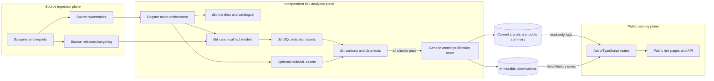
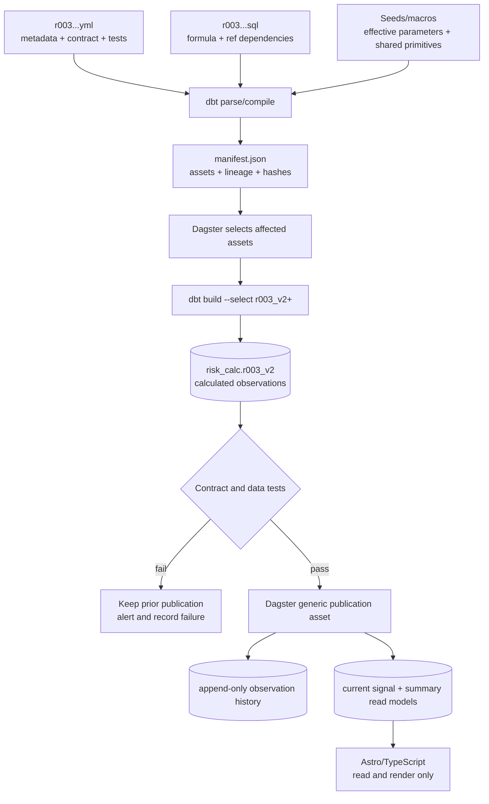
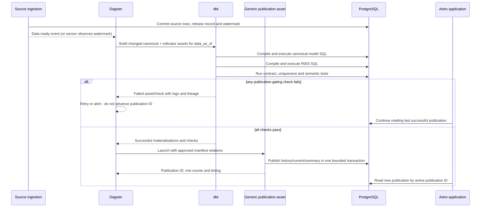
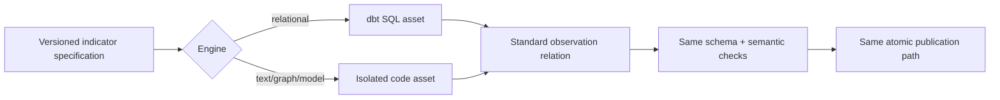
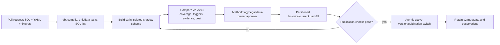

# Public procurement risk indicators: page, storage and maintenance draft

Status: detailed design draft  
Date: 2026-08-10  
Core methodology: [OCP 2024 Red Flags in Public Procurement](https://www.open-contracting.org/wp-content/uploads/2024/12/OCP2024-RedFlagProcurement.pdf)  
Parent design: [Risk signals for current and recently completed procurements](risky-procurements-initial-design.md)

## 1. Decisions

1. Indicator results selected for publication are public and are displayed with their source facts, calculation, version and limitations.
2. The OCP code is retained for an OCP indicator, for example `R003`. A Lithuania-specific indicator gets an `LT` code, for example `LT001`; it must not be presented as an OCP indicator.
3. A public result is called a **risk signal** (`rizikos signalas`), not a finding of corruption or fraud.
4. There is no unexplained corruption probability. The list may have transparent **attention points** for sorting, while signal strength, evidence confidence and data coverage remain separate.
5. An indicator is a versioned package consisting of metadata, public explanation, parameters, calculation and tests.
6. A SQL indicator is a pure `SELECT`. It never contains its own `INSERT`, `UPDATE`, `DELETE`, table creation or transaction control.
7. Risk calculation is an independently deployed analytics plane: **dbt owns SQL transformation and tests; an asset orchestrator owns scheduling, retries, lineage, partitions and backfills**. The existing application task runner is not an architectural dependency.
8. PostgreSQL views provide canonical facts; they are not the persisted risk result and should not run the complete risk system during a web request.
9. The public Astro application is a read-only consumer of published read models. It never imports indicator code, launches dbt or calculates a signal in a request.

The OCP guide describes an indicator through its definition, reason for being a red flag, required data, method, unit of analysis, procurement stage, example and source. The local indicator package preserves these fields and adds operational fields: implementation version, parameters, lifecycle state, owner, tests, public wording and known limitations.

### 1.1 Reference architecture

The recommended concrete stack is **dbt Core + Dagster + PostgreSQL**. This is a reference implementation, not a schema-level vendor lock-in: Dagster can be replaced by another asset orchestrator only if it provides data-aware triggering, per-asset lineage, retries, observable checks, partitioned backfills and atomic publication gates. Do not replace it with an application cron script.



The three planes have independent deployments and database roles. A broken ingestion refresh leaves the last successful publication visible with its old watermark. A failed indicator build leaves the last successful risk publication visible. A web deployment cannot mutate risk results.

## 2. Public information architecture

Use three connected pages:

| Route | Purpose |
|---|---|
| `/rizikos` | Find open and recently changed procurements with active signals |
| `/rizikos/pirkimas/:source/:id` | See all evidence and evaluated indicators for one procurement |
| `/rizikos/metodika` | Inspect the public indicator catalogue, formulas, versions and coverage |

The existing procurement page remains the authoritative procurement record. Risk pages link to it and to original CVP IS/CVPP documents rather than duplicating every field.

### 2.1 Main list page wireframe

All names and values below are fictional demonstration data.

```text
┌─────────────────────────────────────────────────────────────────────────────┐
│ Rizikos signalai viešuosiuose pirkimuose                    [Metodika]      │
│                                                                             │
│ Automatiniai indikatoriai padeda rasti pirkimus, kuriuos verta peržiūrėti.  │
│ Signalas nėra pažeidimo ar korupcijos įrodymas.                             │
│ [Kaip skaičiuojama]  Duomenys atnaujinti 2026-08-10 19:05                  │
├─────────────────────────────────────────────────────────────────────────────┤
│ [Atviri dabar 1 284] [Neseniai pasibaigę] [Pakeistos sutartys]              │
│                                                                             │
│ 143 su bent vienu signalu  ·  22 nauji per 24 val.  ·  5 aktyvūs rodikliai │
├───────────────┬─────────────────────────────────────────────────────────────┤
│ FILTRAI       │ Rikiuoti: [Dėmesio prioritetas ▼]                           │
│               │                                                             │
│ Signalo grupė │ ┌─────────────────────────────────────────────────────────┐ │
│ □ Konkurencija│ │ 3 signalai · terminas po 14 val.                       │ │
│ □ Skaidrumas  │ │ Mokyklų maitinimo paslaugos (demonstracinis pavyzdys)  │ │
│ □ Procedūra   │ │ Pirkėjas: Pavyzdžio miesto administracija              │ │
│ □ Tiekėjas    │ │ Atviras konkursas · paslaugos · 55500000 · €480 000    │ │
│ □ Sutartis    │ │ Paskelbta 2026-08-06 · terminas 2026-08-11 09:00       │ │
│               │ │                                                         │ │
│ Etapas        │ │ R003  Trumpas pasiūlymų pateikimo terminas             │ │
│ □ Atviras     │ │       4,8 dienos; taikoma riba 10 dienų                │ │
│ □ Vertinamas  │ │ LT002 Pirkimas neskaidomas į dalis                     │ │
│ □ Sutartis    │ │       €480 tūkst.; 1 dalis; panašių pirkimų mediana 4  │ │
│               │ │ LT004 Dokumentai pakeisti arti termino                 │ │
│ Vertė         │ │       2 dokumentai pakeisti likus mažiau nei 24 val.   │ │
│ [nuo] [iki]   │ │                                                         │ │
│               │ │ Duomenų pakankamumas: 6 iš 7 rodiklių įvertinti        │ │
│ BVPŽ          │ │ [Peržiūrėti signalus] [Atverti pirkimą]                │ │
│ Pirkėjas      │ └─────────────────────────────────────────────────────────┘ │
│ Būdas         │                                                             │
│ Šaltinis      │ ┌─────────────────────────────────────────────────────────┐ │
│               │ │ 1 signalas · pasiūlymų teikimas                        │ │
│ [Išvalyti]    │ │ ...                                                     │ │
└───────────────┴─────────────────────────────────────────────────────────────┘
```

### 2.2 Header and aggregate numbers

The header establishes interpretation before showing results. It contains:

- a one-sentence purpose;
- a permanent “signal is not proof” statement;
- latest source watermark, not merely the web page generation time;
- link to the public methodology;
- counts calculated from the same current read model as the results.

Do not headline “143 risky procurements”. Use “143 procurements with at least one active signal”.

Tabs are lifecycle scopes, not separate databases:

- **Atviri dabar**: future bid deadline;
- **Neseniai pasibaigę**: deadline or award in the selected recent period;
- **Pakeistos sutartys**: newly signed or materially changed contracts.

### 2.3 Result card

The result card answers five questions in order:

1. **What is it?** Title, buyer, method, CPV, value and dates.
2. **Why is it here?** Triggered indicator names.
3. **What was observed?** Raw value and threshold/comparison in one sentence.
4. **How complete is the evaluation?** Evaluated/applicable/insufficient counts.
5. **Where is the evidence?** Detail page and original procurement.

Each indicator line uses the stable code (`R003`) and short public name. Severity may control a left border or icon, but color is supplementary and accessible text remains mandatory.

Do not show every stored evidence field on the card. Show the decisive fact and comparison; the full calculation belongs on the detail page.

### 2.4 Filtering and sorting

Recommended URL-backed filters:

- lifecycle scope and event-date interval;
- OCP/local indicator ID;
- signal family and severity;
- buyer and supplier, when known;
- procurement method and object type;
- CPV prefix;
- value interval;
- EU funding;
- source;
- evaluation coverage (`complete`, `partial`, `insufficient`);
- data freshness.

Sort options:

- attention priority, descending (default);
- nearest deadline;
- most recently published/changed;
- largest value;
- most signals;
- lowest data coverage, useful for transparency monitoring.

Attention priority is a work-ordering device. The UI must not label it “corruption risk 82%”.

## 3. Procurement risk detail page

The detail page should make a public result independently understandable.

```text
Mokyklų maitinimo paslaugos (demonstracinis pavyzdys)
Pasiūlymų teikimas · CVP IS 7000000

3 aktyvūs signalai                          Duomenys iki 2026-08-10 19:05
7 taikomi indikatoriai: 6 įvertinti, 1 nepakanka duomenų

Pirkimo eiga
● 08-06 paskelbta ── ● 08-10 pakeisti dokumentai ── ○ 08-11 terminas

R003 · Trumpas pasiūlymų pateikimo terminas
┌────────────────────────────────────────────────────────────────────┐
│ Ką matome                                                        │
│ Nuo paskelbimo iki termino: 4,8 kalendorinės dienos.             │
│                                                                  │
│ Kaip skaičiuota                                                  │
│ 2026-08-11 09:00 − 2026-08-06 13:48 = 4,8 dienos.                │
│ Šiam būdui taikytas parametras: 10 dienų.                        │
│                                                                  │
│ Kontekstas                                                       │
│ To paties būdo ir CPV grupės mediana: 10,8 dienos (n=842).       │
│                                                                  │
│ Šaltiniai                                                        │
│ CVP IS skelbimas · pirkimo duomenys · nuskaityta 19:05           │
│                                                                  │
│ Apribojimai                                                      │
│ Pagreitinta procedūra ar teisėta išimtis gali paaiškinti terminą.│
│                                                                  │
│ Metodika: R003, vietinė versija 2 · aktyvi nuo 2026-07-01        │
└────────────────────────────────────────────────────────────────────┘

[Kiti aktyvūs signalai]
[Įvertinti, bet nesuveikę indikatoriai (3)]
[Nepakanka duomenų (1)]
```

### 3.1 Signal explanation contract

Every public signal expands to the same sections:

- **Ką matome** — plain-language observation;
- **Kaip skaičiuota** — formula with this procurement's values;
- **Riba arba palyginimas** — the exact effective parameter or peer population;
- **Kontekstas** — comparison sample, if relevant;
- **Šaltiniai** — links, identifiers and data-as-of time;
- **Apribojimai** — common legitimate explanations and known data gaps;
- **Metodika** — indicator ID, implementation version and parameter version.

The page renders these fields from structured evidence. Indicator code must not construct arbitrary HTML.

### 3.2 Non-triggered and unavailable indicators

The detail page should disclose evaluation coverage without overwhelming the user:

- collapsed **“Įvertinti, signalas nenustatytas”** section;
- visible **“Nepakanka duomenų”** count, with missing fields after expansion;
- `not_applicable` indicators omitted from the main count but visible in methodology/debug information if needed;
- calculation errors never converted to `insufficient_data`; show a temporary data-processing notice and alert maintainers.

This prevents the public from interpreting absent signals as a comprehensive clean bill of health.

### 3.3 Change history

When a signal appears, changes or disappears, show a short history:

```text
2026-08-10 19:05  LT004 appeared after a new document version was observed
2026-08-09 18:10  R003 recalculated: deadline extended from 3.8 to 4.8 days
2026-08-06 14:02  First evaluation completed
```

The history is derived from immutable signal observations, not reconstructed from logs.

## 4. Public methodology catalogue

`/rizikos/metodika` makes the system inspectable. It contains:

- link and citation to the OCP core document;
- explanation of `triggered`, `not_triggered`, `insufficient_data` and `not_applicable`;
- searchable indicator catalogue;
- active, shadow and retired versions;
- calculation and parameter history;
- coverage and trigger-rate statistics by year/method/CPV where samples are safe;
- known source limitations and freshness;
- change log.

Example catalogue row:

| ID | Public name | Stage | Unit | Active version | Coverage, 30 d. | Trigger rate | Updated |
|---|---|---|---|---:|---:|---:|---|
| R003 | Trumpas pasiūlymų pateikimo terminas | Tender | Procurement | 2 | 98.9% | 7.4% | 2026-07-01 |

Opening it shows the original OCP definition, the local profile, required data, exact SQL-style formula, exclusions, parameters, example, limitations, owner and validation date.

## 5. What exactly is one indicator?

An indicator is not one database statement. It is a small versioned package:

```text
Indicator R003 v2
├── stable identity and OCP reference
├── public Lithuanian name, summary and limitation text
├── stage, unit of analysis and risk family
├── required inputs and applicability rules
├── parameter contract
├── calculation implementation
│   └── normally one pure SQL SELECT
├── output contract shared by all indicators
├── fixtures and expected observations
└── validation/ownership metadata
```

Recommended repository files:

```text
analytics/risk_dbt/
  models/
    indicators/
      r003_v2_short_submission_period.sql
      r003_v2_short_submission_period.yml
  seeds/
    indicator_catalogue.csv
    indicator_parameters.csv
  tests/
    r003_v2_as_of_no_future_leakage.sql
  macros/
    business_days_between.sql
  fixtures/
    r003_v2_expected.csv
orchestration/risk_assets/
  definitions.py           # schedules, sensors, partitions and asset checks
  publish.py               # generic manifest-driven publication transaction
migrations/risk/
  observation_schema.sql
  publication_queries.sql  # static, indicator-independent persistence SQL
```

The SQL and YAML are the indicator's authored definition. dbt compiles them into `manifest.json`, which is the machine-readable deployment catalogue and lineage graph. Dagster reads that manifest and treats every model and test as an asset/check. It does not parse or execute indicator SQL itself. A generic publication asset discovers approved `risk_indicator` relations from manifest metadata and copies their standardized rows into one publication transaction. It contains no formula branches keyed by indicator ID. The database registry is a published copy of approved manifest metadata, public text, effective parameters and hashes; the repository remains the source of truth.

### 5.1 Example dbt indicator definition

The YAML holds metadata, governance and the common column contract. Custom keys belong under `meta`; schema validation in CI checks the project-specific contract.

```yaml
version: 2

models:
  - name: r003_v2_short_submission_period
    description: One R003 v2 observation per procurement and evaluation cutoff.
    config:
      tags: [risk_indicator, ocp_2024, tender]
      contract:
        enforced: true
      meta:
        indicator_id: R003
        indicator_version: 2
        lifecycle: shadow
        owner: procurement-risk
        subject_type: procurement
        standard_url: https://www.open-contracting.org/wp-content/uploads/2024/12/OCP2024-RedFlagProcurement.pdf
        public_title_lt: Trumpas pasiūlymų pateikimo terminas
        public_limitation_lt: Trumpesnį laiką gali teisėtai paaiškinti pagreitinta procedūra ar kita išimtis.
        required_inputs: [publication_date, submission_deadline, procurement_method]
    columns:
      - name: observation_key
        data_type: text
        data_tests: [not_null, unique]
      - name: indicator_id
        data_type: text
        data_tests: [not_null]
      - name: indicator_version
        data_type: integer
        data_tests: [not_null]
      - name: subject_type
        data_type: text
        data_tests: [not_null]
      - name: subject_key
        data_type: text
        data_tests: [not_null]
      - name: procurement_source
        data_type: text
      - name: procurement_id
        data_type: text
      - name: state
        data_type: text
        data_tests:
          - accepted_values:
              arguments:
                values: [triggered, not_triggered, insufficient_data, not_applicable, calculation_error]
      - name: raw_value
        data_type: numeric
      - name: threshold_value
        data_type: numeric
      - name: parameter_set_id
        data_type: bigint
      - name: evidence
        data_type: jsonb
        data_tests: [not_null]
      - name: data_as_of
        data_type: timestamp with time zone
        data_tests: [not_null]
```

Stable values such as stage and subject use controlled code lists. Public text is versioned and reviewed. The application does not infer a public explanation from a raw SQL column name.

### 5.2 Example SQL calculation

The matching dbt SQL model is declarative: it produces a relation and does not contain hand-written persistence statements. `ref()` declares dependencies, enabling compilation, lineage and selective rebuilding. `var('data_as_of')` makes replay explicit.

```sql
{{ config(materialized='table', schema='risk_calc') }}

with candidates as (
    select *
    from {{ ref('fct_procurement_lifecycle_versions') }}
    where valid_from <= '{{ var("data_as_of") }}'::timestamptz
      and (valid_to is null or valid_to > '{{ var("data_as_of") }}'::timestamptz)
), parameters as (
    select *
    from {{ ref('dim_indicator_parameters') }}
    where indicator_id = 'R003'
      and indicator_version = 2
      and '{{ var("data_as_of") }}'::date >= valid_from
      and (valid_to is null or '{{ var("data_as_of") }}'::date < valid_to)
), evaluated as (
    select c.*,
           p.parameter_set_id,
           p.minimum_days,
           extract(epoch from (c.submission_deadline - c.publication_date)) / 86400.0
               as submission_days
    from candidates c
    left join parameters p
      on p.procurement_method = c.procurement_method
)
select md5(concat_ws('|', 'R003', '2', subject_key, '{{ var("data_as_of") }}'))
           as observation_key,
       'R003'::text as indicator_id,
       2::integer as indicator_version,
       'procurement'::text as subject_type,
       subject_key,
       procurement_source,
       procurement_id,
       case
           when minimum_days is null then 'not_applicable'
           when publication_date is null or submission_deadline is null
               then 'insufficient_data'
           when submission_days < minimum_days then 'triggered'
           else 'not_triggered'
       end::text as state,
       submission_days::numeric as raw_value,
       minimum_days::numeric as threshold_value,
       parameter_set_id,
       jsonb_build_object(
           'publicationDate', publication_date,
           'submissionDeadline', submission_deadline,
           'method', procurement_method
       ) as evidence,
       '{{ var("data_as_of") }}'::timestamptz as data_as_of
from evaluated
```

The production version must support the parameter's day-counting rule and Lithuania timezone. If business days are required, use one shared, tested calendar primitive and an effective-dated holiday table. Do not copy slightly different business-day logic into multiple indicators.

The example deliberately uses a full `table` materialization for clarity and correctness in the first shadow slice. Production runs should build into a run-isolated schema and restrict candidates through a durable change-set relation keyed by evaluation run. Adopt dbt incremental materialization only after late-arriving changes, uniqueness and replay behavior are tested; “incremental” is an optimization, not the indicator contract.

### 5.3 How the YAML, SQL, orchestrator and TypeScript interact



The runtime sequence for one source update is:



There is no `index.js` that reads `calculate.sql`. dbt compiles the SQL and resolves dependencies; Dagster invokes dbt from its manifest and observes the result; TypeScript reads only published tables. This keeps formula ownership in reviewable SQL and control-plane behavior outside the web application.

### 5.4 Why the indicator does not write its result

Keeping calculation and persistence separate gives:

- safe preview and `EXPLAIN` without data mutation;
- repeatable backtests with an `as_of` date;
- one permission model and one transaction strategy;
- uniform output validation;
- consistent current/history semantics;
- easier comparison of old and new versions;
- no half-written results if indicator N of M fails;
- freedom to run the same dbt selection in CI, shadow, backfill or production.

The generic publication asset owns history/current persistence. It reads trusted relation identifiers and indicator metadata from the compiled manifest, validates them against the approved registry, and applies the same static `INSERT ... SELECT`/summary SQL to every indicator in one bounded transaction. No maintainer writes indicator-specific `INSERT` or `UPDATE` statements when adding an indicator.

## 6. Choosing SQL, TypeScript or a PostgreSQL function

| Calculation shape | Implementation | Example |
|---|---|---|
| Relational filters, joins, windows and aggregates | Pure SQL `SELECT` | R003 short deadline, R018 single bid, R040 buyer share |
| Reusable canonical field mapping | PostgreSQL view | unified procurement and bidder facts |
| Stable shared database primitive | SQL/PG function | business days between dates, effective parameter lookup |
| SQL model contract, documentation and tests | dbt YAML | every SQL indicator |
| Scheduling, retries, dependencies, partitions and backfills | Asset orchestrator | every analytics asset |
| Document parsing, OCR evidence spans, embeddings or model inference | Isolated Python/TypeScript asset | restrictive specification text |
| Graph algorithm awkward/slow in SQL | Isolated code/graph asset | bid rotation/community features |
| Result persistence and history | Generic orchestrated publication asset, optionally one small atomic DB function | all indicators |

### 6.1 Default: dbt YAML plus SQL SELECT

This should cover most OCP indicators and is the easiest form to review. SQL is set-based and executes close to PostgreSQL data. YAML supplies metadata, documentation, tests and the output contract. dbt supplies compilation, dependency resolution and materialization; the orchestrator supplies operational control.

### 6.2 TypeScript calculator

A TypeScript indicator implements the same logical interface:

```ts
type IndicatorCalculator = (
  context: EvaluationContext,
  subjects: SubjectRef[],
) => Promise<IndicatorObservation[]>;
```

It returns or materializes the same observation schema into an isolated staging relation; it does not update public tables. Dagster declares it as an upstream asset of the same validation and publication gate. Its evidence must contain source references and, for text analysis, exact document/page/span evidence suitable for public verification. Prefer Python for a Dagster-native analytics service; TypeScript is acceptable where existing parsing libraries justify it. Engine choice is metadata, not a public-data contract change.



### 6.3 PostgreSQL functions

Do not create one PG function per indicator. A function is justified only when:

- several indicators need exactly the same stable primitive;
- its inputs and output are small and deterministic;
- it is independently tested and version-controlled through a migration;
- it does not hide source-table access or use `SECURITY DEFINER` without a specific security review.

PG procedures/functions are deployment artefacts, not the indicator catalogue or maintenance UI.

## 7. Database schema draft

The following draft is intentionally explicit. Names can be adjusted before migration, but the separation of stable identity, implementation version, parameters, runs, immutable observations and current pointers should remain.

### 7.1 Indicator identity and versions

```sql
CREATE SCHEMA rizika;

CREATE TABLE rizika.indikatoriai (
    id text PRIMARY KEY,
    standarto_tipas text NOT NULL CHECK (standarto_tipas IN ('ocp_2024', 'local')),
    standarto_url text,
    originalus_pavadinimas text,
    rizikos_grupe text NOT NULL,
    etapas text NOT NULL CHECK (
        etapas IN ('planning', 'tender', 'award', 'contract', 'implementation')
    ),
    subjekto_tipas text NOT NULL CHECK (
        subjekto_tipas IN ('procurement', 'lot', 'bidder', 'supplier', 'buyer', 'market', 'contract')
    ),
    savininkas text NOT NULL,
    sukurta_at timestamptz NOT NULL DEFAULT now(),
    panaikinta_at timestamptz,
    CHECK (
        (standarto_tipas = 'ocp_2024' AND id ~ '^R[0-9]{3}$')
        OR (standarto_tipas = 'local' AND id ~ '^LT[0-9]{3}$')
    )
);

CREATE TABLE rizika.indikatoriu_versijos (
    indikatoriaus_id text NOT NULL REFERENCES rizika.indikatoriai(id),
    versija integer NOT NULL CHECK (versija > 0),
    busena text NOT NULL CHECK (busena IN ('draft', 'shadow', 'active', 'retired')),
    variklis text NOT NULL CHECK (variklis IN ('sql', 'typescript')),
    kodo_kelias text NOT NULL,
    kodo_hash text NOT NULL,
    viesas_pavadinimas text NOT NULL,
    viesas_aprasymas text NOT NULL,
    viesas_apribojimas text NOT NULL,
    formule text NOT NULL,
    privalomi_duomenys jsonb NOT NULL,
    taikymo_taisykles jsonb NOT NULL,
    parametru_schema jsonb NOT NULL,
    ocp_puslapis integer,
    pakeitimu_aprasymas text NOT NULL,
    patvirtino text,
    patvirtinta_at timestamptz,
    aktyvi_nuo timestamptz,
    aktyvi_iki timestamptz,
    sukurta_at timestamptz NOT NULL DEFAULT now(),
    PRIMARY KEY (indikatoriaus_id, versija)
);

CREATE UNIQUE INDEX indikatoriu_viena_aktyvi_versija_idx
ON rizika.indikatoriu_versijos (indikatoriaus_id)
WHERE busena = 'active';
```

### 7.2 Effective-dated parameters

```sql
CREATE TABLE rizika.indikatoriu_parametrai (
    id bigint GENERATED ALWAYS AS IDENTITY PRIMARY KEY,
    indikatoriaus_id text NOT NULL,
    indikatoriaus_versija integer NOT NULL,
    pavadinimas text NOT NULL,
    taikymo_sritis jsonb NOT NULL,
    parametrai jsonb NOT NULL,
    galioja_nuo date NOT NULL,
    galioja_iki date,
    saltinis text NOT NULL,
    patvirtino text NOT NULL,
    patvirtinta_at timestamptz NOT NULL,
    sukurta_at timestamptz NOT NULL DEFAULT now(),
    FOREIGN KEY (indikatoriaus_id, indikatoriaus_versija)
        REFERENCES rizika.indikatoriu_versijos(indikatoriaus_id, versija),
    CHECK (galioja_iki IS NULL OR galioja_iki > galioja_nuo)
);

CREATE INDEX indikatoriu_parametrai_lookup_idx
ON rizika.indikatoriu_parametrai
    (indikatoriaus_id, indikatoriaus_versija, galioja_nuo, galioja_iki);
```

Application validation must reject overlapping parameter scopes and validate `parametrai` against the version's `parametru_schema`. Legal threshold changes normally create a new parameter row, not a new calculation version.

### 7.3 Evaluation runs and publications

```sql
CREATE TABLE rizika.vertinimo_vykdymai (
    id uuid PRIMARY KEY DEFAULT gen_random_uuid(),
    priezastis text NOT NULL CHECK (
        priezastis IN ('source_change', 'parameter_change', 'backfill', 'reconciliation', 'manual')
    ),
    data_as_of timestamptz NOT NULL,
    saltiniu_watermarks jsonb NOT NULL,
    pradeta_at timestamptz NOT NULL DEFAULT now(),
    baigta_at timestamptz,
    busena text NOT NULL CHECK (busena IN ('running', 'succeeded', 'partial', 'failed')),
    kandidatu_skaicius integer NOT NULL DEFAULT 0,
    rezultatu_skaiciai jsonb,
    kodo_commit text,
    klaida text
);

CREATE TABLE rizika.publikacijos (
    id uuid PRIMARY KEY DEFAULT gen_random_uuid(),
    vykdymo_id uuid NOT NULL REFERENCES rizika.vertinimo_vykdymai(id),
    manifest_hash text NOT NULL,
    duomenys_iki timestamptz NOT NULL,
    saltiniu_watermarks jsonb NOT NULL,
    busena text NOT NULL CHECK (busena IN ('building', 'published', 'rejected', 'superseded')),
    sukurta_at timestamptz NOT NULL DEFAULT now(),
    paskelbta_at timestamptz
);

CREATE TABLE rizika.sistemos_busena (
    singleton boolean PRIMARY KEY DEFAULT true CHECK (singleton),
    aktyvios_publikacijos_id uuid REFERENCES rizika.publikacijos(id),
    atnaujinta_at timestamptz NOT NULL DEFAULT now()
);
```

One scheduler cycle may create a parent run and one child execution per indicator in a later refinement. For the initial implementation, per-indicator counts in `rezultatu_skaiciai` are sufficient if failures remain attributable. Only a successful publication transaction changes the singleton active-publication pointer.

### 7.4 Immutable signal observations

```sql
CREATE TABLE rizika.signalu_istorija (
    id bigint GENERATED ALWAYS AS IDENTITY PRIMARY KEY,
    vykdymo_id uuid NOT NULL REFERENCES rizika.vertinimo_vykdymai(id),
    publikacijos_id uuid NOT NULL REFERENCES rizika.publikacijos(id),
    indikatoriaus_id text NOT NULL,
    indikatoriaus_versija integer NOT NULL,
    parametru_rinkinys_id bigint REFERENCES rizika.indikatoriu_parametrai(id),
    subjekto_tipas text NOT NULL,
    subjekto_raktas text NOT NULL,
    pirkimo_saltinis text,
    pirkimo_id text,
    busena text NOT NULL CHECK (
        busena IN ('triggered', 'not_triggered', 'insufficient_data', 'not_applicable', 'calculation_error')
    ),
    neapdorota_reiksme jsonb,
    riba jsonb,
    stiprumas numeric(6,5) CHECK (stiprumas BETWEEN 0 AND 1),
    rimtumas text CHECK (rimtumas IN ('info', 'low', 'medium', 'high')),
    pasitikejimas numeric(6,5) CHECK (pasitikejimas BETWEEN 0 AND 1),
    irodymai jsonb NOT NULL,
    trukstami_duomenys jsonb,
    duomenys_iki timestamptz NOT NULL,
    rezultato_hash text NOT NULL,
    sukurta_at timestamptz NOT NULL DEFAULT now(),
    FOREIGN KEY (indikatoriaus_id, indikatoriaus_versija)
        REFERENCES rizika.indikatoriu_versijos(indikatoriaus_id, versija),
    UNIQUE (vykdymo_id, indikatoriaus_id, indikatoriaus_versija, subjekto_tipas, subjekto_raktas)
);

CREATE INDEX signalu_istorija_pirkimas_idx
ON rizika.signalu_istorija (pirkimo_saltinis, pirkimo_id, sukurta_at DESC);

CREATE INDEX signalu_istorija_aktyvus_idx
ON rizika.signalu_istorija (indikatoriaus_id, busena, sukurta_at DESC);
```

`neapdorota_reiksme`, `riba` and `irodymai` are JSONB because indicator evidence is heterogeneous. Frequently filtered fields—state, stage, severity, subject and procurement key—remain typed columns.

Store all applicable states, not only triggers. Otherwise it is impossible to distinguish “evaluated and did not trigger” from “never evaluated”.

### 7.5 Current pointers and last evaluation

```sql
CREATE TABLE rizika.signalai_dabartiniai (
    indikatoriaus_id text NOT NULL,
    subjekto_tipas text NOT NULL,
    subjekto_raktas text NOT NULL,
    signalo_istorijos_id bigint NOT NULL UNIQUE REFERENCES rizika.signalu_istorija(id),
    publikacijos_id uuid NOT NULL REFERENCES rizika.publikacijos(id),
    paskutinis_vykdymo_id uuid NOT NULL REFERENCES rizika.vertinimo_vykdymai(id),
    paskutini_karta_ivertinta_at timestamptz NOT NULL,
    PRIMARY KEY (indikatoriaus_id, subjekto_tipas, subjekto_raktas)
);
```

History need not receive an identical row every hour. The generic persistence step computes `rezultato_hash` from semantic output, excluding run timestamps. If the result is unchanged, it updates only the current row's last-evaluated fields. If state, value, threshold, evidence, confidence, indicator version or parameter version changes, it appends history and moves the pointer.

### 7.6 Page summary read model

```sql
CREATE TABLE rizika.pirkimu_santraukos (
    pirkimo_saltinis text NOT NULL,
    pirkimo_id text NOT NULL,
    publikacijos_id uuid NOT NULL REFERENCES rizika.publikacijos(id),
    etapas text NOT NULL,
    ivykio_data timestamptz NOT NULL,
    terminas timestamptz,
    aktyviu_indikatoriu_skaicius smallint NOT NULL,
    taikomu_indikatoriu_skaicius smallint NOT NULL,
    ivertintu_indikatoriu_skaicius smallint NOT NULL,
    suveikusiu_signalu_skaicius smallint NOT NULL,
    nepakanka_duomenu_skaicius smallint NOT NULL,
    demesio_taskai numeric(10,4) NOT NULL DEFAULT 0,
    didziausias_rimtumas text,
    signalu_id text[] NOT NULL DEFAULT '{}',
    duomenys_iki timestamptz NOT NULL,
    perskaiciuota_at timestamptz NOT NULL,
    PRIMARY KEY (pirkimo_saltinis, pirkimo_id)
);

CREATE INDEX pirkimu_santraukos_atviri_idx
ON rizika.pirkimu_santraukos
    (terminas, demesio_taskai DESC, ivykio_data DESC)
WHERE suveikusiu_signalu_skaicius > 0;
```

The query applies `terminas > now()` at runtime. It is intentionally absent from the partial-index predicate because PostgreSQL index predicates require immutable expressions. Incremental publications update changed current pointers, summaries, publication metadata and the singleton pointer in the same PostgreSQL transaction, so MVCC readers see the complete old or complete new state. Large full backfills build shadow current/summary tables and transactionally swap the serving views instead of holding one oversized write transaction.

## 8. Stored data example

### 8.1 Registry records

`rizika.indikatoriai`:

| id | standarto_tipas | rizikos_grupe | etapas | subjekto_tipas | savininkas |
|---|---|---|---|---|---|
| R003 | ocp_2024 | bid_rigging | tender | procurement | procurement-risk |

`rizika.indikatoriu_versijos` (selected columns):

| ID/version | State | Engine | Public name | Formula | OCP page |
|---|---|---|---|---|---:|
| R003/2 | active | sql | Trumpas pasiūlymų pateikimo terminas | `submissionDeadline - publicationDate < applicable minimum` | 25 |

`rizika.indikatoriu_parametrai`:

```json
{
  "id": 42,
  "indicator": "R003/2",
  "name": "Atviro konkurso bazinis terminas",
  "scope": {
    "jurisdiction": "LT",
    "methods": ["Atviras konkursas"],
    "objectTypes": ["Prekės", "Paslaugos"]
  },
  "parameters": {
    "minimumDays": 10,
    "dayCounting": "calendar_days",
    "expeditedProcedureExcluded": true
  },
  "validFrom": "2026-07-01",
  "validTo": null,
  "source": "approved Lithuanian procurement-rule profile"
}
```

The number above is demonstration data, not a legal conclusion or a production threshold.

### 8.2 Triggered observation

`rizika.signalu_istorija` represented as JSON:

```json
{
  "id": 98122,
  "runId": "697c7cab-d86e-46ea-bec5-4df63c5c5dc0",
  "indicator": "R003/2",
  "parameterSetId": 42,
  "subjectType": "procurement",
  "subjectKey": "cvpis:7000000",
  "procurementSource": "cvpis",
  "procurementId": "7000000",
  "state": "triggered",
  "rawValue": {
    "submissionWindowDays": 4.8,
    "publicationDate": "2026-08-06T13:48:00+03:00",
    "submissionDeadline": "2026-08-11T09:00:00+03:00"
  },
  "threshold": {
    "minimumDays": 10,
    "dayCounting": "calendar_days"
  },
  "strength": 0.52,
  "severity": "medium",
  "confidence": 0.98,
  "evidence": {
    "facts": [
      {"field": "publicationDate", "source": "CVP IS notice", "value": "2026-08-06T13:48:00+03:00"},
      {"field": "submissionDeadline", "source": "CVP IS notice", "value": "2026-08-11T09:00:00+03:00"}
    ],
    "comparison": {
      "peerDefinition": "same method and CPV division, previous 365 days",
      "medianDays": 10.8,
      "sampleSize": 842
    }
  },
  "missingData": [],
  "dataAsOf": "2026-08-10T19:05:00+03:00",
  "resultHash": "sha256:example"
}
```

### 8.3 Insufficient-data observation

```json
{
  "indicator": "R031/1",
  "subjectKey": "cvpis:7000000",
  "state": "insufficient_data",
  "rawValue": null,
  "threshold": null,
  "confidence": null,
  "evidence": {},
  "missingData": ["winningBidAmount", "estimatedValue"],
  "dataAsOf": "2026-08-10T19:05:00+03:00"
}
```

Both records are important. The first supports a public signal; the second supports the public coverage statement and prevents a false “no signal” interpretation.

## 9. Calculation and atomic publication flow

Dagster starts from a source watermark or an explicit backfill request and selects the affected dbt asset subgraph. For each partition and `data_as_of`:

1. compiles the approved manifest and refuses contract/schema drift;
2. builds only the required canonical facts, baselines and indicator assets;
3. resolves effective parameters as data in the SQL model;
4. materializes each indicator into its versioned `risk_calc` relation;
5. runs column contracts, uniqueness, accepted-state, completeness and semantic tests;
6. Dagster prevents publication if any gating check fails;
7. the generic publication asset reads approved output relation names from `manifest.json` and computes stable semantic hashes;
8. it appends changed observations, derives current/read summaries and advances the publication pointer in one bounded transaction;
9. Dagster records materialization metadata, row counts, timings, source watermark and manifest hash.

The publication unit receives already validated standardized relations and contains no indicator-specific formula. The public schema exposes an `active_publication_id`; readers see either the previous complete publication or the next complete publication, never a half-refreshed mix. A small PostgreSQL function is acceptable for this final atomic pointer advance, but it is infrastructure, not an indicator implementation.

## 10. Indicator maintenance workflow

### 10.1 Adding an OCP indicator

1. Select the OCP ID and copy its reference metadata without changing its meaning.
2. Write a local profile: Lithuanian public text, source-field mapping, applicability, parameters, exclusions and limitations.
3. Decide the unit of analysis and earliest lifecycle point at which it can be known.
4. Implement the pure calculator and fixtures for triggered, non-triggered, insufficient and not-applicable outcomes.
5. Add integration tests against realistic database shapes.
6. Run a historical backtest and publish coverage/trigger-rate diagnostics.
7. Register as `draft`, then `shadow`.
8. Review samples and approve a specific code hash plus parameter set.
9. Activate the version and backfill current subjects.
10. Add it to the public methodology page before displaying signals.

Adding an indicator is therefore mainly a repository pull request plus a reviewed parameter deployment—not manual editing of a database view or function in production.

The normal maintenance surface for a new SQL indicator is exactly four things: one `.sql` formula, one `.yml` contract/methodology entry, deterministic fixtures/tests, and effective-dated parameter data. `publish.py`, database publication SQL and Astro route code do not change. They change only when the shared observation contract or publication protocol itself changes. An exceptional TypeScript/Python indicator additionally owns its isolated calculator and dependency lockfile, but still does not change publication or UI code.

### 10.2 What constitutes a new version?

Create a new indicator implementation version when changing:

- formula or algorithm;
- required data or source mapping in a way that changes results;
- applicability/exclusion logic;
- subject or market definition;
- strength, severity or confidence calculation;
- material public interpretation of what a trigger means.

Create a new effective-dated parameter row, without changing implementation version, when changing:

- a legal numeric threshold;
- a list of mapped methods or object types supported by the same formula;
- a comparison window/sample minimum exposed by the parameter schema;
- an effective date following a regulatory change.

A spelling-only public-copy correction can update a separately audited metadata revision without recomputing results. If the wording changes interpretation or limitations, issue a new indicator version.

Never edit an active version or parameter row in place. Retire/close it and add the replacement so old public observations remain reproducible.

### 10.3 Changing an active indicator safely

Run old and proposed versions in parallel:

```text
R003 v2 active ────────────────┐
                               ├─ compare state/value changes and reviewed samples
R003 v3 shadow ────────────────┘
```

The comparison report includes:

- subjects newly triggered or no longer triggered;
- state changes involving insufficient data;
- trigger rate by method, CPV and buyer type;
- top changes in attention points;
- query/runtime cost;
- reviewed false-positive explanations.

Activation is an explicit registry transition. Existing history remains linked to v2; current pointers move to v3 after the backfill succeeds.



### 10.4 Retiring an indicator

Retirement stops new public signals from the version but does not delete history or methodology. The methodology page explains why it was retired: data source ended, poor validity, replacement, legal change or excessive false positives.

## 11. Tests and automated safeguards

Every indicator must test:

- triggered boundary just below the threshold;
- exact threshold behavior;
- non-triggered value;
- each required field missing;
- explicit non-applicable method/stage;
- timezone and daylight-saving boundaries;
- duplicate source rows and multi-lot/multi-supplier cardinality;
- effective-date transition between parameter sets;
- as-of behavior preventing future-data leakage;
- stable evidence and result hashes;
- reasonable query plan and runtime on a representative sample.

Registry-level tests ensure:

- unique IDs and one active version;
- OCP IDs use the original catalogue code;
- parameter JSON matches its schema;
- active parameters cover intended scopes without overlap;
- public text and limitation are non-empty;
- calculation output contains only requested subjects and allowed states;
- an active indicator is included in methodology before public results appear.

## 12. Recommended first implementation slice

Build one complete vertical slice with R003:

1. create registry/version/parameter/run/history/current/summary tables;
2. establish the dbt project, manifest contract and Dagster asset deployment independently from the web application;
3. implement R003 as dbt YAML metadata plus a pure SQL model;
4. use demonstration parameter values until the Lithuanian legal profile is approved;
5. evaluate current open procurements in shadow mode;
6. build `/rizikos`, one detail page and the R003 methodology entry from the persisted results;
7. verify that changing the deadline creates a new immutable observation and public history item;
8. verify failed checks preserve the last successful public publication, then add the next two indicators.

This slice tests the important architecture boundaries. Adding many SQL snippets before current/history/version/parameter semantics exist would create a catalogue that is quick to start and expensive to maintain.

## 13. Architecture references

- [dbt incremental models](https://docs.getdbt.com/docs/build/incremental-models) for selective transformation and merge semantics;
- [dbt data tests](https://docs.getdbt.com/docs/build/data-tests) for declarative assertions;
- [dbt manifest artifact](https://docs.getdbt.com/reference/artifacts/manifest-json) for compiled metadata and lineage;
- [Dagster integration with dbt](https://docs.dagster.io/integrations/libraries/dbt) for representing dbt models as observable assets;
- [Dagster partitions and backfills](https://docs.dagster.io/guides/build/partitions-and-backfills/partitioning-assets) for bounded replay.
