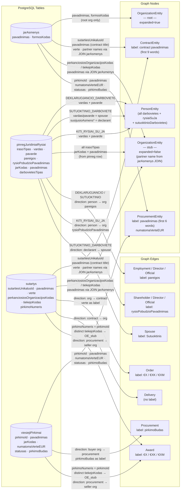
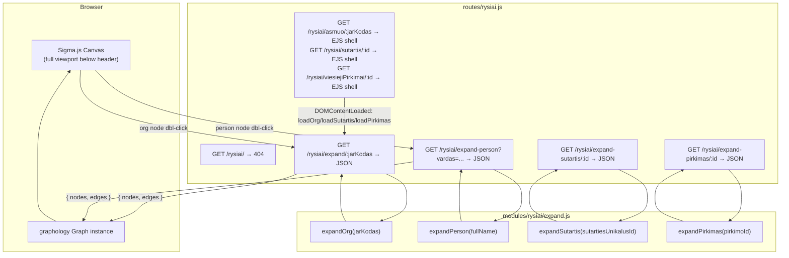
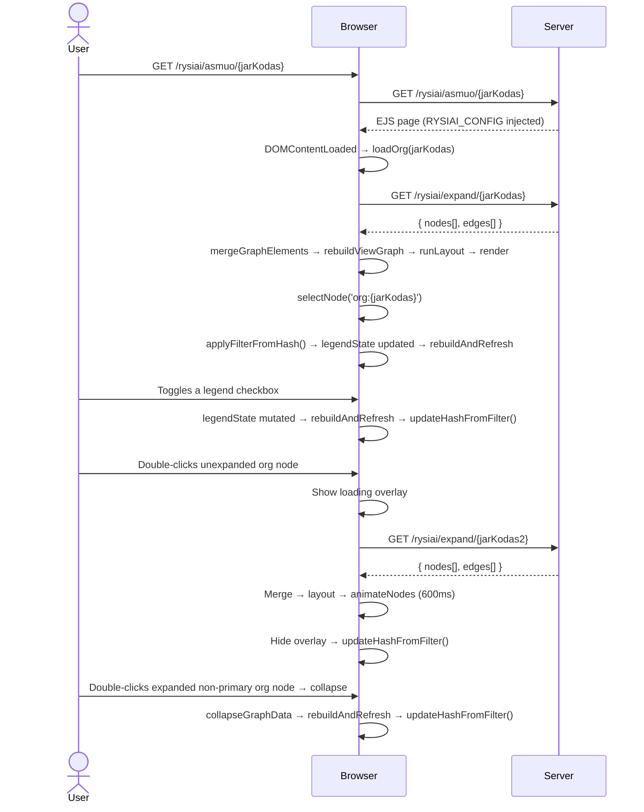

# Ryšiai — Interactive Procurement Network Graph

## Summary

The `/rysiai/` namespace renders an interactive Sigma.js network graph of procurement relationships.
Three typed URL routes open the graph pre-centred on a specific entity:

| URL pattern                             | Center node          |
|-----------------------------------------|----------------------|
| `/rysiai/asmuo/:jarKodas`               | `OrganizationEntity` |
| `/rysiai/sutartis/:sutartiesUnikalusId` | `ContractEntity`     |
| `/rysiai/viesiejiPirkimai/:pirkimoId`   | `ProcurementEntity`  |

Visiting `/rysiai/` without a path segment returns a 404-style "įmonė nenurodyta" page.

The entity that the URL route points to is the **primary node** — it is marked `isRoot: true` in the graph data. The
primary node cannot be collapsed; the expand/collapse button is never shown for it.

If the URL contains a `#filter=` hash on arrival, the filter is applied to the initial node
immediately after it loads. Additional expanded nodes can also be encoded in the hash (see
[URL Hash State Management](#url-hash-state-management)).

Interaction model:

- **Single click** — selects the node and shows its details panel. Clicking the canvas background deselects.
- **Double-click** — expands the node, fetching and merging its connected data into the graph. After expansion
  completes, the hash is updated. If the expansion returns no edges, the legend shows "Ryšių nerasta" instead of a
  collapse button.

The **`#node-details` panel** (top-right overlay, min 200 px / max 240 px) unifies the node details and the edge-type
legend into a single panel. It contains two sub-components:

- **`#rysiai-details`** — type-specific summary of the selected node (title, sub-info, external links).
  For non-primary expandable nodes (e.g. contract with `pirkimoNumeris`) an **"Išskleisti"** / **"Suskleisti"**
  button is rendered here.
- **`#rysiai-legend`** — shown **only when an org/person node is expanded** (`expanded === true`). Contains:
    - **`#rysiai-legend-checkboxes`** — edge-type and contract-size filter checkboxes. Each row shows the **count of
      that relationship type incident to the selected node** (e.g. "Direktorius / vadovas (5)"). Rows where the count
      is **zero are hidden entirely** — no checkbox is shown for a relationship type that does not exist on the node.
      Contract edges are split into three independently-toggleable size rows:
      "Sutartis (maža)" / "(vidutinė)" / "(didelė)" corresponding to `contractSizeCategory` small / medium / large.
    - **`#rysiai-legend-msg`** — shown instead of `#rysiai-legend-checkboxes` when expansion returned no edges:
      displays the text **"Ryšių nerasta"**. The node is still marked `expanded: true` so the legend section remains
      visible and the collapse button is present (for non-primary nodes).
    - **`#rysiai-legend-btn`** — the **"Suskleisti"** (Adjust icon) button for non-primary expanded org/person nodes,
      separated by a border-top. Clicking collapses the node: removes expansion-owned edges and orphaned nodes, resets
      `expanded: false`, hides the legend, and updates the hash.
      The **"Išskleisti"** (Hub icon) button for not-yet-expanded org/person nodes is rendered in `#rysiai-details`
      (legend is hidden when node is not expanded). Hidden automatically on collapse or when a non-expanded node is
      selected. **Never rendered for the primary node (`isRoot: true`).**

MCP is not used for DB queries — direct DB calls are faster and avoid HTTP/SSE overhead; MCP is designed for external AI
clients only.

Stack additions: `sigma@3`, `graphology@0.26`, `graphology-layout-forceatlas2`, `graphology-layout-noverlap`,
`@sigma/node-border`, `@sigma/node-image`. Because these are ESM npm packages targeted at Node, a browser
bundle must be compiled with `esbuild` and served as `public/dist/rysiai.js`.

---

## Technical Breakdown

### Entity & Edge Types

The graph uses the entity and edge model defined in the repository data structures:

| Node type            | Expand trigger                                                             | Source function / data                                                                                                                                                                                                                                                                                                                                                   | Key fields                                                                                                   | Details panel link                                                                             |
|----------------------|----------------------------------------------------------------------------|--------------------------------------------------------------------------------------------------------------------------------------------------------------------------------------------------------------------------------------------------------------------------------------------------------------------------------------------------------------------------|--------------------------------------------------------------------------------------------------------------|------------------------------------------------------------------------------------------------|
| `OrganizationEntity` | Org node double-click                                                      | `jarAsmenys` (root org metadata — `pavadinimas`, `formosKodas`) + `sutartysSaliuSumos JOIN jarAsmenys` (partner org names)                                                                                                                                                                                                                                                       | `jarKodas`, `pavadinimas`, `formosKodas`                                                                     | `/asmuo/{jarKodas}`                                                                            |
| `PersonEntity`       | Org node double-click                                                      | `pinregJuridiniaiRysiai` filtered by `jarKodas` — all `DEKLARUOJANCIO_DARBOVIETE`, `KITI_RYSIAI_SU_JA`, `SUTUOKTINIO_DARBOVIETE` rows                                                                                                                                                                                                                                    | `vardas + pavarde` (name is the identity key), `rysioPradzia`                                                | *(no dedicated page)*                                                                          |
| `PersonEntity`       | Person node double-click                                                   | `pinregJuridiniaiRysiai` filtered by `vardas + pavarde` — returns all darbovietes, governance roles, and spouse relationships for that person                                                                                                                                                                                                                            | Same; all declarations for that name are merged into one node                                                | *(no dedicated page)*                                                                          |
| `ContractEntity`     | Org node double-click (creates node)                                       | `sutartys JOIN jarAsmenys` (top 30 contracts by value; buyer/seller names from `jarAsmenys` JOIN)                                                                                                                                                                                                                                                                                | `sutartiesUnikalusId` (node ID key), `pavadinimas` (contract title), `verte`, `pirkimoNumeris` (may be null) | `/sutartis/{sutartiesUnikalusId}` (primary); `/viesiejiPirkimai/{pirkimoNumeris}` (if present) |
| `ContractEntity`     | Contract node double-click (when `pirkimoNumeris` is present)              | `expandContract(pirkimoNumeris)` — fetches full `ProcurementEntity` node (`viesiejiPirkimai WHERE pirkimoId = $1`) + all winner org stubs (`sutartys GROUP BY tiekejoKodas`) + best-effort loser org stubs (`xlsxPPAataskaitos JOIN xlsxPPAdalyviai WHERE salis='LT'`, only ~425 procurements covered). Client creates the `ContractProcurementLink` edge locally after merge. | Same as above (contract node already in graph)                                                               | *(same, already shown)*                                                                        |
| `ProcurementEntity`  | Org node double-click (buyer) / Contract node double-click (auto-expanded) | Created when buyer org is expanded: `viesiejiPirkimai WHERE jarKodas = $jarKodas ORDER BY numatomaVerteEUR DESC LIMIT 20`. When reached via contract expansion, already fully populated and auto-expanded by `expandContract`.                                                                                                                                           | `pirkimoId` (node ID key), `pavadinimas`, `numatomaVerteEUR`, `statusas`, `pirkimoBudas`                     | `/viesiejiPirkimai/{pirkimoId}`                                                                |

> **`ProcurementEntity` is a hub node.** One procurement notice can result in contracts with multiple
> different winners (32,605 of 37,796 procurements have >1 distinct winner — see `docs/DB_ER.md`).
> The procurement node sits between the buyer org and its award recipients: `BuyerOrg → Procurement →
> [WinnerOrg1, WinnerOrg2, …]`. This is fundamentally different from a `ContractEntity` which is
> always a one-to-one buyer↔seller financial document.
>
> **`ContractEntity.pirkimoNumeris`** links a signed contract back to the originating procurement
> notice. When non-null, clicking the contract node expands it to reveal the procurement hub and all
> participants. **`expanded` starts as `false`** when `pirkimoNumeris` is present; the UI click
> handler uses this flag to trigger `expandContract`. When `pirkimoNumeris` is null, the contract
> node is not expandable and keeps `expanded: true`.
>
> **Loser (Bid) coverage is best-effort.** Loser participant data comes from `xlsxPPAdalyviai` via
> `xlsxPPAataskaitos.pirkimoNumeris`. Only ~425 of 37,797 procurements have PPA data in the DB. When
> no PPA data exists for a procurement, only winner `Award` edges are shown — this is normal and
> expected. `xlsxPPAdalyviai.kodas` maps to `jarAsmenys.jarKodas` for Lithuanian companies (`salis = 'LT'`).
> Foreign bidders are excluded (no jarAsmenys entry).

**Entity ID convention:**

| Entity       | ID format                                                             | Example                 |
|--------------|-----------------------------------------------------------------------|-------------------------|
| Organisation | `org:{jarKodas}`                                                      | `org:110053842`         |
| Person       | `person:{vardas.trim().toLowerCase()} {pavarde.trim().toLowerCase()}` | `person:jonas jonaitis` |
| Contract     | `contract:{sutartiesUnikalusId}`                                      | `contract:2008083561`   |
| Procurement  | `procurement:{pirkimoId}`                                             | `procurement:474742`    |

> **Person identity is name-only.** The same physical person appearing in declarations for different
> organisations will have the same node ID and will be merged into a single graph node automatically
> by graphology's idempotent merge — this is the intended behaviour. `deklaracija` UUIDs are stored
> as a node attribute array (`deklaracijos: string[]`) for audit purposes but are not used as the ID.
> Person nodes must store `vardas` and `pavarde` as separate attributes so the frontend can derive
> the node ID and pass the full name to `expand-person`.

#### Person node expansion — `expandPerson` and `expandOrg` DB mapping

Both functions query `pinregJuridiniaiRysiai` directly — this table stores all pinreg declared
relationships as structured rows, with one row per person↔org link. When a **person node is clicked**,
`expandPerson` filters this table by `vardas + pavarde` (or `susijusioAsmensVardas + susijusioAsmensPavarde`
for spouse relationships), returning all darbovietes, governance roles, and spouse links declared
across every employer that person has ever listed. Each row has an `irasoTipas` classifier that
determines which graph elements to produce:

| `irasoTipas`                | Produces                                                                       | Edge type(s)                                                           |
|-----------------------------|--------------------------------------------------------------------------------|------------------------------------------------------------------------|
| `DEKLARUOJANCIO_DARBOVIETE` | `PersonEntity` (declarant) + `OrganizationEntity` stub                         | `Employment`/`Director`/`Official` — person → org                      |
| `KITI_RYSIAI_SU_JA`         | `PersonEntity` + `OrganizationEntity` stub                                     | `Director`/`Shareholder`/`Official` — person → org                     |
| `SUTUOKTINIO_DARBOVIETE`    | `PersonEntity` (spouse) + `OrganizationEntity` stub + declarant `PersonEntity` | `Employment`/`Director` (spouse → org) + `Spouse` (declarant → spouse) |

| Edge type                               | Direction              | Style           | Source                                                                                                                                                                                                       |
|-----------------------------------------|------------------------|-----------------|--------------------------------------------------------------------------------------------------------------------------------------------------------------------------------------------------------------|
| `Employment` / `Director` / `Official`  | Person → Org           | solid           | `pinregJuridiniaiRysiai` rows with `irasoTipas = DEKLARUOJANCIO_DARBOVIETE`                                                                                                                                  |
| `Employment` / `Director`               | Spouse → Org           | solid           | `pinregJuridiniaiRysiai` rows with `irasoTipas = SUTUOKTINIO_DARBOVIETE`                                                                                                                                     |
| `Shareholder` / `Director` / `Official` | Person → Org           | solid           | `pinregJuridiniaiRysiai` rows with `irasoTipas = KITI_RYSIAI_SU_JA`                                                                                                                                          |
| `Spouse`                                | Person → Person        | solid           | `pinregJuridiniaiRysiai` rows with `irasoTipas = SUTUOKTINIO_DARBOVIETE` (declarant → spouse)                                                                                                                |
| `Order`                                 | Org → Contract         | solid, sized    | `sutartys.topPirkejai` → buyer side                                                                                                                                                                          |
| `Delivery`                              | Contract → Org         | solid, sized    | `sutartys.topTiekejai` → supplier side                                                                                                                                                                       |
| `Procurement`                           | Org → Procurement      | solid           | `viesiejiPirkimai WHERE jarKodas = $jarKodas` — buyer org issued the tender                                                                                                                                  |
| `ContractProcurementLink`               | Contract → Procurement | thin, muted     | Created client-side when a contract node is expanded — links the clicked contract to its procurement hub. Color `#94a3b8`. Size 1.                                                                           |
| `Award`                                 | Procurement → Org      | thin, **green** | `sutartys WHERE pirkimoNumeris = $pirkimoId GROUP BY tiekejoKodas` — winning seller orgs. Color `#22c55e`. Size 1.                                                                                           |
| `Bidder`                                | Procurement → Org      | thin, **red**   | `xlsxPPAataskaitos JOIN xlsxPPAdalyviai WHERE pirkimoNumeris = $pirkimoId AND salis='LT'` — procurement participants who did not win. Color `#ef4444`. Size 1. Best-effort: only ~425 procurements have PPA data. |

> **`irasoTipas` is a record classifier, not a role label.** The three distinct values in the DB are
> `DEKLARUOJANCIO_DARBOVIETE`, `SUTUOKTINIO_DARBOVIETE`, and `KITI_RYSIAI_SU_JA`. They must **never**
> be used as edge labels — they are only used to decide which mapping branch to enter.

#### Data Source → Graph Element Mapping



#### Edge labels

Every edge must carry a visible `label` attribute set at build time in `modules/rysiai/expand.js`:

| Edge type                                                          | `label` value                                                                                                                                                                              |
|--------------------------------------------------------------------|--------------------------------------------------------------------------------------------------------------------------------------------------------------------------------------------|
| `Order` / `Delivery`                                               | Formatted `verte`: `€1.2M`, `€450K`, `€12K`, etc.                                                                                                                                          |
| `Procurement`                                                      | `pirkimoBudas` field (e.g. "Atviras konkursas", "Skelbiama apklausa")                                                                                                                      |
| `Award`                                                            | Formatted `verte` sum (total contract value from that seller for this procurement)                                                                                                         |
| `Bidder`                                                           | *(empty — no label)*                                                                                                                                                                       |
| `ContractProcurementLink`                                          | *(empty — no label)*                                                                                                                                                                       |
| `Employment` / `Director` / `Official` (person or spouse → org)    | `pareigos` field (free-text job title, e.g. "Direktorius", "Gydytojas"). Never `darbovietesTipas` — that field holds `STANDARTINE`, `EKSPERTO`, or `SUTUOKTINIO` and is not human-readable |
| `Director` / `Shareholder` / `Official` (from `KITI_RYSIAI_SU_JA`) | `rysioPobudzioPavadinimas` field (controlled vocabulary, e.g. "Valdybos narys", "Akcininkas")                                                                                              |
| `Spouse`                                                           | `"Sutuoktinis"`                                                                                                                                                                            |

Contract value formatting: expressed as `€XM` (millions, 1 dp), `€XK` (thousands, 0 dp), or `€X` (under 1000).
`null`/`0` values display an empty string.

#### Node labels

Node labels are rendered **below** the node. Long names are word-wrapped at 3 words per line.

| Entity type          | Label source                                  |
|----------------------|-----------------------------------------------|
| `OrganizationEntity` | `pavadinimas`                                 |
| `PersonEntity`       | `vardas + " " + pavarde`                      |
| `ContractEntity`     | `"N sut."` (contract count, e.g. `"17 sut."`) |
| `ProcurementEntity`  | `pavadinimas` (6 words)                       |

Sigma's default label renderer draws labels to the right of the node centre. A custom
`defaultDrawNodeLabel` function positions the label **below** the node.

### Architecture

New server-side module `modules/rysiai/` containing:

- `expand.js` — exported functions:
    - `expandOrg(jarKodas)` — queries `jarAsmenys` (root org metadata), `pinregJuridiniaiRysiai` (person
      relationships), `sutartys JOIN jarAsmenys` (top 30 contracts by value), and `viesiejiPirkimai`
      (top 20 procurement notices by `numatomaVerteEUR`) for this org as **buyer**; maps raw rows to
      `GraphNode[]` and `GraphEdge[]`. Returns `{ nodes, edges }`.
    - `expandPerson(fullName)` — queries `pinregJuridiniaiRysiai` directly, matching on
      `vardas + pavarde` or `susijusioAsmensVardas + susijusioAsmensPavarde`; returns **all
      darbovietes, governance roles, and spouse relationships** declared by that person across all
      employers, as stub `OrganizationEntity` nodes + person↔org / spouse edges.
    - `expandProcurement(pirkimoId)` — queries `sutartys WHERE pirkimoNumeris = $pirkimoId GROUP BY
      tiekejoKodas` to find distinct winning seller orgs + `jarAsmenys JOIN` for their names; returns
      seller `OrganizationEntity` stub nodes + `Award` edges from the procurement node.
    - `expandSutartis(sutartiesUnikalusId)` — queries `sutartys JOIN jarAsmenys` for the single
      contract row; returns the `ContractEntity` node (marked `isRoot: true`) + buyer and seller
      `OrganizationEntity` stub nodes + `Order`/`Delivery` edges. Used when the page opens with a
      contract as the center figure.
    - `expandPirkimas(pirkimoId)` — queries `viesiejiPirkimai JOIN jarAsmenys` for the
      procurement row + buyer org name; delegates to `expandProcurement` for winner/bidder data;
      returns the `ProcurementEntity` node (marked `isRoot: true`, `expanded: true`) + buyer
      `OrganizationEntity` stub + `Procurement` edge + all winner/bidder stubs. Used when the page
      opens with a procurement as the center figure.
    - All functions return `{ nodes: GraphNode[], edges: GraphEdge[] }`.

New route `routes/rysiai.js`:

| Method | Path                                           | Purpose                                                                                           |
|--------|------------------------------------------------|---------------------------------------------------------------------------------------------------|
| `GET`  | `/rysiai/`                                     | Returns 404 ("įmonė nenurodyta") — no entity given                                                |
| `GET`  | `/rysiai/asmuo/:jarKodas`                      | EJS page shell; `RYSIAI_CONFIG = { entityType: 'asmuo', entityId: jarKodas }`                     |
| `GET`  | `/rysiai/sutartis/:sutartiesUnikalusId`        | EJS page shell; `RYSIAI_CONFIG = { entityType: 'sutartis', entityId: sutartiesUnikalusId }`       |
| `GET`  | `/rysiai/viesiejiPirkimai/:pirkimoId`          | EJS page shell; `RYSIAI_CONFIG = { entityType: 'viesiejiPirkimai', entityId: pirkimoId }`         |
| `GET`  | `/rysiai/expand/:jarKodas`                     | JSON: graph nodes+edges for one organisation (calls `expandOrg`)                                  |
| `GET`  | `/rysiai/expand-person`                        | JSON: graph nodes+edges for one person by full name (`?vardas=...`). Calls `expandPerson`.        |
| `GET`  | `/rysiai/expand-procurement/:id`               | JSON: graph nodes+edges for one procurement — its winning seller orgs. Calls `expandProcurement`. |
| `GET`  | `/rysiai/expand-contract/:pirkimoNumeris`      | JSON: procurement hub + winner/loser orgs for a contract. Calls `expandContract`.                 |
| `GET`  | `/rysiai/expand-sutartis/:sutartiesUnikalusId` | JSON: contract + buyer/seller stubs as center load. Calls `expandSutartis`.                       |
| `GET`  | `/rysiai/expand-pirkimas/:pirkimoId`           | JSON: procurement + buyer org + winner/bidder stubs as center load. Calls `expandPirkimas`.       |

> **Route ordering note**: all static path segments (`expand`, `expand-person`, `asmuo`, `sutartis`,
> `viesiejiPirkimai`) must be registered _before_ any wildcard segments.

#### `RYSIAI_CONFIG` — client bootstrap object

`views/rysiai/index.ejs` inlines a `window.RYSIAI_CONFIG` object that tells `rysiai-app.js` which
entity to load on `DOMContentLoaded`:

```js
window.RYSIAI_CONFIG = {
    entityType: 'asmuo' | 'sutartis' | 'viesiejiPirkimai',
    entityId: '<string>',
};
```

`rysiai-app.js` uses this to call the correct initial load:

| `entityType`       | Initial load call            | Initial selected node    |
|--------------------|------------------------------|--------------------------|
| `asmuo`            | `ui.loadOrg(entityId, null)` | `org:{entityId}`         |
| `sutartis`         | `ui.loadSutartis(entityId)`  | `contract:{entityId}`    |
| `viesiejiPirkimai` | `ui.loadPirkimas(entityId)`  | `procurement:{entityId}` |

`loadSutartis` and `loadPirkimas` are public methods on the `createExpandUI` return value, calling
`/rysiai/expand-sutartis/:id` and `/rysiai/expand-pirkimas/:id` respectively and marking the root
node as selected after merge.

### Client-side fetch strategy

The project uses **no data-fetching library** anywhere — all client fetch calls use vanilla
`fetch()` with manual `AbortController`, debouncing, and request-ID sequencing. Node expansion is
**one-shot and idempotent**: once a node is marked `expanded: true`, it is never re-fetched.
Concurrent duplicate clicks on the same unexpanded node are deduplicated with a `Set<nodeId>` of
in-flight requests.

### Structural Diagram



### Behavioral Diagram



---

## Components

### Module File Tree

```
modules/rysiai/
└── expand.js              Server — expandOrg · expandPerson · expandProcurement
                                    expandContract · expandSutartis · expandPirkimas

routes/
└── rysiai.js              Server — Express router; page routes + JSON API endpoints

views/rysiai/
└── index.ejs              View   — HTML shell; #node-details panel; RYSIAI_CONFIG inline script

src/
├── rysiai-bundle.js       Client — esbuild entry; bundles sigma/graphology/layouts → window.Rysiai
├── rysiai-app.js          Client — esbuild entry; creates dataGraph + viewGraph; wires
│                                   DOMContentLoaded dispatch + hash apply/update
└── rysiai/
    ├── entity-types.ts    Client — ENTITY_TYPE constants; NodeAttrs interface; isOrgNode / isPersonNode
    │                               / isContractNode / isProcurementNode predicates
    ├── graph-theme.ts     Client — NODE_COLOR · EDGE_COLOR · HIDDEN_BY_DEFAULT · nodeColor
    │                               · personelSize · contractSize · edgeWeight · icon paths  (no DOM)
    ├── renderers.ts       Client — drawNodeLabel · drawNodeHover  (canvas ctx injected)
    ├── graph-utils.ts     Client — mergeGraphElements · rebuildViewGraph · syncPositionsToData
    │                               · runLayout  (pure, injected deps, no DOM ★ testable)
    ├── legend.ts          Client — NodeLegend.updateForNode; renders counts; hides zero-count rows;
    │                               shows "Ryšių nerasta" when expansion returned no edges  (DOM)
    ├── legend-state.ts    Client — LegendState; initNode · setTypeVisible · isEdgeHidden  (no DOM)
    ├── hash-state.ts      Client — FILTER_ID_MAP · FILTER_CHAR_MAP;
    │                               applyFilterFromHash · updateHashFromFilter  (pure, writes hash)
    ├── details-panel.ts   Client — NodeDetails; renders #rysiai-details content per entity type  (DOM)
    └── expand-ui.ts       Client — createExpandUI({...}); loadOrg · loadSutartis · loadPirkimas;
                                    returns rebuildAndRefresh callback  (DOM)

public/dist/
├── rysiai.js              Built  — esbuild output of rysiai-bundle.js
└── rysiai-app.js          Built  — esbuild output of src/rysiai-app.js

test/rysiai/
├── expand.test.ts         Test   — server-side pure helpers
├── graph-utils.test.ts    Test   — mergeGraphElements · rebuildViewGraph · syncPositionsToData
├── graph-theme.test.ts    Test   — personelSize · contractSize · edgeWeight
├── legend-state.test.ts   Test   — LegendState; initNode · setTypeVisible · isEdgeHidden
└── hash-state.test.ts     Test   — applyFilterFromHash · updateHashFromFilter · roundtrip
```

**Visual identity — node colours and icons:**

| Entity type          | `NODE_COLOR` key | Hex       | Icon (MUI)                            | Icon key                                           |
|----------------------|------------------|-----------|---------------------------------------|----------------------------------------------------|
| `OrganizationEntity` | `org`            | `#3b82f6` | Business / DomainAdd / AccountBalance | `PrivateCompany` / `PublicCompany` / `Institution` |
| `OrganizationEntity` | `orgStub`        | `#9ca3af` | Business                              | same                                               |
| `PersonEntity`       | `person`         | `#f97316` | Person                                | `Person`                                           |
| `ContractEntity`     | `contract`       | `#10b981` | HistoryEdu                            | `Contract`                                         |
| `ProcurementEntity`  | `procurement`    | `#8b5cf6` | Gavel                                 | `Procurement`                                      |

`ProcurementEntity` uses **purple** (`#8b5cf6`) — distinct from all current node colours. `EDGE_COLOR` entries:

| Edge type                 | Color     | Meaning                                    |
|---------------------------|-----------|--------------------------------------------|
| `Procurement`             | `#8b5cf6` | Org → Procurement                          |
| `ContractProcurementLink` | `#94a3b8` | Contract → Procurement (thin, muted slate) |
| `Award`                   | `#22c55e` | Procurement → winner org (green)           |
| `Bidder`                  | `#ef4444` | Procurement → loser/participant org (red)  |

### Edge Visibility Rules

`isEdgeHidden(source, target, type)` in `src/rysiai/legend-state.ts` decides whether an edge appears in `viewGraph`. The
rule is **any-visible-wins**: if either endpoint is configured to show the type, the edge is drawn.

| Source configured? | Target configured? | Source shows type? | Target shows type? | Edge visible?  |
|--------------------|--------------------|--------------------|--------------------|----------------|
| No                 | No                 | —                  | —                  | Global default |
| Yes                | No (transparent)   | Yes                | —                  | **Yes**        |
| Yes                | No (transparent)   | No                 | —                  | No             |
| No (transparent)   | Yes                | —                  | Yes                | **Yes**        |
| No (transparent)   | Yes                | —                  | No                 | No             |
| Yes                | Yes                | Yes                | Yes                | **Yes**        |
| Yes                | Yes                | Yes                | No                 | **Yes**        |
| Yes                | Yes                | No                 | Yes                | **Yes**        |
| Yes                | Yes                | No                 | No                 | No             |

Key invariants:

- **Both configured, either shows → visible.** A Spouse edge between Alenas (Spouse visible) and Toma (Spouse hidden) is
  always drawn.
- **Both configured, both hide → hidden.** Only unanimous agreement to hide suppresses the edge.
- **One transparent endpoint is a "don't care"** — it never contributes to hiding.
- **Neither configured** → falls back to the global `HIDDEN_BY_DEFAULT` set (pre-selection state).

`HIDDEN_BY_DEFAULT` (in `src/rysiai/graph-theme.ts`): `Official`, `Employment`, `Spouse` are hidden on initial render.

---

### Two-graph design

A `dataGraph` (permanent store) and a `viewGraph` (Sigma's rendered graph) are maintained separately:

- `dataGraph` — holds **all** fetched nodes and edges unconditionally. Updated only on expand fetches. Never passed to
  Sigma.
- `viewGraph` — passed to `new Sigma(viewGraph, ...)`. Rebuilt by
  `rebuildViewGraph(dataGraph, viewGraph, hiddenEdgeTypes)` after every expand or legend toggle.

**Anchor rule**: a node is always kept in `viewGraph` when
`attrs.expanded === true && attrs.entityType !== 'ContractEntity'`. ContractEntity nodes are not anchors and disappear
when all `Order`/`Delivery` edges are hidden.

**`rebuildViewGraph`**: computes the visible node set (anchors + nodes incident to non-hidden-type edges), syncs
nodes/edges in `viewGraph`, restores saved `x`/`y` from `dataGraph` when re-adding nodes, returns newly added node IDs
for `animateNodes`.

**`syncPositionsToData`**: after every layout pass, copies `x`/`y` from `viewGraph` → `dataGraph` so positions survive
the next rebuild.

**Animation cancel token**: `animateNodes` returns a cancel function stored in `cancelAnimation`. It is called before
each `rebuildViewGraph` to prevent writing attributes to nodes that were just dropped from `viewGraph`.

---

### Node and edge sizing

**Org node size** — computed client-side from raw sodra fields stored in node attributes:
`Math.max(bendrasDraustujuSkaicius, draustieji, draustieji2, 1)` where
`bendrasDraustujuSkaicius = draustieji + draustieji2` (computed client-side, not a DB column).

| Personnel | Node size |
|-----------|-----------|
| < 10      | 8         |
| 10–49     | 13        |
| 50–199    | 15        |
| ≥ 200     | 20        |

**Contract / Procurement node size** (`contractSize`) and **Order / Delivery edge weight** (`edgeWeight`):

| Value         | Node size | Edge `size` |
|---------------|-----------|-------------|
| < €100 K      | 8         | 1           |
| €100 K – €1 M | 13        | 3           |
| ≥ €1 M        | 19        | 6           |

Person nodes keep a fixed `size: 8`.

### "Ryšių nerasta" — empty expansion

When a node is expanded and the server returns **zero edges**, the node is still marked `expanded: true` and the
`#rysiai-legend` section is shown. However, instead of the checkbox list and collapse button, only the message
**"Ryšių nerasta"** is displayed inside `#rysiai-legend-msg`. For non-primary nodes the collapse button
(`#rysiai-legend-btn`) is still rendered below the message so the user can reset the node state.

---

## URL Hash State Management

The URL hash encodes the active filter and any additionally-expanded entities so that the graph state
can be bookmarked and shared. Hash is **read on page load** (`applyFilterFromHash`) and **written
after every filter change, node expand, or node collapse** (`updateHashFromFilter`).

### Filter ID ↔ Edge type mapping

Each edge type is represented by a single ASCII character in the hash string:

| `data-edge-types`         | Label                  | Filter char |
|:--------------------------|:-----------------------|:------------|
| `Director`                | Direktorius / vadovas  | `D`         |
| `Shareholder`             | Akcininkas             | `S`         |
| `Official`                | Pareigūnas / oficialus | `O`         |
| `Employment`              | Darbuotojas            | `E`         |
| `Spouse`                  | Sutuoktinis            | `U`         |
| `ContractSmall`           | Sutartis (maža)        | `L`         |
| `ContractMedium`          | Sutartis (vidutinė)    | `M`         |
| `ContractLarge`           | Sutartis (didelė)      | `G`         |
| `Procurement`             | Pirkimo skelbimas      | `P`         |
| `Award`                   | Pirkimo laimėtojas     | `A`         |
| `Bidder`                  | Pirkimo dalyvis        | `B`         |
| `ContractProcurementLink` | Sutartis → pirkimas    | `C`         |

`f=DSO` means Director + Shareholder + Official are **visible**; all other edge types are
**hidden** for that node. A missing filter's `f` key means the node's visibility state is left at its
default (from `HIDDEN_BY_DEFAULT`).

### Entity ↔ Mapping

| Entity Type          | Entity Type Key | URL ID              | Entity Reference         |
|----------------------|-----------------|---------------------|--------------------------|
| `OrganizationEntity` | `o`             | `/asmuo`            | `jarKodas`               |
| `ContractEntity`     | `c`             | `/sutartis`         | `sutartiesUnikalusId`    |
| `ProcurementEntity`  | `r`             | `/viesiejiPirkimai` | `pirkimoId`              |
| `PersonEntity`       | `p`             | *(not supported)*   | base64(vardas + pavarde) |

### Hash format

```
#f=<chars>[&<Entity Type Key>_<N>=<Entity Reference>&f_<N>=<chars>...]
```

- `f` (filter) — comma-free string of filter chars for the **primary** (initial) node.
- Additional expanded nodes use `<Entity Type Key>_<N>=<Entity Reference>` keys where:
    - `<Entity Type Key>` ∈ `{ o, c, r, p }`
    - `<N>` is a positive integer that also keys `f_<N>` for that node's filter state
    - `<Entity Reference>` is the entity's database ID, except for `PersonEntity` where it is a base64-encoded
      `vardas + pavarde` string (to avoid ambiguity and URL encoding issues with names)

Examples:

```
/rysiai/asmuo/110078991#f=DSO
/rysiai/asmuo/110078991#f=DSO&o_2=110078992&f_2=LMG
/rysiai/asmuo/110078991#f=DSOELM&c_2=2008083561&f_2=LG&o_3=110055123&f_3=DS
```

### `src/rysiai/hash-state.ts`

Pure module — no DOM reads; only writes `window.location.hash`.

```ts
// Maps filter char → edge type name
export const FILTER_CHAR_MAP: Record<string, string> = {
    D: 'Director', S: 'Shareholder', O: 'Official', E: 'Employment',
    U: 'Spouse', L: 'ContractSmall', M: 'ContractMedium', G: 'ContractLarge',
    P: 'Procurement', A: 'Award', B: 'Bidder', C: 'ContractProcurementLink'
};

// Maps edge type name → filter char
export const FILTER_ID_MAP = Object.fromEntries(Object.entries(FILTER_CHAR_MAP).map(([k, v]) => [v, k]));
```

#### `applyFilterFromHash(legendState, primaryNodeId)`

Parses `window.location.hash`, validates keys/values (entity type keys must be `o`/`c`/`r`/`p`; IDs
must be numeric for orgs/contracts/procurements or valid base64 for persons), applies visible/hidden
state for the primary node, and returns
`{ additionalEntities: Array<{ entityType, entityId, filterChars, entityNumber }> }` so `rysiai-app.js`
can load them sequentially after the primary entity.

#### `updateHashFromFilter(legendState, dataGraph)`

Collects all nodes in `dataGraph` with an explicit `legendState` entry, derives each node's filter
string from its visible edge types, and writes the assembled hash to `window.location.hash`. The
primary node (marked `isRoot: true`) emits `f=<chars>`; additional nodes emit
`<typeKey>_<N>=<entityId>&f_<N>=<chars>`. Sets hash to empty string if no nodes are configured.

---

## Time Dimension

### Node Time Fields

Lifespan logic: **earliest start field → latest end field** = actual duration of the entity's lifespan on the graph
timeline. Each entity will have `fromDate` and `toDate` attributes computed from the following fields. If no end date
is found, the entity is treated as still active (open-ended).

| Node type            | DB table                 | Start fields                                                                          | Possible end fields, If not found, the treat as not ended                        | Notes                                                                                                                                                                                                 |
|----------------------|--------------------------|---------------------------------------------------------------------------------------|----------------------------------------------------------------------------------|-------------------------------------------------------------------------------------------------------------------------------------------------------------------------------------------------------|
| `OrganizationEntity` | `jarAsmenys`                 | `registravimoData` (100% filled)                                                      | `statusasNuo` (100% filled — "status since")                                     | `registravimoData` → `statusasNuo` = org lifespan, but only when `statusoKodas ≠ 0` (inactive). Active orgs have no closing date — treat as open-ended.                                               |
| `PersonEntity`       | `pinregJuridiniaiRysiai` | `rysioPradzia` (100% filled) — one row per relationship; take **min** across all rows | `rysioPabaiga` (~0.6% filled, very sparse) — take **max** across all rows        | Time lives on relationship rows, not the person node. min(`rysioPradzia`) → max(`rysioPabaiga` or `rysioPradzia`) = known active period. Most persons appear open-ended due to sparse `rysioPabaiga`. |
| `ContractEntity`     | `sutartys`               | `sudarymoData` (~100% filled), `paskelbimoData` (~100% filled) — take **min**         | `galiojimoData` (~100% filled), `faktineIvykdimoData` (7% filled) — take **max** | min(`sudarymoData`, `paskelbimoData`) → max(`galiojimoData`, `faktineIvykdimoData`) = contract lifespan. `faktineIvykdimoData` extends the window only when present.                                  |
| `ProcurementEntity`  | `viesiejiPirkimai`       | `paskelbimoData` (100% filled)                                                        | `pasiulymuPateikimoTerminas` (98% filled)                                        | `paskelbimoData` → `pasiulymuPateikimoTerminas` = procurement active period. End marks bid submission deadline, not contract award.                                                                   |

### Edge Time Fields

Edges carry `fromDate` and `toDate` (`YYYY-MM-DD`, no time component, `null` when unavailable). For relationship edges
the dates come from the individual pinreg row — not aggregated across all rows for that person.

| Edge type                                              | DB table                 | `fromDate`                                                | `toDate`                                              | Notes                                                                                           |
|--------------------------------------------------------|--------------------------|-----------------------------------------------------------|-------------------------------------------------------|-------------------------------------------------------------------------------------------------|
| `Employment` / `Director` / `Official` / `Shareholder` | `pinregJuridiniaiRysiai` | `rysioPradzia` of the row (100% filled)                   | `rysioPabaiga` of the row (~0.6% filled)              | Per-row, not aggregated. Each edge represents one declared relationship with its own start/end. |
| `Spouse`                                               | `pinregJuridiniaiRysiai` | `rysioPradzia` of the declaration row                     | `rysioPabaiga` of the declaration row                 | Currently stored as `null`; same row carries the dates — can be populated.                      |
| `Order`                                                | `sutartys`               | mirrors `ContractEntity` `fromDate` (min of start fields) | mirrors `ContractEntity` `toDate` (max of end fields) | Edge lifespan equals the contract lifespan.                                                     |
| `Delivery`                                             | `sutartys`               | mirrors `ContractEntity` `fromDate`                       | mirrors `ContractEntity` `toDate`                     | Same contract row as `Order`.                                                                   |
| `Procurement`                                          | `viesiejiPirkimai`       | `paskelbimoData`                                          | `pasiulymuPateikimoTerminas`                          | Mirrors the `ProcurementEntity` node dates.                                                     |
| `Award`                                                | `sutartys`               | mirrors winning `ContractEntity` `fromDate`               | mirrors winning `ContractEntity` `toDate`             | Each award edge spans the winning contract's lifespan.                                          |
| `Bidder`                                               | `xlsxPPAdalyviai`       | `null`                                                    | `null`                                                | No date columns in `xlsxPPAdalyviai`; always open-ended.                                       |
| `ContractProcurementLink`                              | *(client-side)*          | mirrors `ContractEntity` `fromDate`                       | mirrors `ContractEntity` `toDate`                     | Client-created link; inherits from the contract node already in the graph.                      |

---

## Smoke Test URLs

```
http://localhost:9019/rysiai/asmuo/188752740#f=DSELMGPABC&p_2=RUdMJUM0JTk2JTIwUE9WSUxJJUM1JUFBTiVDNCU5Ng==&f_2=DSEULMGPABC
http://localhost:9019/rysiai/asmuo/300015158#f=DSLMGPABC&p_2=SlVTVEFTJTIwVFJVTkMlQzQlOTY=&f_2=DSOEULMGPABC&p_3=QUdOJUM0JTk2JTIwVFJVTkNJRU4lQzQlOTY=&f_3=DSOEULMGPABC&p_4=QVVSSU1BUyUyMFRSVU5DJUM0JTk2&f_4=DSOEULMGPABC&p_5=U09MVkVJR0ElMjBUUlVOQ0lFTiVDNCU5Ng==&f_5=DSOEULMGPABC&o_6=301550690&f_6=DSLMGPABC
```
